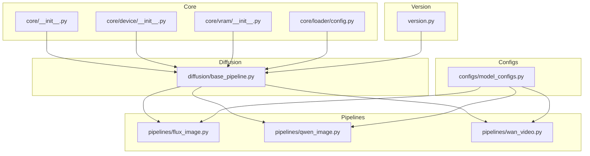
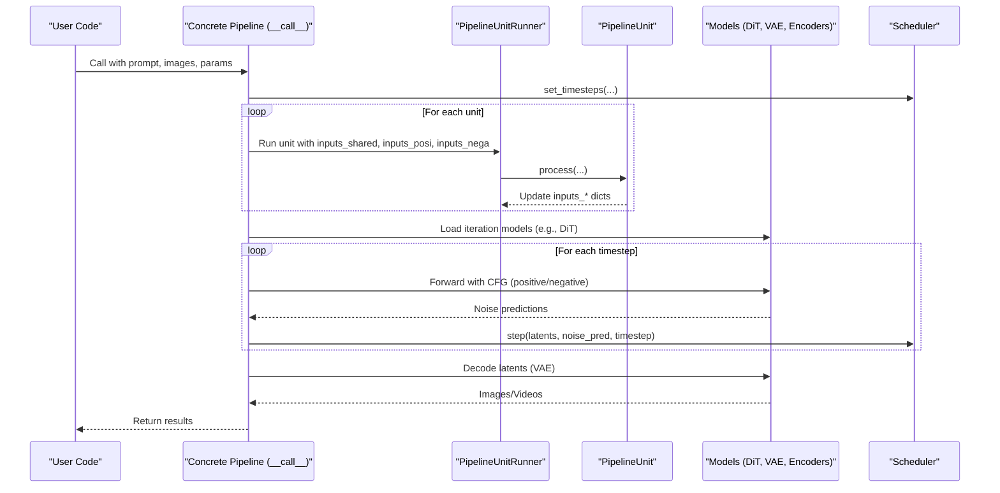
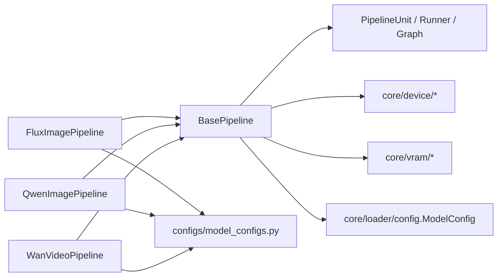

# API Reference

<cite>
**Referenced Files in This Document**
- [base_pipeline.py](file://diffsynth/diffusion/base_pipeline.py)
- [flux_image.py](file://diffsynth/pipelines/flux_image.py)
- [qwen_image.py](file://diffsynth/pipelines/qwen_image.py)
- [wan_video.py](file://diffsynth/pipelines/wan_video.py)
- [model_configs.py](file://diffsynth/configs/model_configs.py)
- [config.py](file://diffsynth/core/loader/config.py)
- [__init__.py](file://diffsynth/core/__init__.py)
- [device_init.py](file://diffsynth/core/device/__init__.py)
- [vram_init.py](file://diffsynth/core/vram/__init__.py)
- [version.py](file://diffsynth/version.py)
</cite>

## Table of Contents
1. [Introduction](#introduction)
2. [Project Structure](#project-structure)
3. [Core Components](#core-components)
4. [Architecture Overview](#architecture-overview)
5. [Detailed Component Analysis](#detailed-component-analysis)
6. [Dependency Analysis](#dependency-analysis)
7. [Performance Considerations](#performance-considerations)
8. [Troubleshooting Guide](#troubleshooting-guide)
9. [Conclusion](#conclusion)
10. [Appendices](#appendices)

## Introduction
This document provides a comprehensive API reference for ODTSR-edit, focusing on the public interfaces exposed by the DiffSynth framework used within this repository. It covers:
- The BasePipeline class and its unit-driven execution model
- Concrete pipeline implementations for image and video generation/editing (Flux Image, Qwen Image, Wan Video)
- Model configuration via ModelConfig and model registry entries
- Utility functions for device handling, VRAM management, and LoRA loading
- Version information and compatibility notes

The goal is to enable both new users and advanced developers to understand how to construct pipelines, configure models, and extend functionality with minimal friction.

## Project Structure
At a high level, the relevant code is organized as follows:
- Core abstractions and utilities live under diffsynth/core
- Pipeline implementations live under diffsynth/pipelines
- Model definitions live under diffsynst/models
- Model configuration registries live under diffsynth/configs
- Version metadata lives at diffsynth/version.py

**Diagram sources**
- [__init__.py:1-7](file://diffsynth/core/__init__.py#L1-L7)
- [device_init.py:1-3](file://diffsynth/core/device/__init__.py#L1-L3)
- [vram_init.py:1-3](file://diffsynth/core/vram/__init__.py#L1-L3)
- [config.py:1-120](file://diffsynth/core/loader/config.py#L1-L120)
- [base_pipeline.py:1-501](file://diffsynth/diffusion/base_pipeline.py#L1-L501)
- [flux_image.py:1-800](file://diffsynth/pipelines/flux_image.py#L1-L800)
- [qwen_image.py:1-200](file://diffsynth/pipelines/qwen_image.py#L1-L200)
- [wan_video.py:1-200](file://diffsynth/pipelines/wan_video.py#L1-L200)
- [model_configs.py:1-800](file://diffsynth/configs/model_configs.py#L1-L800)
- [version.py:1-5](file://diffsynth/version.py#L1-L5)

**Section sources**
- [__init__.py:1-7](file://diffsynth/core/__init__.py#L1-L7)
- [device_init.py:1-3](file://diffsynth/core/device/__init__.py#L1-L3)
- [vram_init.py:1-3](file://diffsynth/core/vram/__init__.py#L1-L3)
- [config.py:1-120](file://diffsynth/core/loader/config.py#L1-L120)
- [base_pipeline.py:1-501](file://diffsynth/diffusion/base_pipeline.py#L1-L501)
- [flux_image.py:1-800](file://diffsynth/pipelines/flux_image.py#L1-L800)
- [qwen_image.py:1-200](file://diffsynth/pipelines/qwen_image.py#L1-L200)
- [wan_video.py:1-200](file://diffsynth/pipelines/wan_video.py#L1-L200)
- [model_configs.py:1-800](file://diffsynth/configs/model_configs.py#L1-L800)
- [version.py:1-5](file://diffsynth/version.py#L1-L5)

## Core Components
This section documents the foundational classes and utilities that power all pipelines.

### BasePipeline
BasePipeline is the central abstraction for diffusion-based pipelines. It provides:
- Device and dtype management for intermediate tensors
- Shape validation helpers for height, width, and time dimensions
- Preprocessing utilities for images and videos
- Latent noise generation
- VRAM-aware model loading/unloading
- CFG-guided inference orchestration
- Optional torch.compile integration
- LoRA loading/clearing

Key methods and behaviors:
- Initialization parameters include device, torch_dtype, and division factors for shape checks
- to() overrides device/dtype tracking for intermediates
- check_resize_height_width() rounds inputs to required multiples
- preprocess_image/preprocess_video convert PIL inputs to tensors with normalization and pattern broadcasting
- vae_output_to_image/vae_output_to_video decode tensors back to media
- generate_noise() creates reproducible Gaussian noise
- load_models_to_device() offloads/onloads modules based on vram_management_enabled
- cfg_guided_model_fn() handles positive/negative prompts and optional positive-only LoRA
- compile_pipeline() compiles selected models using torch.compile
- download_and_load_models() uses ModelPool to auto-load models from ModelConfig entries
- freeze_except() enables training on specific modules while freezing others
- blend_with_mask() supports inpainting blending
- step() advances latents through scheduler steps with optional inpaint mask blending

Usage patterns:
- Subclass BasePipeline to define units and model components
- Use from_pretrained() in concrete pipelines to assemble models via ModelConfig
- Invoke __call__() to run the full pipeline

**Section sources**
- [base_pipeline.py:1-501](file://diffsynth/diffusion/base_pipeline.py#L1-L501)

### PipelineUnit and Execution Graph
PipelineUnit defines a composable stage in the pipeline:
- input_params, output_params specify data flow
- seperate_cfg toggles separate positive/negative processing
- take_over allows custom control over the unit’s execution
- onload_model_names triggers selective model loading for efficiency

PipelineUnitGraph computes dependencies and splits units into related/unrelated sets for targeted computation.

PipelineUnitRunner executes units according to their flags and updates shared/positive/negative input dictionaries.

**Section sources**
- [base_pipeline.py:1-501](file://diffsynth/diffusion/base_pipeline.py#L1-L501)

### ModelConfig
ModelConfig encapsulates model metadata and loading behavior:
- path or model_id + origin_file_pattern to locate weights
- download_source selection between modelscope and huggingface
- skip_download environment override
- VRAM-related settings for offload/onload/computation devices and dtypes
- clear_parameters flag to free memory after loading
- state_dict injection for in-memory weights

Methods:
- download_if_necessary() ensures files are present and resolves path(s)
- vram_config() returns a dict consumed by the model loader

**Section sources**
- [config.py:1-120](file://diffsynth/core/loader/config.py#L1-L120)

### Device Utilities
Device helpers expose:
- parse_device_type(), get_available_device_type(), get_device_name()
- IS_NPU_AVAILABLE, IS_CUDA_AVAILABLE flags

These are used throughout BasePipeline and pipelines to select appropriate backend behavior.

**Section sources**
- [device_init.py:1-3](file://diffsynth/core/device/__init__.py#L1-L3)

### VRAM Management
VRAM module exposes:
- skip_model_initialization() to bypass heavy initialization when needed
- AutoWrappedLinear and other layers enabling hot-swappable LoRA and VRAM-aware operations

**Section sources**
- [vram_init.py:1-3](file://diffsynth/core/vram/__init__.py#L1-L3)

### Version Information
- __version__ and __release_datetime__ provide version metadata for compatibility checks and logging.

**Section sources**
- [version.py:1-5](file://diffsynth/version.py#L1-L5)

## Architecture Overview
The system follows a modular architecture:
- BasePipeline orchestrates inference via PipelineUnits
- Concrete pipelines (FluxImagePipeline, QwenImagePipeline, WanVideoPipeline) implement model-specific logic and unit chains
- ModelConfig drives automatic downloading and loading of model components
- Device and VRAM utilities ensure cross-device compatibility and efficient memory usage

**Diagram sources**
- [base_pipeline.py:1-501](file://diffsynth/diffusion/base_pipeline.py#L1-L501)
- [flux_image.py:1-800](file://diffsynth/pipelines/flux_image.py#L1-L800)
- [qwen_image.py:1-200](file://diffsynth/pipelines/qwen_image.py#L1-L200)
- [wan_video.py:1-200](file://diffsynth/pipelines/wan_video.py#L1-L200)

## Detailed Component Analysis

### BasePipeline API Reference
- Constructor
  - Parameters: device, torch_dtype, height_division_factor, width_division_factor, time_division_factor, time_division_remainder
  - Behavior: Initializes device/dtype, shape constraints, VRAM flags, unit runner, LoRA loader
- Methods
  - to(device, dtype, ...) -> self
  - check_resize_height_width(height, width, num_frames=None, verbose=1) -> tuple
  - preprocess_image(image, torch_dtype=None, device=None, pattern="B C H W", min_value=-1, max_value=1) -> Tensor
  - preprocess_video(video, torch_dtype=None, device=None, pattern="B C T H W", min_value=-1, max_value=1) -> Tensor
  - vae_output_to_image(vae_output, pattern="B C H W", min_value=-1, max_value=1) -> PIL.Image
  - vae_output_to_video(vae_output, pattern="B C T H W", min_value=-1, max_value=1) -> list[PIL.Image]
  - output_audio_format_check(audio_output) -> Tensor
  - load_models_to_device(model_names)
  - generate_noise(shape, seed=None, rand_device="cpu", rand_torch_dtype=torch.float32, device=None, torch_dtype=None) -> Tensor
  - get_vram() -> float (GB)
  - get_module(model, name) -> Module
  - freeze_except(model_names)
  - blend_with_mask(base, addition, mask) -> Tensor
  - step(scheduler, latents, progress_id, noise_pred, input_latents=None, inpaint_mask=None, **kwargs) -> Tensor
  - split_pipeline_units(model_names: list[str]) -> tuple[list[PipelineUnit], list[PipelineUnit]]
  - flush_vram_management_device(device)
  - load_lora(module, lora_config=None, alpha=1, hotload=None, state_dict=None, verbose=1)
  - clear_lora(verbose=1)
  - download_and_load_models(model_configs=[], vram_limit=None) -> ModelPool
  - check_vram_management_state() -> bool
  - cfg_guided_model_fn(model_fn, cfg_scale, inputs_shared, inputs_posi, inputs_nega, **inputs_others) -> Tensor|tuple
  - compile_pipeline(mode="default", dynamic=True, fullgraph=False, compile_models=None, **kwargs)

Usage example (conceptual):
- Instantiate a concrete pipeline via from_pretrained(...)
- Call __call__(...) with desired parameters
- Optionally call compile_pipeline(...) for acceleration
- Use load_lora(...) for style/content adaptation

**Section sources**
- [base_pipeline.py:1-501](file://diffsynth/diffusion/base_pipeline.py#L1-L501)

### FluxImagePipeline API Reference
- Constructor
  - Parameters: device, torch_dtype
  - Sets scheduler, tokenizers, text encoders, DiT, VAE encoder/decoder, ControlNet, IP-Adapter, value controller, NexusGen adapters, LoRA patcher/encoder
  - Defines units chain and compilable models
- Factory method
  - from_pretrained(torch_dtype, device, model_configs, tokenizer_1_config, tokenizer_2_config, nexus_gen_processor_config, step1x_processor_config, vram_limit)
- Inference method
  - __call__(prompt, negative_prompt, cfg_scale, embedded_guidance, t5_sequence_length, input_image, denoising_strength, height, width, seed, rand_device, sigma_shift, num_inference_steps, kontext_images, controlnet_inputs, ipadapter_images, ipadapter_scale, eligen_entity_prompts, eligen_entity_masks, eligen_enable_on_negative, eligen_enable_inpaint, infinityou_id_image, infinityou_guidance, flex_inpaint_image, flex_inpaint_mask, flex_control_image, flex_control_strength, flex_control_stop, value_controller_inputs, step1x_reference_image, nexus_gen_reference_image, lora_encoder_inputs, lora_encoder_scale, tea_cache_l1_thresh, tiled, tile_size, tile_stride, progress_bar_cmd)
- Additional features
  - enable_lora_merger() integrates LoRA merger for VRAM-managed modules

Notes:
- Units handle shape checks, noise init, prompt embedding, input image embedding, guidance, Kontext, InfiniteYou, ControlNet, IP-Adapter, entity control, NexusGen, TeaCache, Flex, Step1x, ValueControl, LoRAEncode
- CFG guided model function supports positive-only LoRA injection

**Section sources**
- [flux_image.py:1-800](file://diffsynth/pipelines/flux_image.py#L1-L800)

### QwenImagePipeline API Reference
- Constructor
  - Parameters: device, torch_dtype
  - Sets scheduler, text encoder, DiT, VAE, blockwise ControlNet, tokenizer, image encoders, image2LoRA models, processor
  - Defines units chain and compilable models
- Factory method
  - from_pretrained(torch_dtype, device, model_configs, tokenizer_config, processor_config, vram_limit)
- Inference method
  - __call__(prompt, negative_prompt, cfg_scale, input_image, denoising_strength, inpaint_mask, inpaint_blur_size, inpaint_blur_sigma, height, width, seed, rand_device, num_inference_steps, exponential_shift_mu, blockwise_controlnet_inputs, eligen_entity_prompts, eligen_entity_masks, eligen_enable_on_negative, edit_image, edit_image_auto_resize, edit_rope_interpolation, zero_cond_t, layer_input_image, layer_num, context_image, tiled, tile_size, tile_stride, progress_bar_cmd)

Notes:
- Supports blockwise ControlNet, layered inputs, in-context control, and multiple editing modes
- Returns either single image or list of images depending on layer_num

**Section sources**
- [qwen_image.py:1-200](file://diffsynth/pipelines/qwen_image.py#L1-L200)

### WanVideoPipeline API Reference
- Constructor
  - Parameters: device, torch_dtype
  - Sets scheduler, tokenizer, audio processor, text/image encoders, DiT(s), VAE, motion controller, VACE, APM, animate adapter, audio encoder
  - Defines units and post-units chain; supports two-stage DiTs
- Factory method
  - from_pretrained(torch_dtype, device, model_configs, tokenizer_config, audio_processor_config, redirect_common_files, use_usp, vram_limit)
- Inference method
  - __call__(prompt, negative_prompt, input_image, end_image, input_video, ...)
- Features
  - enable_usp() activates unified sequence parallelism for large-scale inference
  - Supports many video tasks: text-to-video, image-to-video, first-last frame interpolation, camera control, speed control, motion control, animation adapters

**Section sources**
- [wan_video.py:1-200](file://diffsynth/pipelines/wan_video.py#L1-L200)

### Model Configuration Registry
The model_configs.py file defines series of supported models with:
- model_hash: integrity verification
- model_name: internal identifier
- model_class: fully qualified Python class
- state_dict_converter: optional converter for compatible formats
- extra_kwargs: model-specific constructor arguments

Examples include:
- qwen_image_series: DiT, text encoder, VAE, ControlNet variants, image encoders, image2LoRA models
- wan_series: DiT variants, text encoders, VAEs, motion controllers, VACE, audio encoders
- flux_series: DiT, text encoders (CLIP/T5), VAE encoder/decoder, ControlNet, IP-Adapter, LoRA encoder/patcher, NexusGen adapters
- flux2_series: Text encoder, DiT, VAE
- ernie_image_series: DiT, text encoder
- z_image_series: DiT, text encoder, VAE encoder/decoder, ControlNet, image2LoRA
- ltx2_series: DiT, video/audio VAEs, vocoder, text encoder, latent upsampler

Usage:
- Pass a list of ModelConfig objects to download_and_load_models(...)
- Each entry can specify local paths or remote model IDs with file patterns

**Section sources**
- [model_configs.py:1-800](file://diffsynth/configs/model_configs.py#L1-L800)

## Dependency Analysis
The following diagram shows key dependencies among core components:

**Diagram sources**
- [base_pipeline.py:1-501](file://diffsynth/diffusion/base_pipeline.py#L1-L501)
- [flux_image.py:1-800](file://diffsynth/pipelines/flux_image.py#L1-L800)
- [qwen_image.py:1-200](file://diffsynth/pipelines/qwen_image.py#L1-L200)
- [wan_video.py:1-200](file://diffsynth/pipelines/wan_video.py#L1-L200)
- [model_configs.py:1-800](file://diffsynth/configs/model_configs.py#L1-L800)
- [device_init.py:1-3](file://diffsynth/core/device/__init__.py#L1-L3)
- [vram_init.py:1-3](file://diffsynth/core/vram/__init__.py#L1-L3)
- [config.py:1-120](file://diffsynth/core/loader/config.py#L1-L120)

**Section sources**
- [base_pipeline.py:1-501](file://diffsynth/diffusion/base_pipeline.py#L1-L501)
- [flux_image.py:1-800](file://diffsynth/pipelines/flux_image.py#L1-L800)
- [qwen_image.py:1-200](file://diffsynth/pipelines/qwen_image.py#L1-L200)
- [wan_video.py:1-200](file://diffsynth/pipelines/wan_video.py#L1-L200)
- [model_configs.py:1-800](file://diffsynth/configs/model_configs.py#L1-L800)
- [device_init.py:1-3](file://diffsynth/core/device/__init__.py#L1-L3)
- [vram_init.py:1-3](file://diffsynth/core/vram/__init__.py#L1-L3)
- [config.py:1-120](file://diffsynth/core/loader/config.py#L1-L120)

## Performance Considerations
- VRAM management: Enable vram_management_enabled to automatically offload/onload models during inference. Use load_models_to_device(...) to selectively bring only necessary modules into memory.
- Compilation: Use compile_pipeline(...) to accelerate DiT modules with torch.compile. Choose mode, dynamic, and fullgraph based on your workload.
- LoRA hotloading: When VRAM management is enabled, LoRA can be applied dynamically without fusing into base weights. Clear with clear_lora(...).
- Shape alignment: Ensure height/width/time meet division factors to avoid unnecessary padding or errors.
- Parallelism: For WanVideoPipeline, enable_usp() to leverage unified sequence parallelism across devices.

[No sources needed since this section provides general guidance]

## Troubleshooting Guide
Common issues and resolutions:
- Invalid model configuration
  - Symptom: ValueError about missing path or model_id
  - Resolution: Provide either path or model_id with origin_file_pattern; ensure download_source is valid
- VRAM management not enabled
  - Symptom: Error when attempting LoRA hotloading
  - Resolution: Ensure target modules have vram_management_enabled set before calling load_lora(..., hotload=True)
- Missing models in pipeline
  - Symptom: AttributeError when accessing expected attributes
  - Resolution: Verify from_pretrained(...) loaded all required components; check model_configs entries
- Device mismatch
  - Symptom: Runtime errors due to tensor/device mismatches
  - Resolution: Ensure preprocessors and models operate on the same device; use pipe.device and pipe.torch_dtype consistently
- Download failures
  - Symptom: Network errors during snapshot_download
  - Resolution: Set DIFFSYNTH_DOWNLOAD_SOURCE appropriately; verify network connectivity and permissions

**Section sources**
- [config.py:1-120](file://diffsynth/core/loader/config.py#L1-L120)
- [base_pipeline.py:1-501](file://diffsynth/diffusion/base_pipeline.py#L1-L501)

## Conclusion
ODTSR-edit leverages a robust, modular pipeline architecture built around BasePipeline and composable PipelineUnits. With ModelConfig-driven model loading, flexible device and VRAM management, and rich feature sets across image and video pipelines, it provides a powerful foundation for generative AI workflows. Users can quickly assemble pipelines, integrate custom models, and optimize performance through compilation and parallelism.

[No sources needed since this section summarizes without analyzing specific files]

## Appendices

### Version Compatibility
- Current version: 2.0.0
- Release datetime placeholder indicates active development branch

**Section sources**
- [version.py:1-5](file://diffsynth/version.py#L1-L5)