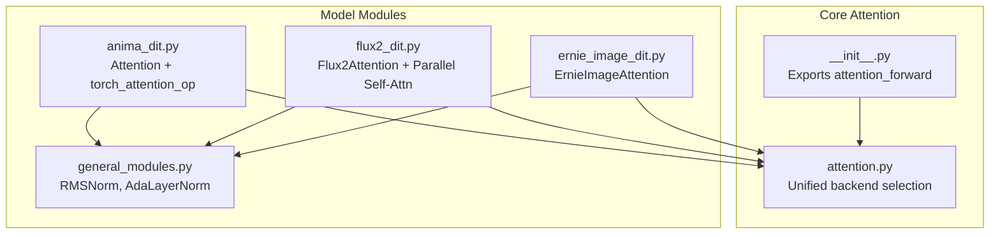
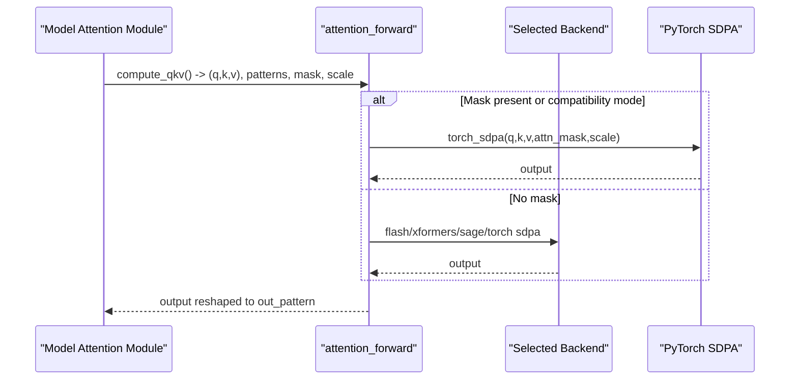
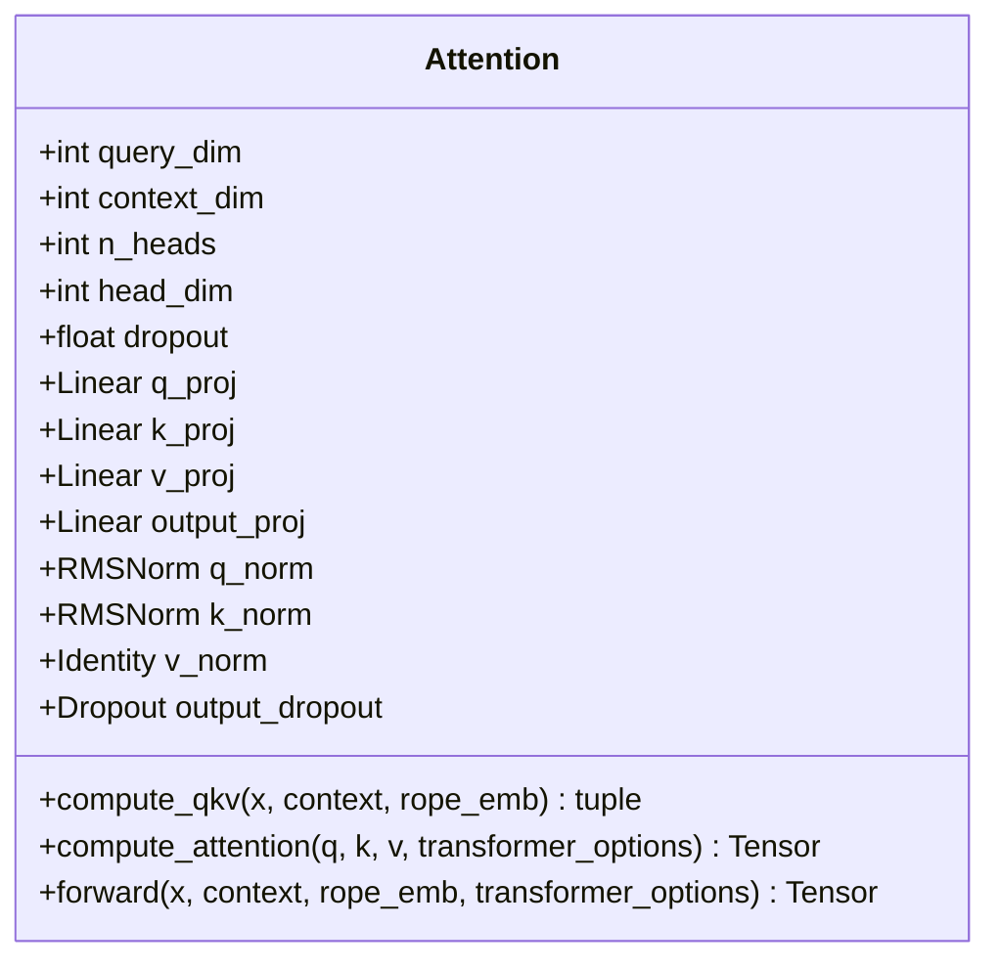
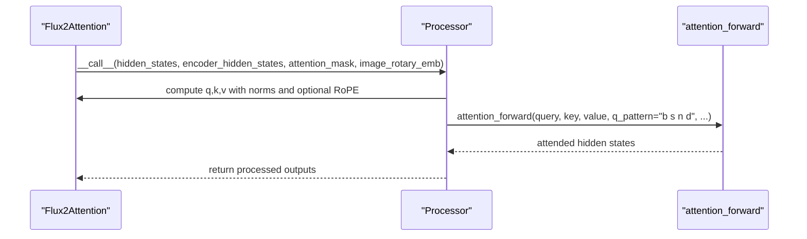
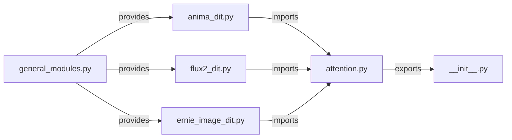

# Attention Mechanisms API

<cite>
**Referenced Files in This Document**
- [attention.py](file://diffsynth/core/attention/attention.py)
- [__init__.py](file://diffsynth/core/attention/__init__.py)
- [anima_dit.py](file://diffsynth/models/anima_dit.py)
- [flux2_dit.py](file://diffsynth/models/flux2_dit.py)
- [ernie_image_dit.py](file://diffsynth/models/ernie_image_dit.py)
- [general_modules.py](file://diffsynth/models/general_modules.py)
</cite>

## Table of Contents
1. [Introduction](#introduction)
2. [Project Structure](#project-structure)
3. [Core Components](#core-components)
4. [Architecture Overview](#architecture-overview)
5. [Detailed Component Analysis](#detailed-component-analysis)
6. [Dependency Analysis](#dependency-analysis)
7. [Performance Considerations](#performance-considerations)
8. [Troubleshooting Guide](#troubleshooting-guide)
9. [Conclusion](#conclusion)
10. [Appendices](#appendices)

## Introduction
This document provides a comprehensive API reference for attention mechanism implementations in the repository. It focuses on the unified attention backend, memory-efficient variants, and cross-attention support used across transformer-style models. You will find:
- A single entry point that selects the best available attention implementation at runtime (FlashAttention 3/2, SageAttention, xFormers, or PyTorch SDPA).
- Class-level APIs for self-attention and cross-attention blocks integrated into transformer architectures.
- Configuration details for scaling factors, normalization, RoPE positional embeddings, and mask handling.
- Practical guidance for integrating custom attention layers and tuning performance.

## Project Structure
The attention subsystem is organized around a small core module that exposes a unified forward function and multiple backends, plus model-specific attention modules that wrap this core to implement self-attention and cross-attention patterns.

**Diagram sources**
- [attention.py:1-122](file://diffsynth/core/attention/attention.py#L1-L122)
- [__init__.py:1-2](file://diffsynth/core/attention/__init__.py#L1-L2)
- [anima_dit.py:230-385](file://diffsynth/models/anima_dit.py#L230-L385)
- [flux2_dit.py:410-609](file://diffsynth/models/flux2_dit.py#L410-L609)
- [ernie_image_dit.py:80-156](file://diffsynth/models/ernie_image_dit.py#L80-L156)
- [general_modules.py:104-147](file://diffsynth/models/general_modules.py#L104-L147)

**Section sources**
- [attention.py:1-122](file://diffsynth/core/attention/attention.py#L1-L122)
- [__init__.py:1-2](file://diffsynth/core/attention/__init__.py#L1-L2)

## Core Components
This section documents the unified attention backend and how it is consumed by model components.

### Unified Attention Backend
- Entry function: attention_forward(q, k, v, q_pattern, k_pattern, v_pattern, out_pattern, dims, attn_mask, scale, compatibility_mode)
- Behavior:
  - If attn_mask is provided or compatibility_mode is True, uses PyTorch scaled_dot_product_attention.
  - Otherwise, selects the fastest available backend based on environment and availability:
    - FlashAttention 3 (preferred if available)
    - FlashAttention 2
    - SageAttention
    - xFormers memory_efficient_attention
    - Fallback to PyTorch SDPA
- Pattern rearrangement utilities:
  - rearrange_qkv and rearrange_out handle dimension shuffling between different backend conventions.

Key parameters:
- q_pattern, k_pattern, v_pattern, out_pattern: einops-style tensor shape patterns (e.g., "b n s d", "b s n d").
- scale: softmax_scale passed to backend functions where supported.
- attn_mask: optional attention mask; forces fallback to PyTorch SDPA path.

Backend selection priority:
- Environment variable DIFFSYNTH_ATTENTION_IMPLEMENTATION overrides detection.
- Detection order: FlashAttention 3 > FlashAttention 2 > SageAttention > xFormers > torch SDPA.

**Section sources**
- [attention.py:30-45](file://diffsynth/core/attention/attention.py#L30-L45)
- [attention.py:48-64](file://diffsynth/core/attention/attention.py#L48-L64)
- [attention.py:66-71](file://diffsynth/core/attention/attention.py#L66-L71)
- [attention.py:74-81](file://diffsynth/core/attention/attention.py#L74-L81)
- [attention.py:84-89](file://diffsynth/core/attention/attention.py#L84-L89)
- [attention.py:92-97](file://diffsynth/core/attention/attention.py#L92-L97)
- [attention.py:100-105](file://diffsynth/core/attention/attention.py#L100-L105)
- [attention.py:108-122](file://diffsynth/core/attention/attention.py#L108-L122)

### Model-Level Attention Modules
- Anima Attention:
  - Supports both self-attention and cross-attention via an optional context input.
  - Uses RMSNorm on Q/K, dropout on output, and a flexible operations interface for projections.
  - Integrates with rotary position embeddings for self-attention only.
  - Delegates computation to torch_attention_op which calls the unified attention_forward.
- Flux2Attention:
  - Standard attention block with QK RMSNorm, optional added KV projection for cross-attention-like behavior.
  - Processor-based design allows swapping attention logic; default processor uses attention_forward with specific patterns.
- ErnieImageAttention:
  - Single-stream attention with configurable QK normalization (LayerNorm or RMSNorm).
  - Uses attention_forward with explicit patterns and supports attention masks.

Normalization and conditioning:
- RMSNorm and AdaLayerNorm are used extensively for stable training and adaptive modulation.

**Section sources**
- [anima_dit.py:230-385](file://diffsynth/models/anima_dit.py#L230-L385)
- [flux2_dit.py:435-503](file://diffsynth/models/flux2_dit.py#L435-L503)
- [flux2_dit.py:505-558](file://diffsynth/models/flux2_dit.py#L505-L558)
- [ernie_image_dit.py:104-156](file://diffsynth/models/ernie_image_dit.py#L104-L156)
- [general_modules.py:104-147](file://diffsynth/models/general_modules.py#L104-L147)

## Architecture Overview
The system composes a unified attention backend with model-specific attention modules. The flow from model code to backend is consistent:
- Model modules compute Q, K, V tensors and apply normalization and optional RoPE.
- They call attention_forward with appropriate patterns and optional masks/scale.
- attention_forward selects the optimal backend and returns the attended output.

**Diagram sources**
- [attention.py:108-122](file://diffsynth/core/attention/attention.py#L108-L122)
- [anima_dit.py:230-259](file://diffsynth/models/anima_dit.py#L230-L259)
- [flux2_dit.py:410-418](file://diffsynth/models/flux2_dit.py#L410-L418)
- [ernie_image_dit.py:88-95](file://diffsynth/models/ernie_image_dit.py#L88-L95)

## Detailed Component Analysis

### Unified Attention Backend API
- Function signature: attention_forward(q, k, v, q_pattern="b n s d", k_pattern="b n s d", v_pattern="b n s d", out_pattern="b n s d", dims=None, attn_mask=None, scale=None, compatibility_mode=False)
- Parameters:
  - q, k, v: tensors with shapes matching q_pattern, k_pattern, v_pattern respectively.
  - out_pattern: desired output shape pattern.
  - dims: additional dimensions for einops rearrange.
  - attn_mask: optional mask; when provided, forces torch_sdpa path.
  - scale: softmax_scale for backends that accept it.
  - compatibility_mode: boolean flag to force torch_sdpa path.
- Returns:
  - Tensor shaped according to out_pattern.

Backend-specific notes:
- FlashAttention 3/2 expect "b s n d" input patterns; internal rearrange handles conversion.
- SageAttention expects "b n s d".
- xFormers expects "b s n d".
- PyTorch SDPA accepts attn_mask and scale directly.

**Section sources**
- [attention.py:48-64](file://diffsynth/core/attention/attention.py#L48-L64)
- [attention.py:66-71](file://diffsynth/core/attention/attention.py#L66-L71)
- [attention.py:74-81](file://diffsynth/core/attention/attention.py#L74-L81)
- [attention.py:84-89](file://diffsynth/core/attention/attention.py#L84-L89)
- [attention.py:92-97](file://diffsynth/core/attention/attention.py#L92-L97)
- [attention.py:100-105](file://diffsynth/core/attention/attention.py#L100-L105)
- [attention.py:108-122](file://diffsynth/core/attention/attention.py#L108-L122)

### Anima Attention Module
- Purpose: Flexible multi-head attention supporting self-attention and cross-attention.
- Key methods:
  - __init__(query_dim, context_dim=None, n_heads=8, head_dim=64, dropout=0.0, device=None, dtype=None, operations=None)
  - compute_qkv(x, context=None, rope_emb=None) -> (q, k, v)
  - compute_attention(q, k, v, transformer_options={}) -> output
  - forward(x, context=None, rope_emb=None, transformer_options={}) -> output
- Behavior:
  - If context is None, operates as self-attention; otherwise cross-attention.
  - Applies RMSNorm to Q/K; identity norm for V.
  - Optional RoPE applied to Q/K in self-attention mode.
  - Delegates to torch_attention_op which calls attention_forward with out_pattern="b s (n d)".

Integration points:
- Operations interface for Linear and RMSNorm enables pluggable implementations.
- Transformer options can be passed through to customize behavior.

**Section sources**
- [anima_dit.py:261-385](file://diffsynth/models/anima_dit.py#L261-L385)
- [anima_dit.py:230-259](file://diffsynth/models/anima_dit.py#L230-L259)

#### Class Diagram: Anima Attention

**Diagram sources**
- [anima_dit.py:261-385](file://diffsynth/models/anima_dit.py#L261-L385)

### Flux2Attention and Parallel Self-Attention
- Flux2Attention:
  - Standard attention with QK RMSNorm and optional added KV projections for cross-attention-like behavior.
  - Processor-based architecture allows swapping attention logic; default processor uses attention_forward with patterns "b s n d".
- Flux2ParallelSelfAttention:
  - Fused QKV and MLP projections for efficiency.
  - Uses attention_forward with explicit patterns and concatenates attention output with MLP stream before final projection.

Key parameters:
- heads, dim_head, dropout, bias, added_kv_proj_dim, out_bias, eps, elementwise_affine, mlp_ratio, mlp_mult_factor.

**Section sources**
- [flux2_dit.py:435-503](file://diffsynth/models/flux2_dit.py#L435-L503)
- [flux2_dit.py:505-558](file://diffsynth/models/flux2_dit.py#L505-L558)
- [flux2_dit.py:560-609](file://diffsynth/models/flux2_dit.py#L560-L609)

#### Sequence Diagram: Flux2Attention Forward

**Diagram sources**
- [flux2_dit.py:492-503](file://diffsynth/models/flux2_dit.py#L492-L503)
- [flux2_dit.py:410-418](file://diffsynth/models/flux2_dit.py#L410-L418)

### ErnieImageAttention
- Single-stream attention with configurable QK normalization (LayerNorm or RMSNorm).
- Uses attention_forward with explicit patterns and supports attention masks.
- Designed for joint image-text processing within DiT blocks.

Parameters:
- query_dim, heads, dim_head, dropout, bias, qk_norm, out_bias, eps, elementwise_affine, out_dim.

**Section sources**
- [ernie_image_dit.py:104-156](file://diffsynth/models/ernie_image_dit.py#L104-L156)
- [ernie_image_dit.py:80-95](file://diffsynth/models/ernie_image_dit.py#L80-L95)

## Dependency Analysis
The attention system has clear separation between core backend and model modules:
- Core module exports attention_forward and manages backend selection.
- Model modules import and use attention_forward directly or via wrappers like torch_attention_op.
- Normalization layers (RMSNorm, AdaLayerNorm) are shared utilities used across attention modules.

**Diagram sources**
- [attention.py:1-122](file://diffsynth/core/attention/attention.py#L1-L122)
- [__init__.py:1-2](file://diffsynth/core/attention/__init__.py#L1-L2)
- [anima_dit.py:230-385](file://diffsynth/models/anima_dit.py#L230-L385)
- [flux2_dit.py:410-609](file://diffsynth/models/flux2_dit.py#L410-L609)
- [ernie_image_dit.py:80-156](file://diffsynth/models/ernie_image_dit.py#L80-L156)
- [general_modules.py:104-147](file://diffsynth/models/general_modules.py#L104-L147)

**Section sources**
- [attention.py:1-122](file://diffsynth/core/attention/attention.py#L1-L122)
- [__init__.py:1-2](file://diffsynth/core/attention/__init__.py#L1-L2)

## Performance Considerations
- Backend selection prioritizes speed and memory efficiency:
  - FlashAttention 3/2 provide significant speedups and reduced memory usage on supported hardware.
  - SageAttention offers alternative optimization paths.
  - xFormers memory_efficient_attention is a strong fallback for many GPUs.
  - PyTorch SDPA is the universal fallback with full feature support (masks, scale).
- Pattern mismatches incur rearrangement overhead; ensure correct q/k/v/out patterns for target backends.
- Using attn_mask forces PyTorch SDPA path; avoid masks when possible for maximum performance.
- Scale parameter (softmax_scale) can improve numerical stability; pass via attention_forward when supported.
- Gradient checkpointing can be combined with attention modules to reduce memory during training.

[No sources needed since this section provides general guidance]

## Troubleshooting Guide
Common issues and resolutions:
- Incorrect tensor shapes: Ensure q_pattern, k_pattern, v_pattern match actual tensor layouts. Mismatches cause errors in rearrange operations.
- Mask not supported by selected backend: If attn_mask is provided, the system automatically falls back to PyTorch SDPA. Verify mask dtype and device alignment.
- Backend availability: Check environment variables and installed packages. Set DIFFSYNTH_ATTENTION_IMPLEMENTATION to force a specific backend if needed.
- Numerical instability: Adjust scale parameter or enable upcast modes in model-specific attention modules where applicable.

**Section sources**
- [attention.py:30-45](file://diffsynth/core/attention/attention.py#L30-L45)
- [attention.py:108-122](file://diffsynth/core/attention/attention.py#L108-L122)

## Conclusion
The attention mechanism implementation provides a robust, extensible foundation for transformer-based models. The unified backend abstracts away hardware-specific optimizations while maintaining compatibility across different attention patterns. Model-specific modules build upon this foundation to implement self-attention and cross-attention with customizable normalization, positional embeddings, and masking support. Proper configuration of patterns, scales, and backends ensures optimal performance and memory efficiency.

[No sources needed since this section summarizes without analyzing specific files]

## Appendices

### Practical Examples for Custom Attention Implementation
- Implementing a custom attention layer:
  - Compute Q, K, V projections with appropriate dimensions.
  - Apply normalization (RMSNorm/LayerNorm) to Q/K as needed.
  - Optionally apply rotary position embeddings for self-attention.
  - Call attention_forward with correct patterns and optional mask/scale.
  - Reshape output and apply final projection/dropout.

- Cross-attention setup:
  - Provide separate context inputs for K/V while using query from main input.
  - Ensure context dimensions match expected configurations.
  - Use appropriate attention masks for sequence padding or causal constraints.

- Performance tuning:
  - Set DIFFSYNTH_ATTENTION_IMPLEMENTATION to prioritize specific backends.
  - Avoid attention masks when possible to leverage optimized backends.
  - Tune scale parameter for numerical stability.
  - Use gradient checkpointing for large sequences during training.

[No sources needed since this section provides general guidance]