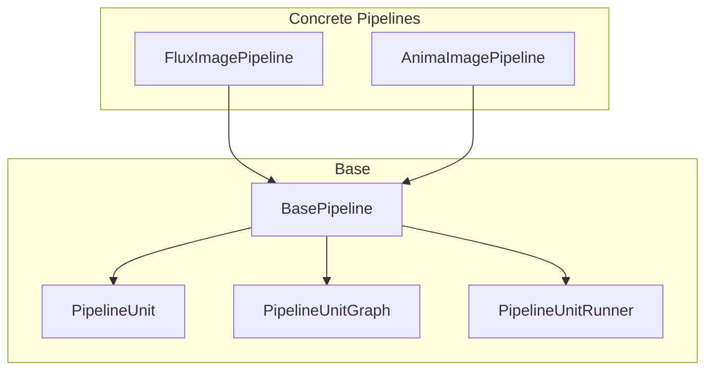
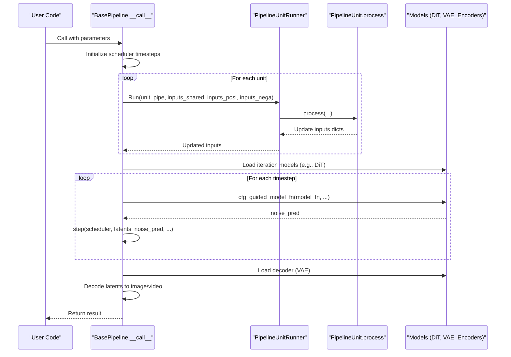
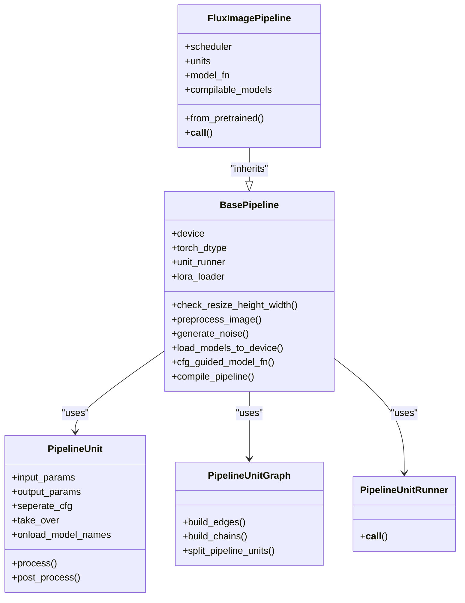

# Base Pipeline API

<cite>
**Referenced Files in This Document**
- [base_pipeline.py](file://diffusion/base_pipeline.py)
- [flux_image.py](file://diffusion/pipelines/flux_image.py)
- [anima_image.py](file://diffusion/pipelines/anima_image.py)
- [training_module.py](file://diffusion/training_module.py)
</cite>

## Table of Contents
1. [Introduction](#introduction)
2. [Project Structure](#project-structure)
3. [Core Components](#core-components)
4. [Architecture Overview](#architecture-overview)
5. [Detailed Component Analysis](#detailed-component-analysis)
6. [Dependency Analysis](#dependency-analysis)
7. [Performance Considerations](#performance-considerations)
8. [Troubleshooting Guide](#troubleshooting-guide)
9. [Conclusion](#conclusion)
10. [Appendices](#appendices)

## Introduction
This document provides comprehensive API documentation for the BasePipeline class and the pipeline system used across diffusion pipelines in this repository. It explains the unit-based composition pattern, execution flow, parameter parsing, configuration handling, model loading integration, VRAM management, LoRA hotloading, and compilation support. Practical examples demonstrate how to create, customize, and execute pipelines using concrete implementations such as FluxImagePipeline and AnimaImagePipeline.

## Project Structure
The pipeline system is centered around a base class that orchestrates modular units. Concrete pipelines inherit from the base class and define:
- A list of PipelineUnit instances representing processing stages
- A model function that performs the core denoising step
- Optional compilation targets and LoRA loader configuration

**Diagram sources**
- [base_pipeline.py:61-373](file://diffusion/base_pipeline.py#L61-L373)
- [flux_image.py:57-107](file://diffusion/pipelines/flux_image.py#L57-L107)
- [anima_image.py:130-265](file://diffusion/pipelines/anima_image.py#L130-L265)

**Section sources**
- [base_pipeline.py:61-373](file://diffusion/base_pipeline.py#L61-L373)
- [flux_image.py:57-107](file://diffusion/pipelines/flux_image.py#L57-L107)
- [anima_image.py:130-265](file://diffusion/pipelines/anima_image.py#L130-L265)

## Core Components
- BasePipeline: The central orchestrator providing device/dtype management, shape checks, preprocessing utilities, VRAM control, LoRA integration, CFG guidance, and torch.compile support.
- PipelineUnit: A composable stage with input/output parameter contracts, optional CFG separation, and optional model onload hooks.
- PipelineUnitGraph: Builds dependency edges and chains among units to split computation graphs and identify related units.
- PipelineUnitRunner: Executes units according to their flags (take_over, seperate_cfg), routing shared/positive/negative inputs appropriately.

Key responsibilities:
- Parameter parsing and propagation through units
- Model lifecycle management (onload/offload)
- CFG-guided noise prediction
- Noise generation and scheduler stepping
- Output decoding and format conversion

**Section sources**
- [base_pipeline.py:14-59](file://diffusion/base_pipeline.py#L14-L59)
- [base_pipeline.py:61-373](file://diffusion/base_pipeline.py#L61-L373)
- [base_pipeline.py:375-468](file://diffusion/base_pipeline.py#L375-L468)
- [base_pipeline.py:470-501](file://diffusion/base_pipeline.py#L470-L501)

## Architecture Overview
The pipeline executes a sequence of units to prepare inputs, then iteratively denoises latents using a CFG-guided model function, and finally decodes outputs. Units can operate on shared, positive-only, or negative-only contexts depending on cfg_scale and unit configuration.

**Diagram sources**
- [flux_image.py:180-291](file://diffusion/pipelines/flux_image.py#L180-L291)
- [base_pipeline.py:321-341](file://diffusion/base_pipeline.py#L321-L341)
- [base_pipeline.py:220-227](file://diffusion/base_pipeline.py#L220-L227)

## Detailed Component Analysis

### BasePipeline API
- __init__(device, torch_dtype, height_division_factor, width_division_factor, time_division_factor, time_division_remainder)
  - Initializes device/dtype for intermediates, shape constraints, VRAM management flag, unit runner, and LoRA loader class.
- to(*args, **kwargs)
  - Overrides module.to to update self.device and self.torch_dtype before delegating to parent.
- check_resize_height_width(height, width, num_frames=None, verbose=1)
  - Rounds dimensions to satisfy division factors; optionally rounds frames based on time factors.
- preprocess_image(image, torch_dtype=None, device=None, pattern="B C H W", min_value=-1, max_value=1)
  - Converts PIL image to tensor with specified dtype/device and scaling.
- preprocess_video(video, torch_dtype=None, device=None, pattern="B C T H W", min_value=-1, max_value=1)
  - Applies preprocess_image per frame and stacks along time dimension.
- vae_output_to_image(vae_output, pattern="B C H W", min_value=-1, max_value=1)
  - Converts tensors back to PIL images with scaling and dtype conversion.
- vae_output_to_video(vae_output, pattern="B C T H W", min_value=-1, max_value=1)
  - Converts tensors to list of PIL images.
- output_audio_format_check(audio_output)
  - Ensures audio output has standard format and dtype.
- load_models_to_device(model_names)
  - Offloads non-target modules and onloads target modules when VRAM management is enabled.
- generate_noise(shape, seed=None, rand_device="cpu", rand_torch_dtype=torch.float32, device=None, torch_dtype=None)
  - Creates Gaussian noise with optional seeding and dtype/device casting.
- get_vram()
  - Returns current GPU/NPU memory usage in GB.
- get_module(model, name)
  - Resolves nested module by dot-separated path or index.
- freeze_except(model_names)
  - Freezes all parameters except those listed; enables training mode for selected modules.
- blend_with_mask(base, addition, mask)
  - Blends two tensors using a mask.
- step(scheduler, latents, progress_id, noise_pred, input_latents=None, inpaint_mask=None, **kwargs)
  - Performs one scheduler step, optionally blending inpaint masks.
- split_pipeline_units(model_names: list[str])
  - Splits units into related/unrelated sets based on model dependencies.
- flush_vram_management_device(device)
  - Sets offload/onload/preparing/computation devices for AutoTorchModule instances.
- load_lora(module, lora_config=None, alpha=1, hotload=None, state_dict=None, verbose=1)
  - Loads LoRA weights either by fusing into base or hotloading via wrapped linear layers.
- clear_lora(verbose=1)
  - Clears accumulated LoRA weights from wrapped linear layers.
- download_and_load_models(model_configs=[], vram_limit=None)
  - Downloads and loads models via ModelPool with VRAM config.
- check_vram_management_state()
  - Detects if any child module has VRAM management enabled.
- cfg_guided_model_fn(model_fn, cfg_scale, inputs_shared, inputs_posi, inputs_nega, **inputs_others)
  - Computes CFG noise predictions, supports separate LoRA for positive branch.
- compile_pipeline(mode="default", dynamic=True, fullgraph=False, compile_models=None, **kwargs)
  - Compiles models using torch.compile, supporting regional compilation for repeated blocks.

Practical usage patterns:
- Create a pipeline subclass, set units, model_fn, and compilable_models.
- Use from_pretrained to download and load models via ModelConfig.
- Invoke __call__ with prompt, images, and scheduler parameters.
- Optionally enable LoRA hotloading and compile models for speed.

**Section sources**
- [base_pipeline.py:61-373](file://diffusion/base_pipeline.py#L61-L373)
- [base_pipeline.py:296-311](file://diffusion/base_pipeline.py#L296-L311)
- [base_pipeline.py:342-373](file://diffusion/base_pipeline.py#L342-L373)

### PipelineUnit Interface
- __init__(seperate_cfg=False, take_over=False, input_params=None, output_params=None, input_params_posi=None, input_params_nega=None, onload_model_names=None)
  - Configures parameter contracts and behavior flags.
- fetch_input_params()
  - Aggregates all required input keys across shared, positive, and negative mappings.
- fetch_output_params()
  - Returns declared output keys.
- process(pipe, **kwargs) -> dict
  - Implements unit logic; returns updated parameters.
- post_process(pipe, **kwargs) -> dict
  - Hook for post-processing (default no-op).

Composition patterns:
- Input/output contracts ensure data flows correctly between units.
- seperate_cfg=True splits processing for positive/negative branches when cfg_scale != 1.
- take_over=True allows custom control over inputs_shared, inputs_posi, inputs_nega.
- onload_model_names triggers selective model loading within the unit.

Examples:
- ShapeChecker: Validates and adjusts height/width.
- NoiseInitializer: Generates initial noise tensor.
- PromptEmbedder: Encodes text prompts using multiple encoders.
- ControlNet/IP-Adapter/EntityControl: Specialized conditioning units.

**Section sources**
- [base_pipeline.py:14-59](file://diffusion/base_pipeline.py#L14-L59)
- [flux_image.py:294-395](file://diffusion/pipelines/flux_image.py#L294-L395)
- [anima_image.py:136-241](file://diffusion/pipelines/anima_image.py#L136-L241)

### PipelineUnitGraph
- build_edges(units)
  - Constructs directed edges based on input/output parameter dependencies.
- build_chains(units)
  - Tracks update chains for each parameter to determine computation order.
- search_direct_unit_ids(units, model_names)
  - Finds units directly associated with specific models via onload_model_names.
- search_related_unit_ids(edges, start_unit_ids, direction="target")
  - Expands related units forward or backward through dependency graph.
- search_updating_unit_ids(units, chains, related_unit_ids)
  - Identifies units that may need updates due to external input changes.
- split_pipeline_units(units, model_names)
  - Returns related and unrelated unit sets for targeted execution.

Use cases:
- Isolating model-related computations for efficient VRAM management.
- Determining minimal unit subsets for incremental updates.

**Section sources**
- [base_pipeline.py:375-468](file://diffusion/base_pipeline.py#L375-L468)

### PipelineUnitRunner
- __call__(unit, pipe, inputs_shared, inputs_posi, inputs_nega) -> tuple[dict, dict, dict]
  - Dispatches unit execution based on flags:
    - take_over: Unit fully controls input dictionaries.
    - seperate_cfg: Processes positive and negative branches separately.
    - Default: Updates shared inputs only.

Execution flow:
- Collects processor_inputs from shared/positive/negative dictionaries based on unit configuration.
- Calls unit.process and merges outputs back into appropriate dictionaries.
- Handles CFG scale branching to avoid unnecessary negative processing when cfg_scale == 1.

**Section sources**
- [base_pipeline.py:470-501](file://diffusion/base_pipeline.py#L470-L501)

### Concrete Pipeline Examples

#### FluxImagePipeline
- Inherits from BasePipeline and defines:
  - Scheduler instance (FlowMatchScheduler)
  - Tokenizers and text encoders (CLIP, T5)
  - DiT, VAE encoder/decoder, ControlNet, IP-Adapter, and other components
  - Unit list including shape checking, noise initialization, prompt embedding, image conditioning, controlnet, ipadapter, entity control, nexus gen, tea cache, flex, step1x, value control, and lora encode
  - model_fn_flux_image for denoising
  - compilable_models = ["dit"]
  - lora_loader = FluxLoRALoader

- __call__ method:
  - Sets scheduler timesteps
  - Initializes inputs_shared, inputs_posi, inputs_nega
  - Iterates through units via unit_runner
  - Loads iteration models (DiT, connectors, controlnet, lora patcher)
  - Runs CFG-guided denoising loop
  - Decodes final latents with VAE decoder
  - Returns generated image

- from_pretrained:
  - Instantiates pipeline and downloads/loads models via ModelConfig
  - Fetches specific models from ModelPool
  - Configures value controllers, controlnets, processors, and adapters
  - Enables VRAM management detection

**Section sources**
- [flux_image.py:57-177](file://diffusion/pipelines/flux_image.py#L57-L177)
- [flux_image.py:180-291](file://diffusion/pipelines/flux_image.py#L180-L291)

#### AnimaImagePipeline
- Similar structure with:
  - Shape checker, noise initializer, input image embedder, prompt embedder units
  - model_fn_anima for denoising
  - Supports both single and batch image processing

**Section sources**
- [anima_image.py:136-265](file://diffusion/pipelines/anima_image.py#L136-L265)

### Training Module Integration
- GeneralUnit_RemoveCache: Extends PipelineUnit with take_over=True to filter and remove cached parameters from shared/positive/negative inputs during training.
- DiffusionTrainingModule: Provides utilities for LoRA injection, state dict mapping, VRAM config parsing, and model config parsing.

**Section sources**
- [training_module.py:8-28](file://diffusion/training_module.py#L8-L28)
- [training_module.py:30-200](file://diffusion/training_module.py#L30-L200)

## Dependency Analysis
The pipeline system exhibits clear separation of concerns:
- BasePipeline depends on core utilities (AutoTorchModule, ModelConfig, device utilities) and LoRA loaders
- Concrete pipelines depend on specific model implementations and tokenizers
- Units are loosely coupled through parameter contracts
- Graph analysis enables efficient model loading and execution planning

**Diagram sources**
- [base_pipeline.py:61-373](file://diffusion/base_pipeline.py#L61-L373)
- [flux_image.py:57-107](file://diffusion/pipelines/flux_image.py#L57-L107)

**Section sources**
- [base_pipeline.py:61-373](file://diffusion/base_pipeline.py#L61-L373)
- [flux_image.py:57-107](file://diffusion/pipelines/flux_image.py#L57-L107)

## Performance Considerations
- VRAM Management: Enable vram_management_enabled to dynamically offload/onload models based on usage patterns.
- Compilation: Use compile_pipeline to optimize model execution with torch.compile, supporting regional compilation for repeated blocks.
- Unit Optimization: Design units to minimize redundant computations and leverage shared parameters efficiently.
- LoRA Hotloading: Prefer hotloading over fusion for flexible switching between different LoRA configurations without model reinitialization.
- Shape Constraints: Ensure input dimensions respect division factors to avoid unnecessary padding or resizing overhead.

## Troubleshooting Guide
Common issues and solutions:
- Dimension errors: Verify height/width are divisible by configured factors; use check_resize_height_width to auto-adjust.
- VRAM errors: Enable VRAM management and use load_models_to_device to selectively load required models.
- LoRA conflicts: Clear existing LoRA weights with clear_lora before loading new configurations.
- CFG issues: Ensure seperate_cfg units properly handle positive/negative branches when cfg_scale != 1.
- Compilation failures: Check that models support torch.compile and adjust dynamic/fullgraph parameters.

**Section sources**
- [base_pipeline.py:157-180](file://diffusion/base_pipeline.py#L157-L180)
- [base_pipeline.py:242-294](file://diffusion/base_pipeline.py#L242-L294)
- [base_pipeline.py:342-373](file://diffusion/base_pipeline.py#L342-L373)

## Conclusion
The BasePipeline system provides a flexible, modular framework for building diffusion pipelines through composable units. Its design emphasizes clear parameter contracts, efficient VRAM management, and extensibility through inheritance. Concrete implementations like FluxImagePipeline demonstrate practical usage patterns for complex multi-modal generation tasks. The system supports advanced features like CFG guidance, LoRA hotloading, and model compilation for optimal performance.

## Appendices

### Method Signatures Reference

#### BasePipeline Methods
- __init__(device, torch_dtype, height_division_factor, width_division_factor, time_division_factor, time_division_remainder)
- to(*args, **kwargs)
- check_resize_height_width(height, width, num_frames=None, verbose=1)
- preprocess_image(image, torch_dtype=None, device=None, pattern="B C H W", min_value=-1, max_value=1)
- preprocess_video(video, torch_dtype=None, device=None, pattern="B C T H W", min_value=-1, max_value=1)
- vae_output_to_image(vae_output, pattern="B C H W", min_value=-1, max_value=1)
- vae_output_to_video(vae_output, pattern="B C T H W", min_value=-1, max_value=1)
- output_audio_format_check(audio_output)
- load_models_to_device(model_names)
- generate_noise(shape, seed=None, rand_device="cpu", rand_torch_dtype=torch.float32, device=None, torch_dtype=None)
- get_vram()
- get_module(model, name)
- freeze_except(model_names)
- blend_with_mask(base, addition, mask)
- step(scheduler, latents, progress_id, noise_pred, input_latents=None, inpaint_mask=None, **kwargs)
- split_pipeline_units(model_names: list[str])
- flush_vram_management_device(device)
- load_lora(module, lora_config=None, alpha=1, hotload=None, state_dict=None, verbose=1)
- clear_lora(verbose=1)
- download_and_load_models(model_configs=[], vram_limit=None)
- check_vram_management_state()
- cfg_guided_model_fn(model_fn, cfg_scale, inputs_shared, inputs_posi, inputs_nega, **inputs_others)
- compile_pipeline(mode="default", dynamic=True, fullgraph=False, compile_models=None, **kwargs)

#### PipelineUnit Methods
- __init__(seperate_cfg=False, take_over=False, input_params=None, output_params=None, input_params_posi=None, input_params_nega=None, onload_model_names=None)
- fetch_input_params()
- fetch_output_params()
- process(pipe, **kwargs) -> dict
- post_process(pipe, **kwargs) -> dict

**Section sources**
- [base_pipeline.py:61-373](file://diffusion/base_pipeline.py#L61-L373)
- [base_pipeline.py:14-59](file://diffusion/base_pipeline.py#L14-L59)