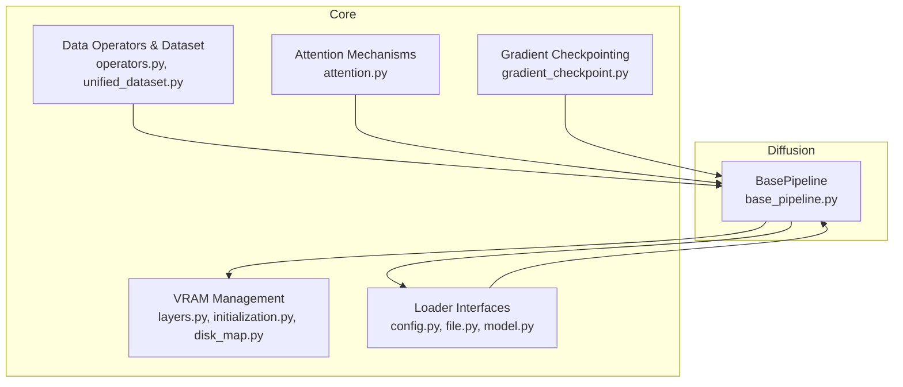
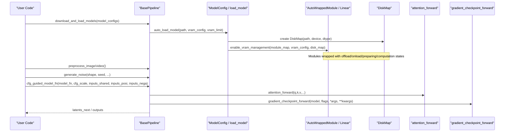
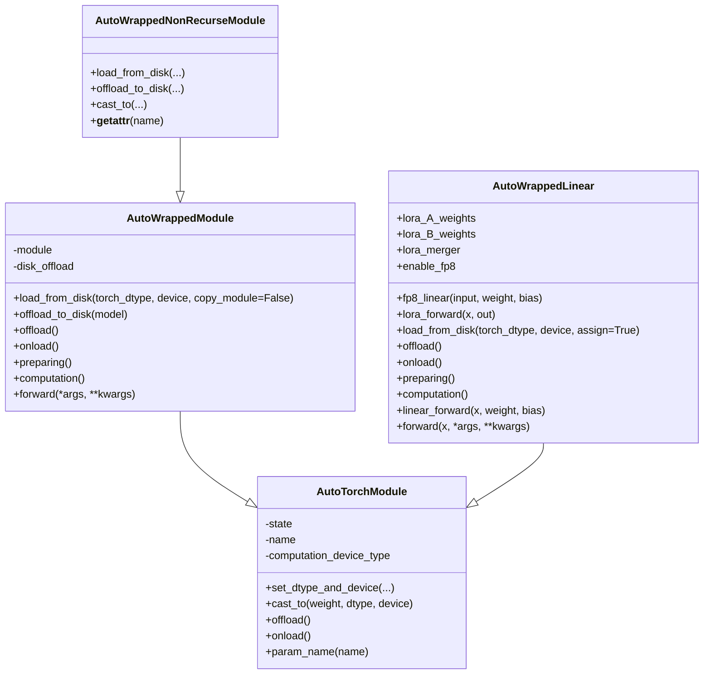
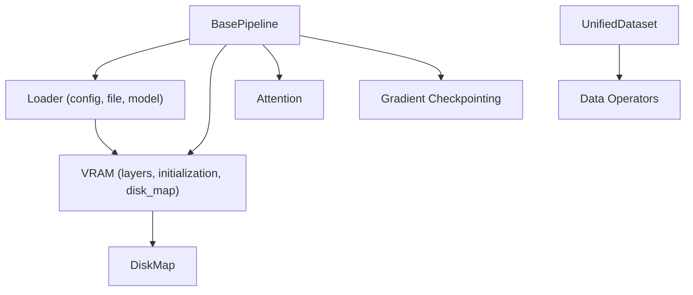

# Core API

<cite>
**Referenced Files in This Document**
- [base_pipeline.py](file://diffsynth/diffusion/base_pipeline.py)
- [layers.py](file://diffsynth/core/vram/layers.py)
- [initialization.py](file://diffsynth/core/vram/initialization.py)
- [disk_map.py](file://diffsynth/core/vram/disk_map.py)
- [operators.py](file://diffsynth/core/data/operators.py)
- [unified_dataset.py](file://diffsynth/core/data/unified_dataset.py)
- [attention.py](file://diffsynth/core/attention/attention.py)
- [gradient_checkpoint.py](file://diffsynth/core/gradient/gradient_checkpoint.py)
- [config.py](file://diffsynth/core/loader/config.py)
- [file.py](file://diffsynth/core/loader/file.py)
- [model.py](file://diffsynth/core/loader/model.py)
</cite>

## Table of Contents
1. [Introduction](#introduction)
2. [Project Structure](#project-structure)
3. [Core Components](#core-components)
4. [Architecture Overview](#architecture-overview)
5. [Detailed Component Analysis](#detailed-component-analysis)
6. [Dependency Analysis](#dependency-analysis)
7. [Performance Considerations](#performance-considerations)
8. [Troubleshooting Guide](#troubleshooting-guide)
9. [Conclusion](#conclusion)
10. [Appendices](#appendices)

## Introduction
This document provides comprehensive API documentation for the core framework components, focusing on:
- BasePipeline class and its methods, parameters, return values, and usage patterns
- VRAM management system including device placement, disk offloading, and memory optimization APIs
- Data operators and unified dataset interfaces
- Attention mechanisms and gradient checkpointing utilities
- Loader interfaces for model configuration and file handling

The goal is to enable both new and experienced users to understand and effectively use these APIs with practical examples and clear explanations.

## Project Structure
The core framework is organized into modular packages under diffsynth/core and diffsynth/diffusion:
- diffusion.base_pipeline: Pipeline orchestration and utilities
- core.vram: VRAM management, device placement, and disk offloading
- core.data: Data operators and unified dataset interface
- core.attention: Unified attention forward with multiple backends
- core.gradient: Gradient checkpointing utilities
- core.loader: Model configuration, state dict loading, and model loading helpers

**Diagram sources**
- [base_pipeline.py](file://diffsynth/diffusion/base_pipeline.py)
- [layers.py](file://diffsynth/core/vram/layers.py)
- [initialization.py](file://diffsynth/core/vram/initialization.py)
- [disk_map.py](file://diffsynth/core/vram/disk_map.py)
- [operators.py](file://diffsynth/core/data/operators.py)
- [unified_dataset.py](file://diffsynth/core/data/unified_dataset.py)
- [attention.py](file://diffsynth/core/attention/attention.py)
- [gradient_checkpoint.py](file://diffsynth/core/gradient/gradient_checkpoint.py)
- [config.py](file://diffsynth/core/loader/config.py)
- [file.py](file://diffsynth/core/loader/file.py)
- [model.py](file://diffsynth/core/loader/model.py)

**Section sources**
- [base_pipeline.py](file://diffsynth/diffusion/base_pipeline.py)
- [layers.py](file://diffsynth/core/vram/layers.py)
- [operators.py](file://diffsynth/core/data/operators.py)
- [unified_dataset.py](file://diffsynth/core/data/unified_dataset.py)
- [attention.py](file://diffsynth/core/attention/attention.py)
- [gradient_checkpoint.py](file://diffsynth/core/gradient/gradient_checkpoint.py)
- [config.py](file://diffsynth/core/loader/config.py)
- [file.py](file://diffsynth/core/loader/file.py)
- [model.py](file://diffsynth/core/loader/model.py)

## Core Components
This section summarizes the primary APIs and their responsibilities:
- BasePipeline: Orchestrates pipeline execution, preprocessing, postprocessing, VRAM-aware model loading, LoRA integration, CFG guidance, and compilation.
- VRAM Management: Wraps modules to manage device/dtype transitions, disk offloading, and lazy loading via AutoTorchModule/AutoWrappedLinear.
- Data Operators: Composable processing steps for images, videos, audio, and generic data transformations.
- Unified Dataset: Standardized dataset interface supporting metadata-driven pipelines and caching.
- Attention: Unified attention forward selecting optimal backend (FlashAttention, SageAttention, xFormers, or torch SDPA).
- Gradient Checkpointing: Memory-efficient training via DeepSpeed or PyTorch checkpointing.
- Loader: ModelConfig for download and VRAM settings; file utilities for state dicts; model loader with disk offload support.

**Section sources**
- [base_pipeline.py](file://diffsynth/diffusion/base_pipeline.py)
- [layers.py](file://diffsynth/core/vram/layers.py)
- [operators.py](file://diffsynth/core/data/operators.py)
- [unified_dataset.py](file://diffsynth/core/data/unified_dataset.py)
- [attention.py](file://diffsynth/core/attention/attention.py)
- [gradient_checkpoint.py](file://diffsynth/core/gradient/gradient_checkpoint.py)
- [config.py](file://diffsynth/core/loader/config.py)
- [file.py](file://diffsynth/core/loader/file.py)
- [model.py](file://diffsynth/core/loader/model.py)

## Architecture Overview
The framework composes a BasePipeline that integrates VRAM-managed models, data operators, attention backends, and loaders. The following diagram shows how components interact during inference and training.

**Diagram sources**
- [base_pipeline.py](file://diffsynth/diffusion/base_pipeline.py)
- [model.py](file://diffsynth/core/loader/model.py)
- [disk_map.py](file://diffsynth/core/vram/disk_map.py)
- [layers.py](file://diffsynth/core/vram/layers.py)
- [attention.py](file://diffsynth/core/attention/attention.py)
- [gradient_checkpoint.py](file://diffsynth/core/gradient/gradient_checkpoint.py)

## Detailed Component Analysis

### BasePipeline API
BasePipeline provides high-level orchestration for diffusion pipelines, including shape checks, preprocessing, noise generation, VRAM-aware model loading, CFG guidance, and torch.compile integration.

Key methods and usage patterns:
- __init__(device, torch_dtype, height_division_factor, width_division_factor, time_division_factor, time_division_remainder)
  - Purpose: Initialize pipeline device/dtype and shape constraints.
  - Returns: None
  - Usage: Instantiate once per pipeline instance.

- to(*args, **kwargs)
  - Purpose: Override device/dtype for intermediate variables while delegating to torch.nn.Module.to().
  - Parameters: device, dtype, non_blocking, convert_to_format (torch semantics)
  - Returns: self

- check_resize_height_width(height, width, num_frames=None, verbose=1)
  - Purpose: Enforce divisibility constraints for spatial/temporal dimensions.
  - Parameters: height, width, optional num_frames, verbosity
  - Returns: adjusted height, width, optionally num_frames

- preprocess_image(image, torch_dtype=None, device=None, pattern="B C H W", min_value=-1, max_value=1)
  - Purpose: Convert PIL image to tensor with scaling and broadcasting.
  - Parameters: PIL.Image, dtype, device, channel pattern, value range
  - Returns: Tensor

- preprocess_video(video, torch_dtype=None, device=None, pattern="B C T H W", min_value=-1, max_value=1)
  - Purpose: Convert list of PIL images to video tensor.
  - Parameters: List[PIL.Image], dtype, device, pattern, value range
  - Returns: Tensor

- vae_output_to_image(vae_output, pattern="B C H W", min_value=-1, max_value=1)
  - Purpose: Convert VAE output tensor to PIL image.
  - Parameters: Tensor, pattern, value range
  - Returns: PIL.Image

- vae_output_to_video(vae_output, pattern="B C T H W", min_value=-1, max_value=1)
  - Purpose: Convert VAE output tensor to list of PIL images.
  - Parameters: Tensor, pattern, value range
  - Returns: List[PIL.Image]

- output_audio_format_check(audio_output)
  - Purpose: Normalize audio output to [C, T] float format.
  - Parameters: Tensor
  - Returns: Tensor

- load_models_to_device(model_names)
  - Purpose: Offload non-target models and onload target models when VRAM management is enabled.
  - Parameters: List of child module names
  - Returns: None

- generate_noise(shape, seed=None, rand_device="cpu", rand_torch_dtype=torch.float32, device=None, torch_dtype=None)
  - Purpose: Generate Gaussian noise with optional seeding.
  - Parameters: shape, seed, random device/dtype, target device/dtype
  - Returns: Tensor

- get_vram()
  - Purpose: Query free VRAM in GB for current device.
  - Returns: float (GB)

- get_module(model, name)
  - Purpose: Resolve nested module by dot-separated name.
  - Parameters: model, name
  - Returns: Module or None

- freeze_except(model_names)
  - Purpose: Freeze all parameters except specified modules for fine-tuning.
  - Parameters: List of module paths
  - Returns: None

- blend_with_mask(base, addition, mask)
  - Purpose: Blend tensors using mask.
  - Parameters: base, addition, mask tensors
  - Returns: Tensor

- step(scheduler, latents, progress_id, noise_pred, input_latents=None, inpaint_mask=None, **kwargs)
  - Purpose: Single denoising step with optional inpainting blending.
  - Parameters: scheduler, latents, timestep index, noise prediction, optional input latents/mask
  - Returns: next latents

- split_pipeline_units(model_names: list[str])
  - Purpose: Split computation graph around model-related units.
  - Parameters: List of model names
  - Returns: Tuple of related and unrelated units

- flush_vram_management_device(device)
  - Purpose: Set offload/onload/preparing/computation devices for AutoTorchModule instances.
  - Parameters: device
  - Returns: None

- load_lora(module, lora_config=None, alpha=1, hotload=None, state_dict=None, verbose=1)
  - Purpose: Load LoRA weights either by fusing into base or hotloading into wrapped linear layers.
  - Parameters: module, config/path/state_dict, alpha, hotload flag, verbosity
  - Returns: None

- clear_lora(verbose=1)
  - Purpose: Clear all active LoRA layers from wrapped linear modules.
  - Parameters: verbosity
  - Returns: None

- download_and_load_models(model_configs=[], vram_limit=None)
  - Purpose: Download and load models with VRAM configuration via ModelPool.
  - Parameters: List[ModelConfig], optional VRAM limit
  - Returns: ModelPool

- check_vram_management_state()
  - Purpose: Detect if any child module has VRAM management enabled.
  - Returns: bool

- cfg_guided_model_fn(model_fn, cfg_scale, inputs_shared, inputs_posi, inputs_nega, **inputs_others)
  - Purpose: Apply classifier-free guidance with optional positive-only LoRA.
  - Parameters: model function, cfg scale, shared/positive/negative inputs
  - Returns: noise predictions (tuple or tensor)

- compile_pipeline(mode="default", dynamic=True, fullgraph=False, compile_models=None, **kwargs)
  - Purpose: Compile models using torch.compile with regional support for repeated blocks.
  - Parameters: mode, dynamic, fullgraph, list of model names, extra kwargs
  - Returns: None

Practical example outline:
- Create BasePipeline with desired device/dtype and shape factors.
- Use download_and_load_models with ModelConfig objects to load models with VRAM settings.
- Preprocess inputs with preprocess_image/preprocess_video.
- Run CFG-guided inference via cfg_guided_model_fn and step loop.
- Optionally compile models with compile_pipeline for speedup.

**Section sources**
- [base_pipeline.py](file://diffsynth/diffusion/base_pipeline.py)

### VRAM Management System
The VRAM subsystem enables efficient device placement, dtype casting, and disk offloading through wrapper classes and utilities.

Core classes and functions:
- AutoTorchModule
  - Purpose: Base class adding dtype/device state management and lifecycle methods (offload, onload, preparing, computation).
  - Key attributes: offload/onload/preparing/computation dtypes and devices, vram_limit, state, name
  - Methods: set_dtype_and_device(), cast_to(), offload(), onload(), param_name()

- AutoWrappedModule(AutoTorchModule)
  - Purpose: Wrap arbitrary nn.Module with VRAM lifecycle and optional disk offloading.
  - Key methods: load_from_disk(), offload_to_disk(), offload(), onload(), preparing(), computation(), forward()
  - Behavior: Transitions between offload/onload/preparing/computation states based on VRAM availability and disk mapping.

- AutoWrappedNonRecurseModule(AutoWrappedModule)
  - Purpose: Wrapper that only manages top-level parameters (non-recursive), useful for modules with internal parameter management.
  - Overrides: load_from_disk(), offload_to_disk(), cast_to(), __getattr__

- AutoWrappedLinear(torch.nn.Linear, AutoTorchModule)
  - Purpose: Specialized wrapper for Linear layers enabling FP8 computation and LoRA hotloading.
  - Key features: fp8_linear(), lora_forward(), load_from_disk(), offload/onload/preparing/computation, forward()
  - Attributes: lora_A_weights, lora_B_weights, lora_merger, enable_fp8

- enable_vram_management(model, module_map, vram_config, vram_limit=None, disk_map=None, **kwargs)
  - Purpose: Recursively wrap matching modules according to module_map and apply VRAM lifecycle.
  - Parameters: model, mapping from source types to target wrappers, VRAM config dict, optional disk map
  - Returns: Wrapped model with vram_management_enabled flag

- enable_vram_management_recursively(model, module_map, vram_config, vram_limit=None, name_prefix="", disk_map=None, **kwargs)
  - Purpose: Internal recursive wrapper builder.

- fill_vram_config(model, vram_config)
  - Purpose: Fill missing onload/preparing devices/dtypes from computation settings.

- skip_model_initialization(device="meta")
  - Purpose: Context manager to skip parameter initialization during model construction.

- DiskMap(path, device, torch_dtype=None, state_dict_converter=None, buffer_size=10^9)
  - Purpose: Lazy, streaming access to model parameters from safetensors/bin files with optional key renaming.
  - Methods: __getitem__, __iter__, __contains__, flush_files(), fetch_rename_dict()

Usage patterns:
- Wrap models with enable_vram_management using a module_map to target specific layer types.
- Configure vram_config with offload/onload/preparing/computation dtypes/devices.
- For extreme low VRAM, set offload_device/onload_device to "disk" and provide DiskMap.
- Use flush_vram_management_device to update devices across all AutoTorchModule instances.

**Diagram sources**
- [layers.py](file://diffsynth/core/vram/layers.py)
- [initialization.py](file://diffsynth/core/vram/initialization.py)
- [disk_map.py](file://diffsynth/core/vram/disk_map.py)

**Section sources**
- [layers.py](file://diffsynth/core/vram/layers.py)
- [initialization.py](file://diffsynth/core/vram/initialization.py)
- [disk_map.py](file://diffsynth/core/vram/disk_map.py)

### Data Operators and Unified Dataset
Operators provide composable, chainable transformations for images, videos, audio, and generic data. UnifiedDataset standardizes dataset creation with metadata-driven pipelines and caching.

Key operators:
- DataProcessingPipeline: Sequential composition with __rshift__ chaining.
- DataProcessingOperator: Base operator class.
- ToInt, ToFloat, ToStr: Type conversions.
- LoadImage(convert_RGB=True, convert_RGBA=False): Load and convert images.
- ImageCropAndResize(height=None, width=None, max_pixels=None, height_division_factor=1, width_division_factor=1): Resize and center crop with divisibility constraints.
- FrameSamplerByRateMixin: Utilities for frame sampling with rate control and time divisibility.
- LoadVideo(num_frames=81, time_division_factor=4, time_division_remainder=1, frame_processor=lambda x: x, frame_rate=24, fix_frame_rate=False): Stream frames with optional resizing.
- SequencialProcess(operator=lambda x: x): Apply operator to each element in a list.
- LoadGIF(num_frames=81, time_division_factor=4, time_division_remainder=1, frame_processor=lambda x: x): Load GIF frames with resizing.
- RouteByExtensionName(operator_map): Dispatch based on file extension.
- RouteByType(operator_map): Dispatch based on Python type.
- LoadTorchPickle(map_location="cpu"): Load .pth/.pt files.
- ToAbsolutePath(base_path=""): Join base path with relative paths.
- LoadAudio(sr=16000): Load audio with librosa.
- LoadAudioWithTorchaudio(num_frames=121, time_division_factor=8, time_division_remainder=1, frame_rate=24, fix_frame_rate=True): Load and pad/truncate audio to target duration.

UnifiedDataset:
- __init__(base_path=None, metadata_path=None, repeat=1, data_file_keys=tuple(), main_data_operator=lambda x: x, special_operator_map=None, max_data_items=None)
- default_image_operator(base_path="", max_pixels=1920*1080, height=None, width=None, height_division_factor=16, width_division_factor=16)
- default_video_operator(base_path="", max_pixels=1920*1080, height=None, width=None, height_division_factor=16, width_division_factor=16, num_frames=81, time_division_factor=4, time_division_remainder=1, frame_rate=24, fix_frame_rate=False)
- search_for_cached_data_files(path)
- load_metadata(metadata_path)
- __getitem__(data_id)
- __len__()
- check_data_equal(data1, data2)

Usage patterns:
- Build operator chains using >> to compose transformations.
- Use RouteByExtensionName and RouteByType for flexible dispatch.
- Construct UnifiedDataset with metadata (JSON/JSONL/CSV) or cached .pth files.
- Provide default_image_operator/default_video_operator for common preprocessing.

**Section sources**
- [operators.py](file://diffsynth/core/data/operators.py)
- [unified_dataset.py](file://diffsynth/core/data/unified_dataset.py)

### Attention Mechanisms
Unified attention selection prioritizes performance based on available backends.

Key functions:
- initialize_attention_priority(): Determines preferred implementation via environment variable or library availability.
- rearrange_qkv(q, k, v, q_pattern="b n s d", k_pattern="b n s d", v_pattern="b n s d", required_in_pattern="b n s d", dims=None)
- rearrange_out(out, out_pattern="b n s d", required_out_pattern="b n s d", dims=None)
- torch_sdpa(q, k, v, ...): Uses torch.nn.functional.scaled_dot_product_attention.
- flash_attention_3(q, k, v, ...): Uses flash_attn_interface.
- flash_attention_2(q, k, v, ...): Uses flash_attn.
- sage_attention(q, k, v, ...): Uses sageattn.
- xformers_attention(q, k, v, ...): Uses xformers.ops.memory_efficient_attention.
- attention_forward(q, k, v, q_pattern="b n s d", k_pattern="b n s d", v_pattern="b n s d", out_pattern="b n s d", dims=None, attn_mask=None, scale=None, compatibility_mode=False)

Behavior:
- If attn_mask is provided or compatibility_mode is True, falls back to torch_sdpa.
- Otherwise selects best available backend (FlashAttention 3 > FlashAttention 2 > SageAttention > xFormers > torch SDPA).

Usage patterns:
- Call attention_forward with appropriate patterns and optional scale/attn_mask.
- Control priority via DIFFSYNTH_ATTENTION_IMPLEMENTATION environment variable.

**Section sources**
- [attention.py](file://diffsynth/core/attention/attention.py)

### Gradient Checkpointing Utilities
Memory-efficient training via checkpointing with DeepSpeed and PyTorch fallbacks.

Key functions:
- create_custom_forward(module): Wraps module forward for checkpointing.
- create_custom_forward_use_reentrant(module): Non-keyword variant for reentrant checkpointing.
- judge_args_requires_grad(*args): Checks if any argument requires gradients.
- gradient_checkpoint_forward(model, use_gradient_checkpointing, use_gradient_checkpointing_offload, *args, **kwargs)

Behavior:
- If DeepSpeed is configured and enabled, uses deepspeed.checkpointing.checkpoint when inputs require gradients.
- Else if use_gradient_checkpointing_offload is True, uses torch.utils.checkpoint with save_on_cpu context.
- Else if use_gradient_checkpointing is True, uses torch.utils.checkpoint without CPU offload.
- Otherwise runs model directly.

Usage patterns:
- Wrap model forward calls with gradient_checkpoint_forward and toggle flags based on training setup.

**Section sources**
- [gradient_checkpoint.py](file://diffsynth/core/gradient/gradient_checkpoint.py)

### Loader Interfaces
Model configuration and loading utilities for flexible model management and VRAM-aware loading.

ModelConfig:
- Attributes: path, model_id, origin_file_pattern, download_source, local_model_path, skip_download, offload/onload/preparing/computation devices and dtypes, clear_parameters, state_dict
- Methods: check_input(), parse_original_file_pattern(), parse_download_source(), parse_skip_download(), download(), require_downloading(), reset_local_model_path(), download_if_necessary(), vram_config()

File utilities:
- load_state_dict(file_path, torch_dtype=None, device="cpu", pin_memory=False, verbose=0)
- load_state_dict_from_safetensors(file_path, torch_dtype=None, device="cpu")
- load_state_dict_from_bin(file_path, torch_dtype=None, device="cpu")
- hash_state_dict_keys(state_dict, with_shape=True)
- hash_model_file(path, with_shape=True)
- load_keys_dict(file_path)
- convert_state_dict_to_keys_dict(state_dict)
- convert_keys_dict_to_single_str(state_dict, with_shape=True)

Model loading:
- load_model(model_class, path, config=None, torch_dtype=torch.bfloat16, device="cpu", state_dict_converter=None, use_disk_map=False, module_map=None, vram_config=None, vram_limit=None, state_dict=None)
- load_model_with_disk_offload(model_class, path, config=None, torch_dtype=torch.bfloat16, device="cpu", state_dict_converter=None, module_map=None)
- get_init_context(torch_dtype, device)

Usage patterns:
- Define ModelConfig with model_id or path, specify VRAM settings via vram_config fields.
- Use load_model with module_map and vram_config to enable VRAM management.
- For extreme low VRAM, use load_model_with_disk_offload with DiskMap-backed wrapping.

**Section sources**
- [config.py](file://diffsynth/core/loader/config.py)
- [file.py](file://diffsynth/core/loader/file.py)
- [model.py](file://diffsynth/core/loader/model.py)

## Dependency Analysis
The core components have clear dependency boundaries:
- BasePipeline depends on loader utilities, VRAM wrappers, and attention/gradient utilities.
- VRAM management relies on initialization context and DiskMap for lazy loading.
- Data operators are independent and consumed by UnifiedDataset.
- Attention and gradient checkpointing are standalone utilities used by pipelines.

**Diagram sources**
- [base_pipeline.py](file://diffsynth/diffusion/base_pipeline.py)
- [config.py](file://diffsynth/core/loader/config.py)
- [file.py](file://diffsynth/core/loader/file.py)
- [model.py](file://diffsynth/core/loader/model.py)
- [layers.py](file://diffsynth/core/vram/layers.py)
- [initialization.py](file://diffsynth/core/vram/initialization.py)
- [disk_map.py](file://diffsynth/core/vram/disk_map.py)
- [operators.py](file://diffsynth/core/data/operators.py)
- [unified_dataset.py](file://diffsynth/core/data/unified_dataset.py)
- [attention.py](file://diffsynth/core/attention/attention.py)
- [gradient_checkpoint.py](file://diffsynth/core/gradient/gradient_checkpoint.py)

**Section sources**
- [base_pipeline.py](file://diffsynth/diffusion/base_pipeline.py)
- [layers.py](file://diffsynth/core/vram/layers.py)
- [operators.py](file://diffsynth/core/data/operators.py)
- [unified_dataset.py](file://diffsynth/core/data/unified_dataset.py)
- [attention.py](file://diffsynth/core/attention/attention.py)
- [gradient_checkpoint.py](file://diffsynth/core/gradient/gradient_checkpoint.py)
- [config.py](file://diffsynth/core/loader/config.py)
- [file.py](file://diffsynth/core/loader/file.py)
- [model.py](file://diffsynth/core/loader/model.py)

## Performance Considerations
- Prefer FlashAttention or SageAttention when available for faster attention computations.
- Use compile_pipeline with dynamic=True for adaptive shape support and reduced overhead.
- Enable VRAM management with appropriate vram_config to minimize memory spikes.
- For extremely low VRAM, use disk offloading via load_model_with_disk_offload and DiskMap.
- Leverage gradient checkpointing during training to reduce peak memory usage.
- Pin memory for state dicts when loading to accelerate GPU transfers.

## Troubleshooting Guide
Common issues and resolutions:
- VRAM management not applied: Ensure module_map matches actual layer types and enable_vram_management is called.
- Disk offloading errors: Verify DiskMap paths and ensure files are accessible; consider converting to safetensors for better performance.
- Attention backend fallback: Check environment variable DIFFSYNTH_ATTENTION_IMPLEMENTATION and installed libraries.
- LoRA hotloading failures: Confirm VRAM management is enabled on target modules before calling load_lora with hotload=True.
- Shape mismatches: Use check_resize_height_width to enforce divisibility constraints for height/width/time dimensions.
- Gradient checkpointing not effective: Ensure inputs require gradients and DeepSpeed is properly configured if used.

**Section sources**
- [base_pipeline.py](file://diffsynth/diffusion/base_pipeline.py)
- [layers.py](file://diffsynth/core/vram/layers.py)
- [attention.py](file://diffsynth/core/attention/attention.py)
- [gradient_checkpoint.py](file://diffsynth/core/gradient/gradient_checkpoint.py)

## Conclusion
The core framework provides a robust, modular foundation for building diffusion pipelines with advanced VRAM management, flexible data processing, optimized attention, and efficient training utilities. By leveraging BasePipeline, VRAM wrappers, data operators, and loader interfaces, users can construct scalable and memory-efficient workflows for both inference and training.

## Appendices
- Practical code examples should follow the outlined method signatures and usage patterns described above.
- For environment-specific optimizations, consult the relevant sections on attention backends and VRAM configuration.