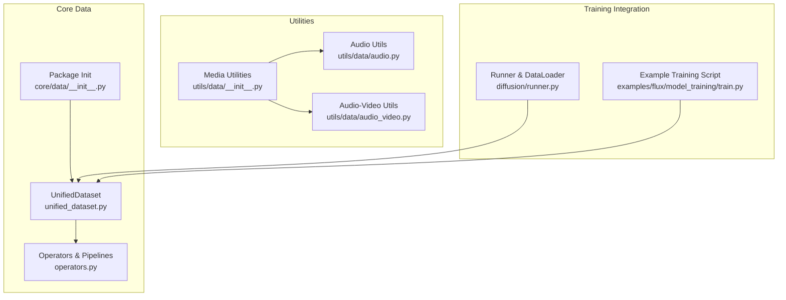
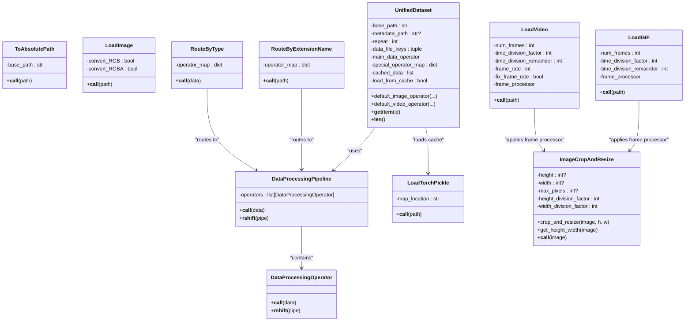
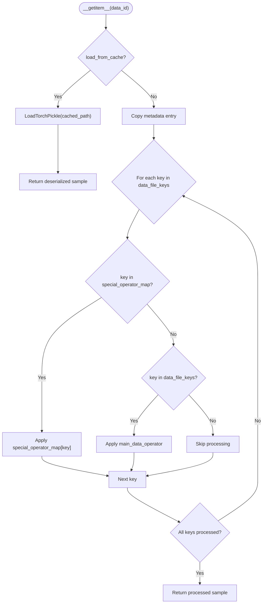
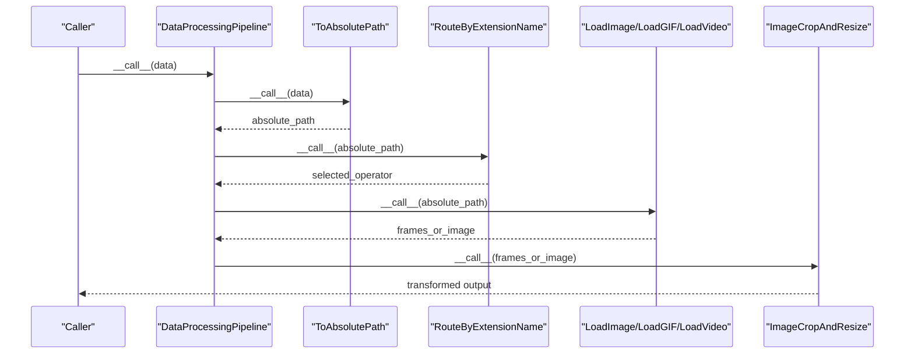
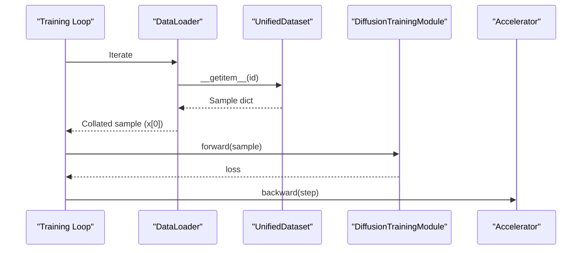
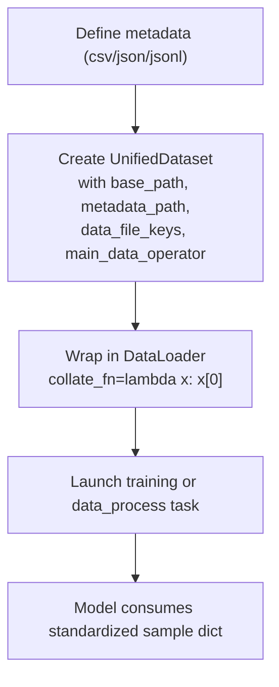
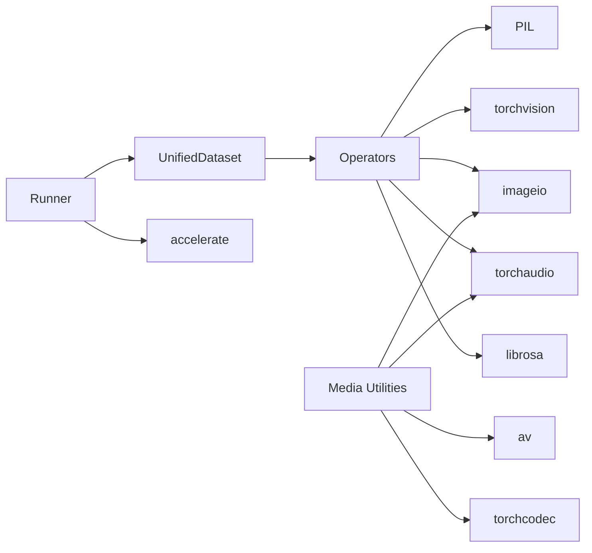

# Data Processing API

<cite>
**Referenced Files in This Document**
- [unified_dataset.py](file://diffsynth/core/data/unified_dataset.py)
- [operators.py](file://diffsynth/core/data/operators.py)
- [__init__.py (core data)](file://diffsynth/core/data/__init__.py)
- [data utilities __init__.py](file://diffsynth/utils/data/__init__.py)
- [audio.py](file://diffsynth/utils/data/audio.py)
- [audio_video.py](file://diffsynth/utils/data/audio_video.py)
- [runner.py](file://diffsynth/diffusion/runner.py)
- [train.py (FLUX example)](file://examples/flux/model_training/train.py)
- [data.md (API Reference)](file://docs/en/API_Reference/core/data.md)
</cite>

## Table of Contents
1. Introduction
2. Project Structure
3. Core Components
4. Architecture Overview
5. Detailed Component Analysis
6. Dependency Analysis
7. Performance Considerations
8. Troubleshooting Guide
9. Conclusion
10. Appendices

## Introduction
This document provides comprehensive API documentation for the data processing components used across modalities (image, video, audio). It focuses on:
- UnifiedDataset interface for consistent data handling
- Data operators for transformations, augmentations, and preprocessing
- Batch processing and data loading utilities
- Multi-modal data support and pipelines
- Complete method signatures, data format specifications, transformation pipelines, and practical examples

The goal is to enable both new and experienced users to build robust, scalable data workflows with clear contracts and extensibility points.

## Project Structure
The data processing subsystem is organized into:
- Core dataset and operator abstractions under diffsynth/core/data
- Utility functions for media I/O and batch operations under diffsynth/utils/data
- Training integration via runner utilities under diffsynth/diffusion
- Example usage in training scripts under examples

**Diagram sources**
- [unified_dataset.py](file://diffsynth/core/data/unified_dataset.py)
- [operators.py](file://diffsynth/core/data/operators.py)
- [__init__.py (core data)](file://diffsynth/core/data/__init__.py)
- [data utilities __init__.py](file://diffsynth/utils/data/__init__.py)
- [audio.py](file://diffsynth/utils/data/audio.py)
- [audio_video.py](file://diffsynth/utils/data/audio_video.py)
- [runner.py](file://diffsynth/diffusion/runner.py)
- [train.py (FLUX example)](file://examples/flux/model_training/train.py)

**Section sources**
- [unified_dataset.py](file://diffsynth/core/data/unified_dataset.py)
- [operators.py](file://diffsynth/core/data/operators.py)
- [__init__.py (core data)](file://diffsynth/core/data/__init__.py)
- [data utilities __init__.py](file://diffsynth/utils/data/__init__.py)
- [audio.py](file://diffsynth/utils/data/audio.py)
- [audio_video.py](file://diffsynth/utils/data/audio_video.py)
- [runner.py](file://diffsynth/diffusion/runner.py)
- [train.py (FLUX example)](file://examples/flux/model_training/train.py)

## Core Components
- UnifiedDataset: A PyTorch Dataset that standardizes multi-modal data loading through metadata-driven configuration and composable operators.
- Operators and Pipelines: A set of composable DataProcessingOperator classes and DataProcessingPipeline for chaining transformations.
- Media Utilities: Low-memory readers for images/videos, audio I/O helpers, and video+audio muxing utilities.
- Runner: Training and data-processing launchers that integrate datasets with accelerators and dataloaders.

Key responsibilities:
- UnifiedDataset handles metadata parsing, optional cached data loading, per-key operator routing, and repeat semantics.
- Operators provide modular transformations for images, videos, audio, and type/extension-based routing.
- Utilities offer efficient I/O and conversion routines for common media formats.
- Runner wires datasets into training loops and data precomputation tasks.

**Section sources**
- [unified_dataset.py](file://diffsynth/core/data/unified_dataset.py)
- [operators.py](file://diffsynth/core/data/operators.py)
- [data utilities __init__.py](file://diffsynth/utils/data/__init__.py)
- [audio.py](file://diffsynth/utils/data/audio.py)
- [audio_video.py](file://diffsynth/utils/data/audio_video.py)
- [runner.py](file://diffsynth/diffusion/runner.py)

## Architecture Overview
UnifiedDataset composes a pipeline per field using operators. The default image/video operators demonstrate how to route by type and extension, load media, and apply geometric transforms consistently.

**Diagram sources**
- [operators.py](file://diffsynth/core/data/operators.py)
- [unified_dataset.py](file://diffsynth/core/data/unified_dataset.py)

## Detailed Component Analysis

### UnifiedDataset
UnifiedDataset implements a flexible, metadata-driven dataset with optional caching and per-field operator routing.

- Constructor parameters
  - base_path: Root directory for resolving relative paths
  - metadata_path: Path to metadata file (csv, json, jsonl) or None to use cached .pth files
  - repeat: Number of times to repeat the dataset length
  - data_file_keys: Tuple of keys whose values should be processed by main_data_operator
  - main_data_operator: Default operator pipeline applied to keys in data_file_keys
  - special_operator_map: Optional mapping from key name to custom operator pipeline
  - max_data_items: Optional cap on dataset length

- Key methods
  - default_image_operator(base_path, max_pixels, height, width, height_division_factor, width_division_factor): Returns a RouteByType pipeline that loads images and resizes/crops them; returns a single-frame list when input is an image path
  - default_video_operator(base_path, max_pixels, height, width, num_frames, time_division_factor, time_division_remainder, frame_rate, fix_frame_rate): Returns a RouteByType pipeline that routes by extension to LoadImage, LoadGIF, or LoadVideo with frame-wise resizing
  - search_for_cached_data_files(path): Recursively finds .pth cache files under base_path
  - load_metadata(metadata_path): Loads metadata from csv/json/jsonl or switches to cached mode if metadata_path is None
  - __getitem__(data_id): If load_from_cache, loads torch pickle; else applies special_operator_map or main_data_operator to specified keys
  - __len__(): Returns effective length considering repeat and optional max_data_items
  - check_data_equal(data1, data2): Debug utility to compare two samples

- Data flow
  - When metadata_path is provided, dataset reads entries and processes fields according to operator maps
  - When metadata_path is None, dataset scans for .pth cache files and uses LoadTorchPickle to deserialize

**Diagram sources**
- [unified_dataset.py](file://diffsynth/core/data/unified_dataset.py)

**Section sources**
- [unified_dataset.py](file://diffsynth/core/data/unified_dataset.py)

### Data Operators and Pipelines
Operators are composable units that transform data. They can be chained using the >> operator to form pipelines.

- Base classes
  - DataProcessingOperator: Abstract base defining __call__ and __rshift__
  - DataProcessingPipeline: Holds a list of operators and applies them sequentially; supports composition via >>

- Common operators
  - ToInt, ToFloat, ToStr: Type conversions
  - ToList: Wraps data in a list
  - ToAbsolutePath: Joins base_path with relative path
  - LoadImage: Opens PIL image and optionally converts modes
  - ImageCropAndResize: Resizes and center-crops to target dimensions while respecting max_pixels and division factors
  - LoadVideo: Reads frames from video files with configurable sampling and frame_processor
  - LoadGIF: Reads frames from GIFs with configurable sampling and frame_processor
  - RouteByExtensionName: Routes based on file extension to specific operators
  - RouteByType: Routes based on Python type to specific operators
  - LoadTorchPickle: Loads .pth files with map_location control

- Audio operators
  - LoadAudio: Uses librosa to load audio as numpy array at given sample rate
  - LoadAudioWithTorchaudio: Uses torchaudio to load waveform, pad/truncate to duration, return tensor and sample rate

**Diagram sources**
- [operators.py](file://diffsynth/core/data/operators.py)

**Section sources**
- [operators.py](file://diffsynth/core/data/operators.py)

### Media Utilities
Utility modules provide low-memory readers, audio I/O, and video+audio muxing.

- LowMemoryVideo and LowMemoryImageFolder: Efficiently iterate over frames/images without loading all into memory
- VideoData: Unified wrapper supporting either a video file or an image folder; supports shape setting and saving frames
- save_video/save_frames: Write frames to video or image sequences
- merge_video_audio: Merge existing video and audio streams using ffmpeg subprocess
- save_video_with_audio: Convenience function to save frames then merge audio

Audio utilities:
- convert_to_mono/convert_to_stereo: Channel manipulation for tensors
- resample_waveform: Resample between sample rates
- read_audio/read_audio_with_torchcodec: Read audio with optional start_time and duration, backend selection
- save_audio: Encode and write audio tensors

Audio-video muxing:
- write_video_audio: Encodes PIL frames to H.264 and muxes stereo audio stream with proper resampling and encoding

**Section sources**
- [data utilities __init__.py](file://diffsynth/utils/data/__init__.py)
- [audio.py](file://diffsynth/utils/data/audio.py)
- [audio_video.py](file://diffsynth/utils/data/audio_video.py)

### Batch Processing and Data Loading
- DataLoader integration: In training, datasets are wrapped with torch.utils.data.DataLoader; collate_fn=lambda x: x[0] passes individual samples directly to models expecting dicts
- Accelerator preparation: Models, optimizers, schedulers, and dataloaders are prepared for distributed training
- Data processing task: launch_data_process_task iterates dataset, runs model(data), and saves outputs as .pth files for caching

**Diagram sources**
- [runner.py](file://diffsynth/diffusion/runner.py)
- [unified_dataset.py](file://diffsynth/core/data/unified_dataset.py)

**Section sources**
- [runner.py](file://diffsynth/diffusion/runner.py)

### Practical Examples and Workflows
- FLUX training script demonstrates constructing UnifiedDataset with default_image_operator and passing it to the training launcher
- Metadata formats supported: csv, json, jsonl; choose based on size and need for list fields
- Custom pipelines: Use RouteByType and RouteByExtensionName to handle multiple modalities and formats within a single dataset

**Diagram sources**
- [train.py (FLUX example)](file://examples/flux/model_training/train.py)
- [data.md (API Reference)](file://docs/en/API_Reference/core/data.md)

**Section sources**
- [train.py (FLUX example)](file://examples/flux/model_training/train.py)
- [data.md (API Reference)](file://docs/en/API_Reference/core/data.md)

## Dependency Analysis
- UnifiedDataset depends on operators for transformations and optional torch pickle loader for cache
- Operators depend on PIL, torchvision, imageio, torchaudio, and librosa for media I/O
- Utilities depend on imageio, av, torchaudio, and torchcodec for efficient media handling
- Runner depends on accelerate and integrates with PyTorch DataLoader

**Diagram sources**
- [unified_dataset.py](file://diffsynth/core/data/unified_dataset.py)
- [operators.py](file://diffsynth/core/data/operators.py)
- [data utilities __init__.py](file://diffsynth/utils/data/__init__.py)
- [audio.py](file://diffsynth/utils/data/audio.py)
- [audio_video.py](file://diffsynth/utils/data/audio_video.py)
- [runner.py](file://diffsynth/diffusion/runner.py)

**Section sources**
- [unified_dataset.py](file://diffsynth/core/data/unified_dataset.py)
- [operators.py](file://diffsynth/core/data/operators.py)
- [data utilities __init__.py](file://diffsynth/utils/data/__init__.py)
- [audio.py](file://diffsynth/utils/data/audio.py)
- [audio_video.py](file://diffsynth/utils/data/audio_video.py)
- [runner.py](file://diffsynth/diffusion/runner.py)

## Performance Considerations
- Prefer jsonl or csv for large metadata to reduce memory overhead compared to json
- Use cached .pth files for very large datasets to avoid repeated decoding and heavy transforms during training
- Set repeat to extend epoch length when dataset size is small, but avoid excessively large total items (>1e9) due to observed slowdowns
- Use low-memory readers (LowMemoryVideo/LowMemoryImageFolder) when iterating large media collections
- Choose appropriate time_division_factor/time_division_remainder for video/audio sampling to align with model requirements
- Avoid unnecessary conversions; keep data types consistent across pipelines to minimize overhead

[No sources needed since this section provides general guidance]

## Troubleshooting Guide
Common issues and resolutions:
- Unsupported file extension or data type: Ensure RouteByExtensionName and RouteByType mappings cover all expected inputs
- Audio loading failures: LoadAudioWithTorchaudio warns and returns None on exceptions; validate paths and formats
- Cache corruption or mismatch: Rebuild cache using launch_data_process_task; verify .pth integrity
- Large dataset slowdown: Reduce repeat or switch to cached mode; consider splitting metadata and using jsonl
- Shape mismatches: Verify ImageCropAndResize parameters and division factors match model expectations

**Section sources**
- [operators.py](file://diffsynth/core/data/operators.py)
- [runner.py](file://diffsynth/diffusion/runner.py)

## Conclusion
The data processing API provides a cohesive, extensible framework for multi-modal data handling. UnifiedDataset standardizes access to heterogeneous data through metadata and composable operators. Operators and utilities offer robust I/O and transformations for images, videos, and audio. With clear contracts and practical examples, users can build efficient, scalable pipelines tailored to their models and workloads.

[No sources needed since this section summarizes without analyzing specific files]

## Appendices

### Method Signatures and Data Formats

- UnifiedDataset.__init__(base_path, metadata_path=None, repeat=1, data_file_keys=tuple(), main_data_operator=lambda x: x, special_operator_map=None, max_data_items=None)
- UnifiedDataset.default_image_operator(base_path="", max_pixels=1920*1080, height=None, width=None, height_division_factor=16, width_division_factor=16)
- UnifiedDataset.default_video_operator(base_path="", max_pixels=1920*1080, height=None, width=None, height_division_factor=16, width_division_factor=16, num_frames=81, time_division_factor=4, time_division_remainder=1, frame_rate=24, fix_frame_rate=False)
- UnifiedDataset.__getitem__(data_id) -> dict
- UnifiedDataset.__len__() -> int
- UnifiedDataset.load_metadata(metadata_path) -> None
- UnifiedDataset.search_for_cached_data_files(path) -> None

- DataProcessingOperator.__call__(data) -> Any
- DataProcessingPipeline.__call__(data) -> Any
- DataProcessingPipeline.__rshift__(pipe) -> DataProcessingPipeline

- ToAbsolutePath.__call__(path) -> str
- LoadImage.__call__(path) -> PIL.Image
- ImageCropAndResize.__call__(image) -> PIL.Image
- RouteByType.__call__(data) -> Any
- RouteByExtensionName.__call__(path) -> Any
- LoadVideo.__call__(path) -> List[PIL.Image]
- LoadGIF.__call__(path) -> List[PIL.Image]
- LoadTorchPickle.__call__(path) -> Any
- LoadAudio.__call__(path) -> np.ndarray
- LoadAudioWithTorchaudio.__call__(path) -> tuple[torch.Tensor, int]

- Media utilities:
  - LowMemoryVideo.__getitem__(item) -> PIL.Image
  - LowMemoryImageFolder.__getitem__(item) -> PIL.Image
  - VideoData.__getitem__(item) -> PIL.Image
  - save_video(frames, save_path, fps, quality, ffmpeg_params)
  - save_frames(frames, save_path)
  - merge_video_audio(video_path, audio_path)
  - save_video_with_audio(frames, save_path, audio_path, fps, quality, ffmpeg_params)

- Audio utilities:
  - convert_to_mono(audio_tensor) -> torch.Tensor
  - convert_to_stereo(audio_tensor) -> torch.Tensor
  - resample_waveform(waveform, source_rate, target_rate) -> torch.Tensor
  - read_audio(path, start_time=0, duration=None, resample=False, resample_rate=48000, backend="torchcodec") -> tuple[torch.Tensor, int]
  - read_audio_with_torchcodec(path, start_time=0, duration=None) -> tuple[torch.Tensor, int]
  - save_audio(waveform, sample_rate, save_path, backend="torchcodec")

- Runner:
  - launch_training_task(accelerator, dataset, model, model_logger, learning_rate=1e-5, weight_decay=1e-2, num_workers=1, save_steps=None, num_epochs=1, args=None)
  - launch_data_process_task(accelerator, dataset, model, model_logger, num_workers=8, args=None)

**Section sources**
- [unified_dataset.py](file://diffsynth/core/data/unified_dataset.py)
- [operators.py](file://diffsynth/core/data/operators.py)
- [data utilities __init__.py](file://diffsynth/utils/data/__init__.py)
- [audio.py](file://diffsynth/utils/data/audio.py)
- [audio_video.py](file://diffsynth/utils/data/audio_video.py)
- [runner.py](file://diffsynth/diffusion/runner.py)