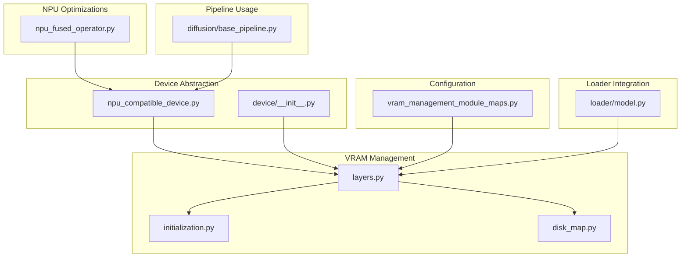
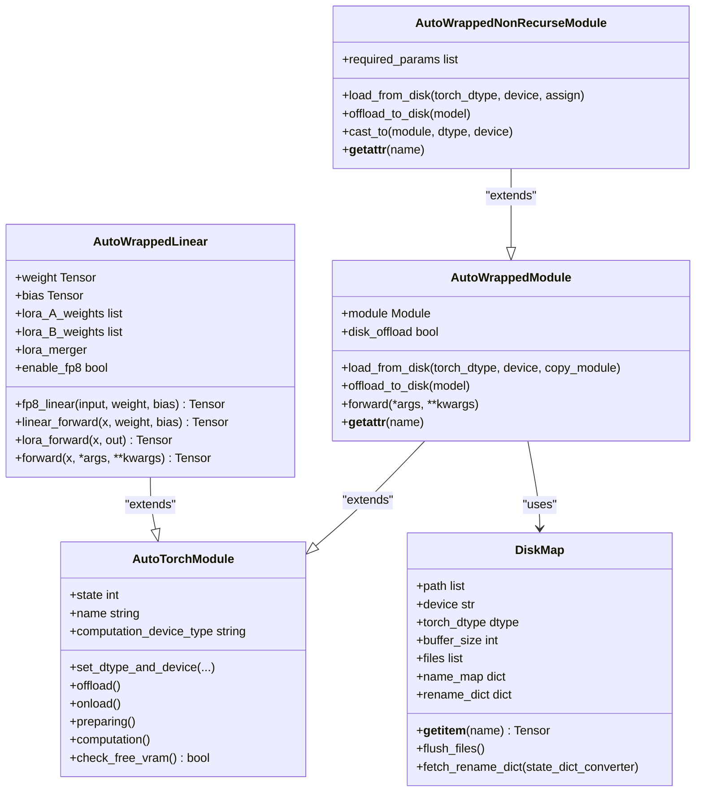
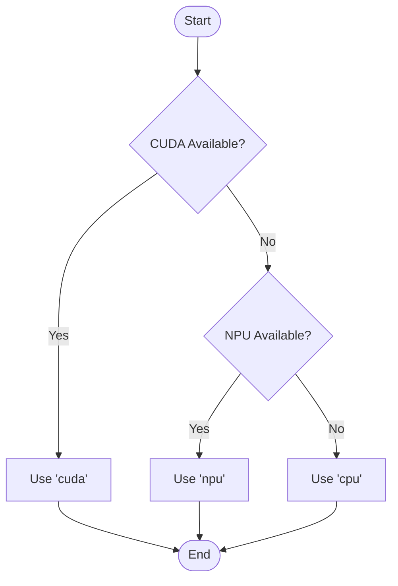
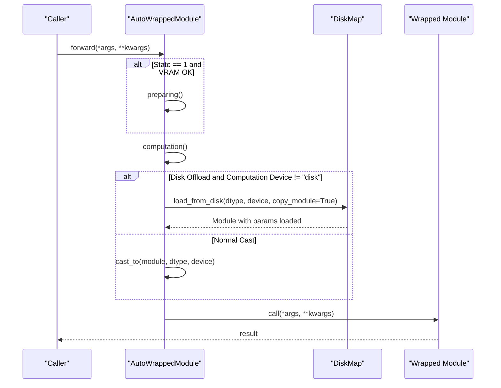
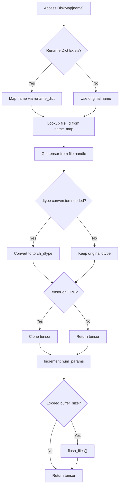
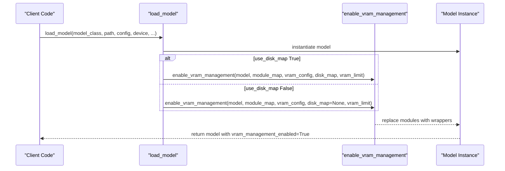
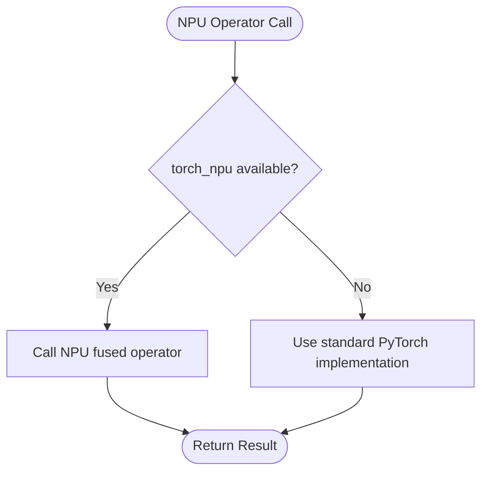
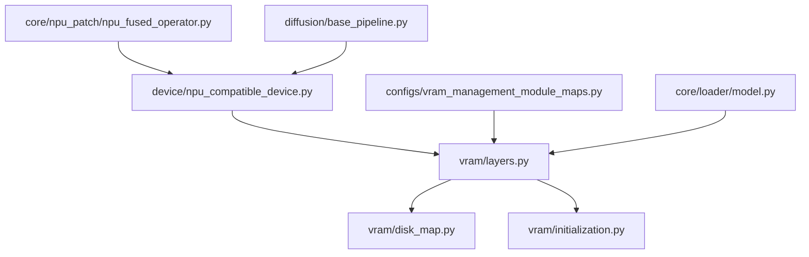

# Device and Hardware API

<cite>
**Referenced Files in This Document**
- [npu_compatible_device.py](file://diffsync/core/device/npu_compatible_device.py)
- [__init__.py (device)](file://diffsync/core/device/__init__.py)
- [layers.py](file://diffsync/core/vram/layers.py)
- [initialization.py](file://diffsync/core/vram/initialization.py)
- [disk_map.py](file://diffsync/core/vram/disk_map.py)
- [vram_management_module_maps.py](file://diffsync/configs/vram_management_module_maps.py)
- [model.py](file://diffsync/core/loader/model.py)
- [npu_fused_operator.py](file://diffsync/core/npu_patch/npu_fused_operator.py)
- [base_pipeline.py](file://diffsync/diffusion/base_pipeline.py)
</cite>

## Table of Contents
1. [Introduction](#introduction)
2. [Project Structure](#project-structure)
3. [Core Components](#core-components)
4. [Architecture Overview](#architecture-overview)
5. [Detailed Component Analysis](#detailed-component-analysis)
6. [Dependency Analysis](#dependency-analysis)
7. [Performance Considerations](#performance-considerations)
8. [Troubleshooting Guide](#troubleshooting-guide)
9. [Conclusion](#conclusion)
10. [Appendices](#appendices)

## Introduction
This document provides comprehensive API documentation for device abstraction and hardware compatibility layers within the project. It covers:
- Device selection utilities and NPU compatibility wrappers
- Multi-GPU/distributed backend configuration
- VRAM-aware module wrapping, disk offloading, and dynamic memory management
- Hardware-specific optimizations and fallback mechanisms
- Device-aware operations and performance monitoring
- Configuration options and practical examples for deploying models across CPU, CUDA, and NPU platforms

The goal is to enable developers to run models efficiently on heterogeneous hardware with minimal code changes while maintaining predictable memory behavior and performance.

## Project Structure
The device and hardware compatibility layer spans several modules:
- Device abstraction and detection utilities
- VRAM management wrappers and disk mapping
- Model loader integration for automatic VRAM wrapping
- NPU-specific fused operator patches
- Configuration maps that bind model classes to VRAM wrapper types

**Diagram sources**
- [npu_compatible_device.py:1-108](file://diffsync/core/device/npu_compatible_device.py#L1-L108)
- [__init__.py (device):1-3](file://diffsync/core/device/__init__.py#L1-L3)
- [layers.py:1-480](file://diffsync/core/vram/layers.py#L1-L480)
- [initialization.py:1-22](file://diffsync/core/vram/initialization.py#L1-L22)
- [disk_map.py:1-94](file://diffsync/core/vram/disk_map.py#L1-L94)
- [vram_management_module_maps.py:1-312](file://diffsync/configs/vram_management_module_maps.py#L1-L312)
- [model.py:1-120](file://diffsync/core/loader/model.py#L1-L120)
- [npu_fused_operator.py:1-30](file://diffsync/core/npu_patch/npu_fused_operator.py#L1-L30)
- [base_pipeline.py:1-20](file://diffsync/diffusion/base_pipeline.py#L1-L20)

**Section sources**
- [npu_compatible_device.py:1-108](file://diffsync/core/device/npu_compatible_device.py#L1-L108)
- [layers.py:1-480](file://diffsync/core/vram/layers.py#L1-L480)
- [vram_management_module_maps.py:1-312](file://diffsync/configs/vram_management_module_maps.py#L1-L312)
- [model.py:1-120](file://diffsync/core/loader/model.py#L1-L120)

## Core Components
- Device utilities: detect available devices (CPU/CUDA/NPU), get device type/name/id, synchronize, empty cache, set high precision flags, parse device strings, and choose distributed backends.
- VRAM wrappers: AutoTorchModule, AutoWrappedModule, AutoWrappedNonRecurseModule, AutoWrappedLinear; support offload/onload/preparing/computation phases, optional disk offloading, and per-layer VRAM limits.
- Disk mapping: lazy loading from safetensors or torch.load with rename mapping and buffer-based file flushing.
- Loader integration: automatically wrap model components based on configuration maps and apply VRAM strategies during model load.
- NPU patches: fused RMSNorm and rotary embeddings optimized for NPU execution.

Key APIs exposed by the device module:
- parse_device_type, parse_nccl_backend, get_available_device_type, get_device_name
- IS_NPU_AVAILABLE, IS_CUDA_AVAILABLE

**Section sources**
- [npu_compatible_device.py:19-108](file://diffsync/core/device/npu_compatible_device.py#L19-L108)
- [__init__.py (device):1-3](file://diffsync/core/device/__init__.py#L1-L3)
- [layers.py:8-480](file://diffsync/core/vram/layers.py#L8-L480)
- [disk_map.py:28-94](file://diffsync/core/vram/disk_map.py#L28-L94)
- [model.py:11-120](file://diffsync/core/loader/model.py#L11-L120)

## Architecture Overview
The system composes device abstraction with VRAM-aware wrappers and configuration-driven module mapping to achieve hardware-agnostic deployment.

**Diagram sources**
- [layers.py:8-480](file://diffsync/core/vram/layers.py#L8-L480)
- [disk_map.py:28-94](file://diffsync/core/vram/disk_map.py#L28-L94)

**Section sources**
- [layers.py:8-480](file://diffsync/core/vram/layers.py#L8-L480)
- [disk_map.py:28-94](file://diffsync/core/vram/disk_map.py#L28-L94)

## Detailed Component Analysis

### Device Selection Utilities and NPU Compatibility
- Device detection:
  - get_device_type returns "cuda", "npu", or "cpu" based on availability.
  - get_torch_device dynamically selects torch.cuda or torch.npu namespace.
  - get_device_id and get_device_name provide current device id and formatted name.
- Synchronization and caching:
  - synchronize delegates to the selected device backend.
  - empty_cache triggers backend-specific cache clearing.
- Distributed backend selection:
  - get_nccl_backend returns "nccl" for CUDA, "hccl" for NPU; raises error otherwise.
  - parse_nccl_backend mirrors this logic for explicit device_type inputs.
- High-precision settings:
  - enable_high_precision_for_bf16 disables TF32 and BF16 reduced precision reduction for both CUDA and NPU when available.
- Parsing helpers:
  - parse_device_type normalizes string or torch.device inputs to canonical types.
  - get_available_device_type exposes the detected device type.

**Diagram sources**
- [npu_compatible_device.py:19-28](file://diffsync/core/device/npu_compatible_device.py#L19-L28)

**Section sources**
- [npu_compatible_device.py:10-108](file://diffsync/core/device/npu_compatible_device.py#L10-L108)

### VRAM-Aware Wrappers and Lifecycle Management
- AutoTorchModule:
  - Configures offload/onload/preparing/computation dtypes and devices.
  - Provides state machine methods: offload(), onload(), preparing(), computation().
  - check_free_vram queries backend memory usage and compares against vram_limit.
- AutoWrappedModule:
  - Wraps arbitrary torch.nn.Module with lifecycle control.
  - Supports disk offloading via DiskMap; can deep-copy modules for computation.
  - forward() triggers preparing if needed and executes computation phase.
- AutoWrappedNonRecurseModule:
  - Specialized for modules where only top-level parameters are managed (e.g., DiT blocks).
  - Adjusts required_params and load_state_dict strictness accordingly.
- AutoWrappedLinear:
  - Wraps Linear layers with FP8 path using torch._scaled_mm when enabled.
  - Integrates LoRA merging paths and computes outputs with optional bias.
  - Implements its own offload/onload/preparing/computation tailored for weights/bias.

**Diagram sources**
- [layers.py:194-198](file://diffsync/core/vram/layers.py#L194-L198)
- [layers.py:168-192](file://diffsync/core/vram/layers.py#L168-L192)
- [disk_map.py:59-71](file://diffsync/core/vram/disk_map.py#L59-L71)

**Section sources**
- [layers.py:8-480](file://diffsync/core/vram/layers.py#L8-L480)
- [disk_map.py:28-94](file://diffsync/core/vram/disk_map.py#L28-L94)

### Disk Mapping and Lazy Loading
- DiskMap:
  - Accepts one or multiple safetensors files or legacy torch.load binaries.
  - Maintains a name map and optional rename mapping via state_dict_converter.
  - Buffers tensors up to a configurable size before flushing open files to avoid memory pressure.
  - Ensures tensors are cloned when residing on CPU to prevent aliasing issues.

**Diagram sources**
- [disk_map.py:59-71](file://diffsync/core/vram/disk_map.py#L59-L71)

**Section sources**
- [disk_map.py:28-94](file://diffsync/core/vram/disk_map.py#L28-L94)

### Model Loader Integration and Automatic VRAM Wrapping
- load_model:
  - Instantiates a model and optionally applies VRAM management based on module_map and vram_config.
  - Supports use_disk_map to enable DiskMap-backed offloading.
  - Sets a flag vram_management_enabled on the model to indicate active management.
- enable_vram_management:
  - Recursively traverses model children and replaces matching modules with wrapped variants.
  - Uses fill_vram_config to propagate defaults when fine-grained configs are absent.

**Diagram sources**
- [model.py:11-120](file://diffsync/core/loader/model.py#L11-L120)
- [layers.py:468-479](file://diffsync/core/vram/layers.py#L468-L479)

**Section sources**
- [model.py:11-120](file://diffsync/core/loader/model.py#L11-L120)
- [layers.py:439-479](file://diffsync/core/vram/layers.py#L439-L479)

### NPU-Specific Optimizations and Fallbacks
- Fused operators:
  - rms_norm_forward_npu and rms_norm_forward_transformers_npu delegate to torch_npu.npu_rms_norm for accelerated normalization.
  - rotary_emb_Zimage_npu uses torch_npu.npu_rotary_mul with autocast disabled for numerical stability.
- Device type awareness:
  - get_device_type ensures correct autocast context for NPU operations.
- Fallback strategy:
  - If torch_npu is unavailable, standard PyTorch implementations remain functional without errors.

**Diagram sources**
- [npu_fused_operator.py:9-30](file://diffsync/core/npu_patch/npu_fused_operator.py#L9-L30)
- [npu_compatible_device.py:19-28](file://diffsync/core/device/npu_compatible_device.py#L19-L28)

**Section sources**
- [npu_fused_operator.py:1-30](file://diffsync/core/npu_patch/npu_fused_operator.py#L1-L30)
- [npu_compatible_device.py:1-108](file://diffsync/core/device/npu_compatible_device.py#L1-L108)

### Configuration Maps for VRAM Management
- VRAM_MANAGEMENT_MODULE_MAPS:
  - Maps model classes to dictionaries of source_module -> target_wrapper.
  - Enables selective wrapping of specific layers (e.g., Linear, Conv, Embedding, custom Norms).
- Versioned updates:
  - VERSION_CHECKER_MAPS allows runtime adjustments to maps based on library versions (e.g., transformers).
- Default configurations:
  - flux_general_vram_config provides reusable mappings for FLUX-related models.

**Diagram sources**
- [vram_management_module_maps.py:1-312](file://diffsync/configs/vram_management_module_maps.py#L1-L312)

**Section sources**
- [vram_management_module_maps.py:1-312](file://diffsync/configs/vram_management_module_maps.py#L1-L312)

## Dependency Analysis
- Device module depends on torch and optionally torch_npu.
- VRAM layers depend on device utilities for parsing and NPU availability checks.
- DiskMap depends on safetensors and torch.load for binary compatibility.
- Loader integrates VRAM management into model instantiation.
- NPU patches rely on torch_npu when present; otherwise fall back to standard ops.

**Diagram sources**
- [npu_compatible_device.py:1-108](file://diffsync/core/device/npu_compatible_device.py#L1-L108)
- [layers.py:1-480](file://diffsync/core/vram/layers.py#L1-L480)
- [disk_map.py:1-94](file://diffsync/core/vram/disk_map.py#L1-L94)
- [initialization.py:1-22](file://diffsync/core/vram/initialization.py#L1-L22)
- [vram_management_module_maps.py:1-312](file://diffsync/configs/vram_management_module_maps.py#L1-L312)
- [model.py:1-120](file://diffsync/core/loader/model.py#L1-L120)
- [npu_fused_operator.py:1-30](file://diffsync/core/npu_patch/npu_fused_operator.py#L1-L30)
- [base_pipeline.py:1-20](file://diffsync/diffusion/base_pipeline.py#L1-L20)

**Section sources**
- [layers.py:1-480](file://diffsync/core/vram/layers.py#L1-L480)
- [disk_map.py:1-94](file://diffsync/core/vram/disk_map.py#L1-L94)
- [vram_management_module_maps.py:1-312](file://diffsync/configs/vram_management_module_maps.py#L1-L312)
- [model.py:1-120](file://diffsync/core/loader/model.py#L1-L120)

## Performance Considerations
- Precision tuning:
  - enable_high_precision_for_bf16 reduces TF32/BF16 reduced precision artifacts on CUDA/NPU.
- Memory management:
  - vram_limit gates automatic preparing transitions to avoid OOM during inference/training.
  - Disk offloading reduces peak GPU memory at the cost of I/O latency; tune buffer_size via environment variable.
- Compilation:
  - For acceleration, consider torch.compile with appropriate mode and dynamic settings as documented in pipeline usage guides.
- NPU fused ops:
  - Using torch_npu fused operators improves throughput for normalization and rotary embeddings.

[No sources needed since this section provides general guidance]

## Troubleshooting Guide
- No available distributed backend:
  - get_nccl_backend raises RuntimeError when neither CUDA nor NPU is available. Ensure proper device setup or disable distributed mode.
- Slow loading from non-safetensors:
  - DiskMap warns when using torch.load binaries; convert to safetensors for faster access.
- VRAM limit exceeded:
  - check_free_vram prevents preparing when memory is insufficient; adjust vram_limit or reduce batch sizes.
- NPU not detected:
  - IS_NPU_AVAILABLE requires torch_npu installed and compatible runtime; verify installation and device availability.

**Section sources**
- [npu_compatible_device.py:62-70](file://diffsync/core/device/npu_compatible_device.py#L62-L70)
- [disk_map.py:14-17](file://diffsync/core/vram/disk_map.py#L14-L17)
- [layers.py:65-69](file://diffsync/core/vram/layers.py#L65-L69)

## Conclusion
The device abstraction and VRAM management framework enables robust, hardware-agnostic deployment across CPU, CUDA, and NPU platforms. By combining device detection utilities, configurable VRAM wrappers, disk offloading, and NPU-specific optimizations, users can deploy complex models efficiently while retaining control over memory and performance characteristics. The configuration-driven approach simplifies integrating new models and adapting to evolving libraries.

[No sources needed since this section summarizes without analyzing specific files]

## Appendices

### Practical Examples for Deploying Models Across Hardware Platforms
- Detect device and configure backend:
  - Use get_device_type and get_nccl_backend to select appropriate distributed backend.
- Load model with VRAM management:
  - Call load_model with module_map and vram_config to automatically wrap key layers.
  - Enable disk offloading by passing use_disk_map and a DiskMap instance.
- Optimize for NPU:
  - Ensure torch_npu is installed; fused operators will be used automatically where applicable.
- Monitor memory:
  - Set vram_limit to trigger safe preparing transitions; monitor used_memory via backend mem_get_info.

[No sources needed since this section provides general guidance]