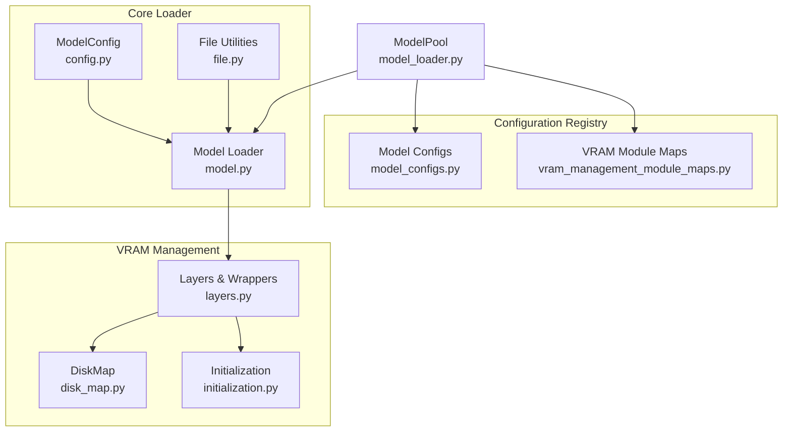
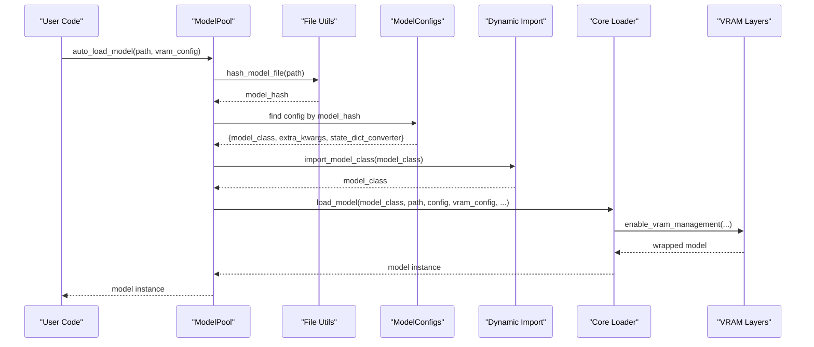
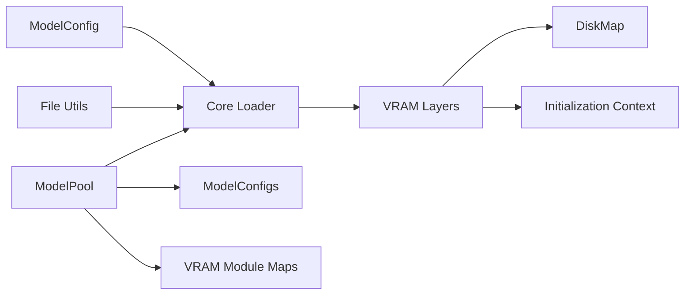

# Model Loader API

<cite>
**Referenced Files in This Document**
- [config.py](file://diffsynth/core/loader/config.py)
- [file.py](file://diffsynth/core/loader/file.py)
- [model.py](file://diffsynth/core/loader/model.py)
- [model_loader.py](file://diffsynth/models/model_loader.py)
- [model_configs.py](file://diffsynth/configs/model_configs.py)
- [vram_management_module_maps.py](file://diffsynth/configs/vram_management_module_maps.py)
- [initialization.py](file://diffsynth/core/vram/initialization.py)
- [disk_map.py](file://diffsynth/core/vram/disk_map.py)
- [layers.py](file://diffsynth/core/vram/layers.py)
</cite>

## Table of Contents
1. [Introduction](#introduction)
2. [Project Structure](#project-structure)
3. [Core Components](#core-components)
4. [Architecture Overview](#architecture-overview)
5. [Detailed Component Analysis](#detailed-component-analysis)
6. [Dependency Analysis](#dependency-analysis)
7. [Performance Considerations](#performance-considerations)
8. [Troubleshooting Guide](#troubleshooting-guide)
9. [Conclusion](#conclusion)
10. [Appendices](#appendices)

## Introduction
This document provides comprehensive API documentation for the model loading and configuration systems. It focuses on:
- ModelConfig for specifying and validating model sources, download behavior, and VRAM settings
- File handling utilities for state dictionaries and configuration files
- Automatic model detection via hash-based identification
- Dynamic module importing to instantiate model classes from string paths
- Complete class interfaces, configuration schemas, file format specifications, and practical examples for integrating custom models

The system supports both local files and remote repositories (ModelScope and Hugging Face), with optional disk offloading and fine-grained VRAM management.

## Project Structure
The model loader subsystem is organized into core loader utilities, VRAM management, and configuration registries:
- Core loader: configuration parsing, file I/O, and model instantiation
- VRAM management: lazy loading, device/dtype orchestration, and disk-backed parameter access
- Configuration registry: model type detection via hashes and mapping to model classes and converters

**Diagram sources**
- [config.py:1-120](file://diffsynth/core/loader/config.py#L1-L120)
- [file.py:1-131](file://diffsynth/core/loader/file.py#L1-L131)
- [model.py:1-106](file://diffsynth/core/loader/model.py#L1-L106)
- [model_loader.py:1-114](file://diffsynth/models/model_loader.py#L1-L114)
- [model_configs.py:1-920](file://diffsynth/configs/model_configs.py#L1-L920)
- [vram_management_module_maps.py:1-312](file://diffsynth/configs/vram_management_module_maps.py#L1-L312)
- [initialization.py:1-22](file://diffsynth/core/vram/initialization.py#L1-L22)
- [disk_map.py:1-94](file://diffsynth/core/vram/disk_map.py#L1-L94)
- [layers.py:1-480](file://diffsynth/core/vram/layers.py#L1-L480)

**Section sources**
- [config.py:1-120](file://diffsynth/core/loader/config.py#L1-L120)
- [file.py:1-131](file://diffsynth/core/loader/file.py#L1-L131)
- [model.py:1-106](file://diffsynth/core/loader/model.py#L1-L106)
- [model_loader.py:1-114](file://diffsynth/models/model_loader.py#L1-L114)
- [model_configs.py:1-920](file://diffsynth/configs/model_configs.py#L1-L920)
- [vram_management_module_maps.py:1-312](file://diffsynth/configs/vram_management_module_maps.py#L1-L312)
- [initialization.py:1-22](file://diffsynth/core/vram/initialization.py#L1-L22)
- [disk_map.py:1-94](file://diffsynth/core/vram/disk_map.py#L1-L94)
- [layers.py:1-480](file://diffsynth/core/vram/layers.py#L1-L480)

## Core Components
- ModelConfig: Dataclass that encapsulates model source specification, download behavior, local path resolution, and VRAM configuration.
- File Utilities: Functions to load state dicts from safetensors or binary formats, compute stable hashes over keys, and inspect key shapes without full loading.
- Model Loader: Instantiates models with optional VRAM management, disk-backed parameters, and DeepSpeed ZeRO Stage 3 compatibility.
- ModelPool: Orchestrates automatic model detection by hashing input files, dynamically imports model classes, applies state dict converters, and enables VRAM management.
- VRAM Management: Wraps modules to lazily move parameters between devices/dtypes, support disk offloading, and enforce per-call memory limits.

**Section sources**
- [config.py:1-120](file://diffsynth/core/loader/config.py#L1-L120)
- [file.py:1-131](file://diffsynth/core/loader/file.py#L1-L131)
- [model.py:1-106](file://diffsynth/core/loader/model.py#L1-L106)
- [model_loader.py:1-114](file://diffsynth/models/model_loader.py#L1-L114)
- [layers.py:1-480](file://diffsynth/core/vram/layers.py#L1-L480)

## Architecture Overview
The end-to-end flow for automatic model loading:
1. User calls ModelPool.auto_load_model(path, vram_config).
2. Hash is computed from the provided file(s) using file utilities.
3. The hash is matched against MODEL_CONFIGS to identify the model type and class.
4. ModelPool.import_model_class dynamically loads the model class from a string path.
5. If a state_dict_converter is specified, it is imported and applied during loading.
6. VRAM management is enabled based on VRAM_MANAGEMENT_MODULE_MAPS and version-specific overrides.
7. The model is instantiated and returned, optionally with cleared parameters.

**Diagram sources**
- [model_loader.py:1-114](file://diffsynth/models/model_loader.py#L1-L114)
- [file.py:1-131](file://diffsynth/core/loader/file.py#L1-L131)
- [model_configs.py:1-920](file://diffsynth/configs/model_configs.py#L1-L920)
- [model.py:1-106](file://diffsynth/core/loader/model.py#L1-L106)
- [layers.py:1-480](file://diffsynth/core/vram/layers.py#L1-L480)

## Detailed Component Analysis

### ModelConfig API
ModelConfig defines the schema for specifying model sources and behaviors:
- path: Local file path or list of files; if None, model_id must be provided.
- model_id: Remote repository ID (e.g., ModelScope or Hugging Face).
- origin_file_pattern: Glob pattern to select relevant files when downloading.
- download_source: "modelscope" or "huggingface"; defaults to environment variable or "modelscope".
- local_model_path: Base directory for downloaded models; defaults to "./models" or environment override.
- skip_download: Boolean flag controlled by parameter or environment variable.
- offload/onload/preparing/computation device and dtype: Fine-grained VRAM control.
- clear_parameters: Optional flag to clear loaded parameters after instantiation.
- state_dict: Optional preloaded state dict to bypass file loading.

Key methods:
- check_input(): Validates that either path or model_id is provided.
- parse_original_file_pattern(): Normalizes file patterns for globbing.
- parse_download_source(): Resolves download backend.
- parse_skip_download(): Resolves skip-download flag from parameter or environment.
- download(): Downloads files from ModelScope or Hugging Face respecting allow/ignore patterns.
- require_downloading(): Determines whether download is necessary.
- reset_local_model_path(): Applies environment override for base path.
- download_if_necessary(): Full pipeline to ensure files are present and resolve final path(s).
- vram_config(): Returns a dictionary suitable for VRAM management.

Practical usage patterns:
- Specify local files directly via path.
- Specify remote model_id with origin_file_pattern to target specific components.
- Control download behavior via environment variables or explicit flags.
- Configure VRAM behavior per stage (offload, onload, preparing, computation).

**Section sources**
- [config.py:1-120](file://diffsynth/core/loader/config.py#L1-L120)

### File Handling Utilities
Functions for robust state dictionary loading and inspection:
- load_state_dict(file_path, torch_dtype, device, pin_memory, verbose): Loads .safetensors or binary files, merges multiple files if needed, and optionally pins memory for faster GPU transfers.
- load_state_dict_from_safetensors(...): Reads tensors from safetensors with optional dtype casting.
- load_state_dict_from_bin(...): Loads PyTorch binaries, normalizes nested structures (state_dict/module/model_state), and casts dtypes.
- convert_state_dict_keys_to_single_str(state_dict, with_shape=True): Serializes keys and shapes into a deterministic string for hashing.
- hash_state_dict_keys(state_dict, with_shape=True): Computes MD5 hash over serialized keys/shapes.
- load_keys_dict(file_path): Returns a lightweight dict of key -> shape without loading full tensors.
- convert_state_dict_to_keys_dict(state_dict): Converts a loaded state dict to a keys-only representation.
- load_keys_dict_from_safetensors/from_bin: Efficiently read metadata for large files.
- convert_keys_dict_to_single_str(keys_dict, with_shape=True): Serializes keys-only structure deterministically.
- hash_model_file(path, with_shape=True): Computes a stable hash over model file contents via keys and shapes.

File format specifications:
- Safetensors: Preferred format; supports fast streaming and safe deserialization.
- Binary (.pt/.bin): Supported; may wrap state dict under common keys; slower than safetensors.

Hashing semantics:
- Hashes are computed over sorted key strings and optional tensor shapes to uniquely identify model architecture and weights layout.
- Useful for matching MODEL_CONFIGS entries and caching strategies.

**Section sources**
- [file.py:1-131](file://diffsynth/core/loader/file.py#L1-L131)

### Model Loading Pipeline
Core loader orchestrates model instantiation with flexible options:
- load_model(model_class, path, config, torch_dtype, device, state_dict_converter, use_disk_map, module_map, vram_config, vram_limit, state_dict):
  - Creates model within an initialization context that skips random parameter initialization unless DeepSpeed ZeRO Stage 3 is active.
  - Supports three loading modes:
    - Direct state dict assignment (in-memory).
    - Disk-backed lazy loading via DiskMap.
    - VRAM-managed wrapping with module_map and staged device/dtype transitions.
  - Handles DeepSpeed ZeRO Stage 3 by partitioned loading.
  - Ensures model is set to eval mode if applicable.
- load_model_with_disk_offload(model_class, path, config, torch_dtype, device, state_dict_converter, module_map):
  - Convenience wrapper to fully offload parameters to disk and manage them via VRAM layers.
- get_init_context(torch_dtype, device):
  - Provides appropriate initialization contexts for performance and distributed training compatibility.

Behavior highlights:
- use_disk_map=True enables lazy parameter access to avoid loading entire checkpoints into memory.
- state_dict_converter allows adapting external checkpoint formats to expected model state dict layouts.
- module_map maps original module types to VRAM-aware wrappers for fine-grained memory control.

**Section sources**
- [model.py:1-106](file://diffsynth/core/loader/model.py#L1-L106)

### ModelPool and Automatic Detection
ModelPool centralizes model discovery and instantiation:
- import_model_class(model_class): Dynamically imports a Python class from a dotted string path.
- need_to_enable_vram_management(vram_config): Determines if VRAM management should be activated.
- fetch_module_map(model_class, vram_config): Builds a module map from VRAM_MANAGEMENT_MODULE_MAPS, applying version-specific overrides via VERSION_CHECKER_MAPS.
- load_model_file(config, path, vram_config, vram_limit, state_dict):
  - Imports model class and optional converter.
  - Constructs VRAM module map.
  - Calls core loader with DiskMap-backed loading and VRAM wrapping.
- default_vram_config(): Provides sensible defaults for VRAM stages.
- auto_load_model(path, vram_config, vram_limit, clear_parameters, state_dict):
  - Computes model hash from files.
  - Matches against MODEL_CONFIGS to identify model type and class.
  - Loads model with appropriate converter and VRAM settings.
  - Optionally clears parameters post-load.
  - Tracks loaded models and their names/paths for retrieval.
- fetch_model(model_name, index=None): Retrieves one or more models by name, with optional indexing.
- clear_parameters(model): Recursively sets parameters to None to free memory.

Automatic detection workflow:
- Hash-based identification ensures correct mapping even across variants and versions.
- Dynamic importing decouples configuration from implementation code.
- Version checker functions adapt module maps to library changes.

**Section sources**
- [model_loader.py:1-114](file://diffsynth/models/model_loader.py#L1-L114)
- [model_configs.py:1-920](file://diffsynth/configs/model_configs.py#L1-L920)
- [vram_management_module_maps.py:1-312](file://diffsynth/configs/vram_management_module_maps.py#L1-L312)

### VRAM Management System
VRAM management wraps modules to optimize memory usage through staged device/dtype transitions and optional disk offloading:
- AutoTorchModule: Base class defining dtype/device stages and lifecycle methods (offload, onload, preparing, computation).
- AutoWrappedModule: Wraps arbitrary nn.Module, supporting disk-backed parameter loading via DiskMap and staged transitions.
- AutoWrappedNonRecurseModule: Variant that only manages top-level parameters (useful for modules with internal parameter management).
- AutoWrappedLinear: Specialized wrapper for Linear layers with FP8 support and LoRA integration.
- enable_vram_management(model, module_map, vram_config, vram_limit, disk_map):
  - Applies wrapping recursively according to module_map.
  - Sets vram_management_enabled flag for downstream checks.
- fill_vram_config(model, vram_config): Ensures consistent defaults when fine-grained configuration is not provided.

Disk-backed loading:
- DiskMap opens safetensors or binary files once and lazily retrieves requested parameters, flushing handles when buffer thresholds are exceeded.
- Supports renaming via state_dict_converter to align parameter names.

Lifecycle states:
- offload: Parameters moved to offload device/dtype (or meta/disk).
- onload: Parameters moved to onload device/dtype.
- preparing: Temporary preparation for computation (optional intermediate stage).
- computation: Final device/dtype used for forward pass.

Memory limit enforcement:
- AutoWrappedModule checks available VRAM before transitioning to preparing state to avoid OOM.

**Section sources**
- [layers.py:1-480](file://diffsynth/core/vram/layers.py#L1-L480)
- [disk_map.py:1-94](file://diffsynth/core/vram/disk_map.py#L1-L94)
- [initialization.py:1-22](file://diffsynth/core/vram/initialization.py#L1-L22)

### Configuration Schema and Model Registry
MODEL_CONFIGS is a registry of supported models, each entry containing:
- model_hash: Stable hash identifying the model’s file layout and content.
- model_name: Human-readable identifier used for fetching models later.
- model_class: Fully qualified Python path to the model class.
- extra_kwargs: Optional constructor arguments passed to the model.
- state_dict_converter: Optional fully qualified path to a converter class for adapting external checkpoints.

Examples include image encoders, text encoders, DiTs, VAEs, controlnets, and adapters across multiple model families.

VRAM_MANAGEMENT_MODULE_MAPS:
- Maps model classes to mappings of original module types to VRAM-aware wrapper types.
- Enables fine-grained control over which layers are wrapped and how they transition between devices/dtypes.
- VERSION_CHECKER_MAPS provides dynamic updates to module maps based on third-party library versions.

**Section sources**
- [model_configs.py:1-920](file://diffsynth/configs/model_configs.py#L1-L920)
- [vram_management_module_maps.py:1-312](file://diffsynth/configs/vram_management_module_maps.py#L1-L312)

## Dependency Analysis
The loader system exhibits clear separation of concerns:
- Configuration (ModelConfig) is independent of loading logic but informs download and VRAM behavior.
- File utilities are pure functions focused on I/O and hashing, with no side effects beyond optional prints.
- Core loader composes file utilities, VRAM management, and initialization contexts to instantiate models.
- ModelPool depends on configuration registry and VRAM maps to perform automatic detection and wrapping.
- VRAM layers depend on DiskMap and initialization helpers to implement efficient memory staging.

Potential circular dependencies:
- None detected; imports are layered and modular.

External dependencies:
- safetensors for safe tensor serialization.
- transformers for DeepSpeed ZeRO Stage 3 integration and version checks.
- huggingface_hub and modelscope for remote downloads.

**Diagram sources**
- [config.py:1-120](file://diffsynth/core/loader/config.py#L1-L120)
- [file.py:1-131](file://diffsynth/core/loader/file.py#L1-L131)
- [model.py:1-106](file://diffsynth/core/loader/model.py#L1-L106)
- [model_loader.py:1-114](file://diffsynth/models/model_loader.py#L1-L114)
- [model_configs.py:1-920](file://diffsynth/configs/model_configs.py#L1-L920)
- [vram_management_module_maps.py:1-312](file://diffsynth/configs/vram_management_module_maps.py#L1-L312)
- [initialization.py:1-22](file://diffsynth/core/vram/initialization.py#L1-L22)
- [disk_map.py:1-94](file://diffsynth/core/vram/disk_map.py#L1-L94)
- [layers.py:1-480](file://diffsynth/core/vram/layers.py#L1-L480)

**Section sources**
- [config.py:1-120](file://diffsynth/core/loader/config.py#L1-L120)
- [file.py:1-131](file://diffsynth/core/loader/file.py#L1-L131)
- [model.py:1-106](file://diffsynth/core/loader/model.py#L1-L106)
- [model_loader.py:1-114](file://diffsynth/models/model_loader.py#L1-L114)
- [model_configs.py:1-920](file://diffsynth/configs/model_configs.py#L1-L920)
- [vram_management_module_maps.py:1-312](file://diffsynth/configs/vram_management_module_maps.py#L1-L312)
- [initialization.py:1-22](file://diffsynth/core/vram/initialization.py#L1-L22)
- [disk_map.py:1-94](file://diffsynth/core/vram/disk_map.py#L1-L94)
- [layers.py:1-480](file://diffsynth/core/vram/layers.py#L1-L480)

## Performance Considerations
- Prefer safetensors over binary formats for faster loading and safer deserialization.
- Use DiskMap-backed loading to avoid loading entire checkpoints into memory; ideal for large models or constrained environments.
- Enable VRAM management with appropriate module maps to minimize peak memory usage and enable staged transitions.
- Set vram_limit to prevent OOM during preparing transitions.
- Pin memory for CPU-loaded state dicts to accelerate GPU transfers when moving to CUDA.
- Skip model initialization where possible to reduce overhead; the loader already does this except under DeepSpeed ZeRO Stage 3.

[No sources needed since this section provides general guidance]

## Troubleshooting Guide
Common issues and resolutions:
- No valid model files: Ensure either path or model_id is provided in ModelConfig; skip_download only applies when path is specified.
- Download failures: Verify download_source matches available backends ("modelscope" or "huggingface"); check network connectivity and permissions.
- Cannot detect model type: Confirm that the provided files match a known model_hash in MODEL_CONFIGS; recompute hash if files changed.
- Slow loading with binary files: Convert to safetensors to improve performance.
- Out-of-memory errors: Reduce vram_limit, enable VRAM management, or switch to disk offloading.
- DeepSpeed ZeRO Stage 3: Ensure proper initialization context; the loader handles partitioned loading automatically.

**Section sources**
- [config.py:1-120](file://diffsynth/core/loader/config.py#L1-L120)
- [model_loader.py:1-114](file://diffsynth/models/model_loader.py#L1-L114)
- [file.py:1-131](file://diffsynth/core/loader/file.py#L1-L131)

## Conclusion
The model loader system provides a robust, extensible framework for loading and configuring diverse models with fine-grained VRAM control and disk-backed parameter access. By leveraging hash-based detection, dynamic imports, and configurable VRAM strategies, users can integrate custom models seamlessly while optimizing memory and performance.

[No sources needed since this section summarizes without analyzing specific files]

## Appendices

### Practical Examples for Integrating Custom Models
- Add a new model to MODEL_CONFIGS:
  - Compute model_hash using hash_model_file(path).
  - Provide model_class as a fully qualified Python path.
  - Include extra_kwargs if the model requires specific constructor arguments.
  - Optionally specify state_dict_converter to adapt external checkpoint formats.
- Configure ModelConfig for remote downloads:
  - Set model_id and origin_file_pattern to target specific components.
  - Choose download_source based on your repository provider.
  - Adjust local_model_path via environment variable or parameter.
- Enable VRAM management:
  - Define VRAM_MANAGEMENT_MODULE_MAPS entries for your model class.
  - Use version checker functions if third-party libraries change module names.
  - Set vram_limit and device/dtype configurations per stage.

[No sources needed since this section provides general guidance]