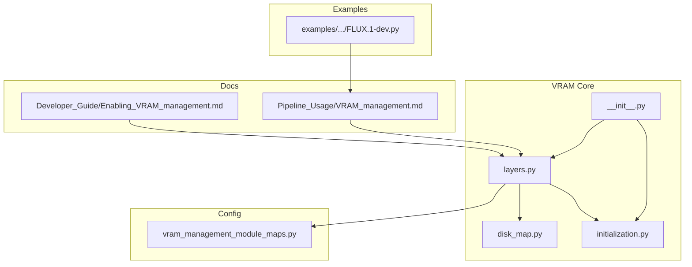
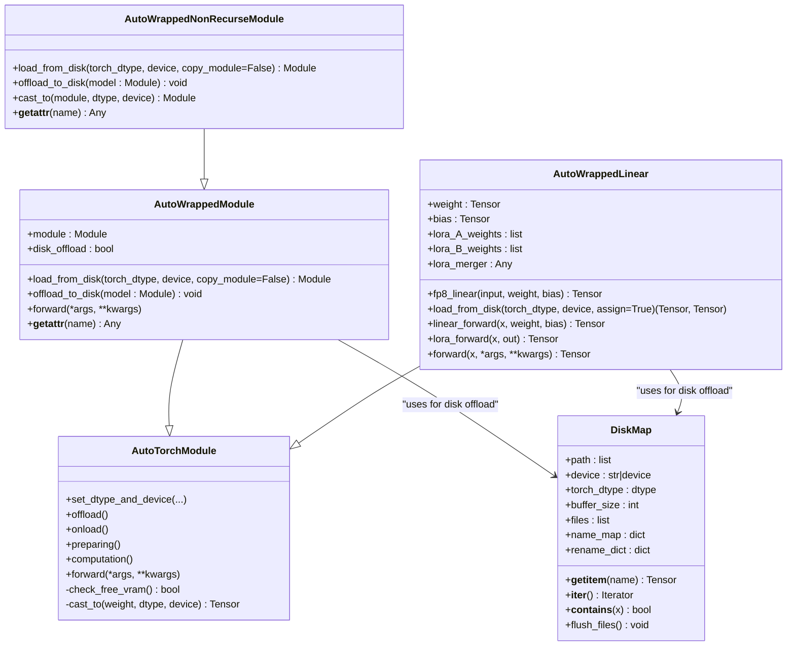
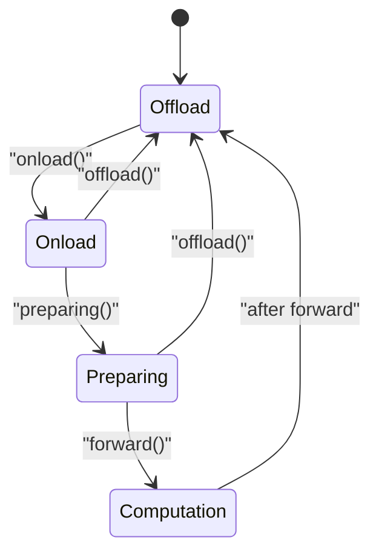
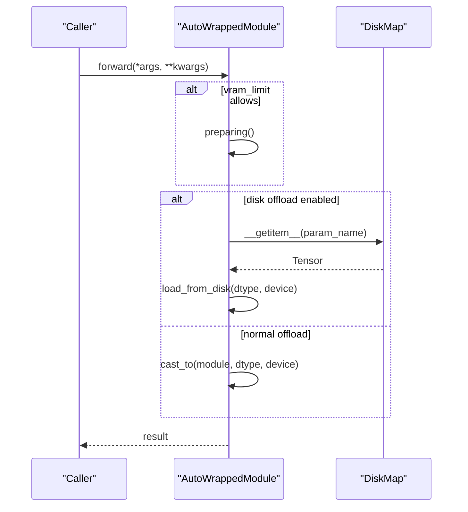
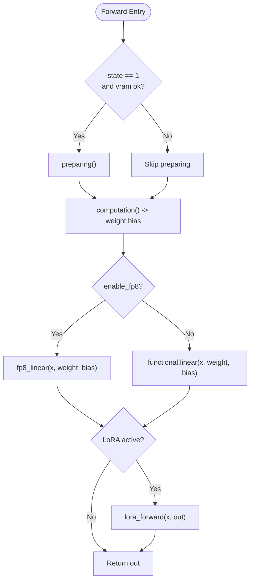
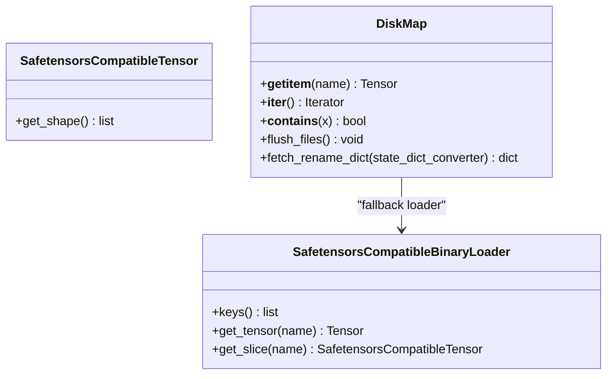
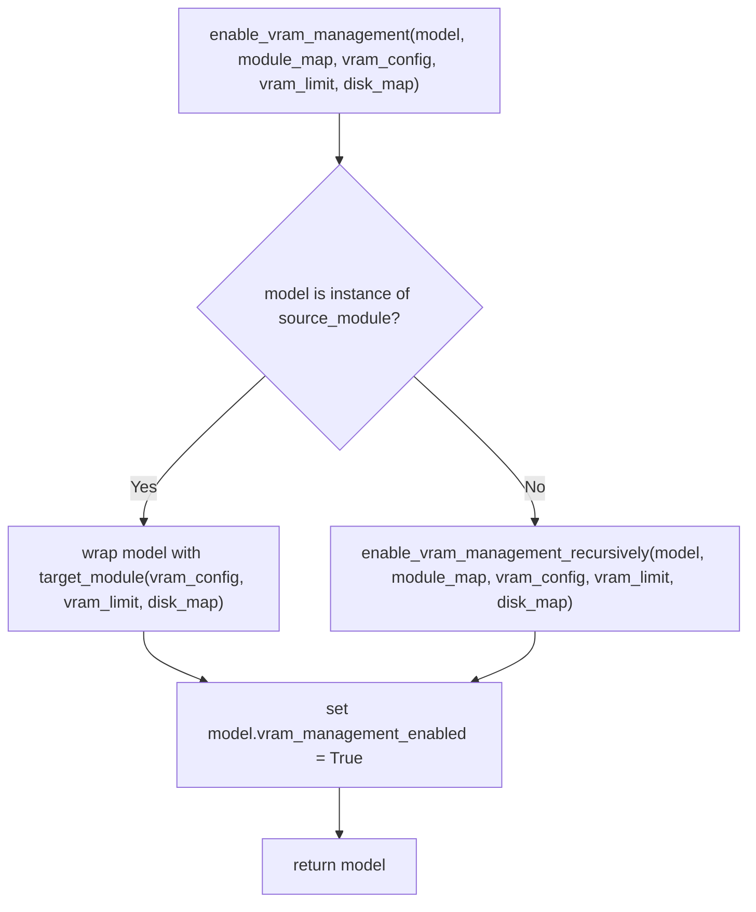
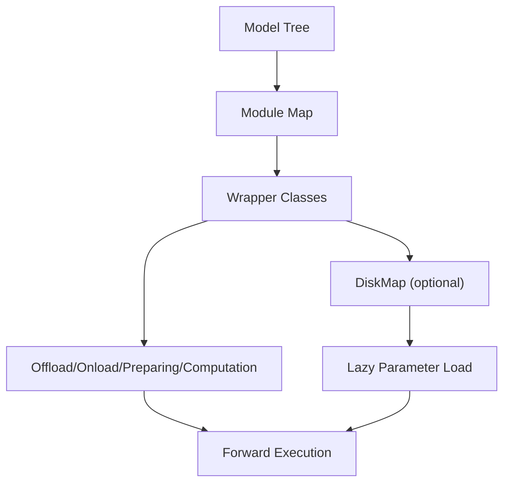
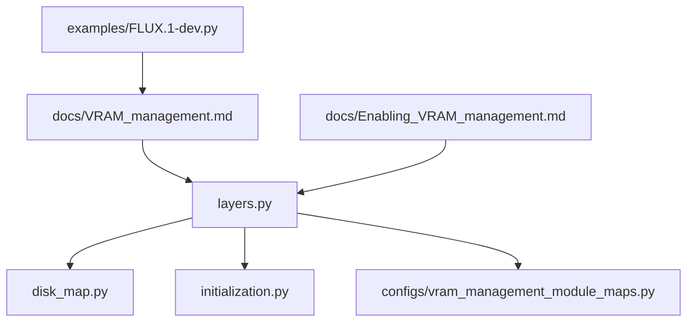

# VRAM Management API

<cite>
**Referenced Files in This Document**
- [layers.py](file://diffsynth/core/vram/layers.py)
- [disk_map.py](file://diffsynth/core/vram/disk_map.py)
- [initialization.py](file://diffsynth/core/vram/initialization.py)
- [__init__.py](file://diffsynth/core/vram/__init__.py)
- [vram_management_module_maps.py](file://diffsynth/configs/vram_management_module_maps.py)
- [VRAM_management.md](file://docs/en/Pipeline_Usage/VRAM_management.md)
- [Enabling_VRAM_management.md](file://docs/en/Developer_Guide/Enabling_VRAM_management.md)
- [FLUX.1-dev.py](file://examples/flux/model_inference_low_vram/FLUX.1-dev.py)
</cite>

## Table of Contents
1. [Introduction](#introduction)
2. [Project Structure](#project-structure)
3. [Core Components](#core-components)
4. [Architecture Overview](#architecture-overview)
5. [Detailed Component Analysis](#detailed-component-analysis)
6. [Dependency Analysis](#dependency-analysis)
7. [Performance Considerations](#performance-considerations)
8. [Troubleshooting Guide](#troubleshooting-guide)
9. [Conclusion](#conclusion)
10. [Appendices](#appendices)

## Introduction
This document provides a comprehensive API reference for the VRAM management system used to run large models on limited GPU memory. It covers:
- Layer-level VRAM management via wrapper classes
- Device placement strategies across offload, onload, preparing, and computation phases
- Disk offloading with persistent storage mapping
- Initialization utilities that enable safe model construction without allocating device memory
- Configuration-driven module maps for automatic wrapping
- Practical usage patterns and examples for optimizing memory in large model deployments

The system is designed to minimize peak VRAM while maintaining inference correctness and acceptable performance through lazy loading, dtype casting, and optional disk-backed parameter access.

## Project Structure
The VRAM management subsystem lives under diffsynth.core.vram and integrates with configuration maps and documentation. Key files:
- diffsynth/core/vram/layers.py: Core wrapper classes and enabling functions
- diffsynth/core/vram/disk_map.py: Disk-backed parameter mapping and lazy loading
- diffsynth/core/vram/initialization.py: Context manager to skip model initialization on meta device
- diffsynth/core/vram/__init__.py: Public exports
- diffsynth/configs/vram_management_module_maps.py: Predefined module-to-wrapper mappings per model class
- docs/en/Pipeline_Usage/VRAM_management.md: User-facing usage guide
- docs/en/Developer_Guide/Enabling_VRAM_management.md: Developer guide for fine-grained VRAM control
- examples/flux/model_inference_low_vram/FLUX.1-dev.py: Example low-VRAM pipeline usage



**Diagram sources**
- [layers.py:1-480](file://diffsynth/core/vram/layers.py#L1-L480)
- [disk_map.py:1-94](file://diffsynth/core/vram/disk_map.py#L1-L94)
- [initialization.py:1-22](file://diffsynth/core/vram/initialization.py#L1-L22)
- [__init__.py:1-3](file://diffsynth/core/vram/__init__.py#L1-L3)
- [vram_management_module_maps.py:1-312](file://diffsynth/configs/vram_management_module_maps.py#L1-L312)
- [VRAM_management.md:1-206](file://docs/en/Pipeline_Usage/VRAM_management.md#L1-L206)
- [Enabling_VRAM_management.md:1-455](file://docs/en/Developer_Guide/Enabling_VRAM_management.md#L1-L455)
- [FLUX.1-dev.py:1-38](file://examples/flux/model_inference_low_vram/FLUX.1-dev.py#L1-L38)

**Section sources**
- [layers.py:1-480](file://diffsynth/core/vram/layers.py#L1-L480)
- [disk_map.py:1-94](file://diffsynth/core/vram/disk_map.py#L1-L94)
- [initialization.py:1-22](file://diffsynth/core/vram/initialization.py#L1-L22)
- [__init__.py:1-3](file://diffsynth/core/vram/__init__.py#L1-L3)
- [vram_management_module_maps.py:1-312](file://diffsynth/configs/vram_management_module_maps.py#L1-L312)
- [VRAM_management.md:1-206](file://docs/en/Pipeline_Usage/VRAM_management.md#L1-L206)
- [Enabling_VRAM_management.md:1-455](file://docs/en/Developer_Guide/Enabling_VRAM_management.md#L1-L455)
- [FLUX.1-dev.py:1-38](file://examples/flux/model_inference_low_vram/FLUX.1-dev.py#L1-L38)

## Core Components
- AutoTorchModule: Base class providing dtype/device state management and VRAM checks
- AutoWrappedModule: Wraps arbitrary torch.nn.Module with VRAM-aware states and optional disk offload
- AutoWrappedNonRecurseModule: Variant that only manages top-level parameters (no recursion)
- AutoWrappedLinear: Specialized wrapper for Linear layers with FP8 support and LoRA integration
- DiskMap: Persistent, lazy-loading mapping from parameter names to tensors backed by safetensors or compatible loaders
- Initialization utilities: skip_model_initialization context manager for meta-device-safe construction
- Enabling APIs: enable_vram_management and enable_vram_management_recursively for automatic wrapping
- Module maps: VRAM_MANAGEMENT_MODULE_MAPS defines per-model-class mappings to wrappers

Key responsibilities:
- Manage four-layer states: Offload, Onload, Preparing, Computation
- Cast between dtypes and devices as needed
- Optionally load parameters lazily from disk when configured
- Provide automatic detection and wrapping based on module types

**Section sources**
- [layers.py:8-479](file://diffsynth/core/vram/layers.py#L8-L479)
- [disk_map.py:28-94](file://diffsynth/core/vram/disk_map.py#L28-L94)
- [initialization.py:5-22](file://diffsynth/core/vram/initialization.py#L5-L22)
- [vram_management_module_maps.py:12-298](file://diffsynth/configs/vram_management_module_maps.py#L12-L298)

## Architecture Overview
The VRAM management architecture centers around wrapper modules that intercept forward calls and manage layer lifecycles. DiskMap provides a unified interface to load parameters on demand. The enabling functions traverse the model tree and replace target modules with VRAM-aware wrappers according to a module map.



**Diagram sources**
- [layers.py:8-479](file://diffsynth/core/vram/layers.py#L8-L479)
- [disk_map.py:28-94](file://diffsynth/core/vram/disk_map.py#L28-L94)

## Detailed Component Analysis

### AutoTorchModule
- Purpose: Base class encapsulating dtype/device state transitions and VRAM checks
- Key methods:
  - set_dtype_and_device(offload_dtype, offload_device, onload_dtype, onload_device, preparing_dtype, preparing_device, computation_dtype, computation_device, vram_limit)
  - offload(): Move to offload dtype/device; state=0
  - onload(): Move to onload dtype/device; state=1
  - preparing(): Move to preparing dtype/device; state=2
  - computation(): Return a version of the module ready for computation at computation dtype/device
  - check_free_vram(): Returns True if current used VRAM < vram_limit
  - cast_to(weight, dtype, device): Efficiently create a new tensor with desired dtype/device
- State machine:
  - Offload (0) -> Onload (1) -> Preparing (2) -> Computation (temporary during forward)



**Diagram sources**
- [layers.py:65-86](file://diffsynth/core/vram/layers.py#L65-L86)

**Section sources**
- [layers.py:8-86](file://diffsynth/core/vram/layers.py#L8-L86)

### AutoWrappedModule
- Purpose: Wrap any torch.nn.Module with VRAM-aware lifecycle and optional disk offload
- Key behaviors:
  - Maintains required_params for disk offload mapping
  - load_from_disk(state_dict_keys, dtype, device, copy_module=False) loads params into module
  - offload_to_disk(model) moves module to meta device for disk offload
  - forward triggers preparing if vram_limit allows, then computes
- Disk offload path:
  - When offload_device/onload_device == "disk", parameters are loaded lazily from DiskMap



**Diagram sources**
- [layers.py:88-198](file://diffsynth/core/vram/layers.py#L88-L198)
- [disk_map.py:59-71](file://diffsynth/core/vram/disk_map.py#L59-L71)

**Section sources**
- [layers.py:88-198](file://diffsynth/core/vram/layers.py#L88-L198)

### AutoWrappedNonRecurseModule
- Purpose: Wrapper variant that only manages top-level parameters (no recursion)
- Differences:
  - required_params collected via named_parameters(recurse=False)
  - load_state_dict(strict=False) to allow partial loading
  - cast_to returns module unchanged (parameter casting handled elsewhere)

**Section sources**
- [layers.py:207-269](file://diffsynth/core/vram/layers.py#L207-L269)

### AutoWrappedLinear
- Purpose: Specialized wrapper for torch.nn.Linear with FP8 support and LoRA integration
- Key features:
  - fp8_linear(input, weight, bias) performs scaled matrix multiplication using torch._scaled_mm
  - lora_forward applies LoRA residuals optionally merged via lora_merger
  - load_from_disk(weight_name, bias_name) loads weights/bias from DiskMap
  - linear_forward selects FP8 path or standard functional.linear
- Forward flow:
  - If state==1 and vram_limit allows, call preparing()
  - Compute weight/bias in computation dtype/device
  - Apply linear and optional LoRA



**Diagram sources**
- [layers.py:271-436](file://diffsynth/core/vram/layers.py#L271-L436)

**Section sources**
- [layers.py:271-436](file://diffsynth/core/vram/layers.py#L271-L436)

### DiskMap
- Purpose: Lazy-loading parameter store backed by safetensors or compatible binary loaders
- Key behaviors:
  - Supports multiple file paths; opens safetensors via safe_open or fallback loader
  - name_map indexes parameter names to file IDs
  - __getitem__(name) retrieves tensor, casts dtype, clones if CPU, tracks num_params, flushes files when buffer exceeded
  - fetch_rename_dict supports state_dict_converter for renaming keys
  - Environment variable DIFFSYNTH_DISK_MAP_BUFFER_SIZE controls buffer threshold



**Diagram sources**
- [disk_map.py:5-26](file://diffsynth/core/vram/disk_map.py#L5-L26)
- [disk_map.py:28-94](file://diffsynth/core/vram/disk_map.py#L28-L94)

**Section sources**
- [disk_map.py:1-94](file://diffsynth/core/vram/disk_map.py#L1-L94)

### Initialization Utilities
- skip_model_initialization(device="meta"): Context manager that patches torch.nn.Module.register_parameter to place newly registered parameters on meta device, avoiding memory allocation during model construction

Use case: Construct large models without consuming VRAM until explicitly moved

**Section sources**
- [initialization.py:5-22](file://diffsynth/core/vram/initialization.py#L5-L22)

### Enabling VRAM Management
- enable_vram_management(model, module_map, vram_config, vram_limit=None, disk_map=None, **kwargs):
  - If model matches a source_module in module_map, wrap it directly
  - Otherwise, recursively traverse children and wrap matching modules
  - Sets model.vram_management_enabled = True
- enable_vram_management_recursively(model, module_map, vram_config, vram_limit=None, name_prefix="", disk_map=None, **kwargs):
  - Recursively replaces child modules with wrapped versions
  - Handles AutoWrappedNonRecurseModule specially to avoid double-wrapping
- fill_vram_config(model, vram_config):
  - Fills default onload/preparing configs from computation config if not provided



**Diagram sources**
- [layers.py:439-479](file://diffsynth/core/vram/layers.py#L439-L479)

**Section sources**
- [layers.py:439-479](file://diffsynth/core/vram/layers.py#L439-L479)

### Module Maps and Configuration
- VRAM_MANAGEMENT_MODULE_MAPS: Dictionary mapping model class paths to module type -> wrapper class strings
- Version-specific updates via VERSION_CHECKER_MAPS (e.g., QwenImageTextEncoder module map updater)
- Typical entries include torch.nn.Linear -> AutoWrappedLinear and custom norm/embedding layers -> AutoWrappedModule

Usage:
- Pass module_map to enable_vram_management or rely on predefined maps in pipelines
- vram_config specifies dtype/device for each phase and optional vram_limit

**Section sources**
- [vram_management_module_maps.py:12-298](file://diffsynth/configs/vram_management_module_maps.py#L12-L298)

## Architecture Overview
The system composes wrappers around model components to manage memory across phases. DiskMap enables disk-backed parameter access for extreme memory constraints. The enabling functions automate wrapping based on module types.



[No sources needed since this diagram shows conceptual workflow, not actual code structure]

## Detailed Component Analysis

### AutoTorchModule
- Methods:
  - set_dtype_and_device(...): Configures dtype/device for all phases
  - offload(), onload(), preparing(): State transitions
  - computation(): Returns module in computation dtype/device
  - check_free_vram(): Checks if current VRAM usage < vram_limit
  - cast_to(weight, dtype, device): Creates new tensor with target dtype/device

Complexity:
- check_free_vram uses device memory query; O(1)
- cast_to copies data; O(n) where n is number of elements

Error handling:
- Assumes valid dtype/device combinations; invalid combinations may raise framework errors

Optimization opportunities:
- Avoid unnecessary copies by reusing buffers
- Batch dtype conversions when possible

**Section sources**
- [layers.py:8-86](file://diffsynth/core/vram/layers.py#L8-L86)

### AutoWrappedModule
- Methods:
  - load_from_disk(torch_dtype, device, copy_module=False): Loads parameters from DiskMap into module
  - offload_to_disk(model): Moves module to meta device
  - forward(*args, **kwargs): Manages state transitions and delegates to computation
  - __getattr__(name): Delegates attribute access to underlying module

Data structures:
- required_params: List of parameter names for disk offload
- disk_map: Reference to DiskMap instance

Complexity:
- load_from_disk iterates over required_params; O(k) where k is number of parameters
- forward involves potential disk I/O; latency depends on storage speed

Error handling:
- Missing parameters in DiskMap will raise KeyError
- Dtype/device mismatches handled by tensor.to()

Optimization opportunities:
- Cache loaded modules when copy_module=False
- Use streaming reads for large parameters

**Section sources**
- [layers.py:88-198](file://diffsynth/core/vram/layers.py#L88-L198)

### AutoWrappedNonRecurseModule
- Differences from AutoWrappedModule:
  - Only manages top-level parameters
  - Uses strict=False in load_state_dict
  - cast_to returns module unchanged

Use cases:
- Models where parameter casting is handled internally

**Section sources**
- [layers.py:207-269](file://diffsynth/core/vram/layers.py#L207-L269)

### AutoWrappedLinear
- Methods:
  - fp8_linear(input, weight, bias): FP8 quantized linear operation
  - lora_forward(x, out): Applies LoRA residuals
  - load_from_disk(torch_dtype, device, assign=True): Loads weight/bias from DiskMap
  - linear_forward(x, weight, bias): Chooses FP8 or standard linear
  - forward(x, *args, **kwargs): Orchestrates computation with VRAM management

FP8 details:
- Uses torch._scaled_mm for efficient computation
- Handles e4m3fn and e4m3fnuz variants with scaling adjustments

LoRA integration:
- Accumulates LoRA weights and optionally merges via lora_merger

**Section sources**
- [layers.py:271-436](file://diffsynth/core/vram/layers.py#L271-L436)

### DiskMap
- Interface:
  - __getitem__(name): Retrieves parameter tensor with dtype conversion and buffer management
  - __iter__(), __contains__(): Iteration and membership checks
  - flush_files(): Reopens file handles when buffer threshold exceeded
  - fetch_rename_dict(state_dict_converter): Applies key transformations

Buffer management:
- Tracks num_params accessed; flushes files when exceeding buffer_size
- Environment variable DIFFSYNTH_DISK_MAP_BUFFER_SIZE overrides default

Compatibility:
- Supports safetensors format primarily
- Falls back to SafetensorsCompatibleBinaryLoader for other formats

**Section sources**
- [disk_map.py:28-94](file://diffsynth/core/vram/disk_map.py#L28-L94)

### Initialization Utilities
- skip_model_initialization(device="meta"):
  - Patches register_parameter to place parameters on meta device
  - Preserves requires_grad settings

Use cases:
- Constructing large models without memory allocation
- Safe model building before explicit device placement

**Section sources**
- [initialization.py:5-22](file://diffsynth/core/vram/initialization.py#L5-L22)

### Enabling Functions
- enable_vram_management(model, module_map, vram_config, vram_limit=None, disk_map=None, **kwargs):
  - Wraps model or its children based on module_map
  - Sets vram_management_enabled flag
- enable_vram_management_recursively(model, module_map, vram_config, vram_limit=None, name_prefix="", disk_map=None, **kwargs):
  - Traverses model tree and wraps matching modules
- fill_vram_config(model, vram_config):
  - Fills missing onload/preparing configurations from computation config

Configuration filling:
- Defaults onload_dtype/device and preparing_dtype/device to computation values if not specified

**Section sources**
- [layers.py:439-479](file://diffsynth/core/vram/layers.py#L439-L479)

## Dependency Analysis
The VRAM management system has clear dependencies:
- layers.py depends on disk_map.py and initialization.py
- All components depend on PyTorch for tensor operations and device management
- Configuration maps provide model-specific wrapper mappings
- Documentation and examples demonstrate usage patterns



**Diagram sources**
- [layers.py:1-480](file://diffsynth/core/vram/layers.py#L1-L480)
- [disk_map.py:1-94](file://diffsynth/core/vram/disk_map.py#L1-L94)
- [initialization.py:1-22](file://diffsynth/core/vram/initialization.py#L1-L22)
- [vram_management_module_maps.py:1-312](file://diffsynth/configs/vram_management_module_maps.py#L1-L312)
- [VRAM_management.md:1-206](file://docs/en/Pipeline_Usage/VRAM_management.md#L1-L206)
- [Enabling_VRAM_management.md:1-455](file://docs/en/Developer_Guide/Enabling_VRAM_management.md#L1-L455)
- [FLUX.1-dev.py:1-38](file://examples/flux/model_inference_low_vram/FLUX.1-dev.py#L1-L38)

**Section sources**
- [layers.py:1-480](file://diffsynth/core/vram/layers.py#L1-L480)
- [disk_map.py:1-94](file://diffsynth/core/vram/disk_map.py#L1-L94)
- [initialization.py:1-22](file://diffsynth/core/vram/initialization.py#L1-L22)
- [vram_management_module_maps.py:1-312](file://diffsynth/configs/vram_management_module_maps.py#L1-L312)

## Performance Considerations
- Memory efficiency:
  - Disk offload reduces VRAM usage to near-zero but increases latency due to I/O
  - FP8 quantization reduces memory footprint but may impact numerical accuracy
  - Dynamic VRAM management balances memory usage and speed based on vram_limit
- Speed considerations:
  - SSD-backed disk offload significantly faster than HDD
  - FP8 computation currently not accelerated; only memory reduction
  - Frequent dtype/device conversions add overhead; batch operations where possible
- Best practices:
  - Set vram_limit slightly below available VRAM to avoid OOM
  - Use high-speed storage for disk offload scenarios
  - Monitor memory usage with torch.cuda.mem_get_info()

[No sources needed since this section provides general guidance]

## Troubleshooting Guide
Common issues and solutions:
- Disk offload fails with non-safetensors files:
  - Ensure model files are in .safetensors format
  - Binary formats like .bin, .pth, .ckpt are not supported for disk offload
- Parameter name mismatches:
  - Verify state_dict_converter if using renamed parameters
  - Check that required_params match actual parameter names
- VRAM limit too aggressive:
  - Increase vram_limit to allow more memory usage
  - Monitor actual VRAM usage and adjust accordingly
- FP8 numerical issues:
  - Switch to BF16 computation if quality degradation occurs
  - Verify hardware support for FP8 operations

**Section sources**
- [disk_map.py:13-26](file://diffsynth/core/vram/disk_map.py#L13-L26)
- [layers.py:321-357](file://diffsynth/core/vram/layers.py#L321-L357)
- [VRAM_management.md:139-173](file://docs/en/Pipeline_Usage/VRAM_management.md#L139-L173)

## Conclusion
The VRAM management system provides a comprehensive solution for running large models on limited GPU memory. Through layer-level wrapping, device placement strategies, and disk offloading capabilities, it enables flexible memory optimization. The modular design allows easy integration with existing models and pipelines. For optimal results, carefully configure vram_config and vram_limit based on your hardware constraints and performance requirements.

[No sources needed since this section summarizes without analyzing specific files]

## Appendices

### Method Signatures Summary

#### AutoTorchModule
- set_dtype_and_device(offload_dtype, offload_device, onload_dtype, onload_device, preparing_dtype, preparing_device, computation_dtype, computation_device, vram_limit)
- offload()
- onload()
- preparing()
- computation()
- check_free_vram() bool
- cast_to(weight, dtype, device) Tensor

#### AutoWrappedModule
- __init__(module, offload_dtype, offload_device, onload_dtype, onload_device, preparing_dtype, preparing_device, computation_dtype, computation_device, vram_limit, name, disk_map, **kwargs)
- load_from_disk(torch_dtype, device, copy_module=False) Module
- offload_to_disk(model: Module) void
- forward(*args, **kwargs)
- __getattr__(name) Any

#### AutoWrappedNonRecurseModule
- __init__(module, offload_dtype, offload_device, onload_dtype, onload_device, preparing_dtype, preparing_device, computation_dtype, computation_device, vram_limit, name, disk_map, **kwargs)
- load_from_disk(torch_dtype, device, copy_module=False) Module
- offload_to_disk(model: Module) void
- cast_to(module, dtype, device) Module
- __getattr__(name) Any

#### AutoWrappedLinear
- __init__(module, offload_dtype, offload_device, onload_dtype, onload_device, preparing_dtype, preparing_device, computation_dtype, computation_device, vram_limit, name, disk_map, **kwargs)
- fp8_linear(input, weight, bias) Tensor
- load_from_disk(torch_dtype, device, assign=True) (Tensor, Tensor)
- linear_forward(x, weight, bias) Tensor
- lora_forward(x, out) Tensor
- forward(x, *args, **kwargs) Tensor

#### DiskMap
- __init__(path, device, torch_dtype=None, state_dict_converter=None, buffer_size=10**9)
- __getitem__(name) Tensor
- __iter__() Iterator
- __contains__(x) bool
- flush_files() void
- fetch_rename_dict(state_dict_converter) dict

#### Enabling Functions
- enable_vram_management(model, module_map, vram_config, vram_limit=None, disk_map=None, **kwargs)
- enable_vram_management_recursively(model, module_map, vram_config, vram_limit=None, name_prefix="", disk_map=None, **kwargs)
- fill_vram_config(model, vram_config) dict

**Section sources**
- [layers.py:8-479](file://diffsynth/core/vram/layers.py#L8-L479)
- [disk_map.py:28-94](file://diffsynth/core/vram/disk_map.py#L28-L94)

### Configuration Options
- vram_config keys:
  - offload_dtype, offload_device
  - onload_dtype, onload_device
  - preparing_dtype, preparing_device
  - computation_dtype, computation_device
- vram_limit: Float specifying maximum VRAM usage in GB
- disk_map: Optional DiskMap instance for disk-backed parameter loading

**Section sources**
- [VRAM_management.md:175-190](file://docs/en/Pipeline_Usage/VRAM_management.md#L175-L190)
- [Enabling_VRAM_management.md:154-165](file://docs/en/Developer_Guide/Enabling_VRAM_management.md#L154-L165)

### Practical Examples

#### Basic Low-VRAM Inference
```python
from diffsynth.pipelines.flux_image import FluxImagePipeline, ModelConfig

vram_config = {
    "offload_dtype": torch.float8_e4m3fn,
    "offload_device": "cpu",
    "onload_dtype": torch.float8_e4m3fn,
    "onload_device": "cpu",
    "preparing_dtype": torch.float8_e4m3fn,
    "preparing_device": "cuda",
    "computation_dtype": torch.bfloat16,
    "computation_device": "cuda",
}
pipe = FluxImagePipeline.from_pretrained(
    torch_dtype=torch.bfloat16,
    device="cuda",
    model_configs=[
        ModelConfig(model_id="black-forest-labs/FLUX.1-dev", origin_file_pattern="flux1-dev.safetensors", **vram_config),
        ModelConfig(model_id="black-forest-labs/FLUX.1-dev", origin_file_pattern="text_encoder/model.safetensors", **vram_config),
        ModelConfig(model_id="black-forest-labs/FLUX.1-dev", origin_file_pattern="text_encoder_2/*.safetensors", **vram_config),
        ModelConfig(model_id="black-forest-labs/FLUX.1-dev", origin_file_pattern="ae.safetensors", **vram_config),
    ],
    vram_limit=torch.cuda.mem_get_info("cuda")[1] / (1024 ** 3) - 0.5,
)
```

**Section sources**
- [FLUX.1-dev.py:5-25](file://examples/flux/model_inference_low_vram/FLUX.1-dev.py#L5-L25)

#### Fine-Grained VRAM Management
```python
from diffsynth.core import load_model, enable_vram_management, AutoWrappedLinear, AutoWrappedModule
from diffsynth.models.qwen_image_dit import QwenImageDiT, RMSNorm

model = load_model(QwenImageDiT, model_path, torch_dtype=torch.bfloat16, device="cpu")
enable_vram_management(
    model,
    module_map={
        torch.nn.Linear: AutoWrappedLinear,
        RMSNorm: AutoWrappedModule,
    },
    vram_config={
        "offload_dtype": torch.bfloat16,
        "offload_device": "cpu",
        "onload_dtype": torch.bfloat16,
        "onload_device": "cpu",
        "preparing_dtype": torch.bfloat16,
        "preparing_device": "cuda",
        "computation_dtype": torch.bfloat16,
        "computation_device": "cuda",
    },
    vram_limit=0,
)
```

**Section sources**
- [Enabling_VRAM_management.md:147-168](file://docs/en/Developer_Guide/Enabling_VRAM_management.md#L147-L168)