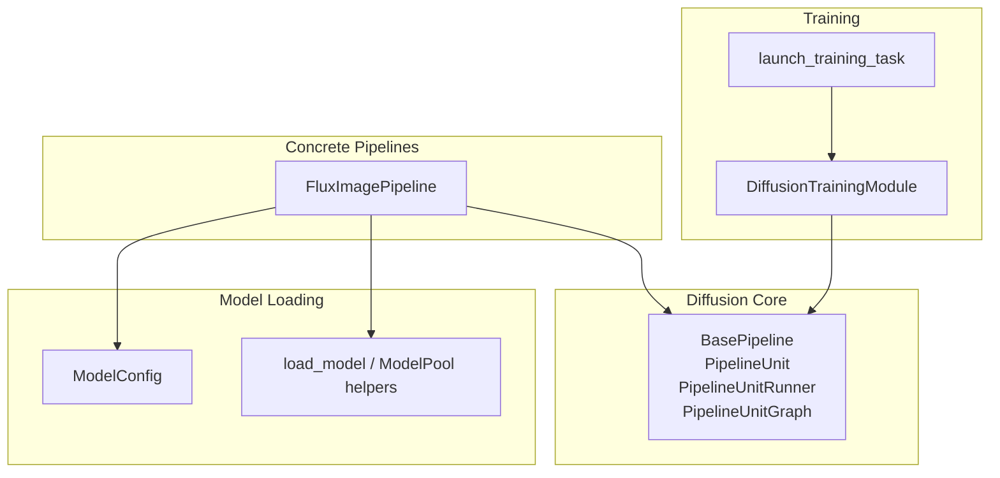
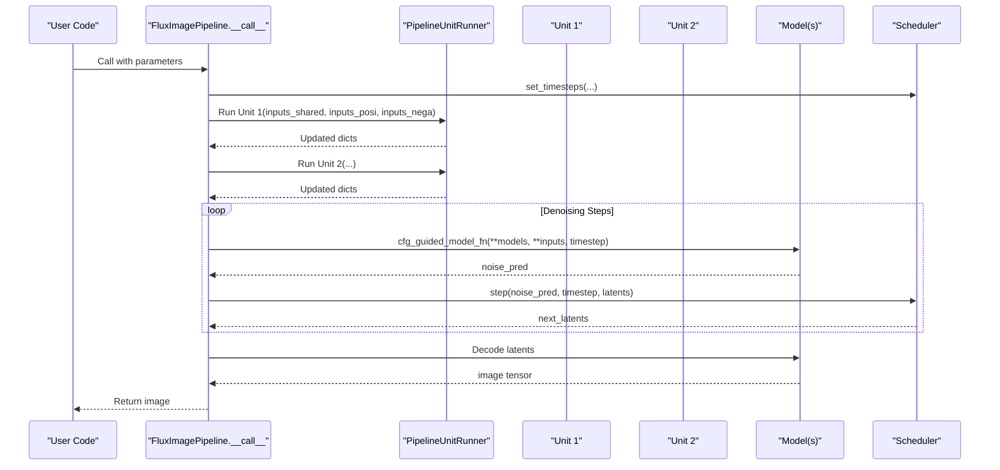
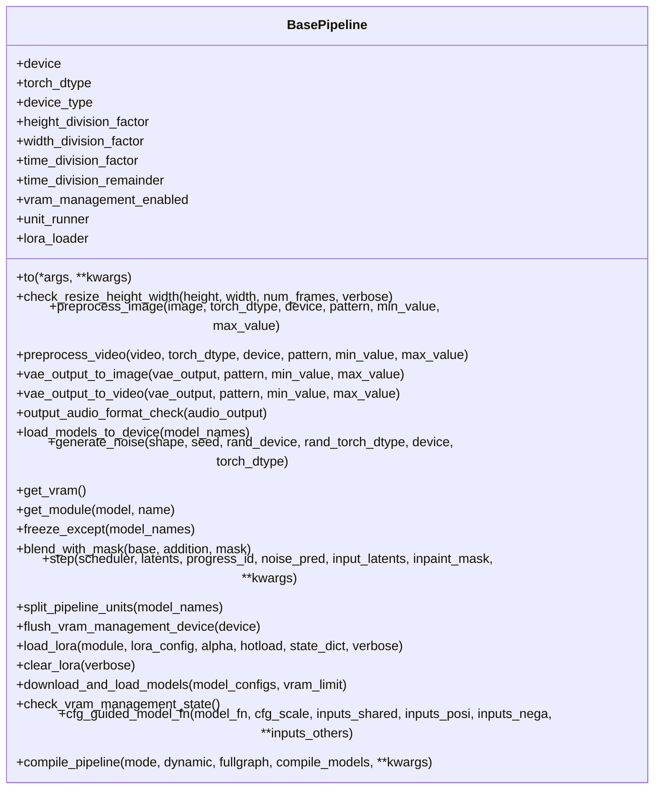
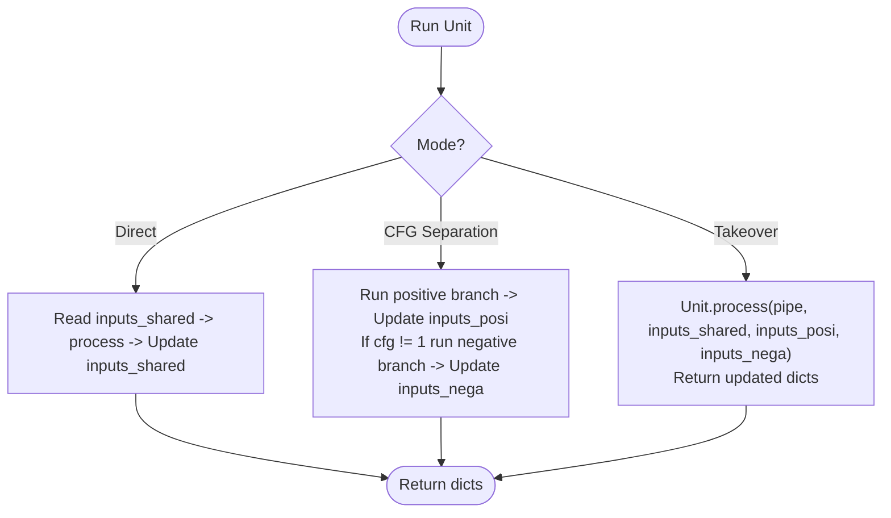
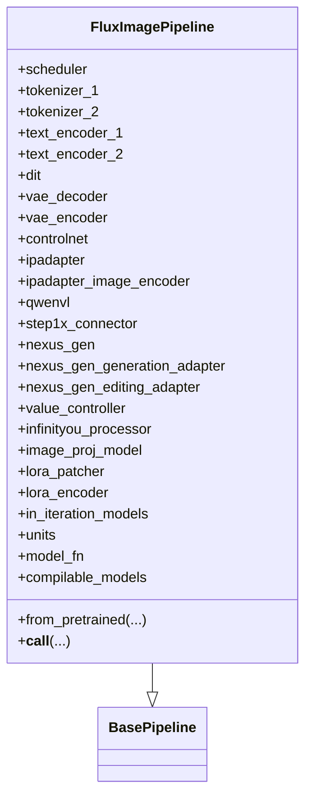
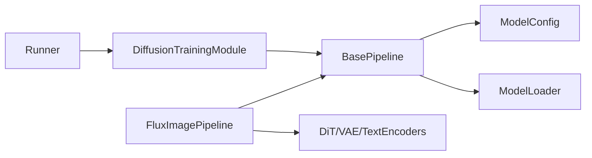

# Base Pipeline

<cite>
**Referenced Files in This Document**
- [base_pipeline.py](file://diffusion/base_pipeline.py)
- [flux_image.py](file://diffusion/pipelines/flux_image.py)
- [config.py](file://diffusion/core/loader/config.py)
- [model.py](file://diffusion/core/loader/model.py)
- [training_module.py](file://diffusion/training_module.py)
- [runner.py](file://diffusion/runner.py)
- [Building_a_Pipeline.md](file://docs/en/Developer_Guide/Building_a_Pipeline.md)
</cite>

## Table of Contents
1. [Introduction](#introduction)
2. [Project Structure](#project-structure)
3. [Core Components](#core-components)
4. [Architecture Overview](#architecture-overview)
5. [Detailed Component Analysis](#detailed-component-analysis)
6. [Dependency Analysis](#dependency-analysis)
7. [Performance Considerations](#performance-considerations)
8. [Troubleshooting Guide](#troubleshooting-guide)
9. [Conclusion](#conclusion)
10. [Appendices](#appendices)

## Introduction
This document provides comprehensive API documentation for the BasePipeline class and the pipeline unit system used across DiffSynth pipelines. It explains how units are composed, how data flows through the pipeline, and how execution is controlled during inference and training. It also covers configuration parsing utilities, parameter validation, error handling strategies, and concrete examples for building custom pipelines and units.

## Project Structure
The core pipeline framework resides under diffusion.base_pipeline, with concrete pipeline implementations under diffusion.pipelines (e.g., flux_image.py). Configuration and model loading utilities are under diffusion.core.loader. Training orchestration is provided by diffusion.runner and diffusion.training_module.

**Diagram sources**
- [base_pipeline.py:61-501](file://diffusion/base_pipeline.py#L61-L501)
- [flux_image.py:57-292](file://diffusion/pipelines/flux_image.py#L57-L292)
- [config.py:9-120](file://diffusion/core/loader/config.py#L9-L120)
- [model.py:11-65](file://diffusion/core/loader/model.py#L11-L65)
- [training_module.py:30-175](file://diffusion/training_module.py#L30-L175)
- [runner.py:8-48](file://diffusion/runner.py#L8-L48)

**Section sources**
- [base_pipeline.py:61-501](file://diffusion/base_pipeline.py#L61-L501)
- [flux_image.py:57-292](file://diffusion/pipelines/flux_image.py#L57-L292)
- [config.py:9-120](file://diffusion/core/loader/config.py#L9-L120)
- [model.py:11-65](file://diffusion/core/loader/model.py#L11-L65)
- [training_module.py:30-175](file://diffusion/training_module.py#L30-L175)
- [runner.py:8-48](file://diffusion/runner.py#L8-L48)

## Core Components
- BasePipeline: The base torch.nn.Module that orchestrates device/dtype management, VRAM control, preprocessing utilities, LoRA loading/clearing, CFG-guided inference, and optional torch.compile integration.
- PipelineUnit: A composable processing step with explicit input/output parameter contracts and three execution modes: direct, CFG separation, and takeover.
- PipelineUnitRunner: Executes a single unit against shared, positive, and negative input dictionaries based on unit configuration.
- PipelineUnitGraph: Builds dependency edges and chains among units to support advanced features like splitting related/unrelated computations.

Key responsibilities:
- Unit composition and data flow via inputs_shared, inputs_posi, inputs_nega.
- Device/dtype propagation and shape checks for images/videos/audio.
- VRAM-aware model loading/offloading and caching.
- CFG guidance and optional per-unit CFG separation.
- LoRA hot-loading and fusion.
- Optional compilation of models or repeated blocks.

**Section sources**
- [base_pipeline.py:14-59](file://diffusion/base_pipeline.py#L14-L59)
- [base_pipeline.py:61-115](file://diffusion/base_pipeline.py#L61-L115)
- [base_pipeline.py:117-156](file://diffusion/base_pipeline.py#L117-L156)
- [base_pipeline.py:157-187](file://diffusion/base_pipeline.py#L157-L187)
- [base_pipeline.py:190-218](file://diffusion/base_pipeline.py#L190-L218)
- [base_pipeline.py:220-241](file://diffusion/base_pipeline.py#L220-L241)
- [base_pipeline.py:242-294](file://diffusion/base_pipeline.py#L242-L294)
- [base_pipeline.py:296-341](file://diffusion/base_pipeline.py#L296-L341)
- [base_pipeline.py:342-373](file://diffusion/base_pipeline.py#L342-L373)
- [base_pipeline.py:375-468](file://diffusion/base_pipeline.py#L375-L468)
- [base_pipeline.py:470-501](file://diffusion/base_pipeline.py#L470-L501)

## Architecture Overview
The pipeline architecture centers around BasePipeline and its unit system. Concrete pipelines (e.g., FluxImagePipeline) define:
- A scheduler and model components as attributes.
- A list of PipelineUnit instances defining preprocessing steps.
- A model_fn callable used inside the denoising loop.
- An in_iteration_models tuple indicating which models participate in each step.

Data flow:
- __call__ initializes scheduler timesteps and populates inputs_shared, inputs_posi, inputs_nega.
- Each unit processes inputs according to its mode and updates the dictionaries.
- The denoising loop calls cfg_guided_model_fn to compute noise predictions and advances latents via step.
- Post-processing decodes latents to final outputs.

**Diagram sources**
- [flux_image.py:180-292](file://diffusion/pipelines/flux_image.py#L180-L292)
- [base_pipeline.py:321-341](file://diffusion/base_pipeline.py#L321-L341)
- [base_pipeline.py:470-501](file://diffusion/base_pipeline.py#L470-L501)

## Detailed Component Analysis

### BasePipeline API
- Initialization and device/dtype:
  - Stores device, dtype, device_type; supports .to() overrides.
  - Shape check utilities for height/width/time dimensions.
- Preprocessing utilities:
  - preprocess_image/preprocess_video convert PIL inputs to tensors with specified patterns and value ranges.
  - vae_output_to_image/vae_output_to_video convert tensors back to PIL formats.
  - output_audio_format_check standardizes audio outputs.
- VRAM management:
  - load_models_to_device selectively offloads/onloads child modules based on names.
  - flush_vram_management_device sets devices for AutoTorchModule-based modules.
  - get_vram returns available memory.
- Noise generation:
  - generate_noise creates reproducible Gaussian noise with seed and device control.
- Training hooks:
  - freeze_except enables training on selected modules while freezing others.
- Inference helpers:
  - blend_with_mask blends tensors using masks.
  - step integrates scheduler step with optional inpainting blending.
  - cfg_guided_model_fn applies classifier-free guidance and optional positive-only LoRA injection.
- LoRA:
  - load_lora supports state_dict or config paths, hot-loading into AutoWrappedLinear when VRAM management is enabled; otherwise fuses into base.
  - clear_lora removes accumulated LoRA weights.
- Model loading:
  - download_and_load_models uses ModelPool to auto-load models from ModelConfig with VRAM settings.
- Compilation:
  - compile_pipeline compiles models or repeated blocks via torch.compile with configurable options.

**Diagram sources**
- [base_pipeline.py:61-373](file://diffusion/base_pipeline.py#L61-L373)

**Section sources**
- [base_pipeline.py:61-115](file://diffusion/base_pipeline.py#L61-L115)
- [base_pipeline.py:117-156](file://diffusion/base_pipeline.py#L117-L156)
- [base_pipeline.py:157-187](file://diffusion/base_pipeline.py#L157-L187)
- [base_pipeline.py:190-218](file://diffusion/base_pipeline.py#L190-L218)
- [base_pipeline.py:220-241](file://diffusion/base_pipeline.py#L220-L241)
- [base_pipeline.py:242-294](file://diffusion/base_pipeline.py#L242-L294)
- [base_pipeline.py:296-341](file://diffusion/base_pipeline.py#L296-L341)
- [base_pipeline.py:342-373](file://diffusion/base_pipeline.py#L342-L373)

### PipelineUnit System
- PipelineUnit:
  - Configurable flags: seperate_cfg, take_over, input_params, output_params, input_params_posi, input_params_nega, onload_model_names.
  - fetch_input_params/fetch_output_params resolve declared parameters.
  - process/post_process define computation logic.
- PipelineUnitRunner:
  - Direct mode: reads shared inputs, writes shared outputs.
  - CFG separation mode: runs separate positive/negative branches based on cfg_scale.
  - Takeover mode: unit fully controls inputs_shared, inputs_posi, inputs_nega.
- PipelineUnitGraph:
  - Builds edges between units based on parameter dependencies.
  - Builds chains tracking variable updates.
  - Searches related units for given model_names and propagates updates.
  - split_pipeline_units separates related vs unrelated units for optimization.

**Diagram sources**
- [base_pipeline.py:470-501](file://diffusion/base_pipeline.py#L470-L501)

**Section sources**
- [base_pipeline.py:14-59](file://diffusion/base_pipeline.py#L14-L59)
- [base_pipeline.py:375-468](file://diffusion/base_pipeline.py#L375-L468)
- [base_pipeline.py:470-501](file://diffusion/base_pipeline.py#L470-L501)

### Concrete Pipeline Example: FluxImagePipeline
- Defines scheduler, tokenizers, text encoders, DiT, VAE, ControlNet, IP-Adapter, Value Controller, NexusGen, Step1x connector, and LoRA patcher/encoder.
- Implements from_pretrained to download and load models via ModelPool and attach them to the pipeline instance.
- Implements __call__ to:
  - Set scheduler timesteps.
  - Populate inputs_shared, inputs_posi, inputs_nega.
  - Execute all units via unit_runner.
  - Iterate denoising steps with cfg_guided_model_fn and update latents.
  - Decode latents to images and return results.
- Provides multiple PipelineUnit subclasses demonstrating shape checking, noise initialization, prompt embedding, input image embedding, ID encoding, guidance embedding, Kontext, InfiniteYou, ControlNet, IP-Adapter, EntityControl, NexusGen, TeaCache, Flex, Step1x, ValueControl, and LoRAEncode.

**Diagram sources**
- [flux_image.py:57-107](file://diffusion/pipelines/flux_image.py#L57-L107)
- [flux_image.py:180-292](file://diffusion/pipelines/flux_image.py#L180-L292)

**Section sources**
- [flux_image.py:57-107](file://diffusion/pipelines/flux_image.py#L57-L107)
- [flux_image.py:180-292](file://diffusion/pipelines/flux_image.py#L180-L292)
- [flux_image.py:294-400](file://diffusion/pipelines/flux_image.py#L294-L400)

### Configuration Parsing Utilities
- ModelConfig:
  - Supports path or model_id with origin_file_pattern.
  - Handles download_source selection (modelscope/huggingface) and skip_download behavior via environment variables.
  - Provides vram_config mapping for device/dtype settings across offload/onload/preparing/computation phases.
  - download_if_necessary ensures files exist and resolves path lists.

- Model loading:
  - load_model constructs models with optional DiskMap and VRAM management, supporting DeepSpeed ZeRO Stage 3 and state_dict converters.
  - get_init_context manages initialization contexts for efficient loading.

**Section sources**
- [config.py:9-120](file://diffusion/core/loader/config.py#L9-L120)
- [model.py:11-65](file://diffusion/core/loader/model.py#L11-L65)
- [model.py:68-88](file://diffusion/core/loader/model.py#L68-L88)
- [model.py:91-106](file://diffusion/core/loader/model.py#L91-L106)

### Training Workflows
- DiffusionTrainingModule:
  - Provides trainable_modules, trainable_param_names, add_lora_to_model, export_trainable_state_dict, transfer_data_to_device, parse_vram_config, parse_model_configs, parse_path_or_model_id, auto_detect_lora_target_modules.
  - GeneralUnit_RemoveCache demonstrates a takeover-mode unit for filtering required parameters across shared/positive/negative dicts.

- Runner:
  - launch_training_task sets up optimizer, scheduler, dataloader, prepares with accelerator, and iterates training steps with logging.
  - launch_data_process_task performs data processing with caching.

**Section sources**
- [training_module.py:30-175](file://diffusion/training_module.py#L30-L175)
- [training_module.py:8-28](file://diffusion/training_module.py#L8-L28)
- [runner.py:8-48](file://diffusion/runner.py#L8-L48)
- [runner.py:50-73](file://diffusion/runner.py#L50-L73)

## Dependency Analysis
The pipeline system exhibits clear separation of concerns:
- BasePipeline depends on core utilities (AutoTorchModule, AutoWrappedLinear, ModelConfig, device utilities) and LoRA loader.
- Concrete pipelines depend on BasePipeline and specific model classes.
- Configuration and model loading are encapsulated in core.loader.
- Training module extends BasePipeline’s unit concept for data processing and training-specific operations.

**Diagram sources**
- [base_pipeline.py:61-373](file://diffusion/base_pipeline.py#L61-L373)
- [flux_image.py:57-107](file://diffusion/pipelines/flux_image.py#L57-L107)
- [config.py:9-120](file://diffusion/core/loader/config.py#L9-L120)
- [model.py:11-65](file://diffusion/core/loader/model.py#L11-L65)
- [training_module.py:30-175](file://diffusion/training_module.py#L30-L175)
- [runner.py:8-48](file://diffusion/runner.py#L8-L48)

**Section sources**
- [base_pipeline.py:61-373](file://diffusion/base_pipeline.py#L61-L373)
- [flux_image.py:57-107](file://diffusion/pipelines/flux_image.py#L57-L107)
- [config.py:9-120](file://diffusion/core/loader/config.py#L9-L120)
- [model.py:11-65](file://diffusion/core/loader/model.py#L11-L65)
- [training_module.py:30-175](file://diffusion/training_module.py#L30-L175)
- [runner.py:8-48](file://diffusion/runner.py#L8-L48)

## Performance Considerations
- VRAM Management:
  - Use load_models_to_device to selectively activate only necessary models during iterations.
  - Enable vram_management_enabled at the pipeline level when child modules support it.
- Compilation:
  - compile_pipeline can optimize repeated blocks or entire models; prefer dynamic=True for flexible shapes.
- Data Preprocessing:
  - Use pattern-based reshaping and dtype conversion to minimize overhead.
- CFG Guidance:
  - When cfg_scale=1.0, avoid redundant negative branch computation.

[No sources needed since this section provides general guidance]

## Troubleshooting Guide
Common issues and resolutions:
- Missing model files:
  - Ensure ModelConfig.path or model_id with origin_file_pattern is valid; use download_if_necessary to fetch assets.
- VRAM errors:
  - Verify vram_management_enabled and correct device/dtype settings; call load_models_to_device with appropriate model_names.
- CFG-related mismatches:
  - Confirm input_params_posi/input_params_nega mappings align with actual keys in inputs_posi/inputs_nega.
- LoRA hot-loading failures:
  - VRAM management must be enabled for hot-loading; otherwise, LoRA will be fused into the base model.
- Compilation warnings:
  - If no compilable models are present, ensure compilable_models is set correctly in the pipeline.

**Section sources**
- [config.py:28-31](file://diffusion/core/loader/config.py#L28-L31)
- [base_pipeline.py:242-294](file://diffusion/base_pipeline.py#L242-L294)
- [base_pipeline.py:342-373](file://diffusion/base_pipeline.py#L342-L373)

## Conclusion
The BasePipeline and pipeline unit system provide a robust, modular framework for composing complex generative workflows. By explicitly declaring input/output parameters and leveraging CFG separation or takeover modes, developers can build highly customizable pipelines with efficient VRAM usage and optional acceleration via compilation. Concrete pipelines like FluxImagePipeline demonstrate best practices for model integration, unit composition, and inference orchestration.

[No sources needed since this section summarizes without analyzing specific files]

## Appendices

### Building Custom Pipelines and Units
- Implement __init__, from_pretrained, __call__, units, and model_fn following the documented template.
- Use direct mode for simple transformations, CFG separation for prompt encoding, and takeover mode for complex logic requiring global context.
- Follow VRAM efficiency guidelines: declare onload_model_names and rely on load_models_to_device for activation.

**Section sources**
- [Building_a_Pipeline.md:1-200](file://docs/en/Developer_Guide/Building_a_Pipeline.md#L1-L200)
- [base_pipeline.py:470-501](file://diffusion/base_pipeline.py#L470-L501)