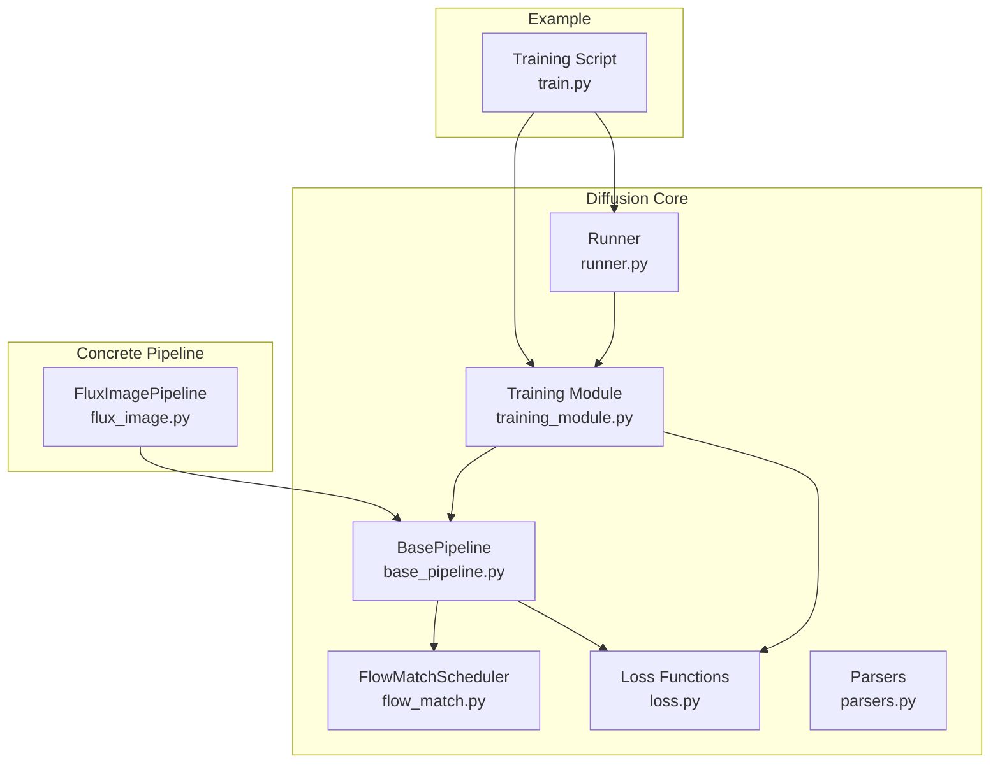
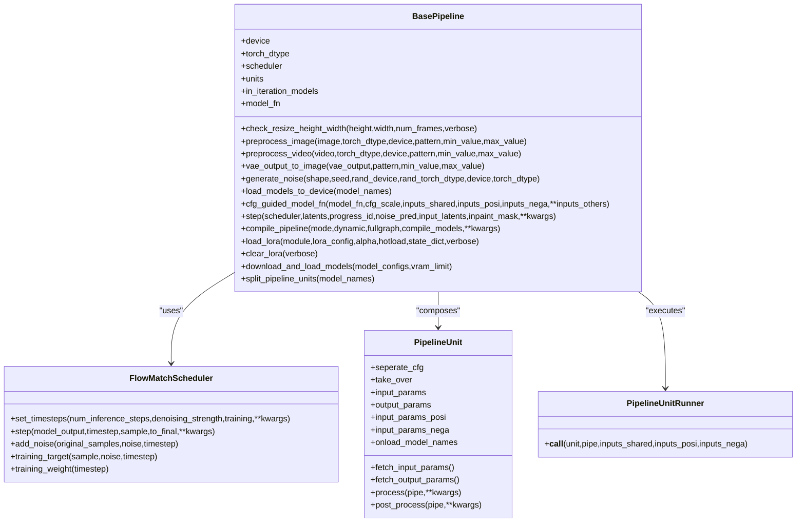
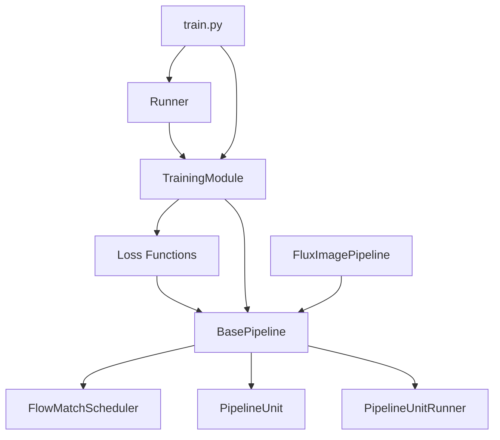

# Diffusion API

<cite>
**Referenced Files in This Document**
- [base_pipeline.py](file://diffsynth/diffusion/base_pipeline.py)
- [training_module.py](file://diffsynth/diffusion/training_module.py)
- [loss.py](file://diffsynth/diffusion/loss.py)
- [parsers.py](file://diffsynth/diffusion/parsers.py)
- [runner.py](file://diffsynth/diffusion/runner.py)
- [flow_match.py](file://diffsynth/diffusion/flow_match.py)
- [flux_image.py](file://diffsynth/pipelines/flux_image.py)
- [train.py](file://examples/flux/model_training/train.py)
</cite>

## Table of Contents
1. [Introduction](#introduction)
2. [Project Structure](#project-structure)
3. [Core Components](#core-components)
4. [Architecture Overview](#architecture-overview)
5. [Detailed Component Analysis](#detailed-component-analysis)
6. [Dependency Analysis](#dependency-analysis)
7. [Performance Considerations](#performance-considerations)
8. [Troubleshooting Guide](#troubleshooting-guide)
9. [Conclusion](#conclusion)
10. [Appendices](#appendices)

## Introduction
This document provides comprehensive API documentation for the diffusion model components, focusing on:
- BasePipeline class architecture and unit system composition
- Training module interfaces including loss functions, gradient computation, and training loops
- Parser utilities for configuration handling
- Runner interfaces for execution control
- Complete method signatures, configuration options, and usage examples for training and inference workflows
- Guidance for developing pipeline units and custom loss functions

The content is derived from the repository’s core diffusion modules and example pipelines to ensure accuracy and practical applicability.

## Project Structure
At a high level, the diffusion subsystem is organized into:
- base_pipeline.py: Core pipeline abstraction with unit system, VRAM management, LoRA integration, and CFG guidance
- flow_match.py: Flow matching scheduler implementation supporting multiple templates
- loss.py: Loss functions for SFT, audio-video SFT, direct distillation, and trajectory imitation
- training_module.py: Training utilities, LoRA injection, data/device transfer, and pipeline splitting
- parsers.py: CLI argument parsing helpers for dataset, model, training, output, LoRA, and gradient settings
- runner.py: Accelerator-based training and data processing launchers
- flux_image.py: Concrete pipeline implementing BasePipeline for FLUX image generation
- train.py: Example training script demonstrating end-to-end workflow

**Diagram sources**
- [base_pipeline.py:61-373](file://diffsynth/diffusion/base_pipeline.py#L61-L373)
- [flow_match.py:5-262](file://diffsynth/diffusion/flow_match.py#L5-L262)
- [loss.py:5-159](file://diffsynth/diffusion/loss.py#L5-L159)
- [training_module.py:30-303](file://diffsynth/diffusion/training_module.py#L30-L303)
- [parsers.py:1-71](file://diffsynth/diffusion/parsers.py#L1-L71)
- [runner.py:1-89](file://diffsynth/diffusion/runner.py#L1-L89)
- [flux_image.py:57-291](file://diffsynth/pipelines/flux_image.py#L57-L291)
- [train.py:8-194](file://examples/flux/model_training/train.py#L8-L194)

**Section sources**
- [base_pipeline.py:61-373](file://diffsynth/diffusion/base_pipeline.py#L61-L373)
- [flow_match.py:5-262](file://diffsynth/diffusion/flow_match.py#L5-L262)
- [loss.py:5-159](file://diffsynth/diffusion/loss.py#L5-L159)
- [training_module.py:30-303](file://diffsynth/diffusion/training_module.py#L30-L303)
- [parsers.py:1-71](file://diffsynth/diffusion/parsers.py#L1-L71)
- [runner.py:1-89](file://diffsynth/diffusion/runner.py#L1-L89)
- [flux_image.py:57-291](file://diffsynth/pipelines/flux_image.py#L57-L291)
- [train.py:8-194](file://examples/flux/model_training/train.py#L8-L194)

## Core Components
- BasePipeline: Abstracts pipeline orchestration, unit execution, VRAM management, LoRA loading, CFG-guided noise prediction, and stepwise denoising.
- FlowMatchScheduler: Implements sigma/timestep scheduling, noise addition, target computation, and per-timestep weighting for flow matching objectives.
- Loss Functions: Provide SFT losses (image and audio-video), direct distillation, and trajectory imitation with teacher-student alignment.
- TrainingModule: Offers LoRA injection, parameter freezing/unfreezing, device/data transfer, and pipeline unit splitting for training vs data processing.
- Parsers: Standardized CLI argument groups for datasets, models, training, outputs, LoRA, and gradients.
- Runner: Accelerator-based training loop and data processing launcher with DeepSpeed activation checkpointing support.
- FluxImagePipeline: Concrete pipeline demonstrating unit composition, CFG guidance, and model_fn wiring for FLUX image generation.

**Section sources**
- [base_pipeline.py:61-373](file://diffsynth/diffusion/base_pipeline.py#L61-L373)
- [flow_match.py:5-262](file://diffsynth/diffusion/flow_match.py#L5-L262)
- [loss.py:5-159](file://diffsynth/diffusion/loss.py#L5-L159)
- [training_module.py:30-303](file://diffsynth/diffusion/training_module.py#L30-L303)
- [parsers.py:1-71](file://diffsynth/diffusion/parsers.py#L1-L71)
- [runner.py:1-89](file://diffsynth/diffusion/runner.py#L1-L89)
- [flux_image.py:57-291](file://diffsynth/pipelines/flux_image.py#L57-L291)

## Architecture Overview
The diffusion system follows a modular pipeline architecture:
- BasePipeline defines the orchestration layer and exposes methods for preprocessing, noise generation, CFG guidance, and stepping through scheduler timesteps.
- PipelineUnit composes reusable steps that transform shared, positive, and negative inputs; units can be executed in three modes: shared-only, separate-CFG, or takeover.
- FlowMatchScheduler supplies sigmas and timesteps, computes training targets and weights, and performs denoising steps.
- Loss functions consume pipeline state and compute objectives based on scheduler outputs and model predictions.
- TrainingModule prepares the pipeline for training, injects LoRA, splits units by task, and handles data/device transfers.
- Runner integrates with Accelerator to run training or data processing tasks.

**Diagram sources**
- [base_pipeline.py:61-501](file://diffsynth/diffusion/base_pipeline.py#L61-L501)
- [flow_match.py:5-262](file://diffsynth/diffusion/flow_match.py#L5-L262)

**Section sources**
- [base_pipeline.py:61-501](file://diffsynth/diffusion/base_pipeline.py#L61-L501)
- [flow_match.py:5-262](file://diffsynth/diffusion/flow_match.py#L5-L262)

## Detailed Component Analysis

### BasePipeline Class
Responsibilities:
- Shape validation and resizing for height, width, and optional time dimension
- Image/video preprocessing and postprocessing utilities
- Noise generation with seed control
- VRAM-aware model loading/offloading
- CFG-guided model function invocation
- Stepwise denoising using scheduler
- LoRA hotloading/fusing and clearing
- Torch.compile integration for selected models

Key methods and behaviors:
- check_resize_height_width: Enforces divisibility constraints and optionally adjusts num_frames
- preprocess_image/preprocess_video: Convert PIL images to tensors with normalization and pattern reshaping
- vae_output_to_image/vae_output_to_video: Decode tensors back to images/videos
- generate_noise: Reproducible Gaussian noise creation
- load_models_to_device: Offload non-required models and onload required ones when VRAM management is enabled
- cfg_guided_model_fn: Compute positive/negative predictions and blend according to cfg_scale
- step: Apply scheduler step with optional inpaint blending
- compile_pipeline: Compile models listed in compilable_models with regional compilation for repeated blocks
- load_lora/clear_lora: Support hotloading for VRAM-managed modules or fuse LoRA otherwise
- download_and_load_models: Auto-load models via ModelPool with VRAM config

Usage patterns:
- Subclasses define units list, model_fn, and in_iteration_models
- __call__ orchestrates unit execution, then iterates timesteps with CFG guidance and decoding

**Section sources**
- [base_pipeline.py:61-373](file://diffsynth/diffusion/base_pipeline.py#L61-L373)
- [flux_image.py:57-291](file://diffsynth/pipelines/flux_image.py#L57-L291)

### Pipeline Unit System
Design:
- PipelineUnit declares input/output parameters and optional CFG separation
- Three execution modes:
  - Shared-only: process receives shared inputs and updates shared dict
  - Separate-CFG: process runs for positive and negative branches with mapping of params
  - Takeover: unit fully controls processing and returns updated dicts

Graph utilities:
- PipelineUnitGraph builds edges and chains to split units related to specific models
- Supports searching related units and updating chains for external parameter changes

Runner:
- PipelineUnitRunner executes units and manages inputs across shared/positive/negative contexts

**Section sources**
- [base_pipeline.py:14-115](file://diffsynth/diffusion/base_pipeline.py#L14-L115)
- [base_pipeline.py:375-501](file://diffsynth/diffusion/base_pipeline.py#L375-L501)

### FlowMatchScheduler
Capabilities:
- Multiple template-specific set_timesteps implementations (FLUX.1, Wan, Qwen-Image, FLUX.2, Z-Image, LTX-2, etc.)
- Training mode sets linear timestep weights for balanced objectives
- add_noise mixes original samples with noise based on sigma
- training_target computes noise minus sample as target
- step advances latents along flow trajectories using sigma differences

Configuration:
- set_timesteps accepts num_inference_steps, denoising_strength, training flag, and template-specific kwargs
- training_weight returns per-timestep weights computed during training setup

**Section sources**
- [flow_match.py:5-262](file://diffsynth/diffusion/flow_match.py#L5-L262)

### Loss Functions
Implemented losses:
- FlowMatchSFTLoss: Random timestep sampling within boundaries, adds noise, computes training target, calls model_fn, applies MSE weighted by scheduler
- FlowMatchSFTAudioVideoLoss: Extends SFT to jointly train video and audio latents, sums losses
- DirectDistillLoss: Iterative distillation over timesteps, minimizes distance between final latents and input latents
- TrajectoryImitationLoss: Teacher-student alignment with LPIPS regularization, uses cfg_guided_model_fn and step to build trajectories

Integration:
- Losses rely on scheduler.timesteps, training_target, training_weight, and pipeline.model_fn
- For CFG scenarios, use cfg_guided_model_fn to compute noise predictions

**Section sources**
- [loss.py:5-159](file://diffsynth/diffusion/loss.py#L5-L159)

### Training Module Interfaces
Features:
- DiffusionTrainingModule provides trainable_modules, trainable_param_names, and device/data transfer utilities
- add_lora_to_model: Injects LoRA adapters with configurable rank/alpha and optional upcasting
- parse_vram_config: Generates VRAM configs for FP8 or disk offloading
- parse_model_configs: Builds ModelConfig objects from paths or model IDs with origin file patterns
- auto_detect_lora_target_modules: Heuristic search for suitable linear layers to patch
- switch_pipe_to_training_mode: Freezes non-trainable models, sets scheduler, applies preset LoRA, injects LoRA, loads checkpoints
- split_pipeline_units: Separates units for training vs data processing, optionally removes unnecessary parameters

Data handling:
- transfer_data_to_device recursively moves tensors/lists/dicts to device and dtype
- parse_extra_inputs maps controlnet and other extra inputs into structured formats

**Section sources**
- [training_module.py:30-303](file://diffsynth/diffusion/training_module.py#L30-L303)

### Parser Utilities
CLI argument groups:
- Dataset base config: base path, metadata, repeat, workers, data file keys
- Image/Video size config: height, width, max_pixels, num_frames
- Model config: model_paths (JSON), model_id_with_origin_paths, extra_inputs, fp8_models, offload_models
- Training config: learning_rate, num_epochs, trainable_models, find_unused_parameters, weight_decay, task
- Output config: output_path, remove_prefix_in_ckpt, save_steps
- LoRA config: lora_base_model, lora_target_modules, lora_rank, lora_checkpoint, preset_lora_path, preset_lora_model
- Gradient config: use_gradient_checkpointing, use_gradient_checkpointing_offload, gradient_accumulation_steps

Usage:
- Compose parsers with add_general_config to assemble full argument lists
- Pass parsed args to training runners and modules

**Section sources**
- [parsers.py:1-71](file://diffsynth/diffusion/parsers.py#L1-L71)

### Runner Interfaces
Functions:
- launch_training_task: Initializes optimizer/scheduler, prepares dataloader with Accelerator, runs training loop with accumulate context, logs steps/epochs
- launch_data_process_task: Runs data processing without gradients, saves processed items to disk
- initialize_deepspeed_gradient_checkpointing: Configures DeepSpeed activation checkpointing if available

Integration:
- Accepts Accelerator, dataset, model (DiffusionTrainingModule subclass), and ModelLogger
- Supports args override for hyperparameters and worker counts

**Section sources**
- [runner.py:1-89](file://diffsynth/diffusion/runner.py#L1-L89)

### Concrete Pipeline Example: FluxImagePipeline
Composition:
- Inherits BasePipeline and defines units for shape checking, noise initialization, prompt embedding, input image embedding, ID embeddings, guidance embedder, Kontext, InfiniteYou, ControlNet, IP-Adapter, EntityControl, NexusGen, TeaCache, Flex, Step1x, ValueControl, LoRAEncode
- Sets in_iteration_models to include DiT and auxiliary modules
- model_fn_flux_image wires DiT forward with controlnet, flex, step1x, ipadapter, tea cache, and tiled inference

Inference workflow:
- __call__ sets scheduler timesteps, constructs inputs_shared/inputs_posi/inputs_nega, runs units, then iterates timesteps with CFG guidance, decodes latents via VAE decoder

LoRA merging:
- enable_lora_merger activates dynamic LoRA merging for VRAM-managed modules

**Section sources**
- [flux_image.py:57-291](file://diffsynth/pipelines/flux_image.py#L57-L291)
- [flux_image.py:1000-1203](file://diffsynth/pipelines/flux_image.py#L1000-L1203)

### Training Workflow Example
Structure:
- FluxTrainingModule extends DiffusionTrainingModule, initializes FluxImagePipeline, splits units, switches to training mode, maps tasks to losses
- get_pipeline_inputs constructs shared/positive/negative inputs from dataset items
- forward executes units and computes loss based on task mapping

Launcher selection:
- Maps task strings to launch_training_task or launch_data_process_task
- Uses ModelLogger for checkpointing with optional state dict conversion

**Section sources**
- [train.py:8-194](file://examples/flux/model_training/train.py#L8-L194)

## Dependency Analysis
Inter-module relationships:
- BasePipeline depends on FlowMatchScheduler for timestep management and on PipelineUnit/PipelineUnitRunner for orchestration
- Loss functions depend on BasePipeline and FlowMatchScheduler APIs
- TrainingModule depends on BasePipeline and Loss functions, and integrates with LoRA injection
- Runner depends on TrainingModule and Accelerator for distributed training
- Concrete pipelines like FluxImagePipeline implement BasePipeline and provide model_fn

Potential circular dependencies:
- None observed; dependencies are layered from concrete pipelines down to base abstractions

External integrations:
- Accelerator for distributed training
- DeepSpeed activation checkpointing when configured
- Transformers tokenizers for text encoders
- ModelPool for automatic model loading and VRAM management

**Diagram sources**
- [base_pipeline.py:61-373](file://diffsynth/diffusion/base_pipeline.py#L61-L373)
- [flow_match.py:5-262](file://diffsynth/diffusion/flow_match.py#L5-L262)
- [loss.py:5-159](file://diffsynth/diffusion/loss.py#L5-L159)
- [training_module.py:30-303](file://diffsynth/diffusion/training_module.py#L30-L303)
- [runner.py:1-89](file://diffsynth/diffusion/runner.py#L1-L89)
- [flux_image.py:57-291](file://diffsynth/pipelines/flux_image.py#L57-L291)
- [train.py:8-194](file://examples/flux/model_training/train.py#L8-L194)

**Section sources**
- [base_pipeline.py:61-373](file://diffsynth/diffusion/base_pipeline.py#L61-L373)
- [flow_match.py:5-262](file://diffsynth/diffusion/flow_match.py#L5-L262)
- [loss.py:5-159](file://diffsynth/diffusion/loss.py#L5-L159)
- [training_module.py:30-303](file://diffsynth/diffusion/training_module.py#L30-L303)
- [runner.py:1-89](file://diffsynth/diffusion/runner.py#L1-L89)
- [flux_image.py:57-291](file://diffsynth/pipelines/flux_image.py#L57-L291)
- [train.py:8-194](file://examples/flux/model_training/train.py#L8-L194)

## Performance Considerations
- VRAM management: Use load_models_to_device to offload non-critical models and onload required ones; enable vram_management_enabled on child modules
- Torch.compile: Use compile_pipeline to optimize repeated blocks or entire models; prefer dynamic=True for flexible shapes
- Gradient checkpointing: Enable via arguments and integrate with DeepSpeed activation checkpointing when available
- Tiled inference: Support large resolutions by tiling latent computations
- Data loading: Adjust dataset_num_workers and use caching where appropriate

[No sources needed since this section provides general guidance]

## Troubleshooting Guide
Common issues and resolutions:
- Missing models in pipeline: When freezing except certain names, ensure trainable_models includes required modules; warnings indicate normal behavior during data processing
- LoRA hotloading requires VRAM management: If hotload is used without vram_management_enabled, a ValueError is raised
- CFG scale equals 1: Negative branch skipped; ensure cfg_scale > 1 for unconditional guidance
- Scheduler mismatch: Verify template matches model expectations; incorrect templates may cause poor convergence
- DeepSpeed activation checkpointing not found: Ensure deepspeed_plugin contains activation_checkpointing config; otherwise skip initialization

**Section sources**
- [base_pipeline.py:204-214](file://diffsynth/diffusion/base_pipeline.py#L204-L214)
- [base_pipeline.py:262-266](file://diffsynth/diffusion/base_pipeline.py#L262-L266)
- [runner.py:75-89](file://diffsynth/diffusion/runner.py#L75-L89)

## Conclusion
The diffusion API provides a robust, modular framework for building and training diffusion models. BasePipeline abstracts common functionality while enabling flexible unit composition. FlowMatchScheduler supports diverse templates and efficient training objectives. Loss functions cover standard SFT, audio-video joint training, distillation, and trajectory imitation. TrainingModule and Runner streamline distributed training with LoRA support and VRAM optimization. Concrete pipelines like FluxImagePipeline demonstrate practical usage patterns. Developers can extend the system by adding new units, losses, and schedulers while leveraging existing infrastructure.

[No sources needed since this section summarizes without analyzing specific files]

## Appendices

### Method Signatures and Configuration Options

- BasePipeline.__init__: device, torch_dtype, height_division_factor, width_division_factor, time_division_factor, time_division_remainder
- BasePipeline.check_resize_height_width: height, width, num_frames=None, verbose=1
- BasePipeline.preprocess_image: image, torch_dtype=None, device=None, pattern="B C H W", min_value=-1, max_value=1
- BasePipeline.preprocess_video: video, torch_dtype=None, device=None, pattern="B C T H W", min_value=-1, max_value=1
- BasePipeline.vae_output_to_image: vae_output, pattern="B C H W", min_value=-1, max_value=1
- BasePipeline.vae_output_to_video: vae_output, pattern="B C T H W", min_value=-1, max_value=1
- BasePipeline.generate_noise: shape, seed=None, rand_device="cpu", rand_torch_dtype=torch.float32, device=None, torch_dtype=None
- BasePipeline.load_models_to_device: model_names
- BasePipeline.cfg_guided_model_fn: model_fn, cfg_scale, inputs_shared, inputs_posi, inputs_nega, **inputs_others
- BasePipeline.step: scheduler, latents, progress_id, noise_pred, input_latents=None, inpaint_mask=None, **kwargs
- BasePipeline.compile_pipeline: mode="default", dynamic=True, fullgraph=False, compile_models=None, **kwargs
- BasePipeline.load_lora: module, lora_config=None, alpha=1, hotload=None, state_dict=None, verbose=1
- BasePipeline.clear_lora: verbose=1
- BasePipeline.download_and_load_models: model_configs=[], vram_limit=None

- FlowMatchScheduler.set_timesteps: num_inference_steps=100, denoising_strength=1.0, training=False, **kwargs
- FlowMatchScheduler.step: model_output, timestep, sample, to_final=False, **kwargs
- FlowMatchScheduler.add_noise: original_samples, noise, timestep
- FlowMatchScheduler.training_target: sample, noise, timestep
- FlowMatchScheduler.training_weight: timestep

- DiffusionTrainingModule.add_lora_to_model: model, target_modules, lora_rank, lora_alpha=None, upcast_dtype=None
- DiffusionTrainingModule.parse_vram_config: fp8=False, offload=False, device="cpu"
- DiffusionTrainingModule.parse_model_configs: model_paths=None, model_id_with_origin_paths=None, fp8_models=None, offload_models=None, device="cpu"
- DiffusionTrainingModule.switch_pipe_to_training_mode: pipe, trainable_models=None, lora_base_model=None, lora_target_modules="", lora_rank=32, lora_checkpoint=None, preset_lora_path=None, preset_lora_model=None, task="sft"
- DiffusionTrainingModule.split_pipeline_units: task, pipe, trainable_models=None, lora_base_model=None, remove_unnecessary_params=False, loss_required_params=(...), force_remove_params_shared=tuple(), force_remove_params_posi=tuple(), force_remove_params_nega=tuple()

- Parsers: add_dataset_base_config, add_image_size_config, add_video_size_config, add_model_config, add_training_config, add_output_config, add_lora_config, add_gradient_config, add_general_config

- Runner.launch_training_task: accelerator, dataset, model, model_logger, learning_rate=1e-5, weight_decay=1e-2, num_workers=1, save_steps=None, num_epochs=1, args=None
- Runner.launch_data_process_task: accelerator, dataset, model, model_logger, num_workers=8, args=None

**Section sources**
- [base_pipeline.py:61-373](file://diffsynth/diffusion/base_pipeline.py#L61-L373)
- [flow_match.py:5-262](file://diffsynth/diffusion/flow_match.py#L5-L262)
- [training_module.py:30-303](file://diffsynth/diffusion/training_module.py#L30-L303)
- [parsers.py:1-71](file://diffsynth/diffusion/parsers.py#L1-L71)
- [runner.py:1-89](file://diffsynth/diffusion/runner.py#L1-L89)

### Usage Examples

- Inference workflow (FluxImagePipeline):
  - Initialize pipeline with from_pretrained, set scheduler timesteps, construct inputs, run units, iterate timesteps with CFG guidance, decode latents
  - Reference: [flux_image.py:57-291](file://diffsynth/pipelines/flux_image.py#L57-L291)

- Training workflow (FluxTrainingModule):
  - Construct module with model configs, split units, switch to training mode, map tasks to losses, execute units and compute loss
  - Reference: [train.py:8-194](file://examples/flux/model_training/train.py#L8-L194)

- Custom loss function:
  - Implement function accepting pipe and inputs, use scheduler.add_noise, training_target, model_fn, and mse_loss with training_weight
  - Reference: [loss.py:5-159](file://diffsynth/diffusion/loss.py#L5-L159)

- Custom pipeline unit:
  - Extend PipelineUnit, declare input/output params, implement process method, optionally set seperate_cfg or take_over
  - Reference: [base_pipeline.py:14-115](file://diffsynth/diffusion/base_pipeline.py#L14-L115)

**Section sources**
- [flux_image.py:57-291](file://diffsynth/pipelines/flux_image.py#L57-L291)
- [train.py:8-194](file://examples/flux/model_training/train.py#L8-L194)
- [loss.py:5-159](file://diffsynth/diffusion/loss.py#L5-L159)
- [base_pipeline.py:14-115](file://diffsynth/diffusion/base_pipeline.py#L14-L115)