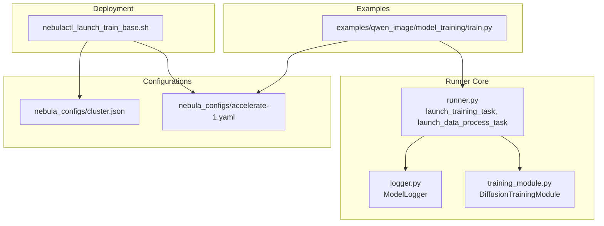
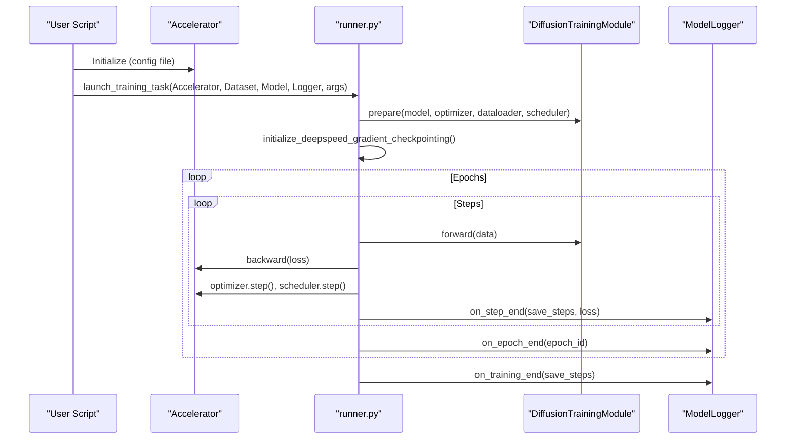
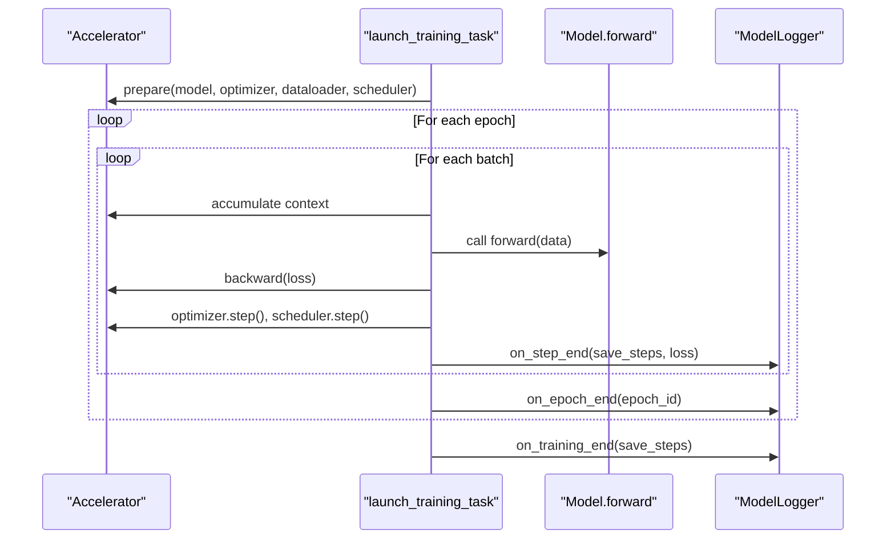
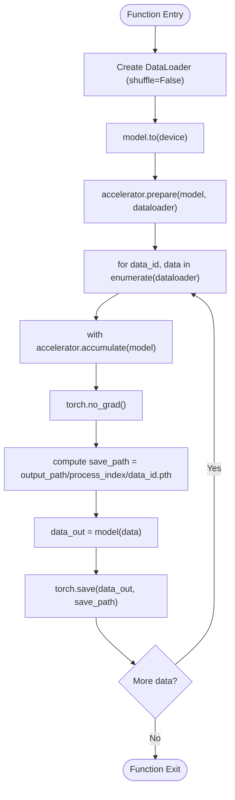
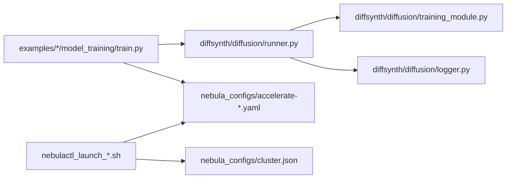

# Execution Runner

<cite>
**Referenced Files in This Document**
- [runner.py](file://diffsynth/diffusion/runner.py)
- [training_module.py](file://diffsynth/diffusion/training_module.py)
- [logger.py](file://diffsynth/diffusion/logger.py)
- [accelerate-1.yaml](file://nebula_configs/accelerate-1.yaml)
- [cluster.json](file://nebula_configs/cluster.json)
- [nebulactl_launch_train_base.sh](file://nebulactl_launch_train_base.sh)
- [train.py (qwen_image)](file://examples/qwen_image/model_training/train.py)
</cite>

## Table of Contents
1. [Introduction](#introduction)
2. [Project Structure](#project-structure)
3. [Core Components](#core-components)
4. [Architecture Overview](#architecture-overview)
5. [Detailed Component Analysis](#detailed-component-analysis)
6. [Dependency Analysis](#dependency-analysis)
7. [Performance Considerations](#performance-considerations)
8. [Troubleshooting Guide](#troubleshooting-guide)
9. [Conclusion](#conclusion)
10. [Appendices](#appendices)

## Introduction
This document provides detailed API documentation for the training execution runner system, focusing on the launch_training_task and launch_data_process_task functions used to orchestrate distributed training jobs. It covers process management via Accelerate, resource allocation patterns, inter-process communication, configuration formats, environment setup, and cluster deployment using nebulactl. Practical examples demonstrate launching tasks, managing distributed processes, monitoring progress, handling errors, recovering from failures, and debugging distributed training scenarios.

## Project Structure
The execution runner is implemented under diffsynth/diffusion with supporting utilities for logging and training module configuration. Example scripts across models use a consistent launcher_map to dispatch between data processing and training tasks. Cluster and acceleration configurations are provided under nebula_configs, and shell scripts drive job submission through nebulactl.

**Diagram sources**
- [runner.py:8-47](file://diffsynth/diffusion/runner.py#L8-L47)
- [runner.py:50-73](file://diffsynth/diffusion/runner.py#L50-L73)
- [training_module.py:30-110](file://diffsynth/diffusion/training_module.py#L30-L110)
- [logger.py:5-44](file://diffsynth/diffusion/logger.py#L5-L44)
- [accelerate-1.yaml:1-16](file://nebula_configs/accelerate-1.yaml#L1-L16)
- [cluster.json:1-7](file://nebula_configs/cluster.json#L1-L7)
- [nebulactl_launch_train_base.sh:121-140](file://nebulactl_launch_train_base.sh#L121-L140)
- [train.py (qwen_image):166-174](file://examples/qwen_image/model_training/train.py#L166-L174)

**Section sources**
- [runner.py:8-47](file://diffsynth/diffusion/runner.py#L8-L47)
- [runner.py:50-73](file://diffsynth/diffusion/runner.py#L50-L73)
- [training_module.py:30-110](file://diffsynth/diffusion/training_module.py#L30-L110)
- [logger.py:5-44](file://diffsynth/diffusion/logger.py#L5-L44)
- [accelerate-1.yaml:1-16](file://nebula_configs/accelerate-1.yaml#L1-L16)
- [cluster.json:1-7](file://nebula_configs/cluster.json#L1-L7)
- [nebulactl_launch_train_base.sh:121-140](file://nebulactl_launch_train_base.sh#L121-L140)
- [train.py (qwen_image):166-174](file://examples/qwen_image/model_training/train.py#L166-L174)

## Core Components
- launch_training_task: Orchestrates distributed training with Accelerator, prepares model/optimizer/dataloader/scheduler, initializes DeepSpeed activation checkpointing when applicable, iterates over epochs and steps, accumulates gradients, logs metrics, and saves checkpoints at step or epoch boundaries.
- launch_data_process_task: Runs a non-training pass to preprocess dataset items per rank, saving intermediate artifacts into per-process directories under the output path.
- DiffusionTrainingModule: Base training module providing utilities for device transfer, VRAM configuration parsing, LoRA injection, parameter filtering, and pipeline splitting for different tasks.
- ModelLogger: Handles periodic checkpointing at step and epoch boundaries, ensuring main-process-only writes and safe serialization.

Key responsibilities:
- Process management: Uses Accelerator.prepare to wrap model, optimizer, dataloader, and scheduler; leverages accelerator.accumulate for gradient accumulation and synchronization.
- Resource allocation: Supports FP8 and offload modes via parse_vram_config; integrates DeepSpeed activation checkpointing configuration.
- Inter-process communication: Relies on Accelerate’s distributed primitives; ensures synchronized writes and waits for all processes where necessary.

**Section sources**
- [runner.py:8-47](file://diffsynth/diffusion/runner.py#L8-L47)
- [runner.py:50-73](file://diffsynth/diffusion/runner.py#L50-L73)
- [runner.py:75-89](file://diffsynth/diffusion/runner.py#L75-L89)
- [training_module.py:30-110](file://diffsynth/diffusion/training_module.py#L30-L110)
- [training_module.py:110-160](file://diffsynth/diffusion/training_module.py#L110-L160)
- [logger.py:5-44](file://diffsynth/diffusion/logger.py#L5-L44)

## Architecture Overview
The execution flow starts from example training scripts that construct an Accelerator, dataset, model, and logger, then dispatch to either launch_data_process_task or launch_training_task based on the task string. The runner coordinates distributed execution, while ModelLogger handles artifact persistence.

**Diagram sources**
- [runner.py:8-47](file://diffsynth/diffusion/runner.py#L8-L47)
- [runner.py:75-89](file://diffsynth/diffusion/runner.py#L75-L89)
- [logger.py:13-44](file://diffsynth/diffusion/logger.py#L13-L44)
- [train.py (qwen_image):166-174](file://examples/qwen_image/model_training/train.py#L166-L174)

## Detailed Component Analysis

### launch_training_task
Purpose:
- Sets up optimizer and scheduler (defaults to AdamW and ConstantLR), constructs DataLoader, moves model to device, prepares components with Accelerator, optionally configures DeepSpeed activation checkpointing, and runs training loops with gradient accumulation and periodic logging/checkpointing.

Parameters:
- accelerator: Accelerator instance for distributed coordination.
- dataset: torch.utils.data.Dataset.
- model: DiffusionTrainingModule subclass implementing forward logic.
- model_logger: ModelLogger for saving checkpoints.
- learning_rate, weight_decay, num_workers, save_steps, num_epochs: Training hyperparameters.
- args: Optional argument namespace overriding defaults.

Behavior highlights:
- Overwrites parameters if args is provided.
- Uses accelerator.accumulate for correct gradient scaling across ranks.
- Calls model_logger.on_step_end and on_epoch_end/on_training_end for checkpointing.

Error handling:
- Relies on Accelerator exceptions and standard PyTorch error propagation.
- DeepSpeed initialization prints warnings if activation checkpointing config is missing.

Performance considerations:
- Gradient accumulation via accelerator.accumulate reduces memory pressure.
- DeepSpeed activation checkpointing can be enabled via accelerator state plugin.

**Section sources**
- [runner.py:8-47](file://diffsynth/diffusion/runner.py#L8-L47)
- [runner.py:75-89](file://diffsynth/diffusion/runner.py#L75-L89)

#### Sequence Diagram: Training Loop

**Diagram sources**
- [runner.py:8-47](file://diffsynth/diffusion/runner.py#L8-L47)
- [logger.py:13-44](file://diffsynth/diffusion/logger.py#L13-L44)

### launch_data_process_task
Purpose:
- Executes a non-training pass to preprocess dataset items per rank and save outputs to per-process folders under the logger’s output_path.

Parameters:
- accelerator, dataset, model, model_logger, num_workers, args.

Behavior highlights:
- Constructs DataLoader without shuffling.
- Moves model to device and prepares with Accelerator.
- Iterates with tqdm, uses accelerator.accumulate, disables gradients, and saves processed tensors per data_id.

Inter-process communication:
- Each rank writes to its own directory named by accelerator.process_index, avoiding contention.

**Section sources**
- [runner.py:50-73](file://diffsynth/diffusion/runner.py#L50-L73)

#### Flowchart: Data Processing

**Diagram sources**
- [runner.py:50-73](file://diffsynth/diffusion/runner.py#L50-L73)

### DiffusionTrainingModule
Responsibilities:
- Device transfer utilities for tensors, lists, tuples, dicts.
- VRAM configuration parsing for FP8 and disk offload modes.
- LoRA injection and target module auto-detection.
- Pipeline splitting for data_process vs train tasks.
- Extra inputs parsing for controlnet-like inputs.

Complexity:
- Parameter name extraction and filtering are O(P) where P is number of parameters.
- Auto-detection traverses module tree; complexity depends on model structure size.

Optimization opportunities:
- Cache trainable_param_names if reused frequently.
- Avoid repeated string splits for lora_target_modules by memoizing parsed results.

**Section sources**
- [training_module.py:30-110](file://diffsynth/diffusion/training_module.py#L30-L110)
- [training_module.py:110-160](file://diffsynth/diffusion/training_module.py#L110-L160)
- [training_module.py:177-212](file://diffsynth/diffusion/training_module.py#L177-L212)
- [training_module.py:214-284](file://diffsynth/diffusion/training_module.py#L214-L284)
- [training_module.py:285-303](file://diffsynth/diffusion/training_module.py#L285-L303)

### ModelLogger
Responsibilities:
- Step-based checkpointing when save_steps is set.
- Epoch-end checkpointing with main-process guard.
- Final checkpointing at training end if needed.
- Safe serialization via accelerator.save.

Best practices:
- Always ensure accelerator.wait_for_everyone before writing to avoid race conditions.
- Use remove_prefix_in_ckpt to strip internal prefixes for cleaner checkpoints.

**Section sources**
- [logger.py:5-44](file://diffsynth/diffusion/logger.py#L5-L44)

## Dependency Analysis
The runner depends on Accelerator for distributed coordination, DiffusionTrainingModule for model behavior, and ModelLogger for artifact persistence. Example scripts map task strings to launchers and provide arguments.

**Diagram sources**
- [train.py (qwen_image):166-174](file://examples/qwen_image/model_training/train.py#L166-L174)
- [runner.py:8-47](file://diffsynth/diffusion/runner.py#L8-L47)
- [training_module.py:30-110](file://diffsynth/diffusion/training_module.py#L30-L110)
- [logger.py:5-44](file://diffsynth/diffusion/logger.py#L5-L44)
- [accelerate-1.yaml:1-16](file://nebula_configs/accelerate-1.yaml#L1-L16)
- [cluster.json:1-7](file://nebula_configs/cluster.json#L1-L7)
- [nebulactl_launch_train_base.sh:121-140](file://nebulactl_launch_train_base.sh#L121-L140)

**Section sources**
- [train.py (qwen_image):166-174](file://examples/qwen_image/model_training/train.py#L166-L174)
- [runner.py:8-47](file://diffsynth/diffusion/runner.py#L8-L47)
- [training_module.py:30-110](file://diffsynth/diffusion/training_module.py#L30-L110)
- [logger.py:5-44](file://diffsynth/diffusion/logger.py#L5-L44)
- [accelerate-1.yaml:1-16](file://nebula_configs/accelerate-1.yaml#L1-L16)
- [cluster.json:1-7](file://nebula_configs/cluster.json#L1-L7)
- [nebulactl_launch_train_base.sh:121-140](file://nebulactl_launch_train_base.sh#L121-L140)

## Performance Considerations
- Gradient accumulation: Use accelerator.accumulate to scale gradients correctly across ranks and reduce memory usage.
- DeepSpeed activation checkpointing: Enabled automatically when configured in accelerator’s deepspeed_plugin; reduces activation memory.
- VRAM management: Leverage FP8 or disk offload modes via parse_vram_config to fit large models on limited GPUs.
- Data loading: Adjust num_workers appropriately; avoid excessive workers causing I/O bottlenecks.
- Checkpoint frequency: Tune save_steps to balance storage overhead and recovery granularity.

[No sources needed since this section provides general guidance]

## Troubleshooting Guide
Common issues and remedies:
- Missing DeepSpeed activation checkpointing config: The runner prints a warning; verify accelerator config includes activation_checkpointing settings.
- Out-of-memory during training: Reduce batch size, enable gradient checkpointing, switch to FP8 or disk offload, or increase num_workers cautiously.
- Checkpoint not saved: Ensure save_steps is set and on_step_end is called; verify accelerator.is_main_process guards and wait_for_everyone calls.
- Data process files missing: Confirm accelerator.process_index is used for folder creation and that dataloader iteration completes; check permissions on output_path.
- Distributed hang: Verify all ranks reach synchronization points; ensure no rank-specific early exits without proper barriers.

Debugging techniques:
- Enable accelerator logging and print statements within loops to track progress per rank.
- Inspect accelerator.state.deepspeed_plugin configuration for activation checkpointing keys.
- Validate dataset collate_fn returns expected structures; mismatches cause silent failures.

**Section sources**
- [runner.py:75-89](file://diffsynth/diffusion/runner.py#L75-L89)
- [logger.py:13-44](file://diffsynth/diffusion/logger.py#L13-L44)
- [training_module.py:110-160](file://diffsynth/diffusion/training_module.py#L110-L160)

## Conclusion
The execution runner provides a robust, distributed training framework built on Accelerate, with clear separation between data preprocessing and training phases. Configuration-driven resource management and flexible checkpointing support scalable deployments across clusters. By following the documented APIs and best practices, users can reliably launch, monitor, and debug distributed training jobs.

[No sources needed since this section summarizes without analyzing specific files]

## Appendices

### Configuration File Formats
- Accelerate YAML (example accelerate-1.yaml): Defines compute_environment, distributed_type, mixed_precision, num_processes, and other runtime settings.
- Cluster JSON (cluster.json): Specifies worker resource quotas for GPU, CPU, and memory.

Usage:
- Pass --config_file to nebulactl to select the appropriate accelerate configuration.
- Provide cluster.json via --file.cluster_file to allocate resources on the cluster.

**Section sources**
- [accelerate-1.yaml:1-16](file://nebula_configs/accelerate-1.yaml#L1-L16)
- [cluster.json:1-7](file://nebula_configs/cluster.json#L1-L7)

### Cluster Deployment Patterns
- nebulactl run mdl submits jobs with launcher=accelerate, specifying queue, worker_count, entry script, and environment variables.
- Common flags include --ignore for excluding large directories, OSS credentials for caching, and --env for custom environment setup.

Example invocation pattern:
- Construct user_params with --config_file and training script arguments.
- Submit via nebulactl with appropriate cluster and environment settings.

**Section sources**
- [nebulactl_launch_train_base.sh:121-140](file://nebulactl_launch_train_base.sh#L121-L140)

### Examples of Launching Jobs
- Task mapping: Examples define launcher_map entries such as "sft:data_process", "sft", "sft:train", "direct_distill", etc., mapping to launch_data_process_task or launch_training_task.
- Typical workflow:
  - Initialize Accelerator with config file.
  - Build dataset and model.
  - Instantiate ModelLogger with output_path.
  - Select task and call corresponding launcher.

**Section sources**
- [train.py (qwen_image):166-174](file://examples/qwen_image/model_training/train.py#L166-L174)

### Monitoring Training Progress
- Use tqdm progress bars in both training and data processing loops.
- ModelLogger saves checkpoints at step and epoch boundaries; inspect output_path for .safetensors files.
- Accelerator logs can be enabled via project_dir and log_with options in Accelerator initialization.

**Section sources**
- [runner.py:8-47](file://diffsynth/diffusion/runner.py#L8-L47)
- [logger.py:13-44](file://diffsynth/diffusion/logger.py#L13-L44)