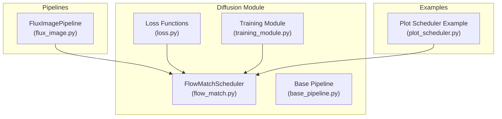
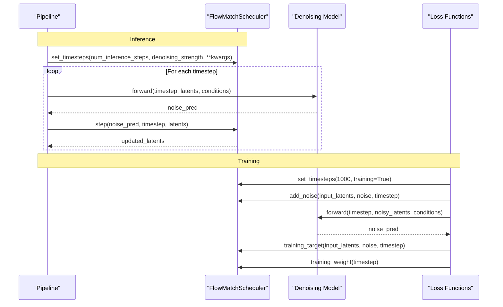
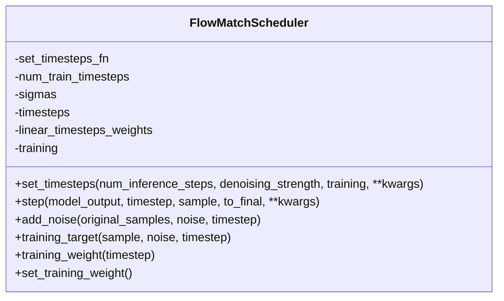
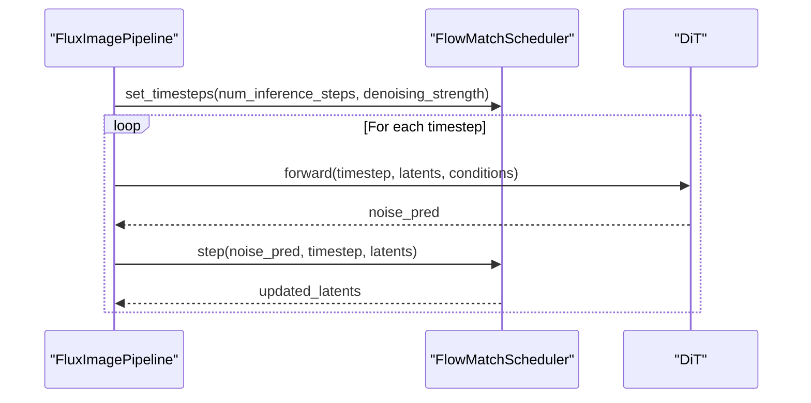
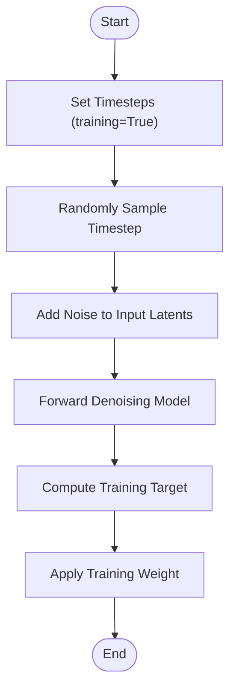
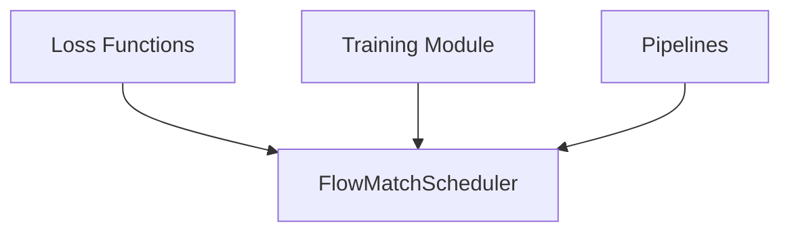

# Flow Match Scheduler

<cite>
**Referenced Files in This Document**
- [flow_match.py](file://diffsynth/diffusion/flow_match.py)
- [loss.py](file://diffsynth/diffusion/loss.py)
- [base_pipeline.py](file://diffsynth/diffusion/base_pipeline.py)
- [flux_image.py](file://diffsynth/pipelines/flux_image.py)
- [training_module.py](file://diffsynth/diffusion/training_module.py)
- [__init__.py](file://diffsynth/diffusion/__init__.py)
- [plot_scheduler.py](file://examples/qwen_image/plot_scheduler.py)
</cite>

## Table of Contents
1. [Introduction](#introduction)
2. [Project Structure](#project-structure)
3. [Core Components](#core-components)
4. [Architecture Overview](#architecture-overview)
5. [Detailed Component Analysis](#detailed-component-analysis)
6. [Dependency Analysis](#dependency-analysis)
7. [Performance Considerations](#performance-considerations)
8. [Troubleshooting Guide](#troubleshooting-guide)
9. [Conclusion](#conclusion)
10. [Appendices](#appendices)

## Introduction
This document provides comprehensive API documentation for the FlowMatchScheduler class, which implements flow matching-based diffusion scheduling. It explains how time step sampling, noise scheduling, and trajectory optimization are handled, along with configuration options, step size control, and convergence behavior. It also covers integration patterns with various model architectures, guidance on custom scheduler development, mathematical foundations, practical usage examples, and performance considerations.

## Project Structure
FlowMatchScheduler resides in the diffusion module and is exposed via the package’s public interface. Pipelines instantiate a template-specific scheduler to drive inference and training loops. Loss functions and training utilities rely on the scheduler’s timesteps, sigmas, and helper methods for noise addition and weighting.

**Diagram sources**
- [flow_match.py:1-262](file://diffsynth/diffusion/flow_match.py#L1-L262)
- [loss.py:1-159](file://diffsynth/diffusion/loss.py#L1-L159)
- [base_pipeline.py:1-200](file://diffsynth/diffusion/base_pipeline.py#L1-L200)
- [training_module.py:214-244](file://diffsynth/diffusion/training_module.py#L214-L244)
- [flux_image.py:1-200](file://diffsynth/pipelines/flux_image.py#L1-L200)
- [plot_scheduler.py:1-35](file://examples/qwen_image/plot_scheduler.py#L1-L35)

**Section sources**
- [flow_match.py:1-262](file://diffsynth/diffusion/flow_match.py#L1-L262)
- [__init__.py:1-7](file://diffsynth/diffusion/__init__.py#L1-L7)

## Core Components
FlowMatchScheduler encapsulates:
- Template-based timestep schedulers for different model families (FLUX.1, Wan, Qwen-Image, FLUX.2, Z-Image, LTX-2, Qwen-Image-Lightning, ERNIE-Image).
- Time step generation and sigma scheduling strategies per template.
- Training-time weight computation and sampling helpers.
- Inference stepping logic that advances samples along the flow trajectory.

Key responsibilities:
- set_timesteps: generate sigmas and timesteps based on template and parameters.
- step: advance sample using predicted model output and sigma schedule.
- add_noise: mix original data with noise according to sigma at a given timestep.
- training_target: compute target vector for supervised fine-tuning under flow matching.
- training_weight: return per-timestep weights used during training.

**Section sources**
- [flow_match.py:5-262](file://diffsynth/diffusion/flow_match.py#L5-L262)

## Architecture Overview
The scheduler integrates into pipelines and training modules as follows:
- Pipelines initialize a template-specific FlowMatchScheduler instance.
- During inference, pipelines call set_timesteps to build sigma/timestep schedules, then iterate over timesteps calling step to update latents.
- During training, training modules set long schedules (e.g., 1000 steps), mark training mode, and use add_noise, training_target, and training_weight within loss functions.

**Diagram sources**
- [flux_image.py:1-200](file://diffsynth/pipelines/flux_image.py#L1-L200)
- [flow_match.py:214-262](file://diffsynth/diffusion/flow_match.py#L214-L262)
- [loss.py:1-159](file://diffsynth/diffusion/loss.py#L1-L159)

## Detailed Component Analysis

### FlowMatchScheduler Class
The class exposes a unified interface for multiple templates and supports both inference and training workflows.

Key methods and behaviors:
- __init__: selects template-specific set_timesteps function; sets default num_train_timesteps.
- set_timesteps_flux/wan/qwen_image/flux2/z_image/ltx2/qwen_image_lightning/ernie_image: static methods implementing template-specific sigma schedules and optional shifts or terminal adjustments.
- set_training_weight: computes Gaussian-like weights across timesteps for balanced training.
- step: advances sample by integrating model_output along sigma differences.
- add_noise: linearly interpolates between clean and noisy states using sigma.
- training_target: returns noise - sample as the flow-matching target.
- training_weight: retrieves per-timestep weights computed earlier.

Configuration options:
- Template selection via constructor parameter.
- denoising_strength: controls starting sigma for inference schedules.
- shift/exponential_shift_mu/dynamic_shift_len/terminal/target_timesteps: template-specific parameters controlling sigma distribution and terminal behavior.

Convergence criteria:
- The final step uses sigma_=0 to ensure convergence to the clean state when to_final is true or at the last timestep.

**Diagram sources**
- [flow_match.py:5-262](file://diffsynth/diffusion/flow_match.py#L5-L262)

**Section sources**
- [flow_match.py:5-262](file://diffsynth/diffusion/flow_match.py#L5-L262)

### Template-Specific Schedulers
Each template method defines its own sigma schedule and optional transformations:
- FLUX.1: base sigma range with shift transformation.
- Wan: similar to FLUX.1 but with different defaults.
- Qwen-Image: exponential shift controlled by mu; terminal scaling supported.
- FLUX.2: empirical mu selection based on sequence length and steps.
- Z-Image: supports target_timesteps override.
- LTX-2: special cases for stage2 and distilled_stage1; dynamic shift and terminal scaling.
- Qwen-Image-Lightning: tuned shift parameters for faster inference.
- ERNIE-Image: simple shift-based schedule.

These methods return paired arrays of sigmas and corresponding timesteps scaled by num_train_timesteps.

**Section sources**
- [flow_match.py:21-200](file://diffsynth/diffusion/flow_match.py#L21-L200)

### Integration with Pipelines
Pipelines instantiate FlowMatchScheduler with a chosen template and use it throughout inference and training:
- FluxImagePipeline initializes with FlowMatchScheduler("FLUX.1").
- Inference loops iterate over scheduler.timesteps, calling step to update latents.
- Training routines switch to training mode and leverage add_noise, training_target, and training_weight.

**Diagram sources**
- [flux_image.py:1-200](file://diffsynth/pipelines/flux_image.py#L1-L200)
- [flow_match.py:214-262](file://diffsynth/diffusion/flow_match.py#L214-L262)

**Section sources**
- [flux_image.py:1-200](file://diffsynth/pipelines/flux_image.py#L1-L200)

### Training Losses and Trajectory Optimization
Loss functions utilize FlowMatchScheduler to:
- Sample random timesteps within boundaries.
- Add noise to input latents.
- Compute targets and apply per-timestep weights.
- Implement direct distillation and trajectory imitation strategies.

**Diagram sources**
- [loss.py:1-159](file://diffsynth/diffusion/loss.py#L1-L159)
- [flow_match.py:202-262](file://diffsynth/diffusion/flow_match.py#L202-L262)

**Section sources**
- [loss.py:1-159](file://diffsynth/diffusion/loss.py#L1-L159)

### Mathematical Foundations
Flow matching defines:
- Data definition: x_t = (1 - σ_t) x_0 + σ_t x_T
- Model definition: ε̂(x_t, c, t) ≈ x_T - x_0
- Iterative update: x_{t-1} = x_t + (σ_{t-1} - σ_t) ε̂(x_t, c, t)

The scheduler implements these principles through sigma schedules and step updates. Training targets follow noise - sample, aligning with the flow-matching objective.

**Section sources**
- [flow_match.py:246-262](file://diffsynth/diffusion/flow_match.py#L246-L262)

### Practical Usage Examples
- Plotting scheduler curves: example script demonstrates initializing FlowMatchScheduler with specific parameters and plotting sigmas over steps.
- Typical pipeline usage: set_timesteps followed by iterative step calls.

**Section sources**
- [plot_scheduler.py:1-35](file://examples/qwen_image/plot_scheduler.py#L1-L35)

## Dependency Analysis
FlowMatchScheduler has minimal external dependencies beyond torch and math. It is consumed by:
- Pipelines for inference scheduling.
- Loss functions for training objectives.
- Training modules for setting up training schedules.

**Diagram sources**
- [flow_match.py:1-262](file://diffsynth/diffusion/flow_match.py#L1-L262)
- [loss.py:1-159](file://diffsynth/diffusion/loss.py#L1-L159)
- [training_module.py:214-244](file://diffsynth/diffusion/training_module.py#L214-L244)
- [flux_image.py:1-200](file://diffsynth/pipelines/flux_image.py#L1-L200)

**Section sources**
- [flow_match.py:1-262](file://diffsynth/diffusion/flow_match.py#L1-L262)

## Performance Considerations
- Step count trade-offs: fewer steps reduce runtime but may degrade quality; many templates support accelerated schedules.
- Sigma schedule tuning: shift parameters and terminal adjustments can improve convergence speed and stability.
- Memory usage: training mode with long schedules (e.g., 1000 steps) increases memory footprint; consider gradient checkpointing and offloading.
- Device handling: timestep tensors are converted to CPU for indexing; ensure consistent device placement for large batches.

[No sources needed since this section provides general guidance]

## Troubleshooting Guide
Common issues and resolutions:
- Incorrect timestep mapping: ensure timestep values match scheduler.timesteps; use argmin distance to find closest index.
- Divergence at final step: verify to_final flag or last-step handling; sigma_ should be zero at termination.
- Training instability: adjust denoising_strength, shift parameters, or terminal scaling; inspect training_weight distribution.
- Template mismatch: confirm template selection matches model family; some templates require specific parameters (e.g., dynamic_shift_len).

**Section sources**
- [flow_match.py:226-262](file://diffsynth/diffusion/flow_match.py#L226-L262)

## Conclusion
FlowMatchScheduler provides a flexible and robust framework for flow matching-based diffusion scheduling across multiple model templates. Its design supports both inference and training workflows, enabling precise control over time step sampling, noise scheduling, and trajectory optimization. By leveraging template-specific schedulers and standardized interfaces, developers can integrate flow matching seamlessly into diverse model architectures and customize schedulers for specialized tasks.

[No sources needed since this section summarizes without analyzing specific files]

## Appendices

### API Reference Summary
- Constructor: FlowMatchScheduler(template="FLUX.1")
- Methods:
  - set_timesteps(num_inference_steps, denoising_strength=1.0, training=False, **kwargs)
  - step(model_output, timestep, sample, to_final=False, **kwargs)
  - add_noise(original_samples, noise, timestep)
  - training_target(sample, noise, timestep)
  - training_weight(timestep)
  - set_training_weight()

**Section sources**
- [flow_match.py:5-262](file://diffsynth/diffusion/flow_match.py#L5-L262)