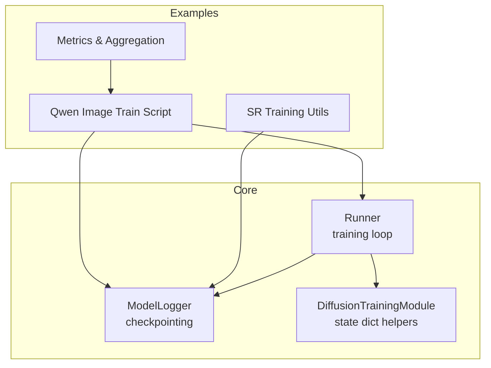
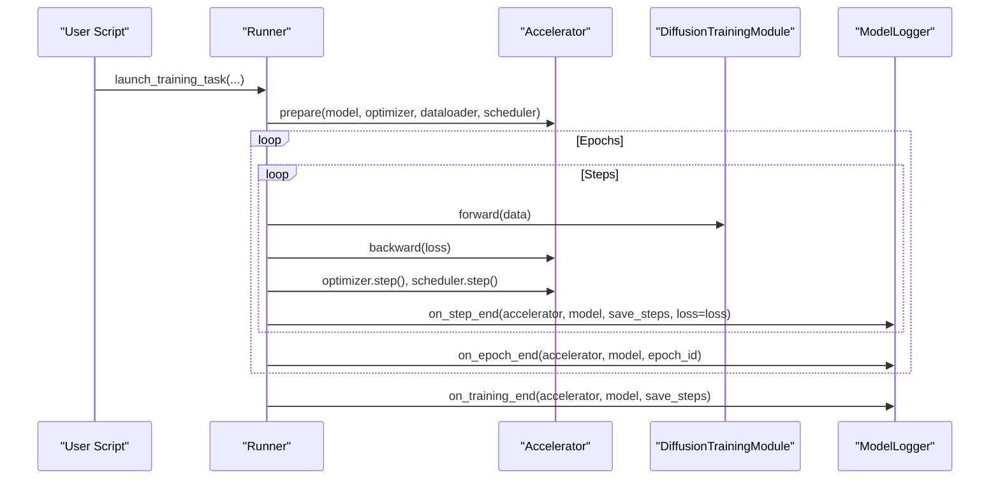
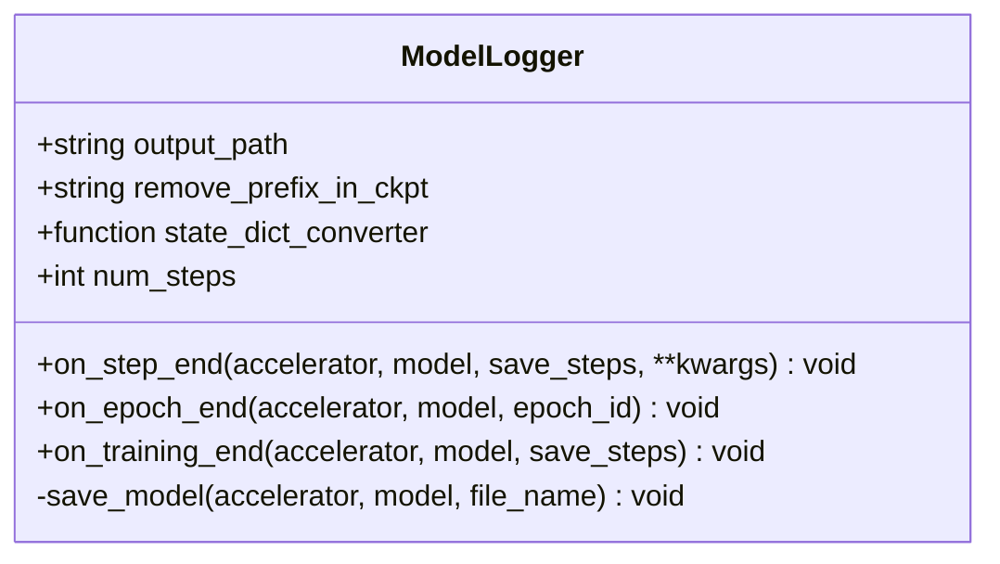
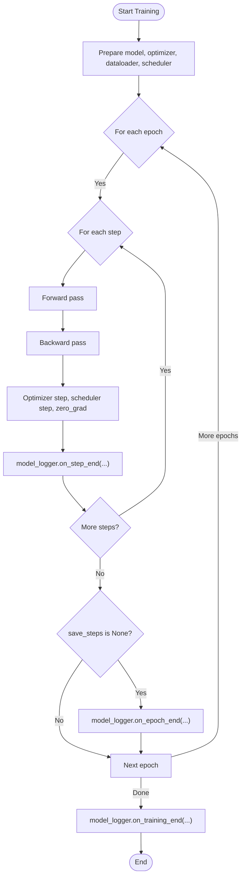
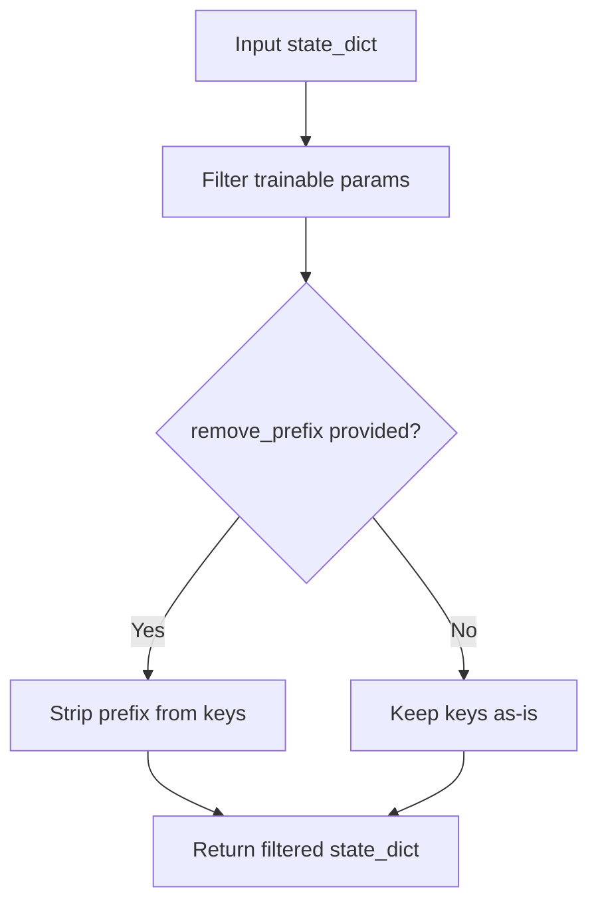
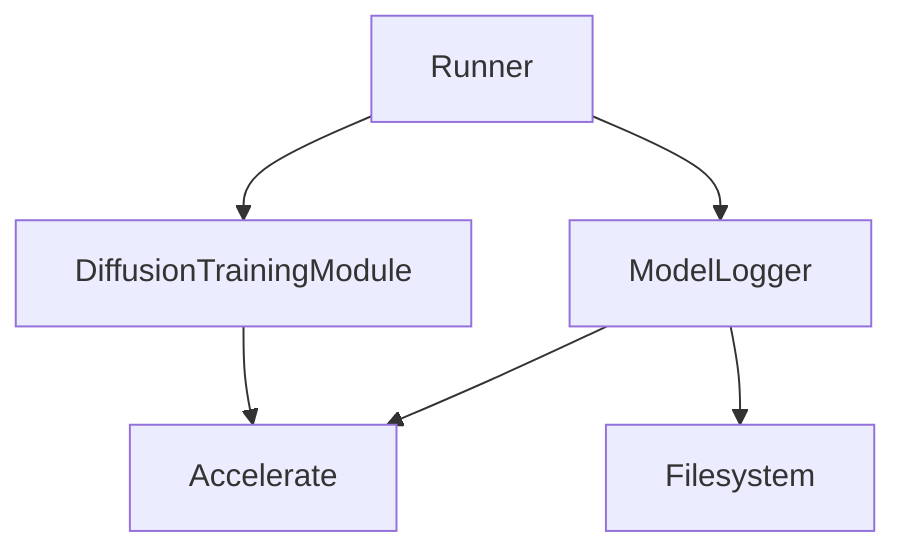

# Logging and Monitoring

<cite>
**Referenced Files in This Document**
- [logger.py](file://diffsynth/diffusion/logger.py)
- [runner.py](file://diffsynth/diffusion/runner.py)
- [training_module.py](file://diffsynth/diffusion/training_module.py)
- [train.py](file://examples/qwen_image/model_training/train.py)
- [training_utils.py](file://examples/qwen_image/model_training_sr/training_utils.py)
- [metrics.py](file://examples/qwen_image/metrics.py)
</cite>

## Table of Contents
1. Introduction
2. Project Structure
3. Core Components
4. Architecture Overview
5. Detailed Component Analysis
6. Dependency Analysis
7. Performance Considerations
8. Troubleshooting Guide
9. Conclusion

## Introduction
This document provides comprehensive API documentation for the ModelLogger class and the training monitoring system used across the repository’s diffusion training workflows. It covers logging configuration, checkpoint saving, metric collection, experiment tracking, and distributed coordination. It also explains how to integrate with popular logging frameworks (e.g., TensorBoard), visualize metrics, and extend the system with custom loggers and aggregation logic.

## Project Structure
The logging and monitoring functionality is centered around:
- A lightweight ModelLogger that handles periodic and epoch-based model checkpointing.
- A runner that orchestrates training loops and invokes logger hooks at step and epoch boundaries.
- A training module base that exposes trainable parameter extraction and state dict conversion utilities.
- Example scripts that instantiate ModelLogger and launch training/data processing tasks.
- A metrics utility for image quality evaluation and distributed aggregation.

**Diagram sources**
- [logger.py:5-44](file://diffsynth/diffusion/logger.py#L5-L44)
- [runner.py:8-47](file://diffsynth/diffusion/runner.py#L8-L47)
- [training_module.py:77-87](file://diffsynth/diffusion/training_module.py#L77-L87)
- [train.py:162-174](file://examples/qwen_image/model_training/train.py#L162-L174)
- [training_utils.py:53-72](file://examples/qwen_image/model_training_sr/training_utils.py#L53-L72)
- [metrics.py:186-387](file://examples/qwen_image/metrics.py#L186-L387)

**Section sources**
- [logger.py:1-44](file://diffsynth/diffusion/logger.py#L1-L44)
- [runner.py:1-89](file://diffsynth/diffusion/runner.py#L1-L89)
- [training_module.py:1-303](file://diffsynth/diffusion/training_module.py#L1-L303)
- [train.py:1-175](file://examples/qwen_image/model_training/train.py#L1-L175)
- [training_utils.py:1-221](file://examples/qwen_image/model_training_sr/training_utils.py#L1-L221)
- [metrics.py:1-572](file://examples/qwen_image/metrics.py#L1-L572)

## Core Components
- ModelLogger: Handles periodic and epoch-based checkpoint saving using Accelerate. Supports removing prefixes from state dict keys and applying a custom state_dict_converter before saving.
- Runner: Provides a standard training loop that prepares data, optimizer, scheduler, and calls ModelLogger hooks at step and epoch ends. Also includes a data preprocessing launcher.
- DiffusionTrainingModule: Supplies helper methods to export only trainable parameters and strip prefixes from state dicts; used by ModelLogger during save operations.
- Example Scripts: Instantiate ModelLogger and launch training or data processing tasks; demonstrate output directory management and optional TensorBoard integration points.
- Metrics Utilities: Provide per-image and dataset-level metric computation and distributed aggregation, suitable for evaluation runs and post-training analysis.

**Section sources**
- [logger.py:5-44](file://diffsynth/diffusion/logger.py#L5-L44)
- [runner.py:8-47](file://diffsynth/diffusion/runner.py#L8-L47)
- [training_module.py:77-87](file://diffsynth/diffusion/training_module.py#L77-L87)
- [train.py:162-174](file://examples/qwen_image/model_training/train.py#L162-L174)
- [training_utils.py:53-72](file://examples/qwen_image/model_training_sr/training_utils.py#L53-L72)
- [metrics.py:186-387](file://examples/qwen_image/metrics.py#L186-L387)

## Architecture Overview
The training workflow integrates ModelLogger into the accelerator-managed loop. At each step, the runner invokes on_step_end; at epoch boundaries, it calls on_epoch_end; and at training completion, on_training_end is invoked to ensure a final checkpoint if needed.

**Diagram sources**
- [runner.py:8-47](file://diffsynth/diffusion/runner.py#L8-L47)
- [logger.py:13-44](file://diffsynth/diffusion/logger.py#L13-L44)
- [training_module.py:77-87](file://diffsynth/diffusion/training_module.py#L77-L87)

## Detailed Component Analysis

### ModelLogger API
ModelLogger is responsible for saving checkpoints at configurable intervals and at epoch boundaries. It uses Accelerate to safely gather and serialize state dicts and ensures only main process writes to disk.

Key behaviors:
- Initialization accepts an output path, optional prefix removal for state dict keys, and a state_dict_converter callable.
- on_step_end increments a step counter and saves a step checkpoint when the step count is divisible by save_steps.
- on_epoch_end synchronizes processes, extracts the model state dict, unwraps the model, applies prefix removal and converter, then saves an epoch checkpoint.
- on_training_end ensures a final checkpoint if the last step did not trigger one.
- save_model centralizes checkpoint creation, ensuring safe serialization and directory creation.

**Diagram sources**
- [logger.py:5-44](file://diffsynth/diffusion/logger.py#L5-L44)

**Section sources**
- [logger.py:5-44](file://diffsynth/diffusion/logger.py#L5-L44)

### Runner Integration
The runner sets up the training loop and delegates checkpointing to ModelLogger. It supports gradient accumulation, DeepSpeed activation checkpointing initialization, and data preprocessing tasks.

Highlights:
- Optimizer and scheduler are created and prepared alongside the model and dataloader.
- Each step calls model_logger.on_step_end with accelerator, model, save_steps, and loss.
- If save_steps is None, on_epoch_end is called after each epoch.
- After all epochs, on_training_end is invoked to finalize any remaining checkpoint.

**Diagram sources**
- [runner.py:8-47](file://diffsynth/diffusion/runner.py#L8-L47)

**Section sources**
- [runner.py:8-47](file://diffsynth/diffusion/runner.py#L8-L47)

### Training Module State Dict Helpers
DiffusionTrainingModule provides utilities essential for ModelLogger’s checkpointing:
- trainable_param_names returns names of parameters requiring gradients.
- export_trainable_state_dict filters state dict to trainable parameters and optionally removes a specified prefix.

These methods ensure that saved checkpoints contain only necessary parameters and can be aligned to expected formats.

**Diagram sources**
- [training_module.py:77-87](file://diffsynth/diffusion/training_module.py#L77-L87)

**Section sources**
- [training_module.py:77-87](file://diffsynth/diffusion/training_module.py#L77-L87)

### Example Usage and Experiment Tracking
Example scripts demonstrate how to instantiate ModelLogger and manage experiment directories:
- The Qwen Image training script creates a ModelLogger with output_path and optional remove_prefix_in_ckpt, then launches training via the runner.
- The SR training utils show how to create time-stamped experiment directories and include placeholders for TensorBoard integration.

Output destinations:
- Checkpoints are saved under model_logger.output_path with filenames like epoch-*.safetensors and step-*.safetensors.
- Data preprocessing outputs are stored under model_logger.output_path/<process_index>/<data_id>.pth.

Experiment metadata:
- Scripts may write model structure and trainable parameter lists to files within the experiment directory.

**Section sources**
- [train.py:162-174](file://examples/qwen_image/model_training/train.py#L162-L174)
- [training_utils.py:91-97](file://examples/qwen_image/model_training_sr/training_utils.py#L91-L97)
- [training_utils.py:105-117](file://examples/qwen_image/model_training_sr/training_utils.py#L105-L117)
- [runner.py:50-72](file://diffsynth/diffusion/runner.py#L50-L72)

### Metric Collection and Distributed Aggregation
The metrics module provides:
- Per-image metric calculators (PSNR, SSIM, LPIPS, DISTS, NIQE, MUSIQ, CLIPIQA, MANIQA).
- Dataset-level metrics (FID).
- MetricsAccumulator to aggregate results and compute summaries.
- distributed_gather_metrics to merge per-rank results, compute dataset-level metrics, and save a consolidated metrics.json.

Integration points:
- Use MetricsAccumulator.update during evaluation loops to record per-image metrics.
- Call compute_dataset_metrics after generating all images to compute FID or other dataset-level metrics.
- Use distributed_gather_metrics in multi-process settings to collect and merge results across ranks.

**Section sources**
- [metrics.py:186-387](file://examples/qwen_image/metrics.py#L186-L387)
- [metrics.py:427-517](file://examples/qwen_image/metrics.py#L427-L517)

## Dependency Analysis
ModelLogger depends on Accelerate for distributed synchronization and safe serialization. It relies on DiffusionTrainingModule’s export_trainable_state_dict to produce minimal and correctly formatted checkpoints. The runner coordinates lifecycle events and passes required arguments to ModelLogger hooks.

**Diagram sources**
- [runner.py:8-47](file://diffsynth/diffusion/runner.py#L8-L47)
- [logger.py:5-44](file://diffsynth/diffusion/logger.py#L5-L44)
- [training_module.py:77-87](file://diffsynth/diffusion/training_module.py#L77-L87)

**Section sources**
- [runner.py:8-47](file://diffsynth/diffusion/runner.py#L8-L47)
- [logger.py:5-44](file://diffsynth/diffusion/logger.py#L5-L44)
- [training_module.py:77-87](file://diffynh/diffusion/training_module.py#L77-L87)

## Performance Considerations
- Checkpoint frequency: Set save_steps appropriately to balance I/O overhead and checkpoint granularity. Too frequent saves can slow training; too infrequent increases risk of losing progress.
- Safe serialization: Using accelerator.save with safe_serialization=True improves robustness and compatibility.
- Main process writes: Only the main process writes checkpoints, reducing contention and duplicate writes in distributed setups.
- State dict size: Export only trainable parameters and strip unnecessary prefixes to minimize checkpoint sizes.
- Disk offload constraints: Disk offloading requires .safetensors format and does not support certain binary formats or state dict converters that reshape tensors.

[No sources needed since this section provides general guidance]

## Troubleshooting Guide
Common issues and resolutions:
- Missing checkpoints: Ensure save_steps is set and on_step_end is called every step. Verify accelerator.is_main_process guards in save routines.
- Incomplete state dicts: Confirm export_trainable_state_dict filters trainable parameters and remove_prefix_in_ckpt matches expected key prefixes.
- Distributed hangs: Use accelerator.wait_for_everyone before writes and ensure all ranks reach synchronization points.
- Metrics aggregation failures: In distributed evaluation, verify temporary rank-specific JSON files are created and readable; handle filesystem latency with retries.

**Section sources**
- [logger.py:19-44](file://diffsynth/diffusion/logger.py#L19-L44)
- [training_module.py:77-87](file://diffsynth/diffusion/training_module.py#L77-L87)
- [metrics.py:321-387](file://examples/qwen_image/metrics.py#L321-L387)

## Conclusion
ModelLogger provides a simple, robust mechanism for checkpointing during training, integrating seamlessly with Accelerate and the training module’s state dict utilities. Combined with the runner’s lifecycle hooks and the metrics utilities, it forms a cohesive training monitoring and experiment tracking system. Users can extend it with custom state dict converters, integrate external logging frameworks like TensorBoard, and implement distributed metric aggregation for comprehensive evaluation workflows.

[No sources needed since this section summarizes without analyzing specific files]