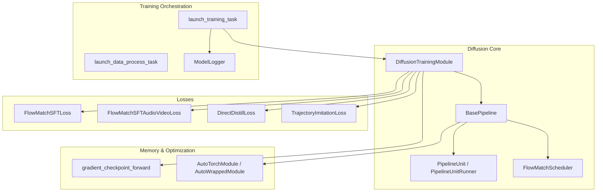
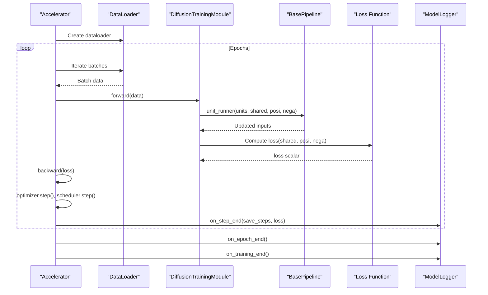
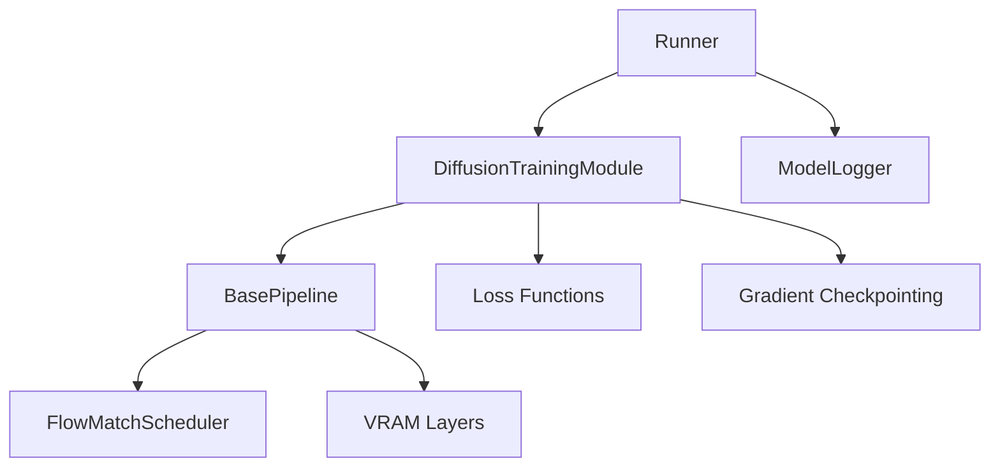

# Training Module

<cite>
**Referenced Files in This Document**
- [training_module.py](file://diffsynth/diffusion/training_module.py)
- [loss.py](file://diffsynth/diffusion/loss.py)
- [runner.py](file://diffsynth/diffusion/runner.py)
- [base_pipeline.py](file://diffsynth/diffusion/base_pipeline.py)
- [flow_match.py](file://diffsynth/diffusion/flow_match.py)
- [gradient_checkpoint.py](file://diffsynth/core/gradient/gradient_checkpoint.py)
- [logger.py](file://diffsynth/diffusion/logger.py)
- [train.py (Flux)](file://examples/flux/model_training/train.py)
- [train.py (Qwen Image)](file://examples/qwen_image/model_training/train.py)
</cite>

## Table of Contents
1. [Introduction](#introduction)
2. [Project Structure](#project-structure)
3. [Core Components](#core-components)
4. [Architecture Overview](#architecture-overview)
5. [Detailed Component Analysis](#detailed-component-analysis)
6. [Dependency Analysis](#dependency-analysis)
7. [Performance Considerations](#performance-considerations)
8. [Troubleshooting Guide](#troubleshooting-guide)
9. [Conclusion](#conclusion)
10. [Appendices](#appendices)

## Introduction
This document provides comprehensive API documentation for the DiffusionTrainingModule class and the surrounding training infrastructure. It explains how training modules integrate with loss functions, compute gradients, and apply optimization strategies. It also covers the complete training loop, batch processing, memory management during training, custom loss development, gradient checkpointing, mixed precision support, distributed training via Accelerate, monitoring/logging, and checkpoint management. Practical examples show how to implement a custom training module, define new losses, and configure training parameters.

## Project Structure
The training system is organized around:
- A base training module that prepares pipelines, handles LoRA, VRAM configuration, and data movement
- A pipeline abstraction that manages units, CFG guidance, step execution, and model loading/offloading
- Loss functions tailored for flow matching and distillation tasks
- A runner that orchestrates distributed training with Accelerate
- Gradient checkpointing utilities for memory-efficient backpropagation
- Logging and checkpoint saving utilities

**Diagram sources**
- [training_module.py:30-303](file://diffsynth/diffusion/training_module.py#L30-L303)
- [base_pipeline.py:61-501](file://diffsynth/diffusion/base_pipeline.py#L61-L501)
- [flow_match.py:5-262](file://diffsynth/diffusion/flow_match.py#L5-L262)
- [loss.py:5-159](file://diffsynth/diffusion/loss.py#L5-L159)
- [runner.py:8-89](file://diffsynth/diffusion/runner.py#L8-L89)
- [gradient_checkpoint.py:30-66](file://diffsynth/core/gradient/gradient_checkpoint.py#L30-L66)
- [logger.py:5-44](file://diffsynth/diffusion/logger.py#L5-L44)

**Section sources**
- [training_module.py:30-303](file://diffsynth/diffusion/training_module.py#L30-L303)
- [base_pipeline.py:61-501](file://diffsynth/diffusion/base_pipeline.py#L61-L501)
- [flow_match.py:5-262](file://diffsynth/diffusion/flow_match.py#L5-L262)
- [loss.py:5-159](file://diffsynth/diffusion/loss.py#L5-L159)
- [runner.py:8-89](file://diffsynth/diffusion/runner.py#L8-L89)
- [gradient_checkpoint.py:30-66](file://diffsynth/core/gradient/gradient_checkpoint.py#L30-L66)
- [logger.py:5-44](file://diffsynth/diffusion/logger.py#L5-L44)

## Core Components
- DiffusionTrainingModule: Base training wrapper providing device/data transfer, VRAM config parsing, LoRA injection, pipeline splitting for training vs data processing, and task-specific loss selection.
- BasePipeline: Encapsulates pipeline execution, unit graph handling, CFG guidance, step scheduling, VRAM-aware model onload/offload, and compilation helpers.
- FlowMatchScheduler: Defines timesteps, noise addition, target computation, and per-timestep weighting used by loss functions.
- Loss Functions: FlowMatchSFTLoss, FlowMatchSFTAudioVideoLoss, DirectDistillLoss, TrajectoryImitationLoss.
- Runner: Orchestrates distributed training loops with Accelerate, including optimizer, scheduler, dataloader, and logging.
- Gradient Checkpointing: Wrappers for activation checkpointing with DeepSpeed or PyTorch fallbacks.
- ModelLogger: Saves checkpoints at steps and epochs, exporting only trainable parameters.

Key responsibilities:
- Data movement and dtype casting across devices
- Splitting pipeline units to isolate trainable components
- Injecting LoRA adapters and mapping state dicts
- Selecting and invoking appropriate loss functions based on task
- Managing VRAM through offload/onload and optional disk offloading
- Enabling gradient checkpointing to reduce memory usage
- Logging and periodic checkpoint saving

**Section sources**
- [training_module.py:30-303](file://diffsynth/diffusion/training_module.py#L30-L303)
- [base_pipeline.py:61-501](file://diffsynth/diffusion/base_pipeline.py#L61-L501)
- [flow_match.py:5-262](file://diffsynth/diffusion/flow_match.py#L5-L262)
- [loss.py:5-159](file://diffsynth/diffusion/loss.py#L5-L159)
- [runner.py:8-89](file://diffsynth/diffusion/runner.py#L8-L89)
- [gradient_checkpoint.py:30-66](file://diffsynth/core/gradient/gradient_checkpoint.py#L30-L66)
- [logger.py:5-44](file://diffsynth/diffusion/logger.py#L5-L44)

## Architecture Overview
The training architecture integrates a DiffusionTrainingModule with a BasePipeline and a set of pipeline units. The runner sets up an Accelerator, constructs a dataloader, and iterates over batches. For each batch, the module prepares inputs, runs pipeline units, computes loss, performs backward pass, and logs/saves checkpoints.

**Diagram sources**
- [runner.py:8-48](file://diffsynth/diffusion/runner.py#L8-L48)
- [training_module.py:77-83](file://diffsynth/diffusion/training_module.py#L77-L83)
- [base_pipeline.py:470-501](file://diffsynth/diffusion/base_pipeline.py#L470-L501)
- [logger.py:13-44](file://diffsynth/diffusion/logger.py#L13-L44)

## Detailed Component Analysis

### DiffusionTrainingModule
Responsibilities:
- Device and dtype handling for tensors
- VRAM configuration parsing for FP8 or offload modes
- Model config parsing from paths or model IDs
- LoRA injection and state dict mapping
- Pipeline unit splitting for training vs data processing
- Task-to-loss mapping and invocation

Key methods:
- to(device, dtype): Propagates device/dtype to child modules
- trainable_modules(): Yields parameters requiring gradients
- trainable_param_names(): Returns names of trainable parameters
- add_lora_to_model(model, target_modules, rank, alpha, upcast_dtype): Injects LoRA and optionally upcasts trainable params
- mapping_lora_state_dict(state_dict): Maps LoRA keys to default format
- export_trainable_state_dict(state_dict, remove_prefix=None): Filters state dict to trainable params and strips prefixes
- transfer_data_to_device(data, device, torch_float_dtype): Recursively moves tensors and casts dtypes
- parse_vram_config(fp8=False, offload=False, device="cpu"): Builds VRAM config dict
- parse_model_configs(model_paths, model_id_with_origin_paths, fp8_models, offload_models, device): Creates ModelConfig list
- auto_detect_lora_target_modules(model, search_for_linear, linear_detector, block_list_detector, name_prefix): Finds suitable LoRA targets
- parse_lora_target_modules(model, lora_target_modules): Resolves string or auto-detected targets
- switch_pipe_to_training_mode(pipe, trainable_models, lora_base_model, lora_target_modules, lora_rank, lora_checkpoint, preset_lora_path, preset_lora_model, task): Freezes non-trainable models, loads preset LoRA, applies LoRA, and sets scheduler
- split_pipeline_units(task, pipe, trainable_models, lora_base_model, remove_unnecessary_params, loss_required_params, force_remove_params_shared, force_remove_params_posi, force_remove_params_nega): Splits units for training vs data processing
- parse_extra_inputs(data, extra_inputs, inputs_shared): Aggregates controlnet-like extra inputs into structured formats

Example usage patterns:
- Custom training modules subclass DiffusionTrainingModule, construct a specific pipeline, call split_pipeline_units and switch_pipe_to_training_mode, then implement get_pipeline_inputs and forward to run units and compute loss.

**Section sources**
- [training_module.py:30-303](file://diffsynth/diffusion/training_module.py#L30-L303)

### BasePipeline and Unit Graph
Responsibilities:
- Manage device/dtype for intermediates
- VRAM-aware onload/offload of models
- CFG-guided model function combining positive/negative predictions
- Step execution using scheduler
- Pipeline unit graph construction and splitting
- Compilation helpers for torch.compile

Key methods:
- freeze_except(model_names): Sets eval mode and toggles requires_grad for specified modules
- cfg_guided_model_fn(model_fn, cfg_scale, inputs_shared, inputs_posi, inputs_nega, **kwargs): Comboses positive and negative predictions
- step(scheduler, latents, progress_id, noise_pred, input_latents=None, inpaint_mask=None, **kwargs): Advances latent according to scheduler
- split_pipeline_units(model_names: list[str]): Returns related/unrelated units for training
- load_lora(module, lora_config, alpha, hotload, state_dict, verbose): Loads LoRA weights either fused or hotloaded
- clear_lora(verbose=1): Clears active LoRA layers
- download_and_load_models(model_configs, vram_limit): Downloads and loads models via ModelPool
- compile_pipeline(mode, dynamic, fullgraph, compile_models, **kwargs): Compiles eligible models

Unit runner behavior:
- PipelineUnitRunner executes units with shared/positive/negative inputs, supporting separate CFG branches and takeover units.

**Section sources**
- [base_pipeline.py:61-501](file://diffsynth/diffusion/base_pipeline.py#L61-L501)

### FlowMatchScheduler
Responsibilities:
- Generate sigmas and timesteps for various templates (FLUX.1, FLUX.2, Qwen-Image, etc.)
- Provide add_noise, training_target, step, return_to_timestep
- Compute per-timestep training weights for loss scaling

Key methods:
- set_timesteps(num_inference_steps, denoising_strength, training=False, **kwargs): Computes sigmas/timesteps and sets training mode
- add_noise(original_samples, noise, timestep): Mixes original samples with noise
- training_target(sample, noise, timestep): Returns noise - sample
- training_weight(timestep): Returns weight for current timestep
- step(model_output, timestep, sample, to_final=False, **kwargs): Updates sample along flow trajectory

**Section sources**
- [flow_match.py:5-262](file://diffsynth/diffusion/flow_match.py#L5-L262)

### Loss Functions
Interfaces:
- All losses accept a BasePipeline instance and keyword inputs derived from pipeline units. They use scheduler.timesteps and training_weight for weighting.

Implemented losses:
- FlowMatchSFTLoss: Samples a random timestep within boundaries, adds noise, computes training target, calls model_fn, and returns MSE weighted by scheduler.training_weight. Supports first-frame conditioning by slicing outputs.
- FlowMatchSFTAudioVideoLoss: Extends video flow matching with optional audio branch; sums video and audio losses weighted by timestep.
- DirectDistillLoss: Iterates through scheduler timesteps, updates latents via pipe.step, and minimizes distance between final latents and input latents.
- TrajectoryImitationLoss: Class-based loss that fetches teacher trajectory, aligns student predictions to teacher trajectories, and adds regularization via perceptual loss.

Custom loss development guidelines:
- Accept pipe and **inputs
- Use pipe.scheduler.add_noise and training_target for consistent sampling
- Call pipe.model_fn or pipe.cfg_guided_model_fn depending on whether CFG is needed
- Apply scheduler.training_weight(timestep) to scale loss
- Return a scalar tensor compatible with accelerator.backward

**Section sources**
- [loss.py:5-159](file://diffsynth/diffusion/loss.py#L5-L159)

### Training Runner and Distributed Setup
Responsibilities:
- Construct optimizer (AdamW) and constant LR scheduler
- Prepare model, optimizer, dataloader, scheduler with Accelerate
- Initialize DeepSpeed activation checkpointing if configured
- Iterate epochs and batches, accumulate gradients, step optimizer/scheduler, log/save checkpoints

Key functions:
- launch_training_task(accelerator, dataset, model, model_logger, learning_rate, weight_decay, num_workers, save_steps, num_epochs, args): Main training loop
- launch_data_process_task(accelerator, dataset, model, model_logger, num_workers, args): Preprocessing loop saving intermediate results
- initialize_deepspeed_gradient_checkpointing(accelerator): Configures DeepSpeed checkpointing when available

Batch processing and memory management:
- Uses accelerator.accumulate for gradient accumulation
- Optionally loads precomputed cache for faster iteration
- Saves checkpoints periodically via ModelLogger

**Section sources**
- [runner.py:8-89](file://diffsynth/diffusion/runner.py#L8-L89)

### Gradient Checkpointing
Responsibilities:
- Wrap model forward with activation checkpointing to reduce memory usage
- Prefer DeepSpeed checkpointing when configured; otherwise fall back to torch.utils.checkpoint
- Support CPU offloading of activations when enabled

Key function:
- gradient_checkpoint_forward(model, use_gradient_checkpointing, use_gradient_checkpointing_offload, *args, **kwargs): Chooses optimal checkpointing strategy

Integration points:
- Custom training modules pass use_gradient_checkpointing and use_gradient_checkpointing_offload flags to pipeline units and model_fn calls.

**Section sources**
- [gradient_checkpoint.py:30-66](file://diffsynth/core/gradient/gradient_checkpoint.py#L30-L66)

### Logging and Checkpoint Management
Responsibilities:
- Save trainable parameter subsets at step intervals and epoch ends
- Convert state dicts via a provided converter (e.g., LoRA format alignment)
- Ensure multi-process synchronization with accelerator.wait_for_everyone

Key class:
- ModelLogger(output_path, remove_prefix_in_ckpt=None, state_dict_converter=lambda x:x)
  - on_step_end: Saves checkpoints every save_steps
  - on_epoch_end: Saves epoch checkpoint after unwrapping model and filtering trainable params
  - on_training_end: Ensures final checkpoint saved if not aligned with save_steps

**Section sources**
- [logger.py:5-44](file://diffsynth/diffusion/logger.py#L5-L44)

## Dependency Analysis
The training system exhibits clear separation of concerns:
- DiffusionTrainingModule depends on BasePipeline for unit execution and VRAM management
- Loss functions depend on BasePipeline and FlowMatchScheduler
- Runner depends on DiffusionTrainingModule, ModelLogger, and Accelerate
- Gradient checkpointing is invoked conditionally based on flags and environment

**Diagram sources**
- [training_module.py:30-303](file://diffsynth/diffusion/training_module.py#L30-L303)
- [base_pipeline.py:61-501](file://diffsynth/diffusion/base_pipeline.py#L61-L501)
- [loss.py:5-159](file://diffsynth/diffusion/loss.py#L5-L159)
- [runner.py:8-89](file://diffsynth/diffusion/runner.py#L8-L89)
- [gradient_checkpoint.py:30-66](file://diffsynth/core/gradient/gradient_checkpoint.py#L30-L66)

**Section sources**
- [training_module.py:30-303](file://diffsynth/diffusion/training_module.py#L30-L303)
- [base_pipeline.py:61-501](file://diffsynth/diffusion/base_pipeline.py#L61-L501)
- [loss.py:5-159](file://diffsynth/diffusion/loss.py#L5-L159)
- [runner.py:8-89](file://diffsynth/diffusion/runner.py#L8-L89)
- [gradient_checkpoint.py:30-66](file://diffsynth/core/gradient/gradient_checkpoint.py#L30-L66)

## Performance Considerations
- Mixed Precision: Use torch.bfloat16 or float16 via BasePipeline.torch_dtype; ensure scheduler and tensors are cast appropriately.
- Gradient Checkpointing: Enable use_gradient_checkpointing and optionally use_gradient_checkpointing_offload to trade compute for memory.
- VRAM Management: Leverage AutoTorchModule/AutoWrappedModule for dynamic onload/offload; consider disk offloading for large models.
- LoRA: Reduce trainable parameters via targeted LoRA modules; auto-detect targets to minimize manual effort.
- DataLoader Workers: Tune num_workers to balance I/O throughput and memory overhead.
- Compile Pipeline: Use compile_pipeline to optimize repeated blocks or entire models where applicable.

[No sources needed since this section provides general guidance]

## Troubleshooting Guide
Common issues and resolutions:
- Missing trainable parameters: Ensure switch_pipe_to_training_mode is called and trainable_models includes desired modules.
- LoRA key mismatch: Use mapping_lora_state_dict to align LoRA keys before loading checkpoints.
- Out-of-memory errors: Enable gradient checkpointing, reduce batch size, or enable VRAM offloading/disk offloading.
- CFG not applied: Verify cfg_scale > 1 and that inputs_posi and inputs_nega are correctly populated.
- Scheduler mismatch: Confirm set_timesteps(training=True) is called before computing losses.
- Multi-process checkpoint corruption: Ensure accelerator.wait_for_everyone is used before saving.

**Section sources**
- [training_module.py:214-254](file://diffsynth/diffusion/training_module.py#L214-L254)
- [logger.py:13-44](file://diffsynth/diffusion/logger.py#L13-L44)
- [runner.py:32-47](file://diffsynth/diffusion/runner.py#L32-L47)

## Conclusion
The DiffusionTrainingModule and its ecosystem provide a flexible, efficient, and scalable training framework for diffusion models. By integrating pipeline units, robust loss functions, VRAM-aware model management, and distributed training via Accelerate, it supports a wide range of tasks from supervised fine-tuning to distillation. Users can extend the system by implementing custom training modules and losses while leveraging built-in tools for memory efficiency and performance optimization.

[No sources needed since this section summarizes without analyzing specific files]

## Appendices

### Example: Implementing a Custom Training Module
Steps:
- Subclass DiffusionTrainingModule
- Load pipeline and tokenizer/processor configs
- Call split_pipeline_units and switch_pipe_to_training_mode
- Implement get_pipeline_inputs to assemble shared/positive/negative inputs
- Implement forward to run units and compute loss via task_to_loss mapping

Reference implementations:
- FluxTrainingModule example
- QwenImageTrainingModule example

**Section sources**
- [train.py (Flux):8-83](file://examples/flux/model_training/train.py#L8-L83)
- [train.py (Qwen Image):9-94](file://examples/qwen_image/model_training/train.py#L9-L94)

### Example: Defining a New Loss Function
Guidelines:
- Signature: def MyLoss(pipe: BasePipeline, **inputs) -> torch.Tensor
- Use pipe.scheduler.add_noise and training_target for consistent sampling
- Call pipe.model_fn or pipe.cfg_guided_model_fn as needed
- Apply scheduler.training_weight(timestep) for scaling
- Return a scalar tensor

Reference patterns:
- FlowMatchSFTLoss
- FlowMatchSFTAudioVideoLoss
- DirectDistillLoss

**Section sources**
- [loss.py:5-71](file://diffsynth/diffusion/loss.py#L5-L71)

### Example: Configuring Training Parameters
Typical parameters:
- learning_rate, weight_decay, num_workers, save_steps, num_epochs
- use_gradient_checkpointing, use_gradient_checkpointing_offload
- extra_inputs for controlnet-like features
- fp8_models, offload_models for VRAM strategies
- task to select loss mapping (e.g., sft, direct_distill, :data_process, :train)

Reference usage:
- Argument parsing and launcher mapping in example train scripts

**Section sources**
- [train.py (Flux):86-194](file://examples/flux/model_training/train.py#L86-L194)
- [train.py (Qwen Image):97-175](file://examples/qwen_image/model_training/train.py#L97-L175)