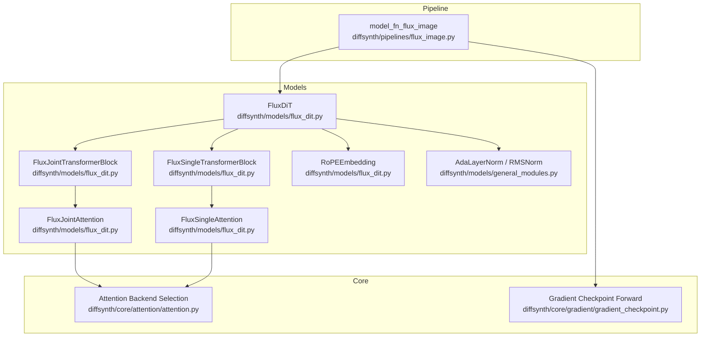
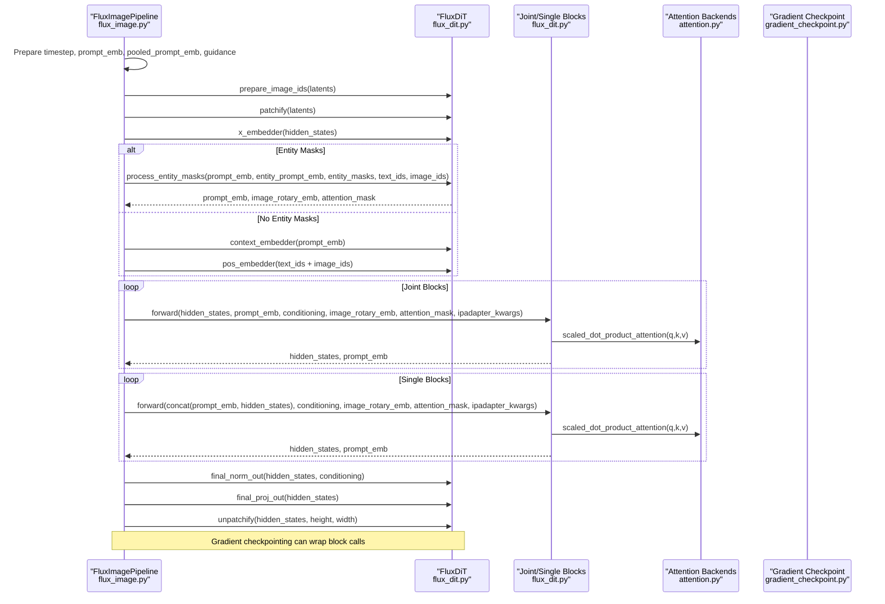
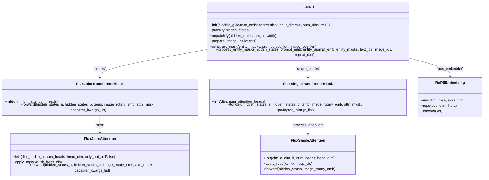
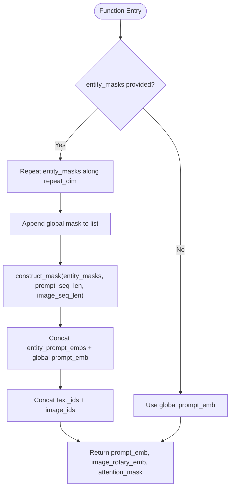
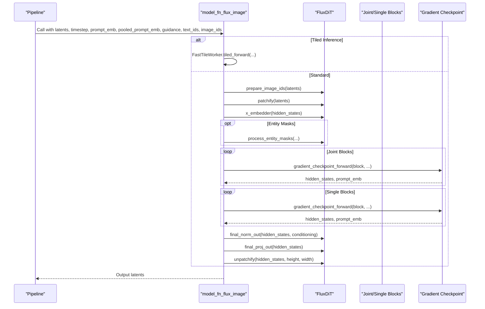
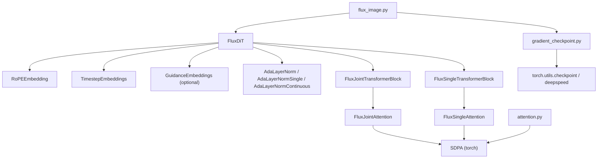

# FLUX DiT Architecture

<cite>
**Referenced Files in This Document**
- [flux_dit.py](file://diffsynth/models/flux_dit.py)
- [general_modules.py](file://diffsynth/models/general_modules.py)
- [attention.py](file://diffsynth/core/attention/attention.py)
- [gradient_checkpoint.py](file://diffsynth/core/gradient/gradient_checkpoint.py)
- [flux_image.py](file://diffsynth/pipelines/flux_image.py)
</cite>

## Table of Contents
1. [Introduction](#introduction)
2. [Project Structure](#project-structure)
3. [Core Components](#core-components)
4. [Architecture Overview](#architecture-overview)
5. [Detailed Component Analysis](#detailed-component-analysis)
6. [Dependency Analysis](#dependency-analysis)
7. [Performance Considerations](#performance-considerations)
8. [Troubleshooting Guide](#troubleshooting-guide)
9. [Conclusion](#conclusion)
10. [Appendices](#appendices)

## Introduction
This document provides detailed API documentation for the FLUX Diffusion Transformer (DiT) architecture implemented in this repository. It focuses on the FluxDiT class, its transformer blocks, attention mechanisms, positional embeddings (RoPE), and AdaLayerNorm variants. It also documents FluxJointAttention and FluxSingleAttention, patchify/unpatchify operations, entity mask processing, configuration parameters, memory optimization techniques, gradient checkpointing support, and performance considerations. The goal is to make the architecture accessible to both researchers and practitioners while providing precise references to source files.

## Project Structure
The FLUX DiT implementation spans several modules:
- Model definition and core components are in diffsynth/models/flux_dit.py and diffsynth/models/general_modules.py.
- Attention backends and selection logic are in diffsynth/core/attention/attention.py.
- Gradient checkpointing utilities are in diffsynth/core/gradient/gradient_checkpoint.py.
- Pipeline orchestration and usage examples are in diffsynth/pipelines/flux_image.py.

**Diagram sources**
- [flux_dit.py:277-306](file://diffsynth/models/flux_dit.py#L277-L306)
- [flux_dit.py:108-148](file://diffsynth/models/flux_dit.py#L108-L148)
- [flux_dit.py:152-186](file://diffsynth/models/flux_dit.py#L152-L186)
- [flux_dit.py:14-41](file://diffsynth/models/flux_dit.py#L14-L41)
- [general_modules.py:123-147](file://diffsynth/models/general_modules.py#L123-L147)
- [attention.py:30-45](file://diffsynth/core/attention/attention.py#L30-L45)
- [gradient_checkpoint.py:30-65](file://diffsynth/core/gradient/gradient_checkpoint.py#L30-L65)
- [flux_image.py:1000-1203](file://diffsynth/pipelines/flux_image.py#L1000-L1203)

**Section sources**
- [flux_dit.py:277-306](file://diffsynth/models/flux_dit.py#L277-L306)
- [general_modules.py:123-147](file://diffsynth/models/general_modules.py#L123-L147)
- [attention.py:30-45](file://diffsynth/core/attention/attention.py#L30-L45)
- [gradient_checkpoint.py:30-65](file://diffsynth/core/gradient/gradient_checkpoint.py#L30-L65)
- [flux_image.py:1000-1203](file://diffsynth/pipelines/flux_image.py#L1000-L1203)

## Core Components
- FluxDiT: Main DiT module with RoPE-based positional embedding, time/guidance embedders, pooled text embedder, context embedder, x_embedder, joint and single transformer blocks, final normalization and projection.
- FluxJointTransformerBlock: Dual-path transformer block using FluxJointAttention and separate FFNs for image and prompt streams; uses AdaLayerNorm for modulation.
- FluxSingleTransformerBlock: Single-stream transformer block that processes concatenated prompt+image tokens; uses AdaLayerNormSingle and a fused QKV/MLP projection.
- FluxJointAttention: Joint attention over two modalities (A and B), concatenating Q/K/V across modalities, applying RoPE, SDPA, and optional IP-Adapter interaction.
- FluxSingleAttention: Self-attention within a single stream with RoPE and SDPA.
- RoPEEmbedding: Multi-axis rotary positional encoding generator used for text and image tokens.
- AdaLayerNorm variants: AdaLayerNorm (multi-gate modulation), AdaLayerNormSingle (single-gate modulation), AdaLayerNormContinuous (continuous shift/scale modulation).

Key responsibilities:
- Patchify/unpatchify: Convert latent tensors between spatial patches and sequence tokens.
- Entity mask processing: Construct attention masks based on entity masks to control cross-modal interactions.
- Conditioning: Combine timestep, guidance, and pooled text embeddings into conditioning signals.

**Section sources**
- [flux_dit.py:277-306](file://diffsynth/models/flux_dit.py#L277-L306)
- [flux_dit.py:108-148](file://diffsynth/models/flux_dit.py#L108-L148)
- [flux_dit.py:152-186](file://diffsynth/models/flux_dit.py#L152-L186)
- [flux_dit.py:45-104](file://diffsynth/models/flux_dit.py#L45-L104)
- [flux_dit.py:189-202](file://diffsynth/models/flux_dit.py#L189-L202)
- [flux_dit.py:262-274](file://diffsynth/models/flux_dit.py#L262-L274)
- [flux_dit.py:14-41](file://diffsynth/models/flux_dit.py#L14-L41)
- [general_modules.py:123-147](file://diffsynth/models/general_modules.py#L123-L147)

## Architecture Overview
The FLUX DiT pipeline orchestrates tokenization, conditioning, joint/single transformer blocks, and reconstruction. The forward pass prepares conditioning, patches latents, constructs positional encodings, optionally integrates entity masks and kontext/reference inputs, runs through alternating joint and single blocks, and unpatches outputs.

**Diagram sources**
- [flux_image.py:1000-1203](file://diffsynth/pipelines/flux_image.py#L1000-L1203)
- [flux_dit.py:277-306](file://diffsynth/models/flux_dit.py#L277-L306)
- [flux_dit.py:108-148](file://diffsynth/models/flux_dit.py#L108-L148)
- [flux_dit.py:152-186](file://diffsynth/models/flux_dit.py#L152-L186)
- [attention.py:108-122](file://diffsynth/core/attention/attention.py#L108-L122)
- [gradient_checkpoint.py:30-65](file://diffsynth/core/gradient/gradient_checkpoint.py#L30-L65)

## Detailed Component Analysis

### FluxDiT Class
- Configuration parameters:
  - disable_guidance_embedder: bool, toggles guidance embedder.
  - input_dim: int, channel dimension of input latents (default 64).
  - num_blocks: int, number of joint transformer blocks (default 19).
- Embedders:
  - RoPE positional embedder with axes [16, 56, 56] and theta 10000.
  - Timestep embedder (256 -> 3072).
  - Optional guidance embedder (256 -> 3072).
  - Pooled text embedder (768 -> 3072).
  - Context embedder (4096 -> 3072).
  - X embedder (input_dim -> 3072).
- Blocks:
  - Joint blocks: ModuleList of FluxJointTransformerBlock(3072, 24).
  - Single blocks: ModuleList of FluxSingleTransformerBlock(3072, 24) repeated 38 times.
- Final layers:
  - AdaLayerNormContinuous(3072).
  - Linear projection to output channels (3072 -> 64).
- Utilities:
  - patchify/unpatchify with 2x2 patches.
  - prepare_image_ids for latent positions.
  - construct_mask for entity masks.
  - process_entity_masks to build combined prompt embeddings and attention masks.

Usage notes:
- The actual forward pass is orchestrated by model_fn_flux_image; FluxDiT.forward returns None as a placeholder.
- Use gradient_checkpoint_forward to wrap block calls during training/inference for memory savings.

**Section sources**
- [flux_dit.py:277-306](file://diffsynth/models/flux_dit.py#L277-L306)
- [flux_dit.py:309-323](file://diffsynth/models/flux_dit.py#L309-L323)
- [flux_dit.py:326-358](file://diffsynth/models/flux_dit.py#L326-L358)
- [flux_dit.py:361-386](file://diffsynth/models/flux_dit.py#L361-L386)
- [flux_image.py:1000-1203](file://diffsynth/pipelines/flux_image.py#L1000-L1203)

#### Class Diagram

**Diagram sources**
- [flux_dit.py:277-306](file://diffsynth/models/flux_dit.py#L277-L306)
- [flux_dit.py:108-148](file://diffsynth/models/flux_dit.py#L108-L148)
- [flux_dit.py:152-186](file://diffsynth/models/flux_dit.py#L152-L186)
- [flux_dit.py:45-104](file://diffsynth/models/flux_dit.py#L45-L104)
- [flux_dit.py:14-41](file://diffsynth/models/flux_dit.py#L14-L41)

### FluxJointAttention
- Inputs:
  - hidden_states_a: image tokens.
  - hidden_states_b: prompt/context tokens.
  - image_rotary_emb: RoPE frequencies.
  - attn_mask: optional attention mask.
  - ipadapter_kwargs_list: optional IP-Adapter kwargs for residual injection.
- Processing:
  - Projects each modality to Q/K/V separately.
  - Normalizes Q/K per head via RMSNorm.
  - Concatenates Q/K/V across modalities.
  - Applies RoPE to Q/K.
  - Computes scaled dot-product attention.
  - Splits outputs back to modalities and projects via linear layers.
  - Optionally injects IP-Adapter residuals into image branch.

Complexity:
- O(N^2 * d) for attention where N is total sequence length (prompt + image) and d is head_dim.

**Section sources**
- [flux_dit.py:45-104](file://diffsynth/models/flux_dit.py#L45-L104)

### FluxSingleAttention
- Inputs:
  - hidden_states: concatenated prompt+image tokens.
  - image_rotary_emb: RoPE frequencies.
- Processing:
  - Projects to Q/K/V via a single linear layer.
  - Normalizes Q/K per head via RMSNorm.
  - Applies RoPE to Q/K.
  - Computes scaled dot-product attention.
  - Reshapes and casts back to original dtype.

Complexity:
- O((N_p + N_i)^2 * d) where N_p is prompt sequence length and N_i is image sequence length.

**Section sources**
- [flux_dit.py:152-186](file://diffsynth/models/flux_dit.py#L152-L186)

### RoPE Embedding System
- Multi-axis rotary positional encoding generator.
- Parameters:
  - dim: embedding dimension (e.g., 3072).
  - theta: base frequency scaling (e.g., 10000).
  - axes_dim: tuple specifying per-axis dimensions (e.g., [16, 56, 56]).
- Usage:
  - Generates frequency tensors from ids (text_ids + image_ids).
  - Applied to Q/K before attention to encode relative positions.

Complexity:
- O(seq_len * dim) to generate frequencies; applied per-head efficiently.

**Section sources**
- [flux_dit.py:14-41](file://diffsynth/models/flux_dit.py#L14-L41)

### AdaLayerNorm Variants
- AdaLayerNorm:
  - Produces multiple modulation parameters (shift/scale/gate) for dual or single modes.
  - Used in FluxJointTransformerBlock for both image and prompt branches.
- AdaLayerNormSingle:
  - Produces shift/scale/gate for single-stream blocks.
  - Used in FluxSingleTransformerBlock.
- AdaLayerNormContinuous:
  - Produces continuous shift/scale modulation for final normalization.
  - Used at the output of DiT before projection.

Implementation details:
- Uses SiLU activation and LayerNorm without affine parameters.
- Modulation parameters are derived from conditioning embeddings (timestep, guidance, pooled text).

**Section sources**
- [general_modules.py:123-147](file://diffsynth/models/general_modules.py#L123-L147)
- [flux_dit.py:189-202](file://diffsynth/models/flux_dit.py#L189-L202)
- [flux_dit.py:262-274](file://diffsynth/models/flux_dit.py#L262-L274)

### Patchify/Unpatchify Operations
- patchify: Rearranges latent tensor BxCxHxW into Bx(HW)x(C*P*Q) with P=2, Q=2.
- unpatchify: Reverses patchification to reconstruct spatial layout given height and width.

Use cases:
- Converting VAE latents into token sequences for transformer processing.
- Reconstructing denoised latents after transformer inference.

**Section sources**
- [flux_dit.py:299-306](file://diffsynth/models/flux_dit.py#L299-L306)

### Entity Mask Processing
- construct_mask:
  - Builds an attention mask matrix combining prompt and image tokens.
  - Uses patched entity masks to allow selective cross-attention between prompts and image regions.
  - Enforces prompt-prompt masking across different entities.
- process_entity_masks:
  - Prepares combined prompt embeddings (entity-specific + global).
  - Concatenates text_ids and image_ids for RoPE generation.
  - Returns attention mask and rotary embeddings.

Flowchart:

**Diagram sources**
- [flux_dit.py:326-358](file://diffsynth/models/flux_dit.py#L326-L358)
- [flux_dit.py:361-386](file://diffsynth/models/flux_dit.py#L361-L386)

**Section sources**
- [flux_dit.py:326-358](file://diffsynth/models/flux_dit.py#L326-L358)
- [flux_dit.py:361-386](file://diffsynth/models/flux_dit.py#L361-L386)

### Forward Pass Orchestration (model_fn_flux_image)
- Handles tiled inference, ControlNet integration, Flex conditioning, Step1x connectors, Kontext reference images, IP-Adapter injection, TeaCache acceleration, and gradient checkpointing.
- Key steps:
  - Prepare conditioning from timestep, pooled text, and optional guidance.
  - Patchify latents and embed via x_embedder.
  - Optionally concatenate kontext/reference latents and IDs.
  - Process entity masks if provided.
  - Run joint blocks followed by single blocks with gradient checkpointing.
  - Apply final normalization and projection, then unpatchify.

Sequence diagram:

**Diagram sources**
- [flux_image.py:1000-1203](file://diffsynth/pipelines/flux_image.py#L1000-L1203)
- [gradient_checkpoint.py:30-65](file://diffsynth/core/gradient/gradient_checkpoint.py#L30-L65)

**Section sources**
- [flux_image.py:1000-1203](file://diffsynth/pipelines/flux_image.py#L1000-L1203)

## Dependency Analysis
- FluxDiT depends on:
  - RoPEEmbedding for positional encodings.
  - TimestepEmbeddings and optional guidance embedder for conditioning.
  - AdaLayerNorm variants for modulation.
  - FluxJointTransformerBlock and FluxSingleTransformerBlock for processing.
- Attention backends:
  - flux_dit uses torch.nn.functional.scaled_dot_product_attention directly.
  - attention.py provides backend selection (FlashAttention 2/3, SageAttention, xFormers, torch SDPA).
- Gradient checkpointing:
  - gradient_checkpoint_forward wraps block calls to reduce memory usage during training/inference.

**Diagram sources**
- [flux_dit.py:277-306](file://diffsynth/models/flux_dit.py#L277-L306)
- [attention.py:108-122](file://diffsynth/core/attention/attention.py#L108-L122)
- [gradient_checkpoint.py:30-65](file://diffsynth/core/gradient/gradient_checkpoint.py#L30-L65)
- [flux_image.py:1000-1203](file://diffsynth/pipelines/flux_image.py#L1000-L1203)

**Section sources**
- [flux_dit.py:277-306](file://diffsynth/models/flux_dit.py#L277-L306)
- [attention.py:108-122](file://diffsynth/core/attention/attention.py#L108-L122)
- [gradient_checkpoint.py:30-65](file://diffsynth/core/gradient/gradient_checkpoint.py#L30-L65)
- [flux_image.py:1000-1203](file://diffsynth/pipelines/flux_image.py#L1000-L1203)

## Performance Considerations
- Attention backend selection:
  - Prefer FlashAttention 3/2, SageAttention, or xFormers when available for speed and memory efficiency.
  - Falls back to torch SDPA when no optimized backend is installed.
- Gradient checkpointing:
  - Use gradient_checkpoint_forward to trade compute for memory savings during training or long sequences.
  - Supports DeepSpeed integration when configured.
- Tiled inference:
  - model_fn_flux_image supports FastTileWorker for large images by splitting into tiles and blending outputs.
- TeaCache acceleration:
  - Optional caching mechanism to skip recomputation when changes are small.
- Memory optimization:
  - Avoid storing intermediate tensors unnecessarily; use efficient rearrange operations.
  - Consider disabling guidance embedder if not needed to reduce parameters.

[No sources needed since this section provides general guidance]

## Troubleshooting Guide
Common issues and resolutions:
- Missing attention backends:
  - Ensure flash_attn, sageattention, or xformers are installed if desired.
  - Environment variable DIFFSYNTH_ATTENTION_IMPLEMENTATION can force a specific backend.
- Out-of-memory errors:
  - Enable gradient checkpointing (use_gradient_checkpointing=True).
  - Use tiled inference (tiled=True) for large images.
  - Reduce batch size or sequence length.
- Incorrect entity mask shapes:
  - Ensure entity_masks match latent resolution (height//8, width//8) and are properly repeated along repeat_dim.
- Guidance scaling:
  - Guidance values are multiplied by 1000 before embedding; ensure consistent scaling.

**Section sources**
- [attention.py:30-45](file://diffsynth/core/attention/attention.py#L30-L45)
- [gradient_checkpoint.py:30-65](file://diffsynth/core/gradient/gradient_checkpoint.py#L30-L65)
- [flux_image.py:1000-1203](file://diffsynth/pipelines/flux_image.py#L1000-L1203)

## Conclusion
The FLUX DiT architecture combines joint and single transformer blocks with RoPE-based positional encodings and adaptive layer normalization to process text and image tokens efficiently. The implementation provides robust attention backends, gradient checkpointing, and tiled inference for scalability. By understanding the components and their interactions, users can configure and optimize the model for various tasks including generation, editing, and controlled synthesis.

[No sources needed since this section summarizes without analyzing specific files]

## Appendices

### Configuration Parameters Summary
- FluxDiT.__init__:
  - disable_guidance_embedder: bool
  - input_dim: int (latent channels)
  - num_blocks: int (joint blocks count)
- model_fn_flux_image:
  - latents: BxCxHxW
  - timestep: scalar or tensor
  - prompt_emb: BxTxD
  - pooled_prompt_emb: BxD
  - guidance: scalar or tensor
  - text_ids: BxTx3
  - image_ids: BxIx3
  - entity_prompt_emb: optional
  - entity_masks: optional
  - use_gradient_checkpointing: bool
  - use_gradient_checkpointing_offload: bool
  - tiled: bool
  - tile_size: int
  - tile_stride: int

**Section sources**
- [flux_dit.py:277-306](file://diffsynth/models/flux_dit.py#L277-L306)
- [flux_image.py:1000-1203](file://diffsynth/pipelines/flux_image.py#L1000-L1203)