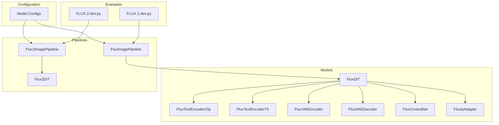
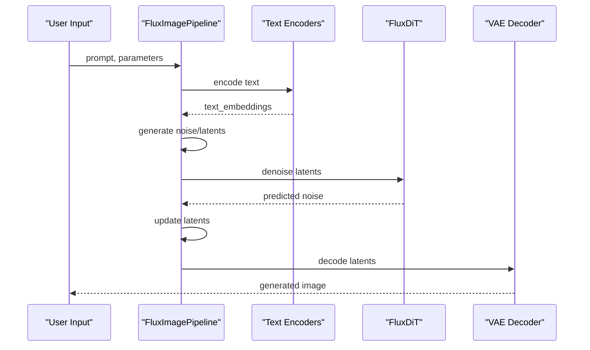
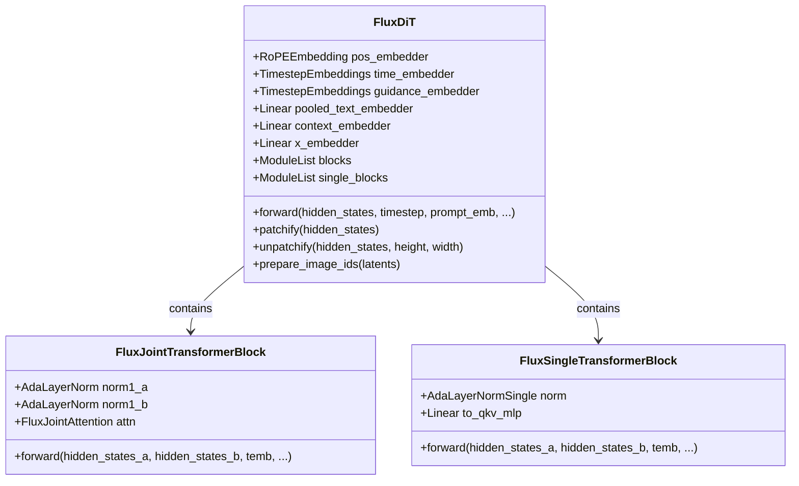
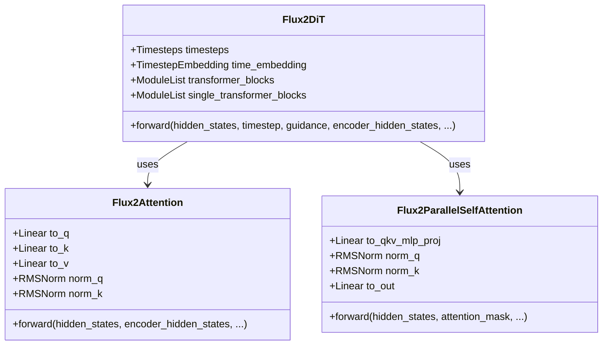
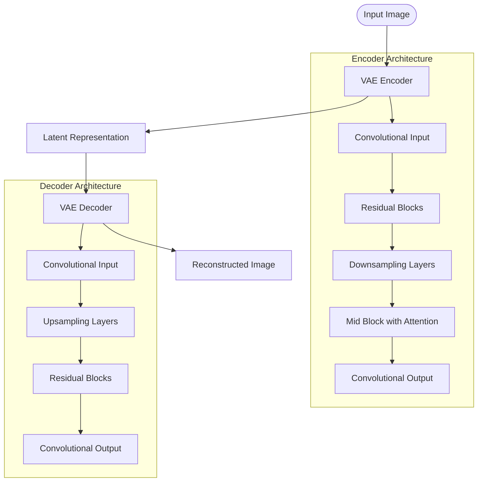
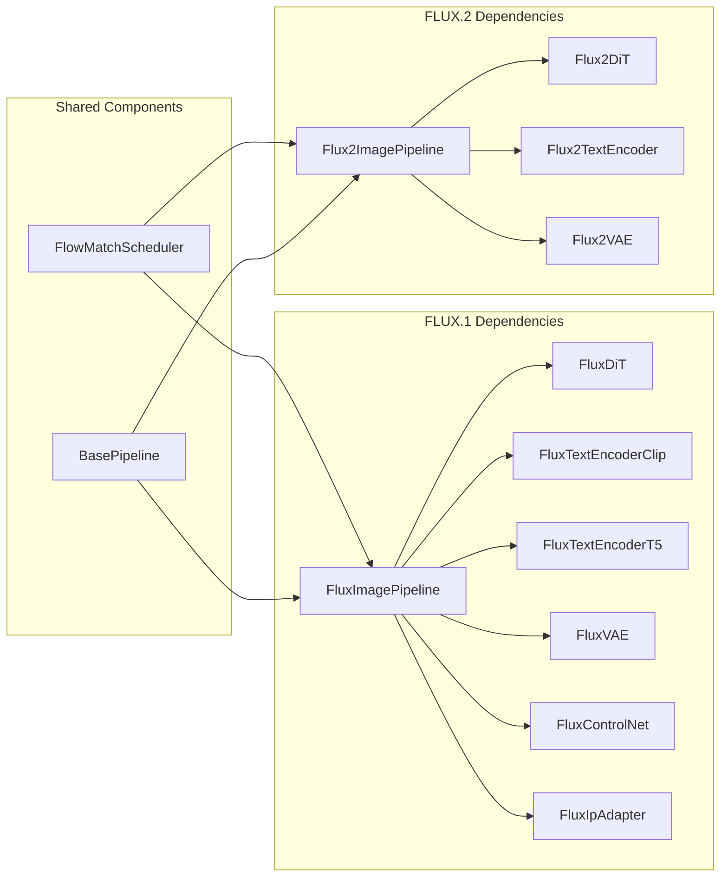

# FLUX Models API

<cite>
**Referenced Files in This Document**
- [flux_dit.py](file://diffsynth/models/flux_dit.py)
- [flux2_dit.py](file://diffsynth/models/flux2_dit.py)
- [flux_text_encoder_clip.py](file://diffsynth/models/flux_text_encoder_clip.py)
- [flux_text_encoder_t5.py](file://diffsynth/models/flux_text_encoder_t5.py)
- [flux_vae.py](file://diffsynth/models/flux_vae.py)
- [flux_controlnet.py](file://diffsynth/models/flux_controlnet.py)
- [flux_ipadapter.py](file://diffsynth/models/flux_ipadapter.py)
- [flux_image.py](file://diffsynth/pipelines/flux_image.py)
- [flux2_image.py](file://diffsynth/pipelines/flux2_image.py)
- [model_configs.py](file://diffsynth/configs/model_configs.py)
- [FLUX.1-dev.py](file://examples/flux/model_inference/FLUX.1-dev.py)
- [FLUX.2-dev.py](file://examples/flux2/model_inference/FLUX.2-dev.py)
</cite>

## Table of Contents
1. [Introduction](#introduction)
2. [Project Structure](#project-structure)
3. [Core Components](#core-components)
4. [Architecture Overview](#architecture-overview)
5. [Detailed Component Analysis](#detailed-component-analysis)
6. [Dependency Analysis](#dependency-analysis)
7. [Performance Considerations](#performance-considerations)
8. [Troubleshooting Guide](#troubleshooting-guide)
9. [Conclusion](#conclusion)
10. [Appendices](#appendices)

## Introduction
This document provides comprehensive API documentation for the FLUX model implementations, covering both FLUX.1 and FLUX.2 architectures. It details DiT components, text encoders (CLIP and T5), VAE modules, ControlNet integration, and IP-Adapter support. The guide explains class hierarchies, forward pass methods, configuration parameters, and model-specific features. It also includes complete usage examples for image generation, text encoding, latent space operations, and control mechanisms, along with guidance on model variants, parameter configurations, and performance optimization techniques.

## Project Structure
The FLUX implementation is organized into modular components:
- Model definitions for DiT, text encoders, VAE, ControlNet, and IP-Adapter
- Pipeline orchestration for FLUX.1 and FLUX.2
- Configuration registry for model variants
- Example scripts demonstrating usage patterns



**Diagram sources**
- [flux_dit.py:277-399](file://diffsynth/models/flux_dit.py#L277-L399)
- [flux2_dit.py:1-800](file://diffsynth/models/flux2_dit.py#L1-L800)
- [flux_image.py:57-178](file://diffsynth/pipelines/flux_image.py#L57-L178)
- [flux2_image.py:21-72](file://diffsynth/pipelines/flux2_image.py#L21-L72)
- [model_configs.py:319-542](file://diffsynth/configs/model_configs.py#L319-L542)

**Section sources**
- [flux_dit.py:1-399](file://diffsynth/models/flux_dit.py#L1-L399)
- [flux2_dit.py:1-800](file://diffsynth/models/flux2_dit.py#L1-L800)
- [flux_image.py:1-800](file://diffsynth/pipelines/flux_image.py#L1-L800)
- [flux2_image.py:1-596](file://diffsynth/pipelines/flux2_image.py#L1-L596)
- [model_configs.py:1-920](file://diffsynth/configs/model_configs.py#L1-L920)

## Core Components

### FLUX.1 Architecture
The FLUX.1 pipeline implements a dual-stream transformer architecture with separate joint and single transformer blocks.

#### Key Classes:
- **FluxDiT**: Main diffusion transformer with 19 joint blocks and 38 single blocks
- **FluxJointTransformerBlock**: Handles cross-attention between text and image tokens
- **FluxSingleTransformerBlock**: Processes image tokens with self-attention
- **FluxTextEncoderClip**: CLIP-based text encoder producing pooled embeddings
- **FluxTextEncoderT5**: T5 encoder for detailed text representations
- **FluxVAE**: Variational autoencoder for image compression/decompression

**Section sources**
- [flux_dit.py:277-399](file://diffsynth/models/flux_dit.py#L277-L399)
- [flux_text_encoder_clip.py:75-113](file://diffsynth/models/flux_text_encoder_clip.py#L75-L113)
- [flux_text_encoder_t5.py:5-44](file://diffsynth/models/flux_text_encoder_t5.py#L5-L44)
- [flux_vae.py:296-452](file://diffsynth/models/flux_vae.py#L296-L452)

### FLUX.2 Architecture
FLUX.2 introduces a unified transformer architecture with parallel attention and feed-forward processing.

#### Key Classes:
- **Flux2DiT**: Unified transformer with parallel self-attention blocks
- **Flux2Attention**: Attention mechanism with optional encoder-decoder connections
- **Flux2ParallelSelfAttention**: Optimized attention with fused QKV projections
- **Flux2FeedForward**: Feed-forward network with SwiGLU activation

**Section sources**
- [flux2_dit.py:435-800](file://diffsynth/models/flux2_dit.py#L435-L800)

## Architecture Overview



**Diagram sources**
- [flux_image.py:180-292](file://diffsynth/pipelines/flux_image.py#L180-L292)
- [flux_dit.py:389-399](file://diffsynth/models/flux_dit.py#L389-L399)

## Detailed Component Analysis

### FluxDiT Class
The main diffusion transformer implementing the FLUX.1 architecture with dual-stream processing.



**Diagram sources**
- [flux_dit.py:277-399](file://diffsynth/models/flux_dit.py#L277-L399)
- [flux_dit.py:108-149](file://diffsynth/models/flux_dit.py#L108-L149)
- [flux_dit.py:205-259](file://diffsynth/models/flux_dit.py#L205-L259)

**Section sources**
- [flux_dit.py:277-399](file://diffsynth/models/flux_dit.py#L277-L399)

### Flux2DiT Class
The unified transformer architecture used in FLUX.2 with optimized attention mechanisms.



**Diagram sources**
- [flux2_dit.py:435-800](file://diffsynth/models/flux2_dit.py#L435-L800)
- [flux2_dit.py:560-631](file://diffsynth/models/flux2_dit.py#L560-L631)

**Section sources**
- [flux2_dit.py:435-800](file://diffsynth/models/flux2_dit.py#L435-L800)

### Text Encoders

#### CLIP Text Encoder
Implements a simplified CLIP encoder for pooled text embeddings.

**Key Features:**
- 12-layer transformer with 12 attention heads
- QuickGELU activation function
- Positional embeddings for token sequences
- Pooled output extraction using attention weights

**Section sources**
- [flux_text_encoder_clip.py:75-113](file://diffsynth/models/flux_text_encoder_clip.py#L75-L113)

#### T5 Text Encoder
Uses the full T5 encoder model for detailed text representations.

**Key Features:**
- 24-layer T5 encoder with 4096 hidden dimensions
- 64 attention heads
- Gated-GELU activation
- Supports variable sequence lengths up to 512 tokens

**Section sources**
- [flux_text_encoder_t5.py:5-44](file://diffsynth/models/flux_text_encoder_t5.py#L5-L44)

### VAE Module
The variational autoencoder handles image compression and decompression.



**Diagram sources**
- [flux_vae.py:296-452](file://diffsynth/models/flux_vae.py#L296-L452)

**Section sources**
- [flux_vae.py:296-452](file://diffsynth/models/flux_vae.py#L296-L452)

### ControlNet Integration
ControlNet extension enables conditional generation with various control signals.

**Supported Control Types:**
- Canny edge detection
- Depth estimation
- Pose estimation
- Semantic segmentation
- Inpainting masks

**Section sources**
- [flux_controlnet.py:61-156](file://diffsynth/models/flux_controlnet.py#L61-L156)

### IP-Adapter Support
Image Prompt Adapter allows style transfer and content conditioning from reference images.

**Key Components:**
- SigLIP vision encoder for image understanding
- MLP projection layer for cross-attention injection
- Scale parameter for controlling adapter strength

**Section sources**
- [flux_ipadapter.py:66-89](file://diffsynth/models/flux_ipadapter.py#L66-L89)

## Dependency Analysis



**Diagram sources**
- [flux_image.py:57-178](file://diffsynth/pipelines/flux_image.py#L57-L178)
- [flux2_image.py:21-72](file://diffsynth/pipelines/flux2_image.py#L21-L72)

**Section sources**
- [flux_image.py:57-178](file://diffsynth/pipelines/flux_image.py#L57-L178)
- [flux2_image.py:21-72](file://diffsynth/pipelines/flux2_image.py#L21-L72)

## Performance Considerations

### Memory Optimization Techniques
- **Gradient Checkpointing**: Reduces memory usage during training by recomputing activations
- **VRAM Management**: Dynamic loading/unloading of models based on availability
- **Tiled Processing**: Processes large images in chunks to avoid memory overflow
- **Mixed Precision**: Uses bfloat16 for reduced memory footprint while maintaining quality

### Inference Optimization
- **Attention Backends**: Utilizes optimized attention implementations
- **Model Compilation**: Compiles frequently called models for faster execution
- **Batch Processing**: Efficient batch handling for multiple inputs
- **Caching**: Reuses computed embeddings when possible

### Parameter Tuning Guidelines
- **num_inference_steps**: Balance between quality and speed (typically 20-50 steps)
- **cfg_scale**: Classifier-free guidance strength (typically 1.0-7.0)
- **tiled mode**: Enable for high-resolution image generation
- **seed**: Set for reproducible results

## Troubleshooting Guide

### Common Issues and Solutions

#### Memory Errors
- **Symptom**: CUDA out of memory errors
- **Solutions**: 
  - Enable tiled processing mode
  - Reduce image resolution
  - Use lower precision (bfloat16)
  - Enable gradient checkpointing

#### Quality Issues
- **Symptom**: Poor image quality or artifacts
- **Solutions**:
  - Increase num_inference_steps
  - Adjust cfg_scale parameter
  - Check text encoder settings
  - Verify input image preprocessing

#### Performance Problems
- **Symptom**: Slow inference times
- **Solutions**:
  - Enable model compilation
  - Use appropriate attention backend
  - Optimize batch sizes
  - Monitor GPU utilization

**Section sources**
- [flux_image.py:180-292](file://diffsynth/pipelines/flux_image.py#L180-L292)
- [flux2_image.py:74-139](file://diffsynth/pipelines/flux2_image.py#L74-L139)

## Conclusion
The FLUX model implementations provide a comprehensive framework for state-of-the-art image generation. FLUX.1 offers a proven dual-stream architecture with extensive customization options through ControlNet and IP-Adapter. FLUX.2 introduces architectural improvements with unified transformers and optimized attention mechanisms. Both pipelines support advanced features like text-to-image generation, image editing, and conditional generation through various control signals.

The modular design allows for easy extension and customization, while the comprehensive configuration system supports numerous model variants and use cases. Performance optimizations ensure efficient operation across different hardware configurations, making these models accessible for both research and production applications.

## Appendices

### Usage Examples

#### Basic FLUX.1 Generation
```python
from diffsynth.pipelines.flux_image import FluxImagePipeline, ModelConfig

pipe = FluxImagePipeline.from_pretrained(
    torch_dtype=torch.bfloat16,
    device="cuda",
    model_configs=[
        ModelConfig(model_id="black-forest-labs/FLUX.1-dev", origin_file_pattern="flux1-dev.safetensors"),
        ModelConfig(model_id="black-forest-labs/FLUX.1-dev", origin_file_pattern="text_encoder/model.safetensors"),
        ModelConfig(model_id="black-forest-labs/FLUX.1-dev", origin_file_pattern="text_encoder_2/*.safetensors"),
        ModelConfig(model_id="black-forest-labs/FLUX.1-dev", origin_file_pattern="ae.safetensors"),
    ],
)

image = pipe(prompt="A beautiful landscape", seed=0)
image.save("output.jpg")
```

#### FLUX.2 with Editing Capabilities
```python
from diffsynth.pipelines.flux2_image import Flux2ImagePipeline, ModelConfig
from PIL import Image

pipe = Flux2ImagePipeline.from_pretrained(
    torch_dtype=torch.bfloat16,
    device="cuda",
    model_configs=[
        ModelConfig(model_id="black-forest-labs/FLUX.2-dev", origin_file_pattern="text_encoder/*.safetensors"),
        ModelConfig(model_id="black-forest-labs/FLUX.2-dev", origin_file_pattern="transformer/*.safetensors"),
        ModelConfig(model_id="black-forest-labs/FLUX.2-dev", origin_file_pattern="vae/diffusion_pytorch_model.safetensors"),
    ],
    tokenizer_config=ModelConfig(model_id="black-forest-labs/FLUX.2-dev", origin_file_pattern="tokenizer/"),
)

# Text-to-image generation
image = pipe(prompt="Realistic macro photograph", seed=42, num_inference_steps=50)

# Image editing
edit_image = [Image.open("input.jpg")]
edited_image = pipe(prompt="Transform to anime style", edit_image=edit_image, num_inference_steps=50)
```

**Section sources**
- [FLUX.1-dev.py:1-27](file://examples/flux/model_inference/FLUX.1-dev.py#L1-L27)
- [FLUX.2-dev.py:1-32](file://examples/flux2/model_inference/FLUX.2-dev.py#L1-L32)

### Configuration Parameters Reference

#### FLUX.1 Pipeline Parameters
- **prompt**: Text description for image generation
- **negative_prompt**: Text describing what to avoid
- **cfg_scale**: Classifier-free guidance scale (1.0-7.0)
- **num_inference_steps**: Number of denoising steps (20-50)
- **height/width**: Output image dimensions (multiple of 16)
- **seed**: Random seed for reproducibility
- **tiled**: Enable tiled processing for large images

#### FLUX.2 Pipeline Parameters
- **prompt**: Text description for generation
- **edit_image**: Optional reference image for editing
- **embedded_guidance**: Guidance strength for editing tasks
- **num_inference_steps**: Denoising steps (typically 20-50)
- **initial_noise**: Custom initial noise tensor

**Section sources**
- [flux_image.py:180-292](file://diffsynth/pipelines/flux_image.py#L180-L292)
- [flux2_image.py:74-139](file://diffsynth/pipelines/flux2_image.py#L74-L139)