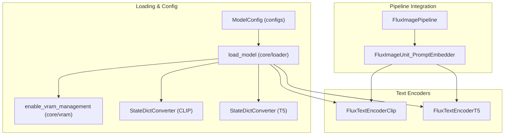
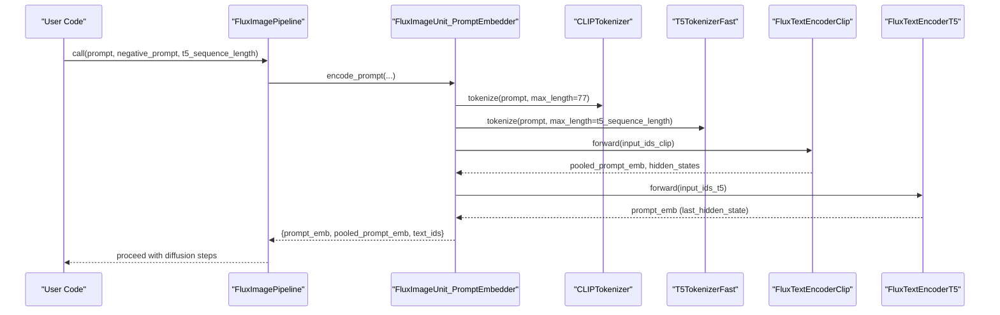
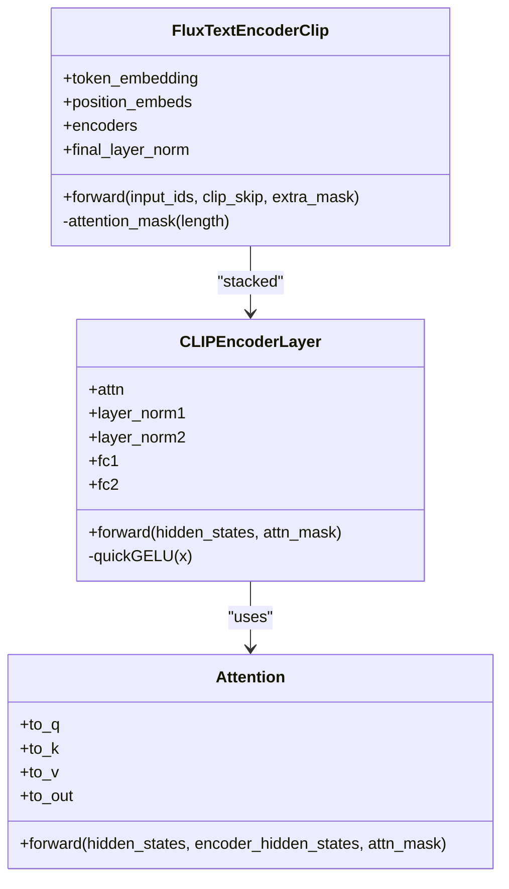
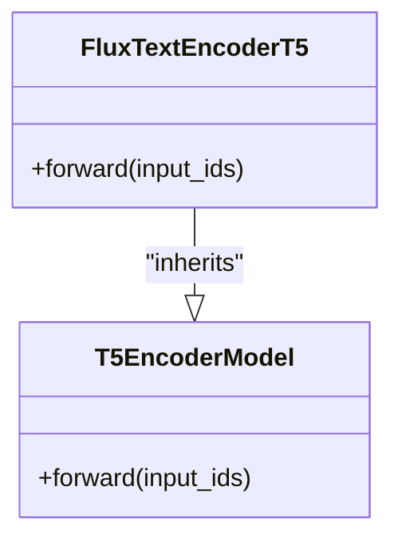
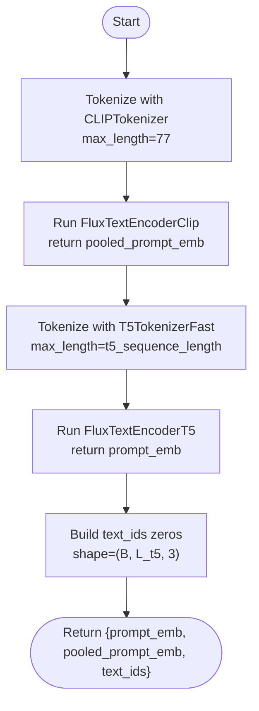
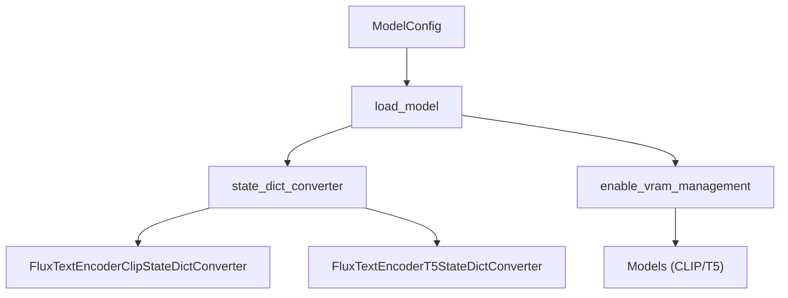

# FLUX Text Encoders API

<cite>
**Referenced Files in This Document**
- [flux_text_encoder_clip.py](file://diffsynth/models/flux_text_encoder_clip.py)
- [flux_text_encoder_t5.py](file://diffsynth/models/flux_text_encoder_t5.py)
- [flux_image.py](file://diffsynth/pipelines/flux_image.py)
- [model_configs.py](file://diffsynth/configs/model_configs.py)
- [flux_text_encoder_clip_state_dict_converter.py](file://diffsynth/utils/state_dict_converters/flux_text_encoder_clip.py)
- [flux_text_encoder_t5_state_dict_converter.py](file://diffsynth/utils/state_dict_converters/flux_text_encoder_t5.py)
- [model_loader.py](file://diffsynth/core/loader/model.py)
- [layers.py](file://diffsynth/core/vram/layers.py)
- [FLUX.1-dev.py](file://examples/flux/model_inference/FLUX.1-dev.py)
</cite>

## Table of Contents
1. [Introduction](#introduction)
2. [Project Structure](#project-structure)
3. [Core Components](#core-components)
4. [Architecture Overview](#architecture-overview)
5. [Detailed Component Analysis](#detailed-component-analysis)
6. [Dependency Analysis](#dependency-analysis)
7. [Performance Considerations](#performance-considerations)
8. [Troubleshooting Guide](#troubleshooting-guide)
9. [Conclusion](#conclusion)
10. [Appendices](#appendices)

## Introduction
This document provides comprehensive API documentation for the FLUX text encoder implementations used in the DiffSynth project, focusing on both CLIP and T5 encoders. It explains their architectures, tokenization processes, embedding generation, class interfaces, forward methods, configuration options, and integration with the main image generation pipeline. It also includes usage examples for text encoding, prompt processing, pooled embeddings extraction, custom preprocessing pipelines, performance optimization, batch processing capabilities, and memory management strategies.

## Project Structure
The FLUX text encoders are implemented as standalone modules and integrated into the FluxImagePipeline through a modular unit system. The CLIP encoder is a compact transformer-style model with attention and MLP blocks, while the T5 encoder wraps a pre-trained T5EncoderModel from Transformers. Both are loaded via a unified model loader that supports VRAM management and state dict conversion.

**Diagram sources**
- [flux_text_encoder_clip.py:75-113](file://diffsynth/models/flux_text_encoder_clip.py#L75-L113)
- [flux_text_encoder_t5.py:5-44](file://diffsynth/models/flux_text_encoder_t5.py#L5-L44)
- [flux_image.py:336-395](file://diffsynth/pipelines/flux_image.py#L336-L395)
- [model_configs.py:335-347](file://diffsynth/configs/model_configs.py#L335-L347)
- [model_loader.py:11-65](file://diffsynth/core/loader/model.py#L11-L65)
- [layers.py:468-479](file://diffsynth/core/vram/layers.py#L468-L479)
- [flux_text_encoder_clip_state_dict_converter.py:1-32](file://diffsynth/utils/state_dict_converters/flux_text_encoder_clip.py#L1-L32)
- [flux_text_encoder_t5_state_dict_converter.py:1-4](file://diffsynth/utils/state_dict_converters/flux_text_encoder_t5.py#L1-L4)

**Section sources**
- [flux_text_encoder_clip.py:75-113](file://diffsynth/models/flux_text_encoder_clip.py#L75-L113)
- [flux_text_encoder_t5.py:5-44](file://diffsynth/models/flux_text_encoder_t5.py#L5-L44)
- [flux_image.py:336-395](file://diffsynth/pipelines/flux_image.py#L336-L395)
- [model_configs.py:335-347](file://diffsynth/configs/model_configs.py#L335-L347)
- [model_loader.py:11-65](file://diffsynth/core/loader/model.py#L11-L65)
- [layers.py:468-479](file://diffsynth/core/vram/layers.py#L468-L479)
- [flux_text_encoder_clip_state_dict_converter.py:1-32](file://diffsynth/utils/state_dict_converters/flux_text_encoder_clip.py#L1-L32)
- [flux_text_encoder_t5_state_dict_converter.py:1-4](file://diffsynth/utils/state_dict_converters/flux_text_encoder_t5.py#L1-L4)

## Core Components
- FluxTextEncoderClip: A lightweight CLIP-like text encoder with token embeddings, fixed positional embeddings, stacked encoder layers, and an attention mask. It returns pooled embeddings and hidden states, supporting clip_skip to select intermediate layer outputs.
- FluxTextEncoderT5: A wrapper around T5EncoderModel configured for FLUX’s requirements, returning last_hidden_state as prompt embeddings.
- FluxImageUnit_PromptEmbedder: Pipeline unit that tokenizes prompts using CLIPTokenizer and T5TokenizerFast, runs both encoders, and produces prompt_emb (T5), pooled_prompt_emb (CLIP), and text_ids (placeholder).

Key responsibilities:
- Tokenization: Fixed max_length for CLIP (77) and configurable t5_sequence_length for T5.
- Embedding generation: CLIP pooled embeddings via argmax over input_ids; T5 sequence embeddings via last_hidden_state.
- Integration: Outputs fed into DiT conditioning paths within the pipeline.

**Section sources**
- [flux_text_encoder_clip.py:75-113](file://diffsynth/models/flux_text_encoder_clip.py#L75-L113)
- [flux_text_encoder_t5.py:5-44](file://diffsynth/models/flux_text_encoder_t5.py#L5-L44)
- [flux_image.py:336-395](file://diffsynth/pipelines/flux_image.py#L336-L395)

## Architecture Overview
The FLUX text encoding pipeline integrates two complementary encoders:
- CLIP encoder provides a single pooled vector per prompt, suitable for global guidance.
- T5 encoder provides dense sequence embeddings capturing detailed token-level semantics.

**Diagram sources**
- [flux_image.py:336-395](file://diffsynth/pipelines/flux_image.py#L336-L395)
- [flux_text_encoder_clip.py:75-113](file://diffsynth/models/flux_text_encoder_clip.py#L75-L113)
- [flux_text_encoder_t5.py:5-44](file://diffsynth/models/flux_text_encoder_t5.py#L5-L44)

## Detailed Component Analysis

### FluxTextEncoderClip
- Class interface:
  - __init__(embed_dim=768, vocab_size=49408, max_position_embeddings=77, num_encoder_layers=12, encoder_intermediate_size=3072)
  - forward(input_ids, clip_skip=2, extra_mask=None) -> (pooled_embeds, hidden_states)
- Architecture:
  - Token embedding + fixed positional embeddings
  - Stacked encoder layers with self-attention and MLP
  - Attention mask is causal/triangular; optional extra_mask can zero out positions
  - Final LayerNorm and pooled embedding selection via argmax over input_ids
- Configuration options:
  - embed_dim, vocab_size, max_position_embeddings, num_encoder_layers, encoder_intermediate_size
  - clip_skip selects which layer output becomes hidden_states before final norm
- Data flow:
  - input_ids -> token_embedding -> add position_embeds -> apply attn_mask -> stack encoder layers -> final_layer_norm -> pooled_embeds by selecting tokens where input_ids has highest probability (argmax)

**Diagram sources**
- [flux_text_encoder_clip.py:41-73](file://diffsynth/models/flux_text_encoder_clip.py#L41-L73)
- [flux_text_encoder_clip.py:75-113](file://diffsynth/models/flux_text_encoder_clip.py#L75-L113)

**Section sources**
- [flux_text_encoder_clip.py:75-113](file://diffsynth/models/flux_text_encoder_clip.py#L75-L113)

### FluxTextEncoderT5
- Class interface:
  - __init__() configures T5Config with specific hyperparameters (d_model=4096, num_layers=24, num_heads=64, vocab_size=32128, etc.)
  - forward(input_ids) -> prompt_emb (last_hidden_state)
- Architecture:
  - Inherits from T5EncoderModel; uses standard T5 encoder layers
  - Returns dense sequence embeddings for each token
- Configuration options:
  - All T5Config fields are set explicitly in __init__
- Data flow:
  - input_ids -> T5EncoderModel.forward -> last_hidden_state

**Diagram sources**
- [flux_text_encoder_t5.py:5-44](file://diffsynth/models/flux_text_encoder_t5.py#L5-L44)

**Section sources**
- [flux_text_encoder_t5.py:5-44](file://diffsynth/models/flux_text_encoder_t5.py#L5-L44)

### Prompt Embedding Pipeline Unit
- Responsibilities:
  - Tokenize prompts using CLIPTokenizer (max_length=77) and T5TokenizerFast (max_length=t5_sequence_length)
  - Run encoders to obtain pooled_prompt_emb (CLIP) and prompt_emb (T5)
  - Generate placeholder text_ids tensor aligned with prompt_emb shape
- Integration:
  - Used by FluxImagePipeline during prompt processing
  - Supports separate CFG handling for positive/negative prompts

**Diagram sources**
- [flux_image.py:336-395](file://diffsynth/pipelines/flux_image.py#L336-L395)

**Section sources**
- [flux_image.py:336-395](file://diffsynth/pipelines/flux_image.py#L336-L395)

## Dependency Analysis
- Model loading:
  - ModelConfig entries define model_class and state_dict_converter for both encoders
  - load_model handles instantiation, state dict conversion, device/dtype placement, and VRAM management
- State dict converters:
  - CLIP converter renames keys to match internal module names
  - T5 converter maps shared.weight to encoder.embed_tokens.weight
- VRAM management:
  - enable_vram_management wraps models for dynamic offloading/onloading based on computation phases

**Diagram sources**
- [model_configs.py:335-347](file://diffsynth/configs/model_configs.py#L335-L347)
- [model_loader.py:11-65](file://diffsynth/core/loader/model.py#L11-L65)
- [flux_text_encoder_clip_state_dict_converter.py:1-32](file://diffsynth/utils/state_dict_converters/flux_text_encoder_clip.py#L1-L32)
- [flux_text_encoder_t5_state_dict_converter.py:1-4](file://diffsynth/utils/state_dict_converters/flux_text_encoder_t5.py#L1-L4)
- [layers.py:468-479](file://diffsynth/core/vram/layers.py#L468-L479)

**Section sources**
- [model_configs.py:335-347](file://diffsynth/configs/model_configs.py#L335-L347)
- [model_loader.py:11-65](file://diffsynth/core/loader/model.py#L11-L65)
- [flux_text_encoder_clip_state_dict_converter.py:1-32](file://diffsynth/utils/state_dict_converters/flux_text_encoder_clip.py#L1-L32)
- [flux_text_encoder_t5_state_dict_converter.py:1-4](file://diffsynth/utils/state_dict_converters/flux_text_encoder_t5.py#L1-L4)
- [layers.py:468-479](file://diffsynth/core/vram/layers.py#L468-L479)

## Performance Considerations
- Batch processing:
  - Both encoders accept batched input_ids; ensure consistent sequence lengths across batch items
  - T5 tokenizer supports variable-length sequences; padding handled by tokenizer
- Memory management:
  - Use enable_vram_management to dynamically move parameters between CPU/GPU/disk based on computation phases
  - For large T5 encoder, consider disk offloading or mixed precision (bfloat16)
- Optimization tips:
  - Reuse tokenized inputs when possible to avoid repeated tokenization overhead
  - Set clip_skip appropriately to balance quality and speed
  - Avoid unnecessary device transfers; keep tensors on the same device as encoders

[No sources needed since this section provides general guidance]

## Troubleshooting Guide
- Common issues:
  - Mismatched sequence lengths: Ensure t5_sequence_length matches tokenizer expectations
  - Device mismatches: Move input_ids to the same device as encoders
  - VRAM errors: Enable VRAM management or reduce batch size
- Debugging utilities:
  - Check model loading logs for state dict conversion errors
  - Verify tokenizer configurations (vocab sizes, special tokens)
  - Inspect attention masks if using extra_mask in CLIP encoder

**Section sources**
- [model_loader.py:11-65](file://diffsynth/core/loader/model.py#L11-L65)
- [flux_text_encoder_clip.py:75-113](file://diffsynth/models/flux_text_encoder_clip.py#L75-L113)

## Conclusion
The FLUX text encoder implementation combines a compact CLIP encoder for pooled embeddings and a powerful T5 encoder for dense sequence representations. Integrated through a modular pipeline, they provide flexible and efficient text conditioning for image generation. With robust model loading, VRAM management, and clear APIs, users can easily customize preprocessing, optimize performance, and extend functionality.

[No sources needed since this section summarizes without analyzing specific files]

## Appendices

### Usage Examples
- Basic text encoding:
  - Load pipeline with model configs for CLIP and T5 encoders
  - Call pipeline with prompt and negative_prompt
  - Access prompt_emb and pooled_prompt_emb from pipeline units
- Custom preprocessing:
  - Implement custom tokenization logic in PromptEmbedder
  - Modify max_length parameters for different use cases
  - Add attention masks for selective token masking

**Section sources**
- [FLUX.1-dev.py:1-27](file://examples/flux/model_inference/FLUX.1-dev.py#L1-L27)
- [flux_image.py:336-395](file://diffsynth/pipelines/flux_image.py#L336-L395)