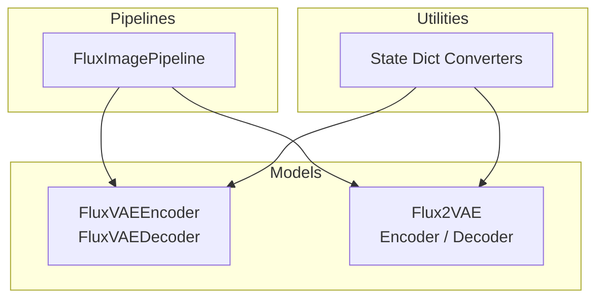
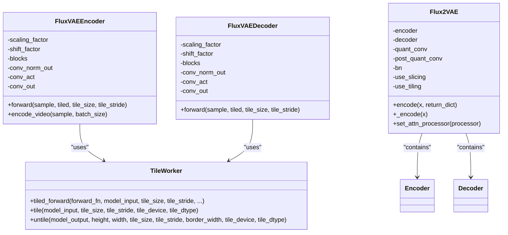
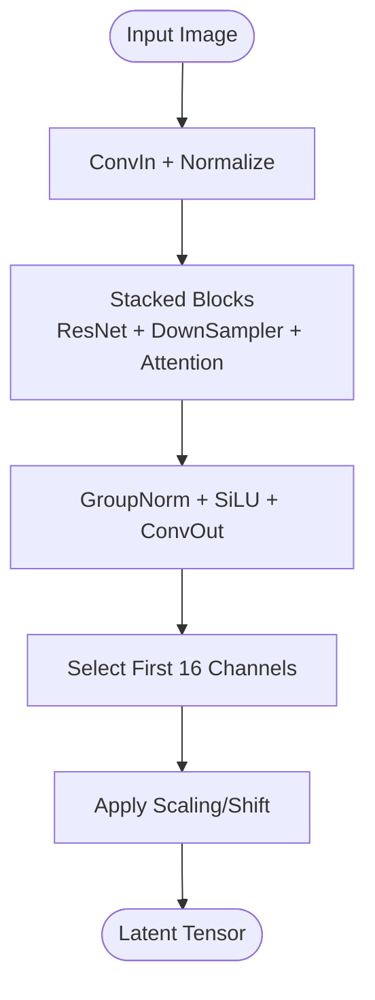
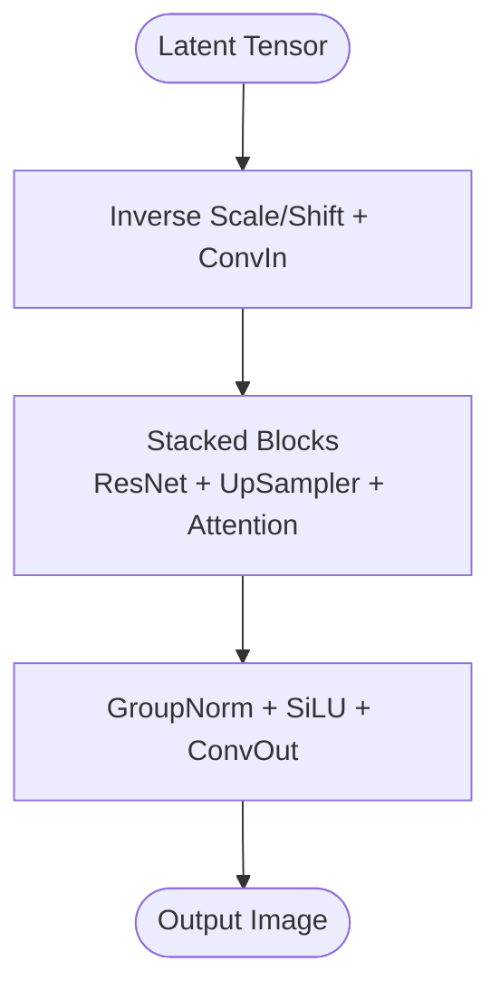
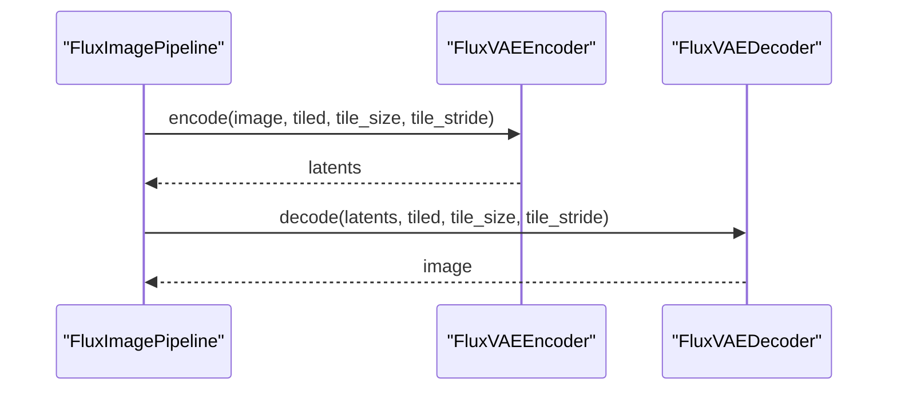
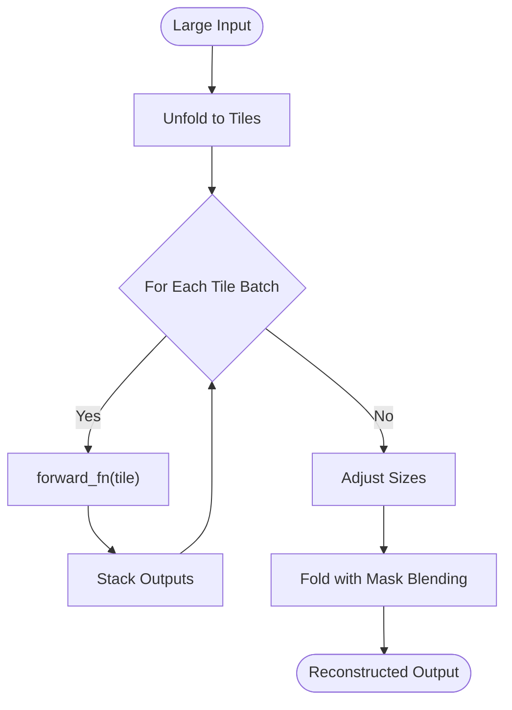
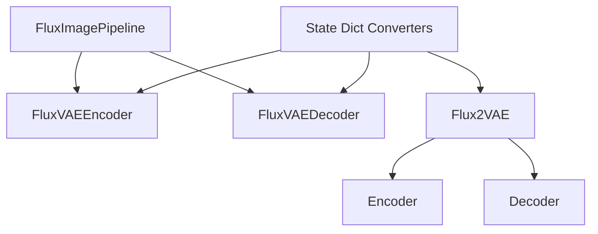

# FLUX VAE API

<cite>
**Referenced Files in This Document**
- [flux_vae.py](file://diffsynth/models/flux_vae.py)
- [flux2_vae.py](file://diffsynth/models/flux2_vae.py)
- [flux_image.py](file://diffsynth/pipelines/flux_image.py)
- [flux_vae_state_dict_converter.py](file://diffsynth/utils/state_dict_converters/flux_vae.py)
</cite>

## Table of Contents
1. [Introduction](#introduction)
2. [Project Structure](#project-structure)
3. [Core Components](#core-components)
4. [Architecture Overview](#architecture-overview)
5. [Detailed Component Analysis](#detailed-component-analysis)
6. [Dependency Analysis](#dependency-analysis)
7. [Performance Considerations](#performance-considerations)
8. [Troubleshooting Guide](#troubleshooting-guide)
9. [Conclusion](#conclusion)
10. [Appendices](#appendices)

## Introduction
This document provides detailed API documentation for the FLUX Variational Autoencoder (VAE) implementation used within the DiffSynth framework. It covers two primary implementations:
- The original FLUX VAE encoder and decoder with tiled inference support for memory efficiency.
- The FLUX 2 VAE with a more configurable architecture, including optional quantization convolutions and gradient checkpointing.

The documentation explains the VAE architecture (encoder/decoder networks), latent space operations, reconstruction loss usage, class interfaces, configuration parameters, and training objectives. It also includes practical usage examples for encoding images to latents, decoding latents to images, and integrating with diffusion pipelines. Memory-efficient tiling and quantization support are highlighted, along with guidance on customizing the VAE components.

## Project Structure
The FLUX VAE-related code is organized under the models and pipelines modules:
- Models:
  - Original FLUX VAE: encoder and decoder with tiled forward utilities.
  - FLUX 2 VAE: a configurable VAE with Encoder/Decoder blocks, quantization layers, and BN normalization.
- Pipelines:
  - FLUX image pipeline that integrates the VAE encoder/decoder into the full generation flow.
- Utilities:
  - State dict converters for loading pretrained weights from different sources.

**Diagram sources**
- [flux_vae.py](file://diffsynth/models/flux_vae.py)
- [flux2_vae.py](file://diffsynth/models/flux2_vae.py)
- [flux_image.py](file://diffsynth/pipelines/flux_image.py)
- [flux_vae_state_dict_converter.py](file://diffsynth/utils/state_dict_converters/flux_vae.py)

**Section sources**
- [flux_vae.py](file://diffsynth/models/flux_vae.py)
- [flux2_vae.py](file://diffsynth/models/flux2_vae.py)
- [flux_image.py](file://diffsynth/pipelines/flux_image.py)
- [flux_vae_state_dict_converter.py](file://diffsynth/utils/state_dict_converters/flux_vae.py)

## Core Components
- FluxVAEEncoder: Encodes RGB images into latent representations using a stack of ResNet blocks, downsamplers, and an attention block. Supports tiled inference via TileWorker for memory efficiency.
- FluxVAEDecoder: Decodes latent tensors back to RGB images using ResNet blocks, upsamplers, and an attention block. Also supports tiled inference.
- Flux2VAE: A configurable VAE with Encoder and Decoder modules, optional quant_conv/post_quant_conv, batch normalization, and gradient checkpointing. Provides encode/decode methods and tiling/slicing flags.
- TileWorker: Utility for tiling large inputs into smaller patches, performing inference per tile, and reassembling outputs with overlap blending.

Key responsibilities:
- Encoding images to latents with scaling/shift normalization.
- Decoding latents to images with inverse scaling/shift.
- Tiled inference to reduce peak VRAM usage.
- Optional video encoding by batching temporal frames.

**Section sources**
- [flux_vae.py](file://diffsynth/models/flux_vae.py)
- [flux2_vae.py](file://diffsynth/models/flux2_vae.py)

## Architecture Overview
The FLUX VAE architecture consists of:
- Encoder path: Input image -> ConvIn -> multiple DownEncoderBlock2D stages (ResNet + Downsampling) -> MidBlock (ResNet + Attention) -> Norm/Act -> ConvOut -> Latent.
- Decoder path: Latent -> ConvIn -> multiple UpDecoderBlock2D stages (ResNet + Upsampling) -> MidBlock (ResNet + Attention) -> Norm/Act -> ConvOut -> Output image.

FLUX 2 VAE adds:
- Configurable down/up block types and channels.
- Optional quant_conv and post_quant_conv for quantization-aware flows.
- BatchNorm after patching and optional gradient checkpointing.

**Diagram sources**
- [flux_vae.py](file://diffsynth/models/flux_vae.py)
- [flux2_vae.py](file://diffsynth/models/flux2_vae.py)

## Detailed Component Analysis

### FluxVAEEncoder
- Purpose: Encode RGB images into compressed latent representations suitable for diffusion models.
- Key parameters:
  - use_conv_attention: Switch between convolutional or linear attention blocks.
  - scaling_factor, shift_factor: Normalization constants applied before/after encoding.
- Forward method:
  - Preprocess input via ConvIn.
  - Pass through stacked blocks (ResNet + Downsampler + Attention).
  - Post-process with GroupNorm, SiLU, and ConvOut; select first 16 channels and apply inverse scaling/shift.
- Tiled inference:
  - tiled_forward delegates to TileWorker.tiled_forward for memory-efficient processing.
- Video encoding:
  - encode_video processes temporal frames in batches and concatenates results.

**Diagram sources**
- [flux_vae.py](file://diffsynth/models/flux_vae.py)

**Section sources**
- [flux_vae.py](file://diffsynth/models/flux_vae.py)

### FluxVAEDecoder
- Purpose: Decode latent tensors back to RGB images.
- Key parameters:
  - use_conv_attention: Switch between convolutional or linear attention blocks.
  - scaling_factor, shift_factor: Inverse normalization constants applied before decoding.
- Forward method:
  - Preprocess latent via scaling/shift and ConvIn.
  - Pass through stacked blocks (ResNet + UpSampler + Attention).
  - Post-process with GroupNorm, SiLU, and ConvOut to produce RGB image.
- Tiled inference:
  - tiled_forward uses TileWorker.tiled_forward to handle large inputs efficiently.

**Diagram sources**
- [flux_vae.py](file://diffsynth/models/flux_vae.py)

**Section sources**
- [flux_vae.py](file://diffsynth/models/flux_vae.py)

### Flux2VAE
- Purpose: Configurable VAE with Encoder/Decoder, optional quantization convolutions, and BN normalization.
- Key parameters:
  - in_channels, out_channels: Input/output channel counts.
  - down_block_types, up_block_types: Block type sequences.
  - block_out_channels: Channel progression.
  - act_fn: Activation function string.
  - latent_channels: Latent dimensionality.
  - use_quant_conv, use_post_quant_conv: Enable quantization-aware layers.
  - force_upcast: Force float32 for high-resolution stability.
  - mid_block_add_attention: Include attention in mid-blocks.
- Methods:
  - encode: Encode images to latents with optional slicing/tiling.
  - _encode: Internal encoding path with optional quant_conv.
  - set_attn_processor: Configure attention processors across the model.
  - attn_processors: Retrieve all attention processors.

**Diagram sources**
- [flux_image.py](file://diffsynth/pipelines/flux_image.py)
- [flux_vae.py](file://diffsynth/models/flux_vae.py)

**Section sources**
- [flux2_vae.py](file://diffsynth/models/flux2_vae.py)
- [flux_image.py](file://diffsynth/pipelines/flux_image.py)

### TileWorker
- Purpose: Provide memory-efficient tiled inference for large inputs.
- Key methods:
  - tile: Unfold input into overlapping tiles.
  - tiled_inference: Iterate over tiles, call forward_fn per tile batch.
  - untile: Reassemble outputs using Fold with overlap blending.
  - tiled_forward: Orchestrates tiling, inference, resizing, and untiling.

**Diagram sources**
- [flux_vae.py](file://diffsynth/models/flux_vae.py)

**Section sources**
- [flux_vae.py](file://diffsynth/models/flux_vae.py)

## Dependency Analysis
- FluxImagePipeline depends on FluxVAEEncoder and FluxVAEDecoder for image-to-latent and latent-to-image conversions during diffusion sampling.
- Flux2VAE encapsulates Encoder and Decoder modules and provides higher-level encode/decode APIs.
- State dict converters map pretrained weights from external formats to the internal module naming conventions.

**Diagram sources**
- [flux_image.py](file://diffsynth/pipelines/flux_image.py)
- [flux_vae.py](file://diffsynth/models/flux_vae.py)
- [flux2_vae.py](file://diffsynth/models/flux2_vae.py)
- [flux_vae_state_dict_converter.py](file://diffsynth/utils/state_dict_converters/flux_vae.py)

**Section sources**
- [flux_image.py](file://diffsynth/pipelines/flux_image.py)
- [flux_vae.py](file://diffsynth/models/flux_vae.py)
- [flux2_vae.py](file://diffsynth/models/flux2_vae.py)
- [flux_vae_state_dict_converter.py](file://diffsynth/utils/state_dict_converters/flux_vae.py)

## Performance Considerations
- Tiled inference: Use tiled=True with appropriate tile_size and tile_stride to reduce VRAM usage for large images.
- Gradient checkpointing: Available in Flux2VAE to trade compute for memory during training.
- Quantization support: Flux2VAE supports quant_conv and post_quant_conv for quantization-aware workflows.
- Attention processors: Flux2VAE allows setting custom attention processors for optimized attention computation.
- Video encoding: FluxVAEEncoder.encode_video processes frames in batches to manage memory.

[No sources needed since this section provides general guidance]

## Troubleshooting Guide
- Shape mismatches: Ensure input images are divisible by the pipeline's height/width division factors (typically 16).
- VRAM errors: Enable tiled inference or reduce tile_size/tile_stride to lower memory footprint.
- Weight loading issues: Use state dict converters to map external weights to internal naming conventions.
- Attention processor errors: Verify compatibility when setting custom attention processors in Flux2VAE.

**Section sources**
- [flux_image.py](file://diffsynth/pipelines/flux_image.py)
- [flux_vae_state_dict_converter.py](file://diffsynth/utils/state_dict_converters/flux_vae.py)

## Conclusion
The FLUX VAE implementations provide robust and flexible tools for encoding images to latents and decoding them back to images. The original FLUX VAE emphasizes tiled inference for memory efficiency, while Flux2VAE offers configurability and quantization support. Integration with the FluxImagePipeline enables seamless usage in diffusion-based image generation workflows. Users can customize components, optimize performance, and extend functionality based on their needs.

[No sources needed since this section summarizes without analyzing specific files]

## Appendices

### Usage Examples
- Image encoding to latents:
  - Use FluxVAEEncoder.forward with tiled=True for large images.
  - Example reference: [flux_image.py](file://diffsynth/pipelines/flux_image.py)
- Latent decoding to images:
  - Use FluxVAEDecoder.forward with tiled=True for efficient decoding.
  - Example reference: [flux_image.py](file://diffsynth/pipelines/flux_image.py)
- Custom VAE modifications:
  - Adjust block configurations in Flux2VAE constructor.
  - Replace attention blocks in FluxVAEEncoder/FluxVAEDecoder by modifying use_conv_attention.
  - Example reference: [flux2_vae.py](file://diffsynth/models/flux2_vae.py), [flux_vae.py](file://diffsynth/models/flux_vae.py)

**Section sources**
- [flux_image.py](file://diffsynth/pipelines/flux_image.py)
- [flux2_vae.py](file://diffsynth/models/flux2_vae.py)
- [flux_vae.py](file://diffsynth/models/flux_vae.py)