# General Modules API

<cite>
**Referenced Files in This Document**
- [general_modules.py](file://diffsynth/models/general_modules.py)
- [tiler.py](file://diffsynth/models/tiler.py)
- [wav2vec.py](file://diffsynth/models/wav2vec.py)
- [step1x_connector.py](file://diffsynth/models/step1x_connector.py)
- [attention.py](file://diffsynth/core/attention/attention.py)
- [layers.py](file://diffsynth/core/vram/layers.py)
- [disk_map.py](file://diffsynth/core/vram/disk_map.py)
- [npu_compatible_device.py](file://diffsynth/core/device/npu_compatible_device.py)
- [gradient_checkpoint.py](file://diffsynth/core/gradient/gradient_checkpoint.py)
- [operators.py](file://diffsynth/core/data/operators.py)
- [audio.py](file://diffsynth/utils/data/audio.py)
- [flux_text_encoder_clip.py](file://diffsynth/models/flux_text_encoder_clip.py)
- [flux_text_encoder_t5.py](file://diffsynth/models/flux_text_encoder_t5.py)
</cite>

## Table of Contents
1. [Introduction](#introduction)
2. [Project Structure](#project-structure)
3. [Core Components](#core-components)
4. [Architecture Overview](#architecture-overview)
5. [Detailed Component Analysis](#detailed-component-analysis)
6. [Dependency Analysis](#dependency-analysis)
7. [Performance Considerations](#performance-considerations)
8. [Troubleshooting Guide](#troubleshooting-guide)
9. [Conclusion](#conclusion)
10. [Appendices](#appendices)

## Introduction
This document provides a comprehensive API reference for shared model components and utility modules used across multiple model families in the repository. It focuses on:
- General building blocks (time embeddings, normalization layers, MLPs, attention utilities)
- Tiling mechanisms for memory-efficient inference
- Audio processing modules (Wav2Vec-based encoders and audio I/O utilities)
- Connector components that bridge text encoders to diffusion backbones
- Text encoder utilities (CLIP-style and T5-based encoders)
- VRAM management wrappers and disk-backed parameter loading
- Gradient checkpointing and device abstraction utilities

The goal is to help users understand how these modules integrate into larger architectures, where extension points exist, and how to optimize performance and memory usage.

## Project Structure
The relevant shared modules are organized under:
- diffsynth/models: general building blocks, tiler, wav2vec audio encoder, connectors, text encoders
- diffsynth/core: attention implementations, VRAM management, device abstraction, gradient checkpointing
- diffsynth/utils: data utilities including audio I/O helpers

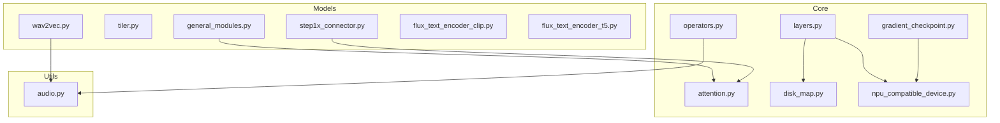

**Diagram sources**
- [general_modules.py:1-147](file://diffsynth/models/general_modules.py#L1-L147)
- [tiler.py:1-95](file://diffsynth/models/tiler.py#L1-L95)
- [wav2vec.py:1-192](file://diffsynth/models/wav2vec.py#L1-L192)
- [step1x_connector.py:1-664](file://diffsynth/models/step1x_connector.py#L1-L664)
- [attention.py:1-122](file://diffsynth/core/attention/attention.py#L1-L122)
- [layers.py:1-480](file://diffsynth/core/vram/layers.py#L1-L480)
- [disk_map.py:1-94](file://diffsynth/core/vram/disk_map.py#L1-L94)
- [npu_compatible_device.py:1-108](file://diffsynth/core/device/npu_compatible_device.py#L1-L108)
- [gradient_checkpoint.py:1-66](file://diffsynth/core/gradient/gradient_checkpoint.py#L1-L66)
- [operators.py:1-279](file://diffsynth/core/data/operators.py#L1-L279)
- [audio.py:1-109](file://diffsynth/utils/data/audio.py#L1-L109)
- [flux_text_encoder_clip.py:1-113](file://diffsynth/models/flux_text_encoder_clip.py#L1-L113)
- [flux_text_encoder_t5.py:1-44](file://diffsynth/models/flux_text_encoder_t5.py#L1-L44)

**Section sources**
- [general_modules.py:1-147](file://diffsynth/models/general_modules.py#L1-L147)
- [tiler.py:1-95](file://diffsynth/models/tiler.py#L1-L95)
- [wav2vec.py:1-192](file://diffsynth/models/wav2vec.py#L1-L192)
- [step1x_connector.py:1-664](file://diffsynth/models/step1x_connector.py#L1-L664)
- [attention.py:1-122](file://diffsynth/core/attention/attention.py#L1-L122)
- [layers.py:1-480](file://diffsynth/core/vram/layers.py#L1-L480)
- [disk_map.py:1-94](file://diffsynth/core/vram/disk_map.py#L1-L94)
- [npu_compatible_device.py:1-108](file://diffsynth/core/device/npu_compatible_device.py#L1-L108)
- [gradient_checkpoint.py:1-66](file://diffsynth/core/gradient/gradient_checkpoint.py#L1-L66)
- [operators.py:1-279](file://diffsynth/core/data/operators.py#L1-L279)
- [audio.py:1-109](file://diffsynth/utils/data/audio.py#L1-L109)
- [flux_text_encoder_clip.py:1-113](file://diffsynth/models/flux_text_encoder_clip.py#L1-L113)
- [flux_text_encoder_t5.py:1-44](file://diffsynth/models/flux_text_encoder_t5.py#L1-L44)

## Core Components
This section summarizes the key reusable building blocks and their roles across models.

- Time embeddings and projections
  - Sinusoidal timestep embedding generation and projection layers
  - Optional additional conditioning tokens for time
  - RMSNorm and AdaLayerNorm variants for stable training/inference

- Attention utilities
  - Unified attention forward with automatic selection among FlashAttention, SageAttention, xFormers, or PyTorch SDPA
  - Pattern rearrangement helpers for q/k/v tensors

- Tiling mechanism
  - TileWorker supports splitting large inputs into tiles, running per-tile inference, and reassembling outputs with overlap blending

- Audio processing
  - Wav2Vec-based audio encoder with frame sampling and interpolation to video fps
  - Utilities for reading/resampling/saving audio tensors

- Connectors
  - Token refiners and cross-attention blocks for bridging text encoders to diffusion backbones
  - Global pooling and scaling parameters for stable integration

- VRAM management
  - AutoWrappedModule and AutoWrappedLinear provide dynamic offload/onload/preparing states
  - Disk-backed parameter access via DiskMap for safetensors and other formats

- Device abstraction
  - Helpers for CUDA/NPU detection, synchronization, cache clearing, and backend selection

- Gradient checkpointing
  - Wrapper to enable memory-efficient training with optional CPU offloading

**Section sources**
- [general_modules.py:1-147](file://diffsynth/models/general_modules.py#L1-L147)
- [attention.py:1-122](file://diffsynth/core/attention/attention.py#L1-L122)
- [tiler.py:1-95](file://diffsynth/models/tiler.py#L1-L95)
- [wav2vec.py:1-192](file://diffsynth/models/wav2vec.py#L1-L192)
- [audio.py:1-109](file://diffsynth/utils/data/audio.py#L1-L109)
- [step1x_connector.py:1-664](file://diffsynth/models/step1x_connector.py#L1-L664)
- [layers.py:1-480](file://diffsynth/core/vram/layers.py#L1-L480)
- [disk_map.py:1-94](file://diffsynth/core/vram/disk_map.py#L1-L94)
- [npu_compatible_device.py:1-108](file://diffsynth/core/device/npu_compatible_device.py#L1-L108)
- [gradient_checkpoint.py:1-66](file://diffsynth/core/gradient/gradient_checkpoint.py#L1-L66)

## Architecture Overview
The shared modules form a cohesive system enabling efficient, modular model construction:

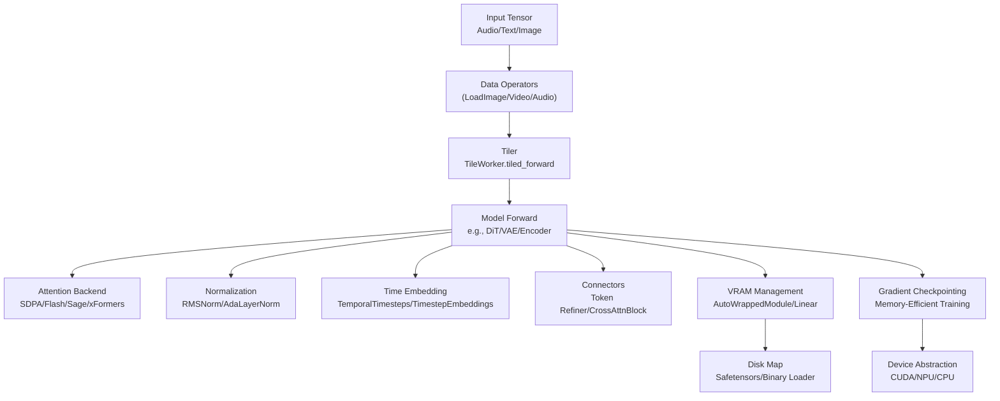

**Diagram sources**
- [operators.py:1-279](file://diffsynth/core/data/operators.py#L1-L279)
- [tiler.py:1-95](file://diffsynth/models/tiler.py#L1-L95)
- [attention.py:1-122](file://diffsynth/core/attention/attention.py#L1-L122)
- [general_modules.py:1-147](file://diffsynth/models/general_modules.py#L1-L147)
- [step1x_connector.py:1-664](file://diffsynth/models/step1x_connector.py#L1-L664)
- [layers.py:1-480](file://diffsynth/core/vram/layers.py#L1-L480)
- [disk_map.py:1-94](file://diffsynth/core/vram/disk_map.py#L1-L94)
- [gradient_checkpoint.py:1-66](file://diffsynth/core/gradient/gradient_checkpoint.py#L1-L66)
- [npu_compatible_device.py:1-108](file://diffsynth/core/device/npu_compatible_device.py#L1-L108)

## Detailed Component Analysis

### General Building Blocks (Time Embeddings and Normalization)
Key responsibilities:
- Generate sinusoidal timestep embeddings with configurable scaling and dtype alignment
- Project timestep embeddings through MLPs compatible with Diffusers format
- Provide RMSNorm and AdaLayerNorm for stable normalization and adaptive modulation

Usage patterns:
- Use TemporalTimesteps to convert scalar timesteps into embeddings
- Wrap with TimestepEmbeddings to project and optionally add extra conditioning
- Apply RMSNorm or AdaLayerNorm within transformer blocks for numerical stability

Extension points:
- Swap activation functions inside timestep projection
- Add new conditioning tokens in TimestepEmbeddings
- Customize AdaLayerNorm gating channels for multi-stream modulation

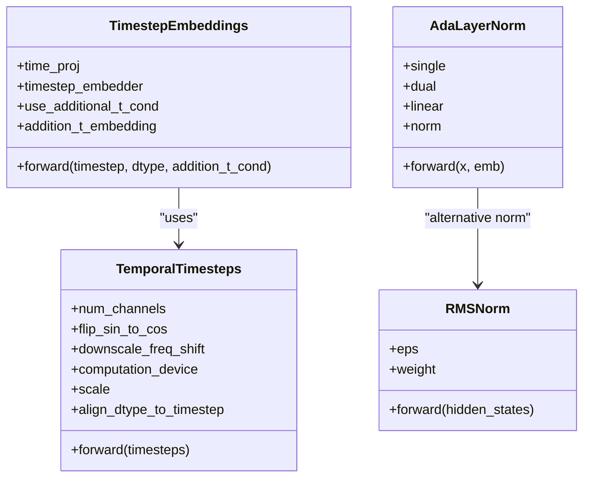

**Diagram sources**
- [general_modules.py:1-147](file://diffsynth/models/general_modules.py#L1-L147)

**Section sources**
- [general_modules.py:1-147](file://diffsynth/models/general_modules.py#L1-L147)

### Tiling Mechanism (TileWorker)
Purpose:
- Split large spatial inputs into overlapping tiles
- Run per-tile inference to reduce memory footprint
- Reassemble outputs using overlap blending and fold operations

Workflow:
- tile(): unfold input into tiles
- tiled_inference(): iterate over tiles, call forward_fn per batch
- untile(): apply masks and fold to reconstruct full output
- tiled_forward(): orchestrates tile/inference/resize/untile pipeline

Parameters:
- tile_size, tile_stride, tile_batch_size control memory/performance trade-offs
- border_width controls overlap blending smoothness
- tile_device/tile_dtype allow offloading tiles to CPU or lower precision

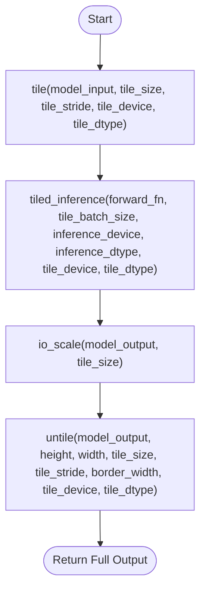

**Diagram sources**
- [tiler.py:1-95](file://diffsynth/models/tiler.py#L1-L95)

**Section sources**
- [tiler.py:1-95](file://diffsynth/models/tiler.py#L1-L95)

### Audio Processing Modules (Wav2Vec Encoder and Utilities)
Responsibilities:
- Extract audio features from raw waveforms using Wav2Vec2
- Interpolate features to target video fps
- Bucketize audio embeddings for efficient batching
- Read/resample/save audio tensors with torchcodec

Key functions/classes:
- WanS2VAudioEncoder.extract_audio_feat()
- linear_interpolation(features, input_fps, output_fps, output_len)
- get_sample_indices(original_fps, total_frames, target_fps, num_sample, fixed_start)
- get_audio_embed_bucket_fps(audio_embed, fps, batch_frames, m)
- read_audio(path, start_time, duration, resample, resample_rate, backend)
- save_audio(waveform, sample_rate, save_path, backend)

Integration:
- Pipelines can load audio via operators.LoadAudioWithTorchaudio or utils.audio.read_audio
- Feed extracted features into multimodal models as temporal conditioning

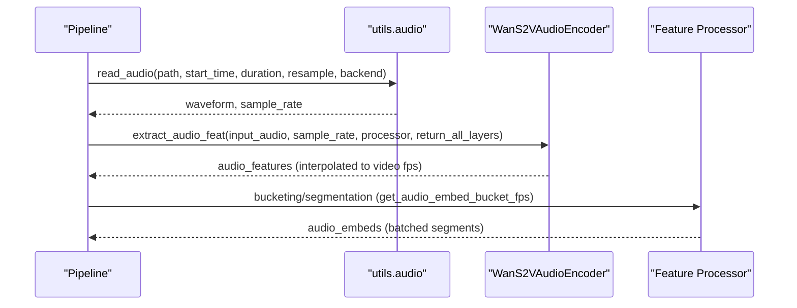

**Diagram sources**
- [audio.py:1-109](file://diffsynth/utils/data/audio.py#L1-L109)
- [wav2vec.py:1-192](file://diffsynth/models/wav2vec.py#L1-L192)

**Section sources**
- [wav2vec.py:1-192](file://diffsynth/models/wav2vec.py#L1-L192)
- [audio.py:1-109](file://diffsynth/utils/data/audio.py#L1-L109)

### Connector Components (Step1X Connector)
Purpose:
- Bridge text encoder outputs to diffusion backbones via token refinement and cross-attention
- Provide global pooling and scaling for stable integration

Key classes:
- IndividualTokenRefinerBlock: self-attention with AdaLN modulation and optional cross-attention
- CrossAttnBlock: cross-attention between query and context tokens
- SingleTokenRefiner: embedders for timestep and context, stacks of refiner blocks
- Qwen2Connector: combines single-token refiner with global projection and scale factor

Patterns:
- Use TimestepEmbedder and TextProjection to create conditioning signals
- Apply QK-Norm and gated modulation for stability
- Optionally include cross-attention to inject external context

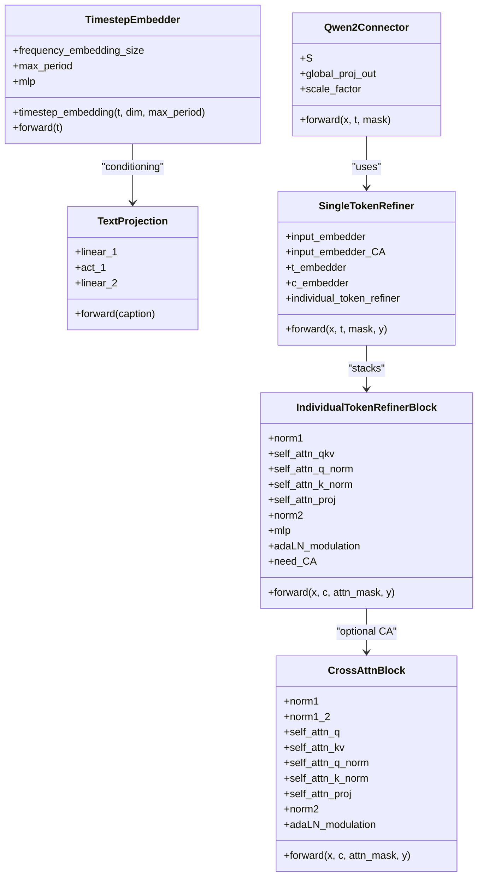

**Diagram sources**
- [step1x_connector.py:1-664](file://diffsynth/models/step1x_connector.py#L1-L664)

**Section sources**
- [step1x_connector.py:1-664](file://diffsynth/models/step1x_connector.py#L1-L664)

### Text Encoder Utilities (CLIP and T5)
Responsibilities:
- CLIP-style encoder with attention layers and position embeddings
- T5 encoder wrapper for large-scale text modeling

Key classes:
- FluxTextEncoderClip: token embedding, positional encoding, stacked encoder layers, final layer norm, pooled output
- FluxTextEncoderT5: wraps T5EncoderModel with specific configuration

Usage:
- Input token IDs produce pooled embeddings and hidden states
- Supports clip_skip to select intermediate layers
- Can apply custom attention masks for masking prompts

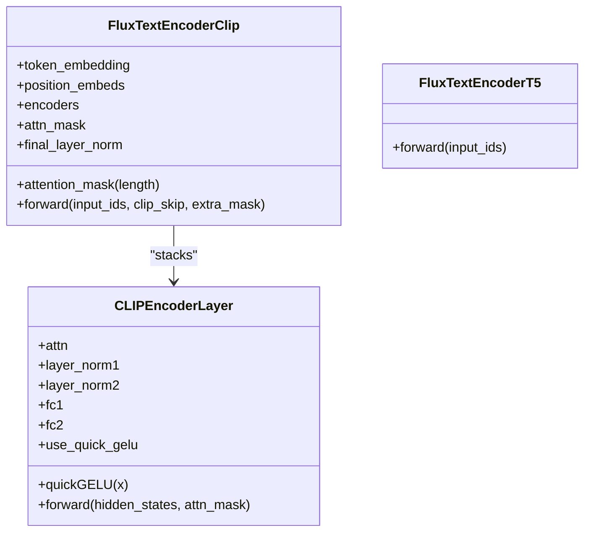

**Diagram sources**
- [flux_text_encoder_clip.py:1-113](file://diffsynth/models/flux_text_encoder_clip.py#L1-L113)
- [flux_text_encoder_t5.py:1-44](file://diffsynth/models/flux_text_encoder_t5.py#L1-L44)

**Section sources**
- [flux_text_encoder_clip.py:1-113](file://diffsynth/models/flux_text_encoder_clip.py#L1-L113)
- [flux_text_encoder_t5.py:1-44](file://diffsynth/models/flux_text_encoder_t5.py#L1-L44)

### Attention Backends
Responsibilities:
- Unified attention interface selecting optimal backend based on availability and environment
- Support for FlashAttention 3/2, SageAttention, xFormers, and PyTorch SDPA

Key functions:
- initialize_attention_priority(): selects backend priority
- attention_forward(q, k, v, ...): dispatches to chosen backend
- rearrange_qkv/rearrange_out: tensor shape transformations

Configuration:
- Environment variable DIFFSYNTH_ATTENTION_IMPLEMENTATION overrides auto-detection
- Compatibility mode forces SDPA when attn_mask is present

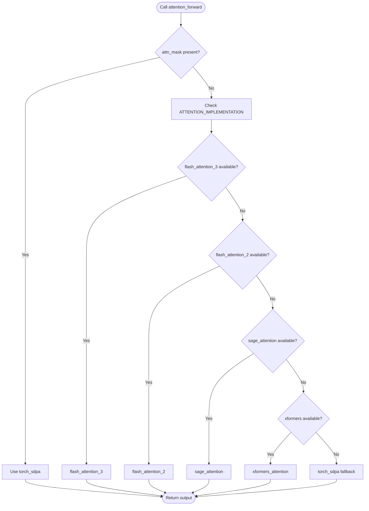

**Diagram sources**
- [attention.py:1-122](file://diffsynth/core/attention/attention.py#L1-L122)

**Section sources**
- [attention.py:1-122](file://diffsynth/core/attention/attention.py#L1-L122)

### VRAM Management and Disk-Backed Loading
Responsibilities:
- Wrap modules to dynamically manage dtype/device states (offload/onload/preparing/computation)
- Load parameters lazily from disk (safetensors or binary) to minimize memory usage
- Enable FP8 linear computation paths for reduced memory bandwidth

Key classes:
- AutoTorchModule: base class managing dtype/device states and VRAM checks
- AutoWrappedModule: wraps arbitrary nn.Module with state transitions
- AutoWrappedNonRecurseModule: non-recursive variant for selective parameter loading
- AutoWrappedLinear: specialized Linear with FP8 support and LoRA merging
- DiskMap: lazy loading from safetensors/binary files with buffer management

Functions:
- enable_vram_management(model, module_map, vram_config, vram_limit, disk_map): recursively wrap modules
- fill_vram_config(model, vram_config): fills default states if not specified

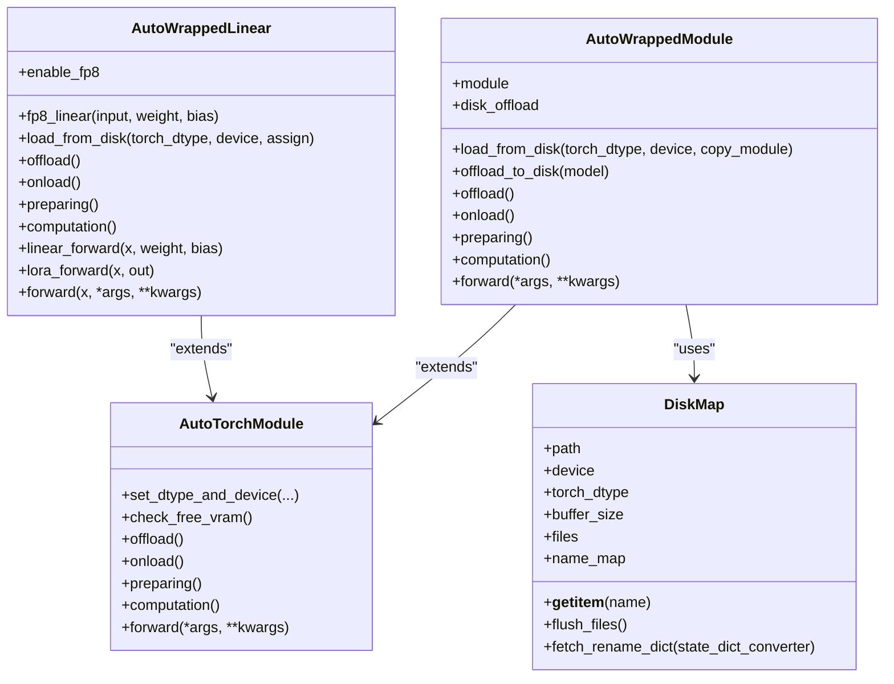

**Diagram sources**
- [layers.py:1-480](file://diffsynth/core/vram/layers.py#L1-L480)
- [disk_map.py:1-94](file://diffsynth/core/vram/disk_map.py#L1-L94)

**Section sources**
- [layers.py:1-480](file://diffsynth/core/vram/layers.py#L1-L480)
- [disk_map.py:1-94](file://diffsynth/core/vram/disk_map.py#L1-L94)

### Data Operators and Audio Utilities
Responsibilities:
- Composable data processing pipelines for images, videos, and audio
- Frame sampling and rate conversion for consistent input lengths
- Audio I/O with torchcodec backend and resampling utilities

Key classes/functions:
- DataProcessingPipeline and DataProcessingOperator: composable transforms
- LoadImage, LoadVideo, LoadGIF, LoadAudio, LoadAudioWithTorchaudio
- FrameSamplerByRateMixin: frame rate mapping and selection
- utils.audio.read_audio(), save_audio(), resample_waveform(), convert_to_mono/stereo

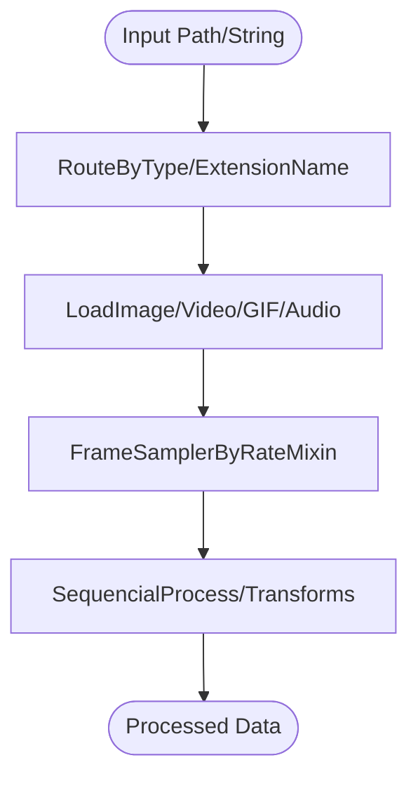

**Diagram sources**
- [operators.py:1-279](file://diffsynth/core/data/operators.py#L1-L279)
- [audio.py:1-109](file://diffsynth/utils/data/audio.py#L1-L109)

**Section sources**
- [operators.py:1-279](file://diffsynth/core/data/operators.py#L1-L279)
- [audio.py:1-109](file://diffsynth/utils/data/audio.py#L1-L109)

### Device Abstraction and Gradient Checkpointing
Responsibilities:
- Detect and abstract device types (CUDA/NPU/CPU)
- Provide synchronization and cache management
- Enable gradient checkpointing for memory-efficient training

Key functions:
- npu_compatible_device.get_device_type(), synchronize(), empty_cache(), enable_high_precision_for_bf16()
- gradient_checkpoint.gradient_checkpoint_forward(model, use_gradient_checkpointing, use_gradient_checkpointing_offload, *args, **kwargs)

Usage:
- Replace direct torch.device calls with parse_device_type/get_device_name
- Wrap model forward with gradient_checkpoint_forward to save memory during training

**Section sources**
- [npu_compatible_device.py:1-108](file://diffsynth/core/device/npu_compatible_device.py#L1-L108)
- [gradient_checkpoint.py:1-66](file://diffsynth/core/gradient/gradient_checkpoint.py#L1-L66)

## Dependency Analysis
Shared modules have clear dependency boundaries:
- general_modules depends on torch and math; no heavy external dependencies
- tiler uses einops for tensor rearrangements
- wav2vec depends on transformers.Wav2Vec2ForCTC and torchaudio/librosa
- step1x_connector relies on torch.nn and einops
- attention.py conditionally imports flash_attn, sageattention, xformers
- VRAM layers depend on safetensors and device abstractions
- data operators use torchvision, imageio, torchaudio, librosa

Potential circular dependencies:
- None detected; modules are layered and import only what they need

External integration points:
- Transformers for Wav2Vec2 and T5
- safetensors for efficient disk-backed loading
- Optional acceleration libraries (FlashAttention, SageAttention, xFormers)

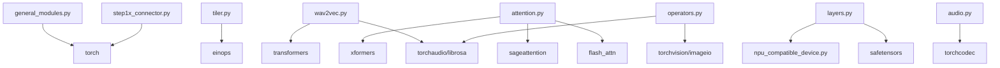

**Diagram sources**
- [general_modules.py:1-147](file://diffsynth/models/general_modules.py#L1-L147)
- [tiler.py:1-95](file://diffsynth/models/tiler.py#L1-L95)
- [wav2vec.py:1-192](file://diffsynth/models/wav2vec.py#L1-L192)
- [step1x_connector.py:1-664](file://diffsynth/models/step1x_connector.py#L1-L664)
- [attention.py:1-122](file://diffsynth/core/attention/attention.py#L1-L122)
- [layers.py:1-480](file://diffsynth/core/vram/layers.py#L1-L480)
- [operators.py:1-279](file://diffsynth/core/data/operators.py#L1-L279)
- [audio.py:1-109](file://diffsynth/utils/data/audio.py#L1-L109)

**Section sources**
- [general_modules.py:1-147](file://diffsynth/models/general_modules.py#L1-L147)
- [tiler.py:1-95](file://diffsynth/models/tiler.py#L1-L95)
- [wav2vec.py:1-192](file://diffsynth/models/wav2vec.py#L1-L192)
- [step1x_connector.py:1-664](file://diffsynth/models/step1x_connector.py#L1-L664)
- [attention.py:1-122](file://diffsynth/core/attention/attention.py#L1-L122)
- [layers.py:1-480](file://diffsynth/core/vram/layers.py#L1-L480)
- [operators.py:1-279](file://diffsynth/core/data/operators.py#L1-L279)
- [audio.py:1-109](file://diffsynth/utils/data/audio.py#L1-L109)

## Performance Considerations
- Attention backend selection: prefer FlashAttention or SageAttention when available; fall back to SDPA for compatibility
- Tiling: tune tile_size and tile_stride to balance memory and speed; use border_width for smoother blending
- VRAM management: enable AutoWrappedModule wrapping for large models; use DiskMap for safetensors to avoid loading all weights into memory
- FP8 linear: AutoWrappedLinear supports FP8 matmul for reduced memory bandwidth on supported hardware
- Gradient checkpointing: use gradient_checkpoint_forward to reduce activation memory during training
- Device optimization: enable high-precision bf16 settings and use synchronize/empty_cache judiciously
- Audio processing: use torchcodec backend for fast I/O; resample only when necessary

[No sources needed since this section provides general guidance]

## Troubleshooting Guide
Common issues and resolutions:
- Attention errors with masks: set compatibility_mode=True or ensure attn_mask is supported by selected backend
- VRAM overflow: enable VRAM management wrappers and adjust vram_limit; consider disk offloading
- Slow audio loading: switch to torchcodec backend; ensure correct sample rates and durations
- NPU/CUDA detection failures: verify device availability and use get_device_type() for robust checks
- Gradient checkpointing not applied: confirm use_gradient_checkpointing flags and DeepSpeed configuration if used

**Section sources**
- [attention.py:1-122](file://diffsynth/core/attention/attention.py#L1-L122)
- [layers.py:1-480](file://diffsynth/core/vram/layers.py#L1-L480)
- [audio.py:1-109](file://diffsynth/utils/data/audio.py#L1-L109)
- [npu_compatible_device.py:1-108](file://diffsynth/core/device/npu_compatible_device.py#L1-L108)
- [gradient_checkpoint.py:1-66](file://diffsynth/core/gradient/gradient_checkpoint.py#L1-L66)

## Conclusion
The shared modules provide a robust foundation for building efficient, scalable models across modalities. By leveraging unified attention backends, tiling, VRAM management, and composable data pipelines, developers can construct high-performance systems while maintaining flexibility for customization and extension. The documented APIs and patterns enable seamless integration into diverse model families, with clear extension points for advanced use cases.

[No sources needed since this section summarizes without analyzing specific files]

## Appendices
- Extension points:
  - Custom normalization layers in general_modules
  - New attention backends in attention.py
  - Additional audio processors in wav2vec.py and audio.py
  - Custom connector blocks in step1x_connector.py
  - VRAM strategies via AutoWrappedModule configurations

[No sources needed since this section provides general guidance]