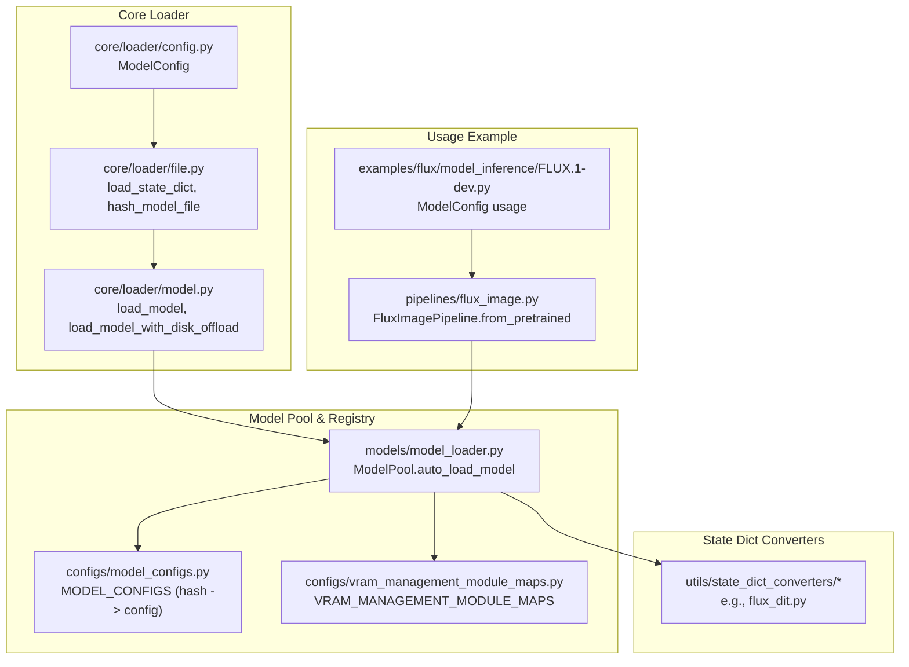
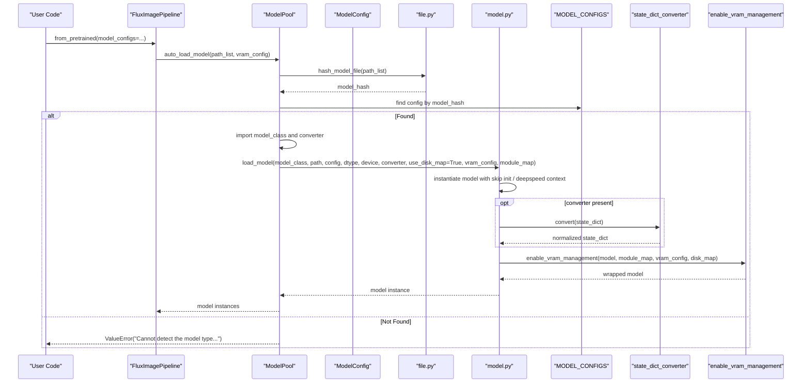
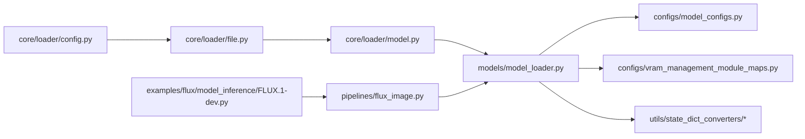

# Model Loader System

<cite>
**Referenced Files in This Document**
- [__init__.py](file://diffsynth/core/loader/__init__.py)
- [config.py](file://diffsynth/core/loader/config.py)
- [file.py](file://diffsynth/core/loader/file.py)
- [model.py](file://diffsynth/core/loader/model.py)
- [model_loader.py](file://diffsynth/models/model_loader.py)
- [model_configs.py](file://diffsynth/configs/model_configs.py)
- [vram_management_module_maps.py](file://diffsynth/configs/vram_management_module_maps.py)
- [__init__.py](file://diffsynth/configs/__init__.py)
- [flux_dit.py](file://diffsynth/utils/state_dict_converters/flux_dit.py)
- [flux_image.py](file://diffsynth/pipelines/flux_image.py)
- [FLUX.1-dev.py](file://examples/flux/model_inference/FLUX.1-dev.py)
</cite>

## Table of Contents
1. [Introduction](#introduction)
2. [Project Structure](#project-structure)
3. [Core Components](#core-components)
4. [Architecture Overview](#architecture-overview)
5. [Detailed Component Analysis](#detailed-component-analysis)
6. [Dependency Analysis](#dependency-analysis)
7. [Performance Considerations](#performance-considerations)
8. [Troubleshooting Guide](#troubleshooting-guide)
9. [Conclusion](#conclusion)
10. [Appendices](#appendices)

## Introduction
This document provides comprehensive API documentation for the model loader system, focusing on automatic model detection, registration mechanisms, and hash-based identification. It covers the ModelConfig class for model specifications, state dictionary conversion utilities, dynamic module importing, and VRAM-aware loading. The guide includes detailed workflows, configuration schemas, error handling patterns, custom model integration, registry management, and version compatibility considerations.

## Project Structure
The model loader system is organized into core loader utilities, a high-level model pool with automatic detection, and configuration registries that map model file hashes to concrete classes and converters.

**Diagram sources**
- [config.py:1-120](file://diffsynth/core/loader/config.py#L1-L120)
- [file.py:1-131](file://diffsynth/core/loader/file.py#L1-L131)
- [model.py:1-106](file://diffsynth/core/loader/model.py#L1-L106)
- [model_loader.py:1-114](file://diffsynth/models/model_loader.py#L1-L114)
- [model_configs.py:1-920](file://diffsynth/configs/model_configs.py#L1-L920)
- [vram_management_module_maps.py:1-312](file://diffsynth/configs/vram_management_module_maps.py#L1-L312)
- [flux_dit.py:1-197](file://diffsynth/utils/state_dict_converters/flux_dit.py#L1-L197)
- [flux_image.py:120-177](file://diffsynth/pipelines/flux_image.py#L120-L177)
- [FLUX.1-dev.py:1-27](file://examples/flux/model_inference/FLUX.1-dev.py#L1-L27)

**Section sources**
- [__init__.py:1-4](file://diffsynth/core/loader/__init__.py#L1-L4)
- [config.py:1-120](file://diffsynth/core/loader/config.py#L1-L120)
- [file.py:1-131](file://diffsynth/core/loader/file.py#L1-L131)
- [model.py:1-106](file://diffsynth/core/loader/model.py#L1-L106)
- [model_loader.py:1-114](file://diffsynth/models/model_loader.py#L1-L114)
- [model_configs.py:1-920](file://diffsynth/configs/model_configs.py#L1-L920)
- [vram_management_module_maps.py:1-312](file://diffsynth/configs/vram_management_module_maps.py#L1-L312)
- [__init__.py:1-3](file://diffsynth/configs/__init__.py#L1-L3)
- [flux_dit.py:1-197](file://diffsynth/utils/state_dict_converters/flux_dit.py#L1-L197)
- [flux_image.py:120-177](file://diffsynth/pipelines/flux_image.py#L120-L177)
- [FLUX.1-dev.py:1-27](file://examples/flux/model_inference/FLUX.1-dev.py#L1-L27)

## Core Components
- ModelConfig: Encapsulates model source resolution, download behavior, device/dtype scheduling, and path normalization.
- File Utilities: Load state dicts from safetensors or bin formats; compute stable hashes over keys and shapes.
- Model Loader: Instantiates models, applies optional state dict converters, handles DeepSpeed ZeRO Stage 3, and enables VRAM management via DiskMap and module mapping.
- ModelPool: Automatic model detection by hashing files and matching against MODEL_CONFIGS; manages multiple loaded models and retrieval by name.
- Configuration Registry: Centralized mapping of model_hash to model_class, extra_kwargs, and optional state_dict_converter; VRAM module maps for per-model layer wrapping.
- State Dict Converters: Per-model functions to rename/restructure keys and handle framework-specific formats.

Key responsibilities:
- Automatic detection: Hash-based matching ensures correct model class selection regardless of file naming.
- Registration: MODEL_CONFIGS entries register supported models and their loaders.
- Conversion: Optional converters adapt heterogeneous checkpoint formats to internal expectations.
- Dynamic import: Model classes and converters are imported lazily by fully-qualified strings.

**Section sources**
- [config.py:1-120](file://diffsynth/core/loader/config.py#L1-L120)
- [file.py:1-131](file://diffsynth/core/loader/file.py#L1-L131)
- [model.py:1-106](file://diffsynth/core/loader/model.py#L1-L106)
- [model_loader.py:1-114](file://diffsynth/models/model_loader.py#L1-L114)
- [model_configs.py:1-920](file://diffsynth/configs/model_configs.py#L1-L920)
- [vram_management_module_maps.py:1-312](file://diffsynth/configs/vram_management_module_maps.py#L1-L312)
- [flux_dit.py:1-197](file://diffsynth/utils/state_dict_converters/flux_dit.py#L1-L197)

## Architecture Overview
The loader architecture separates concerns across configuration, IO, instantiation, and VRAM management, while providing an automated discovery mechanism based on content hashing.

**Diagram sources**
- [model_loader.py:64-82](file://diffsynth/models/model_loader.py#L64-L82)
- [file.py:126-131](file://diffsynth/core/loader/file.py#L126-L131)
- [model.py:11-65](file://diffsynth/core/loader/model.py#L11-L65)
- [model_configs.py:919-920](file://diffsynth/configs/model_configs.py#L919-L920)
- [flux_image.py:120-177](file://diffsynth/pipelines/flux_image.py#L120-L177)

## Detailed Component Analysis

### ModelConfig
Purpose:
- Define where to get model weights (local path or remote model_id), which files to include, and whether to download.
- Control device/dtype scheduling for offload/onload/preparing/computation phases.
- Normalize local paths and resolve environment overrides.

Key behaviors:
- Input validation ensures either path or model_id is provided.
- Download source defaults to environment variable or “modelscope”; supports huggingface.
- Skip-download logic respects environment variables.
- Path resolution supports single file or glob patterns; collapses single-element lists to string.
- VRAM config helper returns a structured dict for downstream consumers.

Common fields:
- path: Union[str, list[str]]
- model_id: str
- origin_file_pattern: Union[str, list[str]]
- download_source: str (“modelscope” | “huggingface”)
- local_model_path: str
- skip_download: bool
- offload_device/dtype, onload_device/dtype, preparing_device/dtype, computation_device/dtype: Optional[Union[str, torch.device]] / Optional[torch.dtype]
- clear_parameters: bool
- state_dict: Dict[str, torch.Tensor]

Environment variables:
- DIFFSYNTH_DOWNLOAD_SOURCE: override default download provider
- DIFFSYNTH_SKIP_DOWNLOAD: “true” | “false”
- DIFFSYNTH_MODEL_BASE_PATH: base directory for downloaded models

Error handling:
- Raises ValueError when neither path nor model_id is set.
- Raises ValueError if download_source is unsupported.

**Section sources**
- [config.py:1-120](file://diffsynth/core/loader/config.py#L1-L120)

### File Utilities and Hashing
Responsibilities:
- Load state dicts from .safetensors or .bin/.pth files, supporting nested containers and common wrapper keys.
- Provide key-only inspection without loading full tensors for fast hashing.
- Compute stable MD5 hashes over sorted keys and optional shapes.

Functions:
- load_state_dict(file_path, torch_dtype=None, device="cpu", pin_memory=False, verbose=0)
- load_state_dict_from_safetensors(...)
- load_state_dict_from_bin(...)
- hash_model_file(path, with_shape=True)
- load_keys_dict(...), convert_state_dict_to_keys_dict(...)

Complexity notes:
- Hashing operates over key names and optionally tensor shapes; sorting ensures deterministic order.
- Loading can be memory-intensive; prefer keys-only inspection for large files when possible.

**Section sources**
- [file.py:1-131](file://diffsynth/core/loader/file.py#L1-L131)

### Model Loader (Instantiation and VRAM Management)
Responsibilities:
- Instantiate models with optimized initialization contexts (skip random init or DeepSpeed ZeRO Stage 3).
- Apply optional state dict converters to normalize checkpoint formats.
- Support DiskMap-backed lazy loading for large checkpoints.
- Enable VRAM management by wrapping modules according to module maps.

Key parameters:
- model_class: Fully-qualified class reference
- path: Single file or list of files
- config: Extra kwargs for model constructor
- torch_dtype, device: Target precision and device
- state_dict_converter: Callable(state_dict) -> state_dict
- use_disk_map: Use DiskMap for lazy loading
- module_map: Mapping from original module types to VRAM-wrapped types
- vram_config: Device/dtype schedule for offload/onload/preparing/computation
- vram_limit: Optional cap for VRAM usage
- state_dict: Preloaded state dict (optional)

DeepSpeed ZeRO Stage 3:
- Special handling to avoid excessive GPU memory during parameter assignment.

**Section sources**
- [model.py:1-106](file://diffsynth/core/loader/model.py#L1-L106)

### ModelPool and Automatic Detection
Responsibilities:
- Compute model hash from files and match against MODEL_CONFIGS to select the correct model class and converter.
- Dynamically import model classes and converters from fully-qualified strings.
- Manage multiple model instances and retrieve them by model_name with optional indexing.
- Optionally clear parameters to free memory after loading.

Workflow:
- auto_load_model(path, vram_config, vram_limit, clear_parameters, state_dict)
- fetch_module_map(model_class, vram_config): resolves VRAM module maps, including version-specific updates.
- load_model_file(config, path, vram_config, vram_limit, state_dict): constructs and loads the model.

Error handling:
- Raises ValueError if no matching model_hash is found in MODEL_CONFIGS.

**Section sources**
- [model_loader.py:1-114](file://diffsynth/models/model_loader.py#L1-L114)

### Configuration Registry (MODEL_CONFIGS)
Structure:
- Each entry defines:
  - model_hash: Stable identifier derived from file contents
  - model_name: Human-readable label used for fetching
  - model_class: Fully-qualified Python class path
  - extra_kwargs: Optional constructor arguments
  - state_dict_converter: Optional fully-qualified converter function path

Examples:
- FLUX DiT, text encoders, VAEs
- Qwen Image series, Wan video series, LTX-2 components
- Z-Image, Anima, MOVA, JoyAI variants

Version compatibility:
- Some entries include extra_kwargs to support variant architectures or feature flags.
- VERSION_CHECKER_MAPS provide runtime adjustments for external library versions (e.g., transformers).

**Section sources**
- [model_configs.py:1-920](file://diffsynth/configs/model_configs.py#L1-L920)
- [__init__.py:1-3](file://diffsynth/configs/__init__.py#L1-L3)

### VRAM Module Maps
Purpose:
- Map original module types to VRAM-aware wrappers (AutoWrappedModule, AutoWrappedLinear, etc.).
- Enable fine-grained control over which layers participate in VRAM management.

Highlights:
- Shared base maps (e.g., flux_general_vram_config) reduce duplication.
- Version-specific updaters adjust mappings when upstream libraries change class names.

**Section sources**
- [vram_management_module_maps.py:1-312](file://diffsynth/configs/vram_management_module_maps.py#L1-L312)

### State Dict Converters
Purpose:
- Normalize heterogeneous checkpoint formats to the internal model expectations.
- Rename keys, concatenate projections, and restructure blocks.

Example:
- FluxDiTStateDictConverter and FluxDiTStateDictConverterFromDiffusers handle different origins and merge projections.

Guidelines:
- Converters should be pure functions taking a state dict and returning a normalized one.
- Avoid heavy computations; keep conversions efficient.

**Section sources**
- [flux_dit.py:1-197](file://diffsynth/utils/state_dict_converters/flux_dit.py#L1-L197)

### Usage Workflow (FluxImagePipeline)
High-level flow:
- Construct pipeline with from_pretrained(model_configs=[...]).
- Each ModelConfig specifies model_id and origin_file_pattern; downloads occur automatically unless skipped.
- ModelPool auto-detects model types via hash matching and loads components accordingly.
- Tokenizers and processors are loaded using separate ModelConfigs.

Example snippet references:
- Pipeline construction and component fetching
- Example script demonstrating ModelConfig usage

**Section sources**
- [flux_image.py:120-177](file://diffsynth/pipelines/flux_image.py#L120-L177)
- [FLUX.1-dev.py:1-27](file://examples/flux/model_inference/FLUX.1-dev.py#L1-L27)

## Dependency Analysis

**Diagram sources**
- [config.py:1-120](file://diffsynth/core/loader/config.py#L1-L120)
- [file.py:1-131](file://diffsynth/core/loader/file.py#L1-L131)
- [model.py:1-106](file://diffsynth/core/loader/model.py#L1-L106)
- [model_loader.py:1-114](file://diffsynth/models/model_loader.py#L1-L114)
- [model_configs.py:1-920](file://diffsynth/configs/model_configs.py#L1-L920)
- [vram_management_module_maps.py:1-312](file://diffsynth/configs/vram_management_module_maps.py#L1-L312)
- [flux_image.py:120-177](file://diffsynth/pipelines/flux_image.py#L120-L177)
- [FLUX.1-dev.py:1-27](file://examples/flux/model_inference/FLUX.1-dev.py#L1-L27)

**Section sources**
- [model_loader.py:1-114](file://diffsynth/models/model_loader.py#L1-L114)
- [model_configs.py:1-920](file://diffsynth/configs/model_configs.py#L1-L920)
- [vram_management_module_maps.py:1-312](file://diffsynth/configs/vram_management_module_maps.py#L1-L312)

## Performance Considerations
- Prefer DiskMap-backed loading for very large checkpoints to avoid full in-memory loading.
- Use with_shape=False in hashing only when necessary; including shapes increases robustness but adds overhead.
- Pin memory for CPU-loaded tensors when moving to GPU frequently to speed up transfers.
- Leverage VRAM management maps to wrap only hot-path layers; avoid wrapping unnecessary modules.
- When using DeepSpeed ZeRO Stage 3, rely on built-in handling to prevent memory spikes.

[No sources needed since this section provides general guidance]

## Troubleshooting Guide
Common issues and resolutions:
- Cannot detect the model type: Ensure MODEL_CONFIGS contains an entry whose model_hash matches the files; verify file contents and patterns.
- Unsupported download_source: Set DIFFSYNTH_DOWNLOAD_SOURCE to “modelscope” or “huggingface”.
- Missing model_id/path: Provide either path or model_id in ModelConfig; skip_download only applies when using model_id.
- State dict mismatch: Implement or select the appropriate state_dict_converter for your checkpoint format.
- VRAM errors: Adjust vram_config dtypes/devices; ensure module_map includes all critical layers.

Relevant error points:
- ModelConfig input validation and download source checks
- ModelPool auto detection failure
- State dict conversion failures (converter must return compatible keys)

**Section sources**
- [config.py:28-82](file://diffsynth/core/loader/config.py#L28-L82)
- [model_loader.py:64-82](file://diffsynth/models/model_loader.py#L64-L82)

## Conclusion
The model loader system provides a robust, extensible framework for automatic model detection, flexible configuration, and efficient loading with VRAM awareness. By leveraging hash-based identification, centralized registries, and modular converters, it supports a wide variety of models and checkpoint formats while maintaining performance and reliability.

[No sources needed since this section summarizes without analyzing specific files]

## Appendices

### Configuration Schema Summary
- ModelConfig fields: path, model_id, origin_file_pattern, download_source, local_model_path, skip_download, offload/onload/preparing/computation device/dtype, clear_parameters, state_dict.
- MODEL_CONFIGS entries: model_hash, model_name, model_class, extra_kwargs, state_dict_converter.
- VRAM module maps: source_type -> target_wrapper_type.

**Section sources**
- [config.py:1-120](file://diffsynth/core/loader/config.py#L1-L120)
- [model_configs.py:1-920](file://diffsynth/configs/model_configs.py#L1-L920)
- [vram_management_module_maps.py:1-312](file://diffsynth/configs/vram_management_module_maps.py#L1-L312)

### Custom Model Integration Steps
1. Prepare checkpoint(s) and compute model_hash using hash_model_file.
2. Add an entry to MODEL_CONFIGS with model_hash, model_name, model_class, and optional extra_kwargs and state_dict_converter.
3. If needed, implement a state_dict_converter to normalize keys.
4. Optionally add VRAM module mappings for efficient memory usage.
5. Test via ModelPool.auto_load_model or pipeline from_pretrained.

**Section sources**
- [file.py:126-131](file://diffsynth/core/loader/file.py#L126-L131)
- [model_configs.py:1-920](file://diffsynth/configs/model_configs.py#L1-L920)
- [model_loader.py:1-114](file://diffsynth/models/model_loader.py#L1-L114)
- [vram_management_module_maps.py:1-312](file://diffsynth/configs/vram_management_module_maps.py#L1-L312)