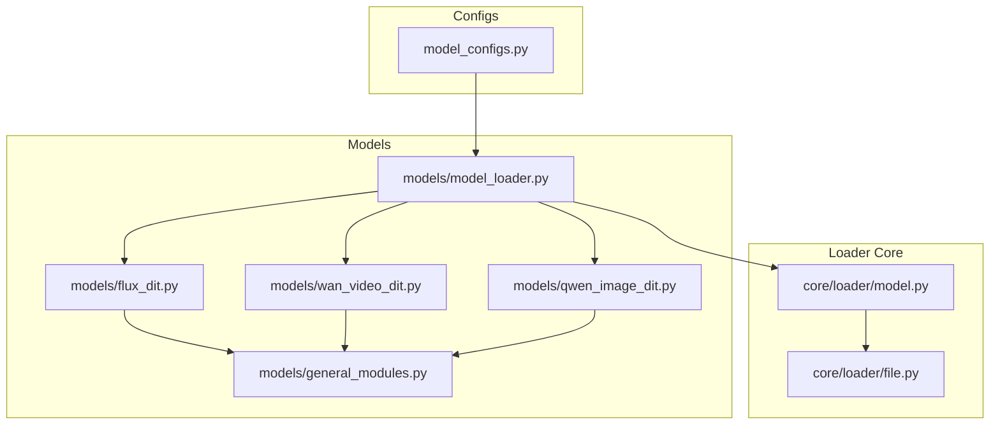
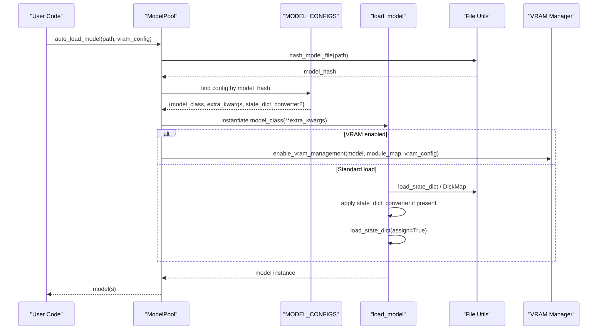
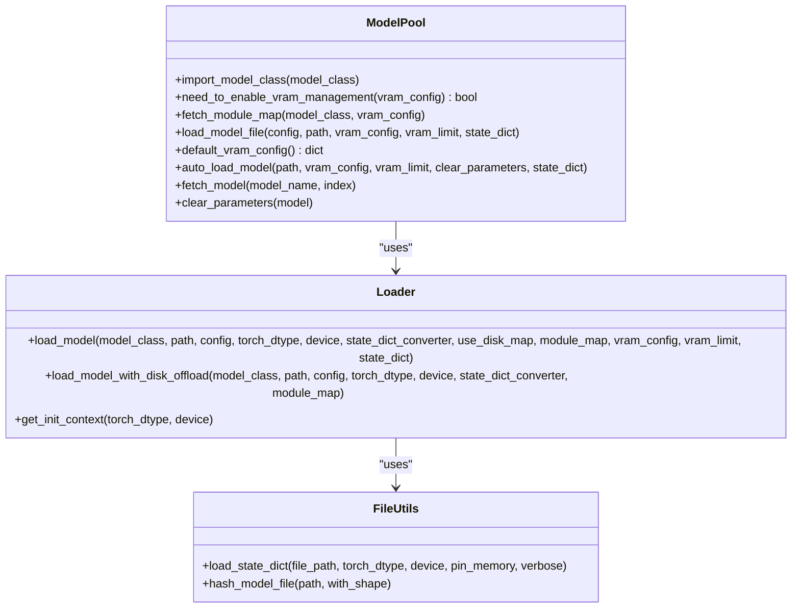
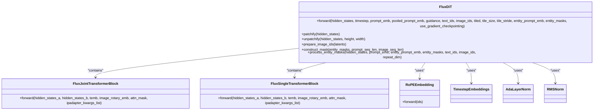
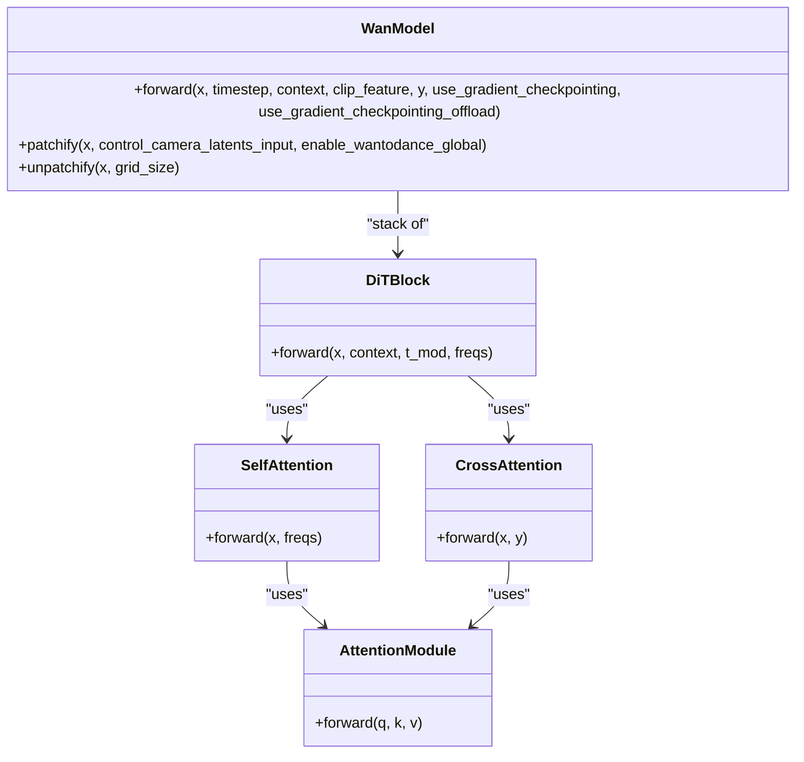
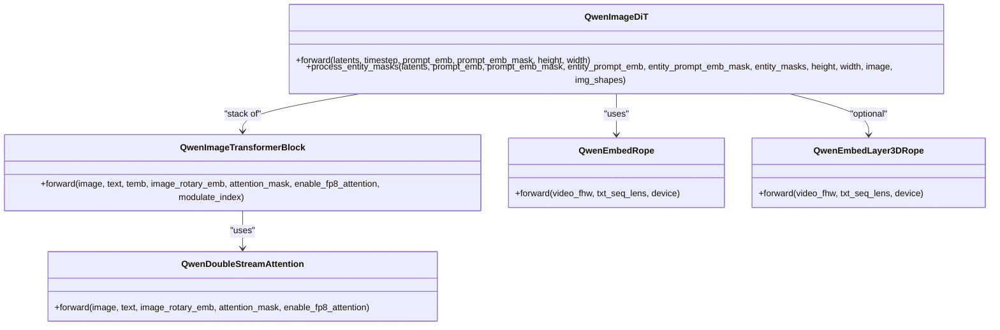
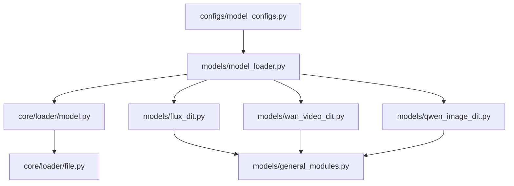

# Models API

<cite>
**Referenced Files in This Document**
- [model_loader.py](file://diffsynth/models/model_loader.py)
- [model.py](file://diffsynth/core/loader/model.py)
- [file.py](file://diffsynth/core/loader/file.py)
- [model_configs.py](file://diffsynth/configs/model_configs.py)
- [general_modules.py](file://diffsynth/models/general_modules.py)
- [flux_dit.py](file://diffsynth/models/flux_dit.py)
- [wan_video_dit.py](file://diffsynth/models/wan_video_dit.py)
- [qwen_image_dit.py](file://diffsynth/models/qwen_image_dit.py)
</cite>

## Table of Contents
1. [Introduction](#introduction)
2. [Project Structure](#project-structure)
3. [Core Components](#core-components)
4. [Architecture Overview](#architecture-overview)
5. [Detailed Component Analysis](#detailed-component-analysis)
6. [Dependency Analysis](#dependency-analysis)
7. [Performance Considerations](#performance-considerations)
8. [Troubleshooting Guide](#troubleshooting-guide)
9. [Conclusion](#conclusion)
10. [Appendices](#appendices)

## Introduction
This document provides comprehensive API documentation for the model implementations and the model loader system with automatic detection and registration. It covers supported architectures including FLUX, WanVideo, Qwen-Image, and other families (FLUX2, LTX-2, Z-Image, Anima, MOVA, JoyAI). You will find:
- How models are discovered and loaded automatically via configuration hashes
- Class hierarchies and method signatures for key DiTs and encoders
- Forward pass patterns and integration points
- Configuration schemas used by the loader
- Guidance for extending the system with custom models

## Project Structure
The model subsystem is organized into:
- Model configurations mapping file hashes to classes and converters
- A model loader that auto-detects model type from file content and instantiates the correct class
- Core loading utilities for state dict handling and VRAM management
- Model implementations for each architecture family

**Diagram sources**
- [model_configs.py](file://diffsynth/configs/model_configs.py)
- [model_loader.py](file://diffsynth/models/model_loader.py)
- [model.py](file://diffsynth/core/loader/model.py)
- [file.py](file://diffsynth/core/loader/file.py)
- [flux_dit.py](file://diffsynth/models/flux_dit.py)
- [wan_video_dit.py](file://diffsynth/models/wan_video_dit.py)
- [qwen_image_dit.py](file://diffsynth/models/qwen_image_dit.py)
- [general_modules.py](file://diffsynth/models/general_modules.py)

**Section sources**
- [model_loader.py](file://diffsynth/models/model_loader.py)
- [model.py](file://diffsynth/core/loader/model.py)
- [file.py](file://diffsynth/core/loader/file.py)
- [model_configs.py](file://diffsynth/configs/model_configs.py)

## Core Components
- ModelPool: Auto-detects model type by hashing input files and selecting the matching config entry; constructs and returns the model instance with optional VRAM management.
- load_model: Instantiates a model class under an initialization context, loads state dicts (including disk-backed lazy loading), applies optional state_dict converters, and enables VRAM management when configured.
- File utilities: Load state dicts from safetensors or bin formats, compute stable hashes over keys/shapes for model identification.

Key responsibilities:
- Automatic model detection via hash-based registry
- Pluggable state_dict converters per model family
- Optional VRAM offload/onload strategies through module maps
- Device/dtype orchestration across preparing, onload, computation stages

**Section sources**
- [model_loader.py](file://diffsynth/models/model_loader.py)
- [model.py](file://diffsynth/core/loader/model.py)
- [file.py](file://diffsynth/core/loader/file.py)

## Architecture Overview
The loader pipeline connects configuration metadata to concrete model classes and their state dict converters. The flow ensures minimal memory overhead and flexible device placement.

**Diagram sources**
- [model_loader.py](file://diffsynth/models/model_loader.py)
- [model.py](file://diffsynth/core/loader/model.py)
- [file.py](file://diffsynth/core/loader/file.py)
- [model_configs.py](file://diffsynth/configs/model_configs.py)

## Detailed Component Analysis

### Model Loader System
- ModelPool.auto_load_model:
  - Computes model hash from file keys/shapes
  - Matches against MODEL_CONFIGS entries
  - Calls load_model_file with resolved config and VRAM settings
  - Supports clearing parameters post-load and fetching models by name/index
- load_model_file:
  - Imports model_class dynamically
  - Resolves state_dict_converter if provided
  - Builds module_map for VRAM management based on model_class and vram_config
  - Delegates to core load_model with use_disk_map and vram_config
- load_model:
  - Initializes model under skip_model_initialization or DeepSpeed ZeRO context
  - Loads state dict via DiskMap or direct loading
  - Applies state_dict_converter when needed
  - Enables VRAM management with device/dtype routing

**Diagram sources**
- [model_loader.py](file://diffsynth/models/model_loader.py)
- [model.py](file://diffsynth/core/loader/model.py)
- [file.py](file://diffsynth/core/loader/file.py)

**Section sources**
- [model_loader.py](file://diffsynth/models/model_loader.py)
- [model.py](file://diffsynth/core/loader/model.py)
- [file.py](file://diffsynth/core/loader/file.py)

### Configuration Schema and Registry
- MODEL_CONFIGS aggregates lists of model entries per family (qwen_image_series, wan_series, flux_series, flux2_series, ernie_image_series, z_image_series, ltx2_series, anima_series, mova_series, joyai_image_series).
- Each entry includes:
  - model_hash: Stable identifier derived from file keys/shapes
  - model_name: Human-readable name used by fetch_model
  - model_class: Fully qualified Python class path
  - extra_kwargs: Optional constructor arguments passed to the model class
  - state_dict_converter: Optional fully qualified converter class path

Usage pattern:
- Add a new model variant by appending an entry to the appropriate series list with its model_hash and model_class.
- Provide a state_dict_converter if weights format differs from the canonical one.

**Section sources**
- [model_configs.py](file://diffsynth/configs/model_configs.py)

### FLUX DiT
Class hierarchy and key components:
- FluxDiT: Main transformer with joint and single blocks, RoPE embeddings, timestep/guidance embedders, patch/unpatch operations, and entity mask processing.
- FluxJointTransformerBlock: Joint attention between text/image streams with AdaLayerNorm conditioning and FFN branches.
- FluxSingleTransformerBlock: Single-stream attention with modulated MLP and optional IP-Adapter interaction.
- RoPEEmbedding: Multi-axis rotary position encoding.
- General modules: TimestepEmbeddings, AdaLayerNorm, RMSNorm.

Forward pass highlights:
- Patchify latents into tokens
- Compute image_ids and positional embeddings
- Concatenate prompt and image sequences
- Apply masked attention for entity masks
- Final normalization and projection to output channels

**Diagram sources**
- [flux_dit.py](file://diffsynth/models/flux_dit.py)
- [general_modules.py](file://diffsynth/models/general_modules.py)

**Section sources**
- [flux_dit.py](file://diffsynth/models/flux_dit.py)
- [general_modules.py](file://diffsynth/models/general_modules.py)

### WanVideo DiT
Class hierarchy and key components:
- WanModel: Video DiT with 3D patching, cross/self attention, time embedding modulation, optional image inputs, control adapters, and gradient checkpointing.
- DiTBlock: Self-attention, cross-attention, LayerNorms, FFN, modulation parameters, and gating.
- AttentionModule: Unified attention backend supporting FlashAttention 3/2, SageAttention, or PyTorch SDPA.
- Rotary embeddings and frequency precomputation for spatiotemporal positions.

Forward pass highlights:
- Time embedding projected into modulation parameters
- Text embedding and optional image embedding concatenated into context
- Patchify video tensor into tokens
- Stack 3D frequencies for RoPE
- Iterate transformer blocks with optional gradient checkpointing
- Head projects back to latent space and unpatchifies

**Diagram sources**
- [wan_video_dit.py](file://diffsynth/models/wan_video_dit.py)

**Section sources**
- [wan_video_dit.py](file://diffsynth/models/wan_video_dit.py)

### Qwen-Image DiT
Class hierarchy and key components:
- QwenImageDiT: Transformer with dual-stream attention (image/text), RoPE embeddings, timestep conditioning, and entity mask processing.
- QwenImageTransformerBlock: Dual attention with separate norms and MLPs, modulated by AdaLayerNorm-like signals.
- QwenDoubleStreamAttention: Joint attention over concatenated text/image tokens with optional FP8 attention support.
- QwenEmbedRope/QwenEmbedLayer3DRope: Positional encoding with caching and scaling options.

Forward pass highlights:
- Patchify latents into sequence tokens
- Normalize and project text embeddings
- Generate timestep conditioning
- Compute RoPE frequencies for both video and text sequences
- Process entity masks to build attention masks
- Iterate transformer blocks and project outputs

**Diagram sources**
- [qwen_image_dit.py](file://diffsynth/models/qwen_image_dit.py)

**Section sources**
- [qwen_image_dit.py](file://diffsynth/models/qwen_image_dit.py)

### Common Building Blocks
- TimestepEmbeddings: Sinusoidal timestep embedding with optional additional conditioning and diffusers-compatible projection.
- AdaLayerNorm: Adaptive layer normalization producing shift/scale/gate parameters for modulating activations.
- RMSNorm: Root mean square normalization with optional affine parameters.

These primitives are reused across multiple architectures to ensure consistency and efficiency.

**Section sources**
- [general_modules.py](file://diffsynth/models/general_modules.py)

## Dependency Analysis
The loader depends on configuration mappings and file utilities. Models depend on shared building blocks and may integrate specialized attention backends.

**Diagram sources**
- [model_configs.py](file://diffsynth/configs/model_configs.py)
- [model_loader.py](file://diffsynth/models/model_loader.py)
- [model.py](file://diffsynth/core/loader/model.py)
- [file.py](file://diffsynth/core/loader/file.py)
- [flux_dit.py](file://diffsynth/models/flux_dit.py)
- [wan_video_dit.py](file://diffsynth/models/wan_video_dit.py)
- [qwen_image_dit.py](file://diffsynth/models/qwen_image_dit.py)
- [general_modules.py](file://diffsynth/models/general_modules.py)

**Section sources**
- [model_loader.py](file://diffsynth/models/model_loader.py)
- [model.py](file://diffsynth/core/loader/model.py)
- [file.py](file://diffsynth/core/loader/file.py)
- [model_configs.py](file://diffsynth/configs/model_configs.py)

## Performance Considerations
- Disk-backed state dict loading via DiskMap reduces peak memory usage and allows selective parameter loading.
- VRAM management can be enabled through module maps to offload/preload/compute tensors on different devices and dtypes.
- Gradient checkpointing is available in several models to trade compute for memory during training.
- Attention backends:
  - FlashAttention 3/2 for speedups when available
  - SageAttention fallback
  - PyTorch scaled_dot_product_attention as baseline
- FP8 attention support in Qwen-Image for reduced memory and improved throughput when compatible hardware is present.

[No sources needed since this section provides general guidance]

## Troubleshooting Guide
Common issues and resolutions:
- Model type not detected: Ensure the model file’s keys/shapes match a registered model_hash in MODEL_CONFIGS. If not, add a new entry with the correct hash and class.
- State dict mismatch: Implement or select the appropriate state_dict_converter for the model family to map saved keys to the expected structure.
- VRAM errors: Verify vram_config values (offload_device, onload_device, computation_device) and ensure module_map is correctly set for the model_class.
- DeepSpeed ZeRO Stage 3: The loader handles partitioned loading; ensure environment variables and integrations are properly configured.

**Section sources**
- [model_loader.py](file://diffsynth/models/model_loader.py)
- [model.py](file://diffsynth/core/loader/model.py)
- [file.py](file://diffsynth/core/loader/file.py)
- [model_configs.py](file://diffsynth/configs/model_configs.py)

## Conclusion
The model loader system provides a robust, hash-driven mechanism for automatic model detection and instantiation across diverse architectures. With pluggable state dict converters and VRAM management, it supports efficient loading and execution of FLUX, WanVideo, Qwen-Image, and other families. Extending the system involves adding configuration entries and optionally implementing converters, while leveraging shared building blocks for consistency and performance.

[No sources needed since this section summarizes without analyzing specific files]

## Appendices

### Supported Model Families and Key Classes
- FLUX: FluxDiT, text encoders (CLIP/T5), VAE encoder/decoder, ControlNet, IP-Adapter, LoRA encoder/patcher, value controller, InfiniteYou projector, Nexus Gen adapters
- FLUX2: Flux2DiT, text encoder, VAE
- WanVideo: WanModel variants (T2V/I2V/Fun/VACE/S2V/TI2V), motion controllers, animate adapter, audio encoder
- Qwen-Image: QwenImageDiT, text encoder, VAE, blockwise ControlNet, image-to-LoRA models
- LTX-2: LTXModel, video/audio VAEs, vocoder, text encoder post-modules, latent upsampler
- Z-Image: ZImageDiT, text encoder, VAE encoder/decoder, ControlNet, image-to-LoRA
- Anima: AnimaDiT, text encoder
- MOVA: Audio DiT, DacVAE, dual tower bridge
- JoyAI: JoyAIImageDiT, text encoder

For exact class names and configuration entries, refer to the model_configs registry.

**Section sources**
- [model_configs.py](file://diffsynth/configs/model_configs.py)

### Adding a Custom Model
Steps:
1. Implement your model class with a forward method consistent with the family’s expectations.
2. Add a new entry to the appropriate series list in model_configs.py:
   - model_hash: Compute using hash_model_file on your checkpoint
   - model_name: Unique identifier
   - model_class: Fully qualified class path
   - extra_kwargs: Constructor arguments
   - state_dict_converter: Path to converter if needed
3. Use ModelPool.auto_load_model to load your model by path; it will auto-detect and instantiate the correct class.

**Section sources**
- [model_loader.py](file://diffsynth/models/model_loader.py)
- [model.py](file://diffsynth/core/loader/model.py)
- [file.py](file://diffsynth/core/loader/file.py)
- [model_configs.py](file://diffsynth/configs/model_configs.py)