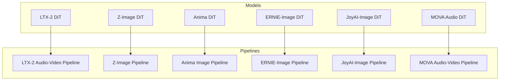
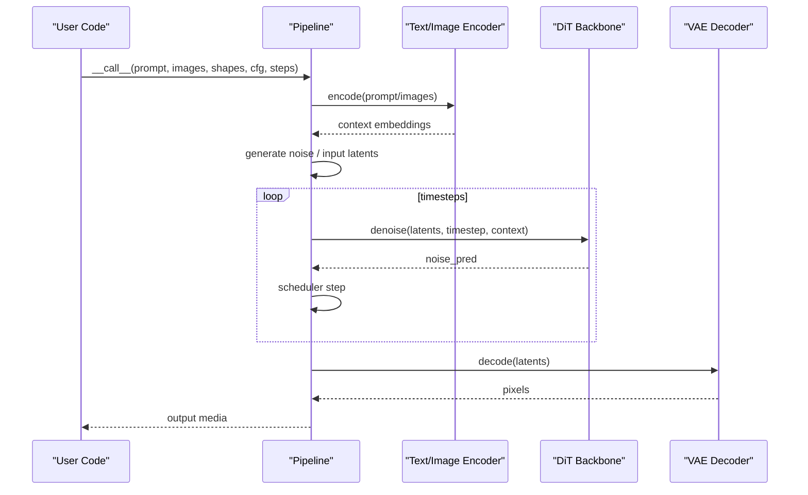
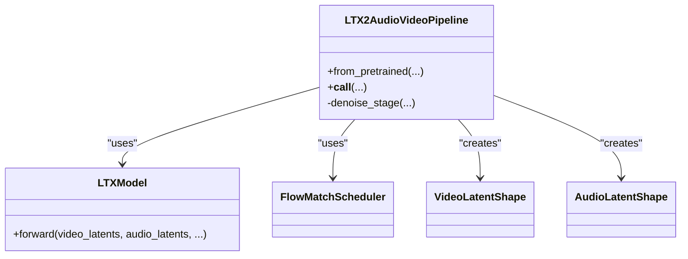
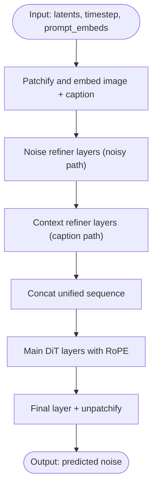
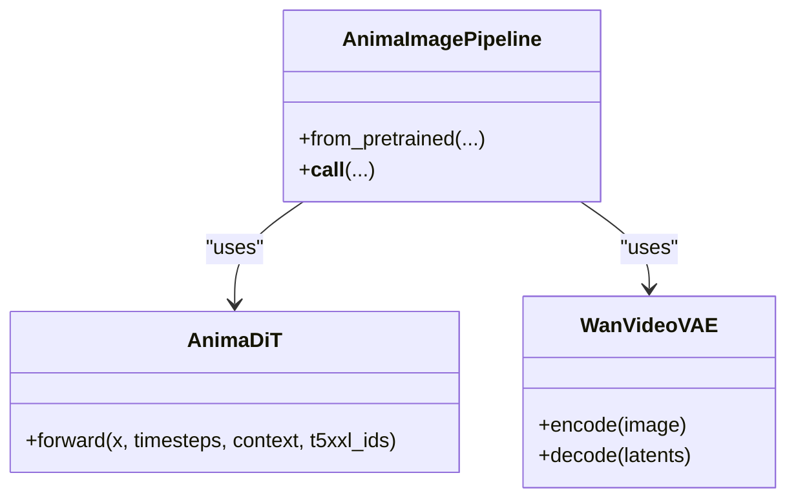
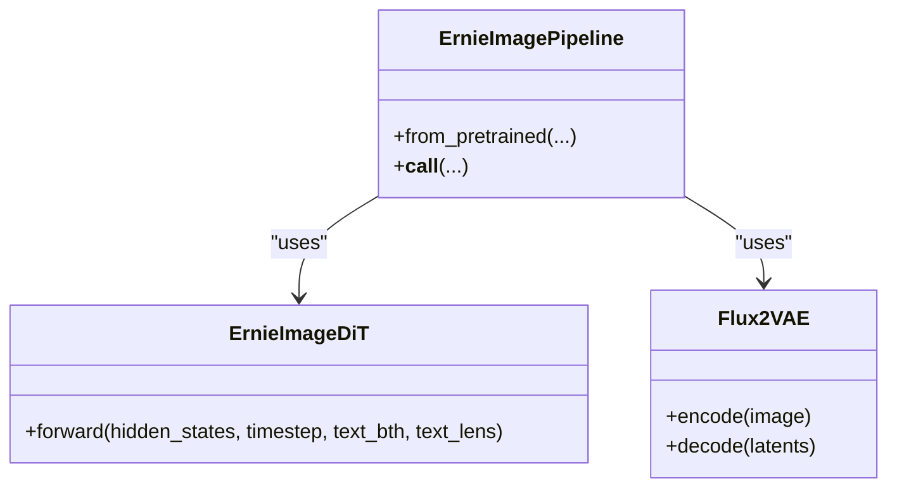
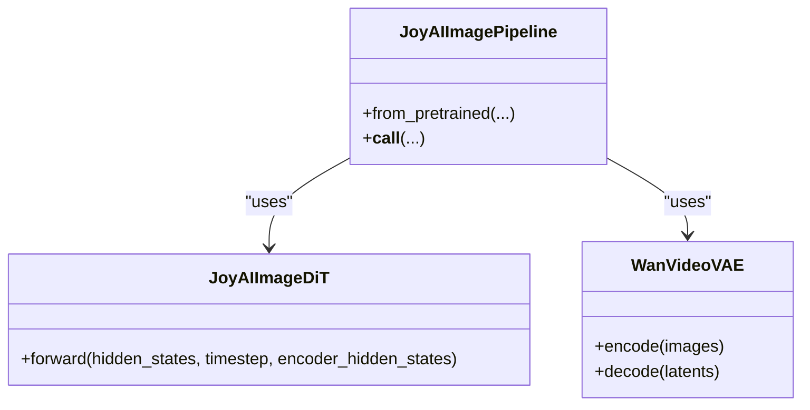
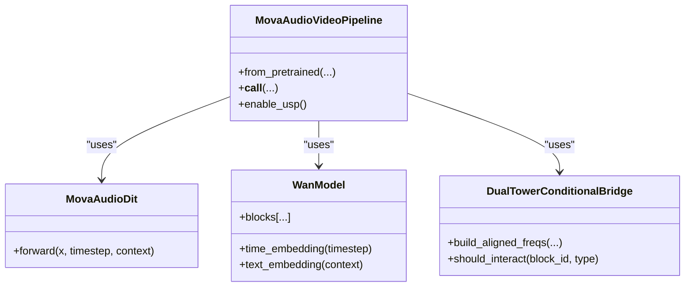
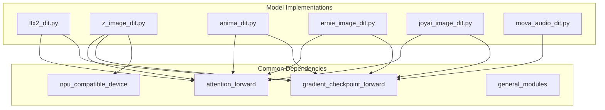

# Other Models API

<cite>
**Referenced Files in This Document**
- [ltx2_dit.py](file://diffsynth/models/ltx2_dit.py)
- [ltx2_audio_video.py](file://diffsynth/pipelines/ltx2_audio_video.py)
- [z_image_dit.py](file://diffsynth/models/z_image_dit.py)
- [z_image.py](file://diffsynth/pipelines/z_image.py)
- [anima_dit.py](file://diffsynth/models/anima_dit.py)
- [anima_image.py](file://diffsynth/pipelines/anima_image.py)
- [ernie_image_dit.py](file://diffsynth/models/ernie_image_dit.py)
- [ernie_image.py](file://diffsynth/pipelines/ernie_image.py)
- [joyai_image_dit.py](file://diffsynth/models/joyai_image_dit.py)
- [joyai_image.py](file://diffsynth/pipelines/joyai_image.py)
- [mova_audio_dit.py](file://diffsynth/models/mova_audio_dit.py)
- [mova_audio_video.py](file://diffsynth/pipelines/mova_audio_video.py)
</cite>

## Table of Contents
1. [Introduction](#introduction)
2. [Project Structure](#project-structure)
3. [Core Components](#core-components)
4. [Architecture Overview](#architecture-overview)
5. [Detailed Component Analysis](#detailed-component-analysis)
6. [Dependency Analysis](#dependency-analysis)
7. [Performance Considerations](#performance-considerations)
8. [Troubleshooting Guide](#troubleshooting-guide)
9. [Conclusion](#conclusion)
10. [Appendices](#appendices)

## Introduction
This document provides comprehensive API documentation for additional model implementations beyond the core FLUX and Qwen families: LTX-2 audio-video models, Z-Image models, Anima models, ERNIE-Image models, JoyAI-Image models, and MOVA audio models. It explains their architectures, unique features, integration patterns with DiffSynth pipelines, model-specific configurations, forward passes, specialized operations, usage examples, selection criteria, and performance characteristics.

## Project Structure
The repository organizes models under diffs/models and corresponding inference pipelines under diffs/pipelines. Each model family typically includes:
- A DiT or transformer backbone implementation
- Optional text/image encoders and VAEs
- A pipeline that composes units (shape checks, prompt embedding, noise initialization, conditioning, denoising loop, decoding)
- Example scripts under examples/<family>/model_inference

**Section sources**
- [ltx2_dit.py:1-120](file://diffsynth/models/ltx2_dit.py#L1-L120)
- [ltx2_audio_video.py:28-148](file://diffsynth/pipelines/ltx2_audio_video.py#L28-L148)
- [z_image_dit.py:326-450](file://diffsynth/models/z_image_dit.py#L326-L450)
- [z_image.py:27-92](file://diffsynth/pipelines/z_image.py#L27-L92)
- [anima_dit.py:756-800](file://diffsynth/models/anima_dit.py#L756-L800)
- [anima_image.py:21-71](file://diffsynth/pipelines/anima_image.py#L21-L71)
- [ernie_image_dit.py:240-289](file://diffsynth/models/ernie_image_dit.py#L240-L289)
- [ernie_image.py:21-64](file://diffsynth/pipelines/ernie_image.py#L21-L64)
- [joyai_image_dit.py:491-548](file://diffsynth/models/joyai_image_dit.py#L491-L548)
- [joyai_image.py:15-62](file://diffsynth/pipelines/joyai_image.py#L15-L62)
- [mova_audio_dit.py:11-51](file://diffsynth/models/mova_audio_dit.py#L11-L51)
- [mova_audio_video.py:25-112](file://diffsynth/pipelines/mova_audio_video.py#L25-L112)

## Core Components
- LTX-2 Audio-Video: Multi-modal DiT supporting joint video and audio latent denoising with separate patchifiers, per-modality RoPE, cross-modality attention perturbations, and two-stage upscaling.
- Z-Image: Unified sequence modeling over image tokens and caption tokens, optional SigLIP features for Omni variant, ControlNet support, and per-token modulation for noisy/clean paths.
- Anima: Video-capable DiT with 3D RoPE, AdaLN-LoRA modulation, and a Wan VAE decoder; supports both single-image and multi-frame inputs.
- ERNIE-Image: SharedAdaLN DiT with 3D RoPE and joint image-text attention; uses Flux2-style timestep embedders and RMSNorm variants.
- JoyAI-Image: Dual-stream DiT with separate text and image branches, modulated by shared vectors, using 3D RoPE and Wan VAE decoder.
- MOVA Audio: Audio-only DiT built on top of WanModel with 1D frequency-aligned RoPE and dual-tower bridge to synchronize audio and video latents during generation.

**Section sources**
- [ltx2_dit.py:154-226](file://diffsynth/models/ltx2_dit.py#L154-L226)
- [z_image_dit.py:326-450](file://diffsynth/models/z_image_dit.py#L326-L450)
- [anima_dit.py:756-800](file://diffsynth/models/anima_dit.py#L756-L800)
- [ernie_image_dit.py:240-289](file://diffsynth/models/ernie_image_dit.py#L240-L289)
- [joyai_image_dit.py:491-548](file://diffsynth/models/joyai_image_dit.py#L491-L548)
- [mova_audio_dit.py:11-51](file://diffsynth/models/mova_audio_dit.py#L11-L51)

## Architecture Overview
Each model follows a consistent pattern:
- Text/Image encoder(s) produce context embeddings
- DiT processes latents with timestep conditioning and positional embeddings (RoPE variants)
- VAE decodes latents to pixel space
- Pipelines orchestrate units for preprocessing, conditioning, denoising steps, and postprocessing

**Diagram sources**
- [ltx2_audio_video.py:168-249](file://diffsynth/pipelines/ltx2_audio_video.py#L168-L249)
- [z_image.py:94-166](file://diffsynth/pipelines/z_image.py#L94-L166)
- [anima_image.py:73-133](file://diffsynth/pipelines/anima_image.py#L73-L133)
- [ernie_image.py:66-117](file://diffsynth/pipelines/ernie_image.py#L66-L117)
- [joyai_image.py:64-130](file://diffsynth/pipelines/joyai_image.py#L64-L130)
- [mova_audio_video.py:114-197](file://diffsynth/pipelines/mova_audio_video.py#L114-L197)

## Detailed Component Analysis

### LTX-2 Audio-Video Models
Key aspects:
- Joint video/audio latent denoising with separate patchifiers and position grids
- Per-modality timestep embeddings and cross-modality attention perturbation controls
- Two-stage pipeline with optional upsampler and LoRA switching
- Strong negative prompts tailored for audio-video artifacts

**Diagram sources**
- [ltx2_audio_video.py:28-148](file://diffsynth/pipelines/ltx2_audio_video.py#L28-L148)
- [ltx2_dit.py:1-120](file://diffsynth/models/ltx2_dit.py#L1-L120)

Usage highlights:
- Supports T2AV, I2AV, A2V, camera control, in-context videos, and distilled/two-stage modes
- CFG-guided model function returns separate noise predictions for video and audio
- Positional coordinates normalized by frame rate and scaled for in-context downsampling

Configuration tips:
- For distilled pipeline, CFG is disabled automatically
- Two-stage requires stage2_lora_config and an upsampler
- Resolution must be divisible by 32 (one-stage) or 64 (two-stage)

Performance notes:
- Gradient checkpointing supported in DiT
- VRAM management via unit-based model loading/unloading
- Tiling options for VAE decoding reduce memory pressure

**Section sources**
- [ltx2_audio_video.py:168-249](file://diffsynth/pipelines/ltx2_audio_video.py#L168-L249)
- [ltx2_audio_video.py:252-646](file://diffsynth/pipelines/ltx2_audio_video.py#L252-L646)
- [ltx2_audio_video.py:648-732](file://diffsynth/pipelines/ltx2_audio_video.py#L648-L732)
- [ltx2_dit.py:154-226](file://diffsynth/models/ltx2_dit.py#L154-L226)

### Z-Image Models
Key aspects:
- Unified sequence of image tokens and caption tokens; optional SigLIP features for Omni variant
- Per-token modulation for noisy/clean paths enabling noise refinement and context refinement stages
- ControlNet integration for inpainting/control signals
- NPU fusion patches for improved performance on NPUs

**Diagram sources**
- [z_image.py:567-673](file://diffsynth/pipelines/z_image.py#L567-L673)
- [z_image_dit.py:326-450](file://diffsynth/models/z_image_dit.py#L326-L450)

Usage highlights:
- Turbo vs Omni variants use different prompt encoding strategies
- ControlNet supports single control image and optional inpaint mask
- Image-to-LoRA style transfer via SigLIP2 + DINOv3 encoders

Configuration tips:
- Height/width must be divisible by 16
- Sigma shift parameter available for scheduler tuning
- NPU patch enabled by default for better speed on NPUs

Performance notes:
- Gradient checkpointing across transformer blocks
- Separate refiners for noise and context improve stability
- Attention masks handle variable-length captions

**Section sources**
- [z_image.py:94-166](file://diffsynth/pipelines/z_image.py#L94-L166)
- [z_image.py:447-500](file://diffsynth/pipelines/z_image.py#L447-L500)
- [z_image.py:567-673](file://diffsynth/pipelines/z_image.py#L567-L673)
- [z_image_dit.py:326-450](file://diffsynth/models/z_image_dit.py#L326-L450)

### Anima Models
Key aspects:
- Video DiT with 3D RoPE and AdaLN-LoRA modulation
- Supports both single-image and multi-frame inputs
- Uses Wan VAE for decoding

**Diagram sources**
- [anima_image.py:21-71](file://diffsynth/pipelines/anima_image.py#L21-L71)
- [anima_dit.py:756-800](file://diffsynth/models/anima_dit.py#L756-L800)

Usage highlights:
- Prompt encoding uses both Z-Image text encoder and T5 tokenizer
- Input images can be single or multiple frames; latents are handled accordingly
- Scheduler uses FlowMatch with sigma shift option

Configuration tips:
- Height/width divisible by 16
- CFG scale defaults to 4.0
- Supports gradient checkpointing

Performance notes:
- Efficient 3D RoPE reduces memory overhead
- AdaLN-LoRA enables efficient fine-tuning

**Section sources**
- [anima_image.py:73-133](file://diffsynth/pipelines/anima_image.py#L73-L133)
- [anima_image.py:243-265](file://diffsynth/pipelines/anima_image.py#L243-L265)
- [anima_dit.py:756-800](file://diffsynth/models/anima_dit.py#L756-L800)

### ERNIE-Image Models
Key aspects:
- SharedAdaLN DiT with 3D RoPE and joint image-text attention
- Uses Flux2-style timestep embedders and RMSNorm variants
- Single-stream attention processor with optional qk normalization

**Diagram sources**
- [ernie_image.py:21-64](file://diffsynth/pipelines/ernie_image.py#L21-L64)
- [ernie_image_dit.py:240-289](file://diffsynth/models/ernie_image_dit.py#L240-L289)

Usage highlights:
- Text encoder outputs hidden states from second-to-last layer
- Padding and masking handle variable-length prompts
- Supports both T2I and I2I workflows

Configuration tips:
- Height/width divisible by 16
- CFG scale defaults to 4.0
- Sigma shift parameter for scheduler tuning

Performance notes:
- Gradient checkpointing supported
- RMSNorm improves numerical stability

**Section sources**
- [ernie_image.py:66-117](file://diffsynth/pipelines/ernie_image.py#L66-L117)
- [ernie_image.py:248-267](file://diffsynth/pipelines/ernie_image.py#L248-L267)
- [ernie_image_dit.py:240-289](file://diffsynth/models/ernie_image_dit.py#L240-L289)

### JoyAI-Image Models
Key aspects:
- Dual-stream DiT with separate text and image branches
- Modulation via shared vectors with separate tables for each stream
- 3D RoPE for spatial-temporal positioning
- Uses Wan VAE for decoding

**Diagram sources**
- [joyai_image.py:15-62](file://diffsynth/pipelines/joyai_image.py#L15-L62)
- [joyai_image_dit.py:491-548](file://diffsynth/models/joyai_image_dit.py#L491-L548)

Usage highlights:
- Prompt templates support image/video descriptions
- Edit image processing supports tiled encoding for large images
- Multi-item input handling for batched reference images

Configuration tips:
- Height/width divisible by 16
- CFG scale defaults to 5.0
- Tiling parameters for memory efficiency

Performance notes:
- Dual-stream architecture balances text and image processing
- Gradient checkpointing available

**Section sources**
- [joyai_image.py:64-130](file://diffsynth/pipelines/joyai_image.py#L64-L130)
- [joyai_image.py:258-283](file://diffsynth/pipelines/joyai_image.py#L258-L283)
- [joyai_image_dit.py:491-548](file://diffsynth/models/joyai_image_dit.py#L491-L548)

### MOVA Audio Models
Key aspects:
- Audio-only DiT built on WanModel with 1D frequency-aligned RoPE
- Dual-tower bridge synchronizes audio and video representations
- Supports unified sequence parallelism for distributed inference

**Diagram sources**
- [mova_audio_video.py:25-112](file://diffsynth/pipelines/mova_audio_video.py#L25-L112)
- [mova_audio_dit.py:11-51](file://diffsynth/models/mova_audio_dit.py#L11-L51)

Usage highlights:
- Switches between high-noise and low-noise video DiTs based on timestep boundary
- Audio preprocessing includes mono conversion and resampling
- Supports first-last frame conditioning for video generation

Configuration tips:
- Height/width divisible by 16, time divisible by 4
- CFG scale defaults to 5.0
- Unified sequence parallelism available for multi-GPU setups

Performance notes:
- Gradient checkpointing across all transformer blocks
- Sequence parallelism reduces memory footprint
- Dual-tower bridge enables efficient cross-modal interaction

**Section sources**
- [mova_audio_video.py:114-197](file://diffsynth/pipelines/mova_audio_video.py#L114-L197)
- [mova_audio_video.py:348-462](file://diffsynth/pipelines/mova_audio_video.py#L348-L462)
- [mova_audio_dit.py:11-51](file://diffsynth/models/mova_audio_dit.py#L11-L51)

## Dependency Analysis
The models share common dependencies:
- Core attention mechanisms from `..core.attention`
- Gradient checkpointing utilities from `..core.gradient`
- Device compatibility utilities from `..core.device`
- Common modules like RMSNorm and general utilities

**Diagram sources**
- [ltx2_dit.py:1-20](file://diffsynth/models/ltx2_dit.py#L1-L20)
- [z_image_dit.py:1-15](file://diffsynth/models/z_image_dit.py#L1-L15)
- [anima_dit.py:1-15](file://diffsynth/models/anima_dit.py#L1-L15)
- [ernie_image_dit.py:1-20](file://diffsynth/models/ernie_image_dit.py#L1-L20)
- [joyai_image_dit.py:1-15](file://diffsynth/models/joyai_image_dit.py#L1-L15)
- [mova_audio_dit.py:1-10](file://diffsynth/models/mova_audio_dit.py#L1-L10)

**Section sources**
- [ltx2_dit.py:1-20](file://diffsynth/models/ltx2_dit.py#L1-L20)
- [z_image_dit.py:1-15](file://diffsynth/models/z_image_dit.py#L1-L15)
- [anima_dit.py:1-15](file://diffsynth/models/anima_dit.py#L1-L15)
- [ernie_image_dit.py:1-20](file://diffsynth/models/ernie_image_dit.py#L1-L20)
- [joyai_image_dit.py:1-15](file://diffsynth/models/joyai_image_dit.py#L1-L15)
- [mova_audio_dit.py:1-10](file://diffsynth/models/mova_audio_dit.py#L1-L10)

## Performance Considerations
- **Gradient Checkpointing**: All models support gradient checkpointing to reduce memory usage during training and inference
- **VRAM Management**: Pipelines implement dynamic model loading/unloading to optimize memory usage
- **Tiling**: VAE decoding supports tiling for large resolutions to prevent OOM errors
- **NPU Optimization**: Z-Image models include NPU fusion patches for improved performance
- **Sequence Parallelism**: MOVA supports unified sequence parallelism for distributed inference
- **Mixed Precision**: Most models operate in bfloat16 for optimal performance/memory trade-off

## Troubleshooting Guide
Common issues and solutions:
- **Resolution Errors**: Ensure height/width are divisible by required factors (typically 16 for image models, 32/64 for LTX-2)
- **Memory Issues**: Enable tiling, reduce batch size, or use gradient checkpointing
- **NPU Compatibility**: Use provided NPU patches for Z-Image models
- **Prompt Length**: Some models have maximum sequence length limits (e.g., 512 for Z-Image)
- **Audio Sample Rate**: MOVA requires specific sample rates; preprocessing handles resampling automatically

**Section sources**
- [z_image.py:676-690](file://diffsynth/pipelines/z_image.py#L676-L690)
- [ltx2_audio_video.py:275-296](file://diffsynth/pipelines/ltx2_audio_video.py#L275-L296)
- [mova_audio_video.py:248-267](file://diffsynth/pipelines/mova_audio_video.py#L248-L267)

## Conclusion
These additional model implementations extend DiffSynth's capabilities across audio-video generation, image editing, and multimodal synthesis. Each model offers unique architectural innovations while maintaining consistent integration patterns through the pipeline framework. The documented APIs enable flexible configuration, efficient inference, and seamless integration with existing workflows.

## Appendices

### Model Selection Criteria
- **LTX-2**: Best for high-quality audio-video generation with advanced control features
- **Z-Image**: Ideal for image generation/editing with strong text understanding and ControlNet support
- **Anima**: Suitable for video generation tasks with temporal coherence
- **ERNIE-Image**: Good for text-to-image generation with Chinese language support
- **JoyAI-Image**: Excellent for image editing with detailed prompt understanding
- **MOVA**: Specialized for audio-video synchronization tasks

### Usage Examples
Each model family includes example scripts in the examples directory demonstrating various use cases from basic generation to advanced control scenarios.