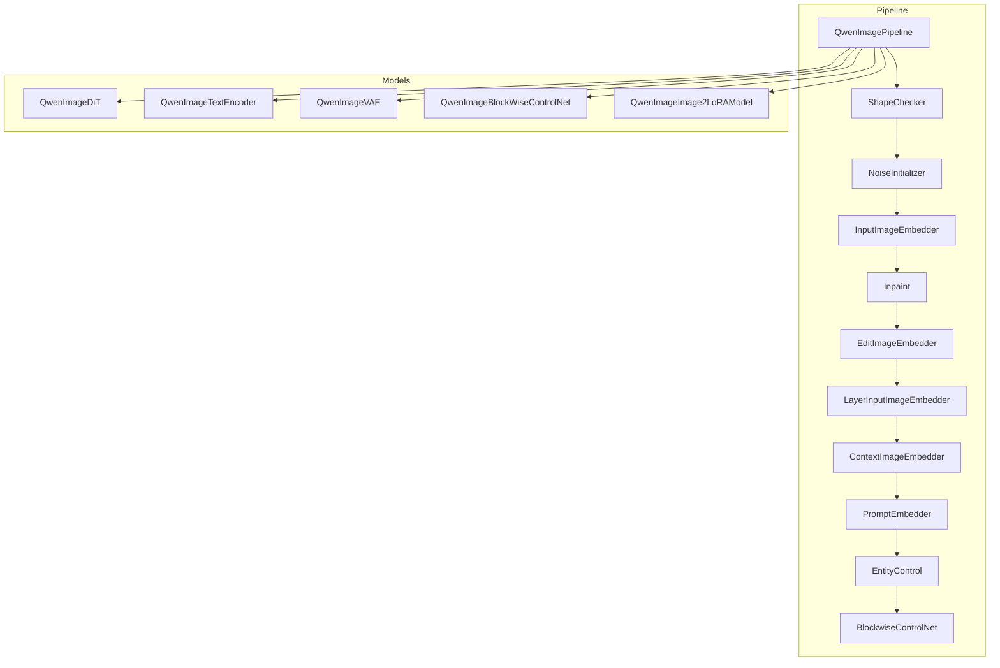
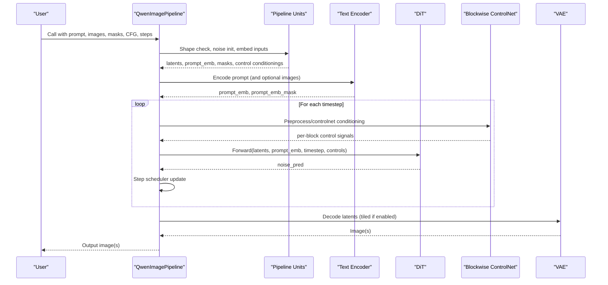
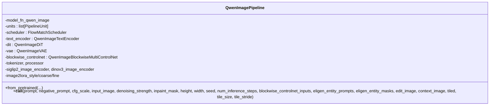
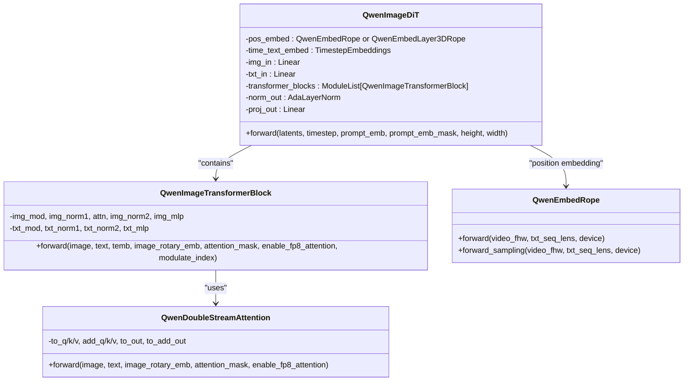
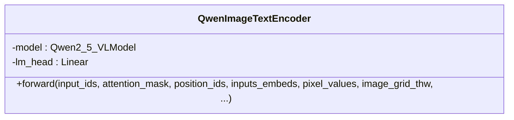
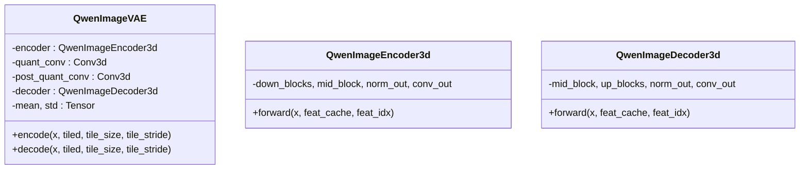
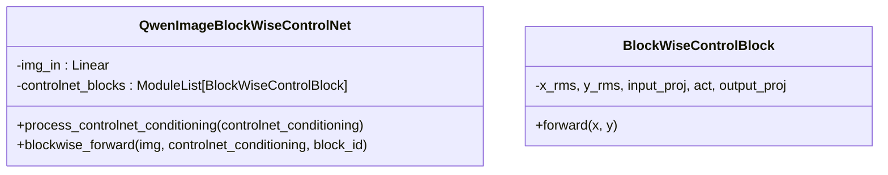
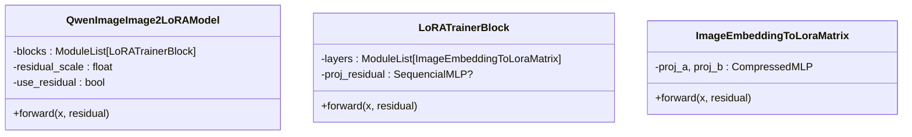
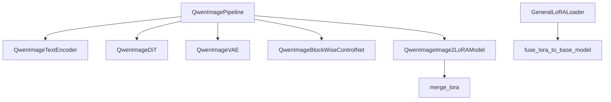

# Qwen-Image Models API

<cite>
**Referenced Files in This Document**
- [qwen_image.py](file://diffsynth/pipelines/qwen_image.py)
- [qwen_image_dit.py](file://diffsynth/models/qwen_image_dit.py)
- [qwen_image_text_encoder.py](file://diffsynth/models/qwen_image_text_encoder.py)
- [qwen_image_vae.py](file://diffsynth/models/qwen_image_vae.py)
- [qwen_image_controlnet.py](file://diffsynth/models/qwen_image_controlnet.py)
- [qwen_image_image2lora.py](file://diffsynth/models/qwen_image_image2lora.py)
- [merge.py](file://diffsynth/utils/lora/merge.py)
- [general.py](file://diffsynth/utils/lora/general.py)
- [Qwen-Image.py](file://examples/qwen_image/model_inference/Qwen-Image.py)
- [Qwen-Image-Edit.py](file://examples/qwen_image/model_inference/Qwen-Image-Edit.py)
- [Qwen-Image-Blockwise-ControlNet-Inpaint.py](file://examples/qwen_image/model_inference/Qwen-Image-Blockwise-ControlNet-Inpaint.py)
- [Qwen-Image-i2L.py](file://examples/qwen_image/model_inference/Qwen-Image-i2L.py)
- [Qwen-Image-Layered.py](file://examples/qwen_image/model_inference/Qwen-Image-Layered.py)
- [Qwen-Image-EliGen.py](file://examples/qwen_image/model_inference/Qwen-Image-EliGen.py)
- [Qwen-Image.md](file://docs/en/Model_Details/Qwen-Image.md)
</cite>

## Table of Contents
1. Introduction
2. Project Structure
3. Core Components
4. Architecture Overview
5. Detailed Component Analysis
6. Dependency Analysis
7. Performance Considerations
8. Troubleshooting Guide
9. Conclusion
10. Appendices

## Introduction
This document provides comprehensive API documentation for the Qwen-Image model implementations within the repository. It covers image understanding and editing capabilities, DiT architecture, text encoder integration, VAE components, ControlNet support, and LoRA functionality. It also details image manipulation operations, editing workflows, multi-modal processing, conditional generation, and practical examples including style transfer, inpainting, and advanced editing scenarios. Guidance on image format handling, quality preservation, and performance optimization is included.

## Project Structure
The Qwen-Image implementation is organized into:
- Pipeline orchestration and units for preprocessing, conditioning, control, and decoding
- DiT transformer blocks with dual-stream attention and RoPE embeddings
- Text encoder wrapping a large vision-language model
- 3D causal VAE encoder/decoder with tiling support
- Blockwise ControlNet modules for spatially-aware conditioning
- Image-to-LoRA models for style/content-driven latent modulation
- Example scripts demonstrating text-to-image, editing, inpainting, layered outputs, and i2L workflows

**Diagram sources**
- [qwen_image.py:25-198](file://diffsynth/pipelines/qwen_image.py#L25-L198)
- [qwen_image_dit.py:590-728](file://diffsynth/models/qwen_image_dit.py#L590-L728)
- [qwen_image_text_encoder.py:5-191](file://diffsynth/models/qwen_image_text_encoder.py#L5-L191)
- [qwen_image_vae.py:643-754](file://diffsynth/models/qwen_image_vae.py#L643-L754)
- [qwen_image_controlnet.py:29-57](file://diffsynth/models/qwen_image_controlnet.py#L29-L57)
- [qwen_image_image2lora.py:74-129](file://diffsynth/models/qwen_image_image2lora.py#L74-L129)

**Section sources**
- [qwen_image.py:25-198](file://diffsynth/pipelines/qwen_image.py#L25-L198)
- [Qwen-Image.md:1-206](file://docs/en/Model_Details/Qwen-Image.md#L1-L206)

## Core Components
- QwenImagePipeline: Orchestrates inference steps, manages VRAM, and composes pipeline units for input conditioning, prompt encoding, ControlNet application, denoising loop, and VAE decoding.
- QwenImageDiT: A DiT backbone with dual-stream attention (image-text), RMSNorm, AdaLayerNorm, and 3D RoPE position embeddings; supports entity masks and blockwise ControlNet injection.
- QwenImageTextEncoder: Wraps a Qwen2.5 VL model to produce hidden states for prompts and multimodal inputs.
- QwenImageVAE: 3D causal encoder/decoder with tiled encode/decode for memory efficiency; includes mean/std normalization for latents.
- QwenImageBlockWiseControlNet: Per-block control signals injected into DiT via linear projections and residual additions.
- QwenImageImage2LoRAModel: Generates LoRA weights from images using SigLIP2/DINOv3 features and optional QwenVL residuals; merged via utility functions.

Key parameters exposed by the pipeline include prompt/negative_prompt, cfg_scale, input_image/denoising_strength, inpaint_mask and blur options, height/width, seed/rand_device, num_inference_steps, blockwise_controlnet_inputs, EliGen entity controls, edit_image variants, context_image, and tiled VAE options.

**Section sources**
- [qwen_image.py:25-198](file://diffsynth/pipelines/qwen_image.py#L25-L198)
- [qwen_image_dit.py:590-728](file://diffsynth/models/qwen_image_dit.py#L590-L728)
- [qwen_image_text_encoder.py:5-191](file://diffsynth/models/qwen_image_text_encoder.py#L5-L191)
- [qwen_image_vae.py:643-754](file://diffsynth/models/qwen_image_vae.py#L643-L754)
- [qwen_image_controlnet.py:29-57](file://diffsynth/models/qwen_image_controlnet.py#L29-L57)
- [qwen_image_image2lora.py:74-129](file://diffsynth/models/qwen_image_image2lora.py#L74-L129)

## Architecture Overview
The Qwen-Image system integrates text and image modalities through a DiT-based diffusion process guided by a flow-matching scheduler. The pipeline encodes prompts and optional images, prepares noise and masks, applies ControlNet signals per block, iteratively denoises latents, and decodes final images via the VAE.

**Diagram sources**
- [qwen_image.py:100-198](file://diffsynth/pipelines/qwen_image.py#L100-L198)
- [qwen_image_dit.py:696-728](file://diffsynth/models/qwen_image_dit.py#L696-L728)
- [qwen_image_controlnet.py:52-57](file://diffsynth/models/qwen_image_controlnet.py#L52-L57)
- [qwen_image_vae.py:732-754](file://diffsynth/models/qwen_image_vae.py#L732-L754)

## Detailed Component Analysis

### QwenImagePipeline
- Responsibilities:
  - Model loading and VRAM management
  - Unit composition for preprocessing, conditioning, and decoding
  - CFG-guided denoising loop with FlowMatchScheduler
  - Tiled VAE decode for memory efficiency
- Key methods:
  - from_pretrained: Loads tokenizer, processor, encoders, DiT, VAE, ControlNet, and image-to-LoRA models
  - __call__: Executes units, runs denoising loop, decodes output, handles layer_num for layered outputs

**Diagram sources**
- [qwen_image.py:25-198](file://diffsynth/pipelines/qwen_image.py#L25-L198)

**Section sources**
- [qwen_image.py:25-198](file://diffsynth/pipelines/qwen_image.py#L25-L198)

### QwenImageDiT (DiT Architecture)
- Dual-stream attention combining image and text tokens
- 3D RoPE embeddings for spatial-temporal consistency
- AdaLayerNorm and RMSNorm for modulation
- Supports entity masks and blockwise ControlNet injection
- Optional FP8 attention path when available

**Diagram sources**
- [qwen_image_dit.py:590-728](file://diffsynth/models/qwen_image_dit.py#L590-L728)
- [qwen_image_dit.py:362-432](file://diffsynth/models/qwen_image_dit.py#L362-L432)
- [qwen_image_dit.py:60-166](file://diffsynth/models/qwen_image_dit.py#L60-L166)

**Section sources**
- [qwen_image_dit.py:590-728](file://diffsynth/models/qwen_image_dit.py#L590-L728)

### QwenImageTextEncoder
- Wraps Qwen2.5 VL model to produce hidden states
- Supports both text-only and multimodal inputs (pixel_values, image_grid_thw)
- Returns last hidden states for prompt embeddings

**Diagram sources**
- [qwen_image_text_encoder.py:5-191](file://diffsynth/models/qwen_image_text_encoder.py#L5-L191)

**Section sources**
- [qwen_image_text_encoder.py:5-191](file://diffsynth/models/qwen_image_text_encoder.py#L5-L191)

### QwenImageVAE
- 3D causal encoder/decoder with residual blocks and attention
- Causal convolutions with feature caching for efficient inference
- Tiled encode/decode to reduce VRAM usage
- Mean/std normalization for latent space

**Diagram sources**
- [qwen_image_vae.py:643-754](file://diffsynth/models/qwen_image_vae.py#L643-L754)
- [qwen_image_vae.py:345-451](file://diffsynth/models/qwen_image_vae.py#L345-L451)
- [qwen_image_vae.py:524-640](file://diffsynth/models/qwen_image_vae.py#L524-L640)

**Section sources**
- [qwen_image_vae.py:643-754](file://diffsynth/models/qwen_image_vae.py#L643-L754)

### QwenImageBlockWiseControlNet
- Per-block control signal projection and residual addition
- Process conditioning images into latent space and inject into DiT blocks

**Diagram sources**
- [qwen_image_controlnet.py:29-57](file://diffsynth/models/qwen_image_controlnet.py#L29-L57)

**Section sources**
- [qwen_image_controlnet.py:29-57](file://diffsynth/models/qwen_image_controlnet.py#L29-L57)

### QwenImageImage2LoRAModel
- Encodes images using SigLIP2 and DINOv3, optionally adds QwenVL residuals
- Produces LoRA matrices for DiT layers across all transformer blocks
- Supports residual scaling and bias merging

**Diagram sources**
- [qwen_image_image2lora.py:74-129](file://diffsynth/models/qwen_image_image2lora.py#L74-L129)
- [qwen_image_image2lora.py:4-47](file://diffsynth/models/qwen_image_image2lora.py#L4-L47)

**Section sources**
- [qwen_image_image2lora.py:74-129](file://diffsynth/models/qwen_image_image2lora.py#L74-L129)

## Dependency Analysis
- Pipeline depends on:
  - Text encoder for prompt embeddings
  - DiT for denoising
  - VAE for encoding/decoding
  - ControlNet for spatial conditioning
  - Image-to-LoRA for style/content-driven modulation
- Utilities:
  - merge_lora combines multiple LoRA dicts into one
  - GeneralLoRALoader converts standard LoRA formats and fuses into base models

**Diagram sources**
- [qwen_image.py:25-198](file://diffsynth/pipelines/qwen_image.py#L25-L198)
- [merge.py:11-21](file://diffsynth/utils/lora/merge.py#L11-L21)
- [general.py:52-71](file://diffsynth/utils/lora/general.py#L52-L71)

**Section sources**
- [qwen_image.py:25-198](file://diffsynth/pipelines/qwen_image.py#L25-L198)
- [merge.py:11-21](file://diffsynth/utils/lora/merge.py#L11-L21)
- [general.py:52-71](file://diffsynth/utils/lora/general.py#L52-L71)

## Performance Considerations
- Use tiled VAE encode/decode to reduce VRAM at the cost of slight errors and longer time
- Enable gradient checkpointing during training to save memory
- Leverage FP8 attention when available for faster inference
- Adjust denoising_strength and num_inference_steps to balance quality and speed
- Use VRAM management configurations for low-memory environments

[No sources needed since this section provides general guidance]

## Troubleshooting Guide
- Insufficient VRAM:
  - Enable tiled VAE and VRAM management
  - Reduce resolution or number of steps
- Prompt length warnings:
  - The text encoder warns if prompts exceed trained token limits; shorten prompts
- Mask alignment:
  - Ensure inpaint masks are resized to target dimensions and properly normalized
- ControlNet timing:
  - Verify start/end ranges for blockwise ControlNet activation align with inference progress

**Section sources**
- [qwen_image.py:386-396](file://diffsynth/pipelines/qwen_image.py#L386-L396)
- [qwen_image.py:523-564](file://diffsynth/pipelines/qwen_image.py#L523-L564)

## Conclusion
The Qwen-Image implementation offers a robust, modular framework for text-to-image generation, editing, inpainting, layered outputs, and style/content-driven LoRA generation. Its DiT architecture with dual-stream attention, 3D RoPE, and blockwise ControlNet enables precise control and high-quality results. The pipeline’s unit-based design simplifies customization and extension for new modalities and tasks.

[No sources needed since this section summarizes without analyzing specific files]

## Appendices

### API Usage Examples
- Text-to-image generation
- Image editing with auto-resize and fixed resize
- Inpainting with blockwise ControlNet
- Style/content LoRA generation and fusion
- Layered outputs for multi-resolution generation
- EliGen entity-controlled generation

**Section sources**
- [Qwen-Image.py:1-18](file://examples/qwen_image/model_inference/Qwen-Image.py#L1-L18)
- [Qwen-Image-Edit.py:1-26](file://examples/qwen_image/model_inference/Qwen-Image-Edit.py#L1-L26)
- [Qwen-Image-Blockwise-ControlNet-Inpaint.py:1-34](file://examples/qwen_image/model_inference/Qwen-Image-Blockwise-ControlNet-Inpaint.py#L1-L34)
- [Qwen-Image-i2L.py:1-111](file://examples/qwen_image/model_inference/Qwen-Image-i2L.py#L1-L111)
- [Qwen-Image-Layered.py:1-37](file://examples/qwen_image/model_inference/Qwen-Image-Layered.py#L1-L37)
- [Qwen-Image-EliGen.py:1-108](file://examples/qwen_image/model_inference/Qwen-Image-EliGen.py#L1-L108)

### Image Format Handling and Quality Preservation
- Input images are preprocessed to RGB tensors and normalized appropriately
- Masks are resized and averaged over channels for binary guidance
- VAE decoding preserves dtype and applies mean/std normalization
- Tiled decoding minimizes artifacts while reducing memory footprint

**Section sources**
- [qwen_image.py:266-284](file://diffsynth/pipelines/qwen_image.py#L266-L284)
- [qwen_image.py:338-355](file://diffsynth/pipelines/qwen_image.py#L338-L355)
- [qwen_image_vae.py:732-754](file://diffsynth/models/qwen_image_vae.py#L732-L754)

### Conditional Generation and Multi-Modal Processing
- Prompts encoded via Qwen2.5 VL with optional image tokens
- Edit images integrated through processor and text encoder
- Context images provide additional conditioning for in-context control
- Entity prompts and masks enable region-specific edits

**Section sources**
- [qwen_image.py:357-439](file://diffsynth/pipelines/qwen_image.py#L357-L439)
- [qwen_image.py:441-520](file://diffsynth/pipelines/qwen_image.py#L441-L520)
- [qwen_image.py:719-736](file://diffsynth/pipelines/qwen_image.py#L719-L736)