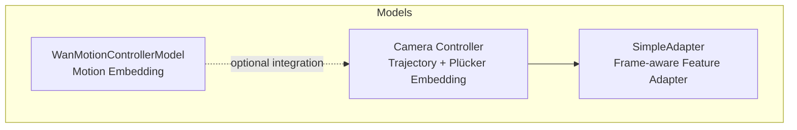
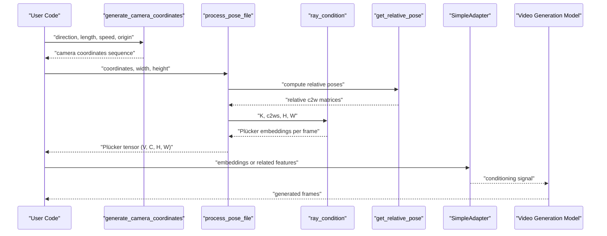
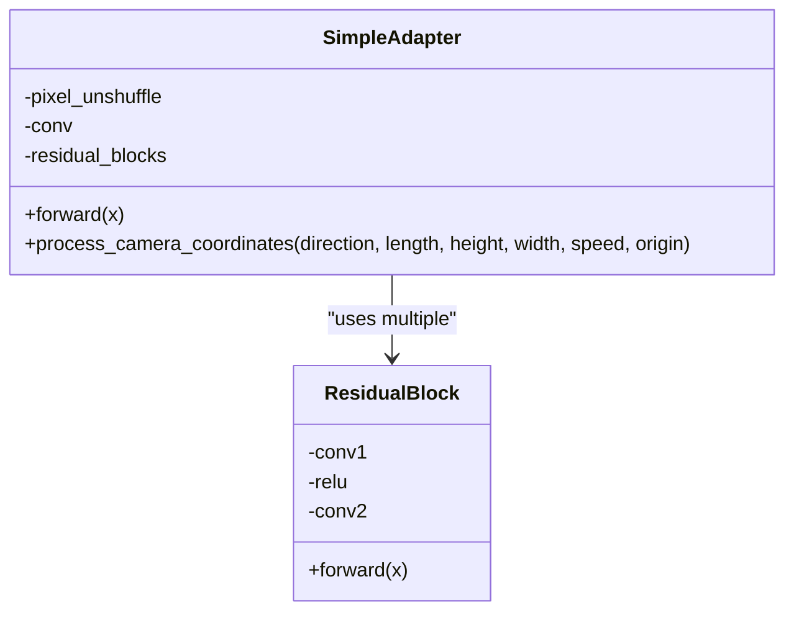
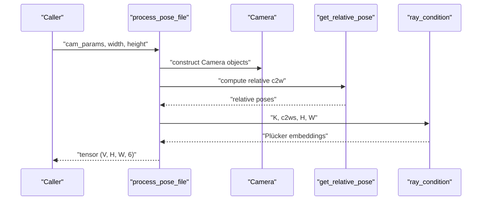
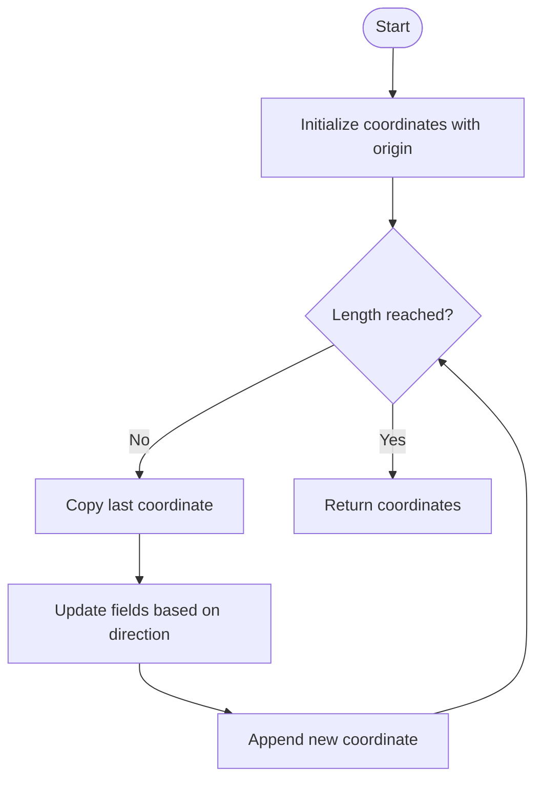

# Camera Controller API

<cite>
**Referenced Files in This Document**
- [wan_video_camera_controller.py](file://diffsynth/models/wan_video_camera_controller.py)
- [wan_video_motion_controller.py](file://diffsynth/models/wan_video_motion_controller.py)
</cite>

## Table of Contents
1. [Introduction](#introduction)
2. [Project Structure](#project-structure)
3. [Core Components](#core-components)
4. [Architecture Overview](#architecture-overview)
5. [Detailed Component Analysis](#detailed-component-analysis)
6. [Dependency Analysis](#dependency-analysis)
7. [Performance Considerations](#performance-considerations)
8. [Troubleshooting Guide](#troubleshooting-guide)
9. [Conclusion](#conclusion)
10. [Appendices](#appendices)

## Introduction
This document provides comprehensive API documentation for the WanVideo camera control systems. It explains how to define camera trajectories, manipulate viewpoints, and produce cinematic camera movements such as panning, tilting, zooming, and complex choreography. It also details the SimpleAdapter implementation used to embed camera information into video generation pipelines, camera parameter configuration (intrinsics and extrinsics), Plücker ray embeddings, calibration considerations, perspective correction across resolutions, and strategies for maintaining visual consistency during motion.

## Project Structure
The camera control functionality is implemented within the models module:
- wan_video_camera_controller.py: Core camera trajectory generation, Plücker embedding computation, and a lightweight adapter for integrating camera signals into diffusion-based video models.
- wan_video_motion_controller.py: A motion controller that produces motion embeddings used alongside camera control in some pipelines.

**Diagram sources**
- [wan_video_camera_controller.py:8-44](file://diffsynth/models/wan_video_camera_controller.py#L8-L44)
- [wan_video_camera_controller.py:77-107](file://diffsynth/models/wan_video_camera_controller.py#L77-L107)
- [wan_video_camera_controller.py:114-180](file://diffsynth/models/wan_video_camera_controller.py#L114-L180)
- [wan_video_motion_controller.py:7-22](file://diffsynth/models/wan_video_motion_controller.py#L7-L22)

**Section sources**
- [wan_video_camera_controller.py:1-207](file://diffsynth/models/wan_video_camera_controller.py#L1-L207)
- [wan_video_motion_controller.py:1-28](file://diffsynth/models/wan_video_motion_controller.py#L1-L28)

## Core Components
- SimpleAdapter: A frame-aware feature adapter that reduces spatial resolution via pixel unshuffle, applies a convolution, and refines features with residual blocks. It reshapes inputs to process frames efficiently and outputs tensors compatible with downstream modules.
- Camera class: Represents per-frame camera intrinsics and extrinsics, computing world-to-camera and camera-to-world matrices.
- Trajectory generators: Functions to generate camera coordinates over time for predefined directions (pan left/right, tilt up/down, dolly in/out).
- Plücker embedding pipeline: Converts camera parameters into Plücker ray embeddings per frame, enabling geometrically consistent conditioning across frames.
- Motion controller: Produces motion embeddings that can be combined with camera control for richer dynamics.

Key responsibilities:
- Define camera trajectories and compute per-frame poses.
- Convert poses and intrinsics into Plücker embeddings for stable conditioning.
- Provide an adapter to fuse camera signals into the video model’s latent space.

**Section sources**
- [wan_video_camera_controller.py:8-44](file://diffsynth/models/wan_video_camera_controller.py#L8-L44)
- [wan_video_camera_controller.py:77-107](file://diffsynth/models/wan_video_camera_controller.py#L77-L107)
- [wan_video_camera_controller.py:114-180](file://diffsynth/models/wan_video_camera_controller.py#L114-L180)
- [wan_video_camera_controller.py:184-206](file://diffsynth/models/wan_video_camera_controller.py#L184-L206)
- [wan_video_motion_controller.py:7-22](file://diffsynth/models/wan_video_motion_controller.py#L7-L22)

## Architecture Overview
The camera control system integrates with video generation pipelines by producing per-frame Plücker embeddings from camera trajectories and optionally combining them with motion embeddings. The SimpleAdapter processes these embeddings to match the model’s expected tensor shapes and semantics.

**Diagram sources**
- [wan_video_camera_controller.py:184-206](file://diffsynth/models/wan_video_camera_controller.py#L184-L206)
- [wan_video_camera_controller.py:150-180](file://diffsynth/models/wan_video_camera_controller.py#L150-L180)
- [wan_video_camera_controller.py:114-147](file://diffsynth/models/wan_video_camera_controller.py#L114-L147)
- [wan_video_camera_controller.py:92-107](file://diffsynth/models/wan_video_camera_controller.py#L92-L107)
- [wan_video_camera_controller.py:8-44](file://diffsynth/models/wan_video_camera_controller.py#L8-L44)

## Detailed Component Analysis

### SimpleAdapter
Purpose:
- Reduce spatial dimensions efficiently using pixel unshuffle.
- Apply a single convolution to map features to target channels.
- Refine features with residual blocks.
- Maintain batch and frame structure while processing.

Key behaviors:
- Input shape handling: permutes and flattens frame dimension to process all frames jointly.
- Pixel unshuffle downscale factor: 8.
- Convolution stride and padding: configured at initialization.
- Residual blocks: default count configurable; each block uses two convolutions with ReLU.
- Output shape: restores original frame dimension and reorders channels appropriately.

Usage pattern:
- Feed concatenated or transformed camera-related features through SimpleAdapter to obtain a compact representation suitable for injection into the video model.

Complexity:
- Spatial reduction via pixel unshuffle reduces memory footprint significantly before convolution.
- Residual blocks add minimal overhead while improving representational capacity.

Integration points:
- Typically used after generating Plücker embeddings or other camera-conditioned features to align channel dimensions and spatial scales with the model’s expectations.

**Section sources**
- [wan_video_camera_controller.py:8-44](file://diffsynth/models/wan_video_camera_controller.py#L8-L44)
- [wan_video_camera_controller.py:63-76](file://diffsynth/models/wan_video_camera_controller.py#L63-L76)

#### Class Diagram

**Diagram sources**
- [wan_video_camera_controller.py:8-44](file://diffsynth/models/wan_video_camera_controller.py#L8-L44)
- [wan_video_camera_controller.py:63-76](file://diffsynth/models/wan_video_camera_controller.py#L63-L76)

### Camera Pose and Intrinsics
Purpose:
- Represent per-frame camera intrinsics (fx, fy, cx, cy) and extrinsics (world-to-camera matrix).
- Compute relative poses to stabilize conditioning across frames.

Key behaviors:
- Camera class parses entries into intrinsic parameters and 3x4 extrinsic matrices, then computes inverse camera-to-world matrices.
- get_relative_pose normalizes poses relative to the first frame to avoid drift and ensure consistent coordinate frames.

Calibration and perspective correction:
- process_pose_file rescales intrinsics based on aspect ratio differences between original pose resolution and sample resolution, ensuring correct field-of-view and center alignment.
- ray_condition constructs normalized ray directions and transforms them into world space using c2w matrices, then computes Plücker embeddings (cross product of origin and direction concatenated with direction).

Output:
- Per-frame Plücker embeddings of shape (V, 6, H, W) rearranged to (V, H, W, 6) for convenient usage.

**Section sources**
- [wan_video_camera_controller.py:77-107](file://diffsynth/models/wan_video_camera_controller.py#L77-L107)
- [wan_video_camera_controller.py:150-180](file://diffsynth/models/wan_video_camera_controller.py#L150-L180)
- [wan_video_camera_controller.py:114-147](file://diffsynth/models/wan_video_camera_controller.py#L114-L147)

#### Sequence Diagram: Plücker Embedding Pipeline

**Diagram sources**
- [wan_video_camera_controller.py:150-180](file://diffsynth/models/wan_video_camera_controller.py#L150-L180)
- [wan_video_camera_controller.py:114-147](file://diffsynth/models/wan_video_camera_controller.py#L114-L147)
- [wan_video_camera_controller.py:92-107](file://diffsynth/models/wan_video_camera_controller.py#L92-L107)

### Trajectory Definition and Cinematic Movements
Supported directions:
- Left, Right: horizontal pan.
- Up, Down: vertical tilt.
- In, Out: dolly movement along optical axis.
- Combinations like LeftUp, LeftDown, RightUp, RightDown enable diagonal pans.

Behavior:
- generate_camera_coordinates builds a sequence of camera parameters by incrementing specific fields according to the chosen direction and speed.
- Default origin includes intrinsic and extrinsic seed values; users can override to customize starting pose.

Examples:
- Panning left: set direction="Left", choose length equal to number of frames, tune speed for smoothness.
- Tilting up: direction="Up".
- Zooming in/out: direction="In" or "Out".
- Complex choreography: combine multiple segments by chaining calls or interpolating origins.

**Section sources**
- [wan_video_camera_controller.py:184-206](file://diffsynth/models/wan_video_camera_controller.py#L184-L206)

#### Flowchart: Trajectory Generation

**Diagram sources**
- [wan_video_camera_controller.py:184-206](file://diffsynth/models/wan_video_camera_controller.py#L184-L206)

### Integration with Video Generation Pipelines
Typical workflow:
- Generate camera coordinates using generate_camera_coordinates.
- Convert to Plücker embeddings via process_pose_file.
- Optionally pass through SimpleAdapter to align features with model expectations.
- Combine with motion embeddings from WanMotionControllerModel if needed.
- Inject into the video model’s conditioning path (e.g., cross-attention or modulation layers) to guide camera motion during generation.

Notes:
- Ensure input tensor shapes match the adapter’s expectations (batch, frames, channels, height, width).
- Validate aspect ratios and intrinsic scaling to maintain consistent perspective across frames.

**Section sources**
- [wan_video_camera_controller.py:8-44](file://diffsynth/models/wan_video_camera_controller.py#L8-L44)
- [wan_video_camera_controller.py:150-180](file://diffsynth/models/wan_video_camera_controller.py#L150-L180)
- [wan_video_motion_controller.py:7-22](file://diffsynth/models/wan_video_motion_controller.py#L7-L22)

## Dependency Analysis
- SimpleAdapter depends on PyTorch modules (Conv2d, PixelUnshuffle, Sequential) and einops for tensor rearrangement.
- Camera utilities depend on NumPy for matrix operations and torch for meshgrid and linear algebra.
- Motion controller depends on sinusoidal embedding utilities from wan_video_dit.

Coupling:
- Low coupling between trajectory generation and embedding computation; both are modular functions.
- SimpleAdapter is independent of pose computation but designed to consume camera-related features.

Potential circular dependencies:
- None observed within the camera control module.

External integrations:
- Video generation models must accept Plücker embeddings or adapter outputs as conditioning signals.

**Section sources**
- [wan_video_camera_controller.py:1-6](file://diffsynth/models/wan_video_camera_controller.py#L1-L6)
- [wan_video_motion_controller.py:1-3](file://diffsynth/models/wan_video_motion_controller.py#L1-L3)

## Performance Considerations
- Pixel unshuffle reduces spatial resolution early, lowering memory and compute costs before convolution.
- Using contiguous views avoids unnecessary copies when reshaping frame dimensions.
- Batch-processing frames jointly improves throughput compared to per-frame loops.
- Avoid excessive residual blocks unless necessary; they increase depth and latency.
- For large resolutions, consider reducing kernel sizes or strides to balance quality and speed.

[No sources needed since this section provides general guidance]

## Troubleshooting Guide
Common issues and remedies:
- Mismatched tensor shapes: Ensure input to SimpleAdapter has correct batch/frame/channel ordering; verify permute and view operations align with expected shapes.
- Incorrect perspective: Verify intrinsic scaling in process_pose_file matches actual aspect ratios; check fx/fy/cx/cy adjustments.
- Drift in motion: Use get_relative_pose to normalize poses relative to the first frame; confirm c2w matrices are computed correctly.
- Slow inference: Reduce residual block count or use smaller kernels; leverage batched processing.

Debugging tips:
- Inspect intermediate Plücker embeddings to validate ray directions and origins.
- Visualize camera trajectories by plotting positions and orientations over frames.
- Compare generated frames with and without camera conditioning to isolate effects.

**Section sources**
- [wan_video_camera_controller.py:150-180](file://diffsynth/models/wan_video_camera_controller.py#L150-L180)
- [wan_video_camera_controller.py:114-147](file://diffsynth/models/wan_video_camera_controller.py#L114-L147)

## Conclusion
The WanVideo camera control system provides robust tools for defining camera trajectories, computing geometrically consistent Plücker embeddings, and integrating camera signals into video generation pipelines. With SimpleAdapter and motion controllers, users can achieve precise panning, tilting, zooming, and complex choreography while maintaining visual consistency across frames. Proper calibration and aspect ratio handling ensure accurate perspective correction, enabling high-quality cinematic camera movements.

[No sources needed since this section summarizes without analyzing specific files]

## Appendices

### API Reference Summary
- SimpleAdapter.forward(x): Processes frame-aware features with pixel unshuffle, convolution, and residual blocks.
- SimpleAdapter.process_camera_coordinates(direction, length, height, width, speed, origin): Generates Plücker embeddings from camera trajectory parameters.
- generate_camera_coordinates(direction, length, speed, origin): Builds camera coordinate sequences for specified motions.
- process_pose_file(cam_params, width, height, original_pose_width, original_pose_height, device, return_poses): Converts camera parameters into Plücker embeddings with intrinsic scaling.
- ray_condition(K, c2w, H, W, device): Computes Plücker embeddings from intrinsics and extrinsics.
- get_relative_pose(cam_params): Normalizes poses relative to the first frame.
- WanMotionControllerModel.forward(motion_bucket_id): Produces motion embeddings for additional dynamics.

**Section sources**
- [wan_video_camera_controller.py:8-44](file://diffsynth/models/wan_video_camera_controller.py#L8-L44)
- [wan_video_camera_controller.py:150-180](file://diffsynth/models/wan_video_camera_controller.py#L150-L180)
- [wan_video_camera_controller.py:114-147](file://diffsynth/models/wan_video_camera_controller.py#L114-L147)
- [wan_video_camera_controller.py:184-206](file://diffsynth/models/wan_video_camera_controller.py#L184-L206)
- [wan_video_motion_controller.py:7-22](file://diffsynth/models/wan_video_motion_controller.py#L7-L22)