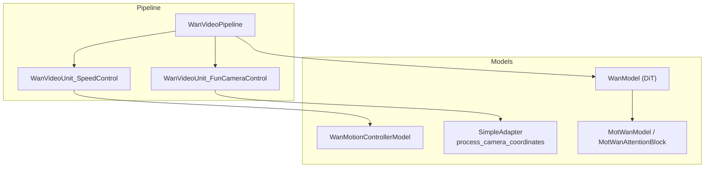
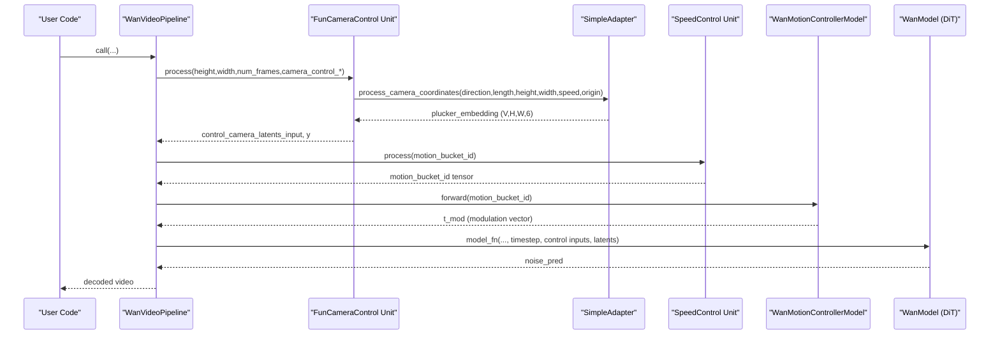
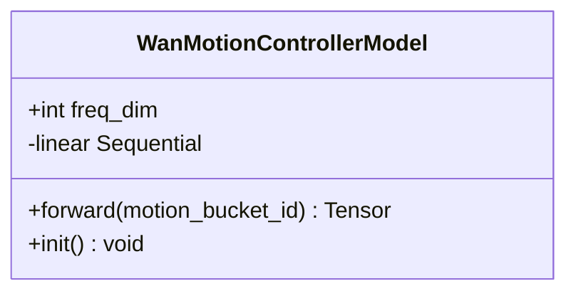
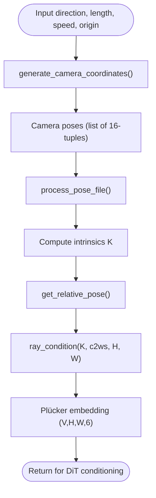
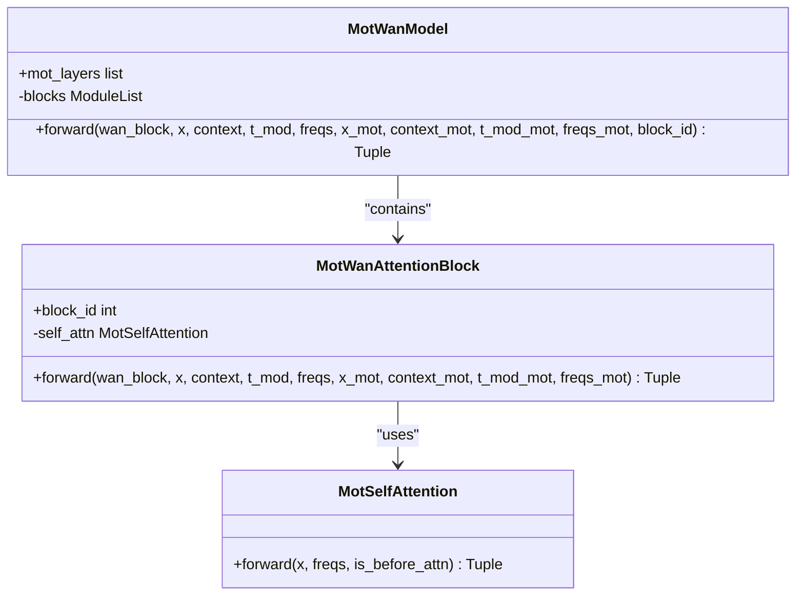
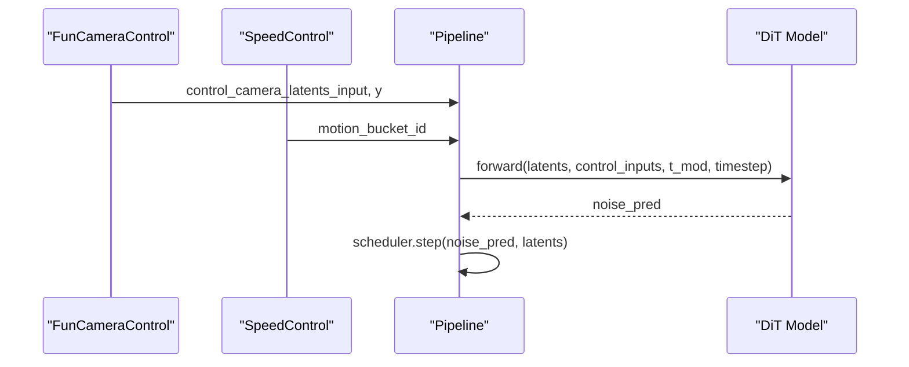
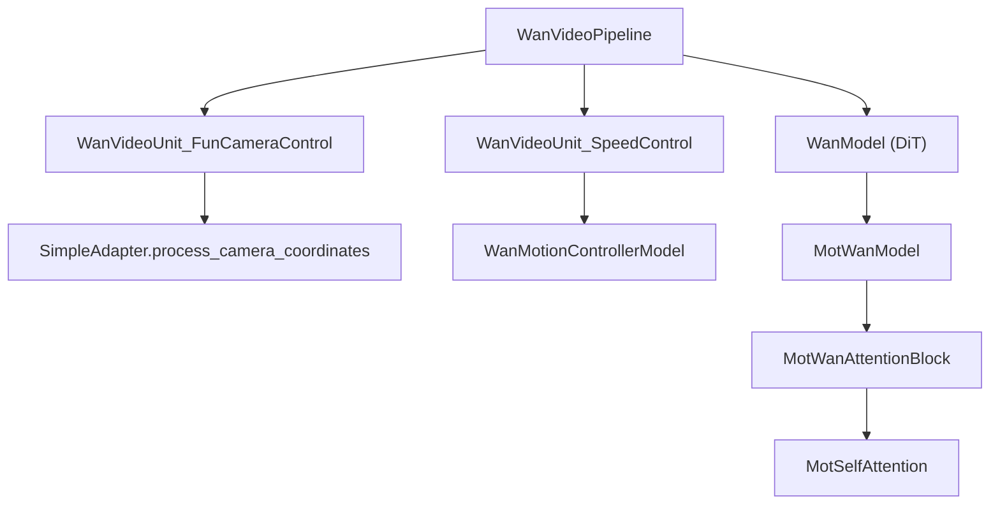

# Motion Controller API

<cite>
**Referenced Files in This Document**
- [wan_video_motion_controller.py](file://diffsynth/models/wan_video_motion_controller.py)
- [wan_video_camera_controller.py](file://diffsynth/models/wan_video_camera_controller.py)
- [wan_video_mot.py](file://diffsynth/models/wan_video_mot.py)
- [wan_video_dit.py](file://diffsynth/models/wan_video_dit.py)
- [wan_video.py](file://diffsynth/pipelines/wan_video.py)
- [Wan2.1-Fun-V1.1-14B-Control-Camera.py](file://examples/wanvideo/model_inference/Wan2.1-Fun-V1.1-14B-Control-Camera.py)
- [Wan2.2-Fun-A14B-Control-Camera.py](file://examples/wanvideo/model_inference/Wan2.2-Fun-A14B-Control-Camera.py)
</cite>

## Table of Contents
1. [Introduction](#introduction)
2. [Project Structure](#project-structure)
3. [Core Components](#core-components)
4. [Architecture Overview](#architecture-overview)
5. [Detailed Component Analysis](#detailed-component-analysis)
6. [Dependency Analysis](#dependency-analysis)
7. [Performance Considerations](#performance-considerations)
8. [Troubleshooting Guide](#troubleshooting-guide)
9. [Conclusion](#conclusion)
10. [Appendices](#appendices)

## Introduction
This document provides a comprehensive API reference for WanVideo motion control systems, focusing on:
- Motion controller interfaces and how they integrate with the diffusion pipeline
- Camera movement control via Plücker embeddings and pose generation
- Motion interpolation and temporal consistency mechanisms
- Practical examples for camera movement, object motion tracking, and complex choreography
- Guidance for implementing custom motion controllers and optimizing performance for real-time inference

The system combines a motion bucket controller (for speed/intensity modulation), a camera controller (for geometric camera trajectories), and optional motion-aware attention modules to ensure smooth and temporally consistent video generation.

## Project Structure
WanVideo motion control spans several modules:
- Motion controller model: encodes motion intensity via sinusoidal embeddings and MLP
- Camera controller: generates camera poses and Plücker embeddings for spatial-temporal control
- MOT/attention extensions: inject motion tokens into DiT blocks for coherent motion modeling
- Pipeline units: orchestrate inputs, encode latents, and feed control signals into the DiT



**Diagram sources**
- [wan_video.py:583-631](file://diffsynth/pipelines/wan_video.py#L583-L631)
- [wan_video_motion_controller.py:7-27](file://diffsynth/models/wan_video_motion_controller.py#L7-L27)
- [wan_video_camera_controller.py:8-59](file://diffsynth/models/wan_video_camera_controller.py#L8-L59)
- [wan_video_mot.py:22-91](file://diffsynth/models/wan_video_mot.py#L22-L91)
- [wan_video_dit.py:1-200](file://diffsynth/models/wan_video_dit.py#L1-L200)

**Section sources**
- [wan_video.py:32-86](file://diffsynth/pipelines/wan_video.py#L32-L86)
- [wan_video_motion_controller.py:7-27](file://diffsynth/models/wan_video_motion_controller.py#L7-L27)
- [wan_video_camera_controller.py:8-59](file://diffsynth/models/wan_video_camera_controller.py#L8-L59)
- [wan_video_mot.py:94-169](file://diffsynth/models/wan_video_mot.py#L94-L169)

## Core Components
- WanMotionControllerModel: Encodes a scalar motion bucket ID into a modulation vector using 1D sinusoidal embedding and an MLP. Used to modulate motion intensity across time steps.
- SimpleAdapter.process_camera_coordinates: Generates camera trajectory coordinates and converts them into Plücker embeddings for spatial-temporal conditioning.
- MotWanModel and MotWanAttentionBlock: Inject motion tokens into DiT blocks, enabling cross-attention between main video features and motion-specific features.
- WanVideoPipeline units: Prepare and inject control signals (camera Plücker embeddings, motion bucket IDs, VAE latents) into the DiT forward pass.

Key responsibilities:
- Motion intensity modulation: map discrete motion buckets to continuous modulation vectors
- Camera trajectory planning: generate smooth camera paths and convert to Plücker embeddings
- Temporal consistency: use RoPE-based frequencies and motion-aware attention to maintain coherence across frames

**Section sources**
- [wan_video_motion_controller.py:7-27](file://diffsynth/models/wan_video_motion_controller.py#L7-L27)
- [wan_video_camera_controller.py:46-59](file://diffsynth/models/wan_video_camera_controller.py#L46-L59)
- [wan_video_mot.py:22-91](file://diffsynth/models/wan_video_mot.py#L22-L91)
- [wan_video.py:583-631](file://diffsynth/pipelines/wan_video.py#L583-L631)

## Architecture Overview
The motion control architecture integrates three layers:
- Input preparation: pipeline units encode images/videos and compute control latents
- Control signal generation: camera controller produces Plücker embeddings; motion controller produces modulation vectors
- DiT integration: motion-aware attention blocks fuse control signals with video features



**Diagram sources**
- [wan_video.py:583-631](file://diffsynth/pipelines/wan_video.py#L583-L631)
- [wan_video_camera_controller.py:46-59](file://diffsynth/models/wan_video_camera_controller.py#L46-L59)
- [wan_video_motion_controller.py:19-22](file://diffsynth/models/wan_video_motion_controller.py#L19-L22)

## Detailed Component Analysis

### WanMotionControllerModel
Purpose: Convert a motion bucket ID into a modulation vector that scales and shifts network activations to control motion intensity.

Key methods:
- __init__(freq_dim=256, dim=1536): Defines MLP layers and frequency dimension
- forward(motion_bucket_id): Applies 1D sinusoidal embedding and MLP to produce modulation
- init(): Initializes last layer weights to zero for stable training

Complexity:
- Time: O(freq_dim + dim) per forward pass
- Space: O(dim*6) for output modulation vector

Integration points:
- Called by SpeedControl unit to produce t_mod used in DiT modulation functions



**Diagram sources**
- [wan_video_motion_controller.py:7-27](file://diffsynth/models/wan_video_motion_controller.py#L7-L27)

**Section sources**
- [wan_video_motion_controller.py:7-27](file://diffsynth/models/wan_video_motion_controller.py#L7-L27)

### SimpleAdapter and Camera Control
Purpose: Generate camera trajectories and convert them into Plücker embeddings for spatial-temporal conditioning.

Key methods:
- process_camera_coordinates(direction, length, height, width, speed=1/54, origin=tuple): Returns Plücker embeddings
- generate_camera_coordinates(direction, length, speed, origin): Builds camera pose sequences
- process_pose_file(cam_params, width, height, ...): Converts camera parameters to Plücker embeddings

Supported directions: Left, Right, Up, Down, LeftUp, LeftDown, RightUp, RightDown, In, Out

Data flow:
- Direction string → coordinate sequence → Plücker embedding (V,H,W,6) → reshaped for DiT input



**Diagram sources**
- [wan_video_camera_controller.py:184-206](file://diffsynth/models/wan_video_camera_controller.py#L184-L206)
- [wan_video_camera_controller.py:150-180](file://diffsynth/models/wan_video_camera_controller.py#L150-L180)

**Section sources**
- [wan_video_camera_controller.py:8-59](file://diffsynth/models/wan_video_camera_controller.py#L8-L59)
- [wan_video_camera_controller.py:150-180](file://diffsynth/models/wan_video_camera_controller.py#L150-L180)
- [wan_video_camera_controller.py:184-206](file://diffsynth/models/wan_video_camera_controller.py#L184-L206)

### MotWanModel and Motion-Aware Attention
Purpose: Inject motion tokens into DiT blocks to enable cross-attention between video features and motion-specific features.

Key components:
- MotSelfAttention: Custom attention with RoPE application before/after standard attention
- MotWanAttentionBlock: Extends DiT block with motion-specific self-attention and cross-attention
- MotWanModel: Manages multiple MotWanAttentionBlocks at specified layers

Forward logic:
- Concatenate main and motion queries/k/values
- Apply flash attention jointly
- Split outputs and apply gating/modulation
- Maintain temporal consistency via RoPE frequencies



**Diagram sources**
- [wan_video_mot.py:7-20](file://diffsynth/models/wan_video_mot.py#L7-L20)
- [wan_video_mot.py:22-91](file://diffsynth/models/wan_video_mot.py#L22-L91)
- [wan_video_mot.py:94-169](file://diffsynth/models/wan_video_mot.py#L94-L169)

**Section sources**
- [wan_video_mot.py:7-20](file://diffsynth/models/wan_video_mot.py#L7-L20)
- [wan_video_mot.py:22-91](file://diffsynth/models/wan_video_mot.py#L22-L91)
- [wan_video_mot.py:94-169](file://diffsynth/models/wan_video_mot.py#L94-L169)

### Pipeline Integration
Purpose: Orchestrate motion control inputs through pipeline units and integrate with DiT.

Key units:
- WanVideoUnit_FunCameraControl: Processes camera control parameters and generates control latents
- WanVideoUnit_SpeedControl: Validates and prepares motion bucket ID
- WanVideoPipeline.__call__: Main inference loop integrating all units and models

Data flow:
- Camera control → Plücker embeddings → VAE encoding → control_camera_latents_input
- Motion bucket ID → modulation vector → DiT time modulation
- Latents → DiT forward with control signals → denoising step



**Diagram sources**
- [wan_video.py:583-631](file://diffsynth/pipelines/wan_video.py#L583-L631)
- [wan_video.py:634-646](file://diffsynth/pipelines/wan_video.py#L634-L646)
- [wan_video.py:189-359](file://diffsynth/pipelines/wan_video.py#L189-L359)

**Section sources**
- [wan_video.py:583-631](file://diffsynth/pipelines/wan_video.py#L583-L631)
- [wan_video.py:634-646](file://diffsynth/pipelines/wan_video.py#L634-L646)
- [wan_video.py:189-359](file://diffsynth/pipelines/wan_video.py#L189-L359)

## Dependency Analysis
Component relationships and dependencies:



**Diagram sources**
- [wan_video.py:32-86](file://diffsynth/pipelines/wan_video.py#L32-L86)
- [wan_video_camera_controller.py:8-59](file://diffsynth/models/wan_video_camera_controller.py#L8-L59)
- [wan_video_motion_controller.py:7-27](file://diffsynth/models/wan_video_motion_controller.py#L7-L27)
- [wan_video_mot.py:94-169](file://diffsynth/models/wan_video_mot.py#L94-L169)

**Section sources**
- [wan_video.py:32-86](file://diffsynth/pipelines/wan_video.py#L32-L86)
- [wan_video_camera_controller.py:8-59](file://diffsynth/models/wan_video_camera_controller.py#L8-L59)
- [wan_video_motion_controller.py:7-27](file://diffsynth/models/wan_video_motion_controller.py#L7-L27)
- [wan_video_mot.py:94-169](file://diffsynth/models/wan_video_mot.py#L94-L169)

## Performance Considerations
Optimization strategies for real-time motion control:

Memory management:
- Use tiled VAE encoding/decoding for large resolutions
- Enable gradient checkpointing during training
- Implement VRAM management with selective model loading

Computational efficiency:
- Flash attention implementations for faster attention computation
- Sequence parallelism for multi-GPU scaling
- Caching of Plücker embeddings for repeated camera trajectories

Temporal consistency:
- RoPE frequency precomputation reduces redundant calculations
- Motion token injection only at specified layers reduces overhead
- Efficient tensor reshaping operations minimize memory copies

Real-time considerations:
- Batch processing of multiple camera trajectories
- Streaming inference with sliding window approach
- Quantization-friendly architectures for deployment

[No sources needed since this section provides general guidance]

## Troubleshooting Guide
Common issues and solutions:

Camera control problems:
- Invalid direction strings: Ensure direction matches supported literals (Left, Right, Up, Down, etc.)
- Resolution mismatches: Verify height/width are divisible by required factors (typically 16)
- Plücker embedding shape errors: Check frame count matches expected dimensions

Motion intensity issues:
- Motion bucket ID out of range: Validate bucket ID against model expectations
- Modulation vector shape mismatches: Ensure freq_dim and dim parameters match model configuration
- Zero initialization not applied: Call init() method after loading pretrained weights

Temporal inconsistency:
- RoPE frequency calculation errors: Verify grid sizes and head dimensions
- Motion token alignment: Ensure motion features align with main video features in sequence length
- Attention mask issues: Check masking for reference frames and padding

Performance bottlenecks:
- Memory allocation failures: Reduce batch size or resolution
- Slow inference: Enable flash attention and sequence parallelism
- GPU utilization: Monitor memory usage and optimize tensor operations

**Section sources**
- [wan_video_camera_controller.py:46-59](file://diffsynth/models/wan_video_camera_controller.py#L46-L59)
- [wan_video_motion_controller.py:24-27](file://diffsynth/models/wan_video_motion_controller.py#L24-L27)
- [wan_video.py:583-631](file://diffsynth/pipelines/wan_video.py#L583-L631)

## Conclusion
The WanVideo motion control system provides a comprehensive framework for precise camera movement control and motion intensity modulation. The modular architecture allows for easy extension and customization while maintaining temporal consistency and computational efficiency. Key strengths include:

- Flexible camera trajectory generation with Plücker embeddings
- Scalable motion intensity control through bucket-based modulation
- Advanced motion-aware attention for temporal coherence
- Optimized implementation with flash attention and sequence parallelism

For advanced use cases, developers can extend the SimpleAdapter for custom camera controls, implement new motion controllers for different motion types, or modify the MotWanModel for specialized motion patterns.

[No sources needed since this section summarizes without analyzing specific files]

## Appendices

### Usage Examples

#### Camera Movement Control
Basic camera movement with directional control:

```python
# Example from Wan2.1-Fun-V1.1-14B-Control-Camera.py
video = pipe(
    prompt="...",
    negative_prompt="...",
    seed=0, 
    tiled=True,
    input_image=input_image,
    camera_control_direction="Left", 
    camera_control_speed=0.01,
)
```

Supported directions: Left, Right, Up, Down, LeftUp, LeftDown, RightUp, RightDown, In, Out

#### Object Motion Tracking
Use motion bucket IDs to control object motion intensity:

```python
# Configure motion intensity
motion_bucket_id = 5  # Adjust based on desired motion strength
video = pipe(
    prompt="...",
    motion_bucket_id=motion_bucket_id,
    input_image=input_image,
)
```

#### Complex Choreography Scenarios
Combine multiple control signals for sophisticated motion:

```python
# Multi-modal control
video = pipe(
    prompt="...",
    camera_control_direction="Left",
    camera_control_speed=0.01,
    motion_bucket_id=3,
    vace_video=reference_frames,
    animate_pose_video=pose_sequences,
    input_image=input_image,
)
```

**Section sources**
- [Wan2.1-Fun-V1.1-14B-Control-Camera.py:28-35](file://examples/wanvideo/model_inference/Wan2.1-Fun-V1.1-14B-Control-Camera.py#L28-L35)
- [Wan2.2-Fun-A14B-Control-Camera.py:27-34](file://examples/wanvideo/model_inference/Wan2.2-Fun-A14B-Control-Camera.py#L27-L34)

### Implementation Guidelines

#### Custom Motion Controller
To implement a custom motion controller:

1. Extend WanMotionControllerModel base class
2. Implement forward method for motion encoding
3. Initialize with appropriate frequency dimensions
4. Integrate with SpeedControl pipeline unit

#### Custom Camera Controller
To add new camera movements:

1. Extend generate_camera_coordinates function
2. Add new direction literals
3. Update process_camera_coordinates interface
4. Test with various resolutions and speeds

#### Integration with Main Pipeline
Ensure proper integration:

1. Register new controller in model configurations
2. Update pipeline units if necessary
3. Handle tensor shape compatibility
4. Optimize for memory and compute efficiency

[No sources needed since this section provides general guidance]