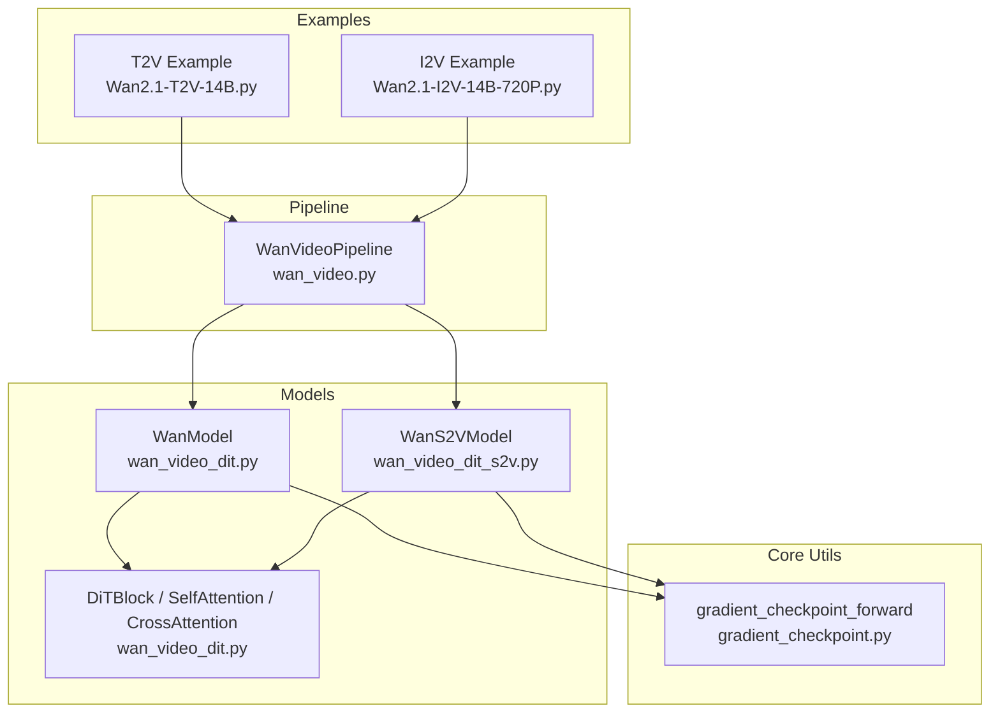
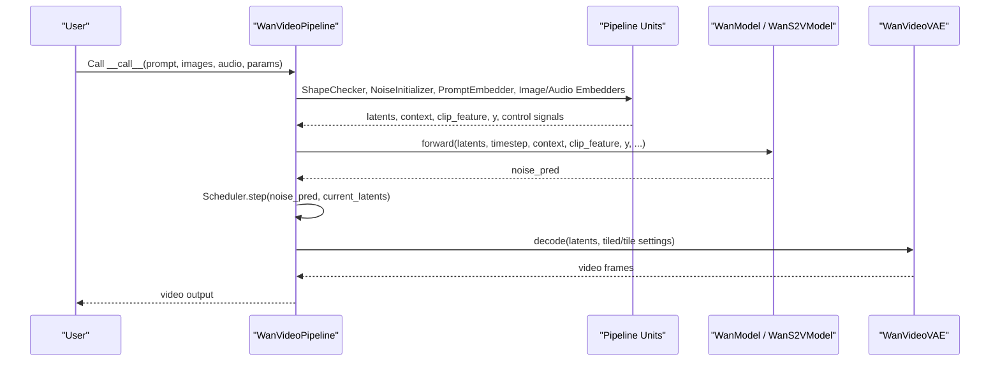
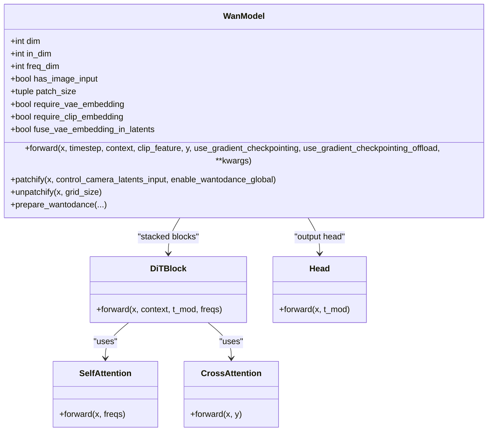
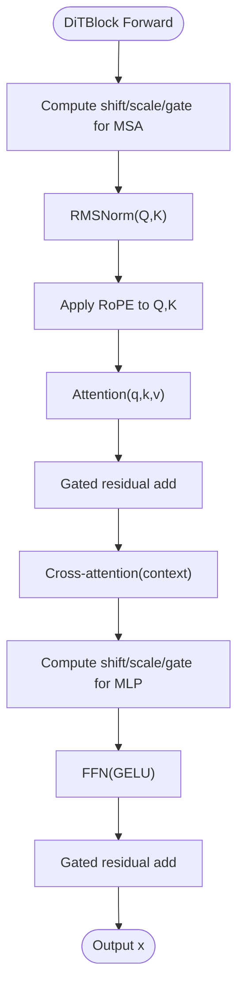
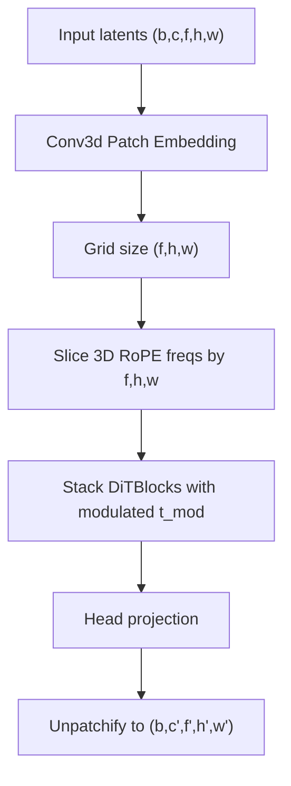
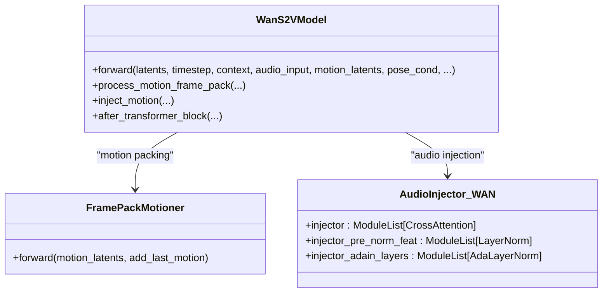
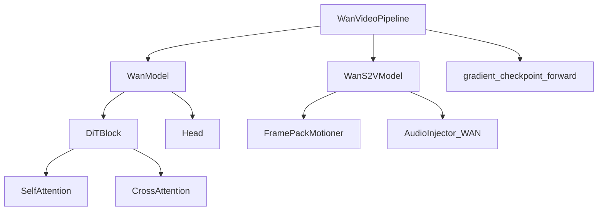

# WanVideo DiT Architecture

<cite>
**Referenced Files in This Document**
- [wan_video_dit.py](file://diffsynth/models/wan_video_dit.py)
- [wan_video_dit_s2v.py](file://diffsynth/models/wan_video_dit_s2v.py)
- [wan_video.py](file://diffsynth/pipelines/wan_video.py)
- [gradient_checkpoint.py](file://diffsynth/core/gradient/gradient_checkpoint.py)
- [Wan2.1-T2V-14B.py](file://examples/wanvideo/model_inference/Wan2.1-T2V-14B.py)
- [Wan2.1-I2V-14B-720P.py](file://examples/wanvideo/model_inference/Wan2.1-I2V-14B-720P.py)
</cite>

## Table of Contents
1. Introduction
2. Project Structure
3. Core Components
4. Architecture Overview
5. Detailed Component Analysis
6. Dependency Analysis
7. Performance Considerations
8. Troubleshooting Guide
9. Conclusion
10. Appendices

## Introduction
This document provides comprehensive API documentation for the WanVideo Diffusion Transformer (DiT) architecture implemented in the repository. It focuses on:
- The core WanModel class and its video-specific operations (3D patch embedding, temporal frequency encoding, unpatchify).
- DiTBlock components and attention mechanisms (SelfAttention, CrossAttention).
- Temporal modeling capabilities and extensions (S2V variant with motion/audio injection).
- Video generation workflows via the WanVideoPipeline (text-to-video, image-to-video).
- Memory optimization techniques including gradient checkpointing and VRAM management utilities.
- Practical examples and configuration options for text-to-video and image-to-video generation.

## Project Structure
The relevant code is organized into:
- Model definitions under diffsynth/models (WanModel, S2V variant, audio/motion injectors).
- Pipeline orchestration under diffsynth/pipelines (WanVideoPipeline units and inference loop).
- Gradient checkpointing utility under diffsynth/core/gradient.
- Example scripts under examples/wanvideo/model_inference demonstrating T2V and I2V usage.

**Diagram sources**
- [wan_video_dit.py](file://diffsynth/models/wan_video_dit.py)
- [wan_video_dit_s2v.py](file://diffsynth/models/wan_video_dit_s2v.py)
- [wan_video.py](file://diffsynth/pipelines/wan_video.py)
- [gradient_checkpoint.py](file://diffsynth/core/gradient/gradient_checkpoint.py)
- [Wan2.1-T2V-14B.py](file://examples/wanvideo/model_inference/Wan2.1-T2V-14B.py)
- [Wan2.1-I2V-14B-720P.py](file://examples/wanvideo/model_inference/Wan2.1-I2V-14B-720P.py)

**Section sources**
- [wan_video_dit.py](file://diffsynth/models/wan_video_dit.py)
- [wan_video_dit_s2v.py](file://diffsynth/models/wan_video_dit_s2v.py)
- [wan_video.py](file://diffsynth/pipelines/wan_video.py)
- [gradient_checkpoint.py](file://diffsynth/core/gradient/gradient_checkpoint.py)
- [Wan2.1-T2V-14B.py](file://examples/wanvideo/model_inference/Wan2.1-T2V-14B.py)
- [Wan2.1-I2V-14B-720P.py](file://examples/wanvideo/model_inference/Wan2.1-I2V-14B-720P.py)

## Core Components
- WanModel: The primary DiT model for video diffusion. It includes:
  - 3D patch embedding via Conv3d with configurable patch_size.
  - Text embedding projection and time embedding/projection for modulation.
  - Stacked DiTBlocks with self-attention and cross-attention.
  - Head module to project back to latent space; unpatchify reconstructs spatio-temporal tensors.
  - Optional image conditioning (CLIP features), reference convolutions, control adapters, and WanToDance integrations.
- DiTBlock: Combines multi-head self-attention, cross-attention, FFN, LayerNorms, and AdaModulation via t_mod.
- Attention modules:
  - SelfAttention: RMSNorm + linear projections + RoPE-based rotary embeddings + efficient attention backend selection.
  - CrossAttention: Supports optional image input concatenation and separate key/value streams for image tokens.
- S2V extension (WanS2VModel): Adds motion frame packing, audio encoder/injector, and specialized blocks for speech-to-video and motion-aware generation.

Key responsibilities and data flows are detailed in the next sections.

**Section sources**
- [wan_video_dit.py](file://diffsynth/models/wan_video_dit.py)
- [wan_video_dit_s2v.py](file://diffsynth/models/wan_video_dit_s2v.py)

## Architecture Overview
The WanVideo pipeline orchestrates multiple units to prepare inputs, encode prompts/images/audio, run the DiT denoising loop, and decode latents to video frames.

**Diagram sources**
- [wan_video.py](file://diffsynth/pipelines/wan_video.py)
- [wan_video_dit.py](file://diffsynth/models/wan_video_dit.py)
- [wan_video_dit_s2v.py](file://diffsynth/models/wan_video_dit_s2v.py)

**Section sources**
- [wan_video.py](file://diffsynth/pipelines/wan_video.py)

## Detailed Component Analysis

### WanModel Class
Responsibilities:
- Input preparation: time embedding, text embedding, optional image/clip fusion.
- Spatio-temporal tokenization: 3D patch embedding and grid-aware RoPE frequency computation.
- Transformer processing: stacked DiTBlocks with modulation parameters derived from time embedding.
- Output reconstruction: Head projection and unpatchify to restore spatio-temporal shape.

Key methods:
- forward(x, timestep, context, clip_feature=None, y=None, use_gradient_checkpointing=False, use_gradient_checkpointing_offload=False, **kwargs)
- patchify/unpatchify for 3D tensor reshaping.
- prepare_wantodance for optional music/reference/global/dynamic-fps/unimodel features.

**Diagram sources**
- [wan_video_dit.py](file://diffsynth/models/wan_video_dit.py)

**Section sources**
- [wan_video_dit.py](file://diffsynth/models/wan_video_dit.py)

### DiTBlock and Attention Mechanisms
- DiTBlock:
  - Applies AdaModulation using t_mod (shift/scale/gate pairs for MSA and MLP).
  - Self-attention with RoPE; Cross-attention with optional image tokens.
  - FFN with gated residual connections.
- SelfAttention:
  - RMSNorm on Q/K before attention; RoPE applied to Q/K.
  - Efficient attention backend selection (FlashAttention v2/v3, SageAttention, or SDPA fallback).
- CrossAttention:
  - Supports concatenated image tokens when has_image_input=True.
  - Separate key/value projections for image tokens; adds image branch output to main stream.

**Diagram sources**
- [wan_video_dit.py](file://diffsynth/models/wan_video_dit.py)

**Section sources**
- [wan_video_dit.py](file://diffsynth/models/wan_video_dit.py)

### Temporal Modeling and Frequency Encoding
- 3D RoPE frequencies:
  - precompute_freqs_cis_3d generates per-dimension (time, height, width) frequency tables.
  - During forward, frequencies are sliced to match the spatio-temporal grid and broadcast across tokens.
- rope_apply applies complex multiplication to reshape Q/K for rotation.
- In S2V variant:
  - FramePackMotioner packs motion frames at multiple scales and computes grid-aware RoPE embeddings.
  - AudioInjector_WAN injects audio features into selected DiTBlocks via cross-attention and optional AdaLayerNorm.

**Diagram sources**
- [wan_video_dit.py](file://diffsynth/models/wan_video_dit.py)
- [wan_video_dit_s2v.py](file://diffsynth/models/wan_video_dit_s2v.py)

**Section sources**
- [wan_video_dit.py](file://diffsynth/models/wan_video_dit.py)
- [wan_video_dit_s2v.py](file://diffsynth/models/wan_video_dit_s2v.py)

### Video-Specific Operations
- 3D Patch Embedding: Conv3d with kernel=stride=patch_size reduces spatial-temporal dimensions to tokens.
- Temporal Frequency Encoding: Precomputed 3D RoPE frequencies ensure position-aware attention across time and space.
- Frame Generation Process:
  - Pipeline initializes noise, encodes prompt/image/audio, runs iterative denoising with scheduler steps, then decodes latents via VAE.
  - Optional fused VAE embedding in first frame for TI2V variants.

**Section sources**
- [wan_video.py](file://diffsynth/pipelines/wan_video.py)
- [wan_video_dit.py](file://diffsynth/models/wan_video_dit.py)

### S2V Extension (Speech/Motion-Aware)
- WanS2VModel:
  - Integrates causal audio encoder and motion frame packer.
  - Injects audio features into DiTBlocks via cross-attention and optional AdaLayerNorm.
  - Handles mixed sequences (reference + generated frames) with mask tokens and grid-aware RoPE.

**Diagram sources**
- [wan_video_dit_s2v.py](file://diffsynth/models/wan_video_dit_s2v.py)

**Section sources**
- [wan_video_dit_s2v.py](file://diffsynth/models/wan_video_dit_s2v.py)

## Dependency Analysis
- WanModel depends on:
  - DiTBlock, SelfAttention, CrossAttention, Head, RMSNorm, attention backends.
  - Optional modules: SimpleAdapter (camera control), WanToDance components (music/reference/global/dynamic-fps/unimodel).
- WanS2VModel depends on:
  - MotionEncoder_tc, FramePackMotioner, AudioInjector_WAN, AdaLayerNorm.
- Pipeline depends on:
  - Tokenizer, text encoder, image encoder, VAE, motion controller, VACE, animate adapter, audio encoder.
  - Uses gradient_checkpoint_forward for memory-efficient training/inference.

**Diagram sources**
- [wan_video.py](file://diffsynth/pipelines/wan_video.py)
- [wan_video_dit.py](file://diffsynth/models/wan_video_dit.py)
- [wan_video_dit_s2v.py](file://diffsynth/models/wan_video_dit_s2v.py)
- [gradient_checkpoint.py](file://diffsynth/core/gradient/gradient_checkpoint.py)

**Section sources**
- [wan_video.py](file://diffsynth/pipelines/wan_video.py)
- [wan_video_dit.py](file://diffsynth/models/wan_video_dit.py)
- [wan_video_dit_s2v.py](file://diffsynth/models/wan_video_dit_s2v.py)
- [gradient_checkpoint.py](file://diffsynth/core/gradient/gradient_checkpoint.py)

## Performance Considerations
- Attention Backend Selection:
  - Automatic fallback chain: FlashAttention v3 -> FlashAttention v2 -> SageAttention -> SDPA.
  - Ensures optimal throughput depending on installed libraries.
- Gradient Checkpointing:
  - gradient_checkpoint_forward supports DeepSpeed integration and CPU offloading via torch.utils.checkpoint.
  - Reduces peak memory during training and large-scale inference.
- VRAM Management:
  - skip_model_initialization context manager defers parameter allocation to meta device until needed.
- Tiled Decoding:
  - VAE decoding supports tile_size and tile_stride to reduce memory footprint for high-resolution videos.
- Unified Sequence Parallel (USP):
  - WanVideoPipeline can swap attention and model forward hooks for sequence parallel execution across devices.

Recommendations:
- Enable gradient checkpointing for long sequences or high resolutions.
- Use tiled decoding for large outputs.
- Leverage USP when available for multi-GPU scaling.
- Prefer bfloat16 dtype for efficiency where supported.

**Section sources**
- [wan_video_dit.py](file://diffsynth/models/wan_video_dit.py)
- [gradient_checkpoint.py](file://diffsynth/core/gradient/gradient_checkpoint.py)
- [wan_video.py](file://diffsynth/pipelines/wan_video.py)

## Troubleshooting Guide
Common issues and resolutions:
- Missing attention libraries:
  - If FlashAttention/SageAttention not installed, the code falls back to SDPA. Ensure dependencies are installed for best performance.
- Out-of-memory errors:
  - Enable gradient checkpointing and tiled decoding.
  - Reduce resolution, number of frames, or batch size.
  - Use skip_model_initialization to defer initialization if loading large models incrementally.
- Shape mismatches:
  - Verify height/width divisible by 16 and num_frames aligned to VAE downsampling factor (time_division_factor=4).
  - Ensure correct alignment between latents and control signals (e.g., camera control, VACE masks).
- CFG guidance instability:
  - Adjust cfg_scale and consider cfg_merge mode for stability.
- Long sequences:
  - Use sliding window or unified sequence parallel to manage memory and compute.

**Section sources**
- [wan_video.py](file://diffsynth/pipelines/wan_video.py)
- [gradient_checkpoint.py](file://diffsynth/core/gradient/gradient_checkpoint.py)

## Conclusion
The WanVideo DiT architecture integrates robust video-specific operations (3D patching, RoPE, modulation) with flexible conditioning (text, images, audio, motion) and strong performance optimizations (attention backends, gradient checkpointing, tiled decoding, sequence parallel). The WanVideoPipeline provides a modular and extensible framework for text-to-video and image-to-video generation, while the S2V extension enables speech/motion-aware synthesis. Users can tune configurations and leverage memory-saving techniques to achieve high-quality results within hardware constraints.

## Appendices

### API Usage Examples

#### Text-to-Video Generation
- Instantiate pipeline with model configs for DiT, text encoder, and VAE.
- Call pipeline with prompt and negative_prompt; set seed and tiled=True for memory efficiency.
- Save output video using save_video utility.

Reference:
- [Wan2.1-T2V-14B.py](file://examples/wanvideo/model_inference/Wan2.1-T2V-14B.py)

**Section sources**
- [Wan2.1-T2V-14B.py](file://examples/wanvideo/model_inference/Wan2.1-T2V-14B.py)

#### Image-to-Video Conversion
- Load an input image and configure model paths for I2V variant (including CLIP encoder).
- Provide prompt describing desired motion; set height/width and tiled=True.
- Decode and save resulting video.

Reference:
- [Wan2.1-I2V-14B-720P.py](file://examples/wanvideo/model_inference/Wan2.1-I2V-14B-720P.py)

**Section sources**
- [Wan2.1-I2V-14B-720P.py](file://examples/wanvideo/model_inference/Wan2.1-I2V-14B-720P.py)

### Configuration Options Summary
- Model construction parameters (WanModel):
  - dim, in_dim, ffn_dim, out_dim, text_dim, freq_dim, eps, patch_size, num_heads, num_layers.
  - has_image_input, has_image_pos_emb, has_ref_conv, add_control_adapter, in_dim_control_adapter.
  - seperated_timestep, require_vae_embedding, require_clip_embedding, fuse_vae_embedding_in_latents.
  - WanToDance flags for music injection, reference image/face, global/dynamic-fps/unimodel modes.
- Pipeline call parameters:
  - prompt/negative_prompt, input_image/end_image, input_video, denoising_strength.
  - audio inputs (input_audio, audio_embeds, audio_sample_rate), s2v_pose_video/latents, motion_video.
  - control_video, reference_image, camera_control_direction/speed/origin.
  - vace_video/mask/reference_image/scale, animate_* controls, vap_video/prompts.
  - seed/rand_device, height/width/num_frames, cfg_scale/cfg_merge, switch_DiT_boundary.
  - num_inference_steps, sigma_shift, motion_bucket_id, longcat_video.
  - tiled/tile_size/tile_stride, sliding_window_size/stride, tea_cache settings.
  - wantodance_music_path/reference_image/fps/keyframes/keyframes_mask, framewise_decoding.

**Section sources**
- [wan_video_dit.py](file://diffsynth/models/wan_video_dit.py)
- [wan_video.py](file://diffsynth/pipelines/wan_video.py)