# WanVideo Models API

<cite>
**Referenced Files in This Document**
- [wan_video_dit.py](file://diffsynth/models/wan_video_dit.py)
- [wan_video_motion_controller.py](file://diffsynth/models/wan_video_motion_controller.py)
- [wan_video_camera_controller.py](file://diffsynth/models/wan_video_camera_controller.py)
- [wan_video_animate_adapter.py](file://diffsynth/models/wan_video_animate_adapter.py)
- [wan_video_vae.py](file://diffsynth/models/wan_video_vae.py)
- [wan_video_text_encoder.py](file://diffsynth/models/wan_video_text_encoder.py)
- [wan_video_image_encoder.py](file://diffsynth/models/wan_video_image_encoder.py)
- [wan_video_mot.py](file://diffsynth/models/wan_video_mot.py)
- [wan_video_vace.py](file://diffsynth/models/wan_video_vace.py)
- [wan_video.py](file://diffsynth/pipelines/wan_video.py)
- [Wan.md](file://docs/en/Model_Details/Wan.md)
- [Wan2.1-T2V-14B.py](file://examples/wanvideo/model_inference/Wan2.1-T2V-14B.py)
- [Wan2.1-I2V-14B-720P.py](file://examples/wanvideo/model_inference/Wan2.1-I2V-14B-720P.py)
- [Wan2.1-Fun-V1.1-14B-Control-Camera.py](file://examples/wanvideo/model_inference/Wan2.1-Fun-V1.1-14B-Control-Camera.py)
</cite>

## Table of Contents
1. Introduction
2. Project Structure
3. Core Components
4. Architecture Overview
5. Detailed Component Analysis
6. Dependency Analysis
7. Performance Considerations
8. Troubleshooting Guide
9. Conclusion
10. Appendices

## Introduction
This document provides comprehensive API documentation for the WanVideo model implementations, focusing on video generation using a DiT-based architecture with motion controllers, camera control systems, animate adapters, VAE components, and text encoders. It explains temporal modeling, motion interpolation, camera trajectory control, and frame generation, and includes complete examples for text-to-video, image-to-video, and advanced control scenarios. It also addresses video format handling, temporal consistency, and performance optimization for video generation tasks.

## Project Structure
The WanVideo implementation is organized into:
- Models: DiT backbone, motion controller, camera controller, animate adapter, VAE, text encoder, image encoder, MOT and VACE extensions.
- Pipeline: Unified orchestration of units for preprocessing, conditioning, denoising, and decoding.
- Examples: Ready-to-run scripts for T2V, I2V, and camera control.

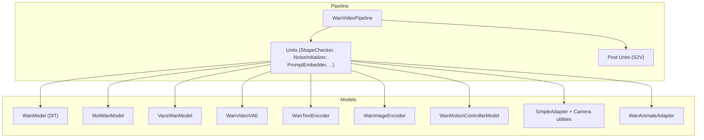

**Diagram sources**
- [wan_video.py:32-86](file://diffsynth/pipelines/wan_video.py#L32-L86)
- [wan_video_dit.py:338-423](file://diffsynth/models/wan_video_dit.py#L338-L423)
- [wan_video_motion_controller.py:7-22](file://diffsynth/models/wan_video_motion_controller.py#L7-L22)
- [wan_video_camera_controller.py:8-44](file://diffsynth/models/wan_video_camera_controller.py#L8-L44)
- [wan_video_animate_adapter.py:615-651](file://diffsynth/models/wan_video_animate_adapter.py#L615-L651)
- [wan_video_vae.py:517-618](file://diffsynth/models/wan_video_vae.py#L517-L618)
- [wan_video_text_encoder.py:212-257](file://diffsynth/models/wan_video_text_encoder.py#L212-L257)
- [wan_video_image_encoder.py:386-479](file://diffsynth/models/wan_video_image_encoder.py#L386-L479)
- [wan_video_mot.py:94-170](file://diffsynth/models/wan_video_mot.py#L94-L170)
- [wan_video_vace.py:27-75](file://diffsynth/models/wan_video_vace.py#L27-L75)

**Section sources**
- [wan_video.py:32-86](file://diffsynth/pipelines/wan_video.py#L32-L86)
- [Wan.md:58-105](file://docs/en/Model_Details/Wan.md#L58-L105)

## Core Components
- DiT Backbone (WanModel): 3D patch embedding, time and text embeddings, stacked DiT blocks with self/cross attention, modulation via timestep, optional image input and control adapter.
- Motion Controller: Maps motion bucket IDs to modulation vectors for speed/motion control.
- Camera Controller: Generates Plücker embeddings from camera trajectories and adapts them into latent space for conditioning.
- Animate Adapter: Encodes pose/face pixel values into motion vectors and injects features into DiT blocks.
- VAE: Causal 3D convolutions, residual blocks, attention, and efficient encode/decode with tiling and streaming cache for temporal consistency.
- Text Encoder: T5-style transformer with relative positional bias; tokenizer wrapper for prompt encoding.
- Image Encoder: Vision transformer for CLIP-like image embeddings used in I2V and reference conditioning.
- MOT/VACE Extensions: Specialized DiT variants that integrate motion or contextual guidance through modified attention blocks.

**Section sources**
- [wan_video_dit.py:129-246](file://diffsynth/models/wan_video_dit.py#L129-L246)
- [wan_video_motion_controller.py:7-22](file://diffsynth/models/wan_video_motion_controller.py#L7-L22)
- [wan_video_camera_controller.py:8-44](file://diffsynth/models/wan_video_camera_controller.py#L8-L44)
- [wan_video_animate_adapter.py:615-651](file://diffsynth/models/wan_video_animate_adapter.py#L615-L651)
- [wan_video_vae.py:33-53](file://diffsynth/models/wan_video_vae.py#L33-L53)
- [wan_video_text_encoder.py:212-257](file://diffsynth/models/wan_video_text_encoder.py#L212-L257)
- [wan_video_image_encoder.py:386-479](file://diffsynth/models/wan_video_image_encoder.py#L386-L479)
- [wan_video_mot.py:94-170](file://diffsynth/models/wan_video_mot.py#L94-L170)
- [wan_video_vace.py:27-75](file://diffsynth/models/wan_video_vace.py#L27-L75)

## Architecture Overview
The pipeline orchestrates inputs through a sequence of units, performs iterative denoising with a flow-matching scheduler, and decodes latents to video frames. Conditioning can include text, images, control videos, camera trajectories, motion buckets, and animate signals.

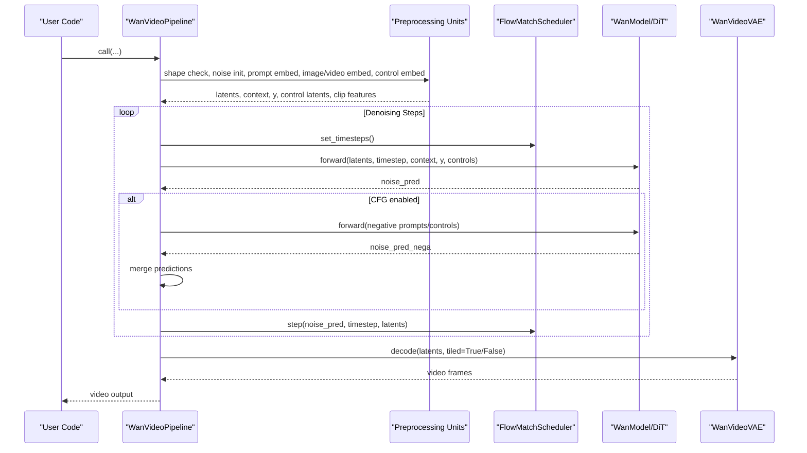

**Diagram sources**
- [wan_video.py:189-359](file://diffsynth/pipelines/wan_video.py#L189-L359)
- [wan_video_dit.py:510-552](file://diffsynth/models/wan_video_dit.py#L510-L552)
- [wan_video_vae.py:736-800](file://diffsynth/models/wan_video_vae.py#L736-L800)

## Detailed Component Analysis

### DiT Backbone: WanModel
- Patch embedding: 3D convolution over (f, h, w).
- Time embedding: sinusoidal embedding projected to modulation parameters.
- Text embedding: linear projection of T5 outputs.
- Blocks: DiTBlock with self-attention, cross-attention (optional image tokens), modulation, and gated residuals.
- Frequency RoPE: 3D precomputed frequencies for spatial-temporal attention.
- Control adapter: SimpleAdapter integrates camera/control latents.

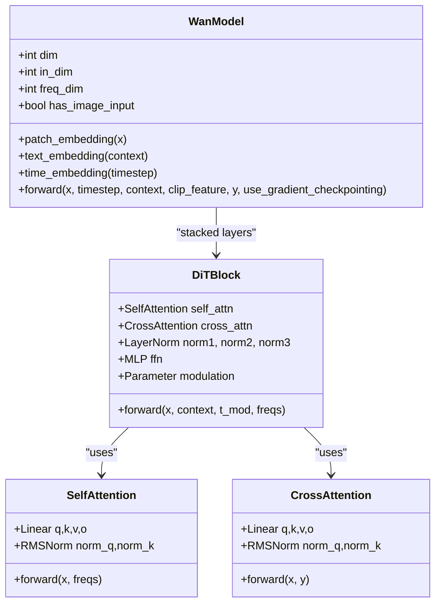

**Diagram sources**
- [wan_video_dit.py:338-423](file://diffsynth/models/wan_video_dit.py#L338-L423)
- [wan_video_dit.py:211-246](file://diffsynth/models/wan_video_dit.py#L211-L246)
- [wan_video_dit.py:139-202](file://diffsynth/models/wan_video_dit.py#L139-L202)

**Section sources**
- [wan_video_dit.py:338-423](file://diffsynth/models/wan_video_dit.py#L338-L423)
- [wan_video_dit.py:510-552](file://diffsynth/models/wan_video_dit.py#L510-L552)

### Motion Controller: WanMotionControllerModel
- Converts discrete motion bucket IDs into modulation vectors via sinusoidal embeddings and MLP.
- Used to control motion amplitude/speed during inference.

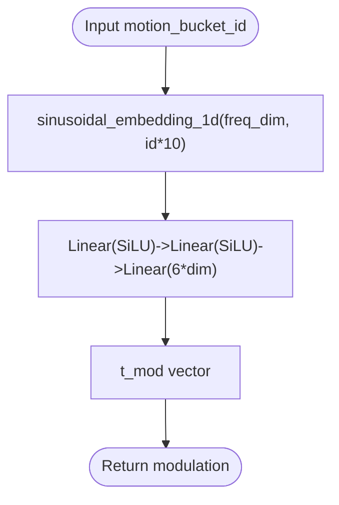

**Diagram sources**
- [wan_video_motion_controller.py:7-22](file://diffsynth/models/wan_video_motion_controller.py#L7-L22)

**Section sources**
- [wan_video_motion_controller.py:7-22](file://diffsynth/models/wan_video_motion_controller.py#L7-L22)

### Camera Control System: SimpleAdapter and Utilities
- Generates camera trajectories based on direction and speed.
- Computes Plücker embeddings from intrinsic/extrinsic parameters.
- Adapts camera latents into DiT-compatible conditioning via pixel unshuffle and residual blocks.

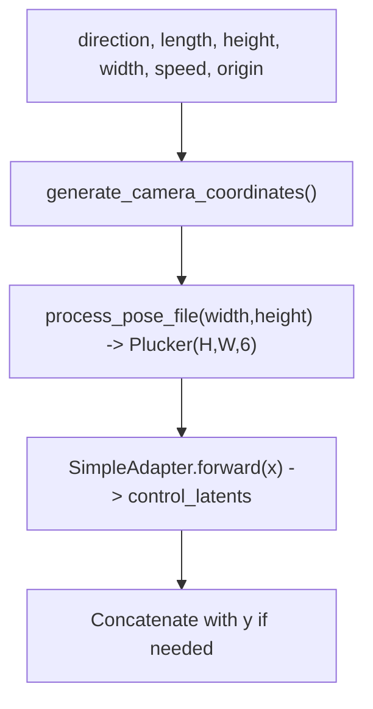

**Diagram sources**
- [wan_video_camera_controller.py:184-207](file://diffsynth/models/wan_video_camera_controller.py#L184-L207)
- [wan_video_camera_controller.py:150-181](file://diffsynth/models/wan_video_camera_controller.py#L150-L181)
- [wan_video_camera_controller.py:8-44](file://diffsynth/models/wan_video_camera_controller.py#L8-L44)

**Section sources**
- [wan_video_camera_controller.py:8-44](file://diffsynth/models/wan_video_camera_controller.py#L8-L44)

### Animate Adapter: WanAnimateAdapter
- Encodes pose and face pixel sequences into motion vectors.
- Injects motion features into DiT blocks at periodic intervals.
- Supports local editing via inpaint masks.

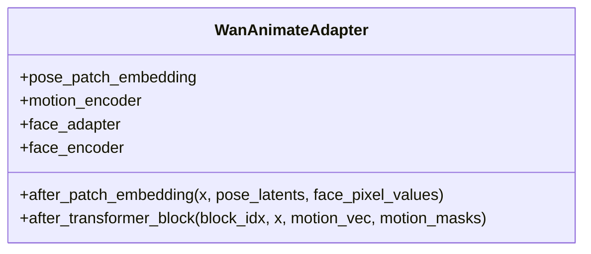

**Diagram sources**
- [wan_video_animate_adapter.py:615-651](file://diffsynth/models/wan_video_animate_adapter.py#L615-L651)

**Section sources**
- [wan_video_animate_adapter.py:615-651](file://diffsynth/models/wan_video_animate_adapter.py#L615-L651)

### VAE: WanVideoVAE
- Causal 3D convolutions ensure temporal consistency across frames.
- Residual blocks with attention and RMS normalization.
- Efficient encode/decode with tiling and feature caching for long sequences.

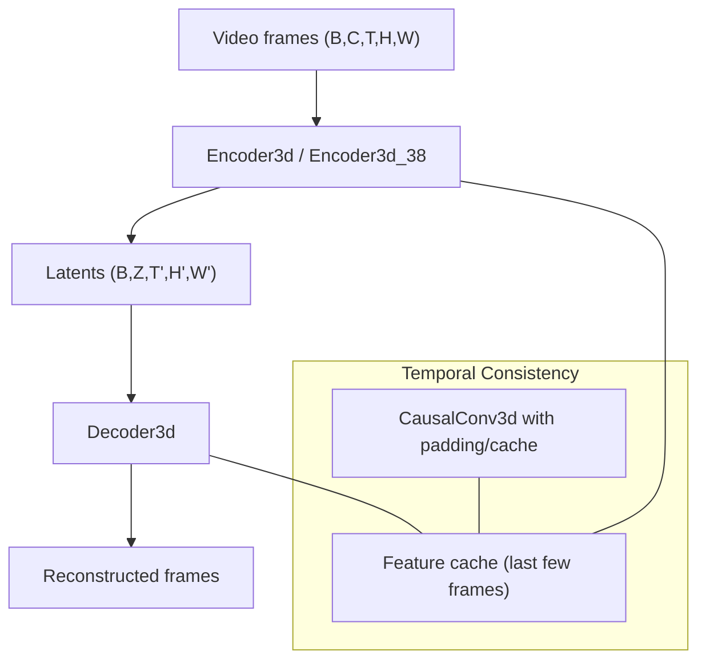

**Diagram sources**
- [wan_video_vae.py:33-53](file://diffsynth/models/wan_video_vae.py#L33-L53)
- [wan_video_vae.py:517-618](file://diffsynth/models/wan_video_vae.py#L517-L618)
- [wan_video_vae.py:736-800](file://diffsynth/models/wan_video_vae.py#L736-L800)

**Section sources**
- [wan_video_vae.py:33-53](file://diffsynth/models/wan_video_vae.py#L33-L53)

### Text Encoder: WanTextEncoder
- T5-style transformer with relative positional embeddings.
- Tokenizer wrapper supports cleaning and truncation strategies.

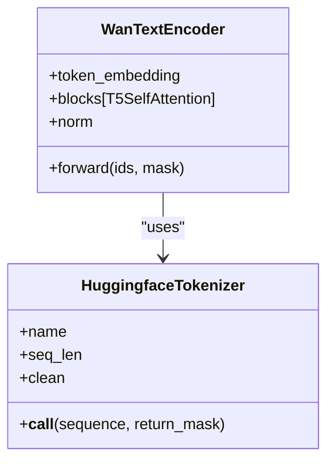

**Diagram sources**
- [wan_video_text_encoder.py:212-257](file://diffsynth/models/wan_video_text_encoder.py#L212-L257)
- [wan_video_text_encoder.py:285-330](file://diffsynth/models/wan_video_text_encoder.py#L285-L330)

**Section sources**
- [wan_video_text_encoder.py:212-257](file://diffsynth/models/wan_video_text_encoder.py#L212-L257)

### Image Encoder: WanImageEncoder
- Vision transformer for image embeddings.
- Supports interpolation for variable token lengths and pooling strategies.

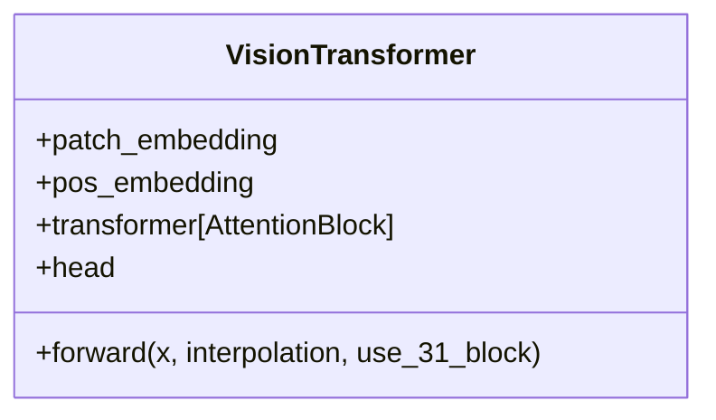

**Diagram sources**
- [wan_video_image_encoder.py:386-479](file://diffsynth/models/wan_video_image_encoder.py#L386-L479)

**Section sources**
- [wan_video_image_encoder.py:386-479](file://diffsynth/models/wan_video_image_encoder.py#L386-L479)

### MOT Extension: MotWanModel
- Integrates motion-specific attention paths alongside standard DiT blocks.
- Combines Q/K/V from main and motion streams for joint attention.

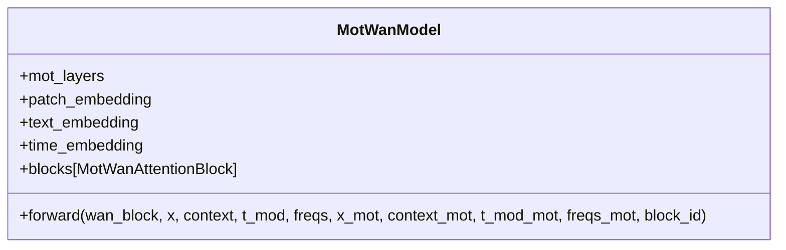

**Diagram sources**
- [wan_video_mot.py:94-170](file://diffsynth/models/wan_video_mot.py#L94-L170)

**Section sources**
- [wan_video_mot.py:94-170](file://diffsynth/models/wan_video_mot.py#L94-L170)

### VACE Extension: VaceWanModel
- Processes VACE context through specialized DiT blocks and returns skip connections/hints.

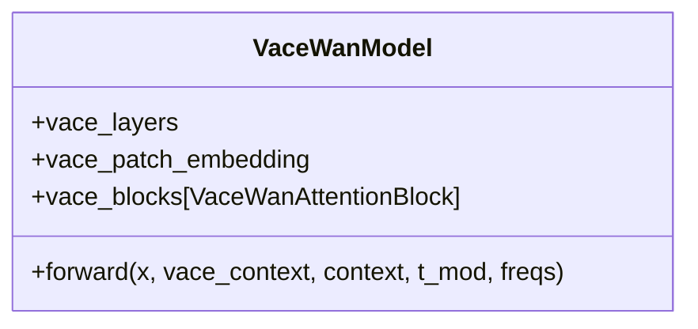

**Diagram sources**
- [wan_video_vace.py:27-75](file://diffsynth/models/wan_video_vace.py#L27-L75)

**Section sources**
- [wan_video_vace.py:27-75](file://diffsynth/models/wan_video_vace.py#L27-L75)

### Conceptual Overview
- Temporal Modeling: 3D patching and RoPE across time/space dimensions; causal convolutions in VAE maintain continuity.
- Motion Interpolation: Motion controller maps discrete IDs to continuous modulation; animate adapter derives motion vectors from pose/face sequences.
- Camera Trajectory Control: Plücker embeddings derived from camera poses guide spatial-temporal attention.
- Frame Generation: Flow-matching scheduler iteratively refines latents; VAE decodes to frames with tiling for memory efficiency.

[No sources needed since this section doesn't analyze specific files]

## Dependency Analysis
Key dependencies and relationships:
- Pipeline depends on all models and units for data preparation and denoising.
- DiT depends on attention modules, RoPE, and optional control adapters.
- VAE depends on causal 3D convolutions and attention blocks.
- Text/Image encoders provide conditioning embeddings.
- MOT/VACE extend DiT with specialized attention pathways.

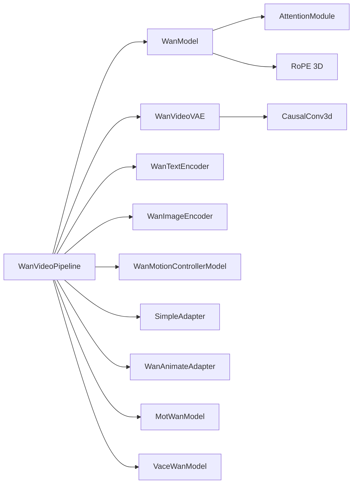

**Diagram sources**
- [wan_video.py:32-86](file://diffsynth/pipelines/wan_video.py#L32-L86)
- [wan_video_dit.py:129-137](file://diffsynth/models/wan_video_dit.py#L129-L137)
- [wan_video_vae.py:33-53](file://diffsynth/models/wan_video_vae.py#L33-L53)

**Section sources**
- [wan_video.py:32-86](file://diffsynth/pipelines/wan_video.py#L32-L86)

## Performance Considerations
- Attention backends: FlashAttention 2/3 or SageAttention fallbacks are selected automatically for efficiency.
- VRAM management: Tiled VAE encoding/decoding reduces memory usage; feature caching maintains temporal consistency without recomputation.
- Gradient checkpointing: Optional activation checkpointing for training and large inference batches.
- Multi-GPU parallelism: Unified sequence parallelism supported via xfuser integration.
- Precision: bfloat16 recommended for GPU inference; FP8 training available for select models.

**Section sources**
- [wan_video_dit.py:30-63](file://diffsynth/models/wan_video_dit.py#L30-L63)
- [wan_video_vae.py:120-175](file://diffsynth/models/wan_video_vae.py#L120-L175)
- [wan_video.py:89-108](file://diffsynth/pipelines/wan_video.py#L89-L108)
- [Wan.md:208-250](file://docs/en/Model_Details/Wan.md#L208-L250)

## Troubleshooting Guide
Common issues and resolutions:
- Insufficient VRAM: Enable tiled VAE decoding and VRAM management; reduce tile size or stride.
- Temporal flickering: Ensure causal convolutions and feature caching are active; avoid non-causal operations in custom units.
- Shape mismatches: Verify height/width multiples of 16 and num_frames = 4k+1; adjust unit processing accordingly.
- Camera control artifacts: Validate Plücker embedding dimensions and ensure correct aspect ratio scaling.
- Text/image conditioning errors: Confirm tokenizer sequence length and image resizing to target resolution.

**Section sources**
- [wan_video.py:363-373](file://diffsynth/pipelines/wan_video.py#L363-L373)
- [wan_video_vae.py:120-175](file://diffsynth/models/wan_video_vae.py#L120-L175)
- [wan_video_camera_controller.py:150-181](file://diffsynth/models/wan_video_camera_controller.py#L150-L181)

## Conclusion
The WanVideo framework provides a robust, modular system for high-quality video generation. Its DiT backbone, combined with motion controllers, camera control, animate adapters, and efficient VAE, enables diverse use cases from text-to-video to advanced control scenarios. The pipeline’s design emphasizes temporal consistency, memory efficiency, and scalability across hardware configurations.

[No sources needed since this section summarizes without analyzing specific files]

## Appendices

### API Usage Examples
- Text-to-Video: See example script for loading models and generating video from prompt.
- Image-to-Video: Provide input image and prompt; optionally specify end image for first-last frame control.
- Camera Control: Specify direction and speed to generate controlled camera movements.

**Section sources**
- [Wan2.1-T2V-14B.py:7-25](file://examples/wanvideo/model_inference/Wan2.1-T2V-14B.py#L7-L25)
- [Wan2.1-I2V-14B-720P.py:8-36](file://examples/wanvideo/model_inference/Wan2.1-I2V-14B-720P.py#L8-L36)
- [Wan2.1-Fun-V1.1-14B-Control-Camera.py:8-45](file://examples/wanvideo/model_inference/Wan2.1-Fun-V1.1-14B-Control-Camera.py#L8-L45)