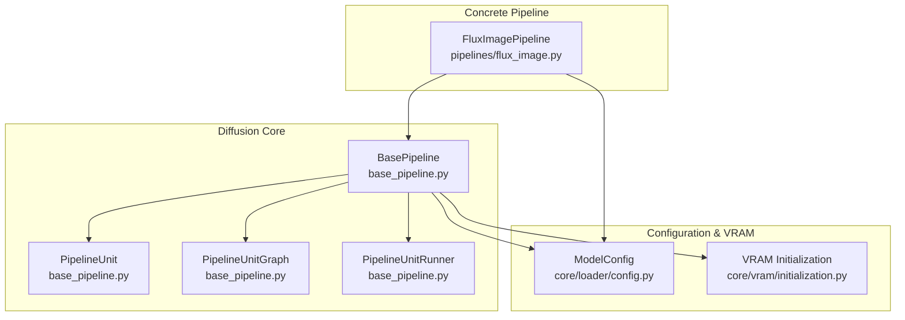
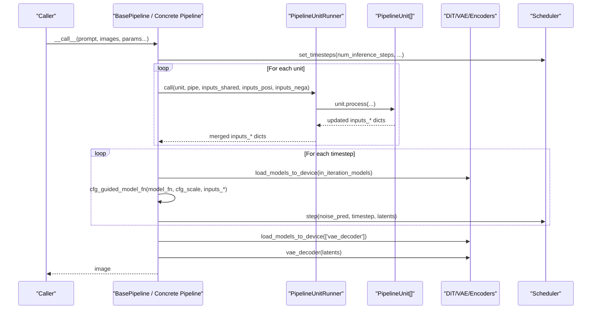
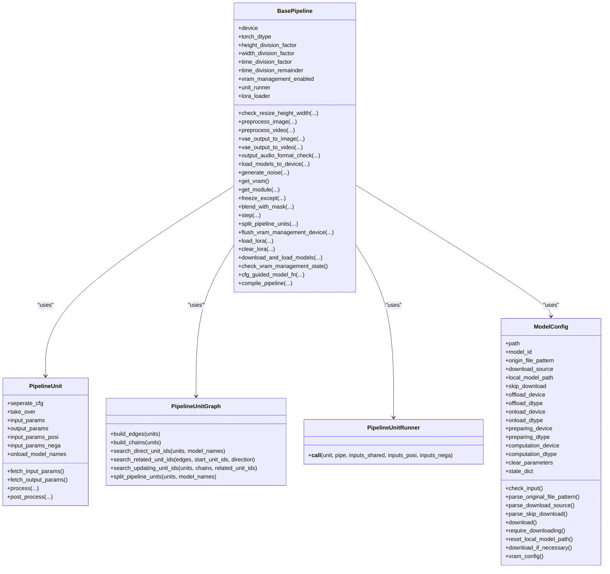

# Base Pipeline API

<cite>
**Referenced Files in This Document**
- [base_pipeline.py](file://diffusion/base_pipeline.py)
- [flux_image.py](file://diffusion/pipelines/flux_image.py)
- [config.py](file://diffusion/core/loader/config.py)
- [initialization.py](file://diffusion/core/vram/initialization.py)
</cite>

## Table of Contents
1. [Introduction](#introduction)
2. [Project Structure](#project-structure)
3. [Core Components](#core-components)
4. [Architecture Overview](#architecture-overview)
5. [Detailed Component Analysis](#detailed-component-analysis)
6. [Dependency Analysis](#dependency-analysis)
7. [Performance Considerations](#performance-considerations)
8. [Troubleshooting Guide](#troubleshooting-guide)
9. [Conclusion](#conclusion)
10. [Appendices](#appendices)

## Introduction
This document provides comprehensive API documentation for the base pipeline architecture used across diffusion pipelines. It focuses on the BasePipeline class and its core methods, the PipelineUnit system for composable processing stages, configuration parsing via ModelConfig, model loading mechanisms, VRAM management integration, and extension points for custom functionality. Concrete examples are drawn from a real pipeline implementation to illustrate how to extend the base pipeline and implement custom generation logic.

## Project Structure
The base pipeline is defined in the diffusion module and is extended by concrete pipelines such as FluxImagePipeline. Configuration and VRAM utilities live under core/loader and core/vram respectively.

**Diagram sources**
- [base_pipeline.py:61-373](file://diffusion/base_pipeline.py#L61-L373)
- [flux_image.py:57-107](file://diffusion/pipelines/flux_image.py#L57-L107)
- [config.py:10-120](file://diffusion/core/loader/config.py#L10-L120)
- [initialization.py:5-22](file://diffusion/core/vram/initialization.py#L5-L22)

**Section sources**
- [base_pipeline.py:61-373](file://diffusion/base_pipeline.py#L61-L373)
- [flux_image.py:57-107](file://diffusion/pipelines/flux_image.py#L57-L107)
- [config.py:10-120](file://diffusion/core/loader/config.py#L10-L120)
- [initialization.py:5-22](file://diffusion/core/vram/initialization.py#L5-L22)

## Core Components
- BasePipeline: The foundational torch.nn.Module that orchestrates device/dtype handling, shape checks, preprocessing, VRAM management, LoRA loading, CFG guidance, compilation, and inference stepping.
- PipelineUnit: A composable stage with declared inputs/outputs, optional CFG separation, takeover mode, and model preloading hooks.
- PipelineUnitGraph: Builds dependency edges and chains among units to split computation into model-related and unrelated segments.
- PipelineUnitRunner: Executes units according to their flags (take_over, seperate_cfg), routing shared/positive/negative inputs and outputs.
- ModelConfig: Declarative configuration for downloading, locating, and configuring VRAM behavior of models.

Key responsibilities:
- Device and dtype management for intermediate tensors.
- Shape normalization for height/width/time dimensions.
- Image/video/audio tensor conversions.
- VRAM-aware model offload/onload cycles.
- CFG-guided noise prediction composition.
- Torch.compile integration for performance.

**Section sources**
- [base_pipeline.py:61-373](file://diffusion/base_pipeline.py#L61-L373)
- [base_pipeline.py:14-59](file://diffusion/base_pipeline.py#L14-L59)
- [base_pipeline.py:375-467](file://diffusion/base_pipeline.py#L375-L467)
- [base_pipeline.py:470-501](file://diffusion/base_pipeline.py#L470-L501)
- [config.py:10-120](file://diffusion/core/loader/config.py#L10-L120)

## Architecture Overview
The pipeline executes a sequence of PipelineUnits to prepare inputs, then iteratively denoises using a scheduler and a model function wrapped by CFG guidance. VRAM management ensures only necessary modules are loaded during each phase.

**Diagram sources**
- [flux_image.py:180-291](file://diffusion/pipelines/flux_image.py#L180-L291)
- [base_pipeline.py:220-226](file://diffusion/base_pipeline.py#L220-L226)
- [base_pipeline.py:321-340](file://diffusion/base_pipeline.py#L321-L340)
- [base_pipeline.py:157-179](file://diffusion/base_pipeline.py#L157-L179)

## Detailed Component Analysis

### BasePipeline API
- __init__(device, torch_dtype, height_division_factor, width_division_factor, time_division_factor, time_division_remainder)
  - Initializes device/dtype for intermediates, shape check factors, VRAM flag, unit runner, and LoRA loader reference.
- to(*args, **kwargs)
  - Overrides .to() to update stored device/dtype while delegating to parent.
- check_resize_height_width(height, width, num_frames=None, verbose=1)
  - Rounds dimensions to required division factors; supports time dimension rounding when frames provided.
- preprocess_image(image, torch_dtype=None, device=None, pattern="B C H W", min_value=-1, max_value=1)
  - Converts PIL image to tensor with specified dtype/device and scaling.
- preprocess_video(video, torch_dtype=None, device=None, pattern="B C T H W", min_value=-1, max_value=1)
  - Stacks list of images into a video tensor.
- vae_output_to_image(vae_output, pattern="B C H W", min_value=-1, max_value=1)
  - Converts latent output to PIL image.
- vae_output_to_video(vae_output, pattern="B C T H W", min_value=-1, max_value=1)
  - Converts latent output to list of PIL images.
- output_audio_format_check(audio_output)
  - Normalizes audio tensor format to [C, T] float.
- load_models_to_device(model_names)
  - Offloads non-requested children and onloads requested ones if they support VRAM management.
- generate_noise(shape, seed=None, rand_device="cpu", rand_torch_dtype=torch.float32, device=None, torch_dtype=None)
  - Creates Gaussian noise with optional seeding.
- get_vram()
  - Returns available VRAM in GB for current device type.
- get_module(model, name)
  - Resolves nested module by dotted or indexed path.
- freeze_except(model_names)
  - Freezes all parameters except those named; useful for selective training.
- blend_with_mask(base, addition, mask)
  - Blends two tensors using a mask.
- step(scheduler, latents, progress_id, noise_pred, input_latents=None, inpaint_mask=None, **kwargs)
  - Applies scheduler step with optional inpainting blending.
- split_pipeline_units(model_names: list[str])
  - Splits units into related/unrelated sets based on model dependencies.
- flush_vram_management_device(device)
  - Sets offload/onload/preparing/computation devices for AutoTorchModule instances.
- load_lora(module, lora_config=None, alpha=1, hotload=None, state_dict=None, verbose=1)
  - Loads LoRA either by fusing into base or hotloading into wrapped linear layers when VRAM management is enabled.
- clear_lora(verbose=1)
  - Clears accumulated LoRA weights from wrapped linear layers.
- download_and_load_models(model_configs=[], vram_limit=None)
  - Downloads and auto-loads models via ModelPool using ModelConfig.vram_config().
- check_vram_management_state()
  - Detects whether any child module has VRAM management enabled.
- cfg_guided_model_fn(model_fn, cfg_scale, inputs_shared, inputs_posi, inputs_nega, **inputs_others)
  - Computes positive and negative predictions and blends them per CFG scale; supports tuple outputs for multi-modal latents.
- compile_pipeline(mode="default", dynamic=True, fullgraph=False, compile_models=None, **kwargs)
  - Compiles models listed in compilable_models; supports regional compilation for repeated blocks.

Error handling patterns:
- VRAM management disabled errors when attempting hotload LoRA without enabling VRAM management.
- Missing model names raise informative messages during compilation.
- Validation errors for invalid ModelConfig inputs.

Return value specifications:
- preprocess_* and vae_output_* return torch.Tensor or PIL.Image as appropriate.
- generate_noise returns a torch.Tensor of given shape.
- step returns updated latents.
- cfg_guided_model_fn returns noise prediction(s) matching model_fn signature.

**Section sources**
- [base_pipeline.py:61-373](file://diffusion/base_pipeline.py#L61-L373)
- [base_pipeline.py:157-179](file://diffusion/base_pipeline.py#L157-L179)
- [base_pipeline.py:242-294](file://diffusion/base_pipeline.py#L242-L294)
- [base_pipeline.py:296-319](file://diffusion/base_pipeline.py#L296-L319)
- [base_pipeline.py:342-373](file://diffusion/base_pipeline.py#L342-L373)

### PipelineUnit System
- PipelineUnit.__init__(seperate_cfg=False, take_over=False, input_params=None, output_params=None, input_params_posi=None, input_params_nega=None, onload_model_names=None)
  - Declares I/O contracts and execution modes.
- fetch_input_params(), fetch_output_params()
  - Resolve effective input/output parameter names.
- process(pipe, **kwargs) -> dict
  - Override to compute outputs from inputs.
- post_process(pipe, **kwargs) -> dict
  - Optional post-processing hook.

Execution semantics via PipelineUnitRunner:
- take_over=True: Unit fully controls inputs_* dictionaries and can bypass standard routing.
- seperate_cfg=True: Runs separate processors for positive and negative sides when cfg_scale != 1.
- Default: Reads from inputs_shared and writes back to it.

Model preloading:
- onload_model_names triggers load_models_to_device before unit processing when needed.

**Section sources**
- [base_pipeline.py:14-59](file://diffusion/base_pipeline.py#L14-L59)
- [base_pipeline.py:470-501](file://diffusion/base_pipeline.py#L470-L501)

### PipelineUnitGraph
- build_edges(units): Constructs directed edges between units based on data flow.
- build_chains(units): Tracks variable update chains across units.
- search_direct_unit_ids(units, model_names): Finds units directly tied to specific models.
- search_related_unit_ids(edges, start_unit_ids, direction): Expands related units forward/backward.
- search_updating_unit_ids(units, chains, related_unit_ids): Identifies units updating inputs consumed by subgraph.
- split_pipeline_units(units, model_names): Returns related and unrelated unit lists for targeted execution.

Complexity considerations:
- Edge building is O(U * P) where U is number of units and P average parameters per unit.
- Graph traversal is linear in edges and nodes.

**Section sources**
- [base_pipeline.py:375-467](file://diffusion/base_pipeline.py#L375-L467)

### Configuration Parsing with ModelConfig
- Fields include path/model_id, origin_file_pattern, download_source, local_model_path, skip_download, and VRAM settings for offload/onload/preparing/computation devices and dtypes.
- Methods:
  - check_input(): Validates presence of path or model_id.
  - parse_original_file_pattern(): Normalizes file patterns.
  - parse_download_source(): Chooses download backend.
  - parse_skip_download(): Honors environment variables.
  - download(): Downloads files from configured source.
  - require_downloading(): Determines if download is needed.
  - reset_local_model_path(): Applies environment overrides.
  - download_if_necessary(): Orchestrates download and resolves final path(s).
  - vram_config(): Returns dictionary for VRAM management.

Usage in BasePipeline:
- download_and_load_models uses ModelConfig.vram_config() to configure ModelPool.auto_load_model.

**Section sources**
- [config.py:10-120](file://diffusion/core/loader/config.py#L10-L120)
- [base_pipeline.py:296-310](file://diffusion/base_pipeline.py#L296-L310)

### VRAM Management Integration
- BasePipeline.load_models_to_device(model_names): Offloads non-target children and onloads target children if they expose vram_management_enabled and offload/onload methods.
- flush_vram_management_device(device): Propagates device settings to AutoTorchModule instances.
- check_vram_management_state(): Aggregates VRAM capability across children.
- initialization.skip_model_initialization(context manager: allows constructing models on meta device to avoid memory allocation during init.

Practical effect:
- Enables dynamic loading of heavy modules only when needed, reducing peak VRAM usage.

**Section sources**
- [base_pipeline.py:157-179](file://diffusion/base_pipeline.py#L157-L179)
- [base_pipeline.py:233-240](file://diffusion/base_pipeline.py#L233-L240)
- [base_pipeline.py:313-318](file://diffusion/base_pipeline.py#L313-L318)
- [initialization.py:5-22](file://diffusion/core/vram/initialization.py#L5-L22)

### Concrete Example: FluxImagePipeline
- Inherits BasePipeline and defines a scheduler, tokenizers, encoders, DiT, VAE, controlnet, IP-Adapter, and other components.
- Defines a list of PipelineUnit instances to orchestrate preprocessing steps like shape checking, noise initialization, prompt embedding, input image embedding, ID generation, guidance encoding, Kontext, InfiniteYou, ControlNet, IP-Adapter, EntityControl, NexusGen, TeaCache, Flex, Step1x, ValueControl, and LoRAEncode.
- Implements __call__ which:
  - Sets scheduler timesteps.
  - Populates inputs_shared, inputs_posi, inputs_nega.
  - Iterates through units via unit_runner.
  - Performs iterative denoising with CFG-guided model function.
  - Decodes latents via VAE decoder and converts to image.

Extension points:
- Add new PipelineUnit subclasses to insert custom preprocessing or conditioning.
- Override model_fn to integrate custom DiT or control logic.
- Use compile_pipeline to enable torch.compile for acceleration.
- Integrate additional VRAM-managed modules by exposing offload/onload.

**Section sources**
- [flux_image.py:57-107](file://diffusion/pipelines/flux_image.py#L57-L107)
- [flux_image.py:180-291](file://diffusion/pipelines/flux_image.py#L180-L291)
- [flux_image.py:294-333](file://diffusion/pipelines/flux_image.py#L294-L333)
- [flux_image.py:336-394](file://diffusion/pipelines/flux_image.py#L336-L394)
- [flux_image.py:407-443](file://diffusion/pipelines/flux_image.py#L407-L443)
- [flux_image.py:447-486](file://diffusion/pipelines/flux_image.py#L447-L486)
- [flux_image.py:490-515](file://diffusion/pipelines/flux_image.py#L490-L515)

## Dependency Analysis
The base pipeline depends on core utilities for device handling, model loading, and VRAM management. Concrete pipelines depend on base pipeline and define domain-specific units and model functions.

**Diagram sources**
- [base_pipeline.py:61-373](file://diffusion/base_pipeline.py#L61-L373)
- [base_pipeline.py:14-59](file://diffusion/base_pipeline.py#L14-L59)
- [base_pipeline.py:375-467](file://diffusion/base_pipeline.py#L375-L467)
- [base_pipeline.py:470-501](file://diffusion/base_pipeline.py#L470-L501)
- [config.py:10-120](file://diffusion/core/loader/config.py#L10-L120)

**Section sources**
- [base_pipeline.py:61-373](file://diffusion/base_pipeline.py#L61-L373)
- [config.py:10-120](file://diffusion/core/loader/config.py#L10-L120)

## Performance Considerations
- Use compile_pipeline to enable torch.compile for supported models; prefer dynamic=True for flexible shapes.
- Prefer regional compilation for models with _repeated_blocks to reduce compilation overhead.
- Leverage VRAM management to minimize peak memory usage by loading only necessary modules per phase.
- Avoid unnecessary device transfers by reusing device/dtype defaults in preprocess_* methods.
- Batch operations where possible (e.g., multiple ipadapter images) to reduce kernel launch overhead.

[No sources needed since this section provides general guidance]

## Troubleshooting Guide
Common issues and resolutions:
- VRAM management not enabled when hotloading LoRA: Ensure child modules have vram_management_enabled and expose offload/onload; otherwise use fused loading.
- Missing model names during compilation: Verify that compiled model names exist as attributes of the pipeline.
- Invalid ModelConfig: Provide either path or model_id with origin_file_pattern; ensure download_source is valid.
- Shape mismatches: Adjust height/width/time division factors or allow automatic rounding via check_resize_height_width.
- Inpainting blending: Ensure inpaint_mask matches latent spatial dimensions and is properly normalized.

**Section sources**
- [base_pipeline.py:242-294](file://diffusion/base_pipeline.py#L242-L294)
- [base_pipeline.py:342-373](file://diffusion/base_pipeline.py#L342-L373)
- [config.py:28-31](file://diffusion/core/loader/config.py#L28-L31)
- [base_pipeline.py:97-114](file://diffusion/base_pipeline.py#L97-L114)
- [base_pipeline.py:220-226](file://diffusion/base_pipeline.py#L220-L226)

## Conclusion
The BasePipeline provides a robust, extensible foundation for diffusion-based pipelines. Its unit system enables modular preprocessing and conditioning, while VRAM management and configuration parsing streamline deployment across diverse hardware constraints. Concrete pipelines like FluxImagePipeline demonstrate how to compose units, manage models, and perform efficient inference. Extending the base pipeline involves implementing custom PipelineUnit subclasses and integrating additional models through ModelConfig and VRAM-aware loaders.

[No sources needed since this section summarizes without analyzing specific files]

## Appendices

### How to Extend the Base Pipeline
Steps:
1. Subclass BasePipeline and initialize your models and scheduler.
2. Define a list of PipelineUnit instances describing preprocessing steps.
3. Implement __call__ to populate inputs_shared, inputs_posi, inputs_nega, run units via unit_runner, iterate denoising steps with cfg_guided_model_fn, and decode outputs.
4. Optionally enable compile_pipeline for acceleration and configure VRAM management via ModelConfig.

Example references:
- FluxImagePipeline definition and units: [flux_image.py:57-107](file://diffusion/pipelines/flux_image.py#L57-L107)
- __call__ workflow: [flux_image.py:180-291](file://diffusion/pipelines/flux_image.py#L180-L291)
- Custom unit example (PromptEmbedder): [flux_image.py:336-394](file://diffusion/pipelines/flux_image.py#L336-L394)

**Section sources**
- [flux_image.py:57-107](file://diffusion/pipelines/flux_image.py#L57-L107)
- [flux_image.py:180-291](file://diffusion/pipelines/flux_image.py#L180-L291)
- [flux_image.py:336-394](file://diffusion/pipelines/flux_image.py#L336-L394)