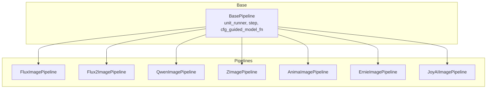
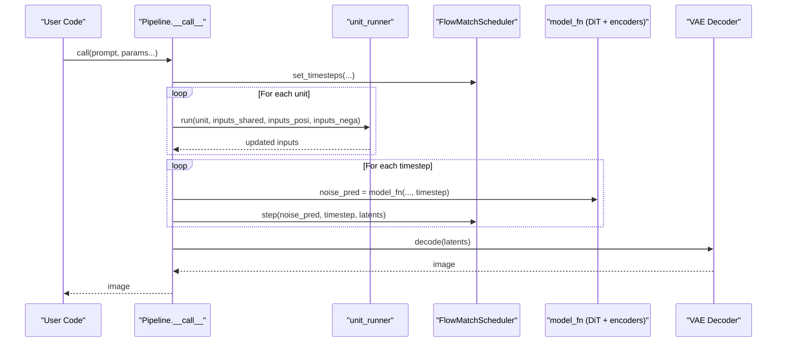
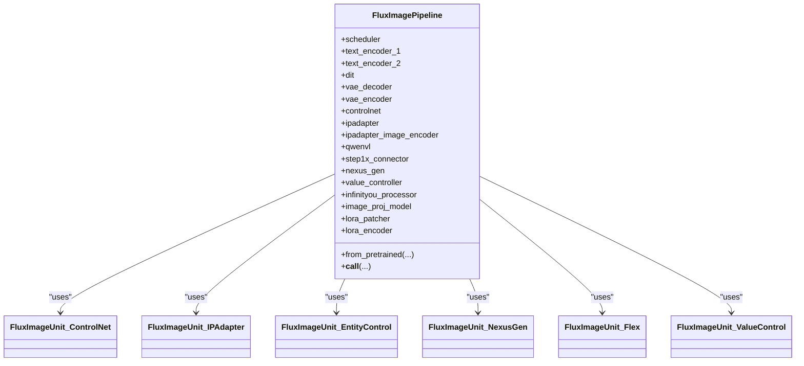
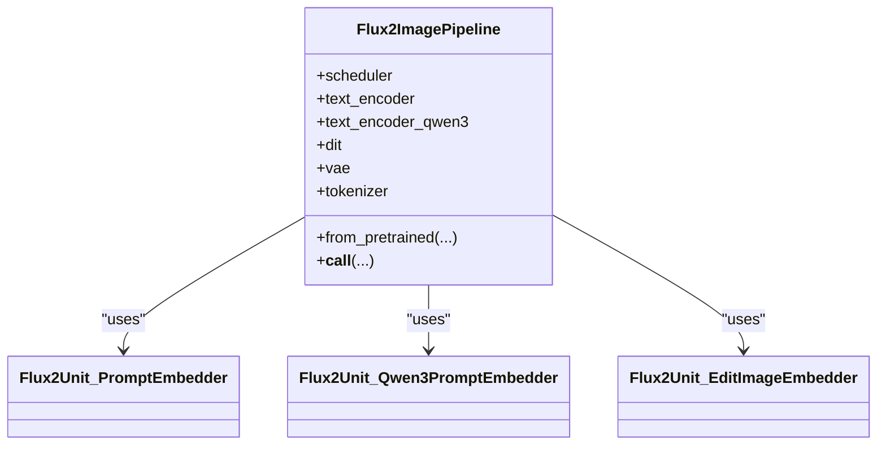
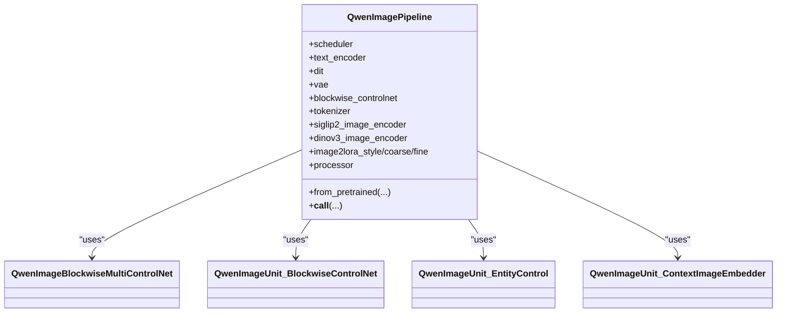
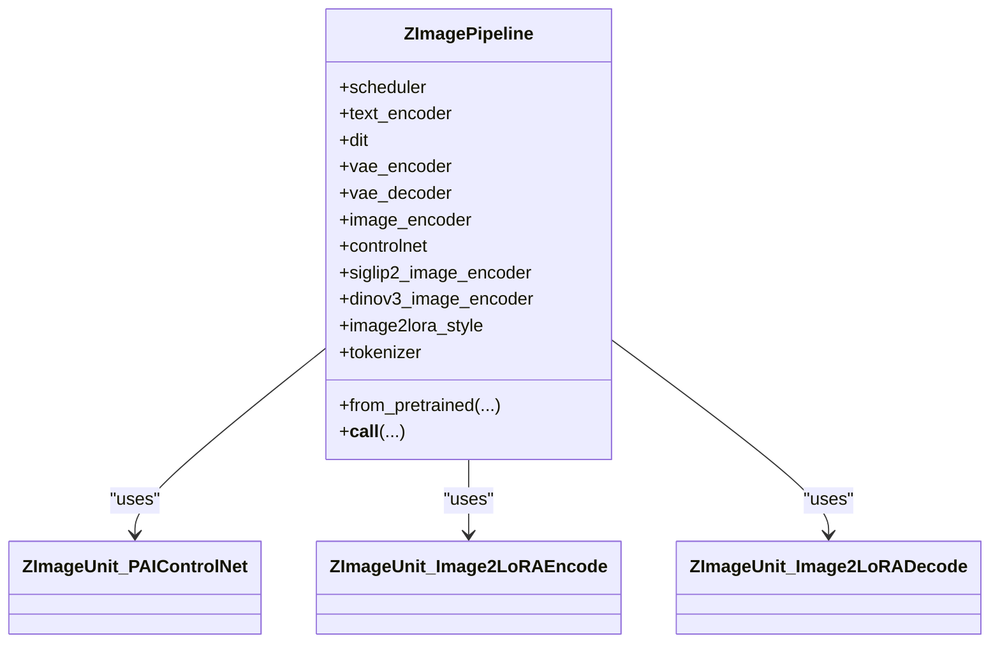
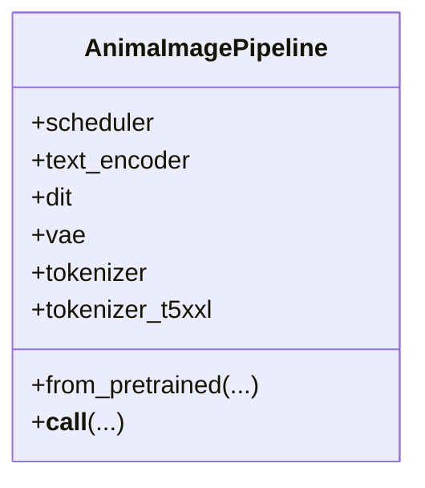
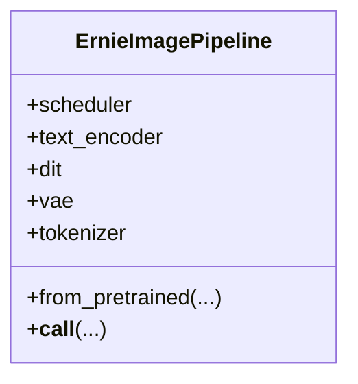
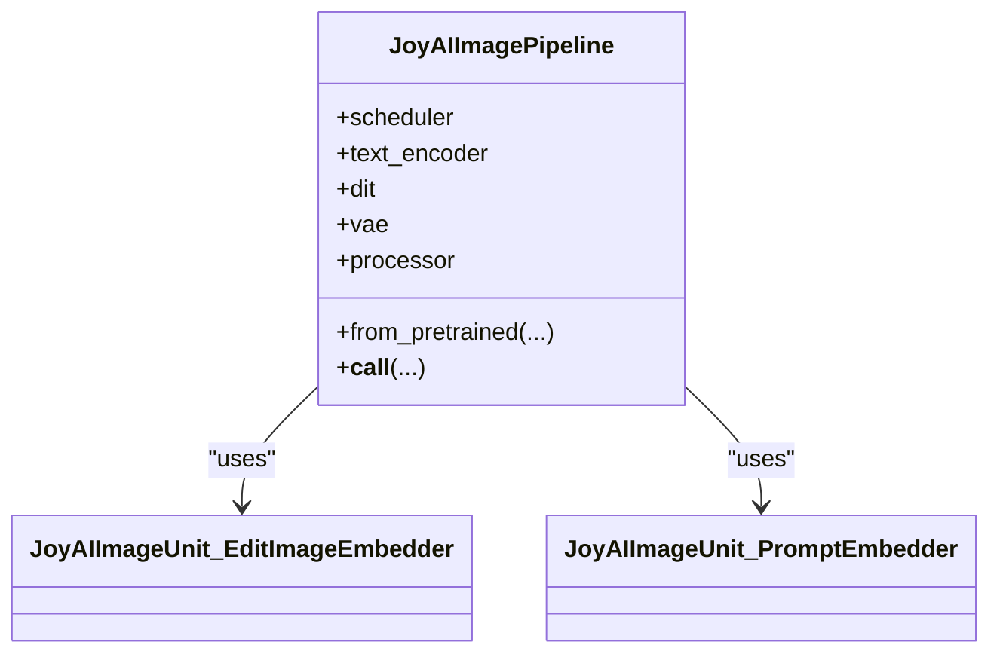
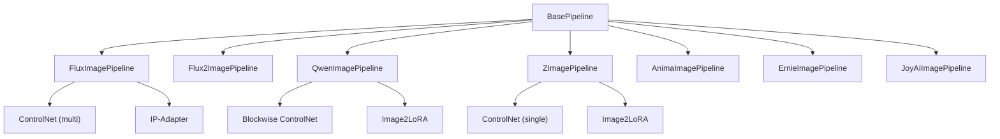

# Image Pipelines API

<cite>
**Referenced Files in This Document**
- [base_pipeline.py](file://diffsynth/diffusion/base_pipeline.py)
- [flux_image.py](file://diffsynth/pipelines/flux_image.py)
- [flux2_image.py](file://diffsynth/pipelines/flux2_image.py)
- [qwen_image.py](file://diffsynth/pipelines/qwen_image.py)
- [z_image.py](file://diffsynth/pipelines/z_image.py)
- [anima_image.py](file://diffsynth/pipelines/anima_image.py)
- [ernie_image.py](file://diffsynth/pipelines/ernie_image.py)
- [joyai_image.py](file://diffsynth/pipelines/joyai_image.py)
</cite>

## Table of Contents
1. Introduction
2. Project Structure
3. Core Components
4. Architecture Overview
5. Detailed Component Analysis
6. Dependency Analysis
7. Performance Considerations
8. Troubleshooting Guide
9. Conclusion

## Introduction
This document provides comprehensive API documentation for image generation pipelines in the repository, covering FLUX, FLUX2, Qwen-Image, Z-Image, Anima, ERNIE-Image, and JoyAI-Image pipelines. It details the generate() methods (implemented as __call__ on each pipeline), parameter specifications, sampling strategies, output formats, text-to-image generation, image editing capabilities, ControlNet integration, and IP-Adapter support. It also includes method signatures, parameter validation rules, error handling patterns, performance optimization tips, and practical examples for common use cases such as prompt-based generation, style transfer, and conditional generation.

## Project Structure
The pipelines are implemented under diffsynth/pipelines with shared base logic in diffsynth/diffusion/base_pipeline.py. Each pipeline defines:
- A pipeline class inheriting from BasePipeline
- A set of PipelineUnit steps that preprocess inputs, encode prompts/images, apply control signals, and prepare latents
- A model_fn that wires the DiT/text encoders/VAE into the diffusion loop
- A __call__ method implementing the inference loop using FlowMatchScheduler

**Diagram sources**
- [base_pipeline.py:61-373](file://diffsynth/diffusion/base_pipeline.py#L61-L373)
- [flux_image.py:57-108](file://diffsynth/pipelines/flux_image.py#L57-L108)
- [flux2_image.py:21-46](file://diffsynth/pipelines/flux2_image.py#L21-L46)
- [qwen_image.py:25-61](file://diffsynth/pipelines/qwen_image.py#L25-L61)
- [z_image.py:27-58](file://diffsynth/pipelines/z_image.py#L27-L58)
- [anima_image.py:21-43](file://diffsynth/pipelines/anima_image.py#L21-L43)
- [ernie_image.py:21-43](file://diffsynth/pipelines/ernie_image.py#L21-L43)
- [joyai_image.py:15-38](file://diffsynth/pipelines/joyai_image.py#L15-L38)

**Section sources**
- [base_pipeline.py:61-373](file://diffsynth/diffusion/base_pipeline.py#L61-L373)

## Core Components
- BasePipeline: Provides unit runner, CFG guidance, noise generation, VRAM management, LoRA loading, and standard preprocessing utilities.
- FlowMatchScheduler: Used by all pipelines to schedule timesteps and perform denoising steps.
- PipelineUnit: Modular processing steps for shape checks, prompt embedding, input image encoding, ControlNet/IP-Adapter conditioning, etc.

Key responsibilities:
- Shape normalization and device/dtype handling
- Prompt and image tokenization/encoding
- Latent initialization and noise scheduling
- Denoising loop with CFG
- VAE decoding to images

**Section sources**
- [base_pipeline.py:61-373](file://diffsynth/diffusion/base_pipeline.py#L61-L373)

## Architecture Overview
All pipelines follow a consistent architecture:
- Preprocessing units prepare latents, embeddings, and control signals
- The denoising loop iterates over scheduler timesteps, calling a model_fn per step
- CFG is applied via cfg_guided_model_fn
- VAE decodes final latents to images

**Diagram sources**
- [base_pipeline.py:321-373](file://diffsynth/diffusion/base_pipeline.py#L321-L373)
- [flux_image.py:180-291](file://diffsynth/pipelines/flux_image.py#L180-L291)
- [flux2_image.py:74-139](file://diffsynth/pipelines/flux2_image.py#L74-L139)
- [qwen_image.py:100-197](file://diffsynth/pipelines/qwen_image.py#L100-L197)
- [z_image.py:94-166](file://diffsynth/pipelines/z_image.py#L94-L166)
- [anima_image.py:73-134](file://diffsynth/pipelines/anima_image.py#L73-L134)
- [ernie_image.py:66-117](file://diffsynth/pipelines/ernie_image.py#L66-L117)
- [joyai_image.py:64-131](file://diffsynth/pipelines/joyai_image.py#L64-L131)

## Detailed Component Analysis

### FluxImagePipeline
- Purpose: FLUX.1 text-to-image and image editing pipeline with extensive controls (ControlNet, IP-Adapter, Value Controller, InfiniteYou, NexusGen, Step1x).
- Scheduler: FlowMatchScheduler("FLUX.1")
- Key parameters in __call__:
  - prompt, negative_prompt, cfg_scale, embedded_guidance, t5_sequence_length
  - input_image, denoising_strength
  - height, width, seed, rand_device
  - sigma_shift, num_inference_steps
  - kontext_images
  - controlnet_inputs (list[ControlNetInput])
  - ipadapter_images, ipadapter_scale
  - eligen_entity_prompts/masks, eligen_enable_on_negative/inpaint
  - infinityou_id_image, infinityou_guidance
  - flex_inpaint_image/mask, flex_control_image/strength/stop
  - value_controller_inputs
  - step1x_reference_image, nexus_gen_reference_image
  - lora_encoder_inputs/scale
  - tea_cache_l1_thresh
  - tiled/tile_size/tile_stride
- Output: PIL.Image
- Notable features:
  - Multi-ControlNet support with per-controlnet start/end scales
  - IP-Adapter integration via SigLIP image encoder
  - Entity-level control (EliGen)
  - Flex inpaint/control blending
  - Value controller embedding injection
  - Optional LoRA encoder and patcher

**Diagram sources**
- [flux_image.py:57-108](file://diffsynth/pipelines/flux_image.py#L57-L108)
- [flux_image.py:447-516](file://diffsynth/pipelines/flux_image.py#L447-L516)
- [flux_image.py:519-609](file://diffsynth/pipelines/flux_image.py#L519-L609)
- [flux_image.py:611-665](file://diffsynth/pipelines/flux_image.py#L611-L665)
- [flux_image.py:705-741](file://diffsynth/pipelines/flux_image.py#L705-L741)
- [flux_image.py:761-789](file://diffsynth/pipelines/flux_image.py#L761-L789)

**Section sources**
- [flux_image.py:57-108](file://diffsynth/pipelines/flux_image.py#L57-L108)
- [flux_image.py:180-291](file://diffsynth/pipelines/flux_image.py#L180-L291)
- [flux_image.py:447-516](file://diffsynth/pipelines/flux_image.py#L447-L516)
- [flux_image.py:519-609](file://diffsynth/pipelines/flux_image.py#L519-L609)
- [flux_image.py:611-665](file://diffsynth/pipelines/flux_image.py#L611-L665)
- [flux_image.py:705-741](file://diffsynth/pipelines/flux_image.py#L705-L741)
- [flux_image.py:761-789](file://diffsynth/pipelines/flux_image.py#L761-L789)

### Flux2ImagePipeline
- Purpose: FLUX.2 text-to-image with optional edit images and Qwen3 or Mistral-style text encoders.
- Scheduler: FlowMatchScheduler("FLUX.2")
- Key parameters in __call__:
  - prompt, negative_prompt, cfg_scale, embedded_guidance
  - input_image, denoising_strength
  - edit_image (list of images), edit_image_auto_resize
  - height, width, seed, rand_device, initial_noise
  - num_inference_steps
- Output: PIL.Image
- Notable features:
  - Dual text encoders: Mistral-like (Flux2TextEncoder) and Qwen3 (ZImageTextEncoder)
  - Edit image latent concatenation with IDs
  - Dynamic shift length based on resolution

**Diagram sources**
- [flux2_image.py:21-46](file://diffsynth/pipelines/flux2_image.py#L21-L46)
- [flux2_image.py:154-300](file://diffsynth/pipelines/flux2_image.py#L154-L300)
- [flux2_image.py:302-429](file://diffsynth/pipelines/flux2_image.py#L302-L429)
- [flux2_image.py:469-536](file://diffsynth/pipelines/flux2_image.py#L469-L536)

**Section sources**
- [flux2_image.py:21-46](file://diffsynth/pipelines/flux2_image.py#L21-L46)
- [flux2_image.py:74-139](file://diffsynth/pipelines/flux2_image.py#L74-L139)
- [flux2_image.py:154-300](file://diffsynth/pipelines/flux2_image.py#L154-L300)
- [flux2_image.py:302-429](file://diffsynth/pipelines/flux2_image.py#L302-L429)
- [flux2_image.py:469-536](file://diffsynth/pipelines/flux2_image.py#L469-L536)

### QwenImagePipeline
- Purpose: Qwen-Image text-to-image and editing with blockwise ControlNet, entity control, layered inputs, and context images.
- Scheduler: FlowMatchScheduler("Qwen-Image")
- Key parameters in __call__:
  - prompt, negative_prompt, cfg_scale
  - input_image, denoising_strength
  - inpaint_mask, inpaint_blur_size, inpaint_blur_sigma
  - height, width, seed, rand_device
  - num_inference_steps, exponential_shift_mu
  - blockwise_controlnet_inputs (list[ControlNetInput])
  - eligen_entity_prompts/masks, eligen_enable_on_negative
  - edit_image, edit_image_auto_resize, edit_rope_interpolation
  - zero_cond_t
  - layer_input_image, layer_num
  - context_image
  - tiled/tile_size/tile_stride
- Output: PIL.Image or list of images (when layer_num is provided)
- Notable features:
  - Blockwise ControlNet with per-block activation windows
  - Entity control (EliGen) with masks
  - Layered input and context conditioning
  - Flexible edit modes and multi-image editing

**Diagram sources**
- [qwen_image.py:25-61](file://diffsynth/pipelines/qwen_image.py#L25-L61)
- [qwen_image.py:200-227](file://diffsynth/pipelines/qwen_image.py#L200-L227)
- [qwen_image.py:523-564](file://diffsynth/pipelines/qwen_image.py#L523-L564)
- [qwen_image.py:441-520](file://diffsynth/pipelines/qwen_image.py#L441-L520)
- [qwen_image.py:719-736](file://diffsynth/pipelines/qwen_image.py#L719-L736)

**Section sources**
- [qwen_image.py:25-61](file://diffsynth/pipelines/qwen_image.py#L25-L61)
- [qwen_image.py:100-197](file://diffsynth/pipelines/qwen_image.py#L100-L197)
- [qwen_image.py:200-227](file://diffsynth/pipelines/qwen_image.py#L200-L227)
- [qwen_image.py:523-564](file://diffsynth/pipelines/qwen_image.py#L523-L564)
- [qwen_image.py:441-520](file://diffsynth/pipelines/qwen_image.py#L441-L520)
- [qwen_image.py:719-736](file://diffsynth/pipelines/qwen_image.py#L719-L736)

### ZImagePipeline
- Purpose: Z-Image text-to-image and editing with ControlNet, image-to-LoRA, and NPU optimizations.
- Scheduler: FlowMatchScheduler("Z-Image")
- Key parameters in __call__:
  - prompt, negative_prompt, cfg_scale
  - input_image, denoising_strength
  - edit_image, edit_image_auto_resize
  - height, width, seed, rand_device
  - num_inference_steps, sigma_shift
  - controlnet_inputs (list[ControlNetInput])
  - image2lora_images, positive_only_lora
- Output: PIL.Image
- Notable features:
  - ControlNet integration with single-controlnet constraint
  - Image2LoRA style encoding via SigLIP2/DINOv3
  - NPU patching for RMSNorm and RoPE

**Diagram sources**
- [z_image.py:27-58](file://diffsynth/pipelines/z_image.py#L27-L58)
- [z_image.py:407-445](file://diffsynth/pipelines/z_image.py#L407-L445)
- [z_image.py:502-565](file://diffsynth/pipelines/z_image.py#L502-L565)

**Section sources**
- [z_image.py:27-58](file://diffsynth/pipelines/z_image.py#L27-L58)
- [z_image.py:94-166](file://diffsynth/pipelines/z_image.py#L94-L166)
- [z_image.py:407-445](file://diffsynth/pipelines/z_image.py#L407-L445)
- [z_image.py:502-565](file://diffsynth/pipelines/z_image.py#L502-L565)

### AnimaImagePipeline
- Purpose: Anima text-to-image using WanVideoVAE and ZImageTextEncoder.
- Scheduler: FlowMatchScheduler("Z-Image")
- Key parameters in __call__:
  - prompt, negative_prompt, cfg_scale
  - input_image, denoising_strength
  - height, width, seed, rand_device
  - num_inference_steps, sigma_shift
- Output: PIL.Image
- Notable features:
  - Uses WanVideoVAE for decoding
  - Text encoder outputs hidden states; T5XXL ids passed alongside

**Diagram sources**
- [anima_image.py:21-43](file://diffsynth/pipelines/anima_image.py#L21-L43)

**Section sources**
- [anima_image.py:21-43](file://diffsynth/pipelines/anima_image.py#L21-L43)
- [anima_image.py:73-134](file://diffsynth/pipelines/anima_image.py#L73-L134)

### ErnieImagePipeline
- Purpose: ERNIE-Image text-to-image with shared AdaLN DiT and joint attention.
- Scheduler: FlowMatchScheduler("ERNIE-Image")
- Key parameters in __call__:
  - prompt, negative_prompt, cfg_scale
  - height, width, seed, rand_device
  - num_inference_steps, sigma_shift
- Output: PIL.Image
- Notable features:
  - Simple text-only pipeline with robust padding and mask handling

**Diagram sources**
- [ernie_image.py:21-43](file://diffsynth/pipelines/ernie_image.py#L21-L43)

**Section sources**
- [ernie_image.py:21-43](file://diffsynth/pipelines/ernie_image.py#L21-L43)
- [ernie_image.py:66-117](file://diffsynth/pipelines/ernie_image.py#L66-L117)

### JoyAIImagePipeline
- Purpose: JoyAI-Image text-to-image/editing with processor-based multimodal prompting and reference latents.
- Scheduler: FlowMatchScheduler("Wan")
- Key parameters in __call__:
  - prompt, negative_prompt, cfg_scale
  - edit_image, denoising_strength
  - height, width, seed
  - max_sequence_length, num_inference_steps
  - tiled, tile_size, tile_stride
  - shift
- Output: PIL.Image
- Notable features:
  - Processor handles text+image prompts
  - Reference latents concatenated with noisy latents

**Diagram sources**
- [joyai_image.py:15-38](file://diffsynth/pipelines/joyai_image.py#L15-L38)
- [joyai_image.py:203-222](file://diffsynth/pipelines/joyai_image.py#L203-L222)
- [joyai_image.py:145-201](file://diffsynth/pipelines/joyai_image.py#L145-L201)

**Section sources**
- [joyai_image.py:15-38](file://diffsynth/pipelines/joyai_image.py#L15-L38)
- [joyai_image.py:64-131](file://diffsynth/pipelines/joyai_image.py#L64-L131)
- [joyai_image.py:203-222](file://diffsynth/pipelines/joyai_image.py#L203-L222)
- [joyai_image.py:145-201](file://diffsynth/pipelines/joyai_image.py#L145-L201)

## Dependency Analysis
- All pipelines depend on BasePipeline for unit execution, CFG guidance, and common utilities.
- ControlNet integration varies by pipeline:
  - FluxImagePipeline supports multiple ControlNets with per-control scaling and temporal gating.
  - QwenImagePipeline uses blockwise ControlNet with per-block activation windows.
  - ZImagePipeline supports single ControlNet with specific control_context construction.
- IP-Adapter is supported in FluxImagePipeline via SigLIP image encoder.
- LoRA support:
  - FluxImagePipeline has dedicated LoRA loader and patcher.
  - ZImagePipeline and QwenImagePipeline include image-to-LoRA modules for style transfer.

**Diagram sources**
- [base_pipeline.py:61-373](file://diffsynth/diffusion/base_pipeline.py#L61-L373)
- [flux_image.py:23-55](file://diffsynth/pipelines/flux_image.py#L23-L55)
- [flux_image.py:490-516](file://diffsynth/pipelines/flux_image.py#L490-L516)
- [qwen_image.py:200-227](file://diffsynth/pipelines/qwen_image.py#L200-L227)
- [z_image.py:407-445](file://diffsynth/pipelines/z_image.py#L407-L445)
- [z_image.py:502-565](file://diffsynth/pipelines/z_image.py#L502-L565)
- [qwen_image.py:609-717](file://diffsynth/pipelines/qwen_image.py#L609-L717)

**Section sources**
- [base_pipeline.py:61-373](file://diffsynth/diffusion/base_pipeline.py#L61-L373)
- [flux_image.py:23-55](file://diffsynth/pipelines/flux_image.py#L23-L55)
- [flux_image.py:490-516](file://diffsynth/pipelines/flux_image.py#L490-L516)
- [qwen_image.py:200-227](file://diffsynth/pipelines/qwen_image.py#L200-L227)
- [z_image.py:407-445](file://diffsynth/pipelines/z_image.py#L407-L445)
- [z_image.py:502-565](file://diffsynth/pipelines/z_image.py#L502-L565)
- [qwen_image.py:609-717](file://diffsynth/pipelines/qwen_image.py#L609-L717)

## Performance Considerations
- Use FlowMatchScheduler with appropriate num_inference_steps and denoising_strength for speed-quality trade-offs.
- Enable VRAM management where available to offload/onload models dynamically.
- Compile models via compile_pipeline for supported DiTs to reduce overhead.
- Prefer tiled decoding for large resolutions to avoid OOM.
- Use minimal necessary ControlNet/IP-Adapter components to reduce memory footprint.
- Leverage NPU patches in Z-Image when running on NPUs.

[No sources needed since this section provides general guidance]

## Troubleshooting Guide
Common issues and resolutions:
- Shape mismatch errors: Ensure height/width are multiples of division factors (default 16). BasePipeline automatically rounds up dimensions.
- ControlNet not applied: Verify controlnet_inputs format and ensure start/end ranges align with progress.
- IP-Adapter not affecting output: Check ipadapter_images and scale; ensure CFG scale > 1 if negative branch is used.
- Out-of-memory during decoding: Enable tiled decoding or reduce resolution.
- LoRA hotloading fails: VRAM management must be enabled; ensure AutoWrappedLinear modules exist.

Error handling patterns:
- ValueError raised when prerequisites are missing (e.g., VRAM management disabled for LoRA hotloading).
- Warnings issued for unsupported configurations (e.g., NPU patch enabling).

**Section sources**
- [base_pipeline.py:242-294](file://diffsynth/diffusion/base_pipeline.py#L242-L294)
- [flux_image.py:109-118](file://diffsynth/pipelines/flux_image.py#L109-L118)
- [z_image.py:676-690](file://diffsynth/pipelines/z_image.py#L676-L690)

## Conclusion
The image pipelines provide a unified, modular interface for diverse generative models. They share a common base for unit-driven preprocessing, CFG-guided denoising, and VAE decoding. Advanced features like ControlNet, IP-Adapter, and LoRA enable flexible conditional generation and style transfer. By following the parameter specifications and leveraging performance tips, users can efficiently generate high-quality images across multiple architectures.

[No sources needed since this section summarizes without analyzing specific files]