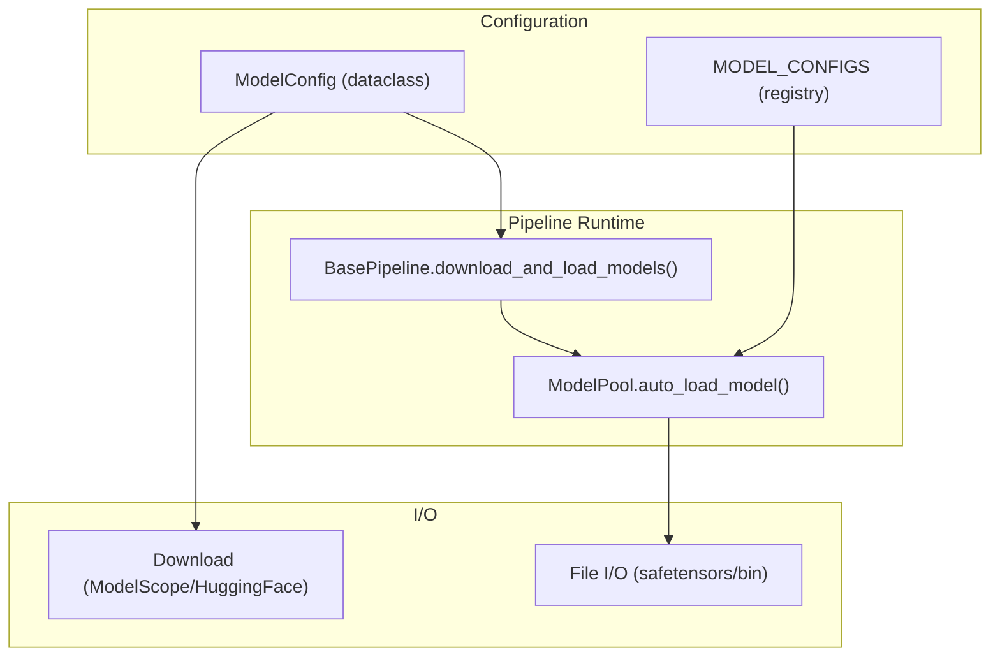
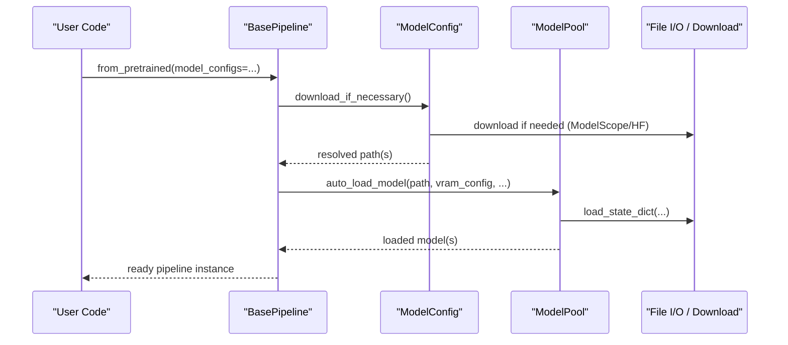
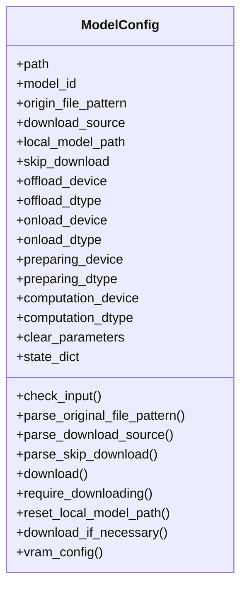
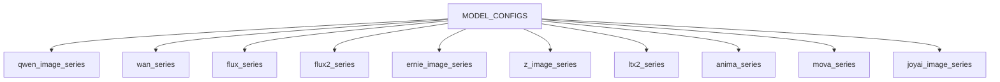
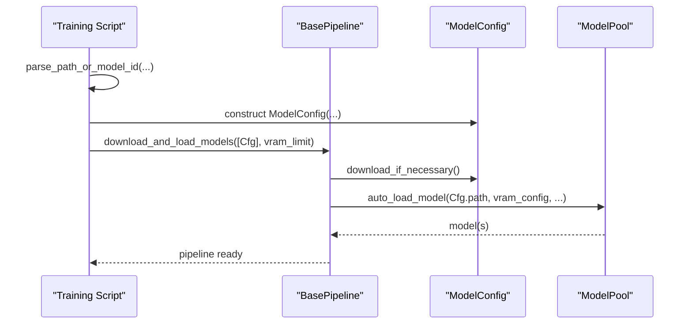
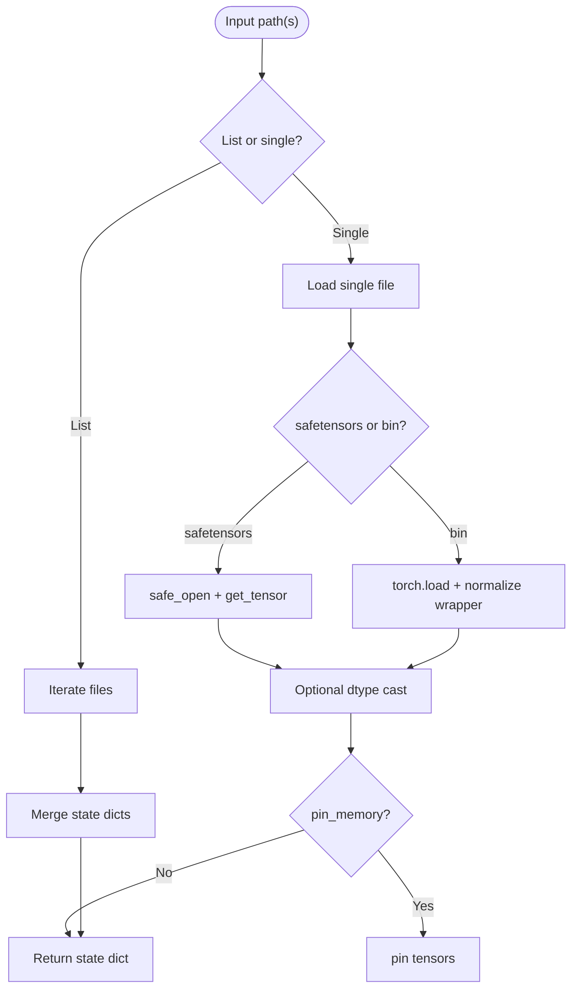
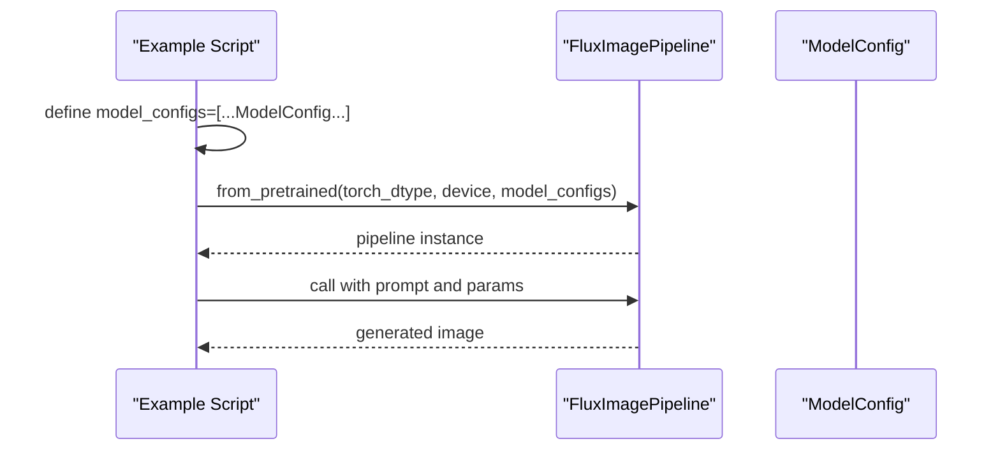
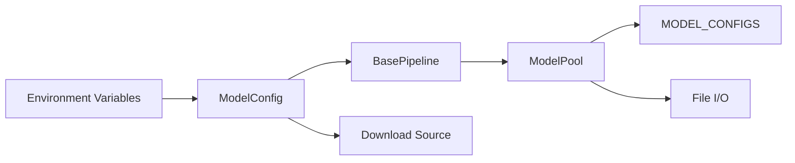

# Pipeline Configuration API

<cite>
**Referenced Files in This Document**
- [config.py](file://diffsynth/core/loader/config.py)
- [model_configs.py](file://diffsynth/configs/model_configs.py)
- [base_pipeline.py](file://diffsynth/diffusion/base_pipeline.py)
- [model_loader.py](file://diffsynth/models/model_loader.py)
- [file.py](file://diffsynth/core/loader/file.py)
- [training_module.py](file://diffsynth/diffusion/training_module.py)
- [FLUX.1-dev.py](file://examples/flux/model_inference/FLUX.1-dev.py)
- [Environment_Variables.md](file://docs/zh/Pipeline_Usage/Environment_Variables.md)
</cite>

## Table of Contents
1. [Introduction](#introduction)
2. [Project Structure](#project-structure)
3. [Core Components](#core-components)
4. [Architecture Overview](#architecture-overview)
5. [Detailed Component Analysis](#detailed-component-analysis)
6. [Dependency Analysis](#dependency-analysis)
7. [Performance Considerations](#performance-considerations)
8. [Troubleshooting Guide](#troubleshooting-guide)
9. [Conclusion](#conclusion)
10. [Appendices](#appendices)

## Introduction
This document provides a comprehensive API reference for the pipeline configuration system, focusing on the ModelConfig class, configuration file formats, and dynamic configuration loading mechanisms. It explains parameter validation, default value handling, environment variable integration, command-line argument parsing, runtime overrides, and configuration inheritance patterns. It also includes schema definitions for different pipeline types, validation rules, error messages, and examples for creating custom configurations and programmatically generating pipeline instances from configuration objects.

## Project Structure
The configuration system spans several modules:
- Core configuration dataclass and utilities are defined in the loader module.
- Centralized model registry entries define supported models and their instantiation parameters.
- Pipelines consume ModelConfig to download, load, and manage VRAM for models.
- Training scripts parse command-line arguments into ModelConfig instances.
- File utilities support state dict loading and hashing.

**Diagram sources**
- [config.py:1-120](file://diffsynth/core/loader/config.py#L1-L120)
- [model_configs.py:919-920](file://diffsynth/configs/model_configs.py#L919-L920)
- [base_pipeline.py:296-310](file://diffsynth/diffusion/base_pipeline.py#L296-L310)
- [model_loader.py:3-70](file://diffsynth/models/model_loader.py#L3-L70)
- [file.py:1-131](file://diffsynth/core/loader/file.py#L1-L131)

**Section sources**
- [config.py:1-120](file://diffsynth/core/loader/config.py#L1-L120)
- [model_configs.py:1-920](file://diffsynth/configs/model_configs.py#L1-L920)
- [base_pipeline.py:296-310](file://diffsynth/diffusion/base_pipeline.py#L296-L310)
- [model_loader.py:3-70](file://diffsynth/models/model_loader.py#L3-L70)
- [file.py:1-131](file://diffsynth/core/loader/file.py#L1-L131)

## Core Components
- ModelConfig: A dataclass that encapsulates all information required to locate, download, and configure a model component. It supports both local paths and remote model IDs with file patterns, device/dtype routing, and VRAM management settings.
- MODEL_CONFIGS: A centralized registry listing supported model families and their instantiation parameters, including extra_kwargs and state_dict converters.
- BasePipeline.download_and_load_models: Orchestrates downloading and loading of models based on a list of ModelConfig, applying VRAM configuration and computation dtype/device defaults.
- Training script helpers: Parse command-line inputs into ModelConfig instances, supporting both local paths and model_id:origin_file_pattern strings.

Key responsibilities:
- Validation and normalization of input fields.
- Environment-driven defaults for download source, skip behavior, and base path.
- Dynamic resolution of file paths via globbing.
- VRAM configuration exposure for downstream loaders.

**Section sources**
- [config.py:1-120](file://diffsynth/core/loader/config.py#L1-L120)
- [model_configs.py:1-920](file://diffsynth/configs/model_configs.py#L1-L920)
- [base_pipeline.py:296-310](file://diffsynth/diffusion/base_pipeline.py#L296-L310)
- [training_module.py:138-174](file://diffsynth/diffusion/training_module.py#L138-L174)

## Architecture Overview
The configuration-to-runtime flow is as follows:
- Users provide ModelConfig instances (directly or via CLI).
- BasePipeline.download_and_load_models triggers ModelConfig.download_if_necessary to resolve paths and optionally download files.
- ModelPool.auto_load_model loads state dicts and applies VRAM management strategies.
- State dict conversion and disk offloading can be applied depending on configuration.

**Diagram sources**
- [base_pipeline.py:296-310](file://diffsynth/diffusion/base_pipeline.py#L296-L310)
- [config.py:96-108](file://diffsynth/core/loader/config.py#L96-L108)
- [model_loader.py:11-65](file://diffsynth/models/model_loader.py#L11-L65)
- [file.py:5-49](file://diffsynth/core/loader/file.py#L5-L49)

## Detailed Component Analysis

### ModelConfig API
ModelConfig is a dataclass representing a single model’s configuration. It supports:
- Path-based or ID-based specification
- Origin file pattern for selective downloads
- Download source selection
- Skip download flag
- Local model base path override
- Device and dtype routing for offload/onload/preparing/computation phases
- Optional preloaded state dict
- Clearing parameters after loading

Validation and defaults:
- check_input ensures either path or model_id is provided; skip_download only valid with path.
- parse_original_file_pattern normalizes patterns.
- parse_download_source falls back to environment variable or default “modelscope”.
- parse_skip_download reads boolean-like environment values when not explicitly set.
- reset_local_model_path uses environment variable or defaults to “./models”.
- download_if_necessary performs validation, optional download, and resolves path(s), collapsing single-element lists.

VRAM configuration:
- vram_config returns a dictionary consumed by VRAM management and model loaders.

Error handling:
- Invalid download_source raises ValueError.
- Missing path/model_id raises ValueError during check_input.

**Diagram sources**
- [config.py:1-120](file://diffsynth/core/loader/config.py#L1-L120)

**Section sources**
- [config.py:1-120](file://diffsynth/core/loader/config.py#L1-L120)

### Configuration Registry (MODEL_CONFIGS)
MODEL_CONFIGS aggregates multiple series (e.g., qwen_image_series, wan_series, flux_series, flux2_series, ernie_image_series, z_image_series, ltx2_series, anima_series, mova_series, joyai_image_series). Each entry defines:
- model_hash
- model_name
- model_class
- state_dict_converter (optional)
- extra_kwargs (optional)

These entries enable automatic discovery and instantiation of models through the model loader.

**Diagram sources**
- [model_configs.py:1-920](file://diffsynth/configs/model_configs.py#L1-L920)

**Section sources**
- [model_configs.py:1-920](file://diffsynth/configs/model_configs.py#L1-L920)

### Pipeline Integration and Loading
BasePipeline.download_and_load_models:
- Iterates over model_configs, calling download_if_necessary to ensure paths are resolved.
- Builds vram_config with defaults for computation dtype/device.
- Delegates actual loading to ModelPool.auto_load_model with clear_parameters and state_dict options.

Training script helpers:
- parse_path_or_model_id supports both local paths and model_id:origin_file_pattern strings, raising informative errors when invalid.
- parse_vram_config integrates fp8/offload flags into ModelConfig construction.

**Diagram sources**
- [base_pipeline.py:296-310](file://diffsynth/diffusion/base_pipeline.py#L296-L310)
- [training_module.py:138-174](file://diffsynth/diffusion/training_module.py#L138-L174)
- [config.py:96-108](file://diffsynth/core/loader/config.py#L96-L108)

**Section sources**
- [base_pipeline.py:296-310](file://diffsynth/diffusion/base_pipeline.py#L296-L310)
- [training_module.py:138-174](file://diffsynth/diffusion/training_module.py#L138-L174)

### File I/O and State Dict Handling
File utilities provide:
- load_state_dict for safetensors and bin formats, with optional dtype casting and pin_memory optimization.
- Hashing utilities for keys and files to support integrity checks and caching.
- Key dictionaries for inspecting shapes without loading full tensors.

**Diagram sources**
- [file.py:5-49](file://diffsynth/core/loader/file.py#L5-L49)

**Section sources**
- [file.py:1-131](file://diffsynth/core/loader/file.py#L1-L131)

### Example Usage: Creating a Pipeline from Configurations
A minimal example demonstrates constructing a FluxImagePipeline using ModelConfig entries for each component.

**Diagram sources**
- [FLUX.1-dev.py:1-27](file://examples/flux/model_inference/FLUX.1-dev.py#L1-L27)

**Section sources**
- [FLUX.1-dev.py:1-27](file://examples/flux/model_inference/FLUX.1-dev.py#L1-L27)

## Dependency Analysis
- ModelConfig depends on environment variables for download source, skip behavior, and base path.
- BasePipeline relies on ModelConfig.vram_config to configure VRAM management.
- ModelPool uses MODEL_CONFIGS to discover and instantiate models, applying state_dict converters where specified.
- File utilities are used by loaders to read state dicts and compute hashes.

**Diagram sources**
- [config.py:40-59](file://diffsynth/core/loader/config.py#L40-L59)
- [base_pipeline.py:296-310](file://diffsynth/diffusion/base_pipeline.py#L296-L310)
- [model_loader.py:3-70](file://diffsynth/models/model_loader.py#L3-L70)
- [file.py:5-49](file://diffsynth/core/loader/file.py#L5-L49)

**Section sources**
- [config.py:40-59](file://diffsynth/core/loader/config.py#L40-L59)
- [base_pipeline.py:296-310](file://diffsynth/diffusion/base_pipeline.py#L296-L310)
- [model_loader.py:3-70](file://diffsynth/models/model_loader.py#L3-L70)
- [file.py:5-49](file://diffsynth/core/loader/file.py#L5-L49)

## Performance Considerations
- Use DiskMap for large models to avoid loading entire state dicts into memory.
- Enable VRAM management via vram_config to offload/onload modules dynamically.
- Prefer pin_memory=True when loading state dicts on CPU to accelerate GPU transfers.
- Compile pipelines selectively using compile_pipeline to reduce overhead for repeated blocks.

[No sources needed since this section provides general guidance]

## Troubleshooting Guide
Common issues and resolutions:
- Missing path/model_id: check_input raises an error; ensure at least one is provided.
- Invalid download_source: must be “modelscope” or “huggingface”; verify environment variable or explicit setting.
- Skip download behavior: controlled by skip_download field or DIFFSYNTH_SKIP_DOWNLOAD environment variable.
- Local model path: set via local_model_path or DIFFSYNTH_MODEL_BASE_PATH; defaults to “./models”.
- Parsing model_id:origin_file_pattern: training helper enforces format and raises ValueError otherwise.

Relevant environment variables:
- DIFFSYNTH_DOWNLOAD_SOURCE
- DIFFSYNTH_SKIP_DOWNLOAD
- DIFFSYNTH_MODEL_BASE_PATH
- DIFFSYNTH_ATTENTION_IMPLEMENTATION
- DIFFSYNTH_DISK_MAP_BUFFER_SIZE

**Section sources**
- [config.py:28-83](file://diffsynth/core/loader/config.py#L28-L83)
- [training_module.py:163-174](file://diffsynth/diffusion/training_module.py#L163-L174)
- [Environment_Variables.md:1-40](file://docs/zh/Pipeline_Usage/Environment_Variables.md#L1-L40)

## Conclusion
The pipeline configuration system centers around ModelConfig, which standardizes how models are located, downloaded, and configured across devices and dtypes. The registry MODEL_CONFIGS enables extensibility and consistent instantiation. BasePipeline orchestrates loading and VRAM management, while training utilities bridge CLI inputs to configuration objects. Together, these components provide a robust, flexible, and efficient mechanism for building and running diverse diffusion pipelines.

[No sources needed since this section summarizes without analyzing specific files]

## Appendices

### Schema Definitions for ModelConfig
Fields:
- path: Union[str, list[str]] — Local path(s) to model files or directories.
- model_id: str — Remote repository identifier.
- origin_file_pattern: Union[str, list[str]] — Glob pattern for selecting files to download/load.
- download_source: str — “modelscope” or “huggingface”.
- local_model_path: str — Root directory for downloaded models.
- skip_download: bool — Whether to skip downloading.
- offload_device/dtype: device/dtype — Offload target.
- onload_device/dtype: device/dtype — Onload target.
- preparing_device/dtype: device/dtype — Preparing stage target.
- computation_device/dtype: device/dtype — Computation target.
- clear_parameters: bool — Clear parameters after loading.
- state_dict: Dict[str, torch.Tensor] — Preloaded state dict.

Validation rules:
- At least one of path or model_id must be provided.
- skip_download is only meaningful when path is provided.
- download_source must be “modelscope” or “huggingface”.

Default value handling:
- download_source defaults to environment variable or “modelscope”.
- skip_download defaults to environment variable or False.
- local_model_path defaults to environment variable or “./models”.

**Section sources**
- [config.py:1-120](file://diffsynth/core/loader/config.py#L1-L120)

### Command-Line Argument Parsing Examples
- Training scripts accept comma-separated lists for model_paths and model_id_with_origin_paths.
- parse_path_or_model_id converts strings into ModelConfig instances, enforcing “model_id:origin_file_pattern” format.

**Section sources**
- [training_module.py:138-174](file://diffsynth/diffusion/training_module.py#L138-L174)

### Environment Variable Integration
- DIFFSYNTH_DOWNLOAD_SOURCE controls remote download source.
- DIFFSYNTH_SKIP_DOWNLOAD toggles download skipping.
- DIFFSYNTH_MODEL_BASE_PATH sets root directory for model storage.
- DIFFSYNTH_ATTENTION_IMPLEMENTATION selects attention backend.
- DIFFSYNTH_DISK_MAP_BUFFER_SIZE adjusts disk map buffer size.

**Section sources**
- [config.py:40-59](file://diffsynth/core/loader/config.py#L40-L59)
- [Environment_Variables.md:1-40](file://docs/zh/Pipeline_Usage/Environment_Variables.md#L1-L40)

### Runtime Configuration Overrides
- BasePipeline.download_and_load_models merges vram_config with defaults for computation dtype/device.
- ModelPool.auto_load_model accepts clear_parameters and state_dict overrides.
- LoRA hotloading supports runtime patching when VRAM management is enabled.

**Section sources**
- [base_pipeline.py:296-310](file://diffsynth/diffusion/base_pipeline.py#L296-L310)
- [model_loader.py:11-65](file://diffsynth/models/model_loader.py#L11-L65)

### Creating Custom Configurations and Generating Pipelines
- Define ModelConfig entries for your model components, specifying path or model_id with origin_file_pattern.
- Pass a list of ModelConfig to pipeline.from_pretrained to build a fully configured pipeline.
- Use MODEL_CONFIGS registry to extend supported models with new entries.

**Section sources**
- [model_configs.py:1-920](file://diffsynth/configs/model_configs.py#L1-L920)
- [FLUX.1-dev.py:1-27](file://examples/flux/model_inference/FLUX.1-dev.py#L1-L27)