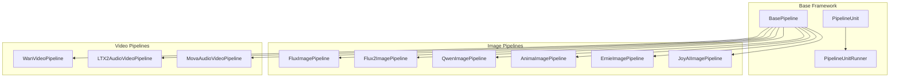
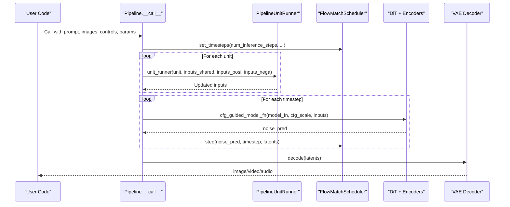
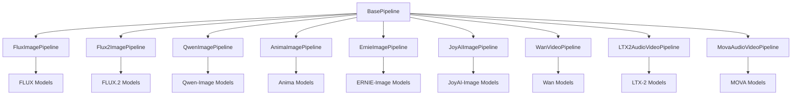

# Pipelines API

<cite>
**Referenced Files in This Document**
- [base_pipeline.py](file://diffusion/base_pipeline.py)
- [flux_image.py](file://diffusion/pipelines/flux_image.py)
- [qwen_image.py](file://diffusion/pipelines/qwen_image.py)
- [wan_video.py](file://diffusion/pipelines/wan_video.py)
- [ltx2_audio_video.py](file://diffusion/pipelines/ltx2_audio_video.py)
- [flux2_image.py](file://diffusion/pipelines/flux2_image.py)
- [mova_audio_video.py](file://diffusion/pipelines/mova_audio_video.py)
- [anima_image.py](file://diffusion/pipelines/anima_image.py)
- [ernie_image.py](file://diffusion/pipelines/ernie_image.py)
- [joyai_image.py](file://diffusion/pipelines/joyai_image.py)
</cite>

## Table of Contents
1. [Introduction](#introduction)
2. [Project Structure](#project-structure)
3. [Core Components](#core-components)
4. [Architecture Overview](#architecture-overview)
5. [Detailed Component Analysis](#detailed-component-analysis)
6. [Dependency Analysis](#dependency-analysis)
7. [Performance Considerations](#performance-considerations)
8. [Troubleshooting Guide](#troubleshooting-guide)
9. [Conclusion](#conclusion)
10. [Appendices](#appendices)

## Introduction
This document provides comprehensive API documentation for the pipeline implementations across image and video generation models. It covers:
- Image pipelines: FLUX, FLUX2, Qwen-Image, Anima, ERNIE-Image, JoyAI-Image
- Video pipelines: WanVideo, LTX-2 (audio-video), MOVA (audio-video)
- Specialized pipelines and control features (ControlNet, IP-Adapter, VACE, camera control, etc.)
For each pipeline, we detail method signatures, parameters, validation rules, sampling strategies, post-processing steps, and usage patterns. The base pipeline framework is also explained to help you understand how units compose the generation process.

## Project Structure
The pipelines are implemented as classes that inherit from a shared BasePipeline. Each pipeline defines:
- A FlowMatchScheduler instance with model-specific settings
- A list of PipelineUnit stages that prepare inputs, encode prompts/images, apply controls, and manage latents
- A model_fn that wires the DiT/text encoders/VAEs into the diffusion loop
- A __call__ entry point orchestrating unit execution, denoising steps, and decoding

**Diagram sources**
- [base_pipeline.py:61-115](file://diffusion/base_pipeline.py#L61-L115)
- [flux_image.py:57-108](file://diffusion/pipelines/flux_image.py#L57-L108)
- [flux2_image.py:21-46](file://diffusion/pipelines/flux2_image.py#L21-L46)
- [qwen_image.py:25-61](file://diffusion/pipelines/qwen_image.py#L25-L61)
- [anima_image.py:21-43](file://diffusion/pipelines/anima_image.py#L21-L43)
- [ernie_image.py:21-43](file://diffusion/pipelines/ernie_image.py#L21-L43)
- [joyai_image.py:15-38](file://diffusion/pipelines/joyai_image.py#L15-L38)
- [wan_video.py:32-87](file://diffusion/pipelines/wan_video.py#L32-L87)
- [ltx2_audio_video.py:28-80](file://diffusion/pipelines/ltx2_audio_video.py#L28-L80)
- [mova_audio_video.py:25-56](file://diffusion/pipelines/mova_audio_video.py#L25-L56)

**Section sources**
- [base_pipeline.py:61-115](file://diffusion/base_pipeline.py#L61-L115)

## Core Components
- BasePipeline: Provides common utilities such as shape checks, preprocessing, VRAM management, LoRA loading/clearing, CFG guidance, and the step function for scheduler updates.
- PipelineUnit: Declarative stage definition with input/output parameter contracts, optional separate CFG processing, and model on/offloading hooks.
- PipelineUnitRunner: Executes units in order, handling take-over semantics and CFG separation when needed.

Key capabilities exposed by BasePipeline:
- check_resize_height_width: Ensures dimensions align with model requirements
- preprocess_image/preprocess_video: Normalizes tensors and shapes
- vae_output_to_image/vae_output_to_video: Converts latent outputs to media
- load_models_to_device: VRAM-aware model lifecycle
- generate_noise: Reproducible noise initialization
- cfg_guided_model_fn: Classifier-free guidance logic
- compile_pipeline: torch.compile integration for selected models

**Section sources**
- [base_pipeline.py:97-115](file://diffusion/base_pipeline.py#L97-L115)
- [base_pipeline.py:117-156](file://diffusion/base_pipeline.py#L117-L156)
- [base_pipeline.py:157-187](file://diffusion/base_pipeline.py#L157-L187)
- [base_pipeline.py:220-227](file://diffusion/base_pipeline.py#L220-L227)
- [base_pipeline.py:321-341](file://diffusion/base_pipeline.py#L321-L341)
- [base_pipeline.py:342-373](file://diffusion/base_pipeline.py#L342-L373)

## Architecture Overview
Each pipeline composes a sequence of units to:
- Validate and adjust shapes
- Initialize noise or encode input images/videos
- Encode text prompts and optional multimodal inputs
- Apply control signals (ControlNet, IP-Adapter, VACE, camera control, etc.)
- Run the DiT forward pass per timestep with CFG
- Decode final latents to output media

**Diagram sources**
- [flux_image.py:180-291](file://diffusion/pipelines/flux_image.py#L180-L291)
- [qwen_image.py:100-197](file://diffusion/pipelines/qwen_image.py#L100-L197)
- [wan_video.py:189-359](file://diffusion/pipelines/wan_video.py#L189-L359)
- [ltx2_audio_video.py:168-249](file://diffusion/pipelines/ltx2_audio_video.py#L168-L249)
- [base_pipeline.py:321-341](file://diffusion/base_pipeline.py#L321-L341)

## Detailed Component Analysis

### FluxImagePipeline (FLUX.1)
Purpose: High-quality image generation with extensive controls (ControlNet, IP-Adapter, EliGen, InfiniteYou, Flex, Step1x, NexusGen, Value Controller, LoRA).

Key methods and signatures:
- from_pretrained(torch_dtype, device, model_configs, tokenizer_1_config, tokenizer_2_config, nexus_gen_processor_config, vram_limit)
- __call__(prompt, negative_prompt, cfg_scale, embedded_guidance, t5_sequence_length, input_image, denoising_strength, height, width, seed, rand_device, sigma_shift, num_inference_steps, kontext_images, controlnet_inputs, ipadapter_images, ipadapter_scale, eligen_entity_prompts, eligen_entity_masks, eligen_enable_on_negative, eligen_enable_inpaint, infinityou_id_image, infinityou_guidance, flex_inpaint_image, flex_inpaint_mask, flex_control_image, flex_control_strength, flex_control_stop, value_controller_inputs, step1x_reference_image, nexus_gen_reference_image, lora_encoder_inputs, lora_encoder_scale, tea_cache_l1_thresh, tiled, tile_size, tile_stride, progress_bar_cmd)

Parameters and validation:
- Shape: height/width rounded to multiples of 16 via BasePipeline.check_resize_height_width
- Scheduler: FlowMatchScheduler("FLUX.1") with configurable shift and denoising strength
- CFG: classifier-free guidance using positive/negative prompt embeddings
- Controls: ControlNetInput list; IP-Adapter images; EliGen entity prompts/masks; Flex inpaint/control images; Value controller scalars; Step1x reference image; NexusGen reference image; LoRA encoder inputs

Sampling strategy:
- Iterative denoising over scheduler.timesteps
- Optional TeaCache acceleration via threshold
- Tiled VAE encoding/decoding supported

Post-processing:
- VAE decoder produces images; converted via vae_output_to_image

Usage examples:
- Text-to-image: Provide prompt, height, width, num_inference_steps, cfg_scale
- Image-to-image: Provide input_image and denoising_strength
- ControlNet: Provide controlnet_inputs with images and masks
- IP-Adapter: Provide ipadapter_images and scale
- EliGen: Provide entity prompts and masks
- Flex: Provide inpaint/control images and stop timestep
- LoRA: Provide lora_encoder_inputs and scale

Error handling:
- VRAM management enabled state checked before enabling LoRA merger
- Model availability validated during unit processing

**Section sources**
- [flux_image.py:57-108](file://diffusion/pipelines/flux_image.py#L57-L108)
- [flux_image.py:119-177](file://diffusion/pipelines/flux_image.py#L119-L177)
- [flux_image.py:180-291](file://diffusion/pipelines/flux_image.py#L180-L291)
- [flux_image.py:294-311](file://diffusion/pipelines/flux_image.py#L294-L311)
- [flux_image.py:314-333](file://diffusion/pipelines/flux_image.py#L314-L333)
- [flux_image.py:336-395](file://diffusion/pipelines/flux_image.py#L336-L395)
- [flux_image.py:447-486](file://diffusion/pipelines/flux_image.py#L447-L486)
- [flux_image.py:490-516](file://diffusion/pipelines/flux_image.py#L490-L516)
- [flux_image.py:519-609](file://diffusion/pipelines/flux_image.py#L519-L609)
- [flux_image.py:611-665](file://diffusion/pipelines/flux_image.py#L611-L665)
- [flux_image.py:667-693](file://diffusion/pipelines/flux_image.py#L667-L693)
- [flux_image.py:695-704](file://diffusion/pipelines/flux_image.py#L695-L704)
- [flux_image.py:705-741](file://diffusion/pipelines/flux_image.py#L705-L741)
- [flux_image.py:744-758](file://diffusion/pipelines/flux_image.py#L744-L758)
- [flux_image.py:761-789](file://diffusion/pipelines/flux_image.py#L761-L789)

### QwenImagePipeline (Qwen-Image)
Purpose: Text-to-image and editing with blockwise ControlNet, layered inputs, context images, and image2LoRA style/coarse/fine modules.

Key methods and signatures:
- from_pretrained(torch_dtype, device, model_configs, tokenizer_config, processor_config, vram_limit)
- __call__(prompt, negative_prompt, cfg_scale, input_image, denoising_strength, inpaint_mask, inpaint_blur_size, inpaint_blur_sigma, height, width, seed, rand_device, num_inference_steps, exponential_shift_mu, blockwise_controlnet_inputs, eligen_entity_prompts, eligen_entity_masks, eligen_enable_on_negative, edit_image, edit_image_auto_resize, edit_rope_interpolation, zero_cond_t, layer_input_image, layer_num, context_image, tiled, tile_size, tile_stride, progress_bar_cmd)

Parameters and validation:
- Shape: height/width rounded to multiples of 16
- Scheduler: FlowMatchScheduler("Qwen-Image") with dynamic shift length based on latent grid size
- Inpaint mask: Optional blur support
- Blockwise ControlNet: List of ControlNetInput with blockwise forward
- Edit and layered inputs: Optional edit_image and layer_input_image
- Context image: Optional conditioning

Sampling strategy:
- Iterative denoising with CFG
- Layered decoding supports multiple outputs if layer_num provided

Post-processing:
- VAE decode with tiled support; output conversion to images

Usage examples:
- Text-to-image: Provide prompt, height, width, num_inference_steps
- Editing: Provide edit_image and instructions
- Blockwise ControlNet: Provide control images and masks
- Layered generation: Provide layer_input_image and layer_num

Error handling:
- Prompt length warnings for token limits
- Model availability checks within units

**Section sources**
- [qwen_image.py:25-61](file://diffusion/pipelines/qwen_image.py#L25-L61)
- [qwen_image.py:63-97](file://diffusion/pipelines/qwen_image.py#L63-L97)
- [qwen_image.py:100-197](file://diffusion/pipelines/qwen_image.py#L100-L197)
- [qwen_image.py:229-239](file://diffusion/pipelines/qwen_image.py#L229-L239)
- [qwen_image.py:242-255](file://diffusion/pipelines/qwen_image.py#L242-L255)
- [qwen_image.py:258-284](file://diffusion/pipelines/qwen_image.py#L258-L284)
- [qwen_image.py:338-355](file://diffusion/pipelines/qwen_image.py#L338-L355)
- [qwen_image.py:357-439](file://diffusion/pipelines/qwen_image.py#L357-L439)
- [qwen_image.py:441-520](file://diffusion/pipelines/qwen_image.py#L441-L520)
- [qwen_image.py:523-564](file://diffusion/pipelines/qwen_image.py#L523-L564)
- [qwen_image.py:566-607](file://diffusion/pipelines/qwen_image.py#L566-L607)
- [qwen_image.py:609-689](file://diffusion/pipelines/qwen_image.py#L609-L689)
- [qwen_image.py:719-736](file://diffusion/pipelines/qwen_image.py#L719-L736)

### WanVideoPipeline (Wan)
Purpose: Text-to-video, image-to-video, first-last-frame-to-video, speech-to-video, motion control, camera control, VACE, Animate, VAP, LongCat-Video, and WanToDance features.

Key methods and signatures:
- from_pretrained(torch_dtype, device, model_configs, tokenizer_config, audio_processor_config, redirect_common_files, use_usp, vram_limit)
- enable_usp()
- __call__(prompt, negative_prompt, input_image, end_image, input_video, denoising_strength, input_audio, audio_embeds, audio_sample_rate, s2v_pose_video, s2v_pose_latents, motion_video, control_video, reference_image, camera_control_direction, camera_control_speed, camera_control_origin, vace_video, vace_video_mask, vace_reference_image, vace_scale, animate_pose_video, animate_face_video, animate_inpaint_video, animate_mask_video, vap_video, vap_prompt, negative_vap_prompt, seed, rand_device, height, width, num_frames, cfg_scale, cfg_merge, switch_DiT_boundary, num_inference_steps, sigma_shift, motion_bucket_id, longcat_video, tiled, tile_size, tile_stride, sliding_window_size, sliding_window_stride, tea_cache_l1_thresh, tea_cache_model_id, wantodance_music_path, wantodance_reference_image, wantodance_fps, wantodance_keyframes, wantodance_keyframes_mask, framewise_decoding, progress_bar_cmd, output_type)

Parameters and validation:
- Shape: height/width/num_frames aligned to model factors
- Scheduler: FlowMatchScheduler("Wan") with shift and denoising strength
- Controls: Camera control directions and speeds; VACE video/mask/reference; Animate pose/face/inpaint/mask; VAP video/prompt; Motion bucket ID; LongCat-Video references
- Audio: Speech-to-video via wav2vec encoder and processors
- USP: Unified sequence parallelism support

Sampling strategy:
- Two-stage DiT switching based on timestep boundary
- CFG merge option for combined positive/negative predictions
- Post-denoising units for VACE adjustments

Post-processing:
- VAE decode with tiled support; optional framewise decoding; quantized or floatpoint output

Usage examples:
- Text-to-video: Provide prompt, height, width, num_frames, num_inference_steps
- Image-to-video: Provide input_image and optionally end_image
- Speech-to-video: Provide input_audio and sample rate
- Camera control: Provide direction, speed, origin
- VACE: Provide video, mask, reference image, scale
- Animate: Provide pose/face/inpaint/mask videos
- VAP: Provide video and prompts

Error handling:
- Model availability checks; VRAM management state; distributed setup for USP

**Section sources**
- [wan_video.py:32-87](file://diffusion/pipelines/wan_video.py#L32-L87)
- [wan_video.py:89-109](file://diffusion/pipelines/wan_video.py#L89-L109)
- [wan_video.py:111-186](file://diffusion/pipelines/wan_video.py#L111-L186)
- [wan_video.py:189-359](file://diffusion/pipelines/wan_video.py#L189-L359)
- [wan_video.py:363-373](file://diffusion/pipelines/wan_video.py#L363-L373)
- [wan_video.py:376-393](file://diffusion/pipelines/wan_video.py#L376-L393)
- [wan_video.py:396-424](file://diffusion/pipelines/wan_video.py#L396-L424)
- [wan_video.py:427-451](file://diffusion/pipelines/wan_video.py#L427-L451)
- [wan_video.py:454-474](file://diffusion/pipelines/wan_video.py#L454-L474)
- [wan_video.py:477-509](file://diffusion/pipelines/wan_video.py#L477-L509)
- [wan_video.py:512-531](file://diffusion/pipelines/wan_video.py#L512-L531)
- [wan_video.py:534-557](file://diffusion/pipelines/wan_video.py#L534-L557)
- [wan_video.py:560-580](file://diffusion/pipelines/wan_video.py#L560-L580)
- [wan_video.py:583-631](file://diffusion/pipelines/wan_video.py#L583-L631)
- [wan_video.py:634-646](file://diffusion/pipelines/wan_video.py#L634-L646)
- [wan_video.py:649-710](file://diffusion/pipelines/wan_video.py#L649-L710)
- [wan_video.py:712-787](file://diffusion/pipelines/wan_video.py#L712-L787)
- [wan_video.py:790-800](file://diffusion/pipelines/wan_video.py#L790-L800)

### LTX2AudioVideoPipeline (LTX-2)
Purpose: Joint audio-video generation with two-stage pipeline, distilled mode, retake regions, in-context videos, and multi-modal conditioning.

Key methods and signatures:
- from_pretrained(torch_dtype, device, model_configs, tokenizer_config, stage2_lora_config, stage2_lora_strength, vram_limit)
- denoise_stage(inputs_shared, inputs_posi, inputs_nega, units, cfg_scale, progress_bar_cmd, skip_stage)
- __call__(prompt, negative_prompt, denoising_strength, input_images, input_images_indexes, input_images_strength, in_context_videos, in_context_downsample_factor, retake_video, retake_video_regions, retake_audio, audio_sample_rate, retake_audio_regions, seed, rand_device, height, width, num_frames, frame_rate, cfg_scale, num_inference_steps, tiled, tile_size_in_pixels, tile_overlap_in_pixels, tile_size_in_frames, tile_overlap_in_frames, use_two_stage_pipeline, stage2_spatial_upsample_factor, clear_lora_before_state_two, use_distilled_pipeline, progress_bar_cmd)

Parameters and validation:
- Shape: height/width divisible by 32 (one-stage) or 64 (two-stage); num_frames aligned to time factor
- Scheduler: FlowMatchScheduler("LTX-2") with special cases for distilled/stage2
- Inputs: Images at specific frames; retake regions for video/audio; in-context videos downsampled
- Stage 2: Optional upsampler and LoRA application; schedule reset and noise re-addition

Sampling strategy:
- Two-stage denoising with separate units and CFG scaling
- Distilled pipeline forces two-stage and disables CFG

Post-processing:
- Video VAE decode with tiled parameters; audio VAE decode and vocoder synthesis; format checks

Usage examples:
- Text-to-audio-video: Provide prompt, height, width, num_frames, frame_rate
- Image-to-video: Provide input_images and indexes
- Retake: Provide retake_video/audio with region masks
- Two-stage: Enable use_two_stage_pipeline and provide stage2_lora_config

Error handling:
- Validation for two-stage requirements (upsampler, LoRA config)
- Unique index validation for input images

**Section sources**
- [ltx2_audio_video.py:28-80](file://diffusion/pipelines/ltx2_audio_video.py#L28-L80)
- [ltx2_audio_video.py:110-147](file://diffusion/pipelines/ltx2_audio_video.py#L110-L147)
- [ltx2_audio_video.py:149-167](file://diffusion/pipelines/ltx2_audio_video.py#L149-L167)
- [ltx2_audio_video.py:168-249](file://diffusion/pipelines/ltx2_audio_video.py#L168-L249)
- [ltx2_audio_video.py:252-273](file://diffusion/pipelines/ltx2_audio_video.py#L252-L273)
- [ltx2_audio_video.py:275-296](file://diffusion/pipelines/ltx2_audio_video.py#L275-L296)
- [ltx2_audio_video.py:298-328](file://diffusion/pipelines/ltx2_audio_video.py#L298-L328)
- [ltx2_audio_video.py:330-361](file://diffusion/pipelines/ltx2_audio_video.py#L330-L361)
- [ltx2_audio_video.py:363-379](file://diffusion/pipelines/ltx2_audio_video.py#L363-L379)
- [ltx2_audio_video.py:380-400](file://diffusion/pipelines/ltx2_audio_video.py#L380-L400)
- [ltx2_audio_video.py:402-428](file://diffusion/pipelines/ltx2_audio_video.py#L402-L428)
- [ltx2_audio_video.py:430-471](file://diffusion/pipelines/ltx2_audio_video.py#L430-L471)
- [ltx2_audio_video.py:473-541](file://diffusion/pipelines/ltx2_audio_video.py#L473-L541)
- [ltx2_audio_video.py:543-589](file://diffusion/pipelines/ltx2_audio_video.py#L543-L589)
- [ltx2_audio_video.py:591-613](file://diffusion/pipelines/ltx2_audio_video.py#L591-L613)
- [ltx2_audio_video.py:615-627](file://diffusion/pipelines/ltx2_audio_video.py#L615-L627)
- [ltx2_audio_video.py:629-646](file://diffusion/pipelines/ltx2_audio_video.py#L629-L646)
- [ltx2_audio_video.py:648-732](file://diffusion/pipelines/ltx2_audio_video.py#L648-L732)

### Flux2ImagePipeline (FLUX.2)
Purpose: Next-gen image generation with dual text encoders (standard and Qwen3), edit image support, and position IDs.

Key methods and signatures:
- from_pretrained(torch_dtype, device, model_configs, tokenizer_config, vram_limit)
- __call__(prompt, negative_prompt, cfg_scale, embedded_guidance, input_image, denoising_strength, edit_image, edit_image_auto_resize, height, width, seed, rand_device, initial_noise, num_inference_steps, progress_bar_cmd)

Parameters and validation:
- Shape: height/width divisible by 16
- Scheduler: FlowMatchScheduler("FLUX.2") with dynamic shift length
- Text encoders: Standard and Qwen3-based; optional system messages
- Edit images: Auto-resize and ID preparation

Sampling strategy:
- Iterative denoising with CFG
- Position IDs for spatial-temporal awareness

Post-processing:
- VAE decode and image conversion

Usage examples:
- Text-to-image: Provide prompt and dimensions
- Edit: Provide edit_image and auto-resize flag
- Custom noise: Provide initial_noise tensor

Error handling:
- Tokenizer and model availability checks

**Section sources**
- [flux2_image.py:21-46](file://diffusion/pipelines/flux2_image.py#L21-L46)
- [flux2_image.py:48-71](file://diffusion/pipelines/flux2_image.py#L48-L71)
- [flux2_image.py:74-139](file://diffusion/pipelines/flux2_image.py#L74-L139)
- [flux2_image.py:142-152](file://diffusion/pipelines/flux2_image.py#L142-L152)
- [flux2_image.py:154-300](file://diffusion/pipelines/flux2_image.py#L154-L300)
- [flux2_image.py:302-429](file://diffusion/pipelines/flux2_image.py#L302-L429)
- [flux2_image.py:431-445](file://diffusion/pipelines/flux2_image.py#L431-L445)
- [flux2_image.py:447-467](file://diffusion/pipelines/flux2_image.py#L447-L467)
- [flux2_image.py:469-536](file://diffusion/pipelines/flux2_image.py#L469-L536)
- [flux2_image.py:538-562](file://diffusion/pipelines/flux2_image.py#L538-L562)
- [flux2_image.py:564-596](file://diffusion/pipelines/flux2_image.py#L564-L596)

### MovaAudioVideoPipeline (MOVA)
Purpose: Joint audio-video generation with dual-tower bridge, unified sequence parallelism, and frame-rate alignment.

Key methods and signatures:
- from_pretrained(torch_dtype, device, model_configs, tokenizer_config, use_usp, vram_limit)
- enable_usp()
- __call__(prompt, negative_prompt, input_image, end_image, denoising_strength, seed, rand_device, height, width, num_frames, frame_rate, cfg_scale, switch_DiT_boundary, num_inference_steps, sigma_shift, tiled, tile_size, tile_stride, progress_bar_cmd)

Parameters and validation:
- Shape: height/width/num_frames aligned to model factors
- Scheduler: FlowMatchScheduler("Wan") with shift and denoising strength
- Dual-tower: Audio and video DiTs with bridge for cross-modal interaction
- USP: Unified sequence parallelism for efficient inference

Sampling strategy:
- Two-stage DiT switching based on timestep boundary
- CFG-guided joint prediction for video and audio latents

Post-processing:
- Video VAE decode with tiled support; audio VAE decode and format normalization

Usage examples:
- Text-to-audio-video: Provide prompt, dimensions, frame rate, steps
- Image-to-video: Provide input_image and end_image
- USP: Enable enable_usp() for distributed inference

Error handling:
- Model availability checks; VRAM management state; distributed setup

**Section sources**
- [mova_audio_video.py:25-56](file://diffusion/pipelines/mova_audio_video.py#L25-L56)
- [mova_audio_video.py:57-63](file://diffusion/pipelines/mova_audio_video.py#L57-L63)
- [mova_audio_video.py:64-112](file://diffusion/pipelines/mova_audio_video.py#L64-L112)
- [mova_audio_video.py:114-197](file://diffusion/pipelines/mova_audio_video.py#L114-L197)
- [mova_audio_video.py:200-210](file://diffusion/pipelines/mova_audio_video.py#L200-L210)
- [mova_audio_video.py:212-228](file://diffusion/pipelines/mova_audio_video.py#L212-L228)
- [mova_audio_video.py:230-246](file://diffusion/pipelines/mova_audio_video.py#L230-L246)
- [mova_audio_video.py:248-267](file://diffusion/pipelines/mova_audio_video.py#L248-L267)
- [mova_audio_video.py:269-301](file://diffusion/pipelines/mova_audio_video.py#L269-L301)
- [mova_audio_video.py:303-336](file://diffusion/pipelines/mova_audio_video.py#L303-L336)
- [mova_audio_video.py:338-346](file://diffusion/pipelines/mova_audio_video.py#L338-L346)
- [mova_audio_video.py:348-462](file://diffusion/pipelines/mova_audio_video.py#L348-L462)

### AnimaImagePipeline (Anima)
Purpose: Image generation using Z-Image text encoder and WanVideo VAE with simple unit chain.

Key methods and signatures:
- from_pretrained(torch_dtype, device, model_configs, tokenizer_config, tokenizer_t5xxl_config, vram_limit)
- __call__(prompt, negative_prompt, cfg_scale, input_image, denoising_strength, height, width, seed, rand_device, num_inference_steps, sigma_shift, progress_bar_cmd)

Parameters and validation:
- Shape: height/width divisible by 16
- Scheduler: FlowMatchScheduler("Z-Image") with shift
- Text encoders: Z-Image and T5XXL tokenizers

Sampling strategy:
- Iterative denoising with CFG

Post-processing:
- VAE decode and image conversion

Usage examples:
- Text-to-image: Provide prompt and dimensions
- Image-to-image: Provide input_image and denoising_strength

Error handling:
- Model availability checks

**Section sources**
- [anima_image.py:21-43](file://diffusion/pipelines/anima_image.py#L21-L43)
- [anima_image.py:45-70](file://diffusion/pipelines/anima_image.py#L45-L70)
- [anima_image.py:73-134](file://diffusion/pipelines/anima_image.py#L73-L134)
- [anima_image.py:136-146](file://diffusion/pipelines/anima_image.py#L136-L146)
- [anima_image.py:149-159](file://diffusion/pipelines/anima_image.py#L149-L159)
- [anima_image.py:162-188](file://diffusion/pipelines/anima_image.py#L162-L188)
- [anima_image.py:190-241](file://diffusion/pipelines/anima_image.py#L190-L241)
- [anima_image.py:243-265](file://diffusion/pipelines/anima_image.py#L243-L265)

### ErnieImagePipeline (ERNIE-Image)
Purpose: Text-to-image with shared AdaLN DiT, RoPE 3D, and joint image-text attention.

Key methods and signatures:
- from_pretrained(torch_dtype, device, model_configs, tokenizer_config, vram_limit)
- __call__(prompt, negative_prompt, cfg_scale, height, width, seed, rand_device, num_inference_steps, sigma_shift, progress_bar_cmd)

Parameters and validation:
- Shape: height/width divisible by 16
- Scheduler: FlowMatchScheduler("ERNIE-Image") with shift
- Text encoder: ERNIE-Image with custom tokenizer

Sampling strategy:
- Iterative denoising with CFG

Post-processing:
- VAE decode and image conversion

Usage examples:
- Text-to-image: Provide prompt and dimensions

Error handling:
- Model availability checks

**Section sources**
- [ernie_image.py:21-43](file://diffusion/pipelines/ernie_image.py#L21-L43)
- [ernie_image.py:44-64](file://diffusion/pipelines/ernie_image.py#L44-L64)
- [ernie_image.py:66-118](file://diffusion/pipelines/ernie_image.py#L66-L118)
- [ernie_image.py:120-130](file://diffusion/pipelines/ernie_image.py#L120-L130)
- [ernie_image.py:132-195](file://diffusion/pipelines/ernie_image.py#L132-L195)
- [ernie_image.py:197-220](file://diffusion/pipelines/ernie_image.py#L197-L220)
- [ernie_image.py:222-246](file://diffusion/pipelines/ernie_image.py#L222-L246)
- [ernie_image.py:248-267](file://diffusion/pipelines/ernie_image.py#L248-L267)

### JoyAIImagePipeline (JoyAI-Image)
Purpose: Image generation with edit image support and specialized text encoder.

Key methods and signatures:
- from_pretrained(torch_dtype, device, model_configs, processor_config, vram_limit)
- __call__(prompt, negative_prompt, cfg_scale, edit_image, denoising_strength, height, width, seed, max_sequence_length, num_inference_steps, tiled, tile_size, tile_stride, shift, progress_bar_cmd)

Parameters and validation:
- Shape: height/width divisible by 16
- Scheduler: FlowMatchScheduler("Wan") with shift
- Text encoder: JoyAI with processor for image-text inputs

Sampling strategy:
- Iterative denoising with CFG

Post-processing:
- VAE decode and image conversion

Usage examples:
- Edit-based generation: Provide edit_image and prompt
- Text-only: Not yet implemented; requires edit_image

Error handling:
- Model availability checks; NotImplementedError for text-only path

**Section sources**
- [joyai_image.py:15-38](file://diffusion/pipelines/joyai_image.py#L15-L38)
- [joyai_image.py:39-62](file://diffusion/pipelines/joyai_image.py#L39-L62)
- [joyai_image.py:64-131](file://diffusion/pipelines/joyai_image.py#L64-L131)
- [joyai_image.py:133-143](file://diffusion/pipelines/joyai_image.py#L133-L143)
- [joyai_image.py:145-201](file://diffusion/pipelines/joyai_image.py#L145-L201)
- [joyai_image.py:203-222](file://diffusion/pipelines/joyai_image.py#L203-L222)
- [joyai_image.py:224-237](file://diffusion/pipelines/joyai_image.py#L224-L237)
- [joyai_image.py:239-257](file://diffusion/pipelines/joyai_image.py#L239-L257)
- [joyai_image.py:258-283](file://diffusion/pipelines/joyai_image.py#L258-L283)

## Dependency Analysis
The pipelines depend on shared components:
- BasePipeline for core functionality
- FlowMatchScheduler for sampling schedules
- Model-specific DiTs, text encoders, and VAEs
- Optional control modules (ControlNet, IP-Adapter, VACE, etc.)

**Diagram sources**
- [base_pipeline.py:61-115](file://diffusion/base_pipeline.py#L61-L115)
- [flux_image.py:57-108](file://diffusion/pipelines/flux_image.py#L57-L108)
- [flux2_image.py:21-46](file://diffusion/pipelines/flux2_image.py#L21-L46)
- [qwen_image.py:25-61](file://diffusion/pipelines/qwen_image.py#L25-L61)
- [anima_image.py:21-43](file://diffusion/pipelines/anima_image.py#L21-L43)
- [ernie_image.py:21-43](file://diffusion/pipelines/ernie_image.py#L21-L43)
- [joyai_image.py:15-38](file://diffusion/pipelines/joyai_image.py#L15-L38)
- [wan_video.py:32-87](file://diffusion/pipelines/wan_video.py#L32-L87)
- [ltx2_audio_video.py:28-80](file://diffusion/pipelines/ltx2_audio_video.py#L28-L80)
- [mova_audio_video.py:25-56](file://diffusion/pipelines/mova_audio_video.py#L25-L56)

**Section sources**
- [base_pipeline.py:61-115](file://diffusion/base_pipeline.py#L61-L115)

## Performance Considerations
- VRAM Management: Use load_models_to_device to offload/onload models dynamically
- Compilation: Use compile_pipeline to optimize DiT models with torch.compile
- Tiling: Enable tiled encoding/decoding for large images/videos
- Sequence Parallelism: Enable USP in WanVideo and MOVA for distributed inference
- TeaCache: Use thresholds to accelerate inference in FLUX and WanVideo
- CFG Merge: Reduce computation by merging positive/negative predictions where supported

[No sources needed since this section provides general guidance]

## Troubleshooting Guide
Common issues and resolutions:
- VRAM errors: Ensure VRAM management is enabled and use tiled options
- Shape mismatches: Verify height/width/num_frames align with model division factors
- Missing models: Check model_configs and ensure all required components are loaded
- CFG issues: Adjust cfg_scale and ensure both positive and negative prompts are provided
- USP setup: Initialize distributed environment before enabling USP

**Section sources**
- [base_pipeline.py:157-187](file://diffusion/base_pipeline.py#L157-L187)
- [base_pipeline.py:342-373](file://diffusion/base_pipeline.py#L342-L373)
- [wan_video.py:89-109](file://diffusion/pipelines/wan_video.py#L89-L109)
- [mova_audio_video.py:57-63](file://diffusion/pipelines/mova_audio_video.py#L57-L63)

## Conclusion
The pipeline framework provides a flexible and extensible architecture for image and video generation. By composing units and leveraging shared base functionality, users can implement complex workflows with minimal code. The documented APIs enable precise control over generation parameters, sampling strategies, and post-processing steps.

[No sources needed since this section summarizes without analyzing specific files]

## Appendices
- Usage patterns for different generation scenarios
- Customization tips for adding new units and models
- Best practices for performance optimization

[No sources needed since this section provides general guidance]