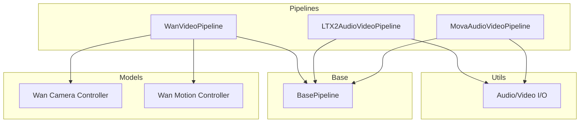
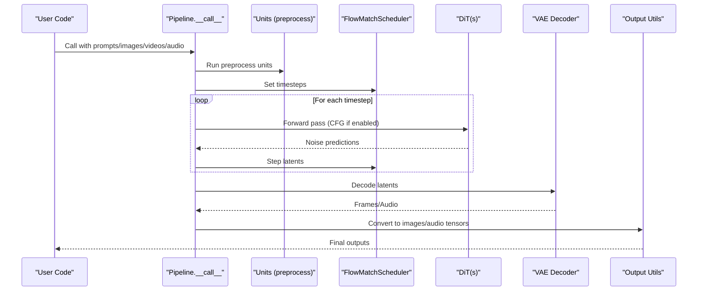
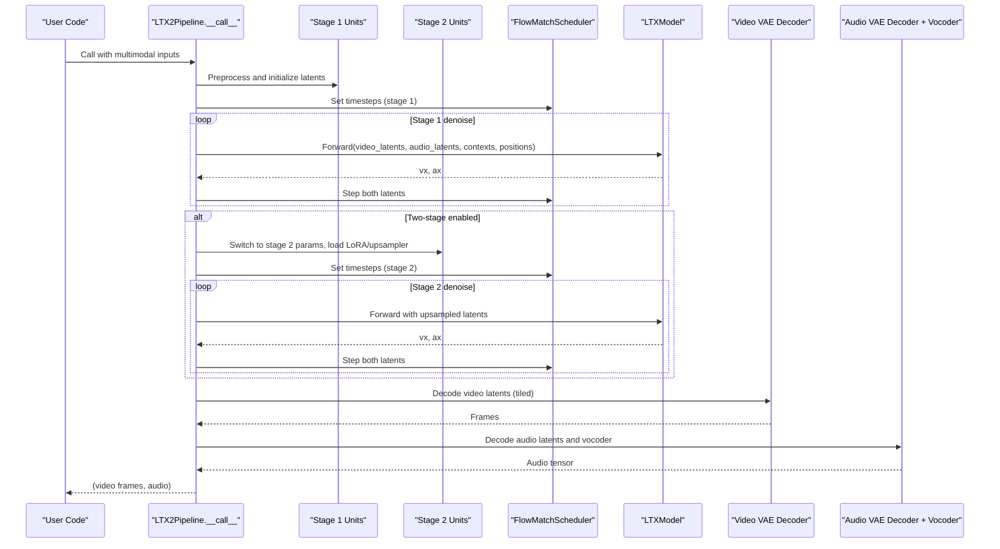
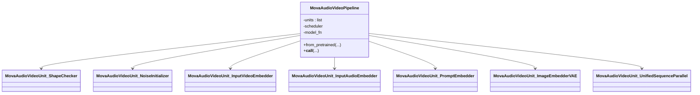
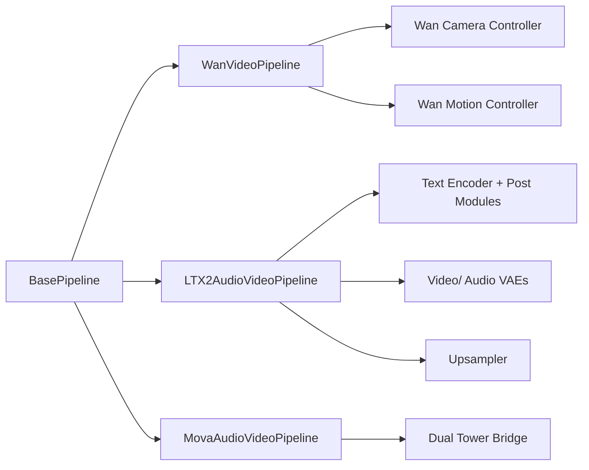

# Video Pipelines API

<cite>
**Referenced Files in This Document**
- [wan_video.py](file://diffsynth/pipelines/wan_video.py)
- [ltx2_audio_video.py](file://diffsynth/pipelines/ltx2_audio_video.py)
- [mova_audio_video.py](file://diffsynth/pipelines/mova_audio_video.py)
- [base_pipeline.py](file://diffsynth/diffusion/base_pipeline.py)
- [wan_video_camera_controller.py](file://diffsynth/models/wan_video_camera_controller.py)
- [wan_video_motion_controller.py](file://diffsynth/models/wan_video_motion_controller.py)
- [audio_video.py](file://diffsynth/utils/data/audio_video.py)
- [Wan2.1-T2V-14B.py](file://examples/wanvideo/model_inference/Wan2.1-T2V-14B.py)
- [LTX-2-T2AV-Camera-Control-Dolly-In.py](file://examples/ltx2/model_inference/LTX-2-T2AV-Camera-Control-Dolly-In.py)
- [MOVA-720p-I2AV.py](file://examples/mova/model_inference/MOVA-720p-I2AV.py)
</cite>

## Table of Contents
1. Introduction
2. Project Structure
3. Core Components
4. Architecture Overview
5. Detailed Component Analysis
6. Dependency Analysis
7. Performance Considerations
8. Troubleshooting Guide
9. Conclusion
10. Appendices

## Introduction
This document provides comprehensive API documentation for three video generation pipelines: WanVideo, LTX2 Audio-Video, and MOVA. It covers text-to-video, image-to-video, and audio-to-video capabilities; camera control parameters; motion controllers; temporal consistency settings; and video format options. It also documents key methods such as generate(), encode(), decode(), and post-processing utilities, along with frame rate handling, resolution scaling, memory management for long videos, and batch processing considerations. Practical examples are included for controlled camera movements, character animation, and multi-modal input processing.

## Project Structure
The repository organizes pipelines under diffsynth/pipelines, models under diffsynth/models, and utilities under diffsynth/utils. Each pipeline implements a BasePipeline-derived class with a unit-based execution graph, a FlowMatchScheduler, and model-specific components (text encoders, VAEs, DiTs). Examples demonstrate usage patterns for each pipeline.

**Diagram sources**
- [wan_video.py](file://diffsynth/pipelines/wan_video.py)
- [ltx2_audio_video.py](file://diffsynth/pipelines/ltx2_audio_video.py)
- [mova_audio_video.py](file://diffsynth/pipelines/mova_audio_video.py)
- [base_pipeline.py](file://diffsynth/diffusion/base_pipeline.py)
- [wan_video_camera_controller.py](file://diffsynth/models/wan_video_camera_controller.py)
- [wan_video_motion_controller.py](file://diffsynth/models/wan_video_motion_controller.py)
- [audio_video.py](file://diffsynth/utils/data/audio_video.py)

**Section sources**
- [wan_video.py](file://diffsynth/pipelines/wan_video.py)
- [ltx2_audio_video.py](file://diffsynth/pipelines/ltx2_audio_video.py)
- [mova_audio_video.py](file://diffsynth/pipelines/mova_audio_video.py)
- [base_pipeline.py](file://diffsynth/diffusion/base_pipeline.py)

## Core Components
- BasePipeline: Provides common functionality including shape checks, preprocessing, VRAM management, noise generation, and output conversion helpers.
- WanVideoPipeline: A flexible video generation pipeline supporting text/image/video conditioning, camera control, motion control, VACE, Animate adapters, and more.
- LTX2AudioVideoPipeline: A two-stage audio-video generation pipeline with prompt-driven synthesis, optional stage-2 upscaling, and unified denoising across modalities.
- MovaAudioVideoPipeline: A dual-tower audio-video diffusion pipeline that jointly generates synchronized video and audio latents.

Key responsibilities:
- Shape validation and resizing to meet division factors.
- Unit-based preprocessing and conditioning.
- Iterative denoising via FlowMatchScheduler.
- Decoding via VAEs and post-processing to final media formats.

**Section sources**
- [base_pipeline.py](file://diffsynth/diffusion/base_pipeline.py)
- [wan_video.py](file://diffsynth/pipelines/wan_video.py)
- [ltx2_audio_video.py](file://diffsynth/pipelines/ltx2_audio_video.py)
- [mova_audio_video.py](file://diffsynth/pipelines/mova_audio_video.py)

## Architecture Overview
Each pipeline follows a consistent architecture:
- Input preparation units (shape check, noise initialization, embedders).
- Denoising loop over scheduler timesteps with CFG guidance.
- Post-processing units and decoding via VAEs.
- Optional stage-2 processing (LTX2) or model switching (WanVideo).

**Diagram sources**
- [wan_video.py](file://diffsynth/pipelines/wan_video.py)
- [ltx2_audio_video.py](file://diffsynth/pipelines/ltx2_audio_video.py)
- [mova_audio_video.py](file://diffsynth/pipelines/mova_audio_video.py)
- [base_pipeline.py](file://diffsynth/diffusion/base_pipeline.py)

## Detailed Component Analysis

### WanVideo Pipeline
Capabilities:
- Text-to-video, image-to-video, first-last-frame-to-video, video-to-video.
- Speech-to-video via audio encoder integration.
- Camera control via Plucker embeddings and direction/speed/origin parameters.
- Motion control via motion bucket ID.
- VACE context for region-aware control.
- Animate adapters for pose/face/inpainting controls.
- LongCat-Video support and WanToDance integration.

Key method signatures:
- __call__(prompt, negative_prompt, input_image, end_image, input_video, denoising_strength, input_audio, audio_embeds, audio_sample_rate, s2v_pose_video, s2v_pose_latents, motion_video, control_video, reference_image, camera_control_direction, camera_control_speed, camera_control_origin, vace_video, vace_video_mask, vace_reference_image, vace_scale, animate_pose_video, animate_face_video, animate_inpaint_video, animate_mask_video, vap_video, vap_prompt, negative_vap_prompt, seed, rand_device, height, width, num_frames, cfg_scale, cfg_merge, switch_DiT_boundary, num_inference_steps, sigma_shift, motion_bucket_id, longcat_video, tiled, tile_size, tile_stride, sliding_window_size, sliding_window_stride, tea_cache_l1_thresh, tea_cache_model_id, wantodance_music_path, wantodance_reference_image, wantodance_fps, wantodance_keyframes, wantodance_keyframes_mask, framewise_decoding, progress_bar_cmd, output_type) -> list[Image.Image] | Tensor

Notable features:
- Scheduler: FlowMatchScheduler("Wan") with configurable steps and shift.
- Resolution scaling: Enforced by height_division_factor=16, width_division_factor=16, time_division_factor=4, remainder=1.
- Memory management: VRAM offload/onload per iteration; tiled encoding/decoding; optional framewise decoding.
- Model switching: Switch between dit and dit2 based on timestep boundary.
- CFG merging option to reduce compute.

Camera control:
- Direction: Left, Right, Up, Down, LeftUp, LeftDown, RightUp, RightDown.
- Speed and origin define camera trajectory; Plucker embedding generated and fused into y/control inputs.

Motion controller:
- Motion bucket ID passed through sinusoidal embedding and linear projection to modulate the DiT.

Post-processing:
- VAE decode supports tiled mode and framewise decoding for long sequences.
- Output type can be quantized frames or floatpoint tensor.

Example references:
- Text-to-video example script demonstrates basic usage and saving.

**Section sources**
- [wan_video.py](file://diffsynth/pipelines/wan_video.py)
- [wan_video_camera_controller.py](file://diffsynth/models/wan_video_camera_controller.py)
- [wan_video_motion_controller.py](file://diffsynth/models/wan_video_motion_controller.py)
- [Wan2.1-T2V-14B.py](file://examples/wanvideo/model_inference/Wan2.1-T2V-14B.py)

#### Class Diagram: WanVideo Pipeline Units

```mermaid
classDiagram
class WanVideoPipeline {
+from_pretrained(...)
+__call__(...)
-units : list
-post_units : list
-scheduler
-model_fn
}
class WanVideoUnit_ShapeChecker
class WanVideoUnit_NoiseInitializer
class WanVideoUnit_PromptEmbedder
class WanVideoUnit_InputVideoEmbedder
class WanVideoUnit_ImageEmbedderVAE
class WanVideoUnit_ImageEmbedderCLIP
class WanVideoUnit_ImageEmbedderFused
class WanVideoUnit_FunControl
class WanVideoUnit_FunReference
class WanVideoUnit_FunCameraControl
class WanVideoUnit_SpeedControl
class WanVideoUnit_VACE
class WanVideoUnit_AnimateVideoSplit
class WanVideoUnit_AnimatePoseLatents
class WanVideoUnit_AnimateFacePixelValues
class WanVideoUnit_AnimateInpaint
class WanVideoUnit_VAP
class WanVideoUnit_UnifiedSequenceParallel
class WanVideoUnit_TeaCache
class WanVideoUnit_CfgMerger
class WanVideoUnit_LongCatVideo
class WanVideoUnit_WanToDance_ProcessInputs
class WanVideoUnit_WanToDance_RefImageEmbedder
class WanVideoUnit_WanToDance_ImageKeyframesEmbedder
WanVideoPipeline --> WanVideoUnit_ShapeChecker
WanVideoPipeline --> WanVideoUnit_NoiseInitializer
WanVideoPipeline --> WanVideoUnit_PromptEmbedder
WanVideoPipeline --> WanVideoUnit_InputVideoEmbedder
WanVideoPipeline --> WanVideoUnit_ImageEmbedderVAE
WanVideoPipeline --> WanVideoUnit_ImageEmbedderCLIP
WanVideoPipeline --> WanVideoUnit_ImageEmbedderFused
WanVideoPipeline --> WanVideoUnit_FunControl
WanVideoPipeline --> WanVideoUnit_FunReference
WanVideoPipeline --> WanVideoUnit_FunCameraControl
WanVideoPipeline --> WanVideoUnit_SpeedControl
WanVideoPipeline --> WanVideoUnit_VACE
WanVideoPipeline --> WanVideoUnit_AnimateVideoSplit
WanVideoPipeline --> WanVideoUnit_AnimatePoseLatents
WanVideoPipeline --> WanVideoUnit_AnimateFacePixelValues
WanVideoPipeline --> WanVideoUnit_AnimateInpaint
WanVideoPipeline --> WanVideoUnit_VAP
WanVideoPipeline --> WanVideoUnit_UnifiedSequenceParallel
WanVideoPipeline --> WanVideoUnit_TeaCache
WanVideoPipeline --> WanVideoUnit_CfgMerger
WanVideoPipeline --> WanVideoUnit_LongCatVideo
WanVideoPipeline --> WanVideoUnit_WanToDance_ProcessInputs
WanVideoPipeline --> WanVideoUnit_WanToDance_RefImageEmbedder
WanVideoPipeline --> WanVideoUnit_WanToDance_ImageKeyframesEmbedder
```

**Diagram sources**
- [wan_video.py](file://diffsynth/pipelines/wan_video.py)

### LTX2 Audio-Video Pipeline
Capabilities:
- Text-to-audio-video generation with strong multimodal alignment.
- Image-to-video via first-frame conditioning and reference frames.
- In-context video control for style/temporal guidance.
- Two-stage pipeline with latent upsampling and LoRA fine-tuning.
- Unified denoising across video and audio modalities.

Key method signatures:
- __call__(prompt, negative_prompt, denoising_strength, input_images, input_images_indexes, input_images_strength, in_context_videos, in_context_downsample_factor, retake_video, retake_video_regions, retake_audio, audio_sample_rate, retake_audio_regions, seed, rand_device, height, width, num_frames, frame_rate, cfg_scale, num_inference_steps, tiled, tile_size_in_pixels, tile_overlap_in_pixels, tile_size_in_frames, tile_overlap_in_frames, use_two_stage_pipeline, stage2_spatial_upsample_factor, clear_lora_before_state_two, use_distilled_pipeline, progress_bar_cmd) -> (list[Image.Image], torch.Tensor)

Notable features:
- Scheduler: FlowMatchScheduler("LTX-2") with special cases for distilled/stage2.
- Resolution scaling: Divisible by 32 (one-stage) or 64 (two-stage); automatic rounding.
- Frame rate handling: Positions normalized by fps; audio positions computed from mel spectrogram patch grid.
- Memory management: Tiled encoding/decoding; optional stage-2 LoRA loading/unloading; VRAM offload/onload.
- CFG guidance: Default negative prompt tailored for audio-video artifacts.

Two-stage workflow:
- Stage 1: Generate coarse video/audio latents.
- Stage 2: Upsample video latents via dedicated upsampler; optionally apply LoRA; re-denoise with adjusted schedule.

Example references:
- Camera control example shows LoRA injection and writing video+audio.

**Section sources**
- [ltx2_audio_video.py](file://diffsynth/pipelines/ltx2_audio_video.py)
- [LTX-2-T2AV-Camera-Control-Dolly-In.py](file://examples/ltx2/model_inference/LTX-2-T2AV-Camera-Control-Dolly-In.py)

#### Sequence Diagram: LTX2 Two-Stage Generation

**Diagram sources**
- [ltx2_audio_video.py](file://diffsynth/pipelines/ltx2_audio_video.py)

### MOVA Audio-Video Pipeline
Capabilities:
- Joint video-audio diffusion using dual towers bridged by a conditional bridge.
- Text conditioning via shared text encoder.
- Image-to-video via first-last frame conditioning.
- Frame rate awareness for aligned frequency grids.

Key method signatures:
- __call__(prompt, negative_prompt, input_image, end_image, denoising_strength, seed, rand_device, height, width, num_frames, frame_rate, cfg_scale, switch_DiT_boundary, num_inference_steps, sigma_shift, tiled, tile_size, tile_stride, progress_bar_cmd) -> (list[Image.Image], torch.Tensor)

Notable features:
- Scheduler: FlowMatchScheduler("Wan").
- Resolution scaling: Divisible by 16 (height/width), time divisible by 4 with remainder 1.
- Dual tower forward: Video and audio blocks interleaved with bridge interactions at specific layers.
- Memory management: Tiled VAE decode; optional sequence parallelism; VRAM offload/onload.

Example references:
- Image-to-audio-video example demonstrates usage and saving.

**Section sources**
- [mova_audio_video.py](file://diffsynth/pipelines/mova_audio_video.py)
- [MOVA-720p-I2AV.py](file://examples/mova/model_inference/MOVA-720p-I2AV.py)

#### Class Diagram: MOVA Dual Tower

**Diagram sources**
- [mova_audio_video.py](file://diffsynth/pipelines/mova_audio_video.py)

## Dependency Analysis
- All pipelines inherit from BasePipeline, sharing core utilities for device/dtype management, shape checks, preprocessing, and VRAM control.
- WanVideo depends on camera controller and motion controller modules for specialized controls.
- LTX2 integrates text encoder post-modules, video/audio VAEs, and an upsampler for stage 2.
- MOVA uses a dual-tower bridge to synchronize video and audio diffusion paths.

**Diagram sources**
- [base_pipeline.py](file://diffsynth/diffusion/base_pipeline.py)
- [wan_video.py](file://diffsynth/pipelines/wan_video.py)
- [ltx2_audio_video.py](file://diffsynth/pipelines/ltx2_audio_video.py)
- [mova_audio_video.py](file://diffsynth/pipelines/mova_audio_video.py)
- [wan_video_camera_controller.py](file://diffsynth/models/wan_video_camera_controller.py)
- [wan_video_motion_controller.py](file://diffsynth/models/wan_video_motion_controller.py)

**Section sources**
- [base_pipeline.py](file://diffsynth/diffusion/base_pipeline.py)
- [wan_video.py](file://diffsynth/pipelines/wan_video.py)
- [ltx2_audio_video.py](file://diffsynth/pipelines/ltx2_audio_video.py)
- [mova_audio_video.py](file://diffsynth/pipelines/mova_audio_video.py)

## Performance Considerations
- Tiled encoding/decoding: Use tiled=True with appropriate tile sizes and strides to reduce memory pressure for high-resolution or long videos.
- Framewise decoding: Available in WanVideo to process frames sequentially when memory is constrained.
- VRAM offload/onload: Enabled automatically; call load_models_to_device() to manage active models during denoising and decoding.
- CFG merge: Reduces compute by avoiding separate negative pass when supported.
- Two-stage pipelines: LTX2 stage 2 upsamples latents and may require additional VRAM; ensure sufficient capacity or enable offload.
- Sequence parallelism: WanVideo and MOVA support unified sequence parallelism for large batches or resolutions.

[No sources needed since this section provides general guidance]

## Troubleshooting Guide
Common issues and resolutions:
- Shape mismatch errors: Ensure height/width are divisible by required factors (WanVideo: 16; LTX2: 32 or 64; MOVA: 16). The base pipeline rounds dimensions automatically but verify inputs.
- Time dimension constraints: num_frames must satisfy time_division_factor and remainder rules; adjust accordingly.
- VRAM exhaustion: Enable tiled decoding, reduce tile size, or use framewise decoding; leverage VRAM offload/onload.
- Audio sample rate mismatches: For LTX2 and MOVA, ensure correct audio_sample_rate; output_audio_format_check normalizes tensors.
- CFG behavior: If quality degrades, try disabling CFG (cfg_scale=1.0) or enabling cfg_merge where applicable.

**Section sources**
- [base_pipeline.py](file://diffsynth/diffusion/base_pipeline.py)
- [wan_video.py](file://diffsynth/pipelines/wan_video.py)
- [ltx2_audio_video.py](file://diffsynth/pipelines/ltx2_audio_video.py)
- [mova_audio_video.py](file://diffsynth/pipelines/mova_audio_video.py)

## Conclusion
The three pipelines provide robust, modular frameworks for generating high-quality video content with text, image, and audio conditioning. They share a common base for efficiency and flexibility while offering specialized features like camera control, motion modulation, and dual-torch synchronization. By leveraging tiled operations, VRAM management, and staged workflows, users can scale to longer and higher-resolution generations.

[No sources needed since this section summarizes without analyzing specific files]

## Appendices

### Method Signatures Summary
- WanVideoPipeline.__call__: Comprehensive parameters covering prompts, images, videos, audio, camera control, motion control, VACE, animate adapters, VAP, scheduling, tiling, and output formatting. Returns video frames or tensors.
- LTX2AudioVideoPipeline.__call__: Multimodal inputs including images, in-context videos, retake regions, audio, scheduling, tiling, and two-stage options. Returns video frames and audio tensor.
- MovaAudioVideoPipeline.__call__: Prompts, images, scheduling, tiling, and frame rate. Returns video frames and audio tensor.

### Frame Rate Handling
- LTX2: Normalizes temporal coordinates by frame_rate; audio positions derived from mel spectrogram patch grid.
- MOVA: Uses frame_rate to build aligned frequency grids for video and audio towers.
- WanVideo: Frame rate not explicitly used in __call__; output FPS is determined by downstream saving utilities.

### Video Format Options
- Output types: Quantized frames (uint8 PIL images) or floatpoint tensors.
- Saving utilities: write_video_audio writes H.264 video with AAC audio; supports stereo audio and resampling.

**Section sources**
- [wan_video.py](file://diffsynth/pipelines/wan_video.py)
- [ltx2_audio_video.py](file://diffsynth/pipelines/ltx2_audio_video.py)
- [mova_audio_video.py](file://diffsynth/pipelines/mova_audio_video.py)
- [audio_video.py](file://diffsynth/utils/data/audio_video.py)

### Example Scenarios
- Controlled camera movement (LTX2): Inject camera control LoRA and run two-stage pipeline; save with write_video_audio_ltx2.
- Character animation (WanVideo): Use animate adapters and VACE for pose/face control; enable tiled decoding for long sequences.
- Multi-modal input (MOVA): Provide image and prompt; generate synchronized audio-video; save using write_video_audio.

**Section sources**
- [LTX-2-T2AV-Camera-Control-Dolly-In.py](file://examples/ltx2/model_inference/LTX-2-T2AV-Camera-Control-Dolly-In.py)
- [Wan2.1-T2V-14B.py](file://examples/wanvideo/model_inference/Wan2.1-T2V-14B.py)
- [MOVA-720p-I2AV.py](file://examples/mova/model_inference/MOVA-720p-I2AV.py)