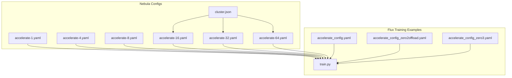
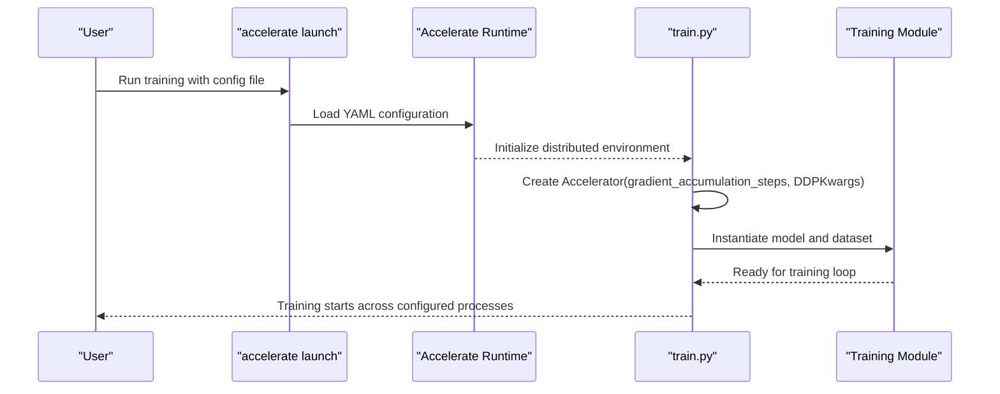
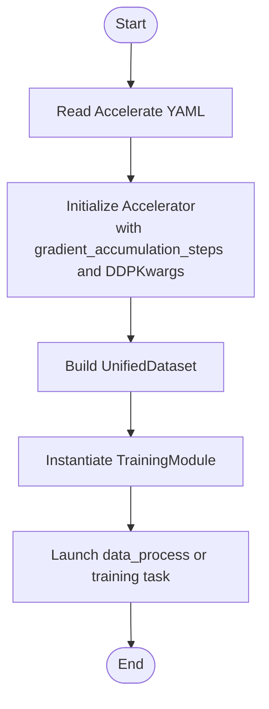
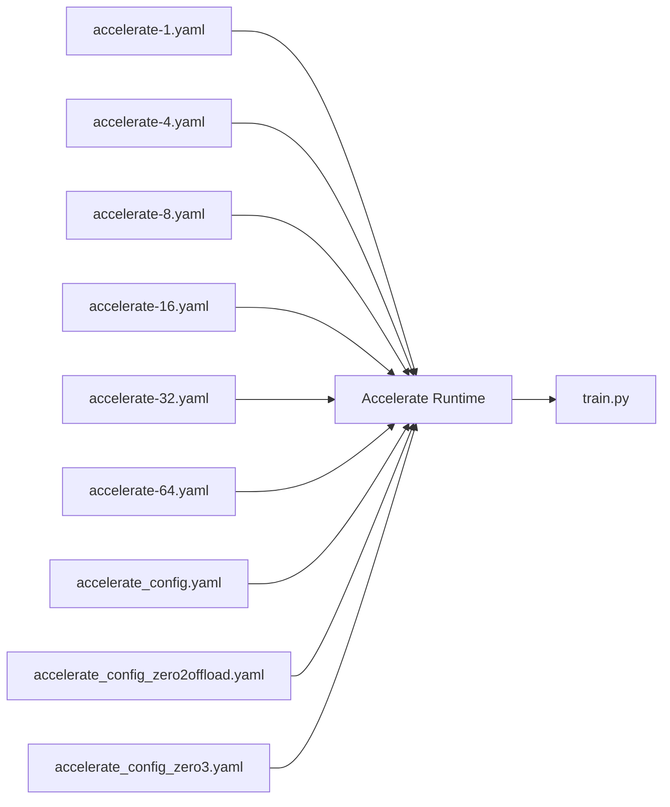

# Configuration Files

<cite>
**Referenced Files in This Document**
- [accelerate-1.yaml](file://nebula_configs/accelerate-1.yaml)
- [accelerate-4.yaml](file://nebula_configs/accelerate-4.yaml)
- [accelerate-8.yaml](file://nebula_configs/accelerate-8.yaml)
- [accelerate-16.yaml](file://nebula_configs/accelerate-16.yaml)
- [accelerate-32.yaml](file://nebula_configs/accelerate-32.yaml)
- [accelerate-64.yaml](file://nebula_configs/accelerate-64.yaml)
- [cluster.json](file://nebula_configs/cluster.json)
- [accelerate_config.yaml](file://examples/flux/model_training/full/accelerate_config.yaml)
- [accelerate_config_zero2offload.yaml](file://examples/flux/model_training/full/accelerate_config_zero2offload.yaml)
- [accelerate_config_zero3.yaml](file://examples/flux/model_training/full/accelerate_config_zero3.yaml)
- [train.py](file://examples/flux/model_training/train.py)
</cite>

## Table of Contents
1. [Introduction](#introduction)
2. [Project Structure](#project-structure)
3. [Core Components](#core-components)
4. [Architecture Overview](#architecture-overview)
5. [Detailed Component Analysis](#detailed-component-analysis)
6. [Dependency Analysis](#dependency-analysis)
7. [Performance Considerations](#performance-considerations)
8. [Troubleshooting Guide](#troubleshooting-guide)
9. [Conclusion](#conclusion)
10. [Appendices](#appendices)

## Introduction
This document explains the YAML configuration files used by Accelerate for distributed training in ODTSR-edit. It covers the Accelerate configuration schema, key parameters (compute_environment, distributed_type, num_processes, gpu_ids, mixed_precision, and others), and how to adapt them for different hardware setups ranging from single GPU to multi-node clusters. It also provides common configuration patterns, performance tuning guidance, and troubleshooting tips based on the repository’s examples.

## Project Structure
ODTSR-edit includes multiple Accelerate configuration files:
- Single-node multi-GPU configurations under nebula_configs for various process counts.
- DeepSpeed-based configurations under examples/*/model_training/full for advanced memory optimization.
- A cluster resource descriptor for Nebula orchestration.

**Diagram sources**
- [accelerate-1.yaml:1-16](file://nebula_configs/accelerate-1.yaml#L1-L16)
- [accelerate-4.yaml:1-16](file://nebula_configs/accelerate-4.yaml#L1-L16)
- [accelerate-8.yaml:1-16](file://nebula_configs/accelerate-8.yaml#L1-L16)
- [accelerate-16.yaml:1-17](file://nebula_configs/accelerate-16.yaml#L1-L17)
- [accelerate-32.yaml:1-17](file://nebula_configs/accelerate-32.yaml#L1-L17)
- [accelerate-64.yaml:1-17](file://nebula_configs/accelerate-64.yaml#L1-L17)
- [cluster.json:1-7](file://nebula_configs/cluster.json#L1-L7)
- [accelerate_config.yaml:1-23](file://examples/flux/model_training/full/accelerate_config.yaml#L1-L23)
- [accelerate_config_zero2offload.yaml:1-23](file://examples/flux/model_training/full/accelerate_config_zero2offload.yaml#L1-L23)
- [accelerate_config_zero3.yaml:1-24](file://examples/flux/model_training/full/accelerate_config_zero3.yaml#L1-L24)
- [train.py:142-145](file://examples/flux/model_training/train.py#L142-L145)

**Section sources**
- [accelerate-1.yaml:1-16](file://nebula_configs/accelerate-1.yaml#L1-L16)
- [accelerate-4.yaml:1-16](file://nebula_configs/accelerate-4.yaml#L1-L16)
- [accelerate-8.yaml:1-16](file://nebula_configs/accelerate-8.yaml#L1-L16)
- [accelerate-16.yaml:1-17](file://nebula_configs/accelerate-16.yaml#L1-L17)
- [accelerate-32.yaml:1-17](file://nebula_configs/accelerate-32.yaml#L1-L17)
- [accelerate-64.yaml:1-17](file://nebula_configs/accelerate-64.yaml#L1-L17)
- [cluster.json:1-7](file://nebula_configs/cluster.json#L1-L7)
- [accelerate_config.yaml:1-23](file://examples/flux/model_training/full/accelerate_config.yaml#L1-L23)
- [accelerate_config_zero2offload.yaml:1-23](file://examples/flux/model_training/full/accelerate_config_zero2offload.yaml#L1-L23)
- [accelerate_config_zero3.yaml:1-24](file://examples/flux/model_training/full/accelerate_config_zero3.yaml#L1-L24)
- [train.py:142-145](file://examples/flux/model_training/train.py#L142-L145)

## Core Components
The Accelerate YAML configuration defines how the training job is launched and how resources are allocated. Key fields include:
- compute_environment: Target environment (e.g., LOCAL_MACHINE).
- distributed_type: Distribution strategy (e.g., MULTI_GPU or DEEPSPEED).
- num_processes: Total number of worker processes per machine.
- num_machines: Number of machines in a multi-node setup.
- gpu_ids: Which GPUs to use (e.g., all or specific IDs).
- mixed_precision: Precision mode (e.g., bf16).
- deepspeed_config: DeepSpeed-specific settings when using DEEPSPEED.
- Other runtime flags like debug, downcast_bf16, enable_cpu_affinity, rdzv_backend, same_network, tpu_env, tpu_use_cluster, tpu_use_sudo, use_cpu.

These fields collectively control process spawning, device selection, precision, and optional offloading strategies.

**Section sources**
- [accelerate-1.yaml:1-16](file://nebula_configs/accelerate-1.yaml#L1-L16)
- [accelerate-4.yaml:1-16](file://nebula_configs/accelerate-4.yaml#L1-L16)
- [accelerate-8.yaml:1-16](file://nebula_configs/accelerate-8.yaml#L1-L16)
- [accelerate-16.yaml:1-17](file://nebula_configs/accelerate-16.yaml#L1-L17)
- [accelerate-32.yaml:1-17](file://nebula_configs/accelerate-32.yaml#L1-L17)
- [accelerate-64.yaml:1-17](file://nebula_configs/accelerate-64.yaml#L1-L17)
- [accelerate_config.yaml:1-23](file://examples/flux/model_training/full/accelerate_config.yaml#L1-L23)
- [accelerate_config_zero2offload.yaml:1-23](file://examples/flux/model_training/full/accelerate_config_zero2offload.yaml#L1-L23)
- [accelerate_config_zero3.yaml:1-24](file://examples/flux/model_training/full/accelerate_config_zero3.yaml#L1-L24)

## Architecture Overview
Accelerate reads the YAML configuration to initialize the runtime environment and spawn distributed workers. The training script constructs an Accelerator instance with gradient accumulation and DDP kwargs, then proceeds with dataset and model initialization.

**Diagram sources**
- [accelerate-1.yaml:1-16](file://nebula_configs/accelerate-1.yaml#L1-L16)
- [accelerate_config.yaml:1-23](file://examples/flux/model_training/full/accelerate_config.yaml#L1-L23)
- [train.py:142-145](file://examples/flux/model_training/train.py#L142-L145)

## Detailed Component Analysis

### Accelerate YAML Parameters
Below is a parameter-by-parameter explanation grounded in the repository’s configuration files:

- compute_environment
  - Purpose: Specifies the target environment for launching jobs.
  - Observed values: LOCAL_MACHINE.
  - Impact: Determines local vs. remote execution behavior.

- distributed_type
  - Purpose: Selects distribution backend.
  - Observed values: MULTI_GPU, DEEPSPEED.
  - Impact: Controls whether standard multi-GPU DDP or DeepSpeed is used.

- num_processes
  - Purpose: Number of processes per machine.
  - Observed values: 1, 4, 8; combined with num_machines for multi-node.
  - Impact: Scales parallelism within a node.

- num_machines
  - Purpose: Number of nodes in a multi-node cluster.
  - Observed values: 1 (single-node), 2, 4, 8 (multi-node).
  - Impact: Scales total processes across nodes.

- gpu_ids
  - Purpose: Restricts which GPUs to use.
  - Observed values: all.
  - Impact: Limits visible devices to specified set.

- mixed_precision
  - Purpose: Enables mixed-precision training.
  - Observed values: bf16.
  - Impact: Reduces memory usage and can improve throughput on supported hardware.

- deepspeed_config
  - Purpose: DeepSpeed-specific options when distributed_type is DEEPSPEED.
  - Observed keys: gradient_accumulation_steps, offload_optimizer_device, offload_param_device, zero3_init_flag, zero3_save_16bit_model, zero_stage.
  - Impact: Enables ZeRO stages and CPU offloading for large models.

- Additional runtime flags
  - debug: Enables debugging output.
  - downcast_bf16: Controls BF16 downcasting behavior.
  - enable_cpu_affinity: Binds processes to CPUs.
  - main_training_function: Entry function name.
  - rdzv_backend: Rendezvous backend (static).
  - same_network: Assumes same network topology.
  - tpu_env, tpu_use_cluster, tpu_use_sudo: TPU-related flags (unused here).
  - use_cpu: Forces CPU-only execution.

Examples of observed configurations:
- Single-node multi-GPU (MULTI_GPU): accelerate-1.yaml, accelerate-4.yaml, accelerate-8.yaml.
- Multi-node (MULTI_GPU): accelerate-16.yaml, accelerate-32.yaml, accelerate-64.yaml.
- DeepSpeed (DEEPSPEED): accelerate_config.yaml, accelerate_config_zero2offload.yaml, accelerate_config_zero3.yaml.

**Section sources**
- [accelerate-1.yaml:1-16](file://nebula_configs/accelerate-1.yaml#L1-L16)
- [accelerate-4.yaml:1-16](file://nebula_configs/accelerate-4.yaml#L1-L16)
- [accelerate-8.yaml:1-16](file://nebula_configs/accelerate-8.yaml#L1-L16)
- [accelerate-16.yaml:1-17](file://nebula_configs/accelerate-16.yaml#L1-L17)
- [accelerate-32.yaml:1-17](file://nebula_configs/accelerate-32.yaml#L1-L17)
- [accelerate-64.yaml:1-17](file://nebula_configs/accelerate-64.yaml#L1-L17)
- [accelerate_config.yaml:1-23](file://examples/flux/model_training/full/accelerate_config.yaml#L1-L23)
- [accelerate_config_zero2offload.yaml:1-23](file://examples/flux/model_training/full/accelerate_config_zero2offload.yaml#L1-L23)
- [accelerate_config_zero3.yaml:1-24](file://examples/flux/model_training/full/accelerate_config_zero3.yaml#L1-L24)

### Hardware Setup Patterns

#### Single GPU
- Use a minimal configuration with num_processes=1 and distributed_type=MULTI_GPU.
- Set mixed_precision=bf16 if supported.
- Example reference: accelerate-1.yaml.

#### Single Node Multi-GPU
- Increase num_processes to match available GPUs (e.g., 4 or 8).
- Keep distributed_type=MULTI_GPU.
- Ensure gpu_ids=all or specify desired IDs.
- Example references: accelerate-4.yaml, accelerate-8.yaml.

#### Multi-Node Cluster
- Set num_machines to the number of nodes.
- Keep num_processes per node consistent (e.g., 8).
- Use static rendezvous backend and same_network=true.
- Example references: accelerate-16.yaml, accelerate-32.yaml, accelerate-64.yaml.

#### DeepSpeed for Large Models
- Switch distributed_type=DEEPSPEED.
- Configure deepspeed_config.zero_stage (2 or 3) and offload settings.
- Enable zero3_init_flag and zero3_save_16bit_model for ZeRO-3.
- Example references: accelerate_config.yaml, accelerate_config_zero2offload.yaml, accelerate_config_zero3.yaml.

**Section sources**
- [accelerate-1.yaml:1-16](file://nebula_configs/accelerate-1.yaml#L1-L16)
- [accelerate-4.yaml:1-16](file://nebula_configs/accelerate-4.yaml#L1-L16)
- [accelerate-8.yaml:1-16](file://nebula_configs/accelerate-8.yaml#L1-L16)
- [accelerate-16.yaml:1-17](file://nebula_configs/accelerate-16.yaml#L1-L17)
- [accelerate-32.yaml:1-17](file://nebula_configs/accelerate-32.yaml#L1-L17)
- [accelerate-64.yaml:1-17](file://nebula_configs/accelerate-64.yaml#L1-L17)
- [accelerate_config.yaml:1-23](file://examples/flux/model_training/full/accelerate_config.yaml#L1-L23)
- [accelerate_config_zero2offload.yaml:1-23](file://examples/flux/model_training/full/accelerate_config_zero2offload.yaml#L1-L23)
- [accelerate_config_zero3.yaml:1-24](file://examples/flux/model_training/full/accelerate_config_zero3.yaml#L1-L24)

### Integration with Training Scripts
The training scripts instantiate Accelerator with gradient accumulation steps and DDP kwargs, then proceed to build datasets and models. The Accelerate runtime uses the YAML configuration to set up the distributed environment before the script runs.

**Diagram sources**
- [train.py:142-145](file://examples/flux/model_training/train.py#L142-L145)
- [train.py:146-179](file://examples/flux/model_training/train.py#L146-L179)
- [train.py:185-193](file://examples/flux/model_training/train.py#L185-L193)

**Section sources**
- [train.py:142-145](file://examples/flux/model_training/train.py#L142-L145)
- [train.py:146-179](file://examples/flux/model_training/train.py#L146-L179)
- [train.py:185-193](file://examples/flux/model_training/train.py#L185-L193)

## Dependency Analysis
The configuration files define dependencies between runtime settings and the training script’s expectations:
- MULTI_GPU configs depend on num_processes and gpu_ids to allocate devices.
- DEEPSPEED configs depend on deepspeed_config keys to enable ZeRO and offloading.
- Multi-node configs depend on num_machines and rendezvous settings for coordination.

**Diagram sources**
- [accelerate-1.yaml:1-16](file://nebula_configs/accelerate-1.yaml#L1-L16)
- [accelerate-4.yaml:1-16](file://nebula_configs/accelerate-4.yaml#L1-L16)
- [accelerate-8.yaml:1-16](file://nebula_configs/accelerate-8.yaml#L1-L16)
- [accelerate-16.yaml:1-17](file://nebula_configs/accelerate-16.yaml#L1-L17)
- [accelerate-32.yaml:1-17](file://nebula_configs/accelerate-32.yaml#L1-L17)
- [accelerate-64.yaml:1-17](file://nebula_configs/accelerate-64.yaml#L1-L17)
- [accelerate_config.yaml:1-23](file://examples/flux/model_training/full/accelerate_config.yaml#L1-L23)
- [accelerate_config_zero2offload.yaml:1-23](file://examples/flux/model_training/full/accelerate_config_zero2offload.yaml#L1-L23)
- [accelerate_config_zero3.yaml:1-24](file://examples/flux/model_training/full/accelerate_config_zero3.yaml#L1-L24)
- [train.py:142-145](file://examples/flux/model_training/train.py#L142-L145)

**Section sources**
- [accelerate-1.yaml:1-16](file://nebula_configs/accelerate-1.yaml#L1-L16)
- [accelerate-4.yaml:1-16](file://nebula_configs/accelerate-4.yaml#L1-L16)
- [accelerate-8.yaml:1-16](file://nebula_configs/accelerate-8.yaml#L1-L16)
- [accelerate-16.yaml:1-17](file://nebula_configs/accelerate-16.yaml#L1-L17)
- [accelerate-32.yaml:1-17](file://nebula_configs/accelerate-32.yaml#L1-L17)
- [accelerate-64.yaml:1-17](file://nebula_configs/accelerate-64.yaml#L1-L17)
- [accelerate_config.yaml:1-23](file://examples/flux/model_training/full/accelerate_config.yaml#L1-L23)
- [accelerate_config_zero2offload.yaml:1-23](file://examples/flux/model_training/full/accelerate_config_zero2offload.yaml#L1-L23)
- [accelerate_config_zero3.yaml:1-24](file://examples/flux/model_training/full/accelerate_config_zero3.yaml#L1-L24)
- [train.py:142-145](file://examples/flux/model_training/train.py#L142-L145)

## Performance Considerations
- Mixed Precision: Use bf16 where supported to reduce memory footprint and improve throughput.
- Gradient Accumulation: Adjust gradient_accumulation_steps to simulate larger batch sizes without increasing memory.
- ZeRO Optimization: For large models, prefer DEEPSPEED with zero_stage=3 and consider CPU offloading for optimizer and parameters when VRAM is limited.
- Process Scaling: Ensure num_processes matches available GPUs per node; scale num_machines for multi-node scaling.
- Device Selection: Limit gpu_ids to avoid contention and ensure deterministic device assignment.

[No sources needed since this section provides general guidance]

## Troubleshooting Guide
Common issues and resolutions:
- Out-of-memory errors:
  - Reduce batch size via gradient_accumulation_steps.
  - Enable ZeRO-3 and CPU offloading for optimizer/parameters.
  - Use bf16 mixed precision.
- Distributed startup failures:
  - Verify num_processes and num_machines align with actual hardware.
  - Ensure same_network and rdzv_backend are correctly set for multi-node.
- Incorrect device mapping:
  - Confirm gpu_ids reflects available GPUs.
  - Check that use_cpu is false unless intended.
- Debugging:
  - Enable debug flag to capture detailed logs.
  - Inspect Accelerator initialization and DDP kwargs in the training script.

**Section sources**
- [accelerate_config_zero2offload.yaml:1-23](file://examples/flux/model_training/full/accelerate_config_zero2offload.yaml#L1-L23)
- [accelerate_config_zero3.yaml:1-24](file://examples/flux/model_training/full/accelerate_config_zero3.yaml#L1-L24)
- [accelerate-16.yaml:1-17](file://nebula_configs/accelerate-16.yaml#L1-L17)
- [accelerate-32.yaml:1-17](file://nebula_configs/accelerate-32.yaml#L1-L17)
- [accelerate-64.yaml:1-17](file://nebula_configs/accelerate-64.yaml#L1-L17)
- [train.py:142-145](file://examples/flux/model_training/train.py#L142-L145)

## Conclusion
ODTSR-edit provides a comprehensive set of Accelerate YAML configurations for both single-node and multi-node distributed training. By adjusting compute_environment, distributed_type, num_processes, gpu_ids, mixed_precision, and DeepSpeed settings, users can tailor training to their hardware constraints and performance goals. The included examples demonstrate practical patterns for scaling from one GPU to large clusters while leveraging mixed precision and ZeRO optimizations.

[No sources needed since this section summarizes without analyzing specific files]

## Appendices

### Nebula Cluster Resource Descriptor
The cluster.json file defines resource quotas for workers, including GPU, CPU, and memory allocations. This is used by the Nebula orchestrator to schedule training jobs appropriately.

**Section sources**
- [cluster.json:1-7](file://nebula_configs/cluster.json#L1-L7)