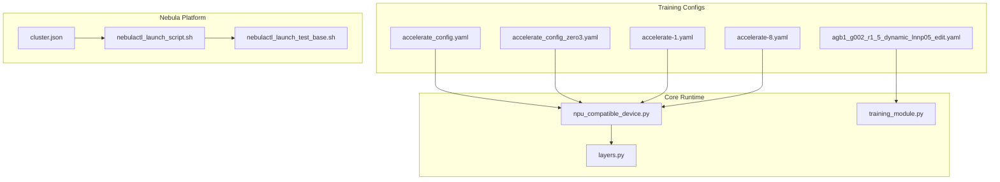
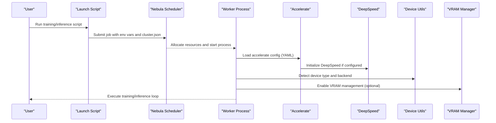
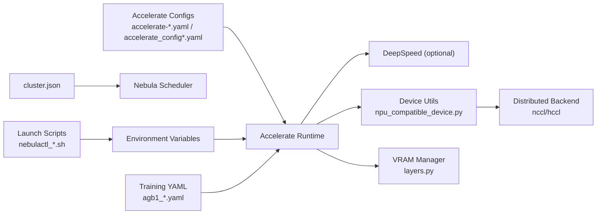

# Configuration and Deployment

<cite>
**Referenced Files in This Document**
- [accelerate_config.yaml](file://examples/flux/model_training/full/accelerate_config.yaml)
- [accelerate_config_zero3.yaml](file://examples/flux/model_training/full/accelerate_config_zero3.yaml)
- [accelerate-1.yaml](file://nebula_configs/accelerate-1.yaml)
- [accelerate-8.yaml](file://nebula_configs/accelerate-8.yaml)
- [cluster.json](file://nebula_configs/cluster.json)
- [agb1_g002_r1_5_dynamic_lnnp05_edit.yaml](file://examples/qwen_image/configs/agb1_g002_r1_5_dynamic_lnnp05_edit.yaml)
- [npu_compatible_device.py](file://diffsynth/core/device/npu_compatible_device.py)
- [layers.py](file://diffsynth/core/vram/layers.py)
- [training_module.py](file://diffsynth/diffusion/training_module.py)
- [nebulactl_launch_script.sh](file://nebulactl_launch_script.sh)
- [nebulactl_launch_test_base.sh](file://nebulactl_launch_test_base.sh)
</cite>

## Table of Contents
1. Introduction
2. Project Structure
3. Core Components
4. Architecture Overview
5. Detailed Component Analysis
6. Dependency Analysis
7. Performance Considerations
8. Troubleshooting Guide
9. Conclusion

## Introduction
This document explains configuration and deployment for ODTSR-edit with a focus on:
- YAML configuration formats for training and inference
- Environment variables that influence runtime behavior
- Distributed training setup using Accelerate (including DeepSpeed Zero2/Zero3)
- Production deployment guidelines covering containerization, scaling, monitoring, security, resource allocation, and performance tuning
- Common deployment patterns and troubleshooting strategies

The guidance is grounded in the repository’s Accelerate configs, Nebula cluster definitions, training/inference scripts, and core device/VRAM utilities.

## Project Structure
ODTSR-edit organizes configuration and deployment artifacts across several areas:
- Accelerate configurations for multi-GPU and DeepSpeed-based distributed training
- Nebula platform cluster and launch scripts for job submission and environment setup
- Model-specific YAML training configs (e.g., Qwen Image editing)
- Core device abstraction and VRAM management utilities

**Diagram sources**
- [accelerate_config.yaml:1-23](file://examples/flux/model_training/full/accelerate_config.yaml#L1-L23)
- [accelerate_config_zero3.yaml:1-24](file://examples/flux/model_training/full/accelerate_config_zero3.yaml#L1-L24)
- [accelerate-1.yaml:1-16](file://nebula_configs/accelerate-1.yaml#L1-L16)
- [accelerate-8.yaml:1-16](file://nebula_configs/accelerate-8.yaml#L1-L16)
- [agb1_g002_r1_5_dynamic_lnnp05_edit.yaml:1-46](file://examples/qwen_image/configs/agb1_g002_r1_5_dynamic_lnnp05_edit.yaml#L1-L46)
- [cluster.json:1-7](file://nebula_configs/cluster.json#L1-L7)
- [nebulactl_launch_script.sh:1-40](file://nebulactl_launch_script.sh#L1-L40)
- [nebulactl_launch_test_base.sh:38-58](file://nebulactl_launch_test_base.sh#L38-L58)
- [npu_compatible_device.py:1-107](file://diffsynth/core/device/npu_compatible_device.py#L1-L107)
- [layers.py:38-479](file://diffsynth/core/vram/layers.py#L38-L479)
- [training_module.py:163-174](file://diffsynth/diffusion/training_module.py#L163-L174)

**Section sources**
- [accelerate_config.yaml:1-23](file://examples/flux/model_training/full/accelerate_config.yaml#L1-L23)
- [accelerate_config_zero3.yaml:1-24](file://examples/flux/model_training/full/accelerate_config_zero3.yaml#L1-L24)
- [accelerate-1.yaml:1-16](file://nebula_configs/accelerate-1.yaml#L1-L16)
- [accelerate-8.yaml:1-16](file://nebula_configs/accelerate-8.yaml#L1-L16)
- [agb1_g002_r1_5_dynamic_lnnp05_edit.yaml:1-46](file://examples/qwen_image/configs/agb1_g002_r1_5_dynamic_lnnp05_edit.yaml#L1-L46)
- [cluster.json:1-7](file://nebula_configs/cluster.json#L1-L7)
- [nebulactl_launch_script.sh:1-40](file://nebulactl_launch_script.sh#L1-L40)
- [nebulactl_launch_test_base.sh:38-58](file://nebulactl_launch_test_base.sh#L38-L58)
- [npu_compatible_device.py:1-107](file://diffsynth/core/device/npu_compatible_device.py#L1-L107)
- [layers.py:38-479](file://diffsynth/core/vram/layers.py#L38-L479)
- [training_module.py:163-174](file://diffsynth/diffusion/training_module.py#L163-L174)

## Core Components
- Accelerate configurations define distributed training parameters such as compute environment, precision, number of processes, and DeepSpeed settings.
- Nebula cluster JSON specifies per-worker resource quotas for GPU/CPU/memory used by the job scheduler.
- Training YAML files specify model hyperparameters, loss weights, optimizer schedules, and feature flags for specific models (e.g., LoRA targets).
- Device abstraction supports CUDA/NPU detection and backend selection for distributed communication.
- VRAM management wraps model layers to control dtype/device placement and memory limits.

Key responsibilities:
- Accelerate configs orchestrate multi-GPU and DeepSpeed execution.
- Nebula scripts configure environment variables and submit jobs to queues.
- Device utilities ensure correct backend selection and high-precision settings.
- VRAM utilities enable dynamic offloading and memory constraints.

**Section sources**
- [accelerate_config.yaml:1-23](file://examples/flux/model_training/full/accelerate_config.yaml#L1-L23)
- [accelerate_config_zero3.yaml:1-24](file://examples/flux/model_training/full/accelerate_config_zero3.yaml#L1-L24)
- [accelerate-1.yaml:1-16](file://nebula_configs/accelerate-1.yaml#L1-L16)
- [accelerate-8.yaml:1-16](file://nebula_configs/accelerate-8.yaml#L1-L16)
- [cluster.json:1-7](file://nebula_configs/cluster.json#L1-L7)
- [agb1_g002_r1_5_dynamic_lnnp05_edit.yaml:1-46](file://examples/qwen_image/configs/agb1_g002_r1_5_dynamic_lnnp05_edit.yaml#L1-L46)
- [npu_compatible_device.py:1-107](file://diffsynth/core/device/npu_compatible_device.py#L1-L107)
- [layers.py:38-479](file://diffsynth/core/vram/layers.py#L38-L479)

## Architecture Overview
The system composes configuration-driven training and deployment:
- Accelerate reads YAML to initialize distributed processes and optionally DeepSpeed.
- Nebula launch scripts set environment variables and submit jobs with resource constraints defined in cluster.json.
- At runtime, device utilities select the appropriate backend (CUDA/NPU) and configure NCCL/HCCl.
- VRAM management can be enabled to wrap model modules for memory optimization.

**Diagram sources**
- [nebulactl_launch_script.sh:1-40](file://nebulactl_launch_script.sh#L1-L40)
- [nebulactl_launch_test_base.sh:38-58](file://nebulactl_launch_test_base.sh#L38-L58)
- [accelerate_config.yaml:1-23](file://examples/flux/model_training/full/accelerate_config.yaml#L1-L23)
- [accelerate_config_zero3.yaml:1-24](file://examples/flux/model_training/full/accelerate_config_zero3.yaml#L1-L24)
- [npu_compatible_device.py:1-107](file://diffsynth/core/device/npu_compatible_device.py#L1-L107)
- [layers.py:38-479](file://diffsynth/core/vram/layers.py#L38-L479)

## Detailed Component Analysis

### Accelerate Configuration Formats
- LOCAL_MACHINE compute environment with MULTI_GPU or DEEPSPEED distributed types.
- Mixed precision typically set to bf16 for efficiency.
- num_processes controls parallelism; align with available GPUs.
- DeepSpeed zero_stage 2 or 3 enables parameter sharding and optimizer state partitioning.
- rdzv_backend static and same_network true are common for single-machine setups.

Examples:
- Multi-GPU without DeepSpeed: see accelerate-1.yaml and accelerate-8.yaml.
- DeepSpeed Zero2: see accelerate_config.yaml.
- DeepSpeed Zero3: see accelerate_config_zero3.yaml.

Operational notes:
- Ensure num_processes matches GPU count.
- For large models, prefer Zero3 with appropriate initialization flags.
- Keep debug false in production to reduce overhead.

**Section sources**
- [accelerate-1.yaml:1-16](file://nebula_configs/accelerate-1.yaml#L1-L16)
- [accelerate-8.yaml:1-16](file://nebula_configs/accelerate-8.yaml#L1-L16)
- [accelerate_config.yaml:1-23](file://examples/flux/model_training/full/accelerate_config.yaml#L1-L23)
- [accelerate_config_zero3.yaml:1-24](file://examples/flux/model_training/full/accelerate_config_zero3.yaml#L1-L24)

### Nebula Cluster and Job Submission
- cluster.json defines worker resource quotas (GPU/CPU/memory).
- Launch scripts set environment variables (e.g., PyTorch allocator, XFormers, NCCL options), OSS endpoints, and queue selection.
- Scripts choose algorithm image tags based on queue and set custom environment strings.

Deployment implications:
- Adjust worker resource fields to match hardware and workload.
- Configure NCCL environment variables for optimal interconnect performance.
- Use separate queues for different hardware profiles (e.g., H20 vs 810E).

**Section sources**
- [cluster.json:1-7](file://nebula_configs/cluster.json#L1-L7)
- [nebulactl_launch_script.sh:1-40](file://nebulactl_launch_script.sh#L1-L40)
- [nebulactl_launch_test_base.sh:38-58](file://nebulactl_launch_test_base.sh#L38-L58)

### Training YAML Configuration (Qwen Image Editing Example)
- exp_tag identifies experiments.
- learning_rate and learning_rate_dis configure generator and discriminator optimizers.
- lr_scheduler_type and eta_min values control scheduling.
- accumulate_grad_batches sets gradient accumulation steps.
- use_gradient_checkpointing reduces memory usage during training.
- Loss weights (rgb_w, lpips_w, gan_loss_weight) balance objectives.
- Generator-specific flags include lora_rank, lora_target_modules, and zero_cond_t.

Usage:
- Modify hyperparameters for dataset size and hardware capacity.
- Enable gradient checkpointing for large models.
- Tune regularization and loss weights to stabilize training.

**Section sources**
- [agb1_g002_r1_5_dynamic_lnnp05_edit.yaml:1-46](file://examples/qwen_image/configs/agb1_g002_r1_5_dynamic_lnnp05_edit.yaml#L1-L46)

### Device Abstraction and Backend Selection
- Detects CUDA vs NPU availability and returns appropriate device type.
- Provides functions to get device ID/name, synchronize, and empty cache.
- Chooses distributed backend: nccl for CUDA, hccl for NPU.
- Enables high-precision matmul/reduction settings for bf16 stability.

Impact:
- Ensures consistent device handling across environments.
- Selects correct communication backend for distributed training.
- Improves numerical stability on supported devices.

**Section sources**
- [npu_compatible_device.py:1-107](file://diffsynth/core/device/npu_compatible_device.py#L1-L107)

### VRAM Management and Memory Optimization
- Wraps model modules to control dtype/device placement for offload/onload/preparing/computation phases.
- Supports recursive wrapping and module mapping to target specific layers.
- Allows setting vram_limit and disk_map for offloading to storage.
- Exposes a flag to indicate whether VRAM management is enabled.

Guidance:
- Use VRAM management for large models or constrained environments.
- Map critical layers to computation device and offload others.
- Combine with gradient checkpointing for further memory savings.

**Section sources**
- [layers.py:38-479](file://diffsynth/core/vram/layers.py#L38-L479)

### Model Path Parsing and Loading
- Parses either local paths or model IDs with origin file patterns.
- Validates format and raises errors for invalid inputs.

Best practices:
- Use explicit paths for reproducibility.
- Follow model_id:origin_file_pattern when loading from registries.

**Section sources**
- [training_module.py:163-174](file://diffsynth/diffusion/training_module.py#L163-L174)

## Dependency Analysis
The following diagram shows how configuration and runtime components interact:

**Diagram sources**
- [accelerate-1.yaml:1-16](file://nebula_configs/accelerate-1.yaml#L1-L16)
- [accelerate-8.yaml:1-16](file://nebula_configs/accelerate-8.yaml#L1-L16)
- [accelerate_config.yaml:1-23](file://examples/flux/model_training/full/accelerate_config.yaml#L1-L23)
- [accelerate_config_zero3.yaml:1-24](file://examples/flux/model_training/full/accelerate_config_zero3.yaml#L1-L24)
- [cluster.json:1-7](file://nebula_configs/cluster.json#L1-L7)
- [nebulactl_launch_script.sh:1-40](file://nebulactl_launch_script.sh#L1-L40)
- [nebulactl_launch_test_base.sh:38-58](file://nebulactl_launch_test_base.sh#L38-L58)
- [npu_compatible_device.py:1-107](file://diffsynth/core/device/npu_compatible_device.py#L1-L107)
- [layers.py:38-479](file://diffsynth/core/vram/layers.py#L38-L479)
- [agb1_g002_r1_5_dynamic_lnnp05_edit.yaml:1-46](file://examples/qwen_image/configs/agb1_g002_r1_5_dynamic_lnnp05_edit.yaml#L1-L46)

**Section sources**
- [accelerate-1.yaml:1-16](file://nebula_configs/accelerate-1.yaml#L1-L16)
- [accelerate-8.yaml:1-16](file://nebula_configs/accelerate-8.yaml#L1-L16)
- [accelerate_config.yaml:1-23](file://examples/flux/model_training/full/accelerate_config.yaml#L1-L23)
- [accelerate_config_zero3.yaml:1-24](file://examples/flux/model_training/full/accelerate_config_zero3.yaml#L1-L24)
- [cluster.json:1-7](file://nebula_configs/cluster.json#L1-L7)
- [nebulactl_launch_script.sh:1-40](file://nebulactl_launch_script.sh#L1-L40)
- [nebulactl_launch_test_base.sh:38-58](file://nebulactl_launch_test_test_base.sh#L38-L58)
- [npu_compatible_device.py:1-107](file://diffsynth/core/device/npu_compatible_device.py#L1-L107)
- [layers.py:38-479](file://diffsynth/core/vram/layers.py#L38-L479)
- [agb1_g002_r1_5_dynamic_lnnp05_edit.yaml:1-46](file://examples/qwen_image/configs/agb1_g002_r1_5_dynamic_lnnp05_edit.yaml#L1-L46)

## Performance Considerations
- Precision: Use bf16 mixed precision for speed and memory efficiency where supported.
- Parallelism: Align num_processes with GPU count; avoid oversubscription.
- DeepSpeed: Prefer Zero3 for very large models; tune gradient_accumulation_steps and offload settings.
- Communication: Optimize NCCL/HCCl environment variables for your network fabric.
- Memory: Enable VRAM management and gradient checkpointing; adjust vram_limit and layer mappings.
- Data pipeline: Ensure efficient data loading and caching to prevent GPU starvation.

[No sources needed since this section provides general guidance]

## Troubleshooting Guide
Common issues and resolutions:
- Out-of-memory errors:
  - Reduce batch size or enable gradient checkpointing.
  - Enable VRAM management and map layers appropriately.
  - Increase vram_limit or offload to disk via disk_map.
- Distributed communication failures:
  - Verify NCCL/HCCl environment variables and network interfaces.
  - Ensure same_network and rdzv_backend settings match the environment.
- Device detection problems:
  - Confirm CUDA/NPU availability and driver versions.
  - Check backend selection logic and ensure correct device namespace.
- Model loading errors:
  - Validate model path or model_id:origin_file_pattern format.
  - Ensure required files exist at specified locations.

**Section sources**
- [layers.py:38-479](file://diffsynth/core/vram/layers.py#L38-L479)
- [npu_compatible_device.py:1-107](file://diffsynth/core/device/npu_compatible_device.py#L1-L107)
- [training_module.py:163-174](file://diffsynth/diffusion/training_module.py#L163-L174)
- [nebulactl_launch_script.sh:1-40](file://nebulactl_launch_script.sh#L1-L40)
- [nebulactl_launch_test_base.sh:38-58](file://nebulactl_launch_test_base.sh#L38-L58)

## Conclusion
ODTSR-edit’s configuration and deployment stack combines Accelerate YAML configs, Nebula cluster definitions, and robust device/VRAM utilities to support scalable training and inference. By carefully tuning Accelerate settings, environment variables, and memory management, you can deploy efficiently across diverse hardware and production scenarios. The provided examples and core components offer a solid foundation for both research and production workflows.

[No sources needed since this section summarizes without analyzing specific files]