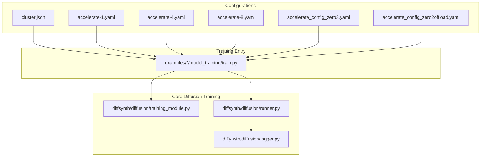
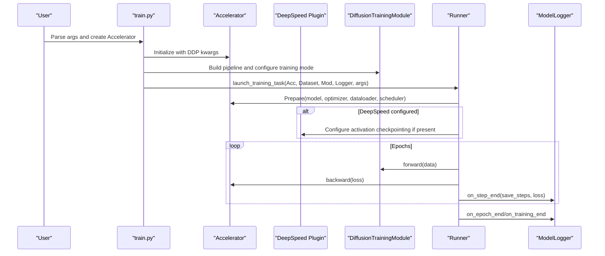
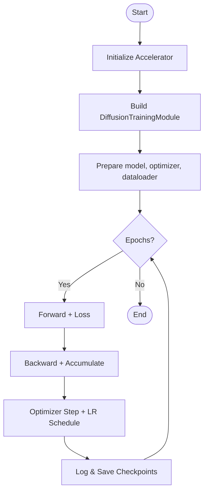
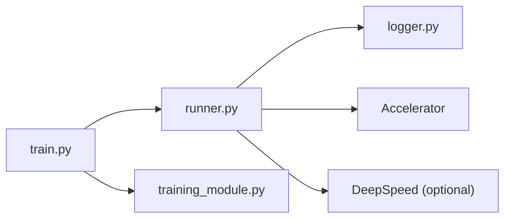

# Distributed Training

<cite>
**Referenced Files in This Document**
- [cluster.json](file://nebula_configs/cluster.json)
- [accelerate-1.yaml](file://nebula_configs/accelerate-1.yaml)
- [accelerate-4.yaml](file://nebula_configs/accelerate-4.yaml)
- [accelerate-8.yaml](file://nebula_configs/accelerate-8.yaml)
- [train.py](file://examples/flux/model_training/train.py)
- [training_module.py](file://diffsynth/diffusion/training_module.py)
- [runner.py](file://diffsynth/diffusion/runner.py)
- [logger.py](file://diffsynth/diffusion/logger.py)
- [accelerate_config_zero3.yaml](file://examples/flux/model_training/full/accelerate_config_zero3.yaml)
- [accelerate_config_zero2offload.yaml](file://examples/flux/model_training/full/accelerate_config_zero2offload.yaml)
</cite>

## Table of Contents
1. [Introduction](#introduction)
2. [Project Structure](#project-structure)
3. [Core Components](#core-components)
4. [Architecture Overview](#architecture-overview)
5. [Detailed Component Analysis](#detailed-component-analysis)
6. [Dependency Analysis](#dependency-analysis)
7. [Performance Considerations](#performance-considerations)
8. [Troubleshooting Guide](#troubleshooting-guide)
9. [Conclusion](#conclusion)
10. [Appendices](#appendices)

## Introduction
This document explains how to set up and run distributed training in ODTSR-edit using Accelerate and DeepSpeed. It covers cluster configuration for multi-node environments, Accelerate configuration for data parallelism and model parallelism (ZeRO), scaling considerations for large models and datasets, network and communication backends, fault tolerance settings, common distributed training patterns, performance optimization techniques, debugging strategies, and monitoring across multiple nodes.

## Project Structure
ODTSR-edit provides:
- Cluster resource definitions for Nebula-style orchestration
- Multiple Accelerate configuration files for different process counts and DeepSpeed strategies
- A unified training entry point per example that constructs an Accelerator, dataset, and training module
- Core diffusion training utilities for pipeline splitting, LoRA injection, VRAM management, and logging

**Diagram sources**
- [cluster.json:1-7](file://nebula_configs/cluster.json#L1-L7)
- [accelerate-1.yaml:1-16](file://nebula_configs/accelerate-1.yaml#L1-L16)
- [accelerate-4.yaml:1-16](file://nebula_configs/accelerate-4.yaml#L1-L16)
- [accelerate-8.yaml:1-16](file://nebula_configs/accelerate-8.yaml#L1-L16)
- [accelerate_config_zero3.yaml:1-20](file://examples/flux/model_training/full/accelerate_config_zero3.yaml#L1-L20)
- [accelerate_config_zero2offload.yaml:1-20](file://examples/flux/model_training/full/accelerate_config_zero2offload.yaml#L1-L20)
- [train.py:1-194](file://examples/flux/model_training/train.py#L1-L194)
- [training_module.py:1-303](file://diffsynth/diffusion/training_module.py#L1-L303)
- [runner.py:1-89](file://diffsynth/diffusion/runner.py#L1-L89)
- [logger.py:1-44](file://diffsynth/diffusion/logger.py#L1-L44)

**Section sources**
- [cluster.json:1-7](file://nebula_configs/cluster.json#L1-L7)
- [accelerate-1.yaml:1-16](file://nebula_configs/accelerate-1.yaml#L1-L16)
- [accelerate-4.yaml:1-16](file://nebula_configs/accelerate-4.yaml#L1-L16)
- [accelerate-8.yaml:1-16](file://nebula_configs/accelerate-8.yaml#L1-L16)
- [train.py:1-194](file://examples/flux/model_training/train.py#L1-L194)
- [training_module.py:1-303](file://diffsynth/diffusion/training_module.py#L1-L303)
- [runner.py:1-89](file://diffsynth/diffusion/runner.py#L1-L89)
- [logger.py:1-44](file://diffsynth/diffusion/logger.py#L1-L44)

## Core Components
- Accelerator initialization and task launching
  - The training script constructs an Accelerator with gradient accumulation and DDP kwargs, then selects a launcher based on the task type.
- DiffusionTrainingModule
  - Provides VRAM configuration parsing (FP8/offload), LoRA injection, parameter freezing/unfreezing, and pipeline unit splitting for training vs data processing.
- Runner
  - Orchestrates optimizer, scheduler, dataloader preparation via accelerator.prepare, backward pass with accumulate, and periodic logging/saving.
- ModelLogger
  - Handles checkpointing at step/epoch boundaries, unwrapping model state, and saving only from the main process.

Key responsibilities:
- Data parallelism is handled by Accelerator (DDP).
- Model parallelism and ZeRO sharding are enabled through DeepSpeed configurations referenced by Accelerate config files.
- VRAM optimizations include FP8 offloading and disk offloading paths.

**Section sources**
- [train.py:139-194](file://examples/flux/model_training/train.py#L139-L194)
- [training_module.py:30-110](file://diffsynth/diffusion/training_module.py#L30-L110)
- [runner.py:8-48](file://diffsynth/diffusion/runner.py#L8-L48)
- [logger.py:5-44](file://diffsynth/diffusion/logger.py#L5-L44)

## Architecture Overview
The distributed training flow uses Accelerate to bootstrap processes, load the dataset, prepare the model and optimizer, and execute training steps with optional DeepSpeed integration for ZeRO sharding.

**Diagram sources**
- [train.py:139-194](file://examples/flux/model_training/train.py#L139-L194)
- [runner.py:8-48](file://diffsynth/diffusion/runner.py#L8-L48)
- [logger.py:5-44](file://diffsynth/diffusion/logger.py#L5-L44)

## Detailed Component Analysis

### Cluster Configuration (multi-node)
- cluster.json defines per-worker resources such as GPU/CPU/memory quotas used by the orchestrator.
- For multi-node runs, ensure each node has consistent environment variables and network reachability; Accelerate’s rendezvous backend must be configured accordingly.

Practical guidance:
- Use the same Accelerate config across nodes or use a shared file path accessible from all nodes.
- Ensure firewall rules allow rendezvous ports and that hostname resolution works across nodes.

**Section sources**
- [cluster.json:1-7](file://nebula_configs/cluster.json#L1-L7)

### Accelerate Configuration for Distributed Strategies
- Data Parallelism (DDP):
  - Set distributed_type to MULTI_GPU, num_processes equal to total GPUs per node, and rdzv_backend to static or another supported backend.
  - mixed_precision can be bf16 for efficiency on modern hardware.
- Model Parallelism (ZeRO via DeepSpeed):
  - Reference deepspeed_config in Accelerate YAML to enable ZeRO stages.
  - Zero2-offload and Zero3 configs are provided as examples.

Common fields:
- compute_environment: LOCAL_MACHINE or cloud-specific
- distributed_type: MULTI_GPU
- num_processes: number of processes (GPUs)
- mixed_precision: bf16/fp16
- rdzv_backend: static or other backends depending on your setup
- deepspeed_config: points to DeepSpeed JSON/YAML enabling ZeRO stages and options

**Section sources**
- [accelerate-1.yaml:1-16](file://nebula_configs/accelerate-1.yaml#L1-L16)
- [accelerate-4.yaml:1-16](file://nebula_configs/accelerate-4.yaml#L1-L16)
- [accelerate-8.yaml:1-16](file://nebula_configs/accelerate-8.yaml#L1-L16)
- [accelerate_config_zero3.yaml:1-20](file://examples/flux/model_training/full/accelerate_config_zero3.yaml#L1-L20)
- [accelerate_config_zero2offload.yaml:1-20](file://examples/flux/model_training/full/accelerate_config_zero2offload.yaml#L1-L20)

### Network Configuration and Communication Backends
- Rendezvous backend:
  - static requires fixed ranks and addresses; suitable when you control process placement.
  - Other backends (e.g., c10d) may require additional environment variables like MASTER_ADDR and MASTER_PORT.
- Same network:
  - same_network should match your deployment topology; misconfiguration can cause handshake failures.
- Environment variables:
  - Ensure TOKENIZERS_PARALLELISM is disabled to avoid deadlocks during data loading.

Best practices:
- Pin GPU IDs explicitly if needed.
- Use high-performance interconnects (InfiniBand/RDMA) where available.

**Section sources**
- [accelerate-1.yaml:1-16](file://nebula_configs/accelerate-1.yaml#L1-L16)
- [accelerate-4.yaml:1-16](file://nebula_configs/accelerate-4.yaml#L1-L16)
- [accelerate-8.yaml:1-16](file://nebula_configs/accelerate-8.yaml#L1-L16)
- [train.py:1-10](file://examples/flux/model_training/train.py#L1-L10)

### Fault Tolerance Settings
- Activation checkpointing:
  - When DeepSpeed plugin is detected, runner initializes DeepSpeed activation checkpointing according to the config.
- Gradient accumulation:
  - Use gradient_accumulation_steps to reduce memory pressure and stabilize training.
- Checkpointing:
  - ModelLogger saves checkpoints only from the main process after synchronization.

Recommendations:
- Enable activation checkpointing for large models.
- Periodically save checkpoints to recover from transient failures.

**Section sources**
- [runner.py:75-89](file://diffsynth/diffusion/runner.py#L75-L89)
- [logger.py:13-44](file://diffsynth/diffusion/logger.py#L13-L44)

### Scaling Considerations for Large Models and Datasets
- VRAM management:
  - FP8 offloading and disk offloading paths are available via parse_vram_config.
  - Offload heavy components to CPU/disk when necessary.
- Data pipeline:
  - Increase dataset_num_workers to improve I/O throughput.
  - Cache preprocessed data for faster iteration during training.
- Batch sizing:
  - Adjust global batch size via num_processes * per_device_batch_size * gradient_accumulation_steps.

**Section sources**
- [training_module.py:110-136](file://diffsynth/diffusion/training_module.py#L110-L136)
- [runner.py:20-31](file://diffsynth/diffusion/runner.py#L20-L31)

### Common Distributed Training Patterns
- Data Parallel SFT:
  - Construct Accelerator, prepare model/optimizer/dataloader, iterate over dataset, backward with accumulate, log/save periodically.
- Data Processing Task:
  - Separate preprocessing into a dedicated task that writes per-process outputs to numbered folders.
- LoRA Fine-tuning:
  - Inject LoRA adapters into target modules; optionally load preset LoRA checkpoints.

**Diagram sources**
- [runner.py:8-48](file://diffsynth/diffusion/runner.py#L8-L48)
- [train.py:139-194](file://examples/flux/model_training/train.py#L139-L194)

**Section sources**
- [runner.py:8-48](file://diffsynth/diffusion/runner.py#L8-L48)
- [train.py:139-194](file://examples/flux/model_training/train.py#L139-L194)

### Performance Optimization Techniques
- Mixed precision:
  - Use bf16 for stable and efficient training on compatible hardware.
- Gradient checkpointing:
  - Reduce activation memory usage; integrate with DeepSpeed activation checkpointing when available.
- Efficient data loading:
  - Tune num_workers and collate functions; cache intermediate results.
- ZeRO sharding:
  - Use ZeRO Stage 2/3 to partition parameters, gradients, and optimizer states across devices.
- LoRA:
  - Train only a subset of parameters to reduce memory and speed up iterations.

**Section sources**
- [accelerate-1.yaml:1-16](file://nebula_configs/accelerate-1.yaml#L1-L16)
- [accelerate_config_zero3.yaml:1-20](file://examples/flux/model_training/full/accelerate_config_zero3.yaml#L1-L20)
- [accelerate_config_zero2offload.yaml:1-20](file://examples/flux/model_training/full/accelerate_config_zero2offload.yaml#L1-L20)
- [training_module.py:52-64](file://diffsynth/diffusion/training_module.py#L52-L64)
- [runner.py:75-89](file://diffsynth/diffusion/runner.py#L75-L89)

## Dependency Analysis
The training workflow depends on Accelerate for process coordination and optional DeepSpeed for ZeRO. The core training module encapsulates VRAM strategies and LoRA handling, while the runner manages the training loop and logging.

**Diagram sources**
- [train.py:139-194](file://examples/flux/model_training/train.py#L139-L194)
- [runner.py:8-48](file://diffsynth/diffusion/runner.py#L8-L48)
- [training_module.py:30-110](file://diffsynth/diffusion/training_module.py#L30-L110)
- [logger.py:5-44](file://diffsynth/diffusion/logger.py#L5-L44)

**Section sources**
- [train.py:139-194](file://examples/flux/model_training/train.py#L139-L194)
- [runner.py:8-48](file://diffsynth/diffusion/runner.py#L8-L48)
- [training_module.py:30-110](file://diffsynth/diffusion/training_module.py#L30-L110)
- [logger.py:5-44](file://diffsynth/diffusion/logger.py#L5-L44)

## Performance Considerations
- Choose appropriate mixed precision (bf16 recommended).
- Scale num_processes to match available GPUs; adjust gradient_accumulation_steps to maintain effective batch size.
- Enable ZeRO for large models; prefer Stage 3 for maximum memory savings.
- Use activation checkpointing to reduce peak memory.
- Optimize data loading with sufficient workers and caching.
- Monitor GPU utilization and memory to identify bottlenecks.

[No sources needed since this section provides general guidance]

## Troubleshooting Guide
Common issues and resolutions:
- Rendezvous failures:
  - Verify MASTER_ADDR/MASTER_PORT and rdzv_backend consistency across nodes.
  - Ensure same_network matches your deployment.
- Deadlocks during tokenization:
  - Disable tokenizer parallelism via environment variable.
- Out-of-memory errors:
  - Enable ZeRO, activation checkpointing, and consider FP8/disk offloading.
  - Reduce per-device batch size or increase gradient accumulation steps.
- Slow data loading:
  - Increase dataset_num_workers; precompute and cache features.
- Checkpoint not saved:
  - Ensure accelerator.is_main_process logic is respected; verify output_path permissions.

Useful checks:
- Inspect Accelerate logs for process rank and device mapping.
- Validate DeepSpeed config presence and correctness when using ZeRO.

**Section sources**
- [accelerate-1.yaml:1-16](file://nebula_configs/accelerate-1.yaml#L1-L16)
- [train.py:1-10](file://examples/flux/model_training/train.py#L1-L10)
- [runner.py:75-89](file://diffsynth/diffusion/runner.py#L75-L89)
- [logger.py:13-44](file://diffsynth/diffusion/logger.py#L13-L44)

## Conclusion
ODTSR-edit’s distributed training stack leverages Accelerate for robust multi-GPU/multi-node orchestration and integrates seamlessly with DeepSpeed for ZeRO-based model parallelism. By combining VRAM management (FP8/disk offloading), activation checkpointing, and efficient data pipelines, it supports scalable training of large diffusion models. Proper cluster and network configuration, along with careful tuning of batch sizes and parallelism strategies, ensures stable and performant distributed training.

[No sources needed since this section summarizes without analyzing specific files]

## Appendices

### Example Commands and Patterns
- Single-node multi-GPU:
  - Use accelerate-*.yaml with num_processes matching GPU count.
- Multi-node:
  - Deploy identical Accelerate configs on all nodes; ensure network connectivity and consistent environment variables.
- Data processing:
  - Use the data_process launcher to precompute and cache dataset artifacts per process.

[No sources needed since this section provides general guidance]