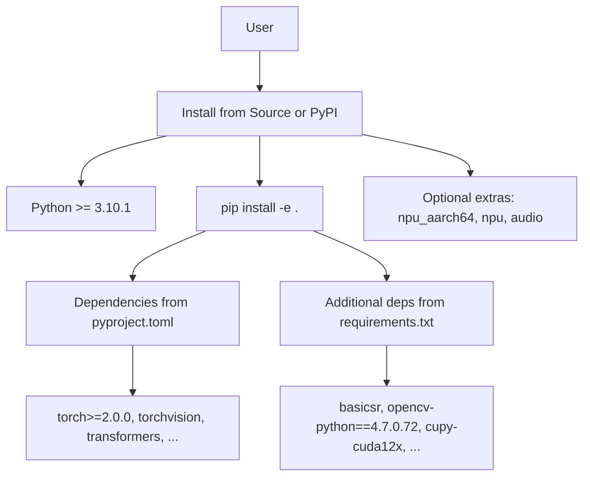
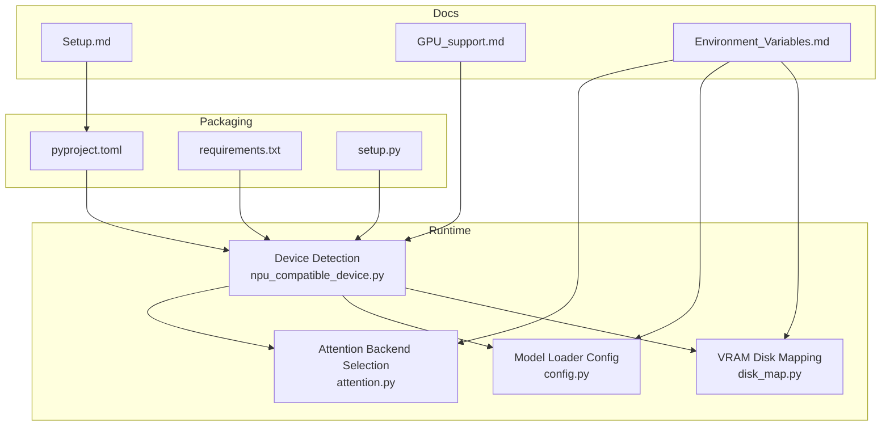
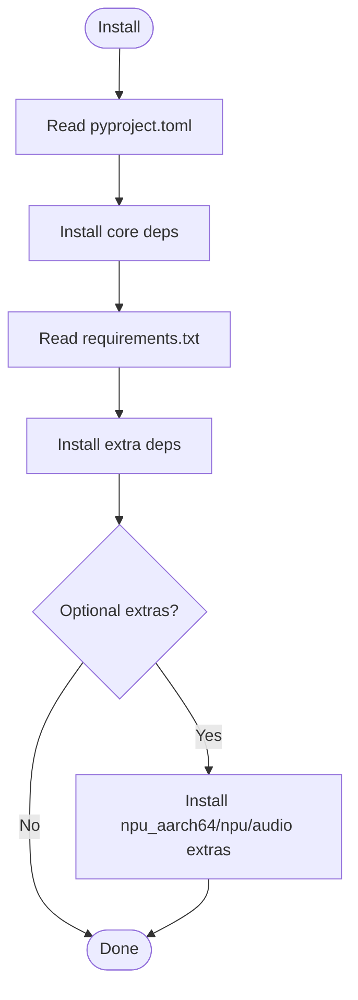
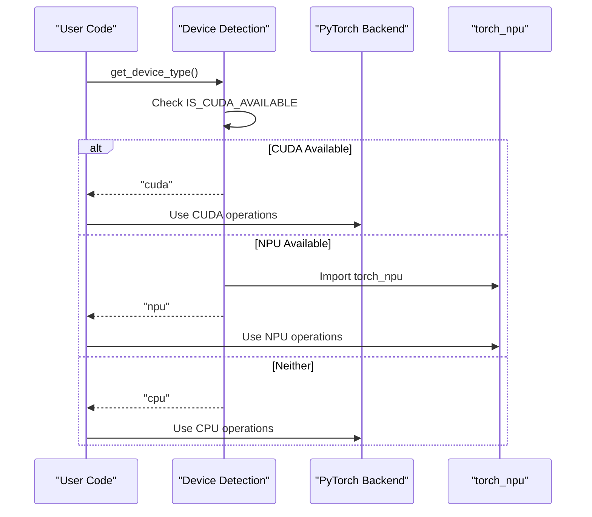
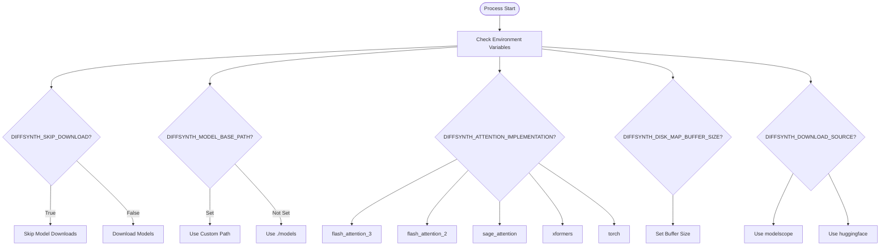
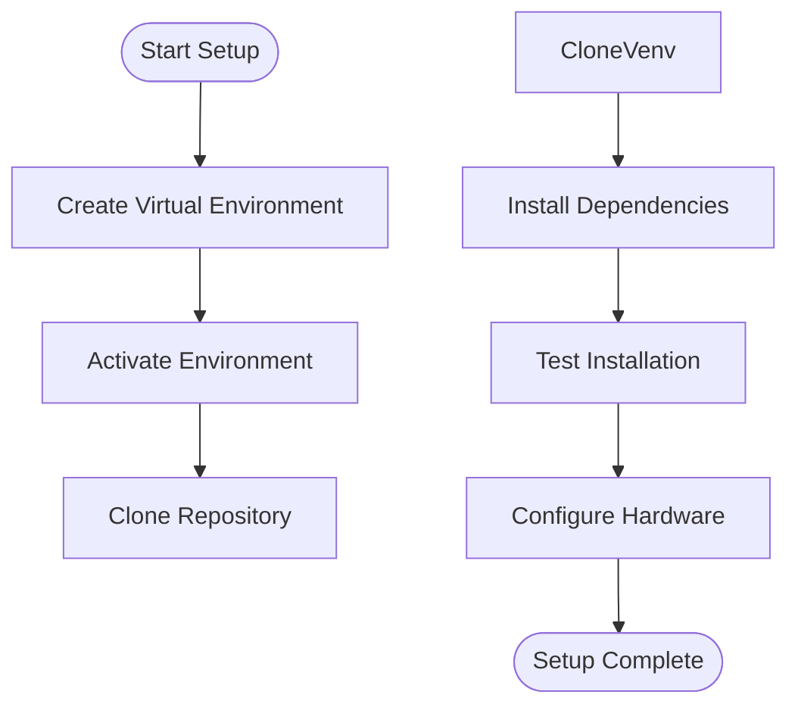
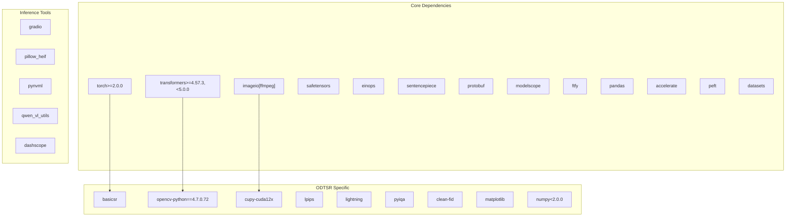

# Environment Setup

<cite>
**Referenced Files in This Document**
- [requirements.txt](file://requirements.txt)
- [pyproject.toml](file://pyproject.toml)
- [setup.py](file://setup.py)
- [Setup.md](file://docs/en/Pipeline_Usage/Setup.md)
- [GPU_support.md](file://docs/en/Pipeline_Usage/GPU_support.md)
- [Environment_Variables.md](file://docs/en/Pipeline_Usage/Environment_Variables.md)
- [npu_compatible_device.py](file://diffsynth/core/device/npu_compatible_device.py)
- [attention.py](file://diffsynth/core/attention/attention.py)
- [config.py](file://diffsynth/core/loader/config.py)
- [disk_map.py](file://diffsynth/core/vram/disk_map.py)
- [nebulactl_launch_script.sh](file://nebulactl_launch_script.sh)
</cite>

## Table of Contents
1. [Introduction](#introduction)
2. [Project Structure](#project-structure)
3. [Core Components](#core-components)
4. [Architecture Overview](#architecture-overview)
5. [Detailed Component Analysis](#detailed-component-analysis)
6. [Dependency Analysis](#dependency-analysis)
7. [Performance Considerations](#performance-considerations)
8. [Troubleshooting Guide](#troubleshooting-guide)
9. [Conclusion](#conclusion)
10. [Appendices](#appendices)

## Introduction
This document provides a comprehensive environment setup guide for ODTSR-edit (DiffSynth-Studio). It covers:
- Required Python version and dependency management via requirements.txt and pyproject.toml
- Installation procedures for Linux, Windows, and macOS
- Hardware-specific setup for NVIDIA GPUs, AMD GPUs, and Ascend NPUs
- Virtual environment best practices
- Key environment variables and their impact on behavior
- Version compatibility matrices and common installation issues with solutions

## Project Structure
The repository includes both packaging configuration and documentation that define how to install and configure the environment:
- Packaging and dependencies are defined in pyproject.toml and requirements.txt
- Installation and hardware support instructions are documented under docs/en/Pipeline_Usage
- Device detection and NPU/CUDA compatibility logic is implemented in diffsynth/core/device



**Diagram sources**
- [pyproject.toml:1-57](file://pyproject.toml#L1-L57)
- [requirements.txt:1-43](file://requirements.txt#L1-L43)

**Section sources**
- [pyproject.toml:1-57](file://pyproject.toml#L1-L57)
- [requirements.txt:1-43](file://requirements.txt#L1-L43)
- [setup.py:1-30](file://setup.py#L1-L30)

## Core Components
- Python version requirement: >= 3.10.1
- Core dependencies include PyTorch, Transformers, ImageIO, safetensors, einops, sentencepiece, protobuf, ModelScope, ftfy, pandas, accelerate, peft, datasets
- Optional extras:
  - npu_aarch64: torch==2.7.1, torch-npu==2.7.1, torchvision==0.22.1
  - npu: torch==2.7.1+cpu, torch-npu==2.7.1, torchvision==0.22.1+cpu
  - audio: torchaudio, torchcodec
- Additional runtime dependencies for ODTSR features: basicsr, opencv-python==4.7.0.72, cupy-cuda12x, lpips, lightning, pyiqa, clean-fid, matplotlib, numpy<2.0.0, gradio, pillow_heif, pynvml, qwen_vl_utils, dashscope

Key environment variables:
- DIFFSYNTH_SKIP_DOWNLOAD: skip model downloads
- DIFFSYNTH_MODEL_BASE_PATH: root directory for model downloads
- DIFFSYNTH_ATTENTION_IMPLEMENTATION: choose attention backend (flash_attention_3, flash_attention_2, sage_attention, xformers, torch)
- DIFFSYNTH_DISK_MAP_BUFFER_SIZE: buffer size for disk mapping
- DIFFSYNTH_DOWNLOAD_SOURCE: remote model download source (modelscope or huggingface)

Hardware-specific environment variables:
- PYTORCH_NPU_ALLOC_CONF=expandable_segments:True (Ascend NPU memory pool expansion)
- CPU_AFFINITY_CONF (Ascend NPU CPU affinity binding)
- CUDA-related variables used across scripts: PYTORCH_CUDA_ALLOC_CONF, XFORMERS_FORCE_DISABLE_TRITON, HF_ENDPOINT, CUDA_LAUNCH_BLOCKING

**Section sources**
- [pyproject.toml:1-57](file://pyproject.toml#L1-L57)
- [requirements.txt:1-43](file://requirements.txt#L1-L43)
- [Environment_Variables.md:1-39](file://docs/en/Pipeline_Usage/Environment_Variables.md#L1-L39)
- [GPU_support.md:1-94](file://docs/en/Pipeline_Usage/GPU_support.md#L1-L94)

## Architecture Overview
The environment setup architecture integrates packaging, dependency resolution, and device/runtime configuration:



**Diagram sources**
- [pyproject.toml:1-57](file://pyproject.toml#L1-L57)
- [requirements.txt:1-43](file://requirements.txt#L1-L43)
- [setup.py:1-30](file://setup.py#L1-L30)
- [npu_compatible_device.py:1-108](file://diffsynth/core/device/npu_compatible_device.py#L1-L108)
- [attention.py:31-32](file://diffsynth/core/attention/attention.py#L31-L32)
- [config.py:42-54](file://diffsynth/core/loader/config.py#L42-L54)
- [disk_map.py:34-35](file://diffsynth/core/vram/disk_map.py#L34-L35)
- [Setup.md:1-54](file://docs/en/Pipeline_Usage/Setup.md#L1-L54)
- [GPU_support.md:1-94](file://docs/en/Pipeline_Usage/GPU_support.md#L1-L94)
- [Environment_Variables.md:1-39](file://docs/en/Pipeline_Usage/Environment_Variables.md#L1-L39)

## Detailed Component Analysis

### Dependency Management
- pyproject.toml defines core dependencies and optional extras for different hardware and features
- requirements.txt lists additional runtime dependencies for ODTSR features and training/inference utilities
- setup.py reads requirements.txt during installation



**Diagram sources**
- [pyproject.toml:1-57](file://pyproject.toml#L1-L57)
- [requirements.txt:1-43](file://requirements.txt#L1-L43)
- [setup.py:1-30](file://setup.py#L1-L30)

**Section sources**
- [pyproject.toml:1-57](file://pyproject.toml#L1-L57)
- [requirements.txt:1-43](file://requirements.txt#L1-L43)
- [setup.py:1-30](file://setup.py#L1-L30)

### Installation Procedures by Platform
- Recommended: Install from source using pip install -e .
- Alternative: Install from PyPI (may lag behind latest features)
- GPU/NPU support varies by platform and hardware

Platform-specific notes:
- Linux: ROCm support for AMD GPUs; CANN installation for Ascend NPU
- Windows/macOS: Standard PyTorch installation; verify CUDA availability
- Ascend NPU: Requires specific torch-npu packages and environment variable configuration

**Section sources**
- [Setup.md:1-54](file://docs/en/Pipeline_Usage/Setup.md#L1-L54)
- [GPU_support.md:1-94](file://docs/en/Pipeline_Usage/GPU_support.md#L1-L94)

### Hardware-Specific Setup

#### NVIDIA GPU
- Default supported device type
- No code modifications required for most models
- Use standard PyTorch CUDA installation

#### AMD GPU
- Requires PyTorch with ROCm support
- Most models run without code changes
- Some models may not be compatible due to CUDA-specific instructions

#### Ascend NPU
- Requires CANN installation and torch-npu packages
- Replace "cuda" with "npu" in Python code
- Set NPU-specific environment variables for optimization
- USP (Unified Sequence Parallel) requires additional third-party libraries



**Diagram sources**
- [npu_compatible_device.py:1-108](file://diffsynth/core/device/npu_compatible_device.py#L1-L108)

**Section sources**
- [GPU_support.md:1-94](file://docs/en/Pipeline_Usage/GPU_support.md#L1-L94)
- [npu_compatible_device.py:1-108](file://diffsynth/core/device/npu_compatible_device.py#L1-L108)

### Environment Variables Impact

#### Core Environment Variables
- DIFFSYNTH_SKIP_DOWNLOAD: Controls whether to skip model downloads
- DIFFSYNTH_MODEL_BASE_PATH: Sets the root directory for model downloads
- DIFFSYNTH_ATTENTION_IMPLEMENTATION: Selects attention backend implementation
- DIFFSYNTH_DISK_MAP_BUFFER_SIZE: Configures disk mapping buffer size
- DIFFSYNTH_DOWNLOAD_SOURCE: Chooses between modelscope and huggingface

#### Hardware-Specific Variables
- PYTORCH_NPU_ALLOC_CONF: Enables expandable segments for NPU memory management
- CPU_AFFINITY_CONF: Controls CPU affinity binding for NPU performance
- PYTORCH_CUDA_ALLOC_CONF: Manages CUDA memory allocation
- XFORMERS_FORCE_DISABLE_TRITON: Disables Triton for xFormers compatibility
- HF_ENDPOINT: Sets Hugging Face mirror endpoint



**Diagram sources**
- [Environment_Variables.md:1-39](file://docs/en/Pipeline_Usage/Environment_Variables.md#L1-L39)
- [attention.py:31-32](file://diffsynth/core/attention/attention.py#L31-L32)
- [config.py:42-54](file://diffsynth/core/loader/config.py#L42-L54)
- [disk_map.py:34-35](file://diffsynth/core/vram/disk_map.py#L34-L35)

**Section sources**
- [Environment_Variables.md:1-39](file://docs/en/Pipeline_Usage/Environment_Variables.md#L1-L39)
- [attention.py:31-32](file://diffsynth/core/attention/attention.py#L31-L32)
- [config.py:42-54](file://diffsynth/core/loader/config.py#L42-L54)
- [disk_map.py:34-35](file://diffsynth/core/vram/disk_map.py#L34-L35)

### Virtual Environment Setup
Recommended approach:
1. Create isolated virtual environment
2. Activate the environment
3. Install from source for latest features
4. Configure hardware-specific dependencies



**Section sources**
- [Setup.md:1-54](file://docs/en/Pipeline_Usage/Setup.md#L1-L54)

## Dependency Analysis
The dependency structure shows clear separation between core functionality and optional features:



**Diagram sources**
- [pyproject.toml:12-28](file://pyproject.toml#L12-L28)
- [requirements.txt:1-43](file://requirements.txt#L1-L43)

**Section sources**
- [pyproject.toml:12-28](file://pyproject.toml#L12-L28)
- [requirements.txt:1-43](file://requirements.txt#L1-L43)

## Performance Considerations
- Memory management: Use PYTORCH_CUDA_ALLOC_CONF=expandable_segments:True for better memory utilization
- Attention optimization: Choose appropriate attention backend based on hardware capabilities
- NPU optimization: Enable expandable segments and CPU affinity for Ascend NPU
- Disk mapping: Adjust DIFFSYNTH_DISK_MAP_BUFFER_SIZE based on available memory and speed requirements
- Model loading: Use DIFFSYNTH_MODEL_BASE_PATH to optimize model access patterns

## Troubleshooting Guide

### Common Installation Issues
- **CUDA driver conflicts**: Ensure CUDA drivers match PyTorch requirements
- **NPU compatibility**: Verify CANN installation and torch-npu package versions
- **AMD GPU support**: Install ROCm-compatible PyTorch version
- **Package conflicts**: Use isolated virtual environments to avoid dependency conflicts

### Environment Variable Issues
- **Model download failures**: Check DIFFSYNTH_DOWNLOAD_SOURCE and network connectivity
- **Memory errors**: Adjust DIFFSYNTH_DISK_MAP_BUFFER_SIZE and memory allocation settings
- **Attention backend issues**: Try different DIFFSYNTH_ATTENTION_IMPLEMENTATION values

### Hardware-Specific Problems
- **NVIDIA GPU**: Verify CUDA installation and driver compatibility
- **AMD GPU**: Ensure ROCm installation and check for CUDA-specific code incompatibilities
- **Ascend NPU**: Confirm CANN installation and set proper environment variables

**Section sources**
- [Setup.md:46-54](file://docs/en/Pipeline_Usage/Setup.md#L46-L54)
- [GPU_support.md:1-94](file://docs/en/Pipeline_Usage/GPU_support.md#L1-L94)

## Conclusion
This environment setup guide provides comprehensive coverage for installing and configuring ODTSR-edit across different platforms and hardware configurations. The modular dependency structure and flexible environment variable system allow for optimal performance tuning across various deployment scenarios. Following the recommended installation procedures and troubleshooting steps will ensure a smooth setup experience.

## Appendices

### Version Compatibility Matrix
- Python: >= 3.10.1
- PyTorch: >= 2.0.0 (recommended 2.7.1 for NPU)
- Transformers: >= 4.57.3, < 5.0.0
- OpenCV: 4.7.0.72 (specific version required)
- NumPy: < 2.0.0 (compatibility requirement)

### Quick Reference Commands
```bash
# Create virtual environment
python -m venv odtsr_env
source odtsr_env/bin/activate  # Linux/macOS
odtsr_env\Scripts\activate     # Windows

# Install from source
git clone https://github.com/modelscope/DiffSynth-Studio.git
cd DiffSynth-Studio
pip install -e .

# Install with NPU support (aarch64)
pip install -e .[npu_aarch64]

# Install with NPU support (x86)
pip install -e .[npu] --extra-index-url "https://download.pytorch.org/whl/cpu"
```

**Section sources**
- [pyproject.toml:11](file://pyproject.toml#L11)
- [pyproject.toml:40-49](file://pyproject.toml#L40-L49)
- [requirements.txt:24,33:24-24](file://requirements.txt#L24-L24)
- [requirements.txt:33](file://requirements.txt#L33)