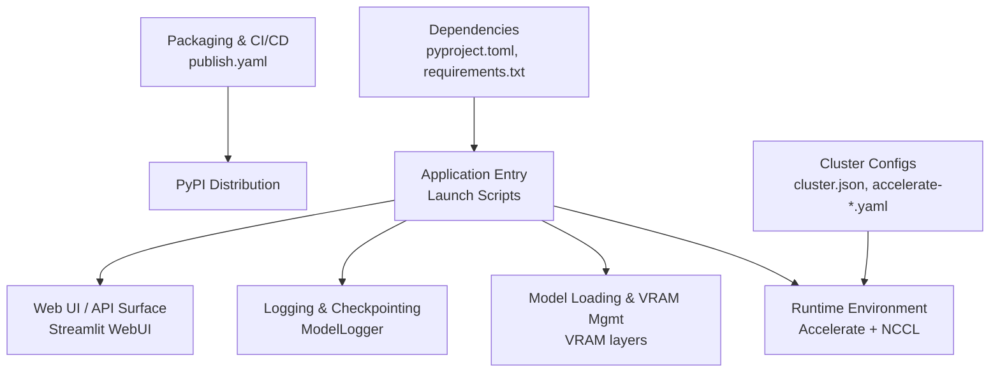
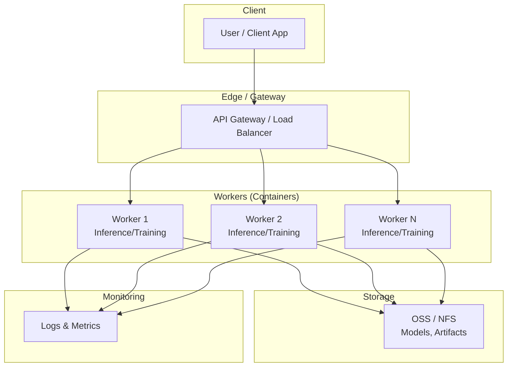
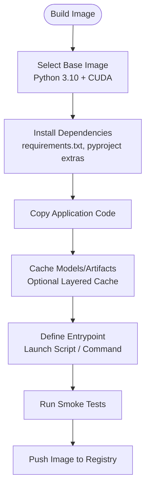
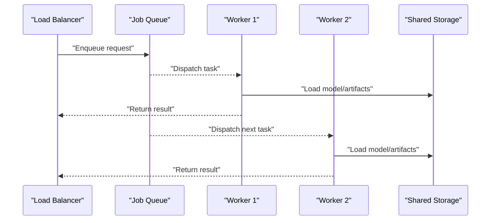
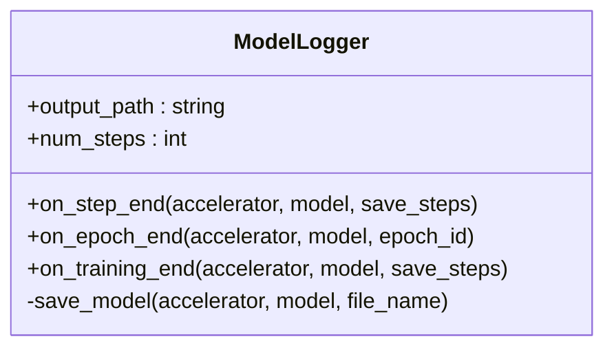
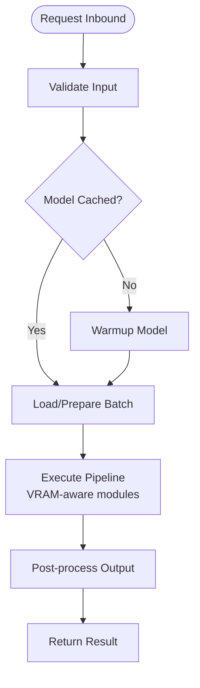
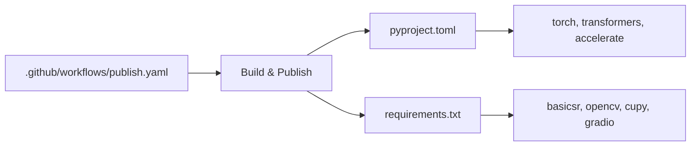

# Production Deployment

<cite>
**Referenced Files in This Document**
- [pyproject.toml](file://pyproject.toml)
- [requirements.txt](file://requirements.txt)
- [.github/workflows/publish.yaml](file://.github/workflows/publish.yaml)
- [nebula_configs/cluster.json](file://nebula_configs/cluster.json)
- [nebula_configs/accelerate-1.yaml](file://nebula_configs/accelerate-1.yaml)
- [nebulactl_launch_script.sh](file://nebulactl_launch_script.sh)
- [nebulactl_launch_test_base.sh](file://nebulactl_launch_test_base.sh)
- [diffsynth/core/vram/layers.py](file://diffsynth/core/vram/layers.py)
- [diffsynth/diffusion/logger.py](file://diffsynth/diffusion/logger.py)
- [examples/dev_tools/webui.py](file://examples/dev_tools/webui.py)
</cite>

## Table of Contents
1. [Introduction](#introduction)
2. [Project Structure](#project-structure)
3. [Core Components](#core-components)
4. [Architecture Overview](#architecture-overview)
5. [Detailed Component Analysis](#detailed-component-analysis)
6. [Dependency Analysis](#dependency-analysis)
7. [Performance Considerations](#performance-considerations)
8. [Troubleshooting Guide](#troubleshooting-guide)
9. [Conclusion](#conclusion)
10. [Appendices](#appendices)

## Introduction
This document provides a production-grade deployment guide for ODTSR-edit applications built on the DiffSynth framework. It covers containerization with Docker, scaling strategies (horizontal and vertical), monitoring and logging, security considerations, performance optimization (model caching, batch processing, memory management), high availability, disaster recovery, and maintenance procedures. The guidance is grounded in the repository’s configuration files, launch scripts, VRAM management utilities, and training/inference examples.

## Project Structure
At a high level, the project includes:
- Core library code under diffsynth/ for model loading, VRAM management, pipelines, and utilities.
- Example inference and training scripts under examples/.
- Orchestration and environment setup via nebulactl launch scripts and accelerate configs.
- Packaging and publishing workflows under .github/workflows/.
- Dependency specifications in pyproject.toml and requirements.txt.

**Diagram sources**
- [nebulactl_launch_script.sh:1-40](file://nebulactl_launch_script.sh#L1-L40)
- [nebula_configs/accelerate-1.yaml:1-16](file://nebula_configs/accelerate-1.yaml#L1-L16)
- [diffsynth/core/vram/layers.py:439-479](file://diffsynth/core/vram/layers.py#L439-L479)
- [diffsynth/diffusion/logger.py:1-44](file://diffsynth/diffusion/logger.py#L1-L44)
- [examples/dev_tools/webui.py:266-331](file://examples/dev_tools/webui.py#L266-L331)
- [.github/workflows/publish.yaml:1-30](file://.github/workflows/publish.yaml#L1-L30)
- [pyproject.toml:1-57](file://pyproject.toml#L1-L57)
- [requirements.txt:1-43](file://requirements.txt#L1-L43)

**Section sources**
- [pyproject.toml:1-57](file://pyproject.toml#L1-L57)
- [requirements.txt:1-43](file://requirements.txt#L1-L43)
- [.github/workflows/publish.yaml:1-30](file://.github/workflows/publish.yaml#L1-L30)
- [nebula_configs/cluster.json:1-7](file://nebula_configs/cluster.json#L1-L7)
- [nebula_configs/accelerate-1.yaml:1-16](file://nebula_configs/accelerate-1.yaml#L1-L16)
- [nebulactl_launch_script.sh:1-40](file://nebulactl_launch_script.sh#L1-L40)
- [nebulactl_launch_test_base.sh:38-58](file://nebulactl_launch_test_base.sh#L38-L58)
- [diffsynth/core/vram/layers.py:439-479](file://diffsynth/core/vram/layers.py#L439-L479)
- [diffsynth/diffusion/logger.py:1-44](file://diffsynth/diffusion/logger.py#L1-L44)
- [examples/dev_tools/webui.py:266-331](file://examples/dev_tools/webui.py#L266-L331)

## Core Components
- Runtime orchestration: Launch scripts configure environment variables, queues, and cluster parameters for GPU/CPU/memory allocation and networking (NCCL).
- Acceleration and distributed execution: Accelerate configurations define multi-GPU settings, mixed precision, and process counts.
- VRAM management: VRAM-aware wrappers enable lazy loading, disk offload, and fine-grained control over module states to fit large models into constrained memory.
- Logging and checkpointing: ModelLogger saves checkpoints at step/epoch boundaries and integrates with Accelerator state handling.
- Web interface: Streamlit-based WebUI enables interactive testing and parameter tuning for pipelines.

**Section sources**
- [nebulactl_launch_script.sh:1-40](file://nebulactl_launch_script.sh#L1-L40)
- [nebulactl_launch_test_base.sh:38-58](file://nebulactl_launch_test_base.sh#L38-L58)
- [nebula_configs/accelerate-1.yaml:1-16](file://nebula_configs/accelerate-1.yaml#L1-L16)
- [diffsynth/core/vram/layers.py:439-479](file://diffsynth/core/vram/layers.py#L439-L479)
- [diffsynth/diffusion/logger.py:1-44](file://diffsynth/diffusion/logger.py#L1-L44)
- [examples/dev_tools/webui.py:266-331](file://examples/dev_tools/webui.py#L266-L331)

## Architecture Overview
The production architecture typically consists of:
- Containerized workers running inference or training jobs orchestrated by nebulactl.
- Shared storage for models and artifacts (e.g., OSS/NFS).
- Distributed execution via Accelerate and NCCL for multi-GPU scaling.
- Optional web UI for development/testing; production APIs should be implemented behind an authenticated gateway.

[No sources needed since this diagram shows conceptual workflow, not actual code structure]

## Detailed Component Analysis

### Containerization Strategy
- Base image: Use a Python 3.10+ base with CUDA/cuDNN matching your GPU stack. Pin torch and torchvision versions aligned with the repository dependencies.
- Dependencies: Install from requirements.txt and optional extras defined in pyproject.toml (e.g., npu, audio).
- Build pipeline: The GitHub Actions workflow demonstrates building and publishing to PyPI; adapt it to build Docker images instead of distributing packages.
- Secrets and config: Mount secrets (e.g., OSS credentials) as environment variables or secret mounts; avoid hardcoding sensitive values.
- Reproducibility: Pin all dependencies and set explicit CUDA/toolchain versions. Use multi-stage builds to minimize image size.

[No sources needed since this diagram shows conceptual workflow, not actual code structure]

**Section sources**
- [pyproject.toml:1-57](file://pyproject.toml#L1-L57)
- [requirements.txt:1-43](file://requirements.txt#L1-L43)
- [.github/workflows/publish.yaml:1-30](file://.github/workflows/publish.yaml#L1-L30)

### Scaling Approaches
- Horizontal scaling: Run multiple worker containers behind a load balancer. Each worker handles independent requests or batches. Use queue-based job submission (as seen in launch scripts) to distribute workloads across nodes.
- Vertical scaling: Increase CPU/GPU/memory per worker using cluster configuration files and launch script parameters. Adjust Accelerate num_processes and gpu_ids for single-node multi-GPU runs.

[No sources needed since this diagram shows conceptual workflow, not actual code structure]

**Section sources**
- [nebula_configs/cluster.json:1-7](file://nebula_configs/cluster.json#L1-L7)
- [nebula_configs/accelerate-1.yaml:1-16](file://nebula_configs/accelerate-1.yaml#L1-L16)
- [nebulactl_launch_script.sh:1-40](file://nebulactl_launch_script.sh#L1-L40)

### Monitoring and Logging
- Training/inference logs: Use structured logging and integrate with centralized log collectors. The ModelLogger writes checkpoints and can be extended to emit metrics.
- Metrics: Track GPU utilization, memory usage, latency, throughput, and error rates. For external API calls (e.g., embedding services), capture token usage and cost metrics.
- Observability: Export Prometheus metrics and use dashboards for alerting. Ensure logs include request IDs for tracing across components.

**Diagram sources**
- [diffsynth/diffusion/logger.py:1-44](file://diffsynth/diffusion/logger.py#L1-L44)

**Section sources**
- [diffsynth/diffusion/logger.py:1-44](file://diffsynth/diffusion/logger.py#L1-L44)

### Security Considerations
- Authentication: Protect API endpoints with JWT/OAuth or mTLS. Validate tokens at the gateway before forwarding to workers.
- Input validation: Enforce schema validation for prompts, masks, and media inputs. Reject malformed or oversized payloads early.
- Resource limits: Set CPU/GPU/memory quotas per container. Use cgroups or orchestrator constraints to prevent noisy neighbor issues.
- Secrets management: Store credentials (e.g., OSS keys) in secure vaults or orchestrator secret stores; never bake them into images.
- Network security: Restrict outbound calls to trusted endpoints; use private networks where possible.

[No sources needed since this section provides general guidance]

### Performance Optimization
- Model caching: Keep frequently used models in memory or fast SSD-backed caches. Use warm-up requests to preload models.
- Batch processing: Group requests into batches to maximize GPU throughput. Implement dynamic batching based on available resources.
- Memory management: Leverage VRAM management utilities for lazy loading and disk offload when memory is tight. Configure computation dtype (e.g., bf16) and precision settings.
- Parallelism: Use Accelerate for multi-GPU training/inference. Tune NCCL options for optimal interconnect performance.

**Section sources**
- [diffsynth/core/vram/layers.py:439-479](file://diffsynth/core/vram/layers.py#L439-L479)
- [nebula_configs/accelerate-1.yaml:1-16](file://nebula_configs/accelerate-1.yaml#L1-L16)
- [nebulactl_launch_script.sh:1-40](file://nebulactl_launch_script.sh#L1-L40)

### High Availability Setup
- Multi-replica deployment: Deploy multiple worker replicas across failure domains. Use health checks and readiness probes.
- Statelessness: Keep workers stateless; store artifacts in shared storage (OSS/NFS).
- Auto-scaling: Scale out based on queue length or latency thresholds. Scale in during low traffic to save costs.
- Failover: Ensure graceful degradation if one node fails; reroute tasks to healthy workers.

[No sources needed since this section provides general guidance]

### Disaster Recovery and Maintenance
- Backups: Regularly snapshot shared storage and model registries. Version artifacts and maintain rollback plans.
- Drills: Periodically test failover and restore procedures. Validate data integrity post-recovery.
- Maintenance windows: Schedule rolling updates for workers; drain connections before restarting instances.
- Rollback strategy: Maintain previous image versions and quick revert mechanisms.

[No sources needed since this section provides general guidance]

## Dependency Analysis
Key runtime dependencies include PyTorch, Transformers, Accelerate, and various IO libraries. Optional extras support NPU and audio features. The publish workflow ensures consistent builds and distribution.

**Diagram sources**
- [pyproject.toml:1-57](file://pyproject.toml#L1-L57)
- [requirements.txt:1-43](file://requirements.txt#L1-L43)
- [.github/workflows/publish.yaml:1-30](file://.github/workflows/publish.yaml#L1-L30)

**Section sources**
- [pyproject.toml:1-57](file://pyproject.toml#L1-L57)
- [requirements.txt:1-43](file://requirements.txt#L1-L43)
- [.github/workflows/publish.yaml:1-30](file://.github/workflows/publish.yaml#L1-L30)

## Performance Considerations
- Prefer bf16/mixed precision where supported to reduce memory and increase throughput.
- Use expandable CUDA memory allocation and disable Triton when necessary for stability.
- Tune NCCL environment variables for optimal network performance on specific hardware.
- Employ VRAM-aware wrappers to offload layers to disk when memory is insufficient.
- Monitor GPU memory fragmentation and adjust batch sizes accordingly.

**Section sources**
- [nebula_configs/accelerate-1.yaml:1-16](file://nebula_configs/accelerate-1.yaml#L1-L16)
- [nebulactl_launch_script.sh:1-40](file://nebulactl_launch_script.sh#L1-L40)
- [nebulactl_launch_test_base.sh:38-58](file://nebulactl_launch_test_base.sh#L38-L58)
- [diffsynth/core/vram/layers.py:439-479](file://diffsynth/core/vram/layers.py#L439-L479)

## Troubleshooting Guide
- Out-of-memory errors: Enable VRAM management and disk offload; reduce batch size; switch to lower precision dtypes.
- Slow interconnect: Verify NCCL settings and network interfaces; ensure proper IB/RDMA configuration.
- Model loading failures: Check paths to models/artifacts; validate permissions on shared storage; confirm version compatibility.
- Logging gaps: Ensure ModelLogger output paths are writable; verify accelerator synchronization and main process checks.

**Section sources**
- [diffsynth/core/vram/layers.py:439-479](file://diffsynth/core/vram/layers.py#L439-L479)
- [diffsynth/diffusion/logger.py:1-44](file://diffsynth/diffusion/logger.py#L1-L44)
- [nebulactl_launch_script.sh:1-40](file://nebulactl_launch_script.sh#L1-L40)

## Conclusion
By containerizing ODTSR-edit applications, leveraging VRAM-aware optimizations, and adopting robust scaling, monitoring, and security practices, teams can deploy reliable, high-performance inference and training services. The repository’s configuration and utilities provide a solid foundation for production-grade operations.

[No sources needed since this section summarizes without analyzing specific files]

## Appendices

### Appendix A: Launch Configuration Examples
- Cluster resource allocation and Accelerate settings are defined in configuration files.
- Launch scripts set environment variables for CUDA, NCCL, and model paths.

**Section sources**
- [nebula_configs/cluster.json:1-7](file://nebula_configs/cluster.json#L1-L7)
- [nebula_configs/accelerate-1.yaml:1-16](file://nebula_configs/accelerate-1.yaml#L1-L16)
- [nebulactl_launch_script.sh:1-40](file://nebulactl_launch_script.sh#L1-L40)
- [nebulactl_launch_test_base.sh:38-58](file://nebulactl_launch_test_base.sh#L38-L58)

### Appendix B: Web UI for Development
- The Streamlit-based WebUI allows interactive testing of pipelines and parameter exploration.

**Section sources**
- [examples/dev_tools/webui.py:266-331](file://examples/dev_tools/webui.py#L266-L331)