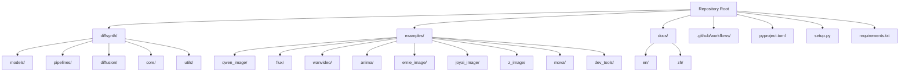
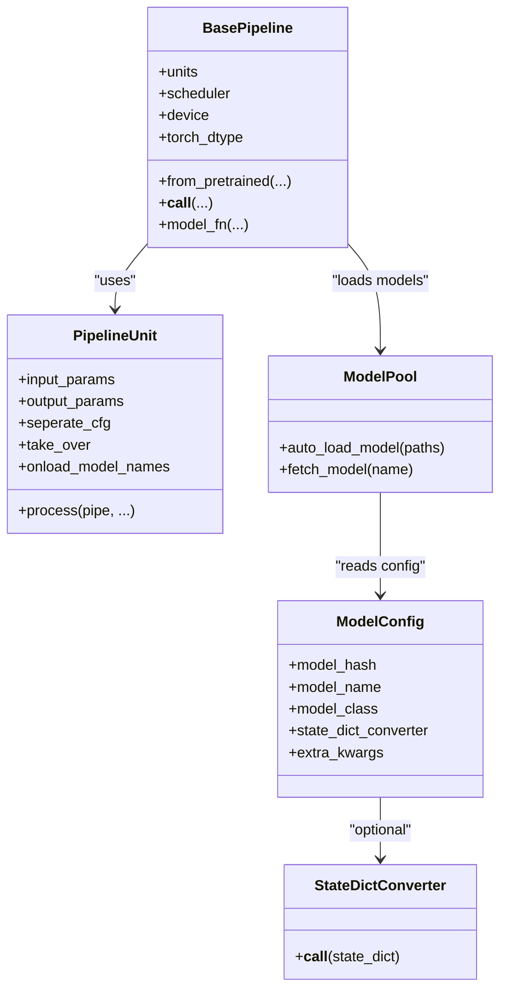
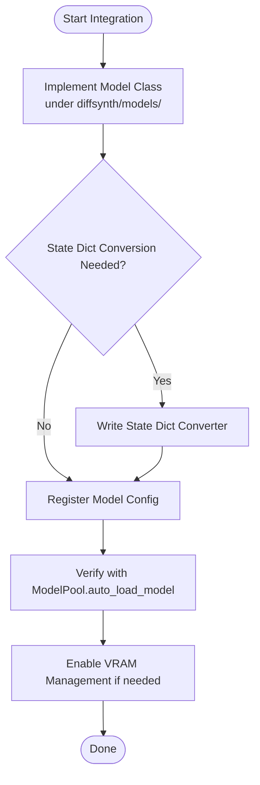
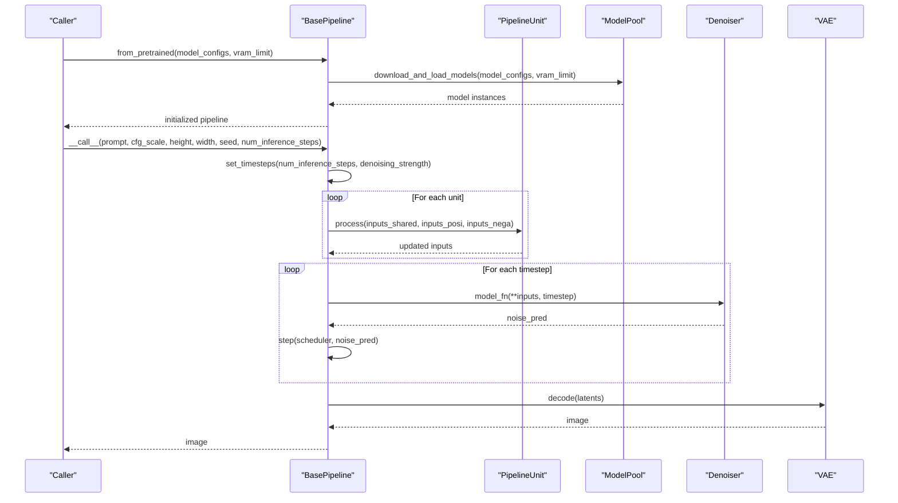
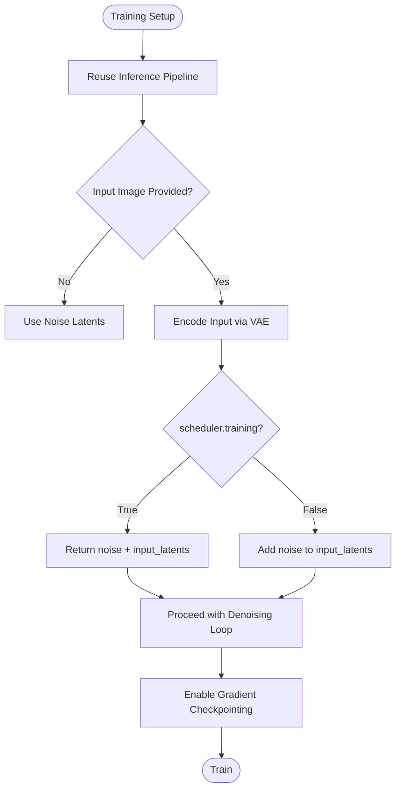
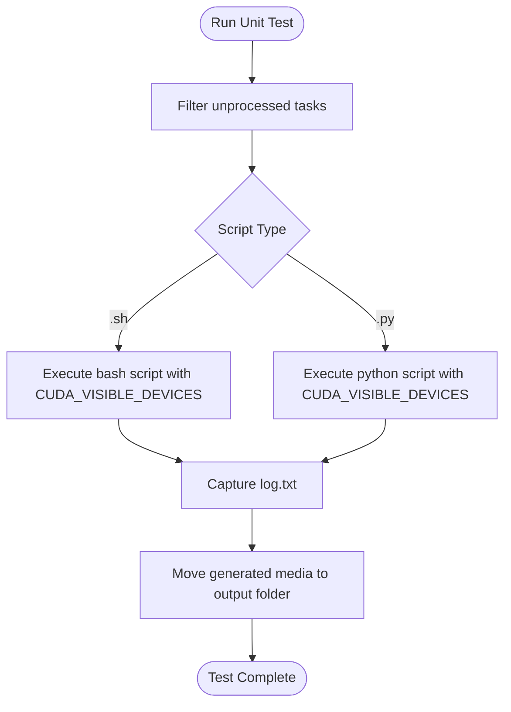
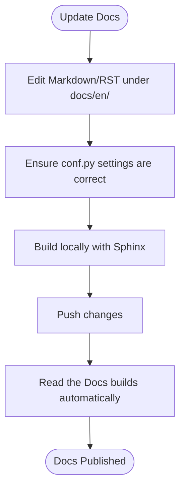
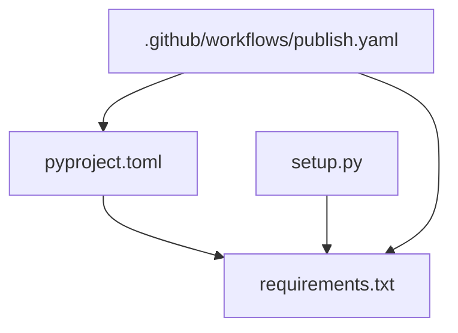

# Contributing and Development

<cite>
**Referenced Files in This Document**
- [pyproject.toml](file://pyproject.toml)
- [setup.py](file://setup.py)
- [requirements.txt](file://requirements.txt)
- [.github/workflows/publish.yaml](file://.github/workflows/publish.yaml)
- [docs/en/Developer_Guide/Building_a_Pipeline.md](file://docs/en/Developer_Guide/Building_a_Pipeline.md)
- [docs/en/Developer_Guide/Integrating_Your_Model.md](file://docs/en/Developer_Guide/Integrating_Your_Model.md)
- [docs/en/Developer_Guide/Training_Diffusion_Models.md](file://docs/en/Developer_Guide/Training_Diffusion_Models.md)
- [examples/dev_tools/unit_test.py](file://examples/dev_tools/unit_test.py)
- [diffsynth/models/model_loader.py](file://diffsynth/models/model_loader.py)
- [diffsynth/configs/model_configs.py](file://diffsynth/configs/model_configs.py)
- [diffsynth/diffusion/base_pipeline.py](file://diffsynth/diffusion/base_pipeline.py)
- [diffsynth/core/loader/config.py](file://diffsynth/core/loader/config.py)
- [diffsynth/core/loader/file.py](file://diffsynth/core/loader/file.py)
- [diffsynth/core/loader/model.py](file://diffsynth/core/loader/model.py)
- [diffsynth/utils/state_dict_converters/qwen_image_text_encoder.py](file://diffsynth/utils/state_dict_converters/qwen_image_text_encoder.py)
- [diffsynth/core/gradient/gradient_checkpoint.py](file://diffsynth/core/gradient/gradient_checkpoint.py)
- [docs/en/.readthedocs.yaml](file://docs/en/.readthedocs.yaml)
- [docs/en/conf.py](file://docs/en/conf.py)
</cite>

## Table of Contents
1. [Introduction](#introduction)
2. [Project Structure](#project-structure)
3. [Core Components](#core-components)
4. [Architecture Overview](#architecture-overview)
5. [Detailed Component Analysis](#detailed-component-analysis)
6. [Dependency Analysis](#dependency-analysis)
7. [Performance Considerations](#performance-considerations)
8. [Troubleshooting Guide](#troubleshooting-guide)
9. [Conclusion](#conclusion)
10. [Appendices](#appendices)

## Introduction
This document provides comprehensive contributing and development guidance for ODTSR-edit (DiffSynth-Studio). It covers environment setup, code standards, testing procedures, documentation guidelines, integrating new models, building pipelines, training workflows, backward compatibility, pull request process, and community contribution practices. The goal is to help contributors implement features consistently and maintain high quality across the project.

## Project Structure
The repository organizes core libraries under diffsynth/, examples for each model family, developer tools, and documentation. Key areas:
- diffsynth/: Core library with models, pipelines, diffusion utilities, VRAM management, loaders, and utilities.
- examples/: Model-specific inference, low-vram variants, and training scripts.
- docs/: English and Chinese documentation, including Developer Guides and API references.
- .github/workflows/: CI/CD for publishing releases.
- Configuration files: pyproject.toml, setup.py, requirements.txt define dependencies and packaging.

**Section sources**
- [pyproject.toml:1-57](file://pyproject.toml#L1-L57)
- [setup.py:1-30](file://setup.py#L1-L30)
- [requirements.txt:1-43](file://requirements.txt#L1-L43)

## Core Components
- Models: Implemented under diffsynth/models/, loaded via a centralized loader and configuration registry.
- Pipelines: Under diffsynth/pipelines/, orchestrate preprocessing units and iterative denoising loops.
- Diffusion: Base pipeline and schedulers live under diffsynth/diffusion/.
- Core utilities: Device handling, VRAM management, gradient checkpointing, data operators, and loaders.
- Utilities: LoRA merging, state dict converters, controlnet inputs, and xfuser helpers.

Key responsibilities:
- Model integration follows a standardized pattern: architecture class, optional state dict converter, and config entry.
- Pipeline construction uses reusable units and a unified forward interface for iteration.
- Training leverages consistent inference logic with minor modifications and optional gradient checkpointing.

**Section sources**
- [docs/en/Developer_Guide/Integrating_Your_Model.md:1-186](file://docs/en/Developer_Guide/Integrating_Your_Model.md#L1-L186)
- [docs/en/Developer_Guide/Building_a_Pipeline.md:1-250](file://docs/en/Developer_Guide/Building_a_Pipeline.md#L1-L250)
- [docs/en/Developer_Guide/Training_Diffusion_Models.md:1-66](file://docs/en/Developer_Guide/Training_Diffusion_Models.md#L1-L66)

## Architecture Overview
The system composes models into pipelines that execute preprocessing units and an iterative denoising loop. Model loading is driven by configuration and a model pool, enabling VRAM-aware management and flexible state dict conversion.

**Diagram sources**
- [diffsynth/diffusion/base_pipeline.py](file://diffsynth/diffusion/base_pipeline.py)
- [diffsynth/models/model_loader.py](file://diffsynth/models/model_loader.py)
- [diffsynth/configs/model_configs.py](file://diffsynth/configs/model_configs.py)
- [diffsynth/utils/state_dict_converters/qwen_image_text_encoder.py](file://diffsynth/utils/state_dict_converters/qwen_image_text_encoder.py)

**Section sources**
- [docs/en/Developer_Guide/Building_a_Pipeline.md:1-250](file://docs/en/Developer_Guide/Building_a_Pipeline.md#L1-L250)
- [docs/en/Developer_Guide/Integrating_Your_Model.md:1-186](file://docs/en/Developer_Guide/Integrating_Your_Model.md#L1-L186)

## Detailed Component Analysis

### Integrating a New Model
Follow the established steps:
1. Implement the model architecture as a torch.nn.Module subclass under diffsynth/models/.
2. If needed, add a state dict converter to normalize keys or split multi-model files.
3. Register the model in diffsynth/configs/model_configs.py with required fields: model_hash, model_name, model_class, state_dict_converter (optional), extra_kwargs (optional).
4. Verify recognition and loading using ModelPool.auto_load_model.
5. Optionally configure VRAM management behavior.

**Diagram sources**
- [docs/en/Developer_Guide/Integrating_Your_Model.md:1-186](file://docs/en/Developer_Guide/Integrating_Your_Model.md#L1-L186)
- [diffsynth/models/model_loader.py](file://diffsynth/models/model_loader.py)
- [diffsynth/configs/model_configs.py](file://diffsynth/configs/model_configs.py)
- [diffsynth/utils/state_dict_converters/qwen_image_text_encoder.py](file://diffsynth/utils/state_dict_converters/qwen_image_text_encoder.py)

**Section sources**
- [docs/en/Developer_Guide/Integrating_Your_Model.md:1-186](file://docs/en/Developer_Guide/Integrating_Your_Model.md#L1-L186)

### Building a Pipeline
A pipeline orchestrates preprocessing units and iterative denoising:
- __init__: Initialize scheduler, model placeholders, units, and model_fn.
- from_pretrained: Download/load models via ModelPool and fetch them by model_name.
- __call__: Run units, iterate timesteps, call model_fn, step scheduler, decode latents.
- Units: Define input/output parameters, CFG separation, takeover mode, and model activation.
- model_fn: Unified forward interface for denoising; may include complex cross-model logic.

**Diagram sources**
- [docs/en/Developer_Guide/Building_a_Pipeline.md:1-250](file://docs/en/Developer_Guide/Building_a_Pipeline.md#L1-L250)
- [diffsynth/diffusion/base_pipeline.py](file://diffsynth/diffusion/base_pipeline.py)

**Section sources**
- [docs/en/Developer_Guide/Building_a_Pipeline.md:1-250](file://docs/en/Developer_Guide/Building_a_Pipeline.md#L1-L250)

### Training Workflow
To ensure training-inference consistency:
- Modify pipeline units to handle i2i/v2v based on scheduler.training state.
- Enable gradient checkpointing in model_fn to reduce VRAM usage during training.
- Use existing training scripts as templates; adapt to new models while preserving inference logic.

**Diagram sources**
- [docs/en/Developer_Guide/Training_Diffusion_Models.md:1-66](file://docs/en/Developer_Guide/Training_Diffusion_Models.md#L1-L66)
- [diffsynth/core/gradient/gradient_checkpoint.py](file://diffsynth/core/gradient/gradient_checkpoint.py)

**Section sources**
- [docs/en/Developer_Guide/Training_Diffusion_Models.md:1-66](file://docs/en/Developer_Guide/Training_Diffusion_Models.md#L1-L66)

### Testing Procedures
- Automated unit tests are provided under examples/dev_tools/unit_test.py, which runs inference and training scripts across multiple GPUs and collects logs and outputs.
- Example test functions cover qwen_image, wan, flux, and z_image families.
- Scripts support single-GPU and multi-GPU execution, moving generated media to organized output folders.

**Diagram sources**
- [examples/dev_tools/unit_test.py:1-122](file://examples/dev_tools/unit_test.py#L1-L122)

**Section sources**
- [examples/dev_tools/unit_test.py:1-122](file://examples/dev_tools/unit_test.py#L1-L122)

### Documentation Guidelines
- Documentation is built with Sphinx and hosted on Read the Docs.
- Configuration resides under docs/en/conf.py and docs/en/.readthedocs.yaml.
- Requirements for building docs are listed in docs/requirements.txt.

**Diagram sources**
- [docs/en/conf.py:109-124](file://docs/en/conf.py#L109-L124)
- [docs/en/.readthedocs.yaml:1-28](file://docs/en/.readthedocs.yaml#L1-L28)

**Section sources**
- [docs/en/conf.py:109-124](file://docs/en/conf.py#L109-L124)
- [docs/en/.readthedocs.yaml:1-28](file://docs/en/.readthedocs.yaml#L1-L28)

### Backward Compatibility
- Keep model interfaces stable; avoid breaking changes to PipelineUnit signatures and model_fn contracts.
- When adding optional features, default to None and provide fallback processing within units.
- Maintain separate state dict converters for different model file formats without altering original weights.
- Version pinning in requirements and pyproject ensures reproducible environments.

**Section sources**
- [docs/en/Developer_Guide/Building_a_Pipeline.md:1-250](file://docs/en/Developer_Guide/Building_a_Pipeline.md#L1-L250)
- [requirements.txt:1-43](file://requirements.txt#L1-L43)
- [pyproject.toml:1-57](file://pyproject.toml#L1-L57)

### Pull Request Process and Code Review
- Create a feature branch and commit small, focused changes.
- Ensure all relevant example tests pass using the unit test runner.
- Update documentation when changing APIs or behaviors.
- Submit a PR with clear descriptions, affected components, and validation results.
- Address reviewer feedback promptly and re-run tests before finalizing.

[No sources needed since this section provides general guidance]

### Community Contribution Guidelines
- Follow coding standards: use PyTorch-native implementations where possible, keep dependencies minimal, and prefer lightweight wrappers around external libraries.
- Prefer native PyTorch modules over heavy third-party integrations to avoid dependency bloat.
- Provide clear comments and docstrings for public APIs.
- Include examples and tests for new functionality.

**Section sources**
- [docs/en/Developer_Guide/Integrating_Your_Model.md:1-186](file://docs/en/Developer_Guide/Integrating_Your_Model.md#L1-L186)

## Dependency Analysis
The project defines Python version constraints and core dependencies in pyproject.toml and requirements.txt. Packaging is configured via setup.py and pyproject.toml. CI publishes releases upon tagged pushes.

**Diagram sources**
- [pyproject.toml:1-57](file://pyproject.toml#L1-L57)
- [requirements.txt:1-43](file://requirements.txt#L1-L43)
- [setup.py:1-30](file://setup.py#L1-L30)
- [.github/workflows/publish.yaml:1-30](file://.github/workflows/publish.yaml#L1-L30)

**Section sources**
- [pyproject.toml:1-57](file://pyproject.toml#L1-L57)
- [requirements.txt:1-43](file://requirements.txt#L1-L43)
- [setup.py:1-30](file://setup.py#L1-L30)
- [.github/workflows/publish.yaml:1-30](file://.github/workflows/publish.yaml#L1-L30)

## Performance Considerations
- Use VRAM management features to load only necessary models during inference/training.
- Enable gradient checkpointing in model_fn to reduce memory footprint during training.
- Prefer direct-mode units when CFG separation is not required to simplify computation graphs.
- Avoid unnecessary model activations outside onload_model_names to minimize VRAM spikes.

**Section sources**
- [docs/en/Developer_Guide/Building_a_Pipeline.md:1-250](file://docs/en/Developer_Guide/Building_a_Pipeline.md#L1-L250)
- [docs/en/Developer_Guide/Training_Diffusion_Models.md:1-66](file://docs/en/Developer_Guide/Training_Diffusion_Models.md#L1-L66)

## Troubleshooting Guide
Common issues and resolutions:
- Model loading failures: Verify model_hash and state dict converter registration; ensure paths match expected formats.
- VRAM errors: Reduce batch sizes, enable gradient checkpointing, and ensure proper model activation via onload_model_names.
- Pipeline unit mismatches: Confirm input/output parameter declarations align with actual usage; check CFG separation flags.
- Dependency conflicts: Pin versions in requirements.txt and pyproject.toml; rebuild environment.

**Section sources**
- [docs/en/Developer_Guide/Integrating_Your_Model.md:1-186](file://docs/en/Developer_Guide/Integrating_Your_Model.md#L1-L186)
- [docs/en/Developer_Guide/Building_a_Pipeline.md:1-250](file://docs/en/Developer_Guide/Building_a_Pipeline.md#L1-L250)

## Conclusion
ODTSR-edit provides a robust framework for integrating models, building pipelines, and training diffusion models with strong VRAM management and consistent inference-train parity. By following the documented patterns for model integration, pipeline construction, and testing, contributors can extend the system reliably and maintain backward compatibility. Adhering to code standards and community guidelines ensures smooth collaboration and high-quality releases.

[No sources needed since this section summarizes without analyzing specific files]

## Appendices

### Environment Setup
- Install dependencies using requirements.txt or pyproject.toml optional extras.
- Use Python 3.10+ as specified.
- For NPU support, install optional dependencies defined in pyproject.toml.

**Section sources**
- [requirements.txt:1-43](file://requirements.txt#L1-L43)
- [pyproject.toml:1-57](file://pyproject.toml#L1-L57)

### Templates and Examples
- Model integration template: follow the steps in Integrating Your Model guide.
- Pipeline template: refer to Building a Pipeline guide and existing pipeline implementations.
- Training template: adapt existing training scripts under examples/*/model_training/train.py.

**Section sources**
- [docs/en/Developer_Guide/Integrating_Your_Model.md:1-186](file://docs/en/Developer_Guide/Integrating_Your_Model.md#L1-L186)
- [docs/en/Developer_Guide/Building_a_Pipeline.md:1-250](file://docs/en/Developer_Guide/Building_a_Pipeline.md#L1-L250)
- [docs/en/Developer_Guide/Training_Diffusion_Models.md:1-66](file://docs/en/Developer_Guide/Training_Diffusion_Models.md#L1-L66)