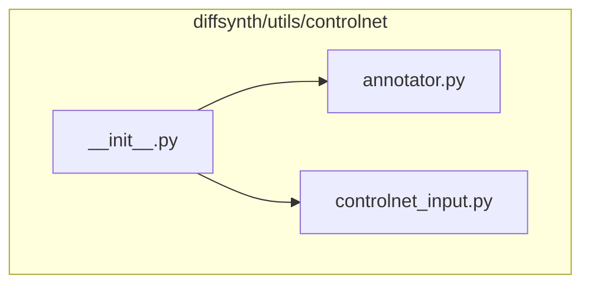
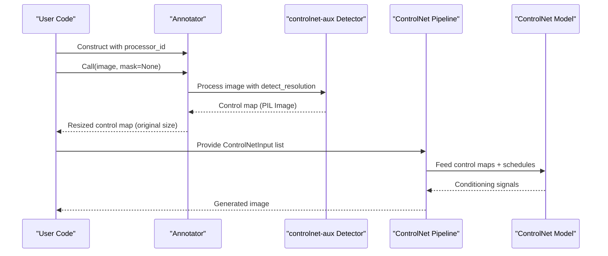
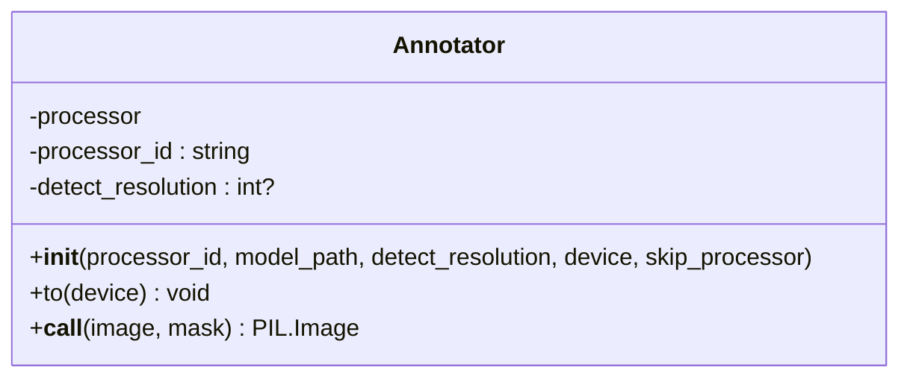
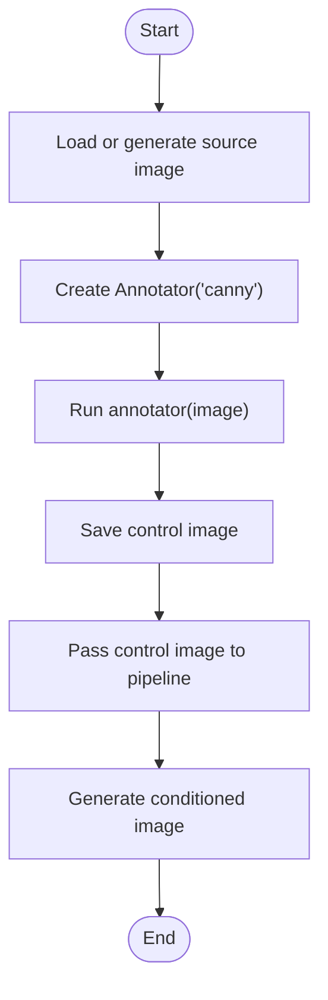
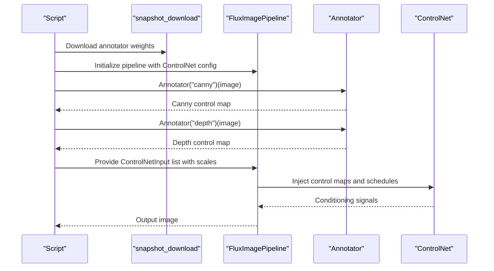
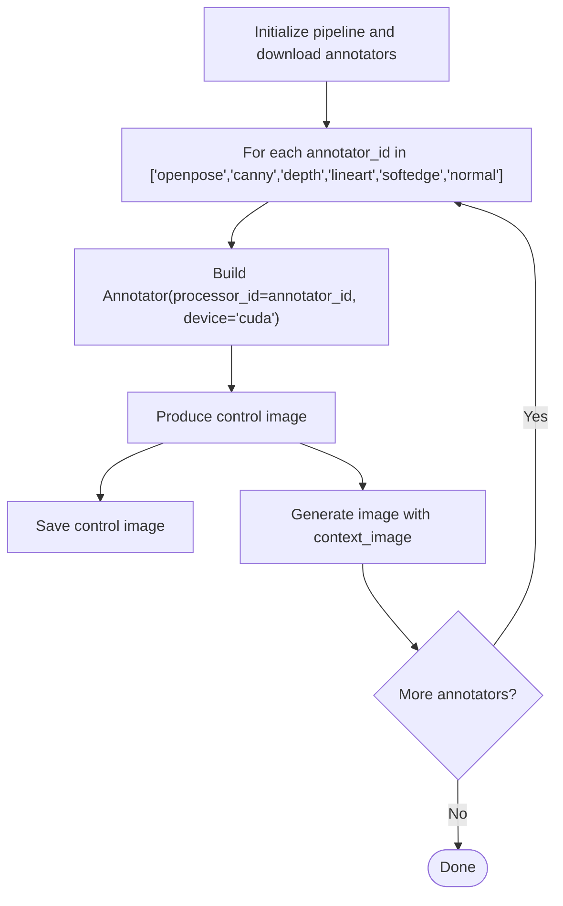
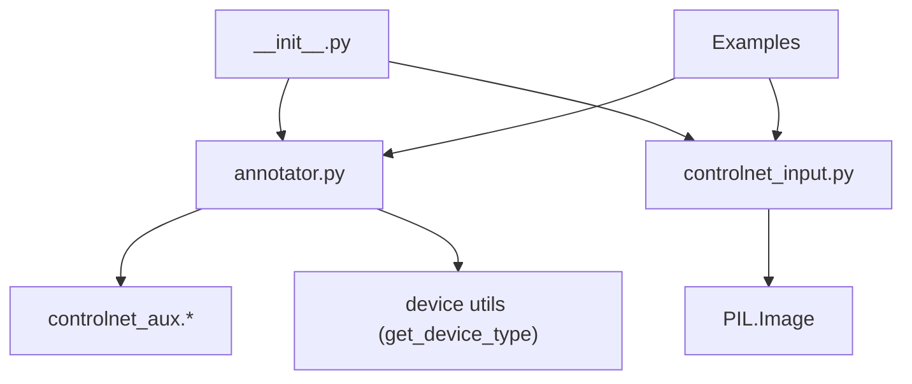

# Annotator System

<cite>
**Referenced Files in This Document**
- [annotator.py](file://diffsynth/utils/controlnet/annotator.py)
- [controlnet_input.py](file://diffsynth/utils/controlnet/controlnet_input.py)
- [__init__.py](file://diffsynth/utils/controlnet/__init__.py)
- [FLEX.2-preview.py](file://examples/flux/model_inference/FLEX.2-preview.py)
- [FLUX.1-dev-Controlnet-Union-alpha.py](file://examples/flux/model_inference/FLUX.1-dev-Controlnet-Union-alpha.py)
- [Qwen-Image-In-Context-Control-Union.py](file://examples/qwen_image/model_inference/Qwen-Image-In-Context-Control-Union.py)
- [model_configs.py](file://diffsynth/configs/model_configs.py)
</cite>

## Table of Contents
1. [Introduction](#introduction)
2. [Project Structure](#project-structure)
3. [Core Components](#core-components)
4. [Architecture Overview](#architecture-overview)
5. [Detailed Component Analysis](#detailed-component-analysis)
6. [Dependency Analysis](#dependency-analysis)
7. [Performance Considerations](#performance-considerations)
8. [Troubleshooting Guide](#troubleshooting-guide)
9. [Conclusion](#conclusion)
10. [Appendices](#appendices)

## Introduction
This document explains the annotator system used by ODTSR-edit’s ControlNet integration to generate conditioning signals from input images. The Annotator class wraps controlnet-aux detectors to produce control maps such as edges, depth, soft edges, line art, pose, and normal maps. It is designed to be lightweight, composable with pipelines, and easy to extend for new modalities. Examples demonstrate how to use built-in annotators (Canny edge detection, depth estimation, pose detection) and how to integrate them into ControlNet workflows.

## Project Structure
The annotator system lives under diffsynth/utils/controlnet and exposes two primary components:
- Annotator: a processor wrapper that selects and runs a specific detector based on a processor_id.
- ControlNetInput: a dataclass describing per-control inputs including image tensors, masks, scales, and processor identifiers.

**Diagram sources**
- [annotator.py:1-64](file://diffsynth/utils/controlnet/annotator.py#L1-L64)
- [controlnet_input.py:1-15](file://diffsynth/utils/controlnet/controlnet_input.py#L1-L15)
- [__init__.py:1-3](file://diffsynth/utils/controlnet/__init__.py#L1-L3)

**Section sources**
- [annotator.py:1-64](file://diffsynth/utils/controlnet/annotator.py#L1-L64)
- [controlnet_input.py:1-15](file://diffsynth/utils/controlnet/controlnet_input.py#L1-L15)
- [__init__.py:1-3](file://diffsynth/utils/controlnet/__init__.py#L1-L3)

## Core Components
- Annotator: Initializes a specific detector based on processor_id, supports device movement, and processes PIL images to produce control maps at original resolution.
- ControlNetInput: Encapsulates control parameters (scale, start/end scheduling), images, masks, and processor_id for multi-control usage.

Key behaviors:
- Processor selection via processor_id determines which controlnet-aux detector to instantiate.
- detect_resolution controls the internal processing resolution; output is resized back to the original image size.
- OpenPose uses additional flags to include body, hand, and face keypoints.
- tile, none, inpaint are reserved processor_ids without an external detector.

**Section sources**
- [annotator.py:9-62](file://diffsynth/utils/controlnet/annotator.py#L9-L62)
- [controlnet_input.py:5-15](file://diffsynth/utils/controlnet/controlnet_input.py#L5-L15)

## Architecture Overview
The annotator integrates with ControlNet pipelines through ControlNetInput objects. Pipelines consume these inputs to condition generation with control maps produced by Annotator.

**Diagram sources**
- [annotator.py:48-62](file://diffsynth/utils/controlnet/annotator.py#L48-L62)
- [controlnet_input.py:5-15](file://diffsynth/utils/controlnet/controlnet_input.py#L5-L15)
- [FLUX.1-dev-Controlnet-Union-alpha.py:28-39](file://examples/flux/model_inference/FLUX.1-dev-Controlnet-Union-alpha.py#L28-L39)

## Detailed Component Analysis

### Annotator Class
Responsibilities:
- Select and initialize a detector based on processor_id.
- Apply detector with configurable detect_resolution and image_resolution.
- Resize output to match the original input image dimensions.
- Support device movement for models that expose a .to(device) method.

Supported processors:
- canny: Edge detection using Canny.
- depth: Depth estimation using Midas.
- softedge: Soft edge detection using HED.
- lineart: Line art extraction.
- lineart_anime: Anime-style line art.
- openpose: Human pose detection (body, hands, face).
- normal: Normal map estimation.
- tile, none, inpaint: Reserved IDs without external detector.

Parameters:
- processor_id: Literal selector for the detector.
- model_path: Path to pretrained weights for detectors requiring downloads.
- detect_resolution: Internal processing resolution; defaults to min(width, height).
- device: Target device for models supporting .to(device).
- skip_processor: If True, bypasses detector initialization.

Output format:
- Returns a PIL Image sized to the original input image. For openpose, returns a composite keypoint visualization; for others, returns grayscale or channel-specific control maps depending on the detector.

**Diagram sources**
- [annotator.py:9-62](file://diffsynth/utils/controlnet/annotator.py#L9-L62)

**Section sources**
- [annotator.py:5-7](file://diffsynth/utils/controlnet/annotator.py#L5-L7)
- [annotator.py:9-38](file://diffsynth/utils/controlnet/annotator.py#L9-L38)
- [annotator.py:43-62](file://diffsynth/utils/controlnet/annotator.py#L43-L62)

### ControlNetInput Dataclass
Purpose:
- Describe a single control signal entry for ControlNet pipelines.
- Include scale and temporal schedule (start/end) for modulation.
- Attach images and optional masks for inpainting scenarios.
- Specify processor_id to indicate how the control was generated.

Fields:
- controlnet_id: Identifier for the control branch.
- scale: Weighting factor for the control signal.
- start/end: Temporal schedule boundaries for applying control during denoising steps.
- image: Primary control image (e.g., edge map, depth map).
- inpaint_image/inpaint_mask: Optional mask-based control for inpainting.
- processor_id: String indicating the annotator type used.

**Section sources**
- [controlnet_input.py:5-15](file://diffsynth/utils/controlnet/controlnet_input.py#L5-L15)

### Usage Examples

#### Canny Edge Detection
A minimal example shows generating a control image using the Canny annotator and passing it to a pipeline.

**Diagram sources**
- [FLEX.2-preview.py:41-42](file://examples/flux/model_inference/FLEX.2-preview.py#L41-L42)

**Section sources**
- [FLEX.2-preview.py:3-5](file://examples/flux/model_inference/FLEX.2-preview.py#L3-L5)
- [FLEX.2-preview.py:41-42](file://examples/flux/model_inference/FLEX.2-preview.py#L41-L42)

#### Depth Estimation and Multi-Control
Demonstrates downloading annotator weights and combining multiple control signals (canny and depth) via ControlNetInput.

**Diagram sources**
- [FLUX.1-dev-Controlnet-Union-alpha.py:8-9](file://examples/flux/model_inference/FLUX.1-dev-Controlnet-Union-alpha.py#L8-L9)
- [FLUX.1-dev-Controlnet-Union-alpha.py:28-39](file://examples/flux/model_inference/FLUX.1-dev-Controlnet-Union-alpha.py#L28-L39)

**Section sources**
- [FLUX.1-dev-Controlnet-Union-alpha.py:1-41](file://examples/flux/model_inference/FLUX.1-dev-Controlnet-Union-alpha.py#L1-L41)

#### Pose Detection and Context Control
Shows iterating over multiple annotator types (including openpose) and using the resulting control images as context for generation.

**Diagram sources**
- [Qwen-Image-In-Context-Control-Union.py:7-8](file://examples/qwen_image/model_inference/Qwen-Image-In-Context-Control-Union.py#L7-L8)
- [Qwen-Image-In-Context-Control-Union.py:25-35](file://examples/qwen_image/model_inference/Qwen-Image-In-Context-Control-Union.py#L25-L35)

**Section sources**
- [Qwen-Image-In-Context-Control-Union.py:1-36](file://examples/qwen_image/model_inference/Qwen-Image-In-Context-Control-Union.py#L1-L36)

### Extending the Annotator System
To add a new conditioning modality:
- Add a new processor_id to the Processor_id literal.
- Implement a branch in __init__ to instantiate your detector from controlnet-aux or a custom module.
- Ensure the detector accepts a PIL image and returns a PIL image compatible with the expected control format.
- If needed, adjust __call__ to pass extra kwargs similar to openpose handling.

Integration tips:
- Keep model_path consistent so snapshot_download or local weights resolve correctly.
- Use detect_resolution to balance quality vs. speed; larger values improve detail but increase memory/time.
- For large images, consider batching or tiling strategies outside the annotator to avoid excessive VRAM usage.

[No sources needed since this section provides general guidance]

## Dependency Analysis
The annotator depends on controlnet-aux detectors and optionally on device utilities. ControlNet pipelines consume ControlNetInput to apply control signals.

**Diagram sources**
- [annotator.py:1-3](file://diffsynth/utils/controlnet/annotator.py#L1-L3)
- [controlnet_input.py:1-3](file://diffsynth/utils/controlnet/controlnet_input.py#L1-L3)
- [__init__.py:1-3](file://diffsynth/utils/controlnet/__init__.py#L1-L3)

**Section sources**
- [annotator.py:1-3](file://diffsynth/utils/controlnet/annotator.py#L1-L3)
- [controlnet_input.py:1-3](file://diffsynth/utils/controlnet/controlnet_input.py#L1-L3)
- [__init__.py:1-3](file://diffsynth/utils/controlnet/__init__.py#L1-L3)

## Performance Considerations
- Resolution scaling: detect_resolution controls internal processing size; defaulting to min(width, height) balances quality and speed.
- Device placement: Move detector models to GPU when available; ensure only models exposing .to(device) are moved.
- Memory management: Avoid loading all annotators simultaneously; instantiate only what you need per run.
- Batch processing: For large datasets, process images in batches and reuse annotator instances to reduce overhead.
- Weight caching: Pre-download annotator weights once to avoid repeated network calls.

[No sources needed since this section provides general guidance]

## Troubleshooting Guide
Common issues and resolutions:
- Unsupported processor_id: Ensure the processor_id matches one of the supported literals.
- Missing model weights: Use snapshot_download to fetch required weights into models/Annotators before running.
- Device errors: Confirm the target device supports the detector; move models explicitly if necessary.
- Large image memory spikes: Reduce detect_resolution or resize input images prior to annotation.

**Section sources**
- [annotator.py:35-36](file://diffsynth/utils/controlnet/annotator.py#L35-L36)
- [FLUX.1-dev-Controlnet-Union-alpha.py:8](file://examples/flux/model_inference/FLUX.1-dev-Controlnet-Union-alpha.py#L8)
- [Qwen-Image-In-Context-Control-Union.py:7-8](file://examples/qwen_image/model_inference/Qwen-Image-In-Context-Control-Union.py#L7-L8)

## Conclusion
The Annotator system provides a clean interface to generate diverse control signals for ControlNet pipelines. By selecting appropriate processor_ids and tuning detect_resolution, users can efficiently produce edges, depth, pose, and other modalities. Integration with ControlNetInput enables flexible multi-control workflows. Extensibility is straightforward, allowing new detectors to be added with minimal changes.

[No sources needed since this section summarizes without analyzing specific files]

## Appendices

### Supported Processor IDs and Typical Outputs
- canny: Binary edge map.
- depth: Grayscale depth map.
- softedge: Soft edge map.
- lineart: Line art map.
- lineart_anime: Anime-style line art.
- openpose: Keypoint overlay with body, hands, and face.
- normal: Surface normal map.
- tile, none, inpaint: Reserved IDs without external detector.

**Section sources**
- [annotator.py:5-7](file://diffsynth/utils/controlnet/annotator.py#L5-L7)

### ControlNet Mode Mapping
Some ControlNet models define mode dictionaries mapping processor_ids to numeric modes. For example, a union ControlNet may support canny, tile, depth, blur, pose, gray, lq.

**Section sources**
- [model_configs.py:385-391](file://diffsynth/configs/model_configs.py#L385-L391)