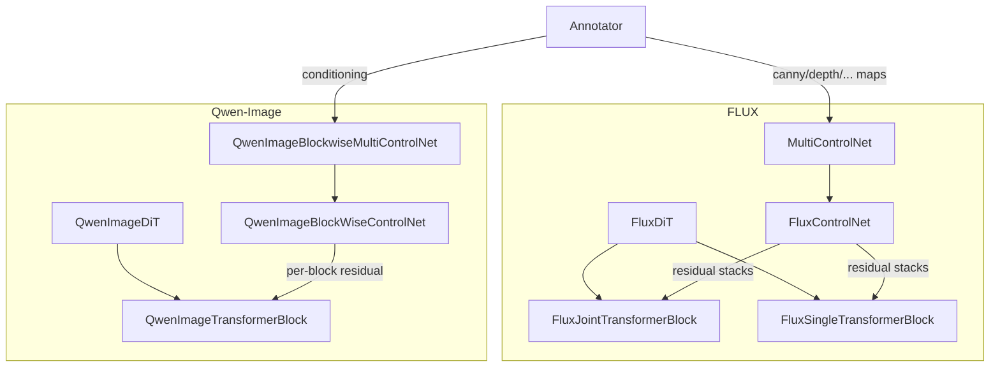
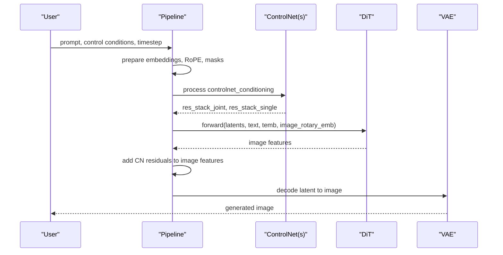
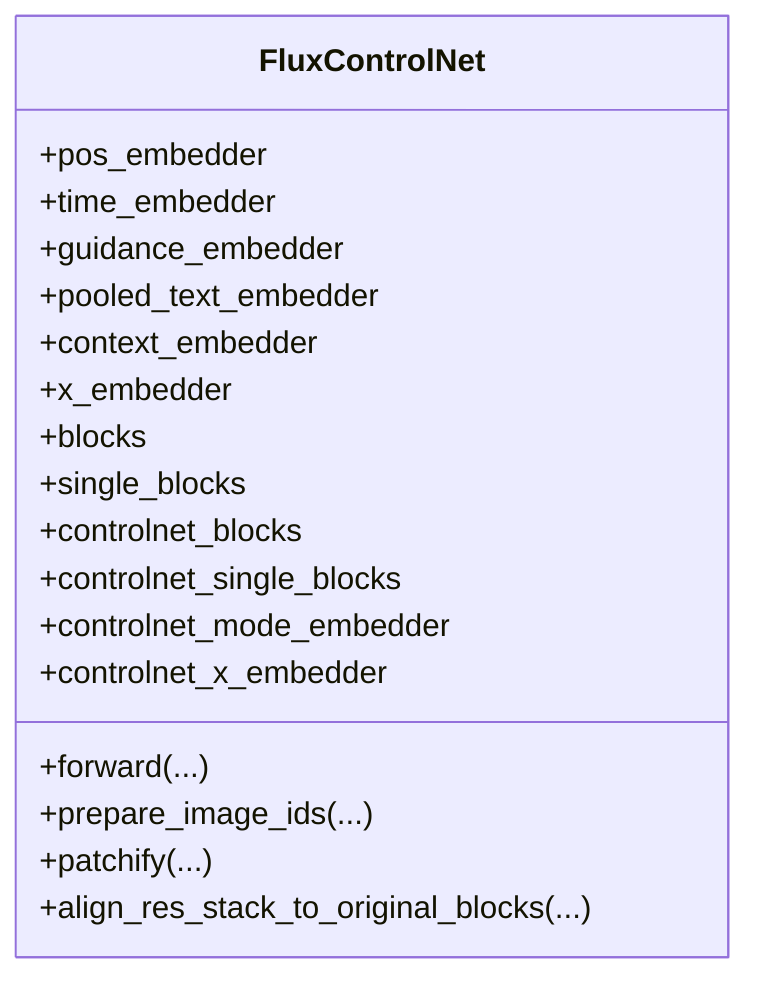
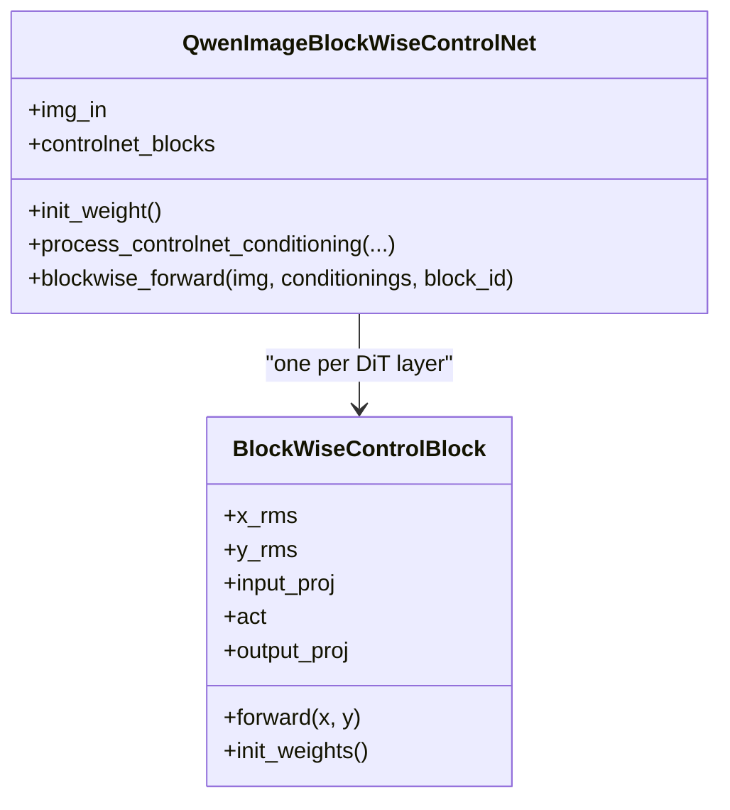
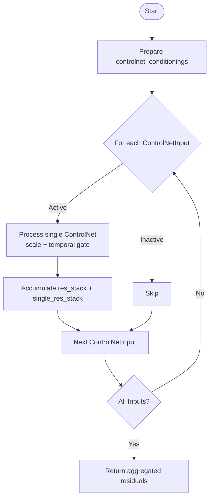
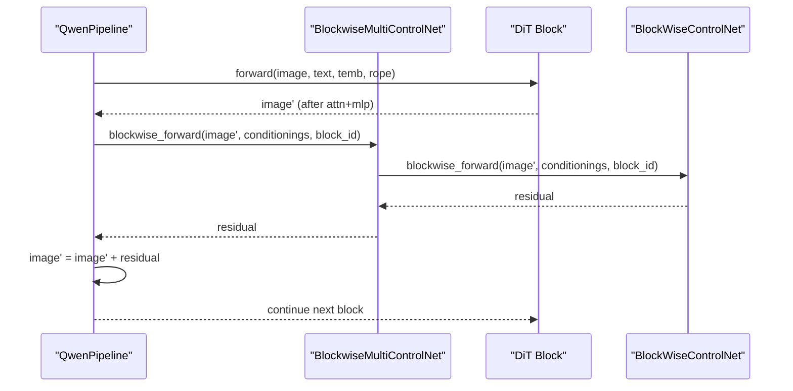
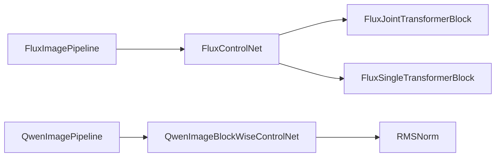
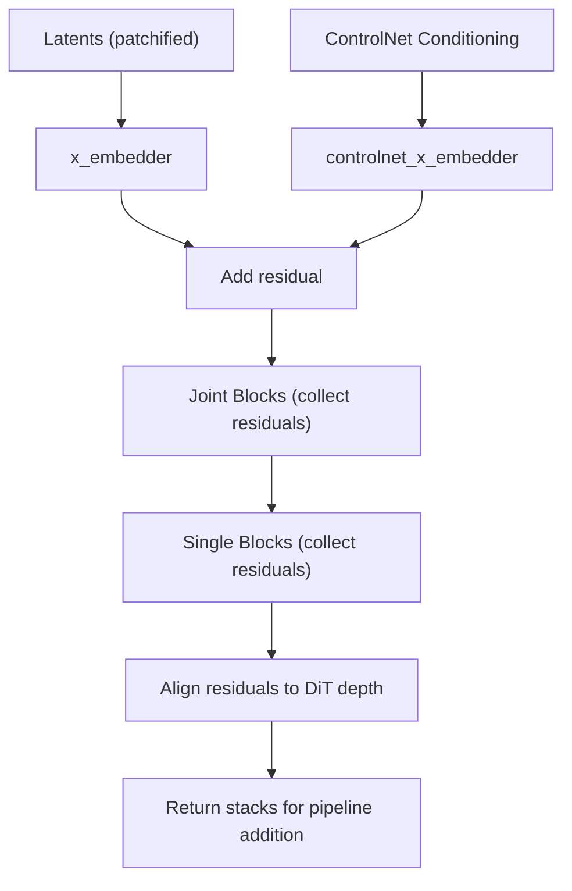
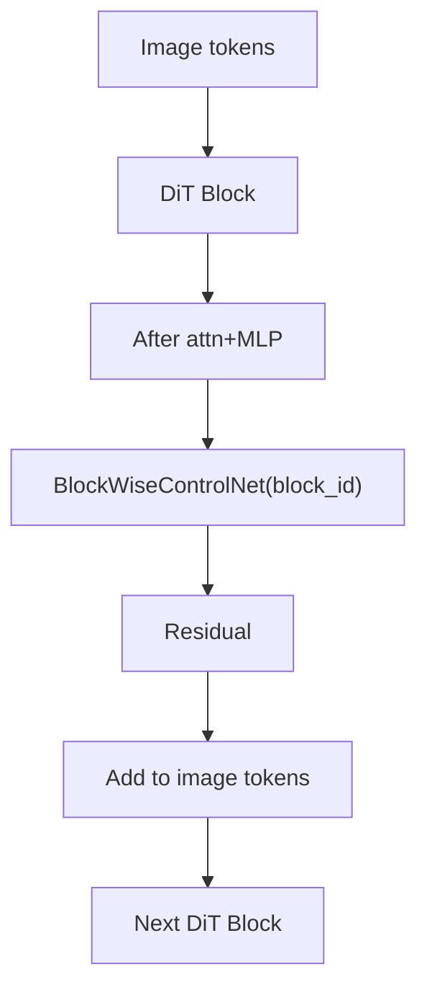

# ControlNet Architecture

<cite>
**Referenced Files in This Document**
- [flux_controlnet.py](file://diffsynth/models/flux_controlnet.py)
- [qwen_image_controlnet.py](file://diffsynth/models/qwen_image_controlnet.py)
- [flux_dit.py](file://diffsynth/models/flux_dit.py)
- [qwen_image_dit.py](file://diffsynth/models/qwen_image_dit.py)
- [flux_image.py](file://diffsynth/pipelines/flux_image.py)
- [qwen_image.py](file://diffsynth/pipelines/qwen_image.py)
- [annotator.py](file://diffsynth/utils/controlnet/annotator.py)
- [controlnet_input.py](file://diffsynth/utils/controlnet/controlnet_input.py)
</cite>

## Table of Contents
1. [Introduction](#introduction)
2. [Project Structure](#project-structure)
3. [Core Components](#core-components)
4. [Architecture Overview](#architecture-overview)
5. [Detailed Component Analysis](#detailed-component-analysis)
6. [Dependency Analysis](#dependency-analysis)
7. [Performance Considerations](#performance-considerations)
8. [Troubleshooting Guide](#troubleshooting-guide)
9. [Conclusion](#conclusion)
10. [Appendices](#appendices)

## Introduction
This document explains the ControlNet architecture implemented in ODTSR-edit for conditional image generation. It covers how ControlNet learns spatial conditioning from input images and injects learned residuals into diffusion models such as FLUX and Qwen-Image. The documentation details architectural design, weight initialization strategies (including zero-initialized projections), integration points within attention pathways, and the training objectives that underpin stable conditioning. Visual diagrams illustrate data flow and integration points across pipelines and models.

## Project Structure
ControlNet is provided as separate modules per model family:
- FLUX ControlNet: a lightweight adapter producing residual stacks aligned with joint and single transformer blocks.
- Qwen-Image ControlNet: a blockwise adapter producing per-block residuals added to image tokens.

Pipelines orchestrate control signals, compute conditioning tensors, and integrate ControlNet outputs during denoising steps.

**Diagram sources**
- [flux_controlnet.py:61-155](file://diffsynth/models/flux_controlnet.py#L61-L155)
- [flux_dit.py:277-306](file://diffsynth/models/flux_dit.py#L277-L306)
- [qwen_image_controlnet.py:29-56](file://diffsynth/models/qwen_image_controlnet.py#L29-L56)
- [qwen_image_dit.py:590-625](file://diffsynth/models/qwen_image_dit.py#L590-L625)
- [flux_image.py:23-54](file://diffsynth/pipelines/flux_image.py#L23-L54)
- [qwen_image.py:199-210](file://diffsynth/pipelines/qwen_image.py#L199-L210)

**Section sources**
- [flux_controlnet.py:61-155](file://diffsynth/models/flux_controlnet.py#L61-L155)
- [qwen_image_controlnet.py:29-56](file://diffsynth/models/qwen_image_controlnet.py#L29-L56)
- [flux_image.py:23-54](file://diffsynth/pipelines/flux_image.py#L23-L54)
- [qwen_image.py:199-210](file://diffsynth/pipelines/qwen_image.py#L199-L210)

## Core Components
- FluxControlNet: Produces two residual stacks (joint and single blocks) by processing patchified latents and conditioning embeddings; supports mode embedding and optional guidance embedding.
- QwenImageBlockWiseControlNet: A linear projection plus per-block BlockWiseControlBlock that outputs a residual added to image tokens at each DiT layer.
- MultiControlNet (FLUX): Aggregates multiple ControlNet branches with per-control scaling and temporal gating via start/end schedules.
- QwenImageBlockwiseMultiControlNet (Qwen-Image): Manages multiple blockwise controlnets and applies them per DiT block.
- Annotator: Generates spatial conditioning maps (e.g., canny, depth, normal) used as ControlNet inputs.
- ControlNetInput: Dataclass carrying scale, temporal schedule, processor ID, and conditioning images/masks.

Key behaviors:
- Zero-initialization ensures ControlNet starts as identity mapping, preserving pretrained DiT behavior at training start.
- Residual alignment aligns ControlNet outputs to the number of DiT blocks, enabling flexible ControlNet depth vs DiT depth.
- Conditioning injection occurs either by adding to early image token embeddings (FLUX x_embedder path) or by adding per-block residuals (Qwen-Image).

**Section sources**
- [flux_controlnet.py:61-155](file://diffsynth/models/flux_controlnet.py#L61-L155)
- [qwen_image_controlnet.py:6-56](file://diffsynth/models/qwen_image_controlnet.py#L6-L56)
- [flux_image.py:23-54](file://diffsynth/pipelines/flux_image.py#L23-L54)
- [qwen_image.py:199-210](file://diffsynth/pipelines/qwen_image.py#L199-L210)
- [annotator.py:9-62](file://diffsynth/utils/controlnet/annotator.py#L9-L62)
- [controlnet_input.py:5-15](file://diffsynth/utils/controlnet/controlnet_input.py#L5-L15)

## Architecture Overview
The ControlNet adapters are trained alongside or after the base DiTs to learn additive residuals conditioned on spatial inputs. During inference:
- Spatial conditionings are produced by annotators or passed directly.
- ControlNet forward passes produce residual stacks aligned with DiT blocks.
- Residuals are scaled by controlnet_input.scale and optionally gated by start/end schedules.
- Residuals are added to image features at specific integration points.

**Diagram sources**
- [flux_image.py:999-1045](file://diffsynth/pipelines/flux_image.py#L999-L1045)
- [qwen_image.py:991-1150](file://diffsynth/pipelines/qwen_image.py#L991-L1150)
- [flux_controlnet.py:112-155](file://diffsynth/models/flux_controlnet.py#L112-L155)
- [qwen_image_controlnet.py:52-56](file://diffsynth/models/qwen_image_controlnet.py#L52-L56)

## Detailed Component Analysis

### FLUX ControlNet
FluxControlNet computes residuals for both joint and single transformer blocks. It:
- Embeds timestep, pooled text, and optional guidance into conditioning.
- Optionally concatenates a mode embedding based on processor_id.
- Patchifies latents and controlnet_conditioning, then adds an initial residual via x_embedder.
- Iterates through joint blocks, collecting per-block residuals.
- Concatenates prompt and image tokens for single blocks, collects per-block residuals.
- Aligns collected residuals to the target number of DiT blocks using interval-based replication.

Integration points:
- Early addition to patchified image tokens via controlnet_x_embedder.
- Per-block residuals returned to be added by the pipeline at corresponding DiT layers.

**Diagram sources**
- [flux_controlnet.py:61-155](file://diffsynth/models/flux_controlnet.py#L61-L155)

**Section sources**
- [flux_controlnet.py:61-155](file://diffsynth/models/flux_controlnet.py#L61-L155)

### Qwen-Image Blockwise ControlNet
QwenImageBlockWiseControlNet provides a simple yet effective blockwise residual generator:
- Linear projection from conditioning channels to model dimension.
- One BlockWiseControlBlock per DiT layer, each comprising RMSNorms, a linear projection, GELU, and a zero-initialized output projection.
- Initialization zeros out output projections so the network starts as identity.

Integration point:
- At each DiT block, the ControlNet outputs a residual added to image tokens before subsequent operations.

**Diagram sources**
- [qwen_image_controlnet.py:6-56](file://diffsynth/models/qwen_image_controlnet.py#L6-L56)

**Section sources**
- [qwen_image_controlnet.py:6-56](file://diffsynth/models/qwen_image_controlnet.py#L6-L56)

### Pipeline Integration: FLUX
MultiControlNet aggregates multiple ControlNet branches:
- For each ControlNetInput, selects the corresponding model branch.
- Applies scale and temporal gating based on progress (start/end).
- Sums residuals across active branches.

In model_fn_flux_image, ControlNet residuals are computed and later added to image features inside the DiT loop.

**Diagram sources**
- [flux_image.py:23-54](file://diffsynth/pipelines/flux_image.py#L23-L54)
- [flux_image.py:999-1045](file://diffsynth/pipelines/flux_image.py#L999-L1045)

**Section sources**
- [flux_image.py:23-54](file://diffsynth/pipelines/flux_image.py#L23-L54)
- [flux_image.py:999-1045](file://diffsynth/pipelines/flux_image.py#L999-L1045)

### Pipeline Integration: Qwen-Image
QwenImageBlockwiseMultiControlNet manages multiple blockwise ControlNets and applies them per DiT block:
- For each DiT layer, calls blockwise_forward to get a residual conditioned on current image features and controlnet_conditionings.
- Adds the residual to image tokens before continuing through the block.

**Diagram sources**
- [qwen_image.py:991-1150](file://diffsynth/pipelines/qwen_image.py#L991-L1150)
- [qwen_image_controlnet.py:52-56](file://diffsynth/models/qwen_image_controlnet.py#L52-L56)

**Section sources**
- [qwen_image.py:991-1150](file://diffsynth/pipelines/qwen_image.py#L991-L1150)
- [qwen_image_controlnet.py:52-56](file://diffsynth/models/qwen_image_controlnet.py#L52-L56)

### Weight Initialization Strategies
- FLUX ControlNet: Uses standard linear layers; quantization utilities exist but do not alter initialization semantics.
- Qwen-Image ControlNet: Explicitly initializes output projections to zero to ensure identity at initialization.

These strategies stabilize training by preventing large perturbations early on.

**Section sources**
- [qwen_image_controlnet.py:23-27](file://diffsynth/models/qwen_image_controlnet.py#L23-L27)
- [qwen_image_controlnet.py:46-50](file://diffsynth/models/qwen_image_controlnet.py#L46-L50)

### ControlNet Conditioning Injection Points
- FLUX: Initial patchified image tokens receive an additive residual via controlnet_x_embedder; per-block residuals are returned for later addition in the pipeline.
- Qwen-Image: Each DiT block receives a residual added directly to image tokens after attention and MLP stages.

These choices preserve the original DiT computation while allowing controlled modification.

**Section sources**
- [flux_controlnet.py:136-155](file://diffsynth/models/flux_controlnet.py#L136-L155)
- [qwen_image.py:1121-1142](file://diffsynth/pipelines/qwen_image.py#L1121-L1142)

### Mathematical Foundations and Training Objectives
- Objective: Train ControlNet to predict residuals that, when added to DiT features, reduce the prediction error of the noise model given spatial conditioning.
- Loss: Typically the same diffusion objective as the base model (e.g., MSE between predicted and target noise), with ControlNet parameters contributing additive terms.
- Identity initialization: Ensures the expected gradient contribution is near-zero initially, stabilizing joint training.
- Alignment: Residual stacks are aligned to DiT depths to maintain consistent shapes across layers.

[No sources needed since this section provides general guidance]

## Dependency Analysis
ControlNet modules depend on core DiT building blocks and pipeline units:
- FluxControlNet depends on FluxJointTransformerBlock and FluxSingleTransformerBlock definitions.
- QwenImageBlockWiseControlNet depends on RMSNorm and basic linear layers.
- Pipelines orchestrate ControlNet usage and manage multi-branch aggregation.

**Diagram sources**
- [flux_controlnet.py:61-155](file://diffsynth/models/flux_controlnet.py#L61-L155)
- [flux_dit.py:108-148](file://diffsynth/models/flux_dit.py#L108-L148)
- [qwen_image_controlnet.py:6-56](file://diffsynth/models/qwen_image_controlnet.py#L6-L56)
- [flux_image.py:23-54](file://diffsynth/pipelines/flux_image.py#L23-L54)
- [qwen_image.py:199-210](file://diffsynth/pipelines/qwen_image.py#L199-L210)

**Section sources**
- [flux_controlnet.py:61-155](file://diffsynth/models/flux_controlnet.py#L61-L155)
- [qwen_image_controlnet.py:6-56](file://diffsynth/models/qwen_image_controlnet.py#L6-L56)
- [flux_image.py:23-54](file://diffsynth/pipelines/flux_image.py#L23-L54)
- [qwen_image.py:199-210](file://diffsynth/pipelines/qwen_image.py#L199-L210)

## Performance Considerations
- Tiling support: Both pipelines support tiled inference, slicing ControlNet conditionings accordingly.
- Quantization: FLUX ControlNet includes quantization utilities for inference-time casting without altering training-time weights.
- Gradient checkpointing: Used in Qwen-Image pipeline to reduce memory usage during training/inference.
- Memory management: VRAM-aware loading/unloading of iteration models improves throughput.

[No sources needed since this section provides general guidance]

## Troubleshooting Guide
Common issues and resolutions:
- Unsupported processor_id in Annotator: Ensure one of the supported types (canny, depth, softedge, lineart, lineart_anime, openpose, normal, tile, none, inpaint).
- Shape mismatches in ControlNet residuals: Verify alignment functions and that ControlNet depth matches DiT depth expectations.
- Temporal gating not applied: Check ControlNetInput start/end values relative to num_inference_steps and progress_id.
- Device placement: Ensure annotator processors are moved to the correct device.

**Section sources**
- [annotator.py:9-36](file://diffsynth/utils/controlnet/annotator.py#L9-L36)
- [flux_controlnet.py:104-109](file://diffsynth/models/flux_controlnet.py#L104-L109)
- [flux_image.py:41-54](file://diffsynth/pipelines/flux_image.py#L41-L54)

## Conclusion
ODTSR-edit implements ControlNet adapters for FLUX and Qwen-Image that learn spatial conditioning and inject residuals into DiT feature streams. The design emphasizes stability through zero-initialized projections, identity-preserving initialization, and careful alignment of residuals to DiT layers. Pipelines provide robust integration with multi-branch control, temporal gating, and tiling support, enabling flexible conditional generation across diverse tasks.

## Appendices

### Data Flow Diagrams

#### FLUX ControlNet Data Flow

**Diagram sources**
- [flux_controlnet.py:136-155](file://diffsynth/models/flux_controlnet.py#L136-L155)

#### Qwen-Image ControlNet Data Flow

**Diagram sources**
- [qwen_image.py:1121-1142](file://diffsynth/pipelines/qwen_image.py#L1121-L1142)
- [qwen_image_controlnet.py:52-56](file://diffsynth/models/qwen_image_controlnet.py#L52-L56)