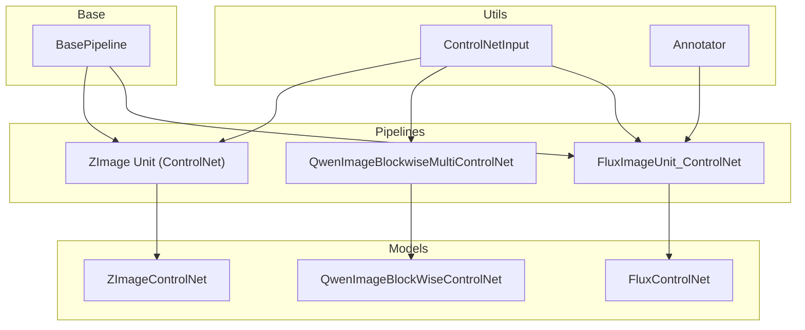
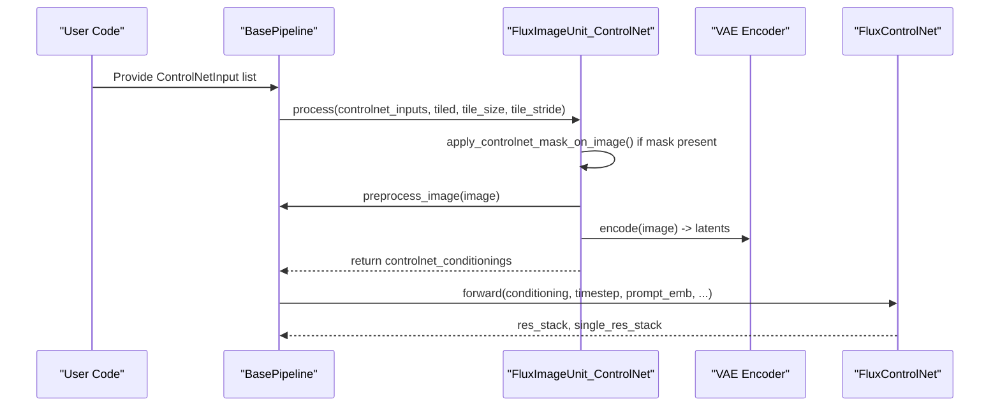
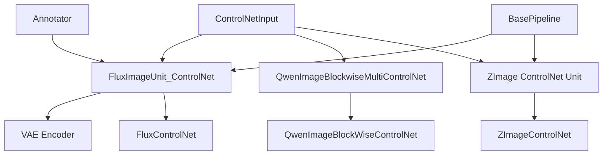
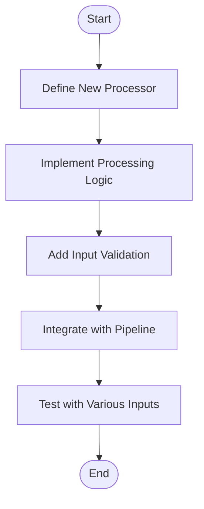

# ControlNet Input Processing

<cite>
**Referenced Files in This Document**
- [controlnet_input.py](file://diffsynth/utils/controlnet/controlnet_input.py)
- [annotator.py](file://diffsynth/utils/controlnet/annotator.py)
- [base_pipeline.py](file://diffsynth/diffusion/base_pipeline.py)
- [flux_image.py](file://diffsynth/pipelines/flux_image.py)
- [qwen_image_controlnet.py](file://diffsynth/models/qwen_image_controlnet.py)
- [z_image_controlnet.py](file://diffsynth/models/z_image_controlnet.py)
- [z_image.py](file://diffsynth/pipelines/z_image.py)
- [training_module.py](file://diffsynth/diffusion/training_module.py)
</cite>

## Table of Contents
1. [Introduction](#introduction)
2. [Project Structure](#project-structure)
3. [Core Components](#core-components)
4. [Architecture Overview](#architecture-overview)
5. [Detailed Component Analysis](#detailed-component-analysis)
6. [Dependency Analysis](#dependency-analysis)
7. [Performance Considerations](#performance-considerations)
8. [Troubleshooting Guide](#troubleshooting-guide)
9. [Conclusion](#conclusion)
10. [Appendices](#appendices)

## Introduction
This document explains how ODTSR-edit handles ControlNet conditioning inputs through the ControlNetInput class and the surrounding input processing pipeline. It covers:
- How image-based controls, text prompts, and multi-modal inputs are prepared and validated
- Preprocessing steps and format conversions (PIL to tensors, VAE encoding, mask handling)
- Tensor operations, device placement, and memory optimization strategies for large conditioning inputs
- Batch processing patterns and custom processor creation
- Error handling and compatibility across different model architectures (FLUX, Qwen-Image, Z-Image)

## Project Structure
The ControlNet input system is centered around a lightweight data container and several pipeline units that convert raw inputs into model-ready tensors. Key modules include:
- A dataclass for ControlNet inputs
- An annotator utility for control image processors
- Base pipeline utilities for image preprocessing and VRAM management
- Pipeline-specific ControlNet units for FLUX, Qwen-Image, and Z-Image
- Model-specific ControlNet implementations

**Diagram sources**
- [controlnet_input.py:1-15](file://diffsynth/utils/controlnet/controlnet_input.py#L1-L15)
- [annotator.py:1-64](file://diffsynth/utils/controlnet/annotator.py#L1-L64)
- [base_pipeline.py:117-140](file://diffsynth/diffusion/base_pipeline.py#L117-L140)
- [flux_image.py:447-486](file://diffsynth/pipelines/flux_image.py#L447-L486)
- [qwen_image_controlnet.py:50-57](file://diffsynth/models/qwen_image_controlnet.py#L50-L57)
- [z_image_controlnet.py:41-154](file://diffsynth/models/z_image_controlnet.py#L41-L154)
- [z_image.py:420-444](file://diffsynth/pipelines/z_image.py#L420-L444)

**Section sources**
- [controlnet_input.py:1-15](file://diffsynth/utils/controlnet/controlnet_input.py#L1-L15)
- [annotator.py:1-64](file://diffsynth/utils/controlnet/annotator.py#L1-L64)
- [base_pipeline.py:117-140](file://diffsynth/diffusion/base_pipeline.py#L117-L140)

## Core Components
- ControlNetInput: A simple dataclass holding control parameters and images used by ControlNet units.
  - Fields: controlnet_id, scale, start, end, image, inpaint_image, inpaint_mask, processor_id
- Annotator: Wraps control image processors (e.g., canny, depth, lineart) with optional device placement and resolution handling.
- BasePipeline.preprocess_image: Converts PIL images to torch tensors with dtype/device normalization and channel ordering.
- FluxImageUnit_ControlNet: Prepares ControlNet conditionings for FLUX pipelines, including optional inpainting masks and VAE encoding.
- QwenImageBlockWiseControlNet.process_controlnet_conditioning: Processes blockwise control conditions for Qwen-Image models.
- ZImageControlNet: Handles control context construction and refinement for Z-Image models.

**Section sources**
- [controlnet_input.py:1-15](file://diffsynth/utils/controlnet/controlnet_input.py#L1-L15)
- [annotator.py:1-64](file://diffsynth/utils/controlnet/annotator.py#L1-L64)
- [base_pipeline.py:117-140](file://diffsynth/diffusion/base_pipeline.py#L117-L140)
- [flux_image.py:447-486](file://diffsynth/pipelines/flux_image.py#L447-L486)
- [qwen_image_controlnet.py:50-57](file://diffsynth/models/qwen_image_controlnet.py#L50-L57)
- [z_image_controlnet.py:41-154](file://diffsynth/models/z_image_controlnet.py#L41-L154)

## Architecture Overview
The ControlNet input pipeline follows a consistent pattern:
1. Construct ControlNetInput objects from user-provided images and masks.
2. Pipeline units preprocess these inputs into tensors suitable for each model’s ControlNet module.
3. ControlNet modules generate residuals or hints that are added to the DiT features during inference.

**Diagram sources**
- [flux_image.py:447-486](file://diffsynth/pipelines/flux_image.py#L447-L486)
- [base_pipeline.py:117-140](file://diffsynth/diffusion/base_pipeline.py#L117-L140)
- [flux_controlnet.py:112-155](file://diffsynth/models/flux_controlnet.py#L112-L155)

## Detailed Component Analysis

### ControlNetInput Dataclass
- Purpose: Encapsulates all necessary metadata and images for a single ControlNet branch.
- Fields:
  - controlnet_id: Index selecting which ControlNet model to use.
  - scale: Multiplicative scaling applied to ControlNet outputs.
  - start/end: Inference step range where this ControlNet is active.
  - image: Primary control image (e.g., edge map, depth).
  - inpaint_image/inpaint_mask: Optional inpainting guidance.
  - processor_id: Identifier for control image processor (e.g., "canny", "depth").

Usage examples:
- Creating a ControlNetInput for an edge map:
  - Set image to a PIL Image of edges, processor_id="canny", scale=1.0.
- Creating a ControlNetInput for inpainting:
  - Set inpaint_image and inpaint_mask; image may be None or original image.

Validation rules:
- If inpaint_mask is provided, inpaint_image should also be provided.
- processor_id must be one of the supported types defined in the annotator.

**Section sources**
- [controlnet_input.py:1-15](file://diffsynth/utils/controlnet/controlnet_input.py#L1-L15)
- [annotator.py:1-64](file://diffsynth/utils/controlnet/annotator.py#L1-L64)

### Annotator Utility
- Purpose: Provides standardized control image processors (canny, depth, softedge, lineart, etc.) with device-aware loading and resizing.
- Key behaviors:
  - Loads appropriate detector based on processor_id.
  - Supports detect_resolution and image_resolution parameters.
  - Resizes output back to original image size.
  - Offers .to(device) method for moving internal models to target device.

Supported processor_ids:
- "canny", "depth", "softedge", "lineart", "lineart_anime", "openpose", "normal", "tile", "none", "inpaint"

Error handling:
- Raises ValueError for unsupported processor_id values.

**Section sources**
- [annotator.py:1-64](file://diffsynth/utils/controlnet/annotator.py#L1-L64)

### BasePipeline Image Preprocessing
- preprocess_image converts PIL images to torch tensors with:
  - Conversion to float32, then cast to pipeline dtype/device
  - Normalization from [0,255] to specified min/max range
  - Channel reordering to B C H W pattern
  - Automatic batch dimension insertion when needed

- vae_output_to_image reverses the process for visualization.

Memory considerations:
- Uses einops repeat/reduce for efficient tensor shape manipulation.
- Device placement respects self.device and self.torch_dtype.

**Section sources**
- [base_pipeline.py:117-140](file://diffsynth/diffusion/base_pipeline.py#L117-L140)

### FluxImageUnit_ControlNet
- Purpose: Prepares ControlNet conditionings for FLUX pipelines.
- Processing steps:
  1. Apply inpainting mask to image if provided
  2. Preprocess image using BasePipeline.preprocess_image
  3. Encode through VAE encoder (supports tiled mode)
  4. Optionally concatenate mask information to latents
  5. Return list of conditionings for multiple ControlNet branches

Key methods:
- apply_controlnet_mask_on_image: Applies mask to zero out regions in the image
- apply_controlnet_mask_on_latents: Adds mask information to latent space

Batch processing:
- Iterates over controlnet_inputs list, producing one conditioning per input.

**Section sources**
- [flux_image.py:447-486](file://diffsynth/pipelines/flux_image.py#L447-L486)

### QwenImageBlockWiseControlNet
- Purpose: Processes blockwise control conditions for Qwen-Image models.
- Key method:
  - process_controlnet_conditioning: Transforms controlnet_conditioning through img_in layer

Integration:
- Used within QwenImageBlockwiseMultiControlNet.preprocess for batch processing.

**Section sources**
- [qwen_image_controlnet.py:50-57](file://diffsynth/models/qwen_image_controlnet.py#L50-L57)

### ZImageControlNet
- Purpose: Handles complex control context construction and refinement for Z-Image models.
- Key components:
  - control_layers: Transformer blocks for processing control context
  - control_all_x_embedder: Embedding layer for unified control context
  - control_noise_refiner: Refinement layers for noise prediction

Processing flow:
- forward_layers: Concatenates control context with caption features
- forward_refiner: Patches control context, applies embeddings, and generates hints

Memory optimization:
- Uses gradient checkpointing for memory-efficient training/inference
- Supports variable-length sequences with padding masks

**Section sources**
- [z_image_controlnet.py:41-154](file://diffsynth/models/z_image_controlnet.py#L41-L154)

### Z-Image ControlNet Unit
- Purpose: Prepares control context for Z-Image models.
- Processing steps:
  1. Preprocess control image and encode through VAE
  2. Handle inpainting mask and image if provided
  3. Concatenate control latents, mask, and inpaint latents
  4. Rearrange tensor format for model consumption

Default behavior:
- Returns default control latents (-1 values) when no control image provided
- Interpolates masks to latent resolution

**Section sources**
- [z_image.py:420-444](file://diffsynth/pipelines/z_image.py#L420-L444)

## Dependency Analysis
The ControlNet input system has clear dependency relationships:

**Diagram sources**
- [controlnet_input.py:1-15](file://diffsynth/utils/controlnet/controlnet_input.py#L1-L15)
- [flux_image.py:447-486](file://diffsynth/pipelines/flux_image.py#L447-L486)
- [qwen_image_controlnet.py:50-57](file://diffsynth/models/qwen_image_controlnet.py#L50-L57)
- [z_image_controlnet.py:41-154](file://diffsynth/models/z_image_controlnet.py#L41-L154)
- [z_image.py:420-444](file://diffsynth/pipelines/z_image.py#L420-L444)

**Section sources**
- [flux_image.py:447-486](file://diffsynth/pipelines/flux_image.py#L447-L486)
- [qwen_image_controlnet.py:50-57](file://diffsynth/models/qwen_image_controlnet.py#L50-L57)
- [z_image_controlnet.py:41-154](file://diffsynth/models/z_image_controlnet.py#L41-L154)
- [z_image.py:420-444](file://diffsynth/pipelines/z_image.py#L420-L444)

## Performance Considerations
- Memory Optimization:
  - Tiled VAE encoding reduces peak memory usage for large images
  - Gradient checkpointing enables training/inference with limited VRAM
  - Device offloading through load_models_to_device manages model placement

- Tensor Operations:
  - Efficient shape manipulation using einops operations
  - Proper dtype/device casting prevents unnecessary memory transfers
  - Batch processing minimizes overhead for multiple ControlNet branches

- Scaling Strategies:
  - ControlNet scale parameter allows fine-tuning influence strength
  - Start/end parameters enable temporal control during inference steps
  - Processor selection impacts computational cost (e.g., depth vs canny)

## Troubleshooting Guide
Common issues and solutions:

1. Unsupported processor_id:
   - Ensure processor_id is one of the supported types
   - Check annotator.py for valid processor identifiers

2. Shape mismatches:
   - Verify height/width are divisible by model requirements
   - Use BasePipeline.check_resize_height_width for automatic adjustment

3. Memory errors:
   - Enable tiled VAE encoding for large images
   - Reduce batch size or use lower precision dtypes
   - Utilize VRAM management features

4. Mask processing issues:
   - Ensure inpaint_mask is binary (0/1 values)
   - Verify mask dimensions match image dimensions
   - Check mask interpolation to latent resolution

**Section sources**
- [annotator.py:1-64](file://diffsynth/utils/controlnet/annotator.py#L1-L64)
- [base_pipeline.py:97-114](file://diffsynth/diffusion/base_pipeline.py#L97-L114)
- [flux_image.py:455-468](file://diffsynth/pipelines/flux_image.py#L455-L468)

## Conclusion
The ControlNet input system in ODTSR-edit provides a flexible and efficient framework for handling various conditioning inputs. The ControlNetInput dataclass serves as a central interface, while pipeline-specific units handle model-specific preprocessing. The system supports multiple ControlNet architectures (FLUX, Qwen-Image, Z-Image) with consistent APIs and robust error handling. Memory optimization techniques ensure scalability for large images and batch processing scenarios.

## Appendices

### Custom ControlNet Input Processor Creation
To create custom input processors:

1. Extend the Annotator class with new processor support
2. Implement preprocessing logic in pipeline units
3. Register new processor_id in the type alias
4. Add validation and error handling

Example workflow:

[No sources needed since this diagram shows conceptual workflow, not actual code structure]

### Batch Processing Examples
For batch processing with multiple ControlNet inputs:

1. Create list of ControlNetInput objects
2. Each input can have different processor_id and scale
3. Pipeline units iterate through inputs and produce corresponding conditionings
4. Results are combined appropriately for each model architecture

Training integration:
- TrainingModule.parse_extra_inputs automatically constructs ControlNetInput objects from dataset dictionaries
- Supports both "blockwise_controlnet_" and "controlnet_" prefixes for different model types

**Section sources**
- [training_module.py:285-302](file://diffsynth/diffusion/training_module.py#L285-L302)