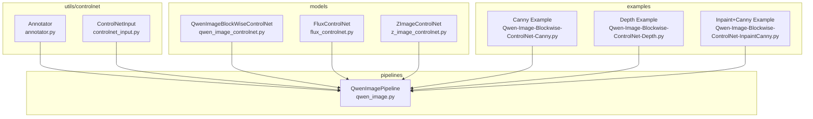
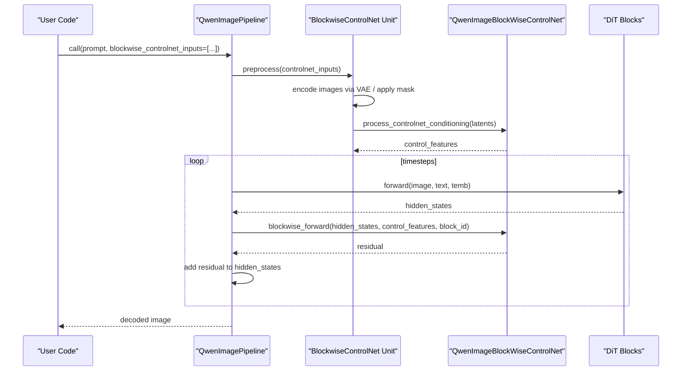
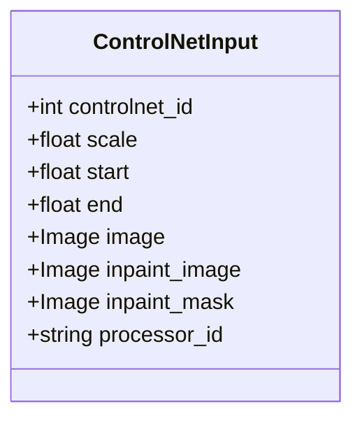
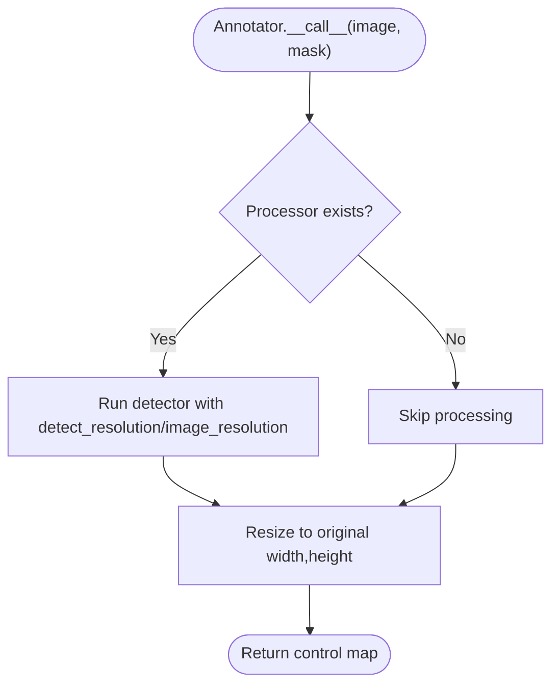
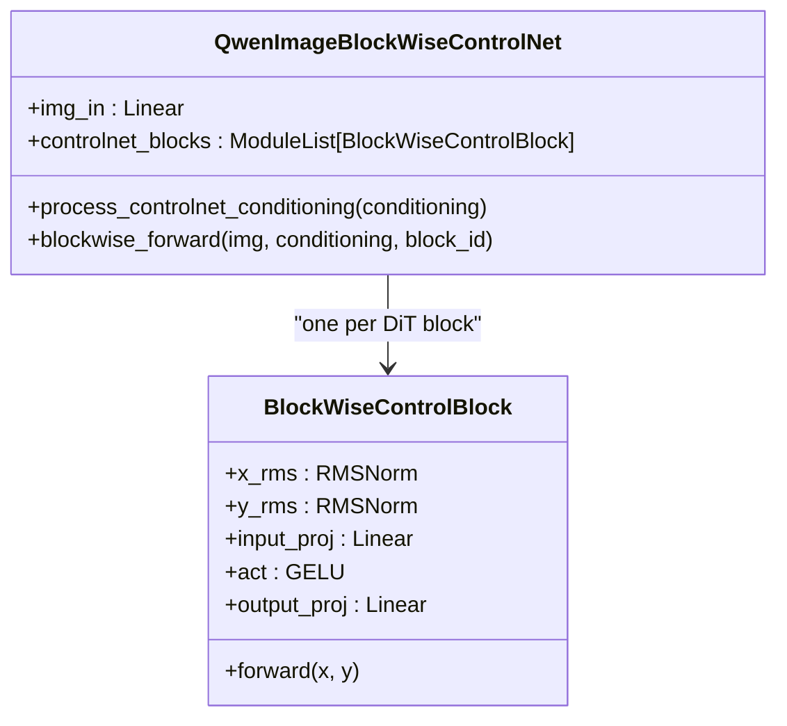
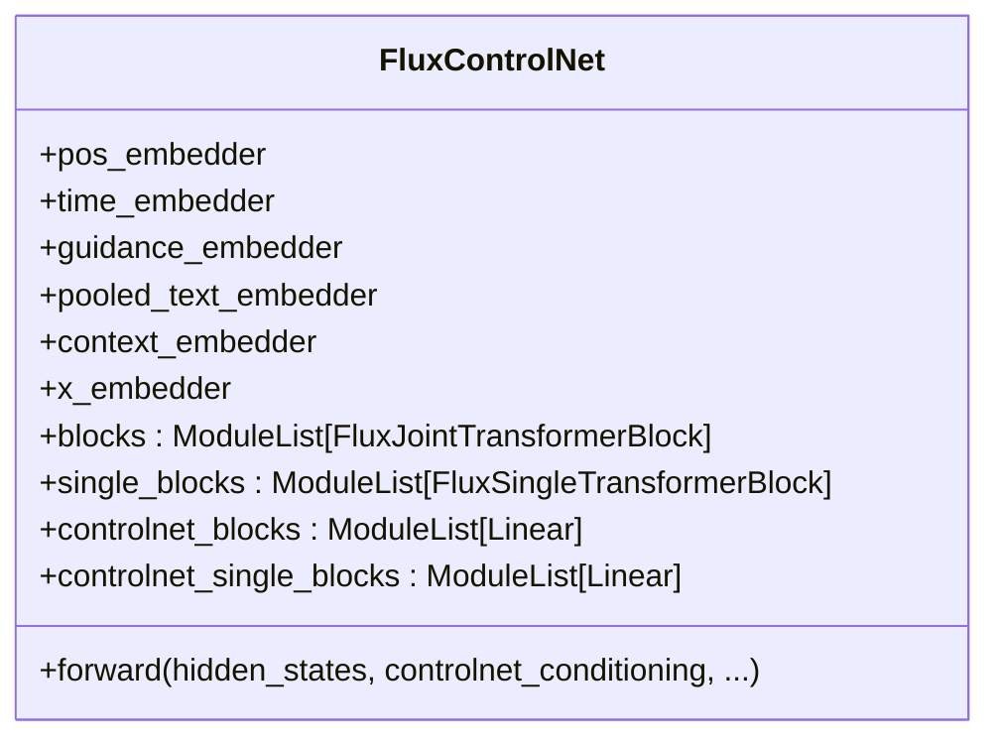
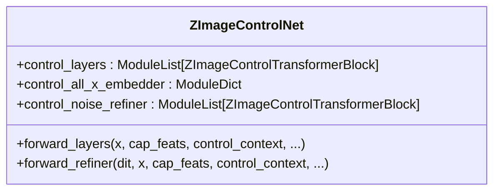
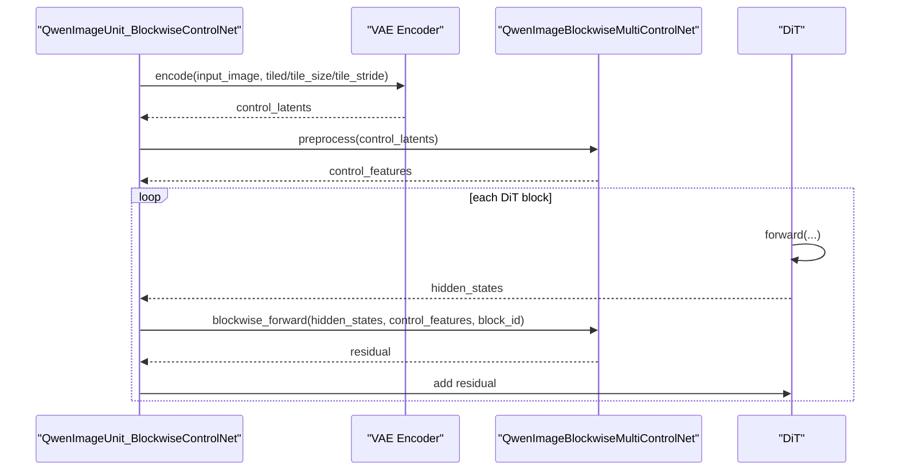
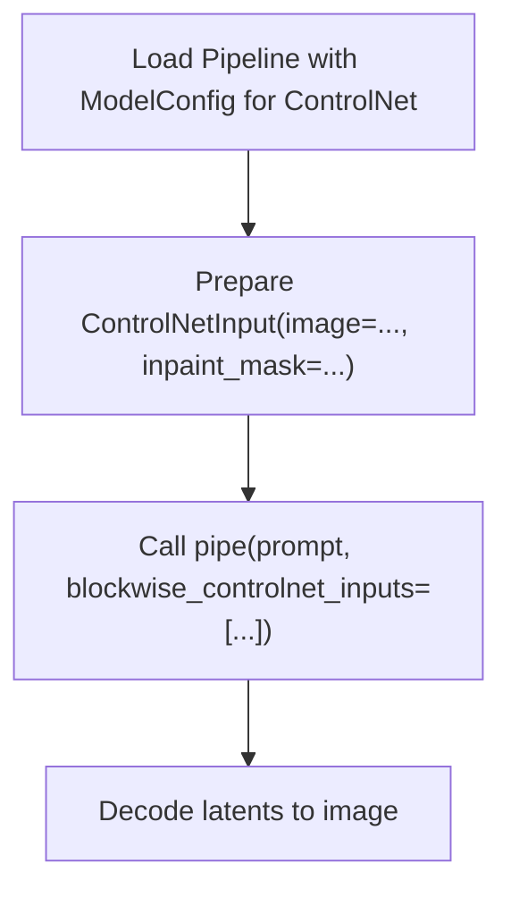
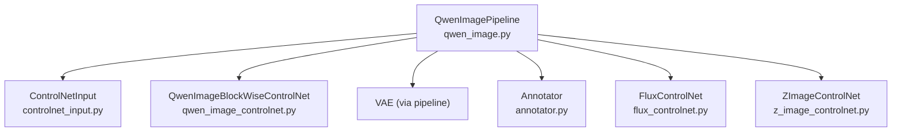

# ControlNet Integration

<cite>
**Referenced Files in This Document**
- [annotator.py](file://diffsynth/utils/controlnet/annotator.py)
- [controlnet_input.py](file://diffsynth/utils/controlnet/controlnet_input.py)
- [qwen_image_controlnet.py](file://diffsynth/models/qwen_image_controlnet.py)
- [flux_controlnet.py](file://diffsynth/models/flux_controlnet.py)
- [z_image_controlnet.py](file://diffsynth/models/z_image_controlnet.py)
- [qwen_image.py](file://diffsynth/pipelines/qwen_image.py)
- [base_pipeline.py](file://diffsynth/diffusion/base_pipeline.py)
- [Qwen-Image-Blockwise-ControlNet-Canny.py](file://examples/qwen_image/model_inference/Qwen-Image-Blockwise-ControlNet-Canny.py)
- [Qwen-Image-Blockwise-ControlNet-Depth.py](file://examples/qwen_image/model_inference/Qwen-Image-Blockwise-ControlNet-Depth.py)
- [Qwen-Image-Blockwise-ControlNet-InpaintCanny.py](file://examples/qwen_image/model_inference/Qwen-Image-Blockwise-ControlNet-InpaintCanny.py)
</cite>

## Table of Contents
1. Introduction
2. Project Structure
3. Core Components
4. Architecture Overview
5. Detailed Component Analysis
6. Dependency Analysis
7. Performance Considerations
8. Troubleshooting Guide
9. Conclusion

## Introduction
This document explains how ControlNet is integrated into ODTSR-edit to enable conditional generation across multiple modalities. It covers the ControlNet architecture variants, the annotator system for generating control signals (e.g., depth, canny), the ControlNetInput data structure used to pass conditioning inputs, and how pipelines consume these signals during inference. It also provides guidance on using built-in ControlNet variants and implementing custom modules, along with performance and memory optimization strategies.

## Project Structure
ControlNet-related code is organized under:
- utils/controlnet: Annotators and input dataclass
- models: ControlNet implementations per model family (Qwen-Image, FLUX, Z-Image)
- pipelines: Pipeline units that integrate blockwise ControlNet into the diffusion loop
- examples: Ready-to-run scripts demonstrating ControlNet usage

**Diagram sources**
- [annotator.py:1-64](file://diffsynth/utils/controlnet/annotator.py#L1-L64)
- [controlnet_input.py:1-15](file://diffsynth/utils/controlnet/controlnet_input.py#L1-L15)
- [qwen_image_controlnet.py:1-57](file://diffsynth/models/qwen_image_controlnet.py#L1-L57)
- [flux_controlnet.py:1-385](file://diffsynth/models/flux_controlnet.py#L1-L385)
- [z_image_controlnet.py:1-154](file://diffsynth/models/z_image_controlnet.py#L1-L154)
- [qwen_image.py:1-200](file://diffsynth/pipelines/qwen_image.py#L1-L200)
- [Qwen-Image-Blockwise-ControlNet-Canny.py:1-32](file://examples/qwen_image/model_inference/Qwen-Image-Blockwise-ControlNet-Canny.py#L1-L32)
- [Qwen-Image-Blockwise-ControlNet-Depth.py:1-33](file://examples/qwen_image/model_inference/Qwen-Image-Blockwise-ControlNet-Depth.py#L1-L33)
- [Qwen-Image-Blockwise-ControlNet-InpaintCanny.py:27-49](file://examples/qwen_image/model_inference/Qwen-Image-Blockwise-ControlNet-InpaintCanny.py#L27-L49)

**Section sources**
- [annotator.py:1-64](file://diffsynth/utils/controlnet/annotator.py#L1-L64)
- [controlnet_input.py:1-15](file://diffsynth/utils/controlnet/controlnet_input.py#L1-L15)
- [qwen_image_controlnet.py:1-57](file://diffsynth/models/qwen_image_controlnet.py#L1-L57)
- [flux_controlnet.py:1-385](file://diffsynth/models/flux_controlnet.py#L1-L385)
- [z_image_controlnet.py:1-154](file://diffsynth/models/z_image_controlnet.py#L1-L154)
- [qwen_image.py:1-200](file://diffsynth/pipelines/qwen_image.py#L1-L200)

## Core Components
- ControlNetInput: A lightweight dataclass carrying all conditioning parameters for a single ControlNet branch, including image tensors, optional inpaint masks, scaling, and temporal scheduling.
- Annotator: A unified interface to generate control signals from images using various detectors (canny, depth, softedge, lineart, openpose, normal, tile, none, inpaint).
- QwenImageBlockWiseControlNet: A blockwise ControlNet that injects conditioning at each transformer block via small residual networks.
- FluxControlNet: A joint/single-block ControlNet producing residual stacks aligned to the DiT blocks.
- ZImageControlNet: A ControlNet tailored for Z-Image DiTs with patchified control context and refinement layers.

Key responsibilities:
- ControlNetInput encapsulates per-branch configuration and raw conditioning images/masks.
- Annotator converts raw images into modality-specific control maps.
- ControlNet models transform control maps into residuals or hints injected into the main DiT at specific points.
- Pipelines orchestrate preprocessing, encoding, and injection during denoising steps.

**Section sources**
- [controlnet_input.py:1-15](file://diffsynth/utils/controlnet/controlnet_input.py#L1-L15)
- [annotator.py:1-64](file://diffsynth/utils/controlnet/annotator.py#L1-L64)
- [qwen_image_controlnet.py:1-57](file://diffsynth/models/qwen_image_controlnet.py#L1-L57)
- [flux_controlnet.py:1-385](file://diffsynth/models/flux_controlnet.py#L1-L385)
- [z_image_controlnet.py:1-154](file://diffsynth/models/z_image_controlnet.py#L1-L154)

## Architecture Overview
The ControlNet integration follows a modular pipeline design:
- Conditioning preparation: ControlNetInput objects are processed by VAE encoders and/or annotators to produce control latents or maps.
- Injection strategy:
  - Qwen-Image uses blockwise ControlNet to add residuals at each transformer block.
  - FLUX ControlNet produces aligned residual stacks for joint and single blocks.
  - Z-Image ControlNet refines patchified control sequences and emits hints.
- Denoising loop: At each timestep, the DiT forward pass receives text/image embeddings and ControlNet outputs, which are summed into intermediate features.

**Diagram sources**
- [qwen_image.py:523-560](file://diffsynth/pipelines/qwen_image.py#L523-L560)
- [qwen_image.py:1121-1150](file://diffsynth/pipelines/qwen_image.py#L1121-L1150)
- [qwen_image_controlnet.py:29-57](file://diffsynth/models/qwen_image_controlnet.py#L29-L57)

**Section sources**
- [qwen_image.py:523-560](file://diffsynth/pipelines/qwen_image.py#L523-L560)
- [qwen_image.py:1121-1150](file://diffsynth/pipelines/qwen_image.py#L1121-L1150)
- [qwen_image_controlnet.py:29-57](file://diffsynth/models/qwen_image_controlnet.py#L29-L57)

## Detailed Component Analysis

### ControlNetInput Dataclass
Purpose:
- Encapsulates per-control-branch settings: id, scale, start/end scheduling, image, optional inpaint image and mask, and processor selection.

Usage:
- Passed through pipeline units to compute control latents and feed ControlNet models.

**Diagram sources**
- [controlnet_input.py:1-15](file://diffsynth/utils/controlnet/controlnet_input.py#L1-L15)

**Section sources**
- [controlnet_input.py:1-15](file://diffsynth/utils/controlnet/controlnet_input.py#L1-L15)

### Annotator System
Capabilities:
- Supports processors: canny, depth, softedge, lineart, lineart_anime, openpose, normal, tile, none, inpaint.
- Dynamically loads controlnet-aux detectors and resizes outputs to match input resolution.
- Optional device placement and skip-processor mode for precomputed controls.

Processing flow:
- Initialize selected detector based on processor_id.
- Run detection with configurable detect_resolution and image_resolution.
- Resize output back to original size.

**Diagram sources**
- [annotator.py:10-62](file://diffsynth/utils/controlnet/annotator.py#L10-L62)

**Section sources**
- [annotator.py:1-64](file://diffsynth/utils/controlnet/annotator.py#L1-L64)

### Qwen-Image Blockwise ControlNet
Architecture:
- Input projection from latent channels to model dimension.
- One lightweight control block per DiT layer, adding a residual conditioned on control features.

Integration:
- Preprocess stage encodes images via VAE and optionally applies inpaint masks.
- During DiT forward, each block calls blockwise_forward to compute and add residuals.

**Diagram sources**
- [qwen_image_controlnet.py:6-57](file://diffsynth/models/qwen_image_controlnet.py#L6-L57)

**Section sources**
- [qwen_image_controlnet.py:1-57](file://diffsynth/models/qwen_image_controlnet.py#L1-L57)
- [qwen_image.py:523-560](file://diffsynth/pipelines/qwen_image.py#L523-L560)
- [qwen_image.py:1121-1150](file://diffsynth/pipelines/qwen_image.py#L1121-L1150)

### FLUX ControlNet
Architecture:
- Joint and single transformer blocks with corresponding linear adapters to produce residual stacks.
- Optional mode embedding to distinguish processor types.
- Residual alignment to original DiT block counts.

Forward highlights:
- Embeddings for time, pooled text, guidance, and context.
- Patchify control condition and fuse with x_embedder.
- Emit aligned controlnet_res_stack and controlnet_single_res_stack.

**Diagram sources**
- [flux_controlnet.py:61-156](file://diffsynth/models/flux_controlnet.py#L61-L156)

**Section sources**
- [flux_controlnet.py:1-385](file://diffsynth/models/flux_controlnet.py#L1-L385)

### Z-Image ControlNet
Architecture:
- Control transformer blocks collect skip connections and produce hints.
- Refiner path patchifies control context, embeds, and refines via additional transformer blocks.

Forward highlights:
- Unified control context concatenation and padding.
- Positional embeddings and attention masking for variable-length sequences.
- Returns hints and refined control context for injection.

**Diagram sources**
- [z_image_controlnet.py:8-154](file://diffsynth/models/z_image_controlnet.py#L8-L154)

**Section sources**
- [z_image_controlnet.py:1-154](file://diffsynth/models/z_image_controlnet.py#L1-L154)

### Pipeline Integration (Qwen-Image)
Key elements:
- QwenImageBlockwiseMultiControlNet manages multiple ControlNet branches and preprocesses control latents.
- QwenImageUnit_BlockwiseControlNet handles VAE encoding, mask application, and passes control features to DiT.
- The model_fn integrates ControlNet residuals into DiT hidden states at each block.

**Diagram sources**
- [qwen_image.py:523-560](file://diffsynth/pipelines/qwen_image.py#L523-L560)
- [qwen_image.py:1121-1150](file://diffsynth/pipelines/qwen_image.py#L1121-L1150)

**Section sources**
- [qwen_image.py:1-200](file://diffsynth/pipelines/qwen_image.py#L1-L200)
- [qwen_image.py:523-560](file://diffsynth/pipelines/qwen_image.py#L523-L560)
- [qwen_image.py:1121-1150](file://diffsynth/pipelines/qwen_image.py#L1121-L1150)

### Using Built-in ControlNet Variants
Examples demonstrate loading pretrained ControlNet weights and passing ControlNetInput instances:
- Canny control: load Qwen-Image-Blockwise-ControlNet-Canny and provide a canny image.
- Depth control: load Qwen-Image-Blockwise-ControlNet-Depth and provide a depth map.
- Inpaint+Canny: combine inpaint mask and canny control in one call.

**Diagram sources**
- [Qwen-Image-Blockwise-ControlNet-Canny.py:1-32](file://examples/qwen_image/model_inference/Qwen-Image-Blockwise-ControlNet-Canny.py#L1-L32)
- [Qwen-Image-Blockwise-ControlNet-Depth.py:1-33](file://examples/qwen_image/model_inference/Qwen-Image-Blockwise-ControlNet-Depth.py#L1-L33)
- [Qwen-Image-Blockwise-ControlNet-InpaintCanny.py:27-49](file://examples/qwen_image/model_inference/Qwen-Image-Blockwise-ControlNet-InpaintCanny.py#L27-L49)

**Section sources**
- [Qwen-Image-Blockwise-ControlNet-Canny.py:1-32](file://examples/qwen_image/model_inference/Qwen-Image-Blockwise-ControlNet-Canny.py#L1-L32)
- [Qwen-Image-Blockwise-ControlNet-Depth.py:1-33](file://examples/qwen_image/model_inference/Qwen-Image-Blockwise-ControlNet-Depth.py#L1-L33)
- [Qwen-Image-Blockwise-ControlNet-InpaintCanny.py:27-49](file://examples/qwen_image/model_inference/Qwen-Image-Blockwise-ControlNet-InpaintCanny.py#L27-L49)

### Implementing Custom ControlNet Modules
Steps:
- Define a module similar to QwenImageBlockWiseControlNet with an input projection and per-block residual function.
- Expose process_controlnet_conditioning and blockwise_forward methods expected by the pipeline’s multi-control wrapper.
- Ensure shapes align with DiT hidden states and control latents produced by VAE encoding.

Guidelines:
- Keep control blocks lightweight to minimize overhead.
- Use zero-initialization for output projections to stabilize training/inference.
- Support optional additional input dimensions if combining multiple conditions.

**Section sources**
- [qwen_image_controlnet.py:1-57](file://diffsynth/models/qwen_image_controlnet.py#L1-L57)

## Dependency Analysis
High-level dependencies:
- Pipeline depends on ControlNetInput and ControlNet models.
- Qwen-Image pipeline orchestrates VAE encoding and blockwise ControlNet injection.
- Annotator depends on controlnet-aux detectors for generating control maps.

**Diagram sources**
- [qwen_image.py:1-200](file://diffsynth/pipelines/qwen_image.py#L1-L200)
- [controlnet_input.py:1-15](file://diffsynth/utils/controlnet/controlnet_input.py#L1-L15)
- [qwen_image_controlnet.py:1-57](file://diffsynth/models/qwen_image_controlnet.py#L1-L57)
- [annotator.py:1-64](file://diffsynth/utils/controlnet/annotator.py#L1-L64)
- [flux_controlnet.py:1-385](file://diffsynth/models/flux_controlnet.py#L1-L385)
- [z_image_controlnet.py:1-154](file://diffsynth/models/z_image_controlnet.py#L1-L154)

**Section sources**
- [qwen_image.py:1-200](file://diffsynth/pipelines/qwen_image.py#L1-L200)
- [controlnet_input.py:1-15](file://diffsynth/utils/controlnet/controlnet_input.py#L1-L15)
- [qwen_image_controlnet.py:1-57](file://diffsynth/models/qwen_image_controlnet.py#L1-L57)
- [annotator.py:1-64](file://diffsynth/utils/controlnet/annotator.py#L1-L64)
- [flux_controlnet.py:1-385](file://diffsynth/models/flux_controlnet.py#L1-L385)
- [z_image_controlnet.py:1-154](file://diffsynth/models/z_image_controlnet.py#L1-L154)

## Performance Considerations
- Tiled VAE encoding: Use tiled=True with tile_size and tile_stride to reduce peak VRAM when encoding large images.
- Gradient checkpointing: Enabled in ControlNet forward paths to trade compute for memory.
- Quantization support: FluxControlNet includes a quantize method replacing Linear/RMSNorm/Embedding with quantized counterparts.
- VRAM management: BasePipeline supports enabling vram_management_enabled to offload/onload models dynamically; ControlNet wrappers propagate this flag.

Recommendations:
- Prefer tiled encoding for high-resolution inputs.
- Enable gradient checkpointing for long sequences or many ControlNet branches.
- Use quantization for Flux ControlNet when memory is constrained.
- Leverage VRAM management flags to cycle models between CPU and GPU.

**Section sources**
- [qwen_image.py:523-560](file://diffsynth/pipelines/qwen_image.py#L523-L560)
- [flux_controlnet.py:162-262](file://diffsynth/models/flux_controlnet.py#L162-L262)
- [base_pipeline.py:157-180](file://diffsynth/diffusion/base_pipeline.py#L157-L180)

## Troubleshooting Guide
Common issues and resolutions:
- Unsupported processor_id: Ensure processor_id is one of the supported values; otherwise, Annotator raises an error.
- Shape mismatches: Verify that ControlNetInput images are resized to target dimensions and that VAE encoding matches DiT expectations.
- Mask handling: For inpaint tasks, ensure masks are correctly applied to images before encoding and that mask channels align with expectations.
- Memory errors: Reduce batch size, enable tiled encoding, or activate VRAM management and gradient checkpointing.

**Section sources**
- [annotator.py:10-36](file://diffsynth/utils/controlnet/annotator.py#L10-L36)
- [qwen_image.py:531-544](file://diffsynth/pipelines/qwen_image.py#L531-L544)
- [base_pipeline.py:157-180](file://diffsynth/diffusion/base_pipeline.py#L157-L180)

## Conclusion
ODTSR-edit’s ControlNet integration provides a flexible, modular framework for conditional generation across multiple modalities. The Annotator system standardizes control signal generation, while ControlNetInput cleanly encapsulates per-branch configuration. Pipeline units seamlessly integrate ControlNet residuals into the DiT forward pass, with options for tiled encoding, gradient checkpointing, quantization, and VRAM management to optimize performance. Users can leverage built-in ControlNet variants or implement custom modules following the established interfaces.