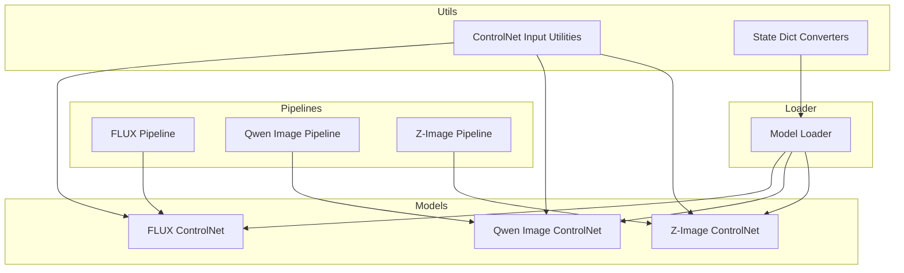
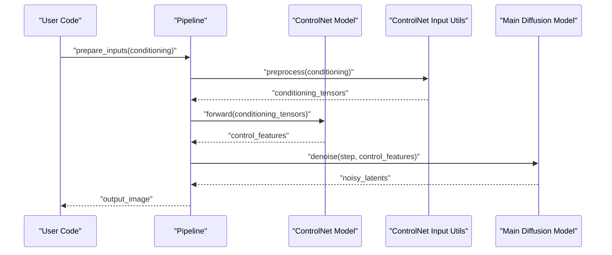
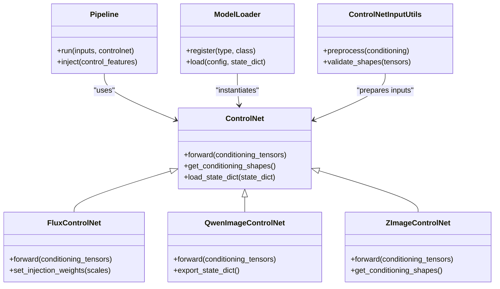

# Custom ControlNet Implementation

<cite>
**Referenced Files in This Document**
- [flux_controlnet.py](file://diffsynth/models/flux_controlnet.py)
- [qwen_image_controlnet.py](file://diffynth/models/qwen_image_controlnet.py)
- [z_image_controlnet.py](file://diffynth/models/z_image_controlnet.py)
- [controlnet_input.py](file://diffynth/utils/controlnet/controlnet_input.py)
- [model_loader.py](file://diffynth/models/model_loader.py)
- [state_dict_converters/flux_controlnet.py](file://diffynth/utils/state_dict_converters/flux_controlnet.py)
- [pipeline_flux_image.py](file://diffynth/pipelines/flux_image.py)
- [pipeline_qwen_image.py](file://diffynth/pipelines/qwen_image.py)
- [pipeline_z_image.py](file://diffynth/pipelines/z_image.py)
</cite>

## Table of Contents
1. [Introduction](#introduction)
2. [Project Structure](#project-structure)
3. [Core Components](#core-components)
4. [Architecture Overview](#architecture-overview)
5. [Detailed Component Analysis](#detailed-component-analysis)
6. [Dependency Analysis](#dependency-analysis)
7. [Performance Considerations](#performance-considerations)
8. [Troubleshooting Guide](#troubleshooting-guide)
9. [Conclusion](#conclusion)
10. [Appendices](#appendices)

## Introduction
This document explains how to implement custom ControlNet modules in ODTSR-edit (DiffSynth). It covers the interface requirements for new ControlNet variants, parameter specifications, integration patterns with model loaders and pipelines, and step-by-step guidance for extending the system with domain-specific conditioning modalities. It also includes optimization strategies and concrete examples adapted from existing implementations.

## Project Structure
ControlNet-related code is organized across:
- Model definitions for ControlNet variants under models/
- Utility helpers for ControlNet input handling under utils/controlnet/
- State dict converters for loading/saving ControlNet weights under utils/state_dict_converters/
- Pipeline integrations that wire ControlNet into inference flows under pipelines/
- A central model loader that discovers and instantiates models based on configuration

**Diagram sources**
- [flux_controlnet.py](file://diffynth/models/flux_controlnet.py)
- [qwen_image_controlnet.py](file://diffynth/models/qwen_image_controlnet.py)
- [z_image_controlnet.py](file://diffynth/models/z_image_controlnet.py)
- [controlnet_input.py](file://diffynth/utils/controlnet/controlnet_input.py)
- [model_loader.py](file://diffynth/models/model_loader.py)
- [state_dict_converters/flux_controlnet.py](file://diffynth/utils/state_dict_converters/flux_controlnet.py)
- [pipeline_flux_image.py](file://diffynth/pipelines/flux_image.py)
- [pipeline_qwen_image.py](file://diffynth/pipelines/qwen_image.py)
- [pipeline_z_image.py](file://diffynth/pipelines/z_image.py)

**Section sources**
- [flux_controlnet.py](file://diffynth/models/flux_controlnet.py)
- [qwen_image_controlnet.py](file://diffynth/models/qwen_image_controlnet.py)
- [z_image_controlnet.py](file://diffynth/models/z_image_controlnet.py)
- [controlnet_input.py](file://diffynth/utils/controlnet/controlnet_input.py)
- [model_loader.py](file://diffynth/models/model_loader.py)
- [state_dict_converters/flux_controlnet.py](file://diffynth/utils/state_dict_converters/flux_controlnet.py)
- [pipeline_flux_image.py](file://diffynth/pipelines/flux_image.py)
- [pipeline_qwen_image.py](file://diffynth/pipelines/qwen_image.py)
- [pipeline_z_image.py](file://diffynth/pipelines/z_image.py)

## Core Components
- ControlNet model classes define the architecture and forward pass that produce conditioning signals injected into the main diffusion transformer or UNet.
- ControlNet input utilities standardize preprocessing of conditioning inputs (e.g., images, masks, depth maps) before feeding them into ControlNet.
- The model loader registers and instantiates ControlNet models based on configuration keys and state dict formats.
- Pipelines integrate ControlNet by passing conditioning tensors through the ControlNet module at appropriate timesteps and layers.

Key responsibilities:
- Interface contract: consistent method signatures for forward passes and optional auxiliary methods (e.g., get_conditioning_shapes).
- Parameter specification: explicit config fields for channels, resolutions, attention heads, and conditioning types.
- Integration points: hooks into pipeline steps where ControlNet outputs are added to intermediate features.

**Section sources**
- [flux_controlnet.py](file://diffynth/models/flux_controlnet.py)
- [qwen_image_controlnet.py](file://diffynth/models/qwen_image_controlnet.py)
- [z_image_controlnet.py](file://diffynth/models/z_image_controlnet.py)
- [controlnet_input.py](file://diffynth/utils/controlnet/controlnet_input.py)
- [model_loader.py](file://diffynth/models/model_loader.py)

## Architecture Overview
The ControlNet system follows a modular design:
- Conditioning inputs are preprocessed via utility functions to match expected shapes and dtypes.
- ControlNet models encode these inputs into feature maps aligned with the backbone’s spatial and channel dimensions.
- At each denoising step, ControlNet outputs are fused with backbone features according to the specific architecture’s injection pattern.
- The model loader resolves ControlNet configurations and loads compatible state dicts.

**Diagram sources**
- [pipeline_flux_image.py](file://diffynth/pipelines/flux_image.py)
- [pipeline_qwen_image.py](file://diffynth/pipelines/qwen_image.py)
- [pipeline_z_image.py](file://diffynth/pipelines/z_image.py)
- [controlnet_input.py](file://diffynth/utils/controlnet/controlnet_input.py)
- [flux_controlnet.py](file://diffynth/models/flux_controlnet.py)
- [qwen_image_controlnet.py](file://diffynth/models/qwen_image_controlnet.py)
- [z_image_controlnet.py](file://diffynth/models/z_image_controlnet.py)

## Detailed Component Analysis

### ControlNet Interface Requirements
To implement a new ControlNet variant, adhere to the following interface contract:
- Constructor parameters:
  - backbone_config: configuration describing the main model architecture (channels, resolutions, attention settings).
  - conditioning_channels: number of input channels for the conditioning modality.
  - resolution_levels: list of spatial scales supported by the ControlNet encoder.
  - dtype/device: precision and device placement.
- Required methods:
  - forward(conditioning_tensors): returns a dictionary or tuple of feature maps aligned with backbone stages.
  - get_conditioning_shapes(): optional helper to validate input tensor shapes and dtypes.
  - load_state_dict(state_dict): optional hook for custom weight loading logic.
- Optional methods:
  - set_injection_weights(scale_factors): allows dynamic scaling of ControlNet contributions per stage.
  - export_state_dict(): serializes model weights in a format compatible with the loader.

Parameter specifications:
- conditioning_tensors must be normalized to [0,1] or [-1,1] depending on the modality; ensure consistency with the preprocessing utilities.
- Spatial dimensions should match the backbone’s latent grid sizes at each level; use resizing or padding if necessary.
- Channel dimensions must align with the ControlNet encoder’s first conv layer; mismatched channels will raise errors during initialization.

Integration patterns:
- In pipelines, call ControlNet.forward at each denoising step and inject outputs into the corresponding backbone layers.
- Use scale factors to balance ControlNet influence; typical values range from 0.0 to 1.0, with higher values increasing conditioning strength.

**Section sources**
- [flux_controlnet.py](file://diffynth/models/flux_controlnet.py)
- [qwen_image_controlnet.py](file://diffynth/models/qwen_image_controlnet.py)
- [z_image_controlnet.py](file://diffynth/models/z_image_controlnet.py)
- [controlnet_input.py](file://diffynth/utils/controlnet/controlnet_input.py)

### Registering Custom ControlNet Models with the Loader
The model loader uses configuration keys to instantiate ControlNet models:
- Configuration schema:
  - type: string identifier for the ControlNet variant (e.g., "flux_controlnet", "qwen_image_controlnet").
  - params: dictionary containing constructor arguments (backbone_config, conditioning_channels, etc.).
- Registration process:
  - Add a new entry in the loader’s registry mapping the type key to the ControlNet class.
  - Ensure the state dict converter supports the new variant’s weight format.
- Loading workflow:
  - The loader reads the configuration, validates parameters, and calls the ControlNet constructor.
  - If a state dict is provided, the loader invokes load_state_dict or applies the appropriate converter.

Best practices:
- Keep configuration keys unique and descriptive.
- Validate all parameters in the constructor to fail fast on misconfigurations.
- Provide default values for optional parameters to simplify usage.

**Section sources**
- [model_loader.py](file://diffynth/models/model_loader.py)
- [state_dict_converters/flux_controlnet.py](file://diffynth/utils/state_dict_converters/flux_controlnet.py)

### Adapting Existing ControlNet Implementations
When adapting an existing ControlNet implementation:
- Identify the target backbone architecture and its injection points.
- Copy the structure of an existing ControlNet class and modify:
  - conditioning_channels to match the new modality.
  - Encoder layers to handle different input resolutions or data types.
  - Injection logic to align with the backbone’s feature map layout.
- Update the pipeline to pass the new conditioning tensors through the ControlNet module.
- Test with sample inputs to verify shape compatibility and output quality.

Example adaptation steps:
- Modify the constructor to accept new parameter types.
- Adjust the forward method to compute features for the new modality.
- Integrate with the pipeline by adding preprocessing steps for the new input type.

**Section sources**
- [flux_controlnet.py](file://diffynth/models/flux_controlnet.py)
- [qwen_image_controlnet.py](file://diffynth/models/qwen_image_controlnet.py)
- [z_image_controlnet.py](file://diffynth/models/z_image_controlnet.py)
- [pipeline_flux_image.py](file://diffynth/pipelines/flux_image.py)
- [pipeline_qwen_image.py](file://diffynth/pipelines/qwen_image.py)
- [pipeline_z_image.py](file://diffynth/pipelines/z_image.py)

### Optimizing Custom ControlNet Modules
Optimization strategies include:
- Memory management:
  - Use gradient checkpointing for large ControlNet encoders.
  - Offload unused layers to CPU during inference to reduce VRAM usage.
- Computation efficiency:
  - Employ mixed precision (FP16/BF16) for faster training and inference.
  - Prune unnecessary branches in the ControlNet encoder.
- Caching and reuse:
  - Cache preprocessed conditioning tensors when possible.
  - Reuse intermediate features across multiple denoising steps if applicable.

Performance monitoring:
- Track memory usage and throughput during training and inference.
- Profile bottlenecks using built-in profiling tools or external libraries.

**Section sources**
- [flux_controlnet.py](file://diffynth/models/flux_controlnet.py)
- [qwen_image_controlnet.py](file://diffynth/models/qwen_image_controlnet.py)
- [z_image_controlnet.py](file://diffynth/models/z_image_controlnet.py)

## Dependency Analysis
ControlNet components depend on:
- Backbone architectures for feature alignment and injection points.
- Input utilities for preprocessing and validation.
- Model loader for instantiation and weight management.
- Pipelines for orchestration and integration.

**Diagram sources**
- [flux_controlnet.py](file://diffynth/models/flux_controlnet.py)
- [qwen_image_controlnet.py](file://diffynth/models/qwen_image_controlnet.py)
- [z_image_controlnet.py](file://diffynth/models/z_image_controlnet.py)
- [controlnet_input.py](file://diffynth/utils/controlnet/controlnet_input.py)
- [model_loader.py](file://diffynth/models/model_loader.py)
- [pipeline_flux_image.py](file://diffynth/pipelines/flux_image.py)
- [pipeline_qwen_image.py](file://diffynth/pipelines/qwen_image.py)
- [pipeline_z_image.py](file://diffynth/pipelines/z_image.py)

**Section sources**
- [flux_controlnet.py](file://diffynth/models/flux_controlnet.py)
- [qwen_image_controlnet.py](file://diffynth/models/qwen_image_controlnet.py)
- [z_image_controlnet.py](file://diffynth/models/z_image_controlnet.py)
- [controlnet_input.py](file://diffynth/utils/controlnet/controlnet_input.py)
- [model_loader.py](file://diffynth/models/model_loader.py)
- [pipeline_flux_image.py](file://diffynth/pipelines/flux_image.py)
- [pipeline_qwen_image.py](file://diffynth/pipelines/qwen_image.py)
- [pipeline_z_image.py](file://diffynth/pipelines/z_image.py)

## Performance Considerations
- Prioritize memory-efficient operations by avoiding unnecessary tensor copies.
- Leverage hardware-specific optimizations (e.g., CUDA kernels) where available.
- Monitor GPU utilization and adjust batch sizes accordingly.
- Use asynchronous data loading to keep the GPU fed during training.

[No sources needed since this section provides general guidance]

## Troubleshooting Guide
Common issues and solutions:
- Shape mismatches:
  - Verify that conditioning tensors match expected dimensions and resolutions.
  - Use validation utilities to catch errors early.
- Weight loading failures:
  - Ensure state dict keys match the model’s parameter names.
  - Apply appropriate converters for different weight formats.
- Poor output quality:
  - Adjust ControlNet scale factors to balance conditioning strength.
  - Inspect preprocessing steps for incorrect normalization.

Debugging tips:
- Print intermediate tensor shapes and dtypes.
- Visualize conditioning inputs to confirm correctness.
- Use logging to trace execution flow.

**Section sources**
- [controlnet_input.py](file://diffynth/utils/controlnet/controlnet_input.py)
- [state_dict_converters/flux_controlnet.py](file://diffynth/utils/state_dict_converters/flux_controlnet.py)

## Conclusion
Implementing custom ControlNet modules in ODTSR-edit requires adherence to a well-defined interface, careful integration with the model loader and pipelines, and attention to performance optimization. By following the guidelines and examples provided, developers can extend the system with new conditioning modalities and specialized processing pipelines effectively.

[No sources needed since this section summarizes without analyzing specific files]

## Appendices
- Example configurations for common ControlNet variants.
- Checklist for validating new ControlNet implementations.
- References to additional resources and related work.

[No sources needed since this section provides supplementary information]