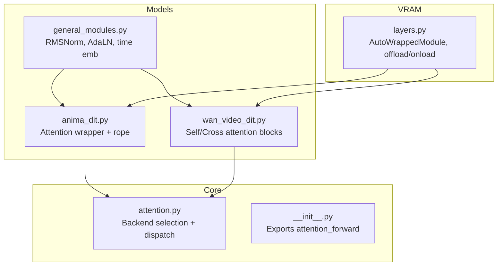
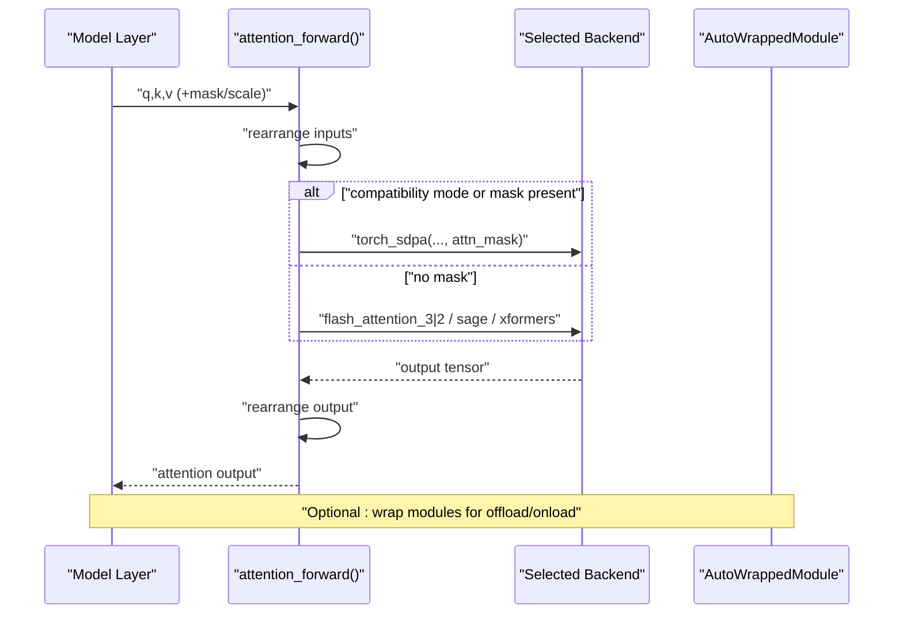
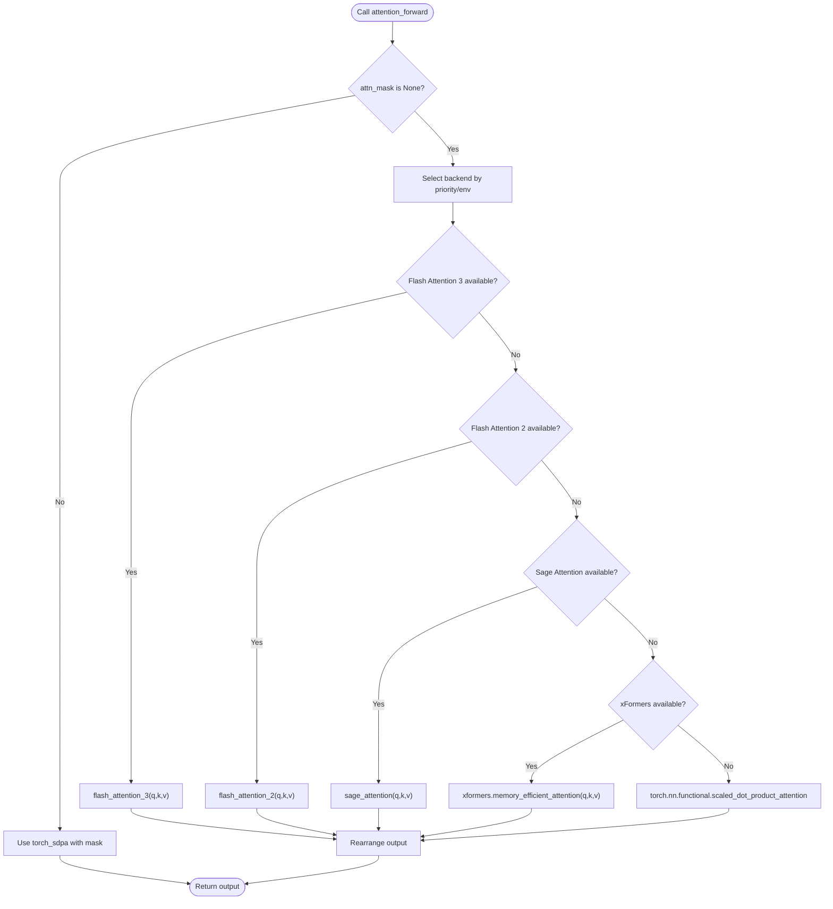
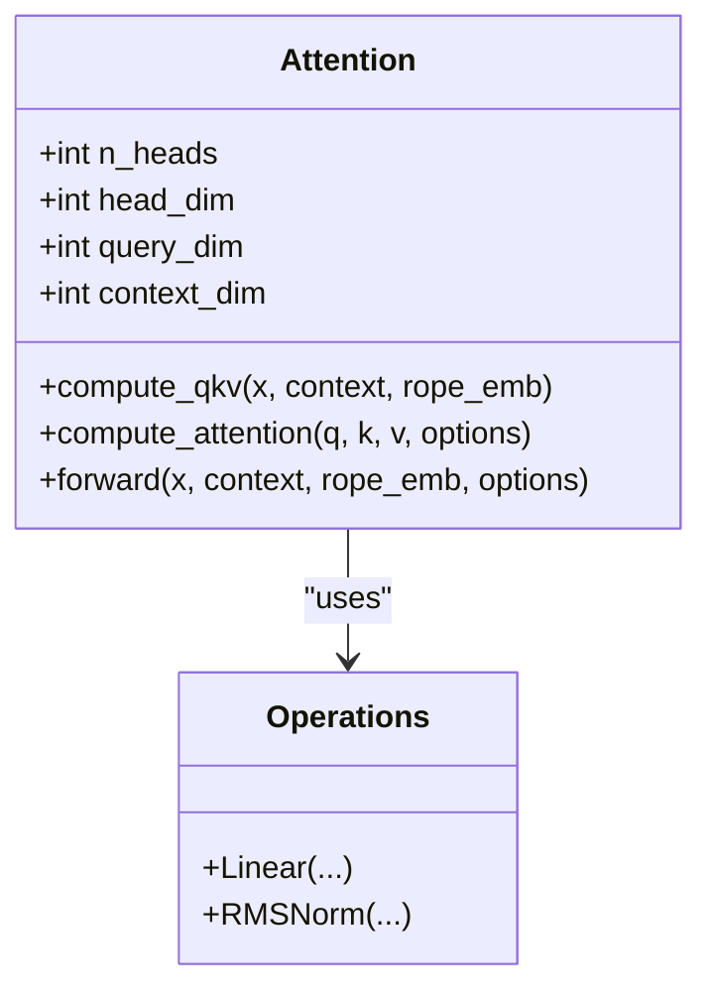
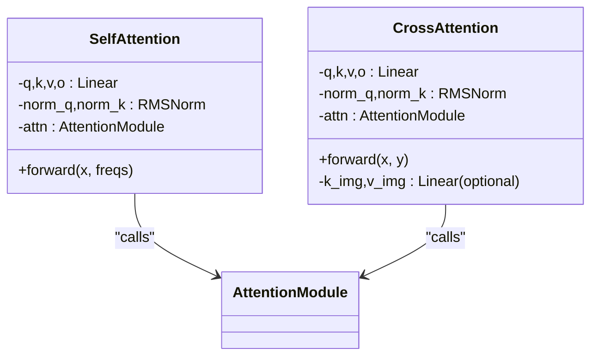
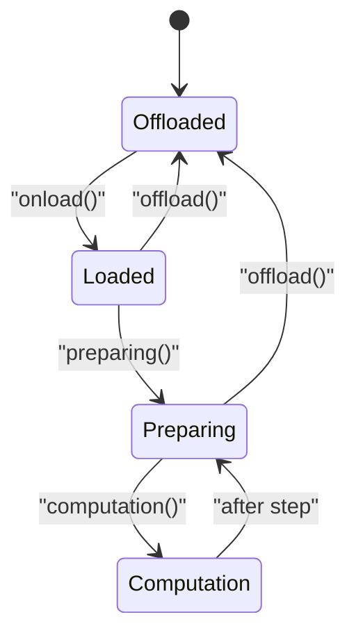
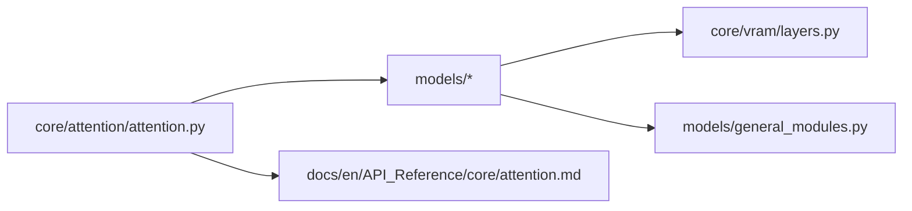

# Attention Mechanisms

<cite>
**Referenced Files in This Document**
- [attention.py](file://diffsynth/core/attention/attention.py)
- [__init__.py](file://diffsynth/core/attention/__init__.py)
- [attention.md](file://docs/en/API_Reference/core/attention.md)
- [Environment_Variables.md](file://docs/en/Pipeline_Usage/Environment_Variables.md)
- [anima_dit.py](file://diffsynth/models/anima_dit.py)
- [wan_video_dit.py](file://diffsynth/models/wan_video_dit.py)
- [general_modules.py](file://diffsynth/models/general_modules.py)
- [layers.py](file://diffsynth/core/vram/layers.py)
</cite>

## Table of Contents
1. [Introduction](#introduction)
2. [Project Structure](#project-structure)
3. [Core Components](#core-components)
4. [Architecture Overview](#architecture-overview)
5. [Detailed Component Analysis](#detailed-component-analysis)
6. [Dependency Analysis](#dependency-analysis)
7. [Performance Considerations](#performance-considerations)
8. [Troubleshooting Guide](#troubleshooting-guide)
9. [Conclusion](#conclusion)
10. [Appendices](#appendices)

## Introduction
This document explains the attention mechanisms implemented in the project, focusing on memory efficiency and performance optimization. It covers:
- The unified attention routing that selects among multiple backends (Flash Attention 3/2, Sage Attention, xFormers, PyTorch SDPA).
- Self-attention and cross-attention patterns used across models.
- Mathematical formulations and algorithmic approaches.
- Configuration and parameter tuning guidance.
- Memory usage patterns and VRAM management strategies.
- How to implement custom attention layers for specific use cases.

The goal is to provide both a conceptual overview and code-level insights so that users can understand, configure, and extend attention efficiently.

## Project Structure
The attention system is centered around a small core module that provides a single entry point for all attention computations. Models integrate this core by calling into it with standardized tensor layouts.

**Diagram sources**
- [attention.py:1-122](file://diffsynth/core/attention/attention.py#L1-L122)
- [__init__.py:1-2](file://diffsynth/core/attention/__init__.py#L1-L2)
- [anima_dit.py:260-385](file://diffsynth/models/anima_dit.py#L260-L385)
- [wan_video_dit.py:139-202](file://diffsynth/models/wan_video_dit.py#L139-L202)
- [general_modules.py:104-147](file://diffsynth/models/general_modules.py#L104-L147)
- [layers.py:88-198](file://diffsynth/core/vram/layers.py#L88-L198)

**Section sources**
- [attention.py:1-122](file://diffsynth/core/attention/attention.py#L1-L122)
- [__init__.py:1-2](file://diffsynth/core/attention/__init__.py#L1-L2)

## Core Components
- Unified attention dispatcher:
  - Selects backend based on environment variable or availability.
  - Supports Flash Attention 3/2, Sage Attention, xFormers, and PyTorch SDPA.
  - Normalizes input/output tensor layouts via einops rearrange utilities.
- Model-side attention wrappers:
  - Anima’s Attention class encapsulates Q/K/V projections, RMSNorm, optional rotary embeddings, and calls the unified backend.
  - Wan’s SelfAttention and CrossAttention modules demonstrate typical transformer blocks using the same backend.
- VRAM-aware wrappers:
  - AutoWrappedModule enables dynamic offloading/onloading and disk mapping to reduce peak memory.

Key responsibilities:
- Backend selection and dispatch: minimize overhead while maximizing speed/memory efficiency.
- Consistent tensor shapes: ensure compatibility across backends.
- Integration with model-specific features: RoPE, masks, and conditioning.

**Section sources**
- [attention.py:30-45](file://diffsynth/core/attention/attention.py#L30-L45)
- [attention.py:48-122](file://diffsynth/core/attention/attention.py#L48-L122)
- [anima_dit.py:260-385](file://diffsynth/models/anima_dit.py#L260-L385)
- [wan_video_dit.py:139-202](file://diffsynth/models/wan_video_dit.py#L139-L202)
- [layers.py:88-198](file://diffsynth/core/vram/layers.py#L88-L198)

## Architecture Overview
The attention architecture follows a layered design:
- Models compute Q, K, V tensors and pass them to the unified attention dispatcher.
- The dispatcher chooses the best available backend and returns outputs in the expected layout.
- Optional masks and scaling are supported where applicable.
- VRAM management wraps modules to control memory footprint dynamically.

**Diagram sources**
- [attention.py:66-122](file://diffsynth/core/attention/attention.py#L66-L122)
- [layers.py:194-198](file://diffsynth/core/vram/layers.py#L194-L198)

## Detailed Component Analysis

### Unified Attention Dispatcher
- Backend priority:
  - Environment variable overrides automatic selection.
  - Priority order: Flash Attention 3 > Flash Attention 2 > Sage Attention > xFormers > PyTorch SDPA.
- Input normalization:
  - Rearranges Q/K/V to required layouts per backend.
  - Supports flexible patterns and dimensions via einops.
- Output normalization:
  - Rearranges outputs back to model expectations.
- Compatibility mode:
  - Falls back to PyTorch SDPA when masks are provided or compatibility mode is enabled.

**Diagram sources**
- [attention.py:30-45](file://diffsynth/core/attention/attention.py#L30-L45)
- [attention.py:66-122](file://diffsynth/core/attention/attention.py#L66-L122)

**Section sources**
- [attention.py:30-45](file://diffsynth/core/attention/attention.py#L30-L45)
- [attention.py:48-122](file://diffsynth/core/attention/attention.py#L48-L122)

### Anima Attention Wrapper
- Responsibilities:
  - Projects inputs to Q/K/V with linear layers.
  - Applies RMSNorm to Q/K (and optionally V).
  - Optionally applies rotary positional embeddings to Q/K in self-attention.
  - Calls the unified backend through an operation interface.
- Flexibility:
  - Supports both self-attention and cross-attention modes.
  - Configurable number of heads and head dimension.

**Diagram sources**
- [anima_dit.py:260-385](file://diffsynth/models/anima_dit.py#L260-L385)

**Section sources**
- [anima_dit.py:260-385](file://diffsynth/models/anima_dit.py#L260-L385)

### Wan Video DiT Attention Blocks
- SelfAttention:
  - Computes Q/K/V from input x.
  - Applies RMSNorm to Q/K and rotary embeddings before attention.
- CrossAttention:
  - Computes Q from x and K/V from context y.
  - Optional image branch merges additional signals.
- Both use the unified backend via an internal AttentionModule.

**Diagram sources**
- [wan_video_dit.py:139-202](file://diffsynth/models/wan_video_dit.py#L139-L202)

**Section sources**
- [wan_video_dit.py:139-202](file://diffsynth/models/wan_video_dit.py#L139-L202)

### VRAM Management Wrappers
- AutoWrappedModule:
  - Tracks states: offloaded, loaded, preparing, computation.
  - Supports dtype/device casting and optional disk offloading.
  - Provides methods to manage memory dynamically during forward passes.
- enable_vram_management:
  - Recursively wraps target modules according to a mapping.
  - Sets flags to indicate VRAM management is active.

**Diagram sources**
- [layers.py:88-198](file://diffsynth/core/vram/layers.py#L88-L198)
- [layers.py:439-479](file://diffsynth/core/vram/layers.py#L439-L479)

**Section sources**
- [layers.py:88-198](file://diffsynth/core/vram/layers.py#L88-L198)
- [layers.py:439-479](file://diffsynth/core/vram/layers.py#L439-L479)

## Dependency Analysis
- Core attention depends on:
  - einops for tensor rearrangement.
  - Optional third-party libraries for accelerated backends.
- Models depend on:
  - Core attention via exported function.
  - General modules for normalization and time embeddings.
- VRAM management is orthogonal and can wrap any module.

**Diagram sources**
- [attention.py:1-122](file://diffsynth/core/attention/attention.py#L1-L122)
- [attention.md:1-79](file://docs/en/API_Reference/core/attention.md#L1-L79)
- [layers.py:88-198](file://diffsynth/core/vram/layers.py#L88-L198)
- [general_modules.py:104-147](file://diffsynth/models/general_modules.py#L104-L147)

**Section sources**
- [attention.py:1-122](file://diffsynth/core/attention/attention.py#L1-L122)
- [attention.md:1-79](file://docs/en/API_Reference/core/attention.md#L1-L79)

## Performance Considerations
- Backend selection:
  - Prefer Flash Attention 3/2 when available; otherwise Sage/xFormers; fallback to PyTorch SDPA.
  - Masks force compatibility mode to PyTorch SDPA.
- Complexity:
  - Attention score matrix scales quadratically with sequence length; efficient backends mitigate memory/time costs.
- Precision and errors:
  - Accelerated backends may introduce small numerical differences; acceptable in most cases.
- VRAM management:
  - Use AutoWrappedModule to offload weights to CPU/disk and load only when needed.
  - Configure computation dtype/device to balance speed and memory.

[No sources needed since this section provides general guidance]

## Troubleshooting Guide
- If attention fails due to missing packages:
  - Ensure desired backend is installed or set environment variable to fall back to torch.
- If masks cause unexpected behavior:
  - Masks trigger compatibility mode; verify mask shapes and devices.
- If memory runs out:
  - Enable VRAM management wrapping for attention-related modules.
  - Reduce batch size or sequence length; consider lower precision.
- To verify backend selection:
  - Check environment variable DIFFSYNTH_ATTENTION_IMPLEMENTATION.

**Section sources**
- [attention.py:30-45](file://diffsynth/core/attention/attention.py#L30-L45)
- [Environment_Variables.md:29-31](file://docs/en/Pipeline_Usage/Environment_Variables.md#L29-L31)
- [layers.py:439-479](file://diffsynth/core/vram/layers.py#L439-L479)

## Conclusion
The attention system provides a robust, extensible foundation for high-performance transformers:
- A unified dispatcher ensures optimal backend selection and consistent interfaces.
- Model-specific wrappers integrate normalization, positional encodings, and conditioning seamlessly.
- VRAM management enables large-scale training/inference within constrained hardware.
By following the configuration and optimization guidelines here, you can tailor attention behavior to your needs while maintaining stability and efficiency.

[No sources needed since this section summarizes without analyzing specific files]

## Appendices

### Mathematical Formulation
- Standard scaled dot-product attention:
  - Attention(Q,K,V) = Softmax((QK^T)/sqrt(d_k)) V
- Efficient implementations:
  - Flash Attention: tiling and recomputation to reduce memory.
  - Sage/xFormers: optimized kernels for attention.
  - PyTorch SDPA: native fused implementation.

**Section sources**
- [attention.md:5-38](file://docs/en/API_Reference/core/attention.md#L5-L38)

### Configuration and Parameter Tuning
- Environment variable:
  - DIFFSYNTH_ATTENTION_IMPLEMENTATION controls backend selection.
- Model parameters:
  - Number of heads, head dimension, dropout, and normalization choices affect accuracy and speed.
- VRAM settings:
  - Set computation dtype/device; configure vram_limit and disk mapping for large models.

**Section sources**
- [Environment_Variables.md:29-31](file://docs/en/Pipeline_Usage/Environment_Variables.md#L29-L31)
- [anima_dit.py:293-336](file://diffsynth/models/anima_dit.py#L293-L336)
- [layers.py:88-198](file://diffsynth/core/vram/layers.py#L88-L198)

### Implementing Custom Attention Layers
- Steps:
  - Compute Q/K/V with linear projections.
  - Apply normalization (e.g., RMSNorm) and optional positional encoding (e.g., RoPE).
  - Call attention_forward from diffsynth.core.attention with standardized layouts.
  - Rearrange outputs if necessary.
- Tips:
  - Keep tensor shapes consistent with backend requirements.
  - Use masks only when needed to avoid compatibility mode fallback.
  - Wrap modules with AutoWrappedModule for memory efficiency.

**Section sources**
- [attention.py:48-122](file://diffsynth/core/attention/attention.py#L48-L122)
- [anima_dit.py:337-385](file://diffsynth/models/anima_dit.py#L337-L385)
- [layers.py:88-198](file://diffsynth/core/vram/layers.py#L88-L198)