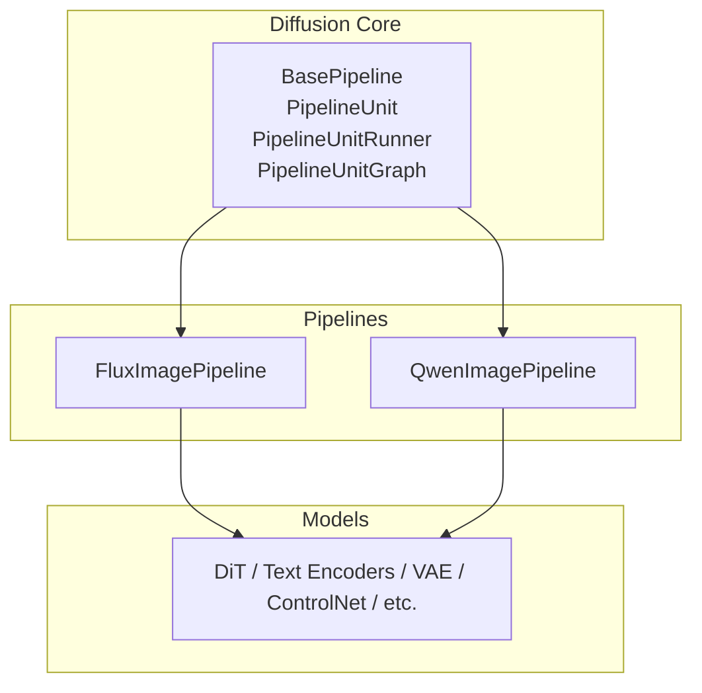
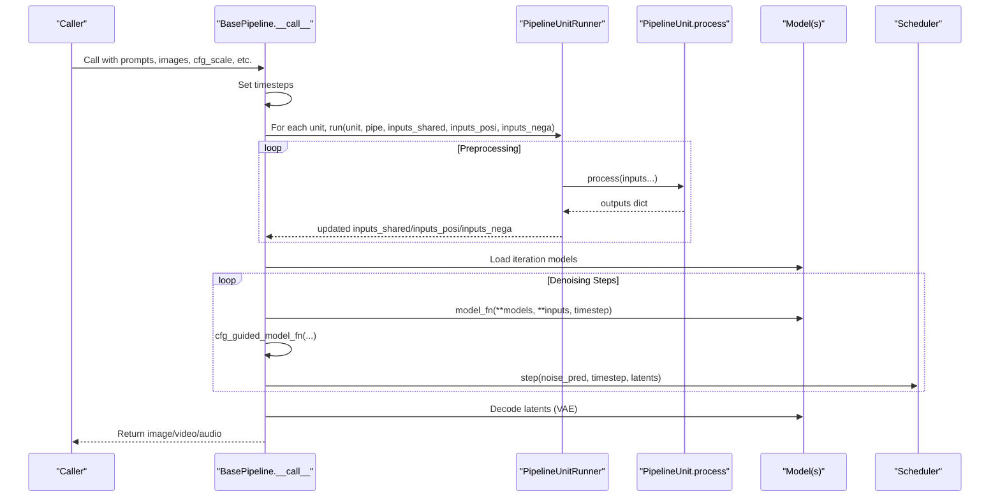
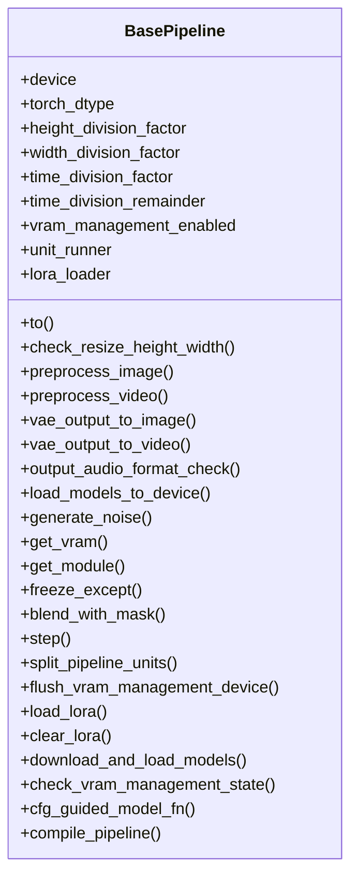
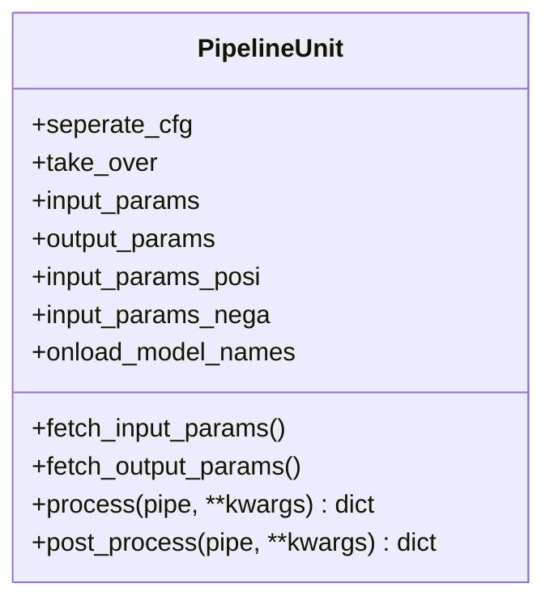
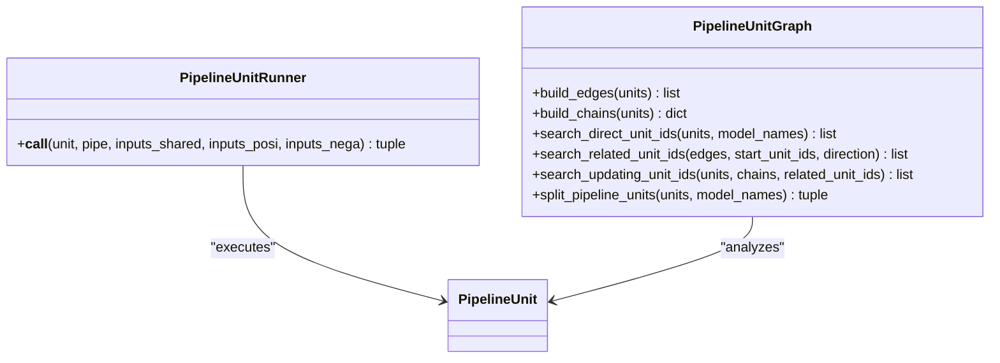
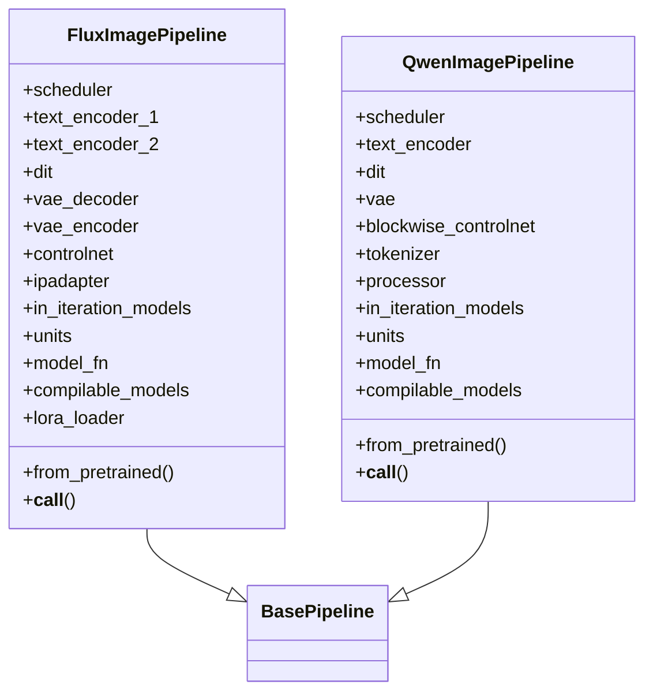
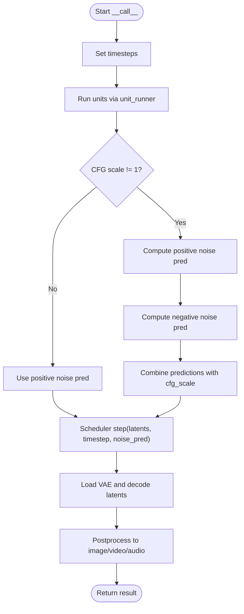
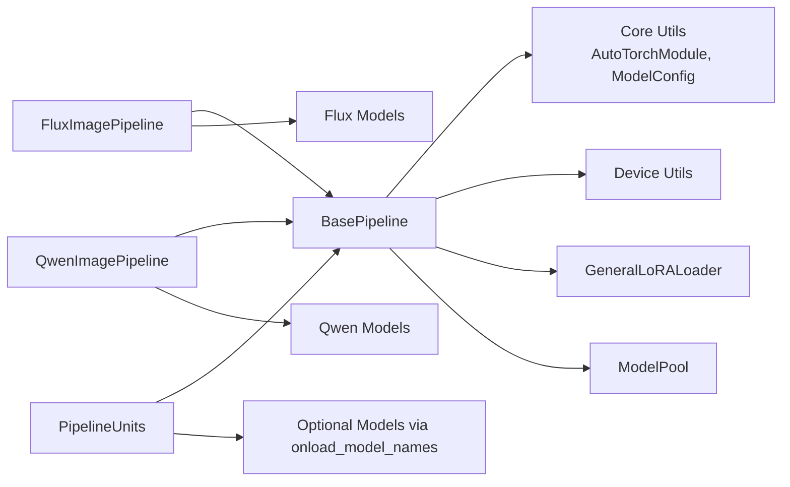

# Base Pipeline Architecture

<cite>
**Referenced Files in This Document**
- [base_pipeline.py](file://diffsynth/diffusion/base_pipeline.py)
- [flux_image.py](file://diffsynth/pipelines/flux_image.py)
- [qwen_image.py](file://diffsynth/pipelines/qwen_image.py)
- [Building_a_Pipeline.md](file://docs/en/Developer_Guide/Building_a_Pipeline.md)
- [Integrating_Your_Model.md](file://docs/en/Developer_Guide/Integrating_Your_Model.md)
</cite>

## Table of Contents
1. [Introduction](#introduction)
2. [Project Structure](#project-structure)
3. [Core Components](#core-components)
4. [Architecture Overview](#architecture-overview)
5. [Detailed Component Analysis](#detailed-component-analysis)
6. [Dependency Analysis](#dependency-analysis)
7. [Performance Considerations](#performance-considerations)
8. [Troubleshooting Guide](#troubleshooting-guide)
9. [Conclusion](#conclusion)
10. [Appendices](#appendices)

## Introduction
This document explains the base pipeline architecture in ODTSR-edit, focusing on the BasePipeline class design pattern and how it provides a unified interface for different model implementations. It details the pipeline unit system for composing and executing processing steps, the template method pattern that defines common workflows while allowing customization, and the relationship between pipelines and their underlying models. Examples cover initialization, configuration, execution flow, and extension points for custom pipeline development and integration with existing components.

## Project Structure
The pipeline framework is centered around:
- A shared base pipeline implementation providing common utilities, VRAM management, LoRA support, compilation helpers, and a unit runner.
- Concrete pipelines implementing model-specific logic, units, and a unified forward function (model_fn).
- Developer guides describing how to build pipelines and integrate models.

**Diagram sources**
- [base_pipeline.py:61-373](file://diffsynth/diffusion/base_pipeline.py#L61-L373)
- [flux_image.py:57-107](file://diffsynth/pipelines/flux_image.py#L57-L107)
- [qwen_image.py:25-61](file://diffsynth/pipelines/qwen_image.py#L25-L61)

**Section sources**
- [base_pipeline.py:61-373](file://diffsynth/diffusion/base_pipeline.py#L61-L373)
- [flux_image.py:57-107](file://diffsynth/pipelines/flux_image.py#L57-L107)
- [qwen_image.py:25-61](file://diffsynth/pipelines/qwen_image.py#L25-L61)
- [Building_a_Pipeline.md:1-250](file://docs/en/Developer_Guide/Building_a_Pipeline.md#L1-L250)

## Core Components
- BasePipeline: The central orchestrator offering device/dtype handling, shape checks, preprocessing, VRAM control, noise generation, CFG guidance wrapper, step update, LoRA loading/clearing, model download/load, torch.compile integration, and more.
- PipelineUnit: Declarative processing step with input/output contracts and three execution modes (direct, CFG-separated, takeover).
- PipelineUnitRunner: Executes units according to their mode and updates shared/positive/negative parameter dictionaries.
- PipelineUnitGraph: Builds dependency edges and chains among units to split computation graphs when needed.

Key responsibilities:
- Unified interface across heterogeneous models via a consistent __call__ workflow.
- Composable preprocessing through PipelineUnit instances.
- Template method pattern: BasePipeline defines the algorithm skeleton; concrete pipelines supply units and model_fn.

**Section sources**
- [base_pipeline.py:14-59](file://diffsynth/diffusion/base_pipeline.py#L14-L59)
- [base_pipeline.py:61-373](file://diffsynth/diffusion/base_pipeline.py#L61-L373)
- [base_pipeline.py:375-467](file://diffsynth/diffusion/base_pipeline.py#L375-L467)
- [base_pipeline.py:470-501](file://diffsynth/diffusion/base_pipeline.py#L470-L501)

## Architecture Overview
The pipeline follows a template method pattern:
- BasePipeline defines the inference loop, CFG handling, scheduler stepping, and decoding.
- Concrete pipelines implement from_pretrained, units, and model_fn.
- Units compose preprocessing into a directed graph driven by declared inputs/outputs.

**Diagram sources**
- [base_pipeline.py:321-341](file://diffsynth/diffusion/base_pipeline.py#L321-L341)
- [base_pipeline.py:470-501](file://diffsynth/diffusion/base_pipeline.py#L470-L501)
- [flux_image.py:240-291](file://diffsynth/pipelines/flux_image.py#L240-L291)
- [qwen_image.py:147-197](file://diffsynth/pipelines/qwen_image.py#L147-L197)

## Detailed Component Analysis

### BasePipeline Class
- Responsibilities:
  - Device/dtype management and shape validation helpers.
  - Image/video/audio preprocessing and postprocessing.
  - VRAM-aware model loading/offloading.
  - Noise generation and scheduler stepping.
  - CFG-guided model invocation wrapper.
  - LoRA hotload/fuse and clear.
  - Model download and load via ModelPool.
  - torch.compile integration for specified models.
- Extension points:
  - Override or extend preprocessors via units.
  - Provide model_fn for denoising step.
  - Configure in_iteration_models for VRAM optimization.
  - Use compile_pipeline for acceleration.

**Diagram sources**
- [base_pipeline.py:61-373](file://diffsynth/diffusion/base_pipeline.py#L61-L373)

**Section sources**
- [base_pipeline.py:61-373](file://diffsynth/diffusion/base_pipeline.py#L61-L373)

### PipelineUnit System
- Three execution modes:
  - Direct mode: Shared inputs only.
  - CFG separation mode: Separate positive/negative processing with mapped inputs.
  - Takeover mode: Full control over inputs_shared, inputs_posi, inputs_nega.
- Input/output contract via input_params, output_params, input_params_posi, input_params_nega.
- Optional onload_model_names to trigger VRAM-aware model loading within a unit.

**Diagram sources**
- [base_pipeline.py:14-59](file://diffsynth/diffusion/base_pipeline.py#L14-L59)

**Section sources**
- [base_pipeline.py:14-59](file://diffsynth/diffusion/base_pipeline.py#L14-L59)

### PipelineUnitRunner and Graph Utilities
- PipelineUnitRunner executes units based on flags and updates parameter dictionaries accordingly.
- PipelineUnitGraph builds edges and chains to identify related units and supports splitting computation graphs for training or advanced features.

**Diagram sources**
- [base_pipeline.py:375-467](file://diffsynth/diffusion/base_pipeline.py#L375-L467)
- [base_pipeline.py:470-501](file://diffsynth/diffusion/base_pipeline.py#L470-L501)

**Section sources**
- [base_pipeline.py:375-467](file://diffsynth/diffusion/base_pipeline.py#L375-L467)
- [base_pipeline.py:470-501](file://diffsynth/diffusion/base_pipeline.py#L470-L501)

### Concrete Pipelines: FluxImagePipeline and QwenImagePipeline
- Both inherit from BasePipeline and implement:
  - __init__: Define scheduler, model attributes, in_iteration_models, units, model_fn, compilable_models, lora_loader.
  - from_pretrained: Download and load models via ModelPool, fetch named models, set VRAM management flag.
  - __call__: Standardized inference loop using unit_runner, cfg_guided_model_fn, scheduler.step, and decode.
- Example units demonstrate shape checking, noise initialization, prompt embedding, controlnet conditioning, IP-Adapter, entity control, and more.

**Diagram sources**
- [flux_image.py:57-107](file://diffsynth/pipelines/flux_image.py#L57-L107)
- [qwen_image.py:25-61](file://diffsynth/pipelines/qwen_image.py#L25-L61)

**Section sources**
- [flux_image.py:57-107](file://diffsynth/pipelines/flux_image.py#L57-L107)
- [flux_image.py:240-291](file://diffsynth/pipelines/flux_image.py#L240-L291)
- [qwen_image.py:25-61](file://diffsynth/pipelines/qwen_image.py#L25-L61)
- [qwen_image.py:147-197](file://diffsynth/pipelines/qwen_image.py#L147-L197)

### Template Method Pattern Implementation
- BasePipeline defines the algorithm skeleton:
  - Timestep setup.
  - Unit-driven preprocessing.
  - Iterative denoising with CFG.
  - Decoding and output conversion.
- Concrete pipelines customize behavior by:
  - Providing specific units.
  - Implementing model_fn tailored to model architectures.
  - Declaring in_iteration_models for VRAM efficiency.
  - Optionally enabling compilation and LoRA loaders.

**Diagram sources**
- [base_pipeline.py:321-341](file://diffsynth/diffusion/base_pipeline.py#L321-L341)
- [flux_image.py:240-291](file://diffsynth/pipelines/flux_image.py#L240-L291)
- [qwen_image.py:147-197](file://diffsynth/pipelines/qwen_image.py#L147-L197)

**Section sources**
- [base_pipeline.py:321-341](file://diffsynth/diffusion/base_pipeline.py#L321-L341)
- [flux_image.py:240-291](file://diffsynth/pipelines/flux_image.py#L240-L291)
- [qwen_image.py:147-197](file://diffsynth/pipelines/qwen_image.py#L147-L197)

### Relationship Between Pipelines and Underlying Models
- Pipelines encapsulate model orchestration and expose a stable API.
- Models are loaded via ModelPool and fetched by model_name defined in configs.
- in_iteration_models indicates which modules participate in the iterative loop, enabling targeted VRAM offloading/onloading.
- model_fn bridges pipeline inputs to model forward calls, often integrating multiple components (e.g., ControlNet, IP-Adapter, Step1x connector).

**Section sources**
- [flux_image.py:119-177](file://diffsynth/pipelines/flux_image.py#L119-L177)
- [qwen_image.py:63-97](file://diffsynth/pipelines/qwen_image.py#L63-L97)
- [Integrating_Your_Model.md:105-148](file://docs/en/Developer_Guide/Integrating_Your_Model.md#L105-L148)

### Extension Points for Custom Pipeline Development
- Create a new Pipeline subclass inheriting from BasePipeline.
- Implement:
  - __init__: Initialize scheduler, model attributes, in_iteration_models, units, model_fn, compilable_models, lora_loader.
  - from_pretrained: Use download_and_load_models and fetch_model by model_name.
  - __call__: Follow the standard template (timesteps, units, CFG loop, decode).
- Design PipelineUnit subclasses with appropriate input/output contracts and execution mode.
- Integrate new models following Integrating Your Model guide (define model_class, state_dict_converter, extra_kwargs, and VRAM scheme).

**Section sources**
- [Building_a_Pipeline.md:13-80](file://docs/en/Developer_Guide/Building_a_Pipeline.md#L13-L80)
- [Building_a_Pipeline.md:86-156](file://docs/en/Developer_Guide/Building_a_Pipeline.md#L86-L156)
- [Building_a_Pipeline.md:158-236](file://docs/en/Developer_Guide/Building_a_Pipeline.md#L158-L236)
- [Integrating_Your_Model.md:1-78](file://docs/en/Developer_Guide/Integrating_Your_Model.md#L1-L78)
- [Integrating_Your_Model.md:105-148](file://docs/en/Developer_Guide/Integrating_Your_Model.md#L105-L148)

## Dependency Analysis
- BasePipeline depends on core utilities (AutoTorchModule, AutoWrappedLinear, ModelConfig), device utilities, LoRA loader, and ModelPool.
- Concrete pipelines depend on specific model classes and schedulers.
- Units may depend on models indicated by onload_model_names.

**Diagram sources**
- [base_pipeline.py:1-12](file://diffsynth/diffusion/base_pipeline.py#L1-L12)
- [flux_image.py:1-22](file://diffsynth/pipelines/flux_image.py#L1-L22)
- [qwen_image.py:1-23](file://diffsynth/pipelines/qwen_image.py#L1-L23)

**Section sources**
- [base_pipeline.py:1-12](file://diffsynth/diffusion/base_pipeline.py#L1-L12)
- [flux_image.py:1-22](file://diffsynth/pipelines/flux_image.py#L1-L22)
- [qwen_image.py:1-23](file://diffsynth/pipelines/qwen_image.py#L1-L23)

## Performance Considerations
- VRAM Management:
  - Use load_models_to_device to selectively offload/onload models during preprocessing and decoding.
  - in_iteration_models restricts heavy computations to necessary modules during the denoising loop.
- Compilation:
  - compile_pipeline supports regional compilation for repeated blocks or full-model compilation.
- LoRA:
  - Hotload supported when VRAM management is enabled; otherwise, fuse LoRA into base model.
- Scheduling and Tiling:
  - Scheduler settings and tiled decoding can reduce memory pressure and improve throughput.

[No sources needed since this section provides general guidance]

## Troubleshooting Guide
- CFG Guidance Issues:
  - Ensure cfg_guided_model_fn is used consistently; verify positive_only_lora handling if applicable.
- VRAM Errors:
  - Confirm vram_management_enabled detection via check_vram_management_state.
  - Use load_models_to_device with explicit model names to avoid unnecessary memory usage.
- LoRA Loading:
  - Hotload requires VRAM management; otherwise, use fusing path.
  - Clear LoRA layers with clear_lora when switching configurations.
- Shape Mismatches:
  - Use check_resize_height_width to align dimensions to division factors.
- Model Loading:
  - Verify model_configs and model_name mappings; ensure state_dict converters are correct.

**Section sources**
- [base_pipeline.py:321-341](file://diffsynth/diffusion/base_pipeline.py#L321-L341)
- [base_pipeline.py:242-294](file://diffsynth/diffusion/base_pipeline.py#L242-L294)
- [base_pipeline.py:296-319](file://diffsynth/diffusion/base_pipeline.py#L296-L319)
- [base_pipeline.py:97-114](file://diffsynth/diffusion/base_pipeline.py#L97-L114)

## Conclusion
The BasePipeline architecture in ODTSR-edit establishes a robust, extensible foundation for diverse diffusion-based models. Through a template method pattern, it unifies inference workflows while allowing rich customization via PipelineUnit composition and model_fn specialization. The system’s VRAM-aware design, LoRA support, and compilation options enable efficient deployment across hardware constraints. Developers can extend the framework by adding new pipelines, units, and models following the provided guidelines.

[No sources needed since this section summarizes without analyzing specific files]

## Appendices

### Example: Pipeline Initialization and Execution Flow
- Initialization:
  - Instantiate pipeline with device and dtype.
  - Use from_pretrained to download and load models via ModelPool.
  - Set vram_management_enabled based on model capabilities.
- Execution:
  - Set scheduler timesteps.
  - Populate inputs_shared, inputs_posi, inputs_nega.
  - Run units via unit_runner.
  - Iterate denoising steps with cfg_guided_model_fn and scheduler.step.
  - Decode latents and return results.

**Section sources**
- [Building_a_Pipeline.md:55-80](file://docs/en/Developer_Guide/Building_a_Pipeline.md#L55-L80)
- [Building_a_Pipeline.md:86-156](file://docs/en/Developer_Guide/Building_a_Pipeline.md#L86-L156)
- [flux_image.py:240-291](file://diffsynth/pipelines/flux_image.py#L240-L291)
- [qwen_image.py:147-197](file://diffsynth/pipelines/qwen_image.py#L147-L197)