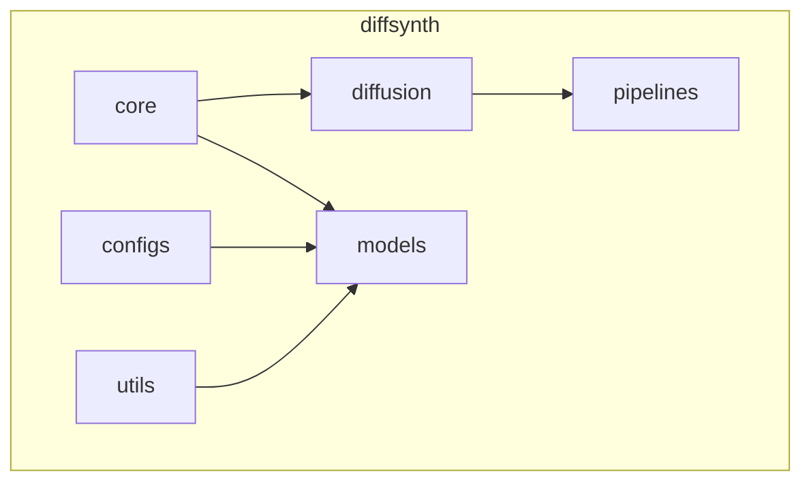
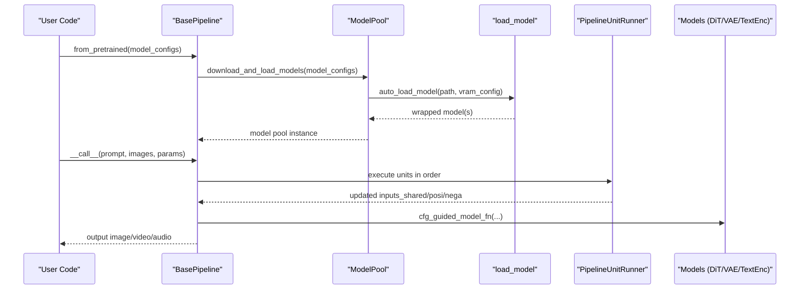
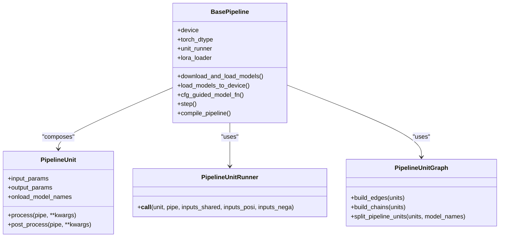
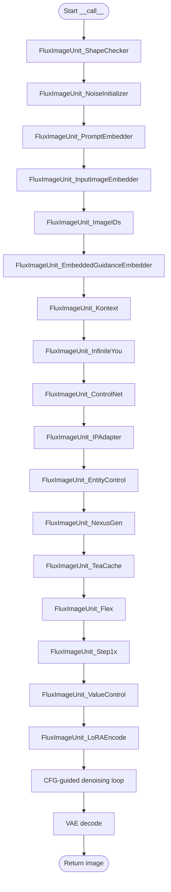
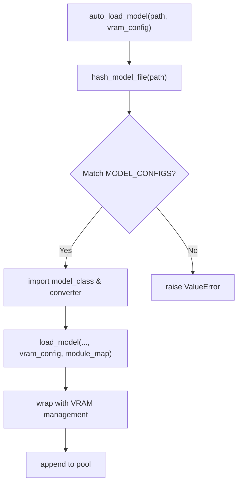
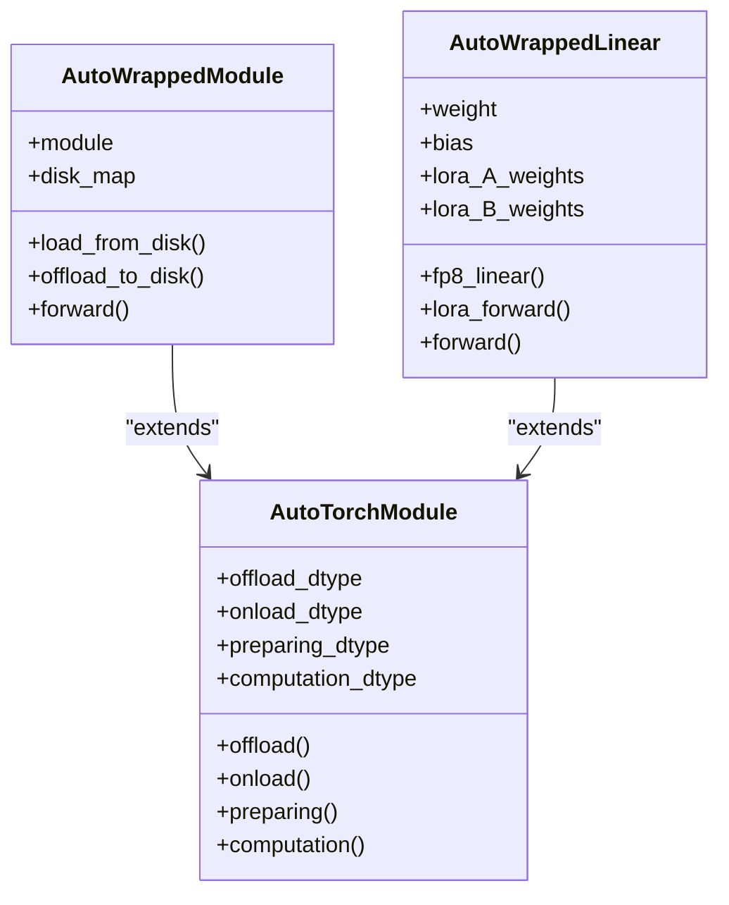
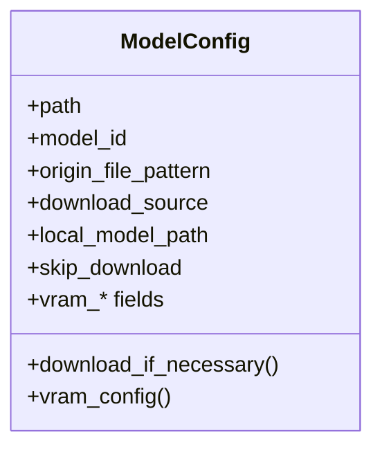
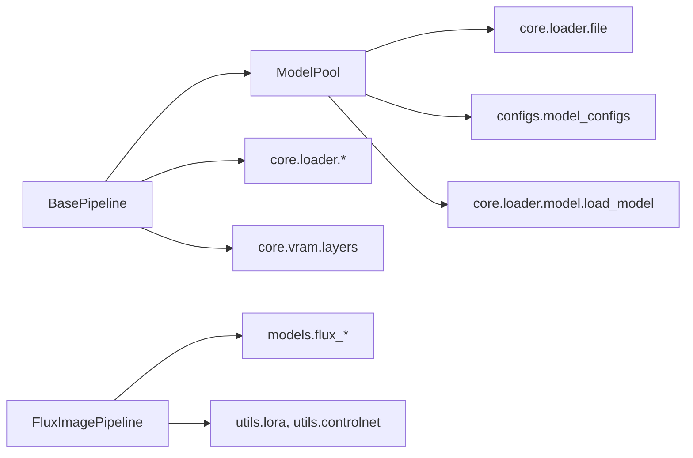
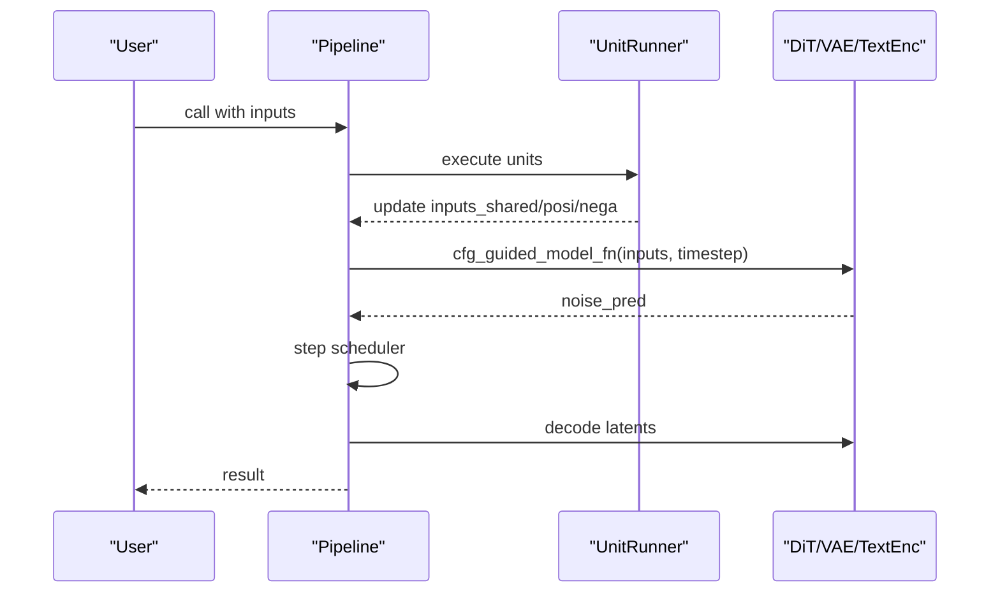

# Core Framework Architecture

<cite>
**Referenced Files in This Document**
- [base_pipeline.py](file://diffsynth/diffusion/base_pipeline.py)
- [model_loader.py](file://diffsynth/models/model_loader.py)
- [model.py](file://diffsynth/core/loader/model.py)
- [config.py](file://diffsynth/core/loader/config.py)
- [file.py](file://diffsynth/core/loader/file.py)
- [layers.py](file://diffsynth/core/vram/layers.py)
- [flux_image.py](file://diffsynth/pipelines/flux_image.py)
- [model_configs.py](file://diffsynth/configs/model_configs.py)
- [__init__.py](file://diffsynth/__init__.py)
</cite>

## Table of Contents
1. [Introduction](#introduction)
2. [Project Structure](#project-structure)
3. [Core Components](#core-components)
4. [Architecture Overview](#architecture-overview)
5. [Detailed Component Analysis](#detailed-component-analysis)
6. [Dependency Analysis](#dependency-analysis)
7. [Performance Considerations](#performance-considerations)
8. [Troubleshooting Guide](#troubleshooting-guide)
9. [Conclusion](#conclusion)
10. [Appendices](#appendices)

## Introduction
This document explains the ODTSR-edit core framework architecture with a focus on design patterns, module organization, and extensibility. It covers:
- Strategy pattern for model implementations
- Factory pattern for automatic model loading via hash-based identification and dynamic imports
- Template method pattern for pipeline workflows
- Base pipeline architecture enabling flexible composition of processing units
- Model loading system with hash-based identification and dynamic module importing
- Component interaction diagrams showing data flows between modules
- Extension points for custom model integration and plugin development

## Project Structure
The repository organizes functionality into clear layers:
- core: foundational utilities (attention, data, device, gradient, loader, vram)
- diffusion: base pipeline, schedulers, training utilities, logging, loss functions
- models: model implementations across multiple families (FLUX, Qwen, Wan, LTX-2, etc.)
- pipelines: concrete pipeline implementations that compose models and units
- configs: model registry and VRAM management maps
- utils: LoRA loaders, controlnet utilities, state dict converters, xFuser helpers

**Section sources**
- [__init__.py](file://diffsynth/__init__.py)

## Core Components
Key abstractions and patterns:
- BasePipeline and PipelineUnit define a template method workflow where each unit processes inputs and produces outputs; the runner orchestrates execution and CFG branching.
- ModelPool implements a factory that identifies models by hashing their state dict keys/shapes and dynamically imports model classes based on configuration.
- load_model orchestrates instantiation, state dict loading, optional disk mapping, and VRAM management wrapping.
- AutoWrappedModule/AutoWrappedLinear provide VRAM-aware wrappers enabling offload/onload/preparing/computation states.

**Section sources**
- [base_pipeline.py](file://diffsynth/diffusion/base_pipeline.py)
- [model_loader.py](file://diffsynth/models/model_loader.py)
- [model.py](file://diffsynth/core/loader/model.py)
- [layers.py](file://diffsynth/core/vram/layers.py)

## Architecture Overview
High-level flow:
- Pipelines declare a sequence of PipelineUnits and a model function.
- download_and_load_models uses ModelPool to auto-load models by matching file hashes against MODEL_CONFIGS.
- Each unit declares input/output parameters and optional model names to be loaded on demand.
- The runner executes units, supports separate positive/negative branches for CFG, and updates shared state.
- During denoising, only necessary models are moved to computation devices; VRAM management is applied per-module.

**Diagram sources**
- [base_pipeline.py](file://diffsynth/diffusion/base_pipeline.py)
- [model_loader.py](file://diffsynth/models/model_loader.py)
- [model.py](file://diffsynth/core/loader/model.py)
- [flux_image.py](file://diffsynth/pipelines/flux_image.py)

## Detailed Component Analysis

### Base Pipeline and Unit System (Template Method Pattern)
- BasePipeline defines common preprocessing, noise generation, step scheduling, VRAM management toggles, and a compile helper.
- PipelineUnit specifies input/output parameter contracts and optional onload_model_names to trigger selective model loading.
- PipelineUnitGraph builds edges and chains to split related vs unrelated units around model computations.
- PipelineUnitRunner executes units with three modes: takeover, separate-CFG, or shared; it maintains inputs_shared, inputs_posi, and inputs_nega.

**Diagram sources**
- [base_pipeline.py](file://diffsynth/diffusion/base_pipeline.py)

**Section sources**
- [base_pipeline.py](file://diffsynth/diffusion/base_pipeline.py)

### Concrete Pipeline Example: FluxImagePipeline
- Declares scheduler, tokenizers, text encoders, DiT, VAE encoder/decoder, ControlNet, IP-Adapter, value controller, NexusGen adapters, and LoRA components.
- Defines a list of PipelineUnits implementing shape checks, noise initialization, prompt embedding, image ID preparation, ControlNet conditioning, IP-Adapter injection, entity control, NexusGen prompts, Flex inpaint/control, Step1x reference embeddings, and LoRA encoding.
- __call__ composes unit execution, then runs denoising loop with CFG-guided model function, and decodes latents to images.

**Diagram sources**
- [flux_image.py](file://diffsynth/pipelines/flux_image.py)

**Section sources**
- [flux_image.py](file://diffsynth/pipelines/flux_image.py)

### Model Loading System (Factory Pattern with Hash-Based Identification)
- ModelPool.auto_load_model computes a hash of the model file’s keys/shapes and matches against MODEL_CONFIGS entries.
- On match, it imports the model class and optional state_dict_converter, constructs the model via load_model, and applies VRAM management if configured.
- fetch_model retrieves instances by name, supporting single or multiple matches.

**Diagram sources**
- [model_loader.py](file://diffsynth/models/model_loader.py)
- [file.py](file://diffsynth/core/loader/file.py)
- [model.py](file://diffsynth/core/loader/model.py)
- [model_configs.py](file://diffsynth/configs/model_configs.py)

**Section sources**
- [model_loader.py](file://diffsynth/models/model_loader.py)
- [file.py](file://diffsynth/core/loader/file.py)
- [model.py](file://diffsynth/core/loader/model.py)
- [model_configs.py](file://diffsynth/configs/model_configs.py)

### VRAM Management Layers (Strategy Pattern for Offload/Onload/Compute)
- AutoTorchModule provides dtype/device state transitions and lifecycle methods (offload, onload, preparing, computation).
- AutoWrappedModule wraps arbitrary torch.nn.Module, lazily loading parameters from disk when configured, and casting to computation dtype/device.
- AutoWrappedLinear specializes for linear layers, adding FP8 support and LoRA weight accumulation paths.
- enable_vram_management recursively maps source modules to target wrappers using a module_map, enabling fine-grained VRAM strategies.

**Diagram sources**
- [layers.py](file://diffsynth/core/vram/layers.py)

**Section sources**
- [layers.py](file://diffsynth/core/vram/layers.py)

### Model Configuration and Registry
- ModelConfig encapsulates path resolution, downloading from ModelScope/HuggingFace, environment overrides, and VRAM strategy fields.
- MODEL_CONFIGS lists supported model families with model_hash, model_name, model_class, and optional state_dict_converter and extra_kwargs.

**Diagram sources**
- [config.py](file://diffsynth/core/loader/config.py)
- [model_configs.py](file://diffsynth/configs/model_configs.py)

**Section sources**
- [config.py](file://diffsynth/core/loader/config.py)
- [model_configs.py](file://diffsynth/configs/model_configs.py)

## Dependency Analysis
Key dependencies and relationships:
- BasePipeline depends on core loader utilities, device detection, and ModelPool.
- ModelPool depends on core loader file utilities (hashing), config registry, and VRAM layer wrappers.
- Concrete pipelines depend on specific model classes and utils (tokenizers, LoRA loaders, controlnet).
- VRAM management is enabled conditionally based on vram_config and module_map.

**Diagram sources**
- [base_pipeline.py](file://diffsynth/diffusion/base_pipeline.py)
- [model_loader.py](file://diffsynth/models/model_loader.py)
- [model.py](file://diffsynth/core/loader/model.py)
- [flux_image.py](file://diffsynth/pipelines/flux_image.py)

**Section sources**
- [base_pipeline.py](file://diffsynth/diffusion/base_pipeline.py)
- [model_loader.py](file://diffsynth/models/model_loader.py)
- [model.py](file://diffsynth/core/loader/model.py)
- [flux_image.py](file://diffsynth/pipelines/flux_image.py)

## Performance Considerations
- VRAM management reduces peak memory by offloading unused modules to CPU/disk and casting to computation dtype/device only during forward passes.
- DiskMap enables lazy loading of parameters directly from storage without fully materializing state dicts.
- PipelineUnitGraph splits computation graphs to minimize unnecessary model activations.
- torch.compile can be used to optimize repeated blocks or entire models via compile_pipeline.
- Separate CFG branches avoid redundant computations when cfg_scale=1.

[No sources needed since this section provides general guidance]

## Troubleshooting Guide
Common issues and resolutions:
- Cannot detect model type: Ensure MODEL_CONFIGS includes an entry with the correct model_hash for your checkpoint.
- VRAM errors: Verify vram_config settings and ensure modules implement offload/onload methods or use AutoWrappedModule wrappers.
- Missing tokenizer or processor: Download required processors/tokenizers via ModelConfig before pipeline construction.
- LoRA hotload not supported: Enable VRAM management on target modules before calling load_lora with hotload=True.

**Section sources**
- [model_loader.py](file://diffsynth/models/model_loader.py)
- [layers.py](file://diffsynth/core/vram/layers.py)
- [base_pipeline.py](file://diffsynth/diffusion/base_pipeline.py)

## Conclusion
The ODTSR-edit core framework employs robust design patterns to deliver a flexible, high-performance diffusion inference/training platform:
- Strategy pattern enables pluggable VRAM strategies and model implementations.
- Factory pattern automates model discovery and instantiation through hash-based identification.
- Template method pattern standardizes pipeline workflows while allowing rich customization via PipelineUnits.
- Modular organization and clear extension points facilitate integrating new models, pipelines, and plugins with minimal friction.

[No sources needed since this section summarizes without analyzing specific files]

## Appendices

### Extending the Framework: Custom Model Integration
Steps to integrate a new model:
1. Implement the model class under diffsynth/models.
2. Add a MODEL_CONFIGS entry with model_hash, model_name, model_class, and optional state_dict_converter and extra_kwargs.
3. If VRAM management is desired, register module mappings in VRAM_MANAGEMENT_MODULE_MAPS or rely on default wrapping.
4. Optionally create a dedicated Pipeline subclass composing your model with PipelineUnits.

**Section sources**
- [model_configs.py](file://diffsynth/configs/model_configs.py)
- [model_loader.py](file://diffsynth/models/model_loader.py)
- [layers.py](file://diffsynth/core/vram/layers.py)

### Data Flow Between Modules
A typical run involves:
- Preprocessing units prepare shapes, noise, and embeddings.
- Conditioning units generate ControlNet/IP-Adapter/entity/NexusGen inputs.
- Denoising loop calls cfg_guided_model_fn which invokes the DiT with prepared inputs.
- Post-processing decodes latents to final media.

**Diagram sources**
- [base_pipeline.py](file://diffsynth/diffusion/base_pipeline.py)
- [flux_image.py](file://diffsynth/pipelines/flux_image.py)