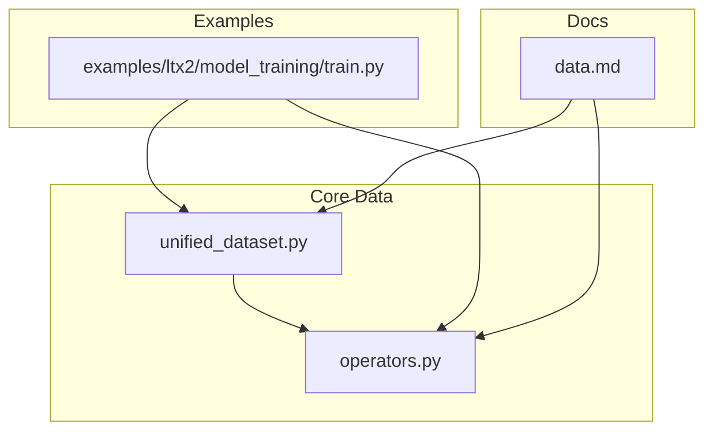
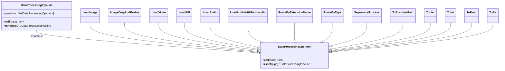
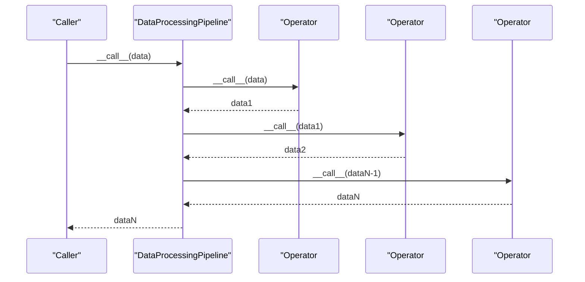
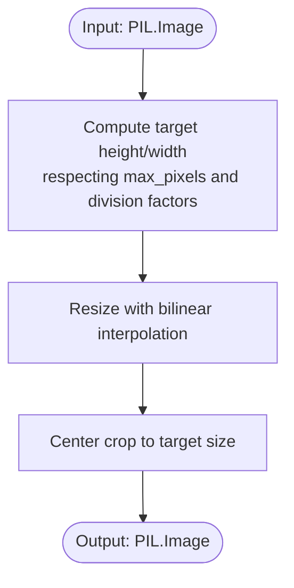
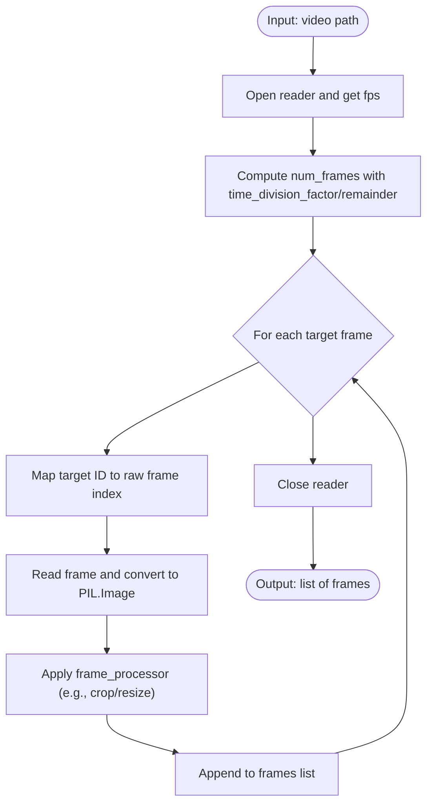
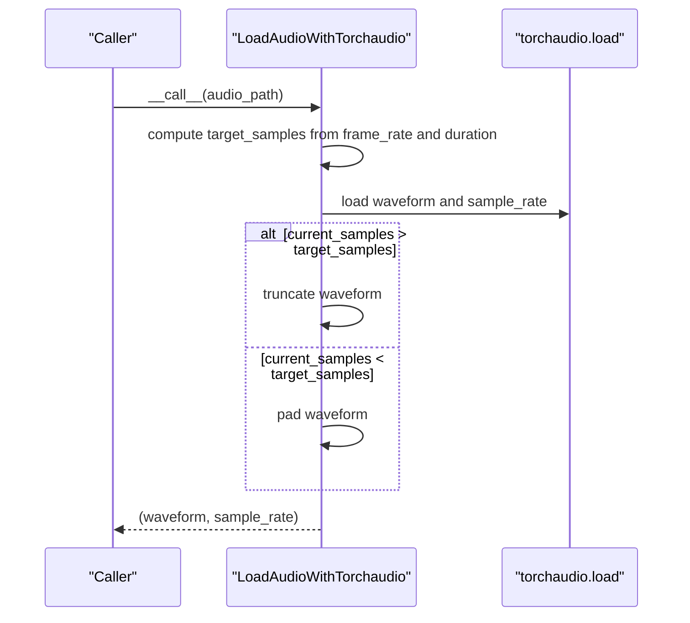
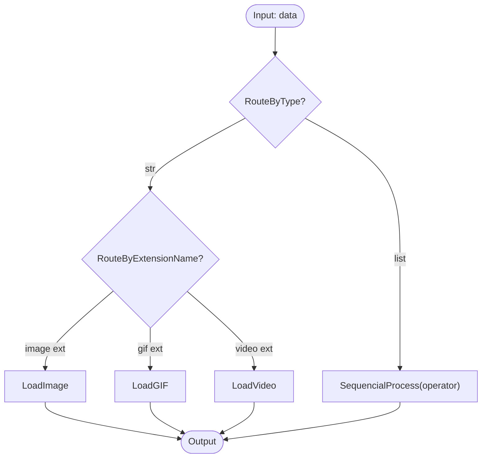
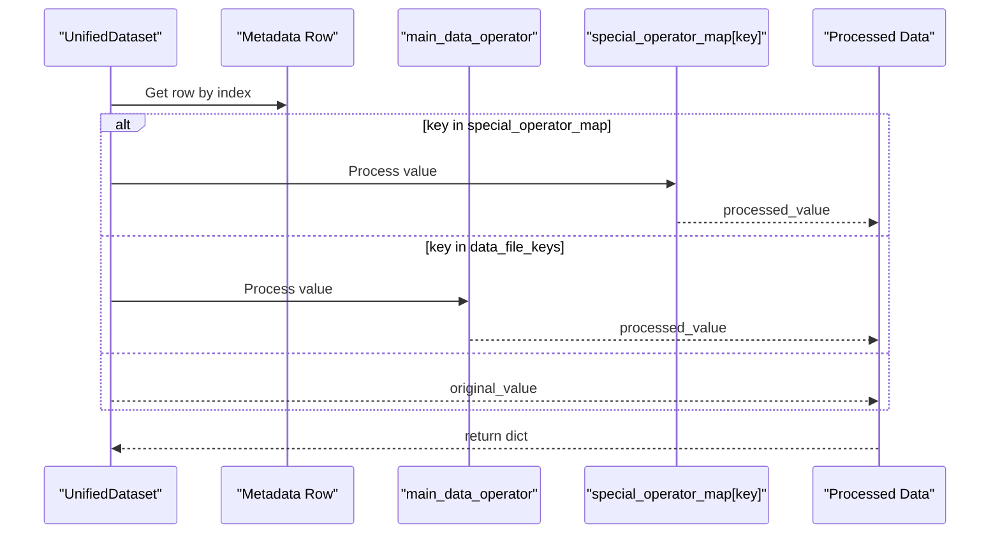
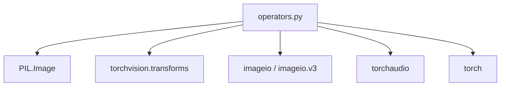

# Data Operators

<cite>
**Referenced Files in This Document**
- [operators.py](file://diffsynth/core/data/operators.py)
- [unified_dataset.py](file://diffsynth/core/data/unified_dataset.py)
- [data.md](file://docs/en/API_Reference/core/data.md)
- [train.py (LTX2)](file://examples/ltx2/model_training/train.py)
</cite>

## Table of Contents
1. [Introduction](#introduction)
2. [Project Structure](#project-structure)
3. [Core Components](#core-components)
4. [Architecture Overview](#architecture-overview)
5. [Detailed Component Analysis](#detailed-component-analysis)
6. [Dependency Analysis](#dependency-analysis)
7. [Performance Considerations](#performance-considerations)
8. [Troubleshooting Guide](#troubleshooting-guide)
9. [Conclusion](#conclusion)
10. [Appendices](#appendices)

## Introduction
This document explains the data operators system used to build flexible, composable pipelines for loading and transforming media data (images, videos, audio, and text-like metadata). It covers:
- The operator pipeline architecture and how transformations are chained together
- All built-in operators for image preprocessing, video frame handling, audio processing, and routing utilities
- How to create custom operators and compose reusable chains
- Common transformation chains and performance optimization techniques
- Error handling, validation, and debugging strategies for robust pipelines

The system is designed around a simple interface that allows chaining with the right-shift operator and executing pipelines as callable objects. A unified dataset integrates these operators to load and transform structured metadata into model-ready tensors or arrays.

## Project Structure
The data operators live under the core data module and are consumed by the unified dataset implementation and training examples.

**Diagram sources**
- [operators.py:1-279](file://diffsynth/core/data/operators.py#L1-L279)
- [unified_dataset.py:1-119](file://diffsynth/core/data/unified_dataset.py#L1-L119)
- [data.md:1-151](file://docs/en/API_Reference/core/data.md#L1-L151)
- [train.py (LTX2):1-180](file://examples/ltx2/model_training/train.py#L1-L180)

**Section sources**
- [operators.py:1-279](file://diffsynth/core/data/operators.py#L1-L279)
- [unified_dataset.py:1-119](file://diffsynth/core/data/unified_dataset.py#L1-L119)
- [data.md:1-151](file://docs/en/API_Reference/core/data.md#L1-L151)

## Core Components
At the heart of the system are two key abstractions:
- DataProcessingOperator: Base class defining the operator interface. Each operator implements __call__ to transform input data.
- DataProcessingPipeline: A container of operators that executes them sequentially. Supports composition via the >> operator.

Key built-in operators include:
- Type conversion: ToInt, ToFloat, ToStr, ToList, ToAbsolutePath
- File loaders: LoadImage, LoadVideo, LoadGIF, LoadAudio, LoadTorchPickle
- Media processors: ImageCropAndResize
- Routing and sequencing: RouteByExtensionName, RouteByType, SequencialProcess
- Audio sampling: LoadAudioWithTorchaudio (with frame-rate-aware sampling)

These components enable building complex pipelines such as:
- Absolute path resolution -> file loader -> format-specific processor -> normalization/cropping

**Section sources**
- [operators.py:8-31](file://diffsynth/core/data/operators.py#L8-L31)
- [operators.py:33-103](file://diffsynth/core/data/operators.py#L33-L103)
- [operators.py:105-107](file://diffsynth/core/data/operators.py#L105-L107)
- [operators.py:149-168](file://diffsynth/core/data/operators.py#L149-L168)
- [operators.py:171-177](file://diffsynth/core/data/operators.py#L171-L177)
- [operators.py:179-206](file://diffsynth/core/data/operators.py#L179-L206)
- [operators.py:209-229](file://diffsynth/core/data/operators.py#L209-L229)
- [operators.py:232-246](file://diffsynth/core/data/operators.py#L232-L246)
- [operators.py:248-279](file://diffsynth/core/data/operators.py#L248-L279)

## Architecture Overview
The pipeline architecture follows a functional composition pattern:
- Operators are stateless or minimally stateful callables
- Pipelines chain operators using >> which returns a new pipeline
- UnifiedDataset wires metadata fields to operator pipelines and applies them during __getitem__

**Diagram sources**
- [operators.py:8-31](file://diffsynth/core/data/operators.py#L8-L31)
- [operators.py:33-103](file://diffsynth/core/data/operators.py#L33-L103)
- [operators.py:149-168](file://diffsynth/core/data/operators.py#L149-L168)
- [operators.py:171-177](file://diffsynth/core/data/operators.py#L171-L177)
- [operators.py:179-206](file://diffsynth/core/data/operators.py#L179-L206)
- [operators.py:209-229](file://diffsynth/core/data/operators.py#L209-L229)
- [operators.py:232-246](file://diffsynth/core/data/operators.py#L232-L246)
- [operators.py:248-279](file://diffsynth/core/data/operators.py#L248-L279)

**Section sources**
- [unified_dataset.py:5-26](file://diffsynth/core/data/unified_dataset.py#L5-L26)
- [data.md:28-62](file://docs/en/API_Reference/core/data.md#L28-L62)

## Detailed Component Analysis

### Pipeline and Operator Interface
- DataProcessingOperator defines the contract: implement __call__ to transform data; supports composition via >>.
- DataProcessingPipeline stores an ordered list of operators and executes them sequentially.

**Diagram sources**
- [operators.py:8-21](file://diffsynth/core/data/operators.py#L8-L21)
- [operators.py:23-31](file://diffsynth/core/data/operators.py#L23-L31)

**Section sources**
- [operators.py:8-31](file://diffsynth/core/data/operators.py#L8-L31)

### Image Preprocessing Operators
- LoadImage: Opens images from paths, optionally converting to RGB or RGBA.
- ImageCropAndResize: Resizes and center-crops images to target dimensions, supporting max_pixels and divisibility constraints.

**Diagram sources**
- [operators.py:57-66](file://diffsynth/core/data/operators.py#L57-L66)
- [operators.py:69-102](file://diffsynth/core/data/operators.py#L69-L102)

**Section sources**
- [operators.py:57-102](file://diffsynth/core/data/operators.py#L57-L102)

### Video Frame Handling
- LoadVideo: Reads frames from video files, maps frame indices based on frame rate, applies per-frame processor (e.g., cropping), and returns a list of frames.
- LoadGIF: Loads GIF frames similarly, applying per-frame processor and respecting time division parameters.
- FrameSamplerByRateMixin: Provides common logic for determining number of frames and mapping between target sequence IDs and raw frame indices.

**Diagram sources**
- [operators.py:110-147](file://diffsynth/core/data/operators.py#L110-L147)
- [operators.py:149-168](file://diffsynth/core/data/operators.py#L149-L168)
- [operators.py:179-206](file://diffsynth/core/data/operators.py#L179-L206)

**Section sources**
- [operators.py:110-168](file://diffsynth/core/data/operators.py#L110-L168)
- [operators.py:179-206](file://diffsynth/core/data/operators.py#L179-L206)

### Audio Processing Operators
- LoadAudio: Loads audio waveform using librosa at a specified sample rate.
- LoadAudioWithTorchaudio: Loads audio using torchaudio, resamples/pads to match a target duration derived from frame rate and num_frames, and returns waveform and sample rate.

**Diagram sources**
- [operators.py:248-254](file://diffsynth/core/data/operators.py#L248-L254)
- [operators.py:257-279](file://diffsynth/core/data/operators.py#L257-L279)

**Section sources**
- [operators.py:248-279](file://diffsynth/core/data/operators.py#L248-L279)

### Routing and Sequencing Utilities
- RouteByExtensionName: Dispatches to different operators based on file extension.
- RouteByType: Dispatches to different operators based on Python type.
- SequencialProcess: Applies an operator to each element in a sequence.

**Diagram sources**
- [operators.py:209-229](file://diffsynth/core/data/operators.py#L209-L229)
- [operators.py:171-177](file://diffsynth/core/data/operators.py#L171-L177)

**Section sources**
- [operators.py:171-229](file://diffsynth/core/data/operators.py#L171-L229)

### Unified Dataset Integration
UnifiedDataset binds metadata fields to operator pipelines:
- main_data_operator processes fields listed in data_file_keys
- special_operator_map overrides specific fields with dedicated pipelines
- Default image/video operators provide ready-to-use pipelines for common formats

**Diagram sources**
- [unified_dataset.py:89-101](file://diffsynth/core/data/unified_dataset.py#L89-L101)
- [unified_dataset.py:28-60](file://diffsynth/core/data/unified_dataset.py#L28-L60)

**Section sources**
- [unified_dataset.py:5-26](file://diffsynth/core/data/unified_dataset.py#L5-L26)
- [unified_dataset.py:28-60](file://diffsynth/core/data/unified_dataset.py#L28-L60)
- [unified_dataset.py:89-101](file://diffsynth/core/data/unified_dataset.py#L89-L101)

### Example Usage in Training Scripts
Training scripts demonstrate composing operators for video and audio:
- Construct default_video_operator with cropping and resizing
- Use special_operator_map for audio fields with LoadAudioWithTorchaudio
- Chain operators using >> to form readable pipelines

**Section sources**
- [train.py (LTX2):121-147](file://examples/ltx2/model_training/train.py#L121-L147)
- [data.md:28-62](file://docs/en/API_Reference/core/data.md#L28-L62)

## Dependency Analysis
Operators depend on standard libraries and media I/O packages:
- PIL for image handling
- torchvision for transforms
- imageio and imageio.v3 for video/GIF reading
- torchaudio for audio loading
- torch for tensor operations and pickles

**Diagram sources**
- [operators.py:1-5](file://diffsynth/core/data/operators.py#L1-L5)

**Section sources**
- [operators.py:1-5](file://diffsynth/core/data/operators.py#L1-L5)

## Performance Considerations
- Prefer fixed frame rates and time division parameters to align with model patch sizes and reduce unnecessary computations.
- Use max_pixels in ImageCropAndResize to cap memory usage for large images.
- For large datasets, consider caching preprocessed data using LoadTorchPickle and loading from cache to avoid repeated I/O.
- Avoid excessive conversions; keep data in efficient formats until necessary.
- When dealing with very large datasets, be aware of potential slowdowns beyond certain sizes due to framework-level issues.

[No sources needed since this section provides general guidance]

## Troubleshooting Guide
Common errors and remedies:
- Unsupported file extension: Ensure RouteByExtensionName includes all relevant extensions or add a fallback.
- Invalid or missing audio files: LoadAudioWithTorchaudio warns and returns None; handle downstream accordingly.
- Path resolution issues: Always use ToAbsolutePath with base_path to resolve relative paths correctly.
- Memory pressure: Reduce max_pixels, adjust num_frames, or enable caching.

Validation and debugging tips:
- Use check_data_equal in UnifiedDataset to compare outputs across runs.
- Inspect intermediate results by inserting debug operators or logging within custom operators.
- Verify frame counts and durations when working with variable-length media.

**Section sources**
- [operators.py:209-218](file://diffsynth/core/data/operators.py#L209-L218)
- [operators.py:257-279](file://diffsynth/core/data/operators.py#L257-L279)
- [unified_dataset.py:111-118](file://diffsynth/core/data/unified_dataset.py#L111-L118)

## Conclusion
The data operators system provides a clean, composable interface for building robust data pipelines across images, videos, and audio. By leveraging the operator abstraction and pipeline composition, users can assemble flexible, reusable transformations tailored to their models’ requirements. The unified dataset ties metadata to operator pipelines, enabling scalable and maintainable data loading workflows.

[No sources needed since this section summarizes without analyzing specific files]

## Appendices

### Creating Custom Operators
To create a custom operator:
- Subclass DataProcessingOperator
- Implement __call__(self, data) to transform input data
- Optionally support composition via >> (inherited automatically)

Example pattern:
- Define a class inheriting from DataProcessingOperator
- Implement __call__ to perform the desired transformation
- Compose with other operators using >> to build pipelines

**Section sources**
- [operators.py:23-31](file://diffsynth/core/data/operators.py#L23-L31)

### Common Transformation Chains
- Image pipeline: ToAbsolutePath(base_path) >> LoadImage() >> ImageCropAndResize(height, width, max_pixels, h_div, w_div)
- Video pipeline: ToAbsolutePath(base_path) >> RouteByExtensionName(...) >> LoadVideo(num_frames, time_division_factor, time_division_remainder, frame_processor=...)
- Audio pipeline: ToAbsolutePath(base_path) >> LoadAudioWithTorchaudio(num_frames, time_division_factor, time_division_remainder, frame_rate=...)

**Section sources**
- [data.md:28-62](file://docs/en/API_Reference/core/data.md#L28-L62)
- [unified_dataset.py:28-60](file://diffsynth/core/data/unified_dataset.py#L28-L60)
- [train.py (LTX2):121-147](file://examples/ltx2/model_training/train.py#L121-L147)