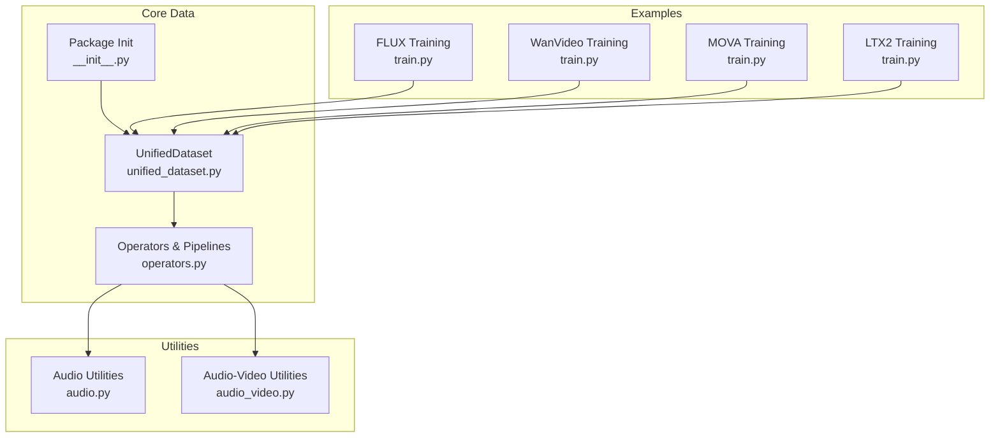
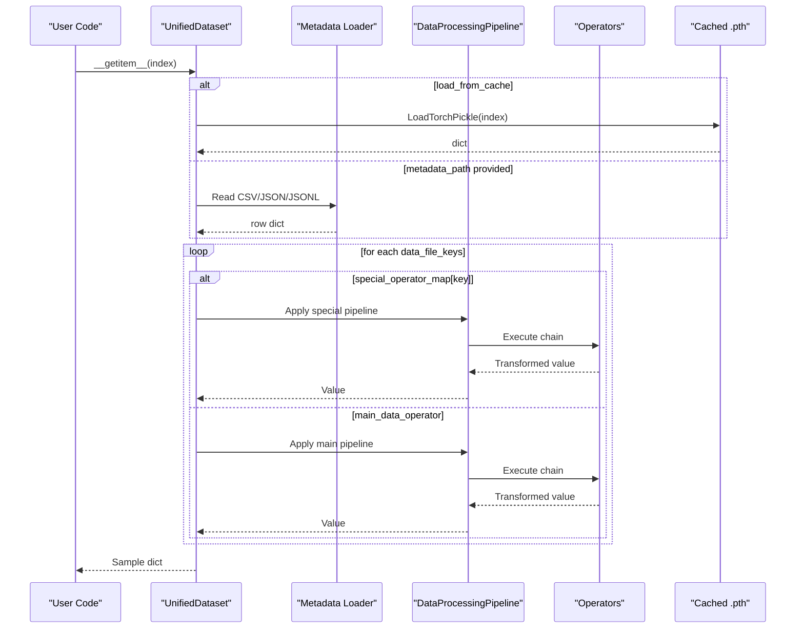
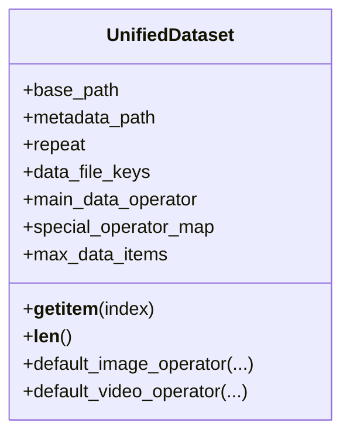
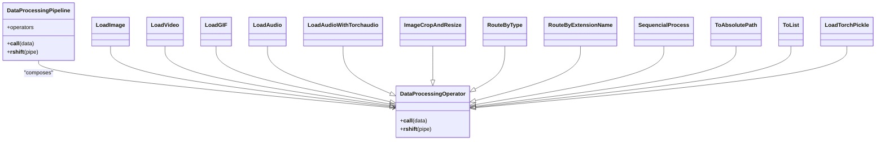
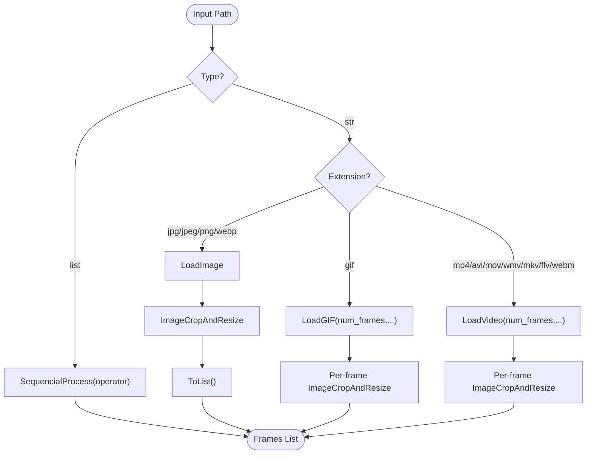
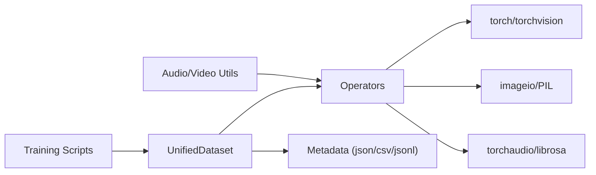

# Data Processing Core

<cite>
**Referenced Files in This Document**
- [unified_dataset.py](file://diffsynth/core/data/unified_dataset.py)
- [operators.py](file://diffsynth/core/data/operators.py)
- [__init__.py (core data)](file://diffsynth/core/data/__init__.py)
- [train.py (FLUX example)](file://examples/flux/model_training/train.py)
- [train.py (WanVideo example)](file://examples/wanvideo/model_training/train.py)
- [train.py (MOVA example)](file://examples/mova/model_training/train.py)
- [train.py (LTX2 example)](file://examples/ltx2/model_training/train.py)
- [data.md (API Reference)](file://docs/en/API_Reference/core/data.md)
- [audio.py](file://diffsynth/utils/data/audio.py)
- [audio_video.py](file://diffsynth/utils/data/audio_video.py)
- [disk_map.py](file://diffsynth/core/vram/disk_map.py)
- [initialization.py](file://diffsynth/core/vram/initialization.py)
</cite>

## Table of Contents
1. [Introduction](#introduction)
2. [Project Structure](#project-structure)
3. [Core Components](#core-components)
4. [Architecture Overview](#architecture-overview)
5. [Detailed Component Analysis](#detailed-component-analysis)
6. [Dependency Analysis](#dependency-analysis)
7. [Performance Considerations](#performance-considerations)
8. [Troubleshooting Guide](#troubleshooting-guide)
9. [Conclusion](#conclusion)
10. [Appendices](#appendices)

## Introduction
This document explains the data processing core system that provides a unified dataset interface and a composable operator pipeline for multi-modal data. It covers how text, image, audio, and video inputs are standardized into a consistent format, how to build and extend transformation chains, and how to optimize performance for large datasets and streaming scenarios. The system is designed to be extensible and efficient, enabling seamless integration across different model types and training/inference pipelines.

## Project Structure
The data processing core resides under diffsynth/core/data with supporting utilities under diffsynth/utils/data and examples demonstrating usage across multiple model families.

**Diagram sources**
- [unified_dataset.py:1-119](file://diffsynth/core/data/unified_dataset.py#L1-L119)
- [operators.py:1-279](file://diffsynth/core/data/operators.py#L1-L279)
- [__init__.py (core data):1-2](file://diffsynth/core/data/__init__.py#L1-L2)
- [train.py (FLUX example):146-159](file://examples/flux/model_training/train.py#L146-L159)
- [train.py (WanVideo example):134-155](file://examples/wanvideo/model_training/train.py#L134-L155)
- [train.py (MOVA example):146-179](file://examples/mova/model_training/train.py#L146-L179)
- [train.py (LTX2 example):121-143](file://examples/ltx2/model_training/train.py#L121-L143)
- [audio.py:1-109](file://diffsynth/utils/data/audio.py#L1-L109)
- [audio_video.py:1-135](file://diffsynth/utils/data/audio_video.py#L1-L135)

**Section sources**
- [unified_dataset.py:1-119](file://diffsynth/core/data/unified_dataset.py#L1-L119)
- [operators.py:1-279](file://diffsynth/core/data/operators.py#L1-L279)
- [__init__.py (core data):1-2](file://diffsynth/core/data/__init__.py#L1-L2)

## Core Components
- UnifiedDataset: A PyTorch Dataset that standardizes data loading and applies a configurable operator pipeline per field. It supports metadata-driven indexing (CSV/JSON/JSONL), cached binary data loading, repeatable iteration, and optional max item limiting.
- Operators and Pipelines: A composable set of operators (e.g., LoadImage, LoadVideo, LoadAudio, ImageCropAndResize) connected via a right-shift operator to form sequential pipelines. Routing operators enable type-based or extension-based branching.
- Multi-modal support: Default operators for images and videos, plus audio loaders and utilities for reading/resampling audio and writing audio-video files.

Key responsibilities:
- UnifiedDataset orchestrates metadata parsing, caching, and per-field transformations.
- Operators implement deterministic, stateless transformations suitable for parallel dataloaders.
- Utilities provide efficient media I/O and conversions.

**Section sources**
- [unified_dataset.py:5-119](file://diffsynth/core/data/unified_dataset.py#L5-L119)
- [operators.py:8-31](file://diffsynth/core/data/operators.py#L8-L31)
- [data.md (API Reference):1-88](file://docs/en/API_Reference/core/data.md#L1-L88)

## Architecture Overview
The data flow follows a clear sequence from metadata to transformed samples, with optional caching and routing logic.

**Diagram sources**
- [unified_dataset.py:89-101](file://diffsynth/core/data/unified_dataset.py#L89-L101)
- [operators.py:8-31](file://diffsynth/core/data/operators.py#L8-L31)

## Detailed Component Analysis

### UnifiedDataset
- Initialization parameters: base_path, metadata_path, repeat, data_file_keys, main_data_operator, special_operator_map, max_data_items.
- Metadata loading: Supports JSON, JSONL, and CSV; falls back to scanning for cached .pth when no metadata is provided.
- Item retrieval: Applies either a special operator map or the main operator per key, returning a normalized sample dictionary.
- Length control: Supports repeat multiplication and an optional hard cap on items.

**Diagram sources**
- [unified_dataset.py:5-119](file://diffsynth/core/data/unified_dataset.py#L5-L119)

**Section sources**
- [unified_dataset.py:5-119](file://diffsynth/core/data/unified_dataset.py#L5-L119)

### Operators and Pipelines
- Base classes: DataProcessingOperator and DataProcessingPipeline define the operator contract and sequential composition using >>.
- Common operators:
  - Type/format conversion: ToInt, ToFloat, ToStr, ToList, ToAbsolutePath.
  - File loading: LoadImage, LoadVideo, LoadGIF, LoadAudio, LoadAudioWithTorchaudio, LoadTorchPickle.
  - Media processing: ImageCropAndResize.
  - Routing/meta: RouteByType, RouteByExtensionName, SequencialProcess.
- Video/GIF loaders include frame sampling strategies aligned to target frame rates and time division constraints.

**Diagram sources**
- [operators.py:8-31](file://diffsynth/core/data/operators.py#L8-L31)
- [operators.py:38-108](file://diffsynth/core/data/operators.py#L38-L108)
- [operators.py:149-207](file://diffsynth/core/data/operators.py#L149-L207)
- [operators.py:209-230](file://diffsynth/core/data/operators.py#L209-L230)
- [operators.py:232-279](file://diffsynth/core/data/operators.py#L232-L279)

**Section sources**
- [operators.py:8-31](file://diffsynth/core/data/operators.py#L8-L31)
- [operators.py:38-108](file://diffsynth/core/data/operators.py#L38-L108)
- [operators.py:149-207](file://diffsynth/core/data/operators.py#L149-L207)
- [operators.py:209-230](file://diffsynth/core/data/operators.py#L209-L230)
- [operators.py:232-279](file://diffsynth/core/data/operators.py#L232-L279)

### Multi-modal Data Processing Capabilities
- Images: default_image_operator handles single images and lists of images, applying absolute path resolution, loading, and resizing/cropping.
- Videos: default_video_operator routes by file extension to image frames, GIFs, or video streams, with frame sampling and per-frame resizing.
- Audio: LoadAudio and LoadAudioWithTorchaudio provide waveform loading with resampling and duration alignment; utilities support mono/stereo conversion and torchcodec-backed read/write.
- Video-Audio: write_video_audio encodes frames and muxes audio streams with proper sample rate handling.

**Diagram sources**
- [unified_dataset.py:28-61](file://diffsynth/core/data/unified_dataset.py#L28-L61)
- [operators.py:149-207](file://diffsynth/core/data/operators.py#L149-L207)

**Section sources**
- [unified_dataset.py:28-61](file://diffsynth/core/data/unified_dataset.py#L28-L61)
- [operators.py:149-207](file://diffsynth/core/data/operators.py#L149-L207)
- [audio.py:1-109](file://diffsynth/utils/data/audio.py#L1-L109)
- [audio_video.py:1-135](file://diffsynth/utils/data/audio_video.py#L1-L135)

### Examples of Custom Data Operators and Dataset Creation
- FLUX image dataset: Uses default_image_operator with height/width and pixel limits; demonstrates data_file_keys and repeat configuration.
- WanVideo dataset: Uses default_video_operator and adds special_operator_map entries for auxiliary fields like animate_face_video and input_audio.
- MOVA/LTX2 datasets: Combine video processors with audio loaders and in-context video routing via RouteByType and SequencialProcess.

These examples show how to:
- Configure base paths and metadata.
- Compose pipelines for primary and auxiliary fields.
- Use routing operators to handle heterogeneous inputs.

**Section sources**
- [train.py (FLUX example):146-159](file://examples/flux/model_training/train.py#L146-L159)
- [train.py (WanVideo example):134-155](file://examples/wanvideo/model_training/train.py#L134-L155)
- [train.py (MOVA example):146-179](file://examples/mova/model_training/train.py#L146-L179)
- [train.py (LTX2 example):121-143](file://examples/ltx2/model_training/train.py#L121-L143)

### Data Augmentation Strategies and Preprocessing Workflows
- Geometric transforms: Center crop and resize ensure consistent dimensions and aspect ratios; max_pixels controls memory footprint.
- Temporal sampling: Frame selection respects time_division_factor and remainder to align with model requirements.
- Color/format normalization: RGB conversion and optional RGBA handling.
- Audio preprocessing: Mono/stereo conversion, resampling to target sample rate, and padding/truncation to match durations.

Best practices:
- Keep augmentation deterministic where possible for reproducibility.
- Use division factors compatible with model architectures (e.g., 16/32 for VAE/DiT).
- Validate output shapes before feeding into models.

[No sources needed since this section provides general guidance]

### Performance Optimization for Large Datasets and Streaming Data
- Cached data loading: When metadata_path is None, UnifiedDataset scans for .pth files and loads preprocessed samples via LoadTorchPickle to reduce I/O overhead.
- Low-memory readers: Utilities provide low-memory video/image access patterns to avoid loading entire sequences into RAM.
- Disk offload and VRAM management: DiskMap enables lazy parameter loading from disk; skip_model_initialization defers heavy initialization.
- Efficient I/O: torchaudio and torchcodec backends accelerate audio read/write; PyAV-based writer efficiently muxes audio and video.

Recommendations:
- Precompute and cache expensive transformations for large datasets.
- Use num_workers and pin_memory in DataLoader alongside these components.
- Prefer safetensors for faster, safer weight loading when applicable.

**Section sources**
- [unified_dataset.py:62-88](file://diffsynth/core/data/unified_dataset.py#L62-L88)
- [audio.py:31-87](file://diffsynth/utils/data/audio.py#L31-L87)
- [audio_video.py:79-135](file://diffsynth/utils/data/audio_video.py#L79-L135)
- [disk_map.py:28-94](file://diffsynth/core/vram/disk_map.py#L28-L94)
- [initialization.py:5-22](file://diffsynth/core/vram/initialization.py#L5-L22)

### Extending the Pipeline with Custom Transformations
To add custom transformations:
- Implement a new DataProcessingOperator subclass with a __call__ method.
- Compose it into pipelines using >> or wrap with SequencialProcess for list-wise operations.
- Register via RouteByType or RouteByExtensionName for conditional routing.
- Integrate into UnifiedDataset through main_data_operator or special_operator_map.

Guidelines:
- Ensure operators are stateless and thread-safe for parallel execution.
- Preserve input/output contracts (e.g., PIL.Image for images, tensors for audio).
- Test edge cases such as empty sequences, unsupported formats, and shape mismatches.

[No sources needed since this section provides general guidance]

## Dependency Analysis
The core data module depends on standard libraries (torch, torchvision, imageio, torchaudio, PIL) and integrates with utilities for audio/video processing. Training scripts import UnifiedDataset and compose operators to meet model-specific needs.

**Diagram sources**
- [unified_dataset.py:1-26](file://diffsynth/core/data/unified_dataset.py#L1-L26)
- [operators.py:1-6](file://diffsynth/core/data/operators.py#L1-L6)
- [train.py (FLUX example):1-10](file://examples/flux/model_training/train.py#L1-L10)
- [train.py (WanVideo example):1-6](file://examples/wanvideo/model_training/train.py#L1-L6)

**Section sources**
- [unified_dataset.py:1-26](file://diffsynth/core/data/unified_dataset.py#L1-L26)
- [operators.py:1-6](file://diffsynth/core/data/operators.py#L1-L6)

## Performance Considerations
- Prefer cached .pth loading for repeated training runs to minimize I/O.
- Use appropriate frame sampling and resizing to fit GPU memory budgets.
- Employ torchaudio/torchcodec for fast audio processing and PyAV for efficient video encoding.
- Leverage DiskMap and VRAM management features when working with large models or limited memory.

[No sources needed since this section provides general guidance]

## Troubleshooting Guide
Common issues and resolutions:
- Unsupported file extension: RouteByExtensionName raises an error if the extension is not mapped; ensure correct mapping or add new extensions.
- Audio loading failures: LoadAudioWithTorchaudio warns and returns None on failure; verify file integrity and backend availability.
- Shape mismatches: Ensure height/width and time_division settings align with model expectations (e.g., divisibility by 16/32).
- Memory pressure: Reduce max_pixels, num_frames, or enable caching; consider low-memory readers and disk offloading.

**Section sources**
- [operators.py:209-230](file://diffsynth/core/data/operators.py#L209-L230)
- [operators.py:257-279](file://diffsynth/core/data/operators.py#L257-L279)

## Conclusion
The data processing core provides a robust, modular, and scalable foundation for multi-modal data handling. By combining a unified dataset interface with a flexible operator pipeline, it supports diverse model types and workflows while offering performance optimizations for large-scale and streaming data. Extensibility is straightforward, enabling users to integrate custom transformations and adapt to evolving model requirements.

[No sources needed since this section summarizes without analyzing specific files]

## Appendices
- API reference overview: See the data API documentation for operator catalogs and usage patterns.
- Example scripts: Review training scripts to see practical configurations for images, videos, and audio.

**Section sources**
- [data.md (API Reference):1-88](file://docs/en/API_Reference/core/data.md#L1-L88)
- [train.py (FLUX example):146-159](file://examples/flux/model_training/train.py#L146-L159)
- [train.py (WanVideo example):134-155](file://examples/wanvideo/model_training/train.py#L134-L155)
- [train.py (MOVA example):146-179](file://examples/mova/model_training/train.py#L146-L179)
- [train.py (LTX2 example):121-143](file://examples/ltx2/model_training/train.py#L121-L143)