# Multi-modal Data Handling

<cite>
**Referenced Files in This Document**
- [audio.py](file://diffvsynth/utils/data/audio.py)
- [audio_video.py](file://diffvsynth/utils/data/audio_video.py)
- [media_io_ltx2.py](file://diffvsynth/utils/data/media_io_ltx2.py)
- [operators.py](file://diffvsynth/core/data/operators.py)
- [unified_dataset.py](file://diffvsynth/core/data/unified_dataset.py)
- [ltx2_audio_video.py](file://diffvsynth/pipelines/ltx2_audio_video.py)
- [mova_audio_video.py](file://diffvsynth/pipelines/mova_audio_video.py)
- [ltx2_audio_vae.py](file://diffvsynth/models/ltx2_audio_vae.py)
- [wan_video_dit.py](file://diffvsynth/models/wan_video_dit.py)
</cite>

## Table of Contents
1. [Introduction](#introduction)
2. [Project Structure](#project-structure)
3. [Core Components](#core-components)
4. [Architecture Overview](#architecture-overview)
5. [Detailed Component Analysis](#detailed-component-analysis)
6. [Dependency Analysis](#dependency-analysis)
7. [Performance Considerations](#performance-considerations)
8. [Troubleshooting Guide](#troubleshooting-guide)
9. [Conclusion](#conclusion)
10. [Appendices](#appendices)

## Introduction
This document explains how the system processes multiple modalities—text, image, audio, and video—in a unified pipeline framework. It focuses on:
- Unified input handling for text, images, audio, and video
- Audio processing pipeline: format conversion, resampling, feature extraction (mel spectrogram), and synchronization with video timelines
- Video processing capabilities: frame extraction, temporal encoding via VAE latents, and motion-aware modeling through DiT architectures
- Combining modalities within single pipelines using shared denoising steps and cross-modal conditioning
- Format compatibility, codec support, and performance optimization strategies
- Guidance for large media files and streaming-friendly processing patterns

## Project Structure
The multi-modal data handling spans utilities, core data operators, and specialized pipelines:
- Utilities for audio I/O and audio-video muxing
- Core data operators for loading and preprocessing images, GIFs, videos, and audio
- Unified dataset abstraction to route different file types to appropriate loaders
- Pipelines that orchestrate text, image, audio, and video inputs into joint diffusion models

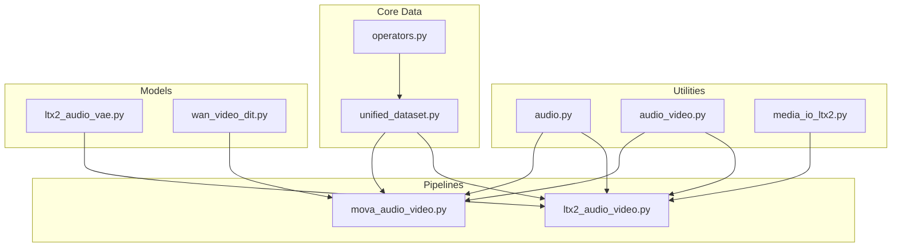

**Diagram sources**
- [audio.py:1-109](file://diffvsynth/utils/data/audio.py#L1-L109)
- [audio_video.py:1-135](file://diffvsynth/utils/data/audio_video.py#L1-L135)
- [media_io_ltx2.py:1-44](file://diffvsynth/utils/data/media_io_ltx2.py#L1-L44)
- [operators.py:1-279](file://diffvsynth/core/data/operators.py#L1-L279)
- [unified_dataset.py:1-119](file://diffvsynth/core/data/unified_dataset.py#L1-L119)
- [ltx2_audio_video.py:1-732](file://diffvsynth/pipelines/ltx2_audio_video.py#L1-L732)
- [mova_audio_video.py:1-462](file://diffvsynth/pipelines/mova_audio_video.py#L1-L462)
- [ltx2_audio_vae.py:1-200](file://diffvsynth/models/ltx2_audio_vae.py#L1-L200)
- [wan_video_dit.py:1-200](file://diffvsynth/models/wan_video_dit.py#L1-L200)

**Section sources**
- [audio.py:1-109](file://diffvsynth/utils/data/audio.py#L1-L109)
- [audio_video.py:1-135](file://diffvsynth/utils/data/audio_video.py#L1-L135)
- [media_io_ltx2.py:1-44](file://diffvsynth/utils/data/media_io_ltx2.py#L1-L44)
- [operators.py:1-279](file://diffvsynth/core/data/operators.py#L1-L279)
- [unified_dataset.py:1-119](file://diffvsynth/core/data/unified_dataset.py#L1-L119)
- [ltx2_audio_video.py:1-732](file://diffvsynth/pipelines/ltx2_audio_video.py#L1-L732)
- [mova_audio_video.py:1-462](file://diffvsynth/pipelines/mova_audio_video.py#L1-L462)
- [ltx2_audio_vae.py:1-200](file://diffvsynth/models/ltx2_audio_vae.py#L1-L200)
- [wan_video_dit.py:1-200](file://diffvsynth/models/wan_video_dit.py#L1-L200)

## Core Components
- Audio I/O and processing:
  - Reading audio with optional time slicing and resampling
  - Converting between mono/stereo and saving back to file formats
- Audio-video muxing:
  - Writing video frames and synchronized audio streams using PyAV
  - Resampling and encoding audio to AAC with proper sample rate selection
- Media preprocessing:
  - Single-frame encode/decode for normalization and codec compatibility
- Data operators:
  - Loaders for images, GIFs, videos, and audio with frame sampling and resizing
  - Routing by type and extension to apply correct processing
- Unified dataset:
  - Metadata-driven dataset with caching and operator routing for multimodal items
- Pipelines:
  - LTX-2 audio-video pipeline with text, image, audio, and video conditioning
  - MOVA audio-video pipeline with dual-tower DiT and sequence parallelism

**Section sources**
- [audio.py:1-109](file://diffvsynth/utils/data/audio.py#L1-L109)
- [audio_video.py:1-135](file://diffvsynth/utils/data/audio_video.py#L1-L135)
- [media_io_ltx2.py:1-44](file://diffvsynth/utils/data/media_io_ltx2.py#L1-L44)
- [operators.py:1-279](file://diffvsynth/core/data/operators.py#L1-L279)
- [unified_dataset.py:1-119](file://diffvsynth/core/data/unified_dataset.py#L1-L119)
- [ltx2_audio_video.py:1-732](file://diffvsynth/pipelines/ltx2_audio_video.py#L1-L732)
- [mova_audio_video.py:1-462](file://diffvsynth/pipelines/mova_audio_video.py#L1-L462)

## Architecture Overview
The system composes modular units within pipelines to handle multimodal inputs. Each pipeline defines:
- Input embedders for text, images, audio, and video
- Noise initialization aligned to output shapes
- Denoising stages with shared schedulers and CFG
- Decoders for video and audio outputs

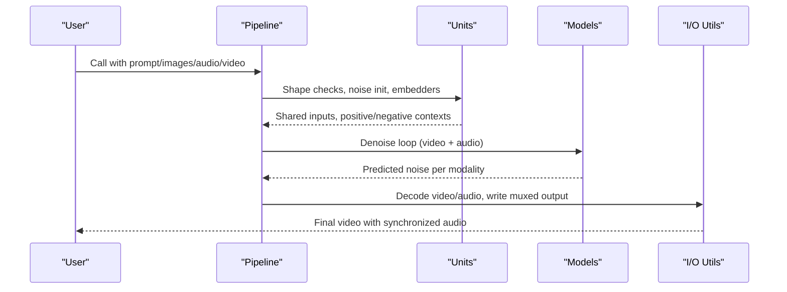

**Diagram sources**
- [ltx2_audio_video.py:149-249](file://diffvsynth/pipelines/ltx2_audio_video.py#L149-L249)
- [mova_audio_video.py:114-197](file://diffvsynth/pipelines/mova_audio_video.py#L114-L197)
- [audio_video.py:79-135](file://diffvsynth/utils/data/audio_video.py#L79-L135)

## Detailed Component Analysis

### Audio Processing Pipeline
Responsibilities:
- Read audio from files with optional start/duration slicing
- Convert channel layouts (mono/stereo)
- Resample waveforms to target sample rates
- Encode/save audio back to file formats

Key functions:
- read_audio: supports torchcodec backend, optional resampling
- convert_to_mono / convert_to_stereo: channel manipulation
- resample_waveform: torchaudio-based resampling
- save_audio: writes waveform to file via encoder

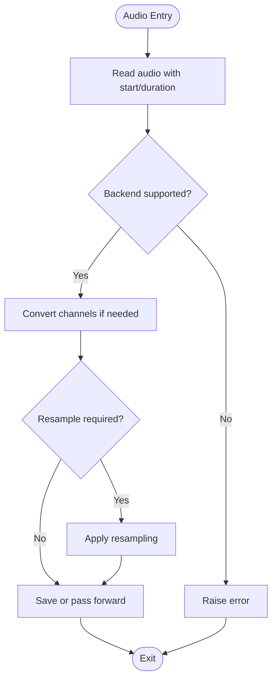

**Diagram sources**
- [audio.py:31-87](file://diffvsynth/utils/data/audio.py#L31-L87)
- [audio.py:90-109](file://diffvsynth/utils/data/audio.py#L90-L109)

**Section sources**
- [audio.py:1-109](file://diffvsynth/utils/data/audio.py#L1-L109)

### Audio-Video Muxing and Synchronization
Responsibilities:
- Write video frames and audio stream into a container
- Ensure audio sample rate compatibility and stereo layout
- Resample audio frames to encoder requirements
- Flush encoders and close container

Key functions:
- write_video_audio: orchestrates video and audio writing
- _prepare_audio_stream: sets up AAC stream parameters
- _write_audio: converts tensor to frames and muxes
- _resample_audio: resamples and encodes audio frames

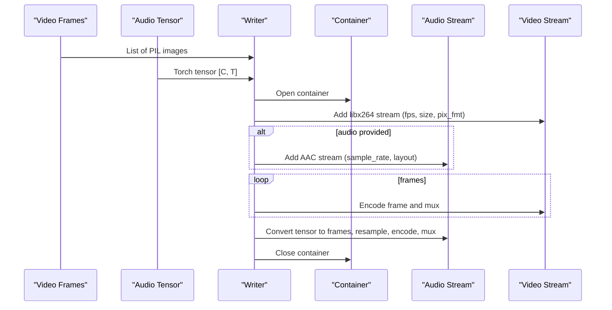

**Diagram sources**
- [audio_video.py:79-135](file://diffvsynth/utils/data/audio_video.py#L79-L135)

**Section sources**
- [audio_video.py:1-135](file://diffvsynth/utils/data/audio_video.py#L1-L135)

### Media Preprocessing for Compatibility
Responsibilities:
- Normalize images via encode/decode cycle to ensure codec compatibility
- Single-frame encode/decode helpers for testing and preprocessing

Key functions:
- encode_single_frame: writes a single RGB frame to MP4
- decode_single_frame: reads first frame from MP4
- ltx2_preprocess: round-trips image through encoder/decoder

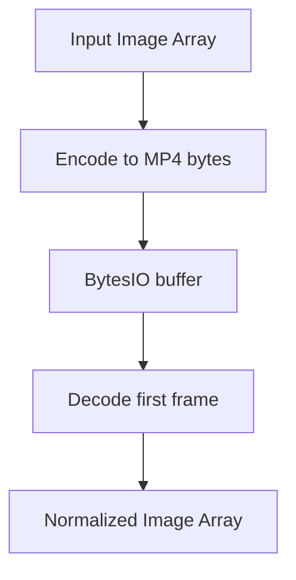

**Diagram sources**
- [media_io_ltx2.py:7-44](file://diffvsynth/utils/data/media_io_ltx2.py#L7-L44)

**Section sources**
- [media_io_ltx2.py:1-44](file://diffvsynth/utils/data/media_io_ltx2.py#L1-L44)

### Data Operators for Multimodal Inputs
Responsibilities:
- Load images, GIFs, videos with frame sampling and resizing
- Route by file extension to appropriate loader
- Load audio with torchaudio and align durations
- Provide base classes for chaining operations

Key components:
- LoadImage, LoadGIF, LoadVideo: frame extraction and processing
- FrameSamplerByRateMixin: consistent frame selection and timing
- RouteByExtensionName, RouteByType: dynamic operator dispatch
- LoadAudio, LoadAudioWithTorchaudio: audio loading and duration alignment

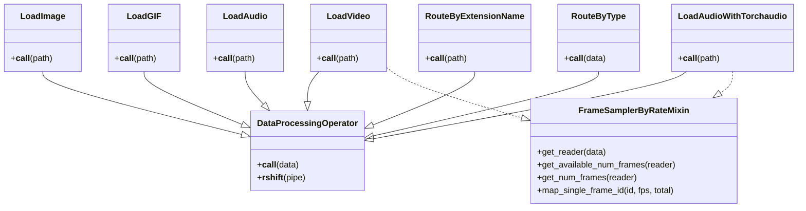

**Diagram sources**
- [operators.py:57-279](file://diffvsynth/core/data/operators.py#L57-L279)

**Section sources**
- [operators.py:1-279](file://diffvsynth/core/data/operators.py#L1-L279)

### Unified Dataset Abstraction
Responsibilities:
- Load metadata from JSON/JSONL/CSV or search cached .pth files
- Apply main or special operators based on keys
- Support repeat and max items for training loops

Key methods:
- load_metadata: parse metadata sources
- __getitem__: apply operators and return processed item
- search_for_cached_data_files: discover cached tensors

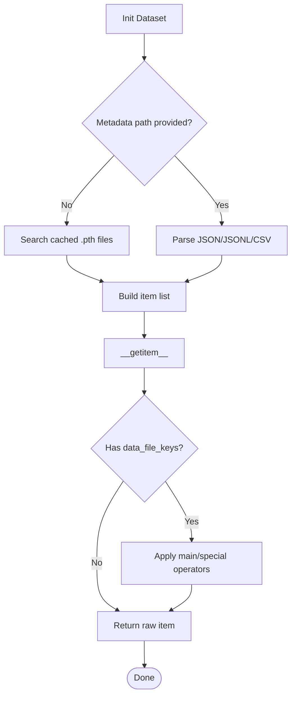

**Diagram sources**
- [unified_dataset.py:62-119](file://diffvsynth/core/data/unified_dataset.py#L62-L119)

**Section sources**
- [unified_dataset.py:1-119](file://diffvsynth/core/data/unified_dataset.py#L1-L119)

### LTX-2 Audio-Video Pipeline
Responsibilities:
- Orchestrate text, image, audio, and video conditioning
- Joint denoising for video and audio latents
- Two-stage inference with upsampler and LoRA switching
- Output decoding to pixel video and audio waveform

Key units:
- PromptEmbedder: text encoding for video/audio contexts
- NoiseInitializer: generate aligned noise and positions
- InputVideoEmbedder, InputAudioEmbedder: encode inputs to latents
- Retake embedders: region-specific conditioning
- SwitchStage2, LatentsUpsampler: stage transitions and resolution scaling

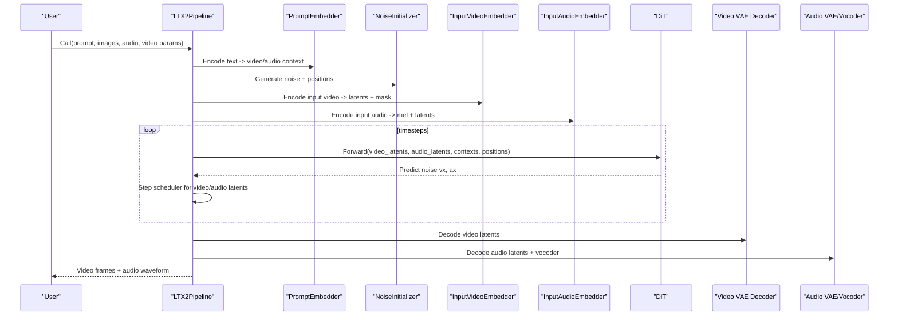

**Diagram sources**
- [ltx2_audio_video.py:149-249](file://diffvsynth/pipelines/ltx2_audio_video.py#L149-L249)
- [ltx2_audio_video.py:298-328](file://diffvsynth/pipelines/ltx2_audio_video.py#L298-L328)
- [ltx2_audio_video.py:330-361](file://diffvsynth/pipelines/ltx2_audio_video.py#L330-L361)
- [ltx2_audio_video.py:363-400](file://diffvsynth/pipelines/ltx2_audio_video.py#L363-L400)
- [ltx2_audio_video.py:402-471](file://diffvsynth/pipelines/ltx2_audio_video.py#L402-L471)
- [ltx2_audio_video.py:591-646](file://diffvsynth/pipelines/ltx2_audio_video.py#L591-L646)

**Section sources**
- [ltx2_audio_video.py:1-732](file://diffvsynth/pipelines/ltx2_audio_video.py#L1-L732)

### MOVA Audio-Video Pipeline
Responsibilities:
- Dual-tower DiT architecture for video and audio
- Sequence parallelism for long sequences
- First-last frame conditioning via VAE embeddings
- Joint denoising with shared timestep and RoPE frequencies

Key units:
- ShapeChecker: enforce divisible dimensions
- NoiseInitializer: compute latent shapes for video/audio
- InputVideoEmbedder, InputAudioEmbedder: encode inputs
- PromptEmbedder: text embedding
- ImageEmbedderVAE: first/last frame conditioning

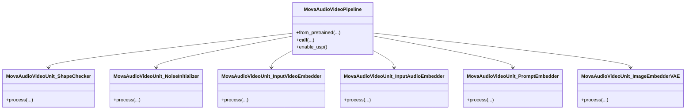

**Diagram sources**
- [mova_audio_video.py:25-197](file://diffvsynth/pipelines/mova_audio_video.py#L25-L197)
- [mova_audio_video.py:200-346](file://diffvsynth/pipelines/mova_audio_video.py#L200-L346)

**Section sources**
- [mova_audio_video.py:1-462](file://diffvsynth/pipelines/mova_audio_video.py#L1-L462)

### Audio Feature Extraction and Synchronization
Responsibilities:
- Convert waveforms to log-mel spectrograms
- Compute timestamps for each latent frame aligned to real-time seconds
- Patchify audio latents for DiT consumption

Key components:
- AudioProcessor: MelSpectrogram transform and resampling
- AudioPatchifier: patchify and timestamp computation
- get_patch_grid_bounds: derive start/end times per latent step

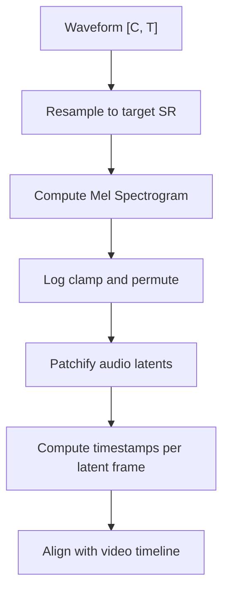

**Diagram sources**
- [ltx2_audio_vae.py:12-65](file://diffvsynth/models/ltx2_audio_vae.py#L12-L65)
- [ltx2_audio_vae.py:67-200](file://diffvsynth/models/ltx2_audio_vae.py#L67-L200)

**Section sources**
- [ltx2_audio_vae.py:1-200](file://diffvsynth/models/ltx2_audio_vae.py#L1-L200)

### Video Temporal Encoding and Motion Modeling
Responsibilities:
- Encode video frames to latent space via VAE
- Use DiT blocks with RoPE frequencies across time, height, width
- Optional flash attention variants for performance

Key components:
- WanModel: DiT architecture with self/cross attention
- AttentionModule: selects optimal attention backend
- Frequency precomputation: 3D RoPE for spatiotemporal modeling

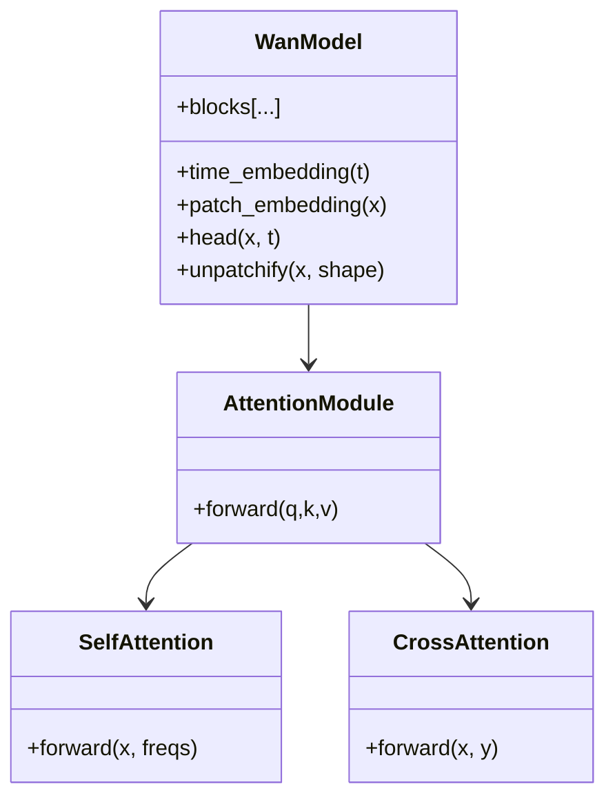

**Diagram sources**
- [wan_video_dit.py:130-200](file://diffvsynth/models/wan_video_dit.py#L130-L200)

**Section sources**
- [wan_video_dit.py:1-200](file://diffvsynth/models/wan_video_dit.py#L1-L200)

## Dependency Analysis
Inter-module dependencies:
- Pipelines depend on audio/video utils for I/O and preprocessing
- Data operators are used by unified dataset to process multimodal entries
- Models provide VAE encoders/decoders and DiTs for latent-space processing

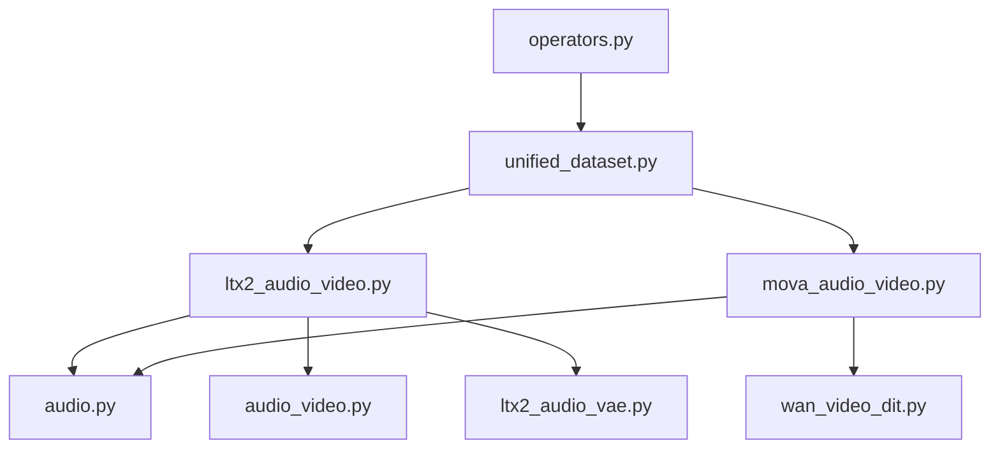

**Diagram sources**
- [ltx2_audio_video.py:1-732](file://diffvsynth/pipelines/ltx2_audio_video.py#L1-L732)
- [mova_audio_video.py:1-462](file://diffvsynth/pipelines/mova_audio_video.py#L1-L462)
- [audio.py:1-109](file://diffvsynth/utils/data/audio.py#L1-L109)
- [audio_video.py:1-135](file://diffvsynth/utils/data/audio_video.py#L1-L135)
- [ltx2_audio_vae.py:1-200](file://diffvsynth/models/ltx2_audio_vae.py#L1-L200)
- [wan_video_dit.py:1-200](file://diffvsynth/models/wan_video_dit.py#L1-L200)
- [operators.py:1-279](file://diffvsynth/core/data/operators.py#L1-L279)
- [unified_dataset.py:1-119](file://diffvsynth/core/data/unified_dataset.py#L1-L119)

**Section sources**
- [ltx2_audio_video.py:1-732](file://diffvsynth/pipelines/ltx2_audio_video.py#L1-L732)
- [mova_audio_video.py:1-462](file://diffvsynth/pipelines/mova_audio_video.py#L1-L462)
- [audio.py:1-109](file://diffvsynth/utils/data/audio.py#L1-L109)
- [audio_video.py:1-135](file://diffvsynth/utils/data/audio_video.py#L1-L135)
- [ltx2_audio_vae.py:1-200](file://diffvsynth/models/ltx2_audio_vae.py#L1-L200)
- [wan_video_dit.py:1-200](file://diffvsynth/models/wan_video_dit.py#L1-L200)
- [operators.py:1-279](file://diffvsynth/core/data/operators.py#L1-L279)
- [unified_dataset.py:1-119](file://diffvsynth/core/data/unified_dataset.py#L1-L119)

## Performance Considerations
- Attention backends:
  - Prefer Flash Attention 3/2 or SageAttention when available; fallback to SDPA
- VRAM management:
  - Use tiled VAE decoding and gradient checkpointing where supported
- Sequence parallelism:
  - Enable unified sequence parallel in MOVA pipeline for long sequences
- Codec efficiency:
  - Use libx264 with yuv420p for broad compatibility
  - Select closest supported sample rate for AAC to avoid excessive resampling
- Data loading:
  - Cache processed tensors (.pth) to reduce repeated I/O and preprocessing

[No sources needed since this section provides general guidance]

## Troubleshooting Guide
Common issues and resolutions:
- Unsupported audio backend:
  - Ensure backend is set to "torchcodec" or implement custom backend
- Sample rate mismatch:
  - Verify audio_sample_rate when muxing; infer from duration if unknown
- Dimension divisibility:
  - Enforce height/width divisible by model factors (e.g., 32/64)
- Missing models in two-stage pipeline:
  - Provide stage2_lora_config and upsampler when requested
- Large files memory pressure:
  - Use tiled decoding and chunked processing; prefer streaming readers where possible

**Section sources**
- [audio.py:78-87](file://diffvsynth/utils/data/audio.py#L78-L87)
- [audio_video.py:106-135](file://diffvsynth/utils/data/audio_video.py#L106-L135)
- [ltx2_audio_video.py:252-272](file://diffvsynth/pipelines/ltx2_audio_video.py#L252-L272)
- [mova_audio_video.py:200-210](file://diffvsynth/pipelines/mova_audio_video.py#L200-L210)

## Conclusion
The system provides a robust, modular framework for multi-modal data processing. By standardizing I/O, preprocessing, and latent-space modeling, it enables unified pipelines that combine text, images, audio, and video. The audio pipeline ensures format compatibility and precise temporal alignment, while the video pipeline leverages efficient encoders and DiT architectures for motion modeling. With configurable backends, VRAM optimizations, and sequence parallelism, the system scales to large media and complex generative tasks.

[No sources needed since this section summarizes without analyzing specific files]

## Appendices
- Example usage patterns:
  - Combine input images at specific frame indices with retake audio regions for targeted control
  - Use distilled two-stage pipeline for faster inference with reduced CFG
- Best practices:
  - Normalize inputs via ltx2_preprocess for codec consistency
  - Align audio sample rate with video FPS to maintain synchronization
  - Cache intermediate results to accelerate iterative workflows

[No sources needed since this section provides general guidance]