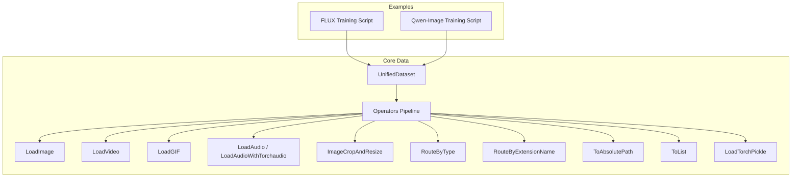
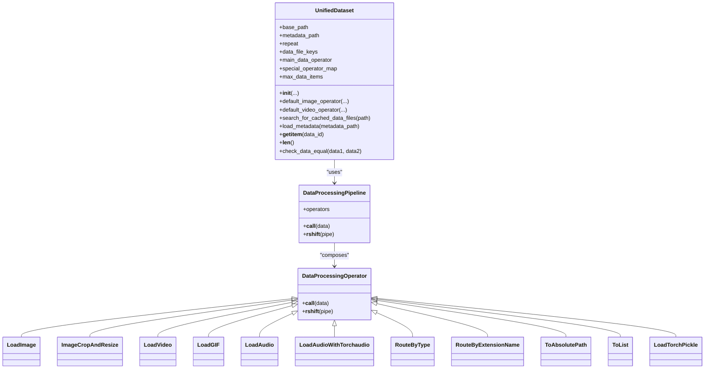
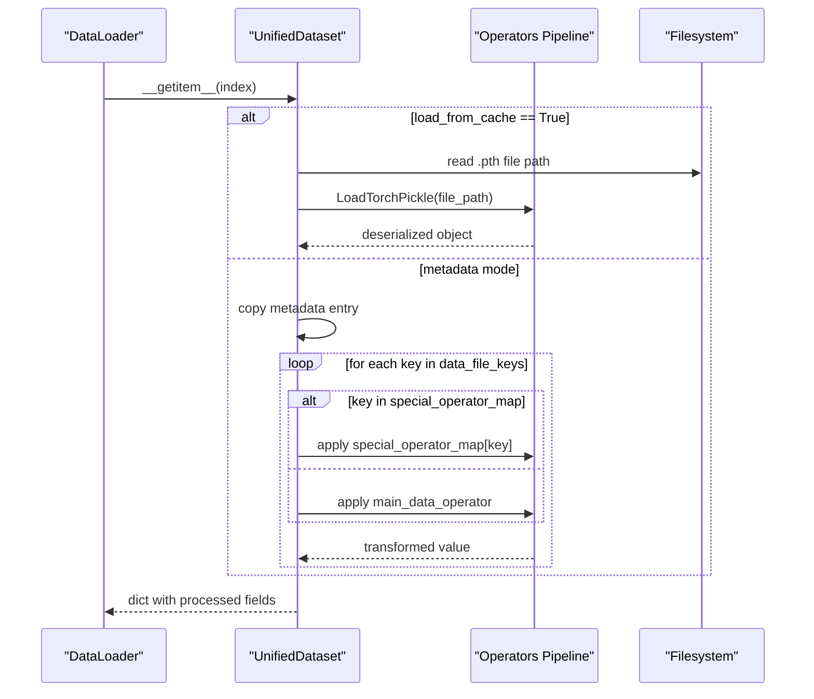
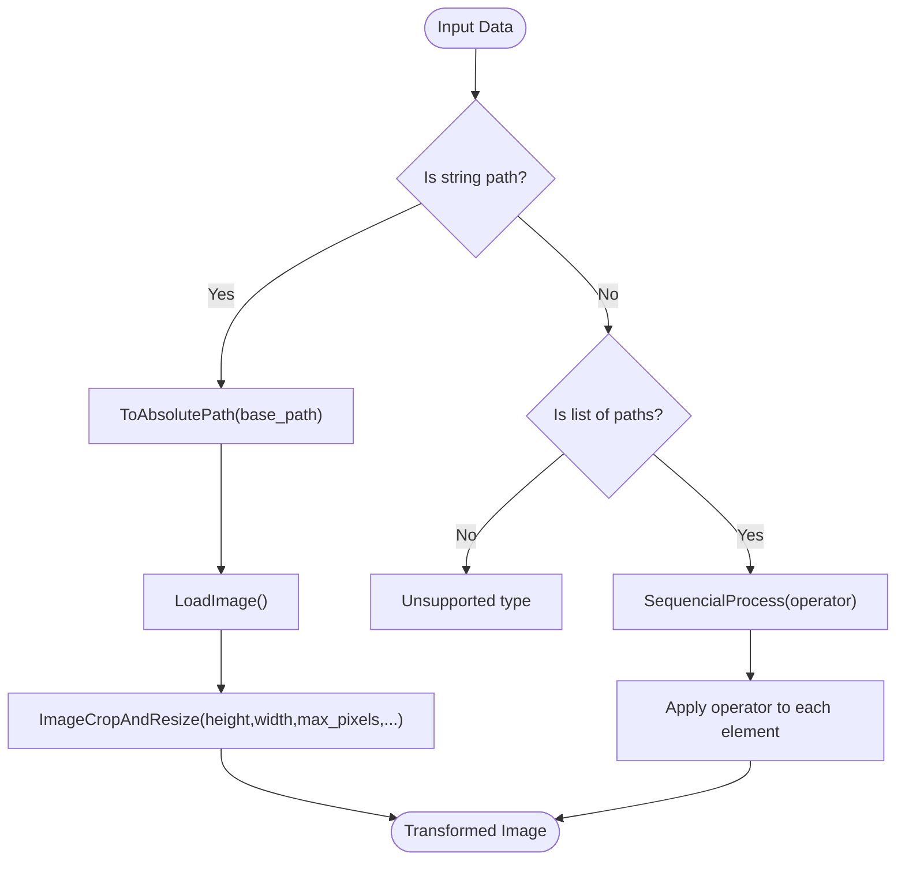
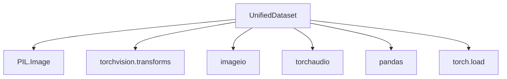

# Unified Dataset Interface

<cite>
**Referenced Files in This Document**
- [unified_dataset.py](file://diffsynth/core/data/unified_dataset.py)
- [operators.py](file://diffsynth/core/data/operators.py)
- [__init__.py](file://diffsynth/core/data/__init__.py)
- [train.py (FLUX)](file://examples/flux/model_training/train.py)
- [train.py (Qwen-Image)](file://examples/qwen_image/model_training/train.py)
- [data.md](file://docs/en/API_Reference/core/data.md)
</cite>

## Table of Contents
1. [Introduction](#introduction)
2. [Project Structure](#project-structure)
3. [Core Components](#core-components)
4. [Architecture Overview](#architecture-overview)
5. [Detailed Component Analysis](#detailed-component-analysis)
6. [Dependency Analysis](#dependency-analysis)
7. [Performance Considerations](#performance-considerations)
8. [Troubleshooting Guide](#troubleshooting-guide)
9. [Conclusion](#conclusion)
10. [Appendices](#appendices)

## Introduction
This document explains the unified dataset interface that standardizes data access across different model types and data formats. It focuses on the dataset abstraction layer, consistent APIs for loading images, videos, and audio, caching strategies, memory management, batch processing, parallel data loading, validation and schema enforcement, type conversion, and performance optimization for large-scale training and inference. The content is derived from the core data module and example training scripts that demonstrate practical usage patterns.

## Project Structure
The unified dataset interface resides under the core data module and is composed of:
- A universal dataset class providing a consistent API for various data sources and formats.
- A composable operator pipeline enabling flexible data transformations.
- Example training scripts showing how to configure datasets for specific models.

**Diagram sources**
- [unified_dataset.py:5-119](file://diffsynth/core/data/unified_dataset.py#L5-L119)
- [operators.py:8-279](file://diffsynth/core/data/operators.py#L8-L279)
- [train.py (FLUX):146-159](file://examples/flux/model_training/train.py#L146-L159)
- [train.py (Qwen-Image):115-140](file://examples/qwen_image/model_training/train.py#L115-L140)

**Section sources**
- [unified_dataset.py:5-119](file://diffsynth/core/data/unified_dataset.py#L5-L119)
- [operators.py:8-279](file://diffsynth/core/data/operators.py#L8-L279)
- [__init__.py:1-2](file://diffsynth/core/data/__init__.py#L1-L2)
- [train.py (FLUX):146-159](file://examples/flux/model_training/train.py#L146-L159)
- [train.py (Qwen-Image):115-140](file://examples/qwen_image/model_training/train.py#L115-L140)

## Core Components
- UnifiedDataset: A torch.utils.data.Dataset subclass that provides a unified API for loading and transforming data. It supports metadata-driven loading or cache-based loading, configurable repeat behavior, and per-key operators.
- Operators: A set of composable DataProcessingOperator implementations connected via a pipeline mechanism using the >> operator. Includes loaders (image, video, GIF, audio), transformers (crop/resize, type conversions), and routing utilities (by type or extension).

Key responsibilities:
- Consistent __getitem__ and __len__ interfaces for PyTorch DataLoader integration.
- Flexible data pipelines for heterogeneous inputs (strings, lists, paths).
- Optional metadata parsing (JSON, JSONL, CSV) and cached .pth file loading.
- Repeatable iteration and optional max item cap.

**Section sources**
- [unified_dataset.py:5-119](file://diffsynth/core/data/unified_dataset.py#L5-L119)
- [operators.py:8-279](file://diffsynth/core/data/operators.py#L8-L279)
- [data.md:1-38](file://docs/en/API_Reference/core/data.md#L1-L38)

## Architecture Overview
The dataset architecture centers around a composable operator pipeline and a unified dataset loader. The dataset can operate in two modes:
- Metadata mode: Reads entries from JSON/JSONL/CSV and applies per-key operators to transform fields.
- Cache mode: Scans base_path for .pth files, loads them with a torch pickle loader, and repeats as configured.

**Diagram sources**
- [unified_dataset.py:5-119](file://diffsynth/core/data/unified_dataset.py#L5-L119)
- [operators.py:8-279](file://diffsynth/core/data/operators.py#L8-L279)

## Detailed Component Analysis

### UnifiedDataset
UnifiedDataset abstracts data access by:
- Accepting either a metadata path or operating in cache mode.
- Applying a main_data_operator to specified keys unless overridden by special_operator_map.
- Supporting default image/video operators that route by input type and file extension.

Important behaviors:
- __getitem__: If load_from_cache is True, it loads a .pth file via LoadTorchPickle; otherwise, it reads metadata and applies per-key operators.
- __len__: Supports repeat multiplier and optional max_data_items cap.
- search_for_cached_data_files: Recursively finds .pth files under base_path when no metadata is provided.
- load_metadata: Parses JSON, JSONL, or CSV into a list of dicts.

Usage examples:
- FLUX training script configures a default image operator with absolute path resolution, image loading, and crop/resize.
- Qwen-Image training script demonstrates custom special_operator_map for RGBA handling and optional context images.

**Diagram sources**
- [unified_dataset.py:89-110](file://diffsynth/core/data/unified_dataset.py#L89-L110)
- [operators.py:232-238](file://diffsynth/core/data/operators.py#L232-L238)

**Section sources**
- [unified_dataset.py:5-119](file://diffsynth/core/data/unified_dataset.py#L5-L119)
- [train.py (FLUX):146-159](file://examples/flux/model_training/train.py#L146-L159)
- [train.py (Qwen-Image):115-140](file://examples/qwen_image/model_training/train.py#L115-L140)

### Operators Pipeline and Operators
The operator system enables building robust data pipelines:
- DataProcessingPipeline chains operators and supports composition via >>.
- DataProcessingOperator defines the interface and default composition behavior.
- Concrete operators include:
  - Type conversions: ToInt, ToFloat, ToStr, ToList
  - File I/O: LoadImage, LoadVideo, LoadGIF, LoadAudio, LoadAudioWithTorchaudio, LoadTorchPickle
  - Transformations: ImageCropAndResize
  - Routing: RouteByType, RouteByExtensionName
  - Path handling: ToAbsolutePath

Key design points:
- RouteByType selects an operator based on Python type of input data (e.g., str vs list).
- RouteByExtensionName selects an operator based on file extension.
- FrameSamplerByRateMixin provides frame sampling logic for video/audio loaders with time-based constraints.

**Diagram sources**
- [operators.py:221-229](file://diffsynth/core/data/operators.py#L221-L229)
- [operators.py:171-177](file://diffsynth/core/data/operators.py#L171-L177)
- [operators.py:57-103](file://diffsynth/core/data/operators.py#L57-L103)

**Section sources**
- [operators.py:8-279](file://diffsynth/core/data/operators.py#L8-L279)
- [data.md:1-38](file://docs/en/API_Reference/core/data.md#L1-L38)

### Default Image and Video Operators
UnifiedDataset provides static factory methods to build common pipelines:
- default_image_operator: Routes by type (str or list), resolves paths, loads images, and resizes/crops according to constraints.
- default_video_operator: Routes by file extension (images, GIF, video containers), applies frame sampling and per-frame transforms.

These helpers simplify dataset configuration for typical use cases while remaining customizable through special_operator_map.

**Section sources**
- [unified_dataset.py:28-60](file://diffsynth/core/data/unified_dataset.py#L28-L60)
- [operators.py:149-206](file://diffsynth/core/data/operators.py#L149-L206)

### Caching Strategy and Memory Management
Caching strategy:
- When metadata_path is None, UnifiedDataset searches base_path recursively for .pth files and treats them as preprocessed items.
- Items are loaded via LoadTorchPickle(map_location="cpu") by default, which avoids unnecessary GPU memory pressure during dataset iteration.

Memory considerations:
- Use max_data_items to limit dataset length for debugging or constrained environments.
- Prefer cache mode for large datasets to avoid repeated IO and transformation overhead.
- Combine with DataLoader num_workers for parallel prefetching.

**Section sources**
- [unified_dataset.py:62-74](file://diffsynth/core/data/unified_dataset.py#L62-L74)
- [operators.py:232-238](file://diffsynth/core/data/operators.py#L232-L238)

### Batch Processing and Parallel Data Loading
Integration with PyTorch DataLoader:
- UnifiedDataset implements __getitem__ and __len__, making it compatible with DataLoader batching.
- For parallel loading, configure DataLoader(num_workers=N, pin_memory=True) to overlap data loading and preprocessing with training.
- Ensure deterministic behavior if needed by setting appropriate seed and worker initialization.

Best practices:
- Keep transformations lightweight in __getitem__ to avoid bottlenecks.
- Precompute heavy operations and store results in cache (.pth) where feasible.
- Use repeat to simulate epoch boundaries without duplicating data in memory.

[No sources needed since this section provides general guidance]

### Data Validation, Schema Enforcement, and Type Conversion
Validation and enforcement:
- RouteByType ensures correct handling of different input types (e.g., single path vs list of paths).
- RouteByExtensionName enforces supported file extensions and raises errors for unsupported formats.
- ToStr, ToInt, ToFloat provide explicit type conversions.

Schema guidance:
- In metadata mode, ensure each entry contains required keys listed in data_file_keys.
- Use special_operator_map to handle optional or conditional fields gracefully (e.g., returning None for missing context images).

Error handling:
- Unsupported file types raise ValueError in RouteByExtensionName.
- Audio loading failures warn and return None to prevent crashes.

**Section sources**
- [operators.py:209-229](file://diffsynth/core/data/operators.py#L209-L229)
- [operators.py:257-279](file://diffsynth/core/data/operators.py#L257-L279)

### Creating Custom Datasets and Integrating Existing Sources
Customization approaches:
- Provide a metadata.json/jsonl/csv describing entries and their fields.
- Define main_data_operator for common fields and special_operator_map for field-specific transformations.
- Reuse existing operators (LoadImage, ImageCropAndResize, etc.) to compose new pipelines.

Example integrations:
- FLUX training uses default_image_operator with absolute path resolution and resizing.
- Qwen-Image training adds RGBA support and optional context images via special_operator_map.

Guidelines:
- Keep base_path consistent across metadata entries and operators.
- Validate paths exist before training to catch issues early.
- Use repeat to control effective dataset size for experiments.

**Section sources**
- [train.py (FLUX):146-159](file://examples/flux/model_training/train.py#L146-L159)
- [train.py (Qwen-Image):115-140](file://examples/qwen_image/model_training/train.py#L115-L140)

## Dependency Analysis
The dataset module depends on:
- torch.utils.data.Dataset for compatibility with PyTorch dataloaders.
- PIL, torchvision for image operations.
- imageio and torchaudio for media loading.
- pandas for CSV parsing in metadata mode.

External dependencies:
- Optional libraries like librosa may be used indirectly through audio operators.
- No circular dependencies within the core data module.

**Diagram sources**
- [unified_dataset.py:1-3](file://diffsynth/core/data/unified_dataset.py#L1-L3)
- [operators.py:1-6](file://diffsynth/core/data/operators.py#L1-L6)

**Section sources**
- [unified_dataset.py:1-3](file://diffsynth/core/data/unified_dataset.py#L1-L3)
- [operators.py:1-6](file://diffsynth/core/data/operators.py#L1-L6)

## Performance Considerations
Optimization recommendations:
- Preprocess and cache heavy transformations into .pth files to reduce runtime overhead.
- Use DataLoader with multiple workers and pinned memory to maximize throughput.
- Limit dataset length with max_data_items during development or limited-resource runs.
- Choose appropriate height_division_factor and width_division_factor to align with model requirements (e.g., 16 for many vision models).
- Avoid excessive resizing or format conversions in __getitem__; prefer precomputed outputs.
- For large videos, consider frame sampling parameters to balance quality and speed.

[No sources needed since this section provides general guidance]

## Troubleshooting Guide
Common issues and resolutions:
- Unsupported file extension: Ensure RouteByExtensionName includes all relevant extensions or adjust metadata paths.
- Missing metadata keys: Verify data_file_keys matches actual fields in metadata entries.
- Audio loading failures: Warnings indicate fallback to None; check file integrity and backend availability.
- Slow data loading: Increase num_workers, enable pin_memory, and consider caching.
- Memory pressure: Reduce repeat, use cache mode, and offload heavy tensors to CPU.

Debugging aids:
- check_data_equal compares two datasets for equality (debug-only).
- Use print statements in load_metadata and search_for_cached_data_files to verify paths and counts.

**Section sources**
- [unified_dataset.py:111-119](file://diffsynth/core/data/unified_dataset.py#L111-L119)
- [operators.py:257-279](file://diffsynth/core/data/operators.py#L257-L279)

## Conclusion
The unified dataset interface offers a flexible, composable, and efficient way to standardize data access across diverse model types and formats. By leveraging operator pipelines, caching strategies, and consistent APIs, it simplifies dataset creation, validation, and performance tuning. The provided examples demonstrate practical configurations for image-centric models, while the operator framework supports extensibility for custom data sources and transformations.

[No sources needed since this section summarizes without analyzing specific files]

## Appendices
- API reference for operators and dataset usage is available in the documentation.
- Example training scripts illustrate real-world configurations and best practices.

**Section sources**
- [data.md:1-38](file://docs/en/API_Reference/core/data.md#L1-L38)
- [train.py (FLUX):146-159](file://examples/flux/model_training/train.py#L146-L159)
- [train.py (Qwen-Image):115-140](file://examples/qwen_image/model_training/train.py#L115-L140)